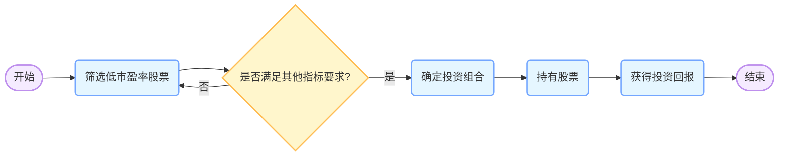

# 约翰·奈夫的低市盈率投资法：简单而有效的价值策略

> 关键词：约翰·奈夫、低市盈率投资法、价值策略、股票投资、财务分析、市场估值、投资回报

> 摘要：本文深入探讨了约翰·奈夫的低市盈率投资法这一简单而有效的价值策略。首先介绍了该投资法产生的背景及相关概念，详细阐述了其核心概念、算法原理和数学模型。通过项目实战案例，展示了如何在实际中运用低市盈率投资法进行股票投资，并分析其代码实现。接着探讨了该投资法的实际应用场景，推荐了相关的学习资源、开发工具和论文著作。最后总结了低市盈率投资法的未来发展趋势与挑战，解答常见问题并提供扩展阅读和参考资料，旨在帮助投资者更好地理解和运用这一经典投资策略。

## 1. 背景介绍 
### 1.1 目的和范围
本文的目的在于全面、深入地剖析约翰·奈夫的低市盈率投资法，使读者能够透彻理解这一价值投资策略的原理、操作方法以及实际应用。我们将涵盖低市盈率投资法的理论基础、核心算法、数学模型，通过具体的项目实战案例展示其在股票投资中的应用，探讨其在不同市场环境下的适用性和局限性。同时，为读者提供丰富的学习资源和相关工具，帮助读者进一步深入研究和实践这一投资策略。

### 1.2 预期读者
本文预期读者包括对股票投资有兴趣的初学者，希望通过系统学习价值投资策略来提升投资水平；有一定投资经验的投资者，希望借鉴低市盈率投资法优化自己的投资组合；金融专业的学生和研究人员，希望深入了解经典投资策略的理论和实践；以及从事金融行业的从业者，如投资顾问、基金经理等，希望从约翰·奈夫的投资理念中获取新的思路和方法。

### 1.3 文档结构概述
本文将按照以下结构展开：首先介绍低市盈率投资法的背景信息，包括目的、预期读者和文档结构概述，以及相关术语的定义和解释。接着阐述低市盈率投资法的核心概念和它们之间的联系，通过文本示意图和 Mermaid 流程图进行直观展示。然后详细讲解核心算法原理和具体操作步骤，并使用 Python 源代码进行说明。之后介绍低市盈率投资法的数学模型和公式，并结合实际例子进行详细讲解。通过项目实战，展示低市盈率投资法在实际股票投资中的应用，包括开发环境搭建、源代码实现和代码解读。探讨低市盈率投资法的实际应用场景，为读者提供在不同市场环境下的应用思路。推荐相关的学习资源、开发工具和论文著作，帮助读者进一步深入学习和研究。最后总结低市盈率投资法的未来发展趋势与挑战，解答常见问题并提供扩展阅读和参考资料。

### 1.4 术语表
#### 1.4.1 核心术语定义
- **低市盈率投资法**：由约翰·奈夫提出的一种价值投资策略，该策略主要关注股票的市盈率指标，倾向于投资市盈率较低的股票，认为这类股票可能被市场低估，具有较大的投资价值。
- **市盈率（P/E）**：是指股票价格除以每股收益（EPS）的比率，它反映了投资者为获取公司每一元盈利所愿意支付的价格，是衡量股票估值的重要指标之一。
- **价值投资**：一种投资理念，强调通过分析公司的基本面，寻找被市场低估的股票，以低于其内在价值的价格买入，等待市场对其价值进行重新评估，从而获得投资回报。
- **内在价值**：公司股票所实际具有的价值，它基于公司的财务状况、盈利能力、行业前景等多种因素，是公司真实价值的体现。

#### 1.4.2 相关概念解释
- **市场效率**：指市场价格反映资产真实价值的程度。在有效市场中，股票价格能够迅速、准确地反映所有可用信息，而在无效市场中，股票价格可能偏离其内在价值，为低市盈率投资法提供了机会。
- **股息收益率**：是指股息与股票价格的比率，它反映了投资者通过股息获得的投资回报。低市盈率投资法通常也会关注股息收益率，认为具有较高股息收益率的低市盈率股票更具投资价值。
- **风险承受能力**：投资者在投资过程中能够承受的风险水平，它受到投资者的财务状况、投资目标、投资经验等多种因素的影响。低市盈率投资法虽然被认为是一种相对稳健的投资策略，但投资者仍需根据自己的风险承受能力进行投资决策。

#### 1.4.3 缩略词列表
- **P/E**：市盈率（Price-to-Earnings Ratio）
- **EPS**：每股收益（Earnings Per Share）

## 2. 核心概念与联系 

### 核心概念原理
低市盈率投资法的核心原理基于价值投资的理念，即市场并非总是有效的，股票价格可能会偏离其内在价值。市盈率是衡量股票估值的重要指标之一，低市盈率意味着投资者为获取公司每一元盈利所支付的价格相对较低。约翰·奈夫认为，低市盈率的股票往往被市场忽视或误解，存在被低估的可能性。通过投资这些被低估的股票，当市场重新认识到其价值时，股票价格可能会上涨，从而为投资者带来超额回报。

同时，低市盈率投资法并非仅仅关注市盈率这一单一指标。奈夫还会综合考虑公司的股息收益率、盈利增长前景、财务状况等因素。例如，具有较高股息收益率的低市盈率股票不仅可以为投资者提供稳定的现金流，还可能暗示公司具有较强的盈利能力和财务稳定性。盈利增长前景则是评估公司未来发展潜力的重要因素，即使当前市盈率较低，如果公司盈利增长乏力，其投资价值也可能有限。

### 架构的文本示意图
```plaintext
低市盈率投资法
|-- 核心指标
|   |-- 市盈率（P/E）
|   |-- 股息收益率
|   |-- 盈利增长前景
|   |-- 财务状况
|-- 投资决策
|   |-- 筛选低市盈率股票
|   |-- 综合评估其他指标
|   |-- 确定投资组合
|-- 投资回报
|   |-- 股价上涨收益
|   |-- 股息收益
```

### Mermaid 流程图


## 3. 核心算法原理 & 具体操作步骤 

### 核心算法原理
低市盈率投资法的核心算法主要围绕股票的筛选和评估展开。首先，需要计算股票的市盈率，公式为：
$$P/E = \frac{股票价格}{每股收益}$$
然后，根据市场情况和投资者的风险偏好，设定一个合理的市盈率阈值，筛选出市盈率低于该阈值的股票。接着，对筛选出的股票进行综合评估，考虑股息收益率、盈利增长前景、财务状况等因素。

股息收益率的计算公式为：
$$股息收益率 = \frac{每股股息}{股票价格} \times 100\%$$
盈利增长前景可以通过分析公司的历史盈利数据、行业前景、公司的战略规划等进行评估。财务状况可以通过分析公司的资产负债表、利润表、现金流量表等财务报表来评估，常用的指标包括资产负债率、流动比率、净资产收益率等。

### 具体操作步骤
1. **数据收集**：收集股票的相关数据，包括股票价格、每股收益、每股股息、财务报表等。这些数据可以从金融数据提供商、证券交易所网站、公司年报等渠道获取。
2. **计算市盈率和股息收益率**：根据上述公式计算股票的市盈率和股息收益率。
3. **筛选低市盈率股票**：设定一个市盈率阈值，例如市场平均市盈率的 70%，筛选出市盈率低于该阈值的股票。
4. **综合评估其他指标**：对筛选出的股票进行综合评估，考虑股息收益率、盈利增长前景、财务状况等因素。可以设定一些具体的指标阈值，例如股息收益率不低于 3%，资产负债率不高于 50% 等，排除不符合要求的股票。
5. **确定投资组合**：根据综合评估的结果，确定投资组合。可以根据股票的估值、风险、预期回报等因素，合理分配资金到不同的股票上。
6. **定期监控和调整**：定期监控投资组合中的股票，根据公司的财务状况、市场情况等因素，及时调整投资组合。

### Python 源代码实现
```python
import pandas as pd

# 示例数据：股票代码、股票价格、每股收益、每股股息
data = {
    'stock_code': ['000001', '000002', '000003', '000004'],
    'stock_price': [10, 20, 30, 40],
    'eps': [1, 2, 3, 4],
    'dividend': [0.5, 1, 1.5, 2]
}

df = pd.DataFrame(data)

# 计算市盈率和股息收益率
df['pe_ratio'] = df['stock_price'] / df['eps']
df['dividend_yield'] = df['dividend'] / df['stock_price'] * 100

# 设定市盈率阈值和股息收益率阈值
pe_threshold = df['pe_ratio'].mean() * 0.7
dividend_yield_threshold = 3

# 筛选低市盈率股票
low_pe_stocks = df[df['pe_ratio'] < pe_threshold]

# 综合评估其他指标
selected_stocks = low_pe_stocks[low_pe_stocks['dividend_yield'] >= dividend_yield_threshold]

print(selected_stocks)
```

### 代码解释
1. **数据收集**：使用 Pandas 库创建一个包含股票代码、股票价格、每股收益、每股股息的 DataFrame。
2. **计算市盈率和股息收益率**：根据公式计算股票的市盈率和股息收益率，并将结果添加到 DataFrame 中。
3. **筛选低市盈率股票**：计算市盈率的平均值，并将其乘以 0.7 作为市盈率阈值，筛选出市盈率低于该阈值的股票。
4. **综合评估其他指标**：设定股息收益率阈值为 3%，筛选出股息收益率不低于该阈值的股票。
5. **输出结果**：打印出筛选出的股票信息。

## 4. 数学模型和公式 & 详细讲解 & 举例说明 

### 市盈率（P/E）
市盈率是低市盈率投资法中最核心的指标之一，其计算公式为：
$$P/E = \frac{股票价格}{每股收益}$$
**详细讲解**：市盈率反映了投资者为获取公司每一元盈利所愿意支付的价格。较低的市盈率可能意味着股票被市场低估，具有较高的投资价值；而较高的市盈率可能意味着股票被市场高估，投资风险相对较高。

**举例说明**：假设股票 A 的价格为 20 元，每股收益为 2 元，则其市盈率为：
$$P/E_A = \frac{20}{2} = 10$$
假设股票 B 的价格为 30 元，每股收益为 1 元，则其市盈率为：
$$P/E_B = \frac{30}{1} = 30$$
在其他条件相同的情况下，股票 A 的市盈率较低，可能更具投资价值。

### 股息收益率
股息收益率的计算公式为：
$$股息收益率 = \frac{每股股息}{股票价格} \times 100\%$$
**详细讲解**：股息收益率反映了投资者通过股息获得的投资回报。较高的股息收益率意味着投资者可以获得更多的现金流，同时也可能暗示公司具有较强的盈利能力和财务稳定性。

**举例说明**：假设股票 C 的价格为 50 元，每股股息为 2 元，则其股息收益率为：
$$股息收益率_C = \frac{2}{50} \times 100\% = 4\%$$
假设股票 D 的价格为 100 元，每股股息为 3 元，则其股息收益率为：
$$股息收益率_D = \frac{3}{100} \times 100\% = 3\%$$
在其他条件相同的情况下，股票 C 的股息收益率较高，可能更受投资者青睐。

### 盈利增长模型
盈利增长模型可以用来评估公司的盈利增长前景，常用的模型有戈登增长模型（Gordon Growth Model），其公式为：
$$V = \frac{D_1}{r - g}$$
其中：
- $V$ 为股票的内在价值
- $D_1$ 为下一期的股息
- $r$ 为投资者要求的回报率
- $g$ 为股息的增长率

**详细讲解**：戈登增长模型假设公司的股息以固定的增长率 $g$ 增长，投资者要求的回报率为 $r$。通过该模型可以计算出股票的内在价值 $V$，并与当前股票价格进行比较，判断股票是否被低估或高估。

**举例说明**：假设公司 E 下一期的股息 $D_1$ 为 2 元，投资者要求的回报率 $r$ 为 10%，股息的增长率 $g$ 为 5%，则该股票的内在价值为：
$$V = \frac{2}{0.1 - 0.05} = 40$$
如果当前股票价格为 30 元，则该股票可能被低估，具有投资价值。

### 财务比率分析
财务比率分析可以用来评估公司的财务状况，常用的指标包括资产负债率、流动比率、净资产收益率等。

- **资产负债率**：计算公式为：
$$资产负债率 = \frac{负债总额}{资产总额} \times 100\%$$
**详细讲解**：资产负债率反映了公司的负债水平，较高的资产负债率意味着公司的财务风险相对较高。

**举例说明**：假设公司 F 的负债总额为 500 万元，资产总额为 1000 万元，则其资产负债率为：
$$资产负债率_F = \frac{500}{1000} \times 100\% = 50\%$$

- **流动比率**：计算公式为：
$$流动比率 = \frac{流动资产}{流动负债}$$
**详细讲解**：流动比率反映了公司的短期偿债能力，较高的流动比率意味着公司具有较强的短期偿债能力。

**举例说明**：假设公司 G 的流动资产为 800 万元，流动负债为 400 万元，则其流动比率为：
$$流动比率_G = \frac{800}{400} = 2$$

- **净资产收益率**：计算公式为：
$$净资产收益率 = \frac{净利润}{净资产} \times 100\%$$
**详细讲解**：净资产收益率反映了公司的盈利能力，较高的净资产收益率意味着公司具有较强的盈利能力。

**举例说明**：假设公司 H 的净利润为 200 万元，净资产为 1000 万元，则其净资产收益率为：
$$净资产收益率_H = \frac{200}{1000} \times 100\% = 20\%$$

## 5. 项目实战：代码实际案例和详细解释说明 

### 5.1  开发环境搭建
1. **安装 Python**：从 Python 官方网站（https://www.python.org/downloads/）下载并安装 Python 3.x 版本。
2. **安装必要的库**：使用以下命令安装 Pandas、Numpy 等必要的库：
```sh
pip install pandas numpy
```
3. **数据获取**：可以使用金融数据接口，如 Tushare、BaoStock 等获取股票的相关数据。以 Tushare 为例，首先需要在 Tushare 官网（https://tushare.pro/）注册并获取 token，然后使用以下命令安装 Tushare：
```sh
pip install tushare
```

### 5.2  源代码详细实现和代码解读
```python
import tushare as ts
import pandas as pd
import numpy as np

# 设置 Tushare token
ts.set_token('your_token')
pro = ts.pro_api()

# 获取股票数据
def get_stock_data(ts_code, start_date, end_date):
    df = pro.daily_basic(ts_code=ts_code, start_date=start_date, end_date=end_date, fields='ts_code, trade_date, close, pe_ttm, pb, ps, total_share, circ_share, dv_ratio')
    return df

# 筛选低市盈率股票
def select_low_pe_stocks(df, pe_threshold):
    low_pe_stocks = df[df['pe_ttm'] < pe_threshold]
    return low_pe_stocks

# 综合评估其他指标
def comprehensive_evaluation(df, dividend_yield_threshold):
    selected_stocks = df[df['dv_ratio'] >= dividend_yield_threshold]
    return selected_stocks

# 主函数
def main():
    # 获取股票数据
    stock_list = ['000001.SZ', '000002.SZ', '000003.SZ']  # 示例股票列表
    start_date = '20200101'
    end_date = '20211231'
    all_stock_data = pd.DataFrame()
    for ts_code in stock_list:
        stock_data = get_stock_data(ts_code, start_date, end_date)
        all_stock_data = pd.concat([all_stock_data, stock_data])

    # 计算市盈率阈值
    pe_threshold = all_stock_data['pe_ttm'].mean() * 0.7

    # 筛选低市盈率股票
    low_pe_stocks = select_low_pe_stocks(all_stock_data, pe_threshold)

    # 设定股息收益率阈值
    dividend_yield_threshold = 3

    # 综合评估其他指标
    selected_stocks = comprehensive_evaluation(low_pe_stocks, dividend_yield_threshold)

    print(selected_stocks)

if __name__ == '__main__':
    main()
```

### 5.3  代码解读与分析
1. **数据获取**：使用 Tushare 接口获取股票的相关数据，包括股票代码、交易日期、收盘价、滚动市盈率、市净率、市销率、总股本、流通股本、股息率等。
2. **筛选低市盈率股票**：计算所有股票的滚动市盈率平均值，并将其乘以 0.7 作为市盈率阈值，筛选出市盈率低于该阈值的股票。
3. **综合评估其他指标**：设定股息收益率阈值为 3%，筛选出股息收益率不低于该阈值的股票。
4. **输出结果**：打印出筛选出的股票信息。

通过这个项目实战，我们可以看到如何使用 Python 实现低市盈率投资法的股票筛选过程。在实际应用中，还可以进一步完善代码，例如增加对盈利增长前景、财务状况等指标的评估，以及对投资组合的优化等。

## 6. 实际应用场景 
### 熊市环境
在熊市环境中，市场整体表现不佳，投资者情绪悲观，股票价格普遍下跌。此时，低市盈率投资法具有一定的优势。由于市场的恐慌情绪，许多优质股票的价格可能被过度打压，市盈率大幅下降。通过低市盈率投资法，投资者可以筛选出那些被低估的股票，以较低的价格买入。当市场逐渐回暖时，这些股票的价格可能会有较大的上涨空间，为投资者带来丰厚的回报。例如，在 2008 年全球金融危机期间，许多股票的市盈率大幅下降，一些采用低市盈率投资法的投资者在市场底部买入了被低估的股票，在随后的市场反弹中获得了可观的收益。

### 震荡市环境
在震荡市环境中，市场缺乏明显的趋势，股票价格在一定范围内波动。低市盈率投资法可以帮助投资者在波动的市场中寻找相对稳定的投资机会。投资者可以通过筛选低市盈率的股票，构建一个相对稳健的投资组合。这些股票由于估值较低，下跌空间相对有限，同时可能具有较高的股息收益率，为投资者提供一定的现金流。例如，在市场震荡期间，一些业绩稳定、股息率较高的蓝筹股可能会受到低市盈率投资者的青睐。

### 行业轮动环境
在行业轮动频繁的市场环境中，低市盈率投资法可以帮助投资者捕捉不同行业的投资机会。不同行业的市盈率水平可能存在较大差异，一些传统行业的市盈率可能相对较低，而一些新兴行业的市盈率可能较高。投资者可以通过分析不同行业的市盈率变化，适时调整投资组合，投资于当前市盈率较低的行业。例如，当科技行业的市盈率过高时，投资者可以将部分资金转移到市盈率较低的消费、金融等行业。

### 长期投资场景
低市盈率投资法非常适合长期投资。长期来看，市场会逐渐回归理性，股票价格会向其内在价值靠拢。通过投资低市盈率的股票，投资者可以分享公司的成长和盈利增长带来的收益。同时，低市盈率股票通常具有较高的股息收益率，投资者可以通过股息获得稳定的现金流。例如，一些长期采用低市盈率投资法的投资者，通过持有被低估的股票多年，不仅获得了股票价格上涨的收益，还获得了丰厚的股息回报。

## 7. 工具和资源推荐
### 7.1 学习资源推荐
#### 7.1.1 书籍推荐
- 《约翰·奈夫的成功投资》：这是约翰·奈夫本人撰写的投资著作，详细介绍了他的投资理念、策略和方法，是学习低市盈率投资法的必读之书。
- 《聪明的投资者》：本杰明·格雷厄姆的经典著作，被誉为价值投资的圣经。书中阐述了价值投资的基本原理和方法，对低市盈率投资法有重要的指导意义。
- 《证券分析》：同样是本杰明·格雷厄姆的著作，是价值投资领域的权威书籍，深入探讨了公司基本面分析和股票估值的方法。

#### 7.1.2 在线课程
- Coursera 上的“投资学原理”：该课程由知名大学的教授授课，系统介绍了投资学的基本原理和方法，包括价值投资策略。
- 网易云课堂上的“股票投资实战课程”：课程结合实际案例，讲解股票投资的技巧和方法，对低市盈率投资法有详细的讲解和分析。

#### 7.1.3 技术博客和网站
- 雪球网：国内知名的投资交流社区，有许多投资者分享自己的投资经验和心得，包括低市盈率投资法的应用案例。
- 东方财富网：提供丰富的金融资讯和股票数据，投资者可以通过该网站获取股票的市盈率、股息收益率等相关数据，辅助投资决策。

### 7.2 开发工具框架推荐
#### 7.2.1 IDE和编辑器
- PyCharm：一款专业的 Python 集成开发环境，具有强大的代码编辑、调试和分析功能，适合开发和调试低市盈率投资法的 Python 代码。
- Jupyter Notebook：一种交互式的开发环境，适合进行数据分析和实验。投资者可以使用 Jupyter Notebook 进行股票数据的分析和可视化，验证低市盈率投资法的有效性。

#### 7.2.2 调试和性能分析工具
- pdb：Python 内置的调试工具，可以帮助开发者逐行调试代码，查找和解决问题。
- cProfile：Python 的性能分析工具，可以分析代码的运行时间和性能瓶颈，帮助开发者优化代码。

#### 7.2.3 相关框架和库
- Pandas：用于数据处理和分析的 Python 库，提供了丰富的数据结构和函数，方便投资者处理和分析股票数据。
- Numpy：用于科学计算的 Python 库，提供了高效的数组和矩阵运算功能，可用于股票数据的计算和分析。
- Matplotlib：用于数据可视化的 Python 库，可以将股票数据以图表的形式展示出来，帮助投资者直观地分析数据。

### 7.3 相关论文著作推荐
#### 7.3.1 经典论文
- Fama, E. F., & French, K. R. (1992). The cross-section of expected stock returns. The Journal of Finance, 47(2), 427-465. 该论文提出了著名的 Fama-French 三因子模型，对股票收益的影响因素进行了深入研究，对低市盈率投资法的理论基础有重要的参考价值。
- Graham, B., & Dodd, D. L. (1934). Security Analysis. McGraw-Hill. 本杰明·格雷厄姆和戴维·多德的经典著作，奠定了价值投资的理论基础，对低市盈率投资法的发展产生了深远影响。

#### 7.3.2 最新研究成果
- Asness, C. S., Frazzini, A., & Pedersen, L. H. (2019). Quality minus junk. The Journal of Financial Economics, 131(1), 1-27. 该论文研究了股票的质量因素对投资回报的影响，为低市盈率投资法提供了新的视角和思路。
- Green, T. C., Hand, J. R. M., & Zhang, X. (2017). The long-run performance of low-accrual stocks. Journal of Accounting and Economics, 64(1), 49-70. 该论文研究了低应计项目股票的长期表现，对低市盈率投资法的选股策略有一定的启示作用。

#### 7.3.3 应用案例分析
- 一些知名投资机构的研究报告，如巴菲特的伯克希尔·哈撒韦公司的年报，会分享其投资策略和案例分析，投资者可以从中学习到低市盈率投资法在实际应用中的经验和技巧。

## 8. 总结：未来发展趋势与挑战
### 未来发展趋势
1. **与其他投资策略融合**：低市盈率投资法可能会与其他投资策略，如成长投资、动量投资等融合，形成更加多元化的投资策略。例如，在筛选低市盈率股票的基础上，结合公司的盈利增长前景和市场动量，选择具有更高投资价值的股票。
2. **量化投资的应用**：随着金融科技的发展，量化投资越来越受到关注。低市盈率投资法可以通过量化模型进行更加精准的股票筛选和投资决策。投资者可以利用大数据、机器学习等技术，对大量的股票数据进行分析和挖掘，优化低市盈率投资法的选股策略。
3. **全球市场的拓展**：低市盈率投资法不仅适用于国内市场，也可以应用于全球市场。随着全球金融市场的一体化，投资者可以通过投资海外市场的低市盈率股票，分散投资风险，获取更高的投资回报。

### 挑战
1. **市场有效性提高**：随着市场信息的传播速度加快和投资者教育水平的提高，市场的有效性可能会逐渐提高。这意味着股票价格可能会更快地反映其内在价值，低市盈率股票被低估的机会可能会减少，低市盈率投资法的超额收益可能会降低。
2. **行业变革加速**：随着科技的快速发展，一些传统行业可能会面临巨大的挑战，而一些新兴行业可能会迅速崛起。低市盈率投资法可能会过于关注传统行业的低市盈率股票，而错过新兴行业的投资机会。
3. **宏观经济环境变化**：宏观经济环境的变化，如利率波动、通货膨胀、经济衰退等，可能会对低市盈率投资法的效果产生影响。例如，在利率上升的环境下，低市盈率股票的吸引力可能会下降，投资者可能会更倾向于投资固定收益类资产。

## 9. 附录：常见问题与解答
### 问题 1：低市盈率股票一定具有投资价值吗？
答：不一定。低市盈率只是一个参考指标，不能仅仅根据市盈率来判断股票的投资价值。还需要综合考虑公司的股息收益率、盈利增长前景、财务状况等因素。例如，一些公司可能由于业绩下滑、行业前景不佳等原因导致市盈率较低，这类股票可能并不具有投资价值。

### 问题 2：如何确定合理的市盈率阈值？
答：合理的市盈率阈值没有固定的标准，需要根据市场情况、行业特点和投资者的风险偏好来确定。一般可以参考市场平均市盈率、行业平均市盈率等指标。例如，可以将市场平均市盈率的 70% - 80% 作为市盈率阈值。同时，还需要结合其他指标进行综合判断。

### 问题 3：低市盈率投资法适合短期投资还是长期投资？
答：低市盈率投资法更适合长期投资。低市盈率股票的价值发现和回归需要一定的时间，短期市场波动可能会导致股票价格偏离其内在价值。长期来看，市场会逐渐回归理性，低市盈率股票的价格会向其内在价值靠拢，投资者可以分享公司的成长和盈利增长带来的收益。

### 问题 4：低市盈率投资法在不同市场环境下的效果如何？
答：低市盈率投资法在不同市场环境下的效果有所不同。在熊市和震荡市环境中，低市盈率投资法可能具有一定的优势，因为市场的恐慌情绪和波动可能会导致许多股票被低估。在牛市环境中，低市盈率股票的表现可能相对较弱，因为市场的乐观情绪可能会推动高估值股票的价格上涨。但长期来看，低市盈率投资法仍然可以为投资者带来稳定的回报。

## 10. 扩展阅读 & 参考资料
### 扩展阅读
- 《彼得·林奇的成功投资》：彼得·林奇是另一位著名的投资大师，他的投资理念和方法与低市盈率投资法有一定的相似之处，同时也有自己的独特见解。阅读这本书可以帮助投资者拓宽投资视野。
- 《金融炼金术》：乔治·索罗斯的著作，介绍了他的反身性理论和投资实践。虽然索罗斯的投资风格与低市盈率投资法不同，但他的理论和实践可以为投资者提供新的思考角度。

### 参考资料
- Tushare 官方文档：https://tushare.pro/document/1
- Pandas 官方文档：https://pandas.pydata.org/docs/
- Numpy 官方文档：https://numpy.org/doc/
- Matplotlib 官方文档：https://matplotlib.org/stable/contents.html