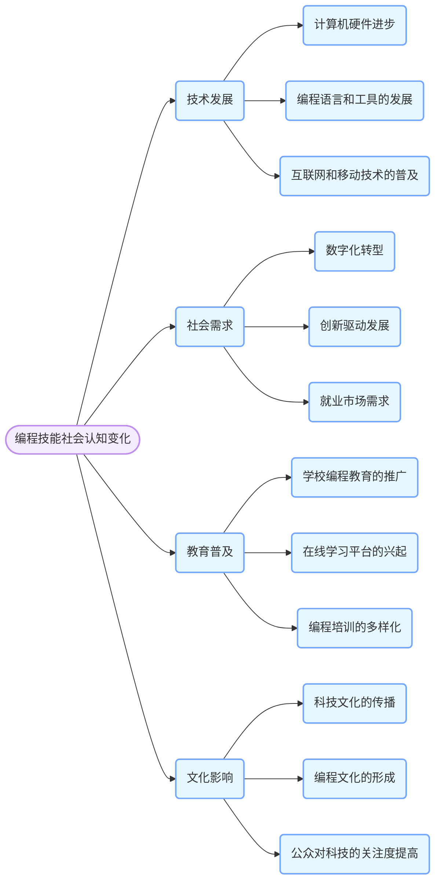

# 编程技能的社会认知变化

> 关键词：编程技能、社会认知、变化趋势、技术发展、职业影响

> 摘要：本文深入探讨了编程技能的社会认知变化。从编程技能诞生之初到如今数字化时代，社会对其认知经历了巨大的转变。早期编程主要面向专业人士，社会认知局限；随着互联网普及和科技发展，编程技能逐渐走入大众视野，被视为具有重要价值的能力。文章分析了这种认知变化的背景、核心概念，阐述了相关算法原理和数学模型，通过项目实战案例展示编程的实际应用，探讨了其在不同场景下的应用情况，推荐了学习和开发的工具资源，最后总结了未来发展趋势与挑战，并对常见问题进行解答，提供扩展阅读和参考资料，旨在全面剖析编程技能社会认知变化这一现象及其深远影响。

## 1. 背景介绍 
### 1.1 目的和范围
本文的目的在于全面且深入地研究编程技能的社会认知变化。通过分析不同历史阶段社会对编程技能的看法、态度和期望，揭示这种认知变化背后的驱动因素，以及其对个人、行业和社会发展产生的影响。研究范围涵盖了从编程技能诞生至今的整个历史时期，涉及不同国家和地区的社会层面，包括教育、就业、文化等多个领域。

### 1.2 预期读者
本文预期读者包括对编程技术、社会发展、科技趋势感兴趣的各类人群。对于编程初学者和爱好者，有助于他们了解编程技能在社会中的地位和发展前景，增强学习动力；对于教育工作者，可从中获取关于编程教育理念和方法的启示；对于企业管理者和人力资源专家，能更好地把握编程技能在人才市场中的需求变化，制定合理的人才战略；对于普通大众，能增进对编程这一新兴技术的认识和理解，提升自身的科技素养。

### 1.3 文档结构概述
本文共分为十个部分。第一部分为背景介绍，阐述了文章的目的、预期读者和文档结构概述，并对相关术语进行解释。第二部分介绍编程技能社会认知变化的核心概念与联系，通过文本示意图和 Mermaid 流程图展示其内在逻辑。第三部分讲解核心算法原理和具体操作步骤，使用 Python 源代码详细阐述。第四部分介绍数学模型和公式，并进行详细讲解和举例说明。第五部分通过项目实战，展示代码实际案例并进行详细解释说明。第六部分探讨编程技能的实际应用场景。第七部分推荐学习和开发的工具资源，包括书籍、在线课程、技术博客、IDE 和编辑器、调试和性能分析工具、相关框架和库以及相关论文著作。第八部分总结未来发展趋势与挑战。第九部分为附录，解答常见问题。第十部分提供扩展阅读和参考资料。

### 1.4 术语表
#### 1.4.1 核心术语定义
- **编程技能**：指使用计算机编程语言进行程序设计、开发和维护的能力，包括算法设计、数据结构运用、代码编写、调试和优化等方面的技能。
- **社会认知**：是指社会成员对某一事物或现象的认识、看法、态度和评价，反映了社会群体对该事物的总体理解和心理倾向。
- **数字化时代**：以信息技术为核心，以互联网、计算机、移动设备等为主要工具，实现信息的快速传播、共享和处理的时代。

#### 1.4.2 相关概念解释
- **编程教育**：旨在培养人们编程技能的教育活动，包括学校教育、职业培训、在线学习等多种形式。
- **编程文化**：指与编程相关的价值观、思维方式、行为习惯和社会现象的总和，反映了编程社区的特点和氛围。
- **技术民主化**：指技术从少数专业人士掌握逐渐普及到大众的过程，使得更多人能够参与和利用技术，推动社会的发展和进步。

#### 1.4.3 缩略词列表
- **AI**：Artificial Intelligence，人工智能
- **ML**：Machine Learning，机器学习
- **DL**：Deep Learning，深度学习
- **IDE**：Integrated Development Environment，集成开发环境

## 2. 核心概念与联系 

### 核心概念原理
编程技能的社会认知变化是一个复杂的社会现象，涉及到技术、经济、文化等多个方面的因素。其核心原理在于技术的发展推动了编程技能的应用范围和影响力不断扩大，从而改变了社会对编程的认知。

在早期，编程主要用于科学计算和工业控制，需要专业的知识和技能，只有少数专业人士能够掌握。因此，社会对编程的认知较为局限，将其视为一种高深的专业技术。随着计算机技术的普及和互联网的发展，编程技能的应用范围逐渐扩大到各个领域，如商业、教育、娱乐等。同时，编程工具和编程语言的不断发展也使得编程变得更加容易学习和使用，吸引了越来越多的人参与到编程中来。这导致社会对编程的认知逐渐发生变化，从原来的专业技术转变为一种具有广泛应用价值的通用技能。

### 架构的文本示意图
```plaintext
编程技能社会认知变化
|-- 技术发展
|   |-- 计算机硬件进步
|   |-- 编程语言和工具的发展
|   |-- 互联网和移动技术的普及
|-- 社会需求
|   |-- 数字化转型
|   |-- 创新驱动发展
|   |-- 就业市场需求
|-- 教育普及
|   |-- 学校编程教育的推广
|   |-- 在线学习平台的兴起
|   |-- 编程培训的多样化
|-- 文化影响
|   |-- 科技文化的传播
|   |-- 编程文化的形成
|   |-- 公众对科技的关注度提高
```

### Mermaid 流程图


## 3. 核心算法原理 & 具体操作步骤 

### 算法原理讲解
在研究编程技能的社会认知变化过程中，我们可以使用数据挖掘和机器学习算法来分析相关数据，以揭示认知变化的规律和趋势。以下以文本挖掘算法为例进行详细阐述。

文本挖掘是从大量文本数据中提取有价值信息的过程。在分析编程技能的社会认知变化时，我们可以收集社交媒体、新闻报道、学术论文等文本数据，然后使用文本挖掘算法对这些数据进行处理和分析。

常见的文本挖掘算法包括词频统计、关键词提取、情感分析等。词频统计是统计文本中每个词语出现的频率，通过分析词频可以了解文本的主题和重点。关键词提取是从文本中提取出能够代表文本主题的关键词，有助于快速把握文本的核心内容。情感分析是判断文本所表达的情感倾向，如积极、消极或中性，从而了解社会对编程技能的态度。

### Python 源代码详细阐述
以下是使用 Python 实现词频统计、关键词提取和情感分析的示例代码：

```python
import pandas as pd
from sklearn.feature_extraction.text import CountVectorizer
from sklearn.feature_extraction.text import TfidfVectorizer
from textblob import TextBlob

# 示例文本数据
texts = [
    "编程技能在当今社会越来越重要，它可以帮助我们解决很多实际问题。",
    "学习编程能够提升我们的逻辑思维能力和创造力。",
    "编程是一种强大的工具，它推动了科技的发展。",
    "有些人认为编程很难学，但只要坚持就会有收获。"
]

# 词频统计
vectorizer = CountVectorizer()
X = vectorizer.fit_transform(texts)
feature_names = vectorizer.get_feature_names_out()
dense = X.todense()
df = pd.DataFrame(dense, columns=feature_names)
print("词频统计结果：")
print(df)

# 关键词提取
tfidf_vectorizer = TfidfVectorizer()
tfidf_matrix = tfidf_vectorizer.fit_transform(texts)
feature_names_tfidf = tfidf_vectorizer.get_feature_names_out()
dense_tfidf = tfidf_matrix.todense()
df_tfidf = pd.DataFrame(dense_tfidf, columns=feature_names_tfidf)
print("\n关键词提取结果：")
print(df_tfidf)

# 情感分析
sentiments = []
for text in texts:
    blob = TextBlob(text)
    sentiment = blob.sentiment.polarity
    sentiments.append(sentiment)
print("\n情感分析结果：")
for i, sentiment in enumerate(sentiments):
    if sentiment > 0:
        print(f"文本 {i+1} 情感倾向：积极")
    elif sentiment < 0:
        print(f"文本 {i+1} 情感倾向：消极")
    else:
        print(f"文本 {i+1} 情感倾向：中性")
```

### 具体操作步骤
1. **数据收集**：收集与编程技能社会认知相关的文本数据，可以使用网络爬虫工具从社交媒体、新闻网站等平台获取数据。
2. **数据预处理**：对收集到的文本数据进行清洗和预处理，包括去除噪声、停用词、进行词干提取等操作，以提高数据质量。
3. **算法选择和实现**：根据研究目的选择合适的文本挖掘算法，如上述示例中的词频统计、关键词提取和情感分析算法，并使用 Python 等编程语言实现。
4. **结果分析**：对算法输出的结果进行分析和解释，揭示编程技能社会认知的变化规律和趋势。

## 4. 数学模型和公式 & 详细讲解 & 举例说明 

### 词频统计模型
词频统计是一种简单而常用的文本分析方法，其数学模型基于词频的概念。设 $D$ 为一个文本集合，$w$ 为一个词语，$f(w, d)$ 表示词语 $w$ 在文本 $d$ 中出现的频率。则词语 $w$ 在文本集合 $D$ 中的总词频 $F(w)$ 可以表示为：

$$F(w) = \sum_{d \in D} f(w, d)$$

例如，在上述示例代码中，我们使用 `CountVectorizer` 类实现了词频统计。该类会将文本数据转换为词频矩阵，矩阵中的每个元素表示对应词语在对应文本中出现的次数。

### TF-IDF 模型
TF-IDF（Term Frequency-Inverse Document Frequency）是一种用于信息检索与文本挖掘的常用加权技术。它综合考虑了词语在文本中的出现频率（TF）和在整个文本集合中的稀有程度（IDF）。

设 $tf(w, d)$ 表示词语 $w$ 在文本 $d$ 中的词频，$df(w)$ 表示包含词语 $w$ 的文本数量，$N$ 表示文本集合中的文本总数。则词语 $w$ 在文本 $d$ 中的 TF-IDF 值 $tfidf(w, d)$ 可以表示为：

$$tfidf(w, d) = tf(w, d) \times idf(w)$$

其中，$idf(w)$ 为词语 $w$ 的逆文档频率，计算公式为：

$$idf(w) = \log \frac{N}{df(w) + 1}$$

在上述示例代码中，我们使用 `TfidfVectorizer` 类实现了 TF-IDF 关键词提取。该类会将文本数据转换为 TF-IDF 矩阵，矩阵中的每个元素表示对应词语在对应文本中的 TF-IDF 值。

### 情感分析模型
情感分析通常基于机器学习或自然语言处理技术，通过对文本中的词语和语法结构进行分析，判断文本所表达的情感倾向。常见的情感分析模型包括基于规则的模型和基于机器学习的模型。

基于规则的模型通过定义一系列的情感规则来判断文本的情感倾向，如根据词语的情感极性和语法结构进行判断。基于机器学习的模型则通过训练大量的标注数据来学习文本的情感特征，然后使用训练好的模型对新的文本进行情感分类。

在上述示例代码中，我们使用 `TextBlob` 库实现了简单的情感分析。`TextBlob` 库基于自然语言处理技术，通过计算文本的情感极性值来判断文本的情感倾向，情感极性值范围为 -1 到 1，-1 表示消极，1 表示积极，0 表示中性。

## 5. 项目实战：代码实际案例和详细解释说明 

### 5.1 开发环境搭建
在进行编程技能社会认知分析的项目实战时，我们可以使用 Python 作为开发语言，并结合一些常用的数据分析和机器学习库。以下是开发环境搭建的具体步骤：

1. **安装 Python**：从 Python 官方网站（https://www.python.org/downloads/）下载并安装 Python 3.x 版本。
2. **安装必要的库**：使用 `pip` 命令安装所需的库，包括 `pandas`、`scikit-learn`、`textblob` 等。
```bash
pip install pandas scikit-learn textblob
```
3. **选择集成开发环境（IDE）**：可以选择 PyCharm、Jupyter Notebook 等 IDE 进行代码开发和调试。

### 5.2 源代码详细实现和代码解读
以下是一个完整的项目实战代码示例，用于分析社交媒体上关于编程技能的文本数据，揭示社会对编程技能的认知变化：

```python
import pandas as pd
from sklearn.feature_extraction.text import CountVectorizer
from sklearn.feature_extraction.text import TfidfVectorizer
from textblob import TextBlob
import matplotlib.pyplot as plt

# 读取社交媒体文本数据
data = pd.read_csv('social_media_texts.csv')
texts = data['text'].tolist()

# 词频统计
vectorizer = CountVectorizer()
X = vectorizer.fit_transform(texts)
feature_names = vectorizer.get_feature_names_out()
dense = X.todense()
df = pd.DataFrame(dense, columns=feature_names)

# 关键词提取
tfidf_vectorizer = TfidfVectorizer()
tfidf_matrix = tfidf_vectorizer.fit_transform(texts)
feature_names_tfidf = tfidf_vectorizer.get_feature_names_out()
dense_tfidf = tfidf_matrix.todense()
df_tfidf = pd.DataFrame(dense_tfidf, columns=feature_names_tfidf)

# 情感分析
sentiments = []
for text in texts:
    blob = TextBlob(text)
    sentiment = blob.sentiment.polarity
    sentiments.append(sentiment)
data['sentiment'] = sentiments

# 绘制情感分析结果直方图
plt.hist(sentiments, bins=20)
plt.title('Sentiment Analysis of Programming Skills on Social Media')
plt.xlabel('Sentiment Polarity')
plt.ylabel('Frequency')
plt.show()

# 输出词频统计和关键词提取结果
print("词频统计结果：")
print(df)
print("\n关键词提取结果：")
print(df_tfidf)
```

### 代码解读与分析
1. **数据读取**：使用 `pandas` 库读取社交媒体文本数据，并将文本列转换为列表。
2. **词频统计**：使用 `CountVectorizer` 类将文本数据转换为词频矩阵，并将矩阵转换为 `pandas` 数据框进行输出。
3. **关键词提取**：使用 `TfidfVectorizer` 类将文本数据转换为 TF-IDF 矩阵，并将矩阵转换为 `pandas` 数据框进行输出。
4. **情感分析**：使用 `TextBlob` 库对每条文本进行情感分析，计算情感极性值，并将结果添加到数据框中。
5. **可视化**：使用 `matplotlib` 库绘制情感分析结果的直方图，直观展示社会对编程技能的情感倾向。

通过对代码输出结果的分析，我们可以了解社交媒体上关于编程技能的热门话题、关键词以及社会对编程技能的情感态度，从而揭示编程技能的社会认知变化。

## 6. 实际应用场景 
### 教育领域
在教育领域，编程技能的社会认知变化推动了编程教育的普及和发展。越来越多的学校将编程纳入课程体系，从小学到大学都开设了编程相关的课程。编程教育不仅有助于培养学生的逻辑思维能力、创造力和问题解决能力，还能为学生未来的职业发展打下坚实的基础。

例如，美国的 Code.org 组织发起了“编程一小时”活动，鼓励全球学生在一小时内体验编程的乐趣。该活动得到了广泛响应，吸引了数百万学生参与，有力地推动了编程教育的普及。

### 就业市场
在就业市场，编程技能已成为许多行业的必备技能。随着数字化转型的加速，企业对具备编程技能的人才需求不断增加。不仅是科技行业，金融、医疗、制造等传统行业也需要大量的编程人才来推动业务的数字化升级。

例如，在金融行业，编程技能可以用于开发金融交易系统、风险评估模型等；在医疗行业，编程技能可以用于开发医疗信息系统、医学影像分析软件等。

### 创新创业
编程技能的普及为创新创业提供了更多的机会。创业者可以利用编程技能开发各种创新的产品和服务，满足市场需求。同时，开源软件和云计算等技术的发展也降低了创业的门槛，使得更多的人能够参与到创新创业中来。

例如，许多互联网创业公司都是由具备编程技能的创业者创建的，他们通过开发创新的互联网产品和服务，获得了巨大的商业成功。

### 文化娱乐
在文化娱乐领域，编程技能也发挥着重要作用。例如，游戏开发、动画制作、虚拟现实等领域都需要大量的编程人才。编程技能可以用于实现游戏的逻辑、动画的效果、虚拟现实场景的构建等。

此外，编程还可以用于文化遗产的数字化保护和传承。通过编程技术，可以将文化遗产以数字化的形式呈现出来，让更多的人能够了解和欣赏。

## 7. 工具和资源推荐
### 7.1 学习资源推荐
#### 7.1.1 书籍推荐
- 《Python 编程：从入门到实践》：这本书适合初学者，它以项目驱动的方式介绍了 Python 编程的基础知识和应用。
- 《算法导论》：经典的算法书籍，系统地介绍了各种算法的设计和分析方法。
- 《代码大全》：涵盖了软件开发的各个方面，包括代码设计、编码规范、调试和测试等，是一本软件开发的百科全书。

#### 7.1.2 在线课程
- Coursera：提供了丰富的编程相关课程，包括 Python、Java、机器学习等，许多课程由知名大学和机构的教授授课。
- edX：同样提供了大量的编程课程，课程质量高，部分课程还提供认证证书。
- 慕课网：国内知名的在线学习平台，提供了丰富的编程课程，适合不同水平的学习者。

#### 7.1.3 技术博客和网站
- 阮一峰的网络日志：阮一峰是国内知名的技术博主，他的博客涵盖了编程、前端开发、网络技术等多个领域，文章通俗易懂，适合初学者。
- 开源中国：国内最大的开源技术社区，提供了大量的开源项目信息和技术文章，是开发者交流和学习的好平台。
- Stack Overflow：全球最大的编程问答社区，开发者可以在这里提问、解答问题，获取各种编程技术的帮助。

### 7.2 开发工具框架推荐
#### 7.2.1 IDE和编辑器
- PyCharm：专业的 Python 集成开发环境，具有代码自动补全、调试、版本控制等强大功能，适合 Python 开发者。
- Visual Studio Code：轻量级的代码编辑器，支持多种编程语言，具有丰富的插件生态系统，可扩展性强。
- IntelliJ IDEA：Java 开发的首选 IDE，提供了高效的代码编辑、调试和项目管理功能。

#### 7.2.2 调试和性能分析工具
- PyCharm 调试器：集成在 PyCharm 中的调试工具，方便 Python 开发者进行代码调试。
- Chrome DevTools：谷歌浏览器自带的调试工具，可用于调试前端代码，包括 HTML、CSS 和 JavaScript。
- Py-spy：Python 性能分析工具，可用于分析 Python 程序的性能瓶颈。

#### 7.2.3 相关框架和库
- Django：Python 的 Web 开发框架，具有高效、安全、易扩展等特点，适合开发大型 Web 应用。
- Flask：轻量级的 Python Web 框架，简单易用，适合快速开发小型 Web 应用。
- TensorFlow：谷歌开发的开源机器学习框架，广泛应用于深度学习领域。

### 7.3 相关论文著作推荐
#### 7.3.1 经典论文
- 《A Mathematical Theory of Communication》：香农的经典论文，奠定了信息论的基础。
- 《The Cathedral and the Bazaar》：介绍了开源软件的开发模式，对开源软件的发展产生了深远影响。
- 《Learning Representations by Back-propagating Errors》：首次提出了反向传播算法，推动了神经网络的发展。

#### 7.3.2 最新研究成果
- 《Attention Is All You Need》：提出了 Transformer 模型，在自然语言处理领域取得了巨大成功。
- 《Generative Adversarial Nets》：提出了生成对抗网络（GAN），在图像生成、数据增强等领域有广泛应用。
- 《Mastering the Game of Go without Human Knowledge》：介绍了 AlphaGo Zero 的训练方法，展示了深度学习在棋类游戏中的强大能力。

#### 7.3.3 应用案例分析
- 《Lean Startup》：介绍了精益创业的方法和理念，通过实际案例分析了创业公司如何快速验证产品和商业模式。
- 《The Innovator's Dilemma》：探讨了创新者的困境，分析了大公司在面对破坏性创新时的应对策略。
- 《The Mom Test》：提供了在创业过程中如何有效获取客户反馈的方法和技巧。

## 8. 总结：未来发展趋势与挑战
### 未来发展趋势
- **编程技能的普及化**：随着编程教育的不断普及和编程工具的不断简化，编程技能将不再是少数专业人士的专属，而是成为一种大众技能。更多的人将能够利用编程技能解决实际问题，推动社会的发展和进步。
- **与其他技术的融合**：编程技能将与人工智能、机器学习、物联网等技术深度融合，创造出更加智能、高效的产品和服务。例如，编程与人工智能的结合可以实现自动化的数据分析和决策，编程与物联网的结合可以实现设备的远程控制和智能化管理。
- **跨学科应用的增加**：编程技能将在更多的学科领域得到应用，如生物学、医学、社会学等。跨学科的编程应用将为这些学科的研究和发展带来新的机遇和挑战。
- **编程文化的多元化**：随着编程社区的不断壮大和国际化，编程文化将呈现出多元化的发展趋势。不同国家和地区的编程文化将相互交流和融合，形成更加丰富多样的编程文化生态。

### 挑战
- **教育资源的不均衡**：在全球范围内，编程教育资源的分配存在不均衡的问题。一些地区由于经济、技术等原因，缺乏足够的编程教育资源，导致这些地区的学生无法获得良好的编程教育。
- **技术更新换代快**：编程技术的更新换代速度非常快，新的编程语言、框架和工具不断涌现。这对编程学习者和从业者来说是一个巨大的挑战，需要不断学习和更新知识，以跟上技术的发展步伐。
- **安全和隐私问题**：随着编程技能的广泛应用，安全和隐私问题日益突出。编程人员需要具备足够的安全意识和技能，以保障软件系统的安全性和用户的隐私。
- **伦理和社会影响**：编程技术的发展也带来了一些伦理和社会问题，如算法歧视、人工智能的道德责任等。编程人员需要考虑这些问题，制定相应的伦理准则和规范，以确保编程技术的健康发展。

## 9. 附录：常见问题与解答
### 编程技能难学吗？
编程技能的学习难度因人而异。对于有一定数学和逻辑基础的人来说，学习编程可能相对容易一些。而对于没有相关基础的人来说，可能需要花费更多的时间和精力来学习。但只要有足够的兴趣和耐心，通过系统的学习和实践，大多数人都可以掌握编程技能。

### 学习编程需要具备哪些基础知识？
学习编程需要具备一定的数学基础，如代数、逻辑等，以及基本的计算机知识，如操作系统、网络等。此外，还需要具备良好的逻辑思维能力和问题解决能力。

### 哪种编程语言适合初学者？
对于初学者来说，Python 是一种非常适合的编程语言。Python 语法简洁易懂，代码可读性高，有丰富的库和框架，应用范围广泛。此外，JavaScript 也是一种适合初学者的编程语言，它可以用于前端开发和后端开发，在 Web 开发领域有广泛的应用。

### 学习编程需要多长时间？
学习编程所需的时间取决于个人的学习目标、学习方法和学习时间。如果只是想掌握一些基本的编程技能，可能需要几个月的时间；如果想成为一名专业的程序员，可能需要几年的时间。

### 编程技能在就业市场上的前景如何？
编程技能在就业市场上的前景非常广阔。随着数字化转型的加速，企业对具备编程技能的人才需求不断增加。不仅是科技行业，金融、医疗、制造等传统行业也需要大量的编程人才来推动业务的数字化升级。因此，掌握编程技能可以为个人的职业发展带来更多的机会和选择。

## 10. 扩展阅读 & 参考资料
### 扩展阅读
- 《软技能：代码之外的生存指南》：介绍了程序员在职业生涯中需要具备的软技能，如沟通能力、团队协作能力、职业规划等。
- 《程序员修炼之道：从小工到专家》：分享了程序员在成长过程中的经验和技巧，帮助程序员提高自己的编程水平和职业素养。
- 《浪潮之巅》：介绍了科技行业的发展历程和趋势，分析了科技公司的兴衰原因，对程序员了解行业动态有很大的帮助。

### 参考资料
- 《Python 官方文档》：Python 官方提供的文档，包含了 Python 语言的详细介绍和使用方法。
- 《Scikit-learn 官方文档》：Scikit-learn 是一个常用的机器学习库，其官方文档提供了丰富的机器学习算法和工具的使用说明。
- 《TensorFlow 官方文档》：TensorFlow 是一个开源的机器学习框架，其官方文档提供了详细的框架介绍和使用教程。