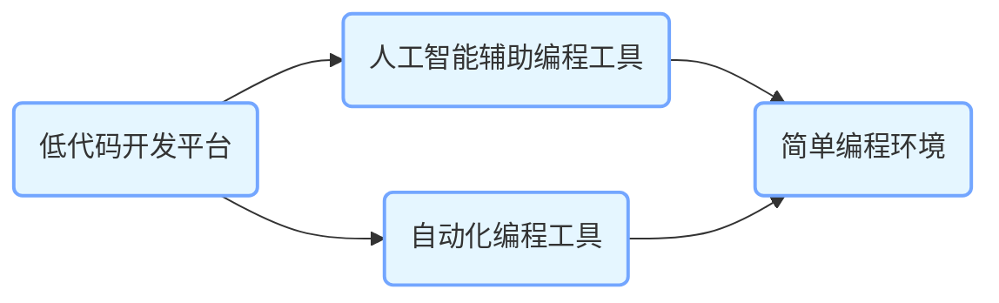

# 编程的未来：从复杂到简单的转变

> 关键词：编程未来、复杂到简单、低代码开发、人工智能编程、自动化编程

> 摘要：本文深入探讨了编程领域从复杂到简单转变的发展趋势。首先介绍了该主题的背景、目的、预期读者和文档结构，解释了相关术语。接着阐述了核心概念如低代码开发、人工智能辅助编程等及其联系，并给出示意图和流程图。详细讲解了相关核心算法原理及操作步骤，辅以Python代码示例。从数学模型角度分析了编程复杂度降低的原理。通过项目实战展示了如何实现简单编程，包括开发环境搭建、代码实现与解读。探讨了实际应用场景，推荐了学习资源、开发工具框架和相关论文著作。最后总结了未来发展趋势与挑战，解答了常见问题，并提供了扩展阅读和参考资料，旨在为读者全面呈现编程未来的发展方向。

## 1. 背景介绍 
### 1.1 目的和范围
编程作为现代科技的核心驱动力，一直以来都以其复杂性和专业性让许多人望而却步。然而，随着科技的不断进步，编程正逐渐从复杂向简单转变。本文的目的在于深入探讨这一转变的趋势、原理、应用以及未来发展，旨在为广大编程爱好者、开发者、科技从业者等提供一个全面的视角，了解编程未来的发展方向。本文的范围涵盖了编程领域从复杂到简单转变的各个方面，包括核心概念、算法原理、实际应用场景、相关工具和资源等。

### 1.2 预期读者
本文的预期读者包括但不限于以下几类人群：
- 编程初学者：希望了解编程未来的发展趋势，为自己的学习和职业规划提供参考。
- 有一定经验的开发者：对编程领域的新技术、新趋势感兴趣，希望通过本文了解如何利用这些趋势提升自己的开发效率和质量。
- 科技企业管理者：关注编程技术的发展对企业业务的影响，希望通过本文了解如何在企业中应用简单编程技术，降低开发成本，提高竞争力。
- 非技术人员：对科技发展感兴趣，希望通过本文了解编程领域的变化，以及这些变化对日常生活和工作的影响。

### 1.3 文档结构概述
本文将按照以下结构进行阐述：
- 核心概念与联系：介绍编程从复杂到简单转变的核心概念，如低代码开发、人工智能辅助编程等，并分析它们之间的联系。
- 核心算法原理 & 具体操作步骤：详细讲解实现简单编程的核心算法原理，并给出具体的操作步骤，通过Python代码进行示例。
- 数学模型和公式 & 详细讲解 & 举例说明：从数学模型的角度分析编程复杂度降低的原理，给出相关公式，并通过具体例子进行说明。
- 项目实战：通过一个实际项目案例，展示如何实现简单编程，包括开发环境搭建、源代码详细实现和代码解读。
- 实际应用场景：探讨编程从复杂到简单转变在各个领域的实际应用场景。
- 工具和资源推荐：推荐学习资源、开发工具框架和相关论文著作，帮助读者进一步深入学习和研究。
- 总结：未来发展趋势与挑战：总结编程从复杂到简单转变的未来发展趋势，并分析可能面临的挑战。
- 附录：常见问题与解答：解答读者在阅读本文过程中可能遇到的常见问题。
- 扩展阅读 & 参考资料：提供扩展阅读的建议和参考资料，方便读者进一步探索相关领域。

### 1.4 术语表
#### 1.4.1 核心术语定义
- **低代码开发**：一种通过少量代码或无需编写大量代码，利用可视化界面和预制组件快速开发应用程序的方法。
- **人工智能辅助编程**：利用人工智能技术，如自然语言处理、机器学习等，为程序员提供代码建议、错误检测、自动完成等功能，帮助程序员更高效地编写代码。
- **自动化编程**：通过编写脚本或使用工具，自动完成一些重复性的编程任务，如代码生成、测试用例生成等。

#### 1.4.2 相关概念解释
- **可视化编程**：一种编程方式，通过图形化界面和拖拽操作来创建程序，而不是通过编写代码。可视化编程通常用于创建用户界面和简单的业务逻辑。
- **无代码开发**：一种完全无需编写代码，通过可视化界面和配置来创建应用程序的方法。无代码开发通常适用于简单的业务应用和非技术人员。

#### 1.4.3 缩略词列表
- **AI**：Artificial Intelligence，人工智能
- **ML**：Machine Learning，机器学习
- **NLP**：Natural Language Processing，自然语言处理
- **LCA**：Low-Code Application，低代码应用

## 2. 核心概念与联系 
### 核心概念原理
#### 低代码开发
低代码开发平台通常提供了丰富的可视化组件和模板，用户可以通过拖拽和配置这些组件来快速构建应用程序。这些组件包括表单、报表、图表、工作流等，用户可以根据自己的需求进行组合和定制。低代码开发平台还支持与各种数据源的集成，如数据库、API等，方便用户获取和处理数据。

#### 人工智能辅助编程
人工智能辅助编程主要基于自然语言处理和机器学习技术。通过对大量代码的学习，人工智能模型可以理解代码的语义和结构，为程序员提供代码建议、错误检测、自动完成等功能。例如，当程序员输入一段代码时，人工智能模型可以根据上下文预测接下来可能需要输入的代码，并提供相应的建议。

#### 自动化编程
自动化编程通过编写脚本或使用工具，自动完成一些重复性的编程任务。例如，代码生成工具可以根据需求自动生成代码框架和模板，测试用例生成工具可以自动生成测试用例，提高测试效率。

### 架构的文本示意图
```plaintext
              +-----------------+
              | 低代码开发平台 |
              +-----------------+
                    |
                    | 集成
                    v
+----------------------+    +----------------------+
| 人工智能辅助编程工具 |    | 自动化编程工具       |
+----------------------+    +----------------------+
                    |                |
                    |                | 协同工作
                    v                v
              +-----------------+
              | 简单编程环境    |
              +-----------------+
```

### Mermaid 流程图


## 3. 核心算法原理 & 具体操作步骤 
### 人工智能辅助编程算法原理
人工智能辅助编程主要基于深度学习模型，如Transformer架构。Transformer模型通过自注意力机制可以捕捉代码中的长距离依赖关系，从而更好地理解代码的语义和结构。以下是一个简单的基于Transformer的代码自动完成示例的Python代码：

```python
import torch
import torch.nn as nn
import torch.optim as optim
from transformers import GPT2LMHeadModel, GPT2Tokenizer

# 加载预训练的GPT-2模型和分词器
tokenizer = GPT2Tokenizer.from_pretrained('gpt2')
model = GPT2LMHeadModel.from_pretrained('gpt2')

# 输入代码片段
input_text = "def add(a, b):"
input_ids = tokenizer.encode(input_text, return_tensors='pt')

# 生成代码建议
output = model.generate(input_ids, max_length=50, num_beams=5, no_repeat_ngram_size=2, early_stopping=True)
generated_text = tokenizer.decode(output[0], skip_special_tokens=True)

print("生成的代码建议：", generated_text)
```

### 具体操作步骤
1. **数据准备**：收集大量的代码数据，并进行预处理，如分词、标记化等。
2. **模型训练**：使用预处理后的数据对Transformer模型进行训练，调整模型的参数，使其能够准确地理解代码的语义和结构。
3. **代码输入**：程序员在编程过程中输入代码片段。
4. **代码生成**：将输入的代码片段输入到训练好的模型中，模型根据上下文生成代码建议。
5. **建议展示**：将生成的代码建议展示给程序员，供其选择和使用。

## 4. 数学模型和公式 & 详细讲解 & 举例说明 
### 复杂度分析
在传统编程中，程序的复杂度通常用时间复杂度和空间复杂度来衡量。时间复杂度表示程序执行所需的时间与输入规模之间的关系，空间复杂度表示程序执行所需的内存空间与输入规模之间的关系。

设 $T(n)$ 表示程序的时间复杂度，$S(n)$ 表示程序的空间复杂度，$n$ 表示输入规模。常见的时间复杂度有 $O(1)$、$O(log n)$、$O(n)$、$O(n log n)$、$O(n^2)$ 等，常见的空间复杂度有 $O(1)$、$O(n)$ 等。

例如，对于一个简单的线性搜索算法，其时间复杂度为 $O(n)$，因为在最坏情况下，需要遍历整个数组才能找到目标元素。

```python
def linear_search(arr, target):
    for i in range(len(arr)):
        if arr[i] == target:
            return i
    return -1

arr = [1, 2, 3, 4, 5]
target = 3
result = linear_search(arr, target)
print("目标元素的索引：", result)
```

### 低代码开发的复杂度降低原理
在低代码开发中，通过使用预制组件和可视化界面，减少了程序员需要编写的代码量。设传统编程所需的代码行数为 $C_1$，低代码开发所需的代码行数为 $C_2$，则复杂度降低的比例可以表示为：

$$
\text{复杂度降低比例} = \frac{C_1 - C_2}{C_1} \times 100\%
$$

例如，一个传统的Web应用程序需要编写1000行代码，而使用低代码开发平台只需要编写200行代码，则复杂度降低比例为：

$$
\frac{1000 - 200}{1000} \times 100\% = 80\%
$$

## 5. 项目实战：代码实际案例和详细解释说明 
### 5.1  开发环境搭建
本项目使用Python和Flask框架搭建一个简单的Web应用程序，同时使用低代码开发平台进行辅助开发。以下是开发环境搭建的步骤：

1. **安装Python**：从Python官方网站下载并安装Python 3.x版本。
2. **安装Flask**：使用pip命令安装Flask框架。
```bash
pip install flask
```
3. **选择低代码开发平台**：可以选择一些流行的低代码开发平台，如OutSystems、Mendix等，根据平台的文档进行注册和安装。

### 5.2  源代码详细实现和代码解读
#### 使用Flask实现简单的Web应用程序
```python
from flask import Flask, render_template

app = Flask(__name__)

@app.route('/')
def index():
    return render_template('index.html')

if __name__ == '__main__':
    app.run(debug=True)
```

代码解读：
- `from flask import Flask, render_template`：导入Flask框架和模板渲染函数。
- `app = Flask(__name__)`：创建Flask应用实例。
- `@app.route('/')`：定义路由，当用户访问根路径时，执行`index`函数。
- `def index(): return render_template('index.html')`：返回渲染后的`index.html`模板。
- `if __name__ == '__main__': app.run(debug=True)`：启动Flask应用，开启调试模式。

#### 使用低代码开发平台创建表单页面
在低代码开发平台中，通过拖拽表单组件，配置表单字段和验证规则，快速创建一个表单页面。将该表单页面集成到Flask应用中，实现用户数据的收集和处理。

### 5.3  代码解读与分析
通过上述代码和低代码开发平台的结合，我们可以看到编程的复杂度大大降低。传统的Web应用开发需要编写大量的HTML、CSS、JavaScript代码来实现表单页面，而使用低代码开发平台可以快速创建表单页面，减少了代码量和开发时间。同时，Flask框架提供了简单的路由和视图处理机制，使得整个应用的架构更加清晰和易于维护。

## 6. 实际应用场景 
### 企业应用开发
在企业中，许多业务应用的开发需求频繁且多样化。低代码开发平台可以让企业的业务人员和非专业开发人员快速创建各种业务应用，如流程审批系统、客户关系管理系统等。人工智能辅助编程可以帮助专业开发人员提高开发效率，减少错误。例如，在开发一个企业资源规划（ERP）系统时，低代码开发平台可以快速搭建系统的基础框架，人工智能辅助编程可以为开发人员提供代码建议和错误检测，加快系统的开发速度。

### 教育领域
在编程教育中，编程的复杂性往往是初学者面临的主要障碍。低代码开发平台和人工智能辅助编程可以让初学者更容易入门，降低学习门槛。例如，学生可以通过低代码开发平台创建简单的游戏和应用程序，体验编程的乐趣。人工智能辅助编程可以为学生提供实时的代码反馈和建议，帮助他们更好地理解编程概念和语法。

### 快速原型开发
在产品开发的早期阶段，需要快速验证产品的想法和功能。低代码开发平台可以快速创建产品的原型，让团队成员和客户直观地了解产品的功能和界面。自动化编程工具可以自动生成测试用例，对原型进行快速测试，提高开发效率。例如，在开发一款移动应用时，可以使用低代码开发平台在几天内创建出应用的原型，然后使用自动化编程工具进行测试，根据测试结果快速迭代和优化原型。

## 7. 工具和资源推荐
### 7.1 学习资源推荐
#### 7.1.1 书籍推荐
- 《Python编程：从入门到实践》：适合Python初学者，通过实际项目案例帮助读者快速掌握Python编程。
- 《人工智能：现代方法》：全面介绍人工智能的基本概念、算法和应用，是人工智能领域的经典教材。
- 《低代码开发实战》：详细介绍低代码开发的原理、方法和实践案例，帮助读者掌握低代码开发技术。

#### 7.1.2 在线课程
- Coursera上的“Python for Everybody”：由密歇根大学提供的Python编程课程，适合初学者。
- edX上的“Artificial Intelligence”：麻省理工学院提供的人工智能课程，深入讲解人工智能的核心算法和应用。
- 网易云课堂上的“低代码开发入门与实战”：系统介绍低代码开发的基础知识和实际应用。

#### 7.1.3 技术博客和网站
- Medium：有许多关于编程、人工智能、低代码开发等领域的技术文章和博客。
- InfoQ：关注软件开发的最新技术和趋势，提供丰富的技术资讯和深度报道。
- 开源中国：国内知名的开源技术社区，有大量的编程技术文章和开源项目。

### 7.2 开发工具框架推荐
#### 7.2.1 IDE和编辑器
- PyCharm：专业的Python集成开发环境，提供代码编辑、调试、版本控制等功能。
- Visual Studio Code：轻量级的代码编辑器，支持多种编程语言，有丰富的插件扩展。
- IntelliJ IDEA：功能强大的Java集成开发环境，也支持其他编程语言。

#### 7.2.2 调试和性能分析工具
- pdb：Python自带的调试器，用于调试Python代码。
- Py-Spy：用于分析Python程序的性能，找出性能瓶颈。
- Chrome DevTools：用于调试和分析Web应用程序的性能和代码。

#### 7.2.3 相关框架和库
- Flask：轻量级的Python Web框架，适合快速开发Web应用。
- Django：功能强大的Python Web框架，提供了丰富的功能和工具。
- TensorFlow：开源的机器学习框架，用于开发和训练深度学习模型。

### 7.3 相关论文著作推荐
#### 7.3.1 经典论文
- “Attention Is All You Need”：介绍了Transformer架构，是自然语言处理领域的经典论文。
- “A Unified Approach to Interpreting Model Predictions”：提出了一种统一的模型解释方法，有助于理解机器学习模型的决策过程。
- “Low-Code Development: A Review and Research Agenda”：对低代码开发进行了全面的综述和研究展望。

#### 7.3.2 最新研究成果
- 关注顶级学术会议如NeurIPS、ICML、KDD等的最新研究成果，了解人工智能和编程领域的前沿技术。
- 查阅知名学术期刊如Journal of Artificial Intelligence Research、ACM Transactions on Software Engineering and Methodology等的最新论文。

#### 7.3.3 应用案例分析
- 分析一些知名企业和项目的应用案例，如Salesforce使用低代码开发平台开发企业应用的案例，了解实际应用中的经验和挑战。

## 8. 总结：未来发展趋势与挑战
### 未来发展趋势
- **更简单的编程方式**：未来，编程将变得更加简单，甚至可能实现完全无代码开发。低代码开发平台将不断完善，提供更多的预制组件和模板，让非技术人员也能轻松创建复杂的应用程序。
- **人工智能与编程深度融合**：人工智能将在编程中发挥越来越重要的作用。除了代码建议和错误检测，人工智能还可以自动生成算法和解决方案，帮助程序员解决复杂的问题。
- **跨平台和跨语言编程**：随着云计算和移动互联网的发展，跨平台和跨语言编程将变得更加普遍。开发者可以使用统一的编程模型和工具，在不同的平台和语言之间进行开发和部署。

### 挑战
- **技术人才转型**：编程从复杂到简单的转变将对技术人才的能力要求产生变化。传统的程序员需要学习新的技术和方法，如低代码开发、人工智能编程等，以适应未来的发展需求。
- **安全和隐私问题**：简单编程方式的普及可能会导致更多的非专业人员参与到编程中来，这可能会增加安全和隐私问题的风险。需要加强安全意识教育和技术保障措施，确保应用程序的安全性和隐私性。
- **技术标准和规范**：随着低代码开发平台和人工智能辅助编程工具的不断涌现，需要建立统一的技术标准和规范，以确保不同工具和平台之间的兼容性和互操作性。

## 9. 附录：常见问题与解答
### 问题1：低代码开发是否会取代传统编程？
解答：低代码开发不会完全取代传统编程。低代码开发适合快速创建简单的业务应用和原型，但对于一些复杂的算法和系统，仍然需要传统编程来实现。传统编程在性能优化、底层开发等方面具有不可替代的优势。

### 问题2：人工智能辅助编程是否会让程序员失业？
解答：人工智能辅助编程不会让程序员失业。相反，它可以帮助程序员提高开发效率，让程序员有更多的时间和精力去解决复杂的问题。人工智能辅助编程只是一种工具，需要程序员进行引导和控制，程序员的创造力和思维能力仍然是不可替代的。

### 问题3：如何选择适合自己的低代码开发平台？
解答：选择低代码开发平台时，需要考虑以下几个因素：
- **功能需求**：根据自己的业务需求，选择平台提供的功能是否满足要求。
- **易用性**：平台的操作是否简单易懂，是否适合非技术人员使用。
- **集成能力**：平台是否支持与其他系统和工具的集成，如数据库、API等。
- **社区和支持**：平台是否有活跃的社区和良好的技术支持，以便在使用过程中遇到问题能够及时得到解决。

## 10. 扩展阅读 & 参考资料
### 扩展阅读
- 《未来简史：从智人到智神》：探讨了科技发展对人类社会的影响，包括编程技术的发展。
- 《代码大全》：全面介绍了软件开发的各个方面，是软件开发领域的经典著作。
- 《失控：全人类的最终命运和结局》：探讨了科技和社会的发展趋势，对理解编程未来的发展有一定的启示。

### 参考资料
- [Python官方文档](https://docs.python.org/3/)
- [Flask官方文档](https://flask.palletsprojects.com/)
- [Transformer论文](https://arxiv.org/abs/1706.03762)
- [低代码开发平台OutSystems官网](https://www.outsystems.com/)
- [低代码开发平台Mendix官网](https://www.mendix.com/)