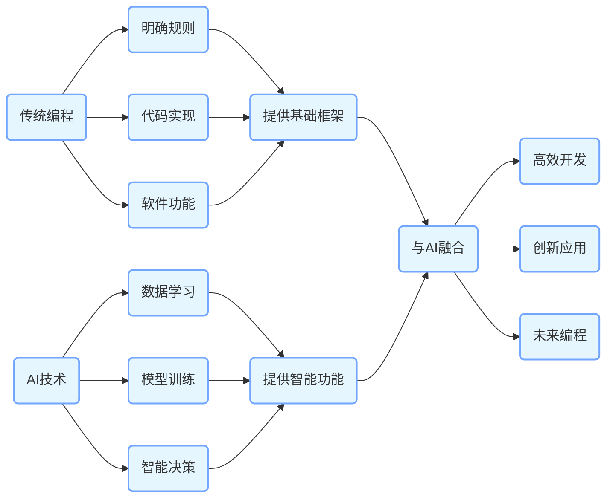

# 编程的未来：传统与AI的融合

> 关键词：编程未来、传统编程、AI融合、软件开发、技术趋势、自动化编程、人机协作

> 摘要：本文深入探讨了编程领域传统编程与AI融合的发展趋势。首先介绍了研究的背景、目的、预期读者等内容。接着阐述了传统编程和AI的核心概念及其联系，详细讲解了相关的核心算法原理和操作步骤，并运用数学模型和公式进行说明。通过项目实战展示了融合编程的实际应用，分析了其在不同场景下的应用价值。还推荐了学习、开发相关的工具和资源，最后总结了这一融合趋势的未来发展方向和面临的挑战，为编程从业者和研究者提供了全面的参考。

## 1. 背景介绍 
### 1.1 目的和范围
随着科技的飞速发展，人工智能（AI）在各个领域都展现出了强大的影响力，编程领域也不例外。传统编程方法在解决复杂问题时面临着效率、精度等方面的挑战，而AI技术的出现为编程带来了新的机遇和可能性。本文的目的在于探讨传统编程与AI融合的趋势、原理、应用以及未来发展，旨在为编程从业者、研究者和相关爱好者提供全面深入的了解，明确这一融合在编程未来发展中的重要地位。范围涵盖了传统编程和AI的核心概念、算法原理、数学模型、实际项目应用以及相关工具资源等多个方面。

### 1.2 预期读者
本文预期读者包括但不限于专业的程序员、软件工程师、软件架构师、CTO等编程领域的从业者，他们希望通过了解传统编程与AI的融合趋势，提升自身的编程技能和解决问题的能力。同时，也适合计算机科学相关专业的学生和研究者，为他们的学习和研究提供参考。此外，对编程和AI技术感兴趣的普通爱好者也能从本文中获得有益的信息。

### 1.3 文档结构概述
本文共分为十个部分。第一部分为背景介绍，阐述了文章的目的、预期读者和文档结构概述，并对相关术语进行解释。第二部分介绍传统编程和AI的核心概念及其联系，通过文本示意图和Mermaid流程图进行展示。第三部分详细讲解核心算法原理和具体操作步骤，使用Python源代码进行阐述。第四部分介绍相关的数学模型和公式，并进行详细讲解和举例说明。第五部分通过项目实战，展示融合编程的代码实际案例并进行详细解释。第六部分分析传统编程与AI融合在实际中的应用场景。第七部分推荐学习、开发相关的工具和资源。第八部分总结未来发展趋势与挑战。第九部分为附录，解答常见问题。第十部分提供扩展阅读和参考资料。

### 1.4 术语表
#### 1.4.1 核心术语定义
- **传统编程**：指使用传统的编程语言（如C、Java、Python等），通过编写明确的指令和逻辑来实现软件功能的编程方式。
- **人工智能（AI）**：是一门研究如何使计算机系统能够模拟人类智能的学科，包括机器学习、深度学习、自然语言处理等多个领域。
- **机器学习**：是AI的一个分支，通过让计算机从数据中学习模式和规律，从而实现预测和决策的能力。
- **深度学习**：是机器学习的一种特殊形式，使用深度神经网络来处理复杂的数据，如图像、语音等。
- **自动化编程**：利用AI技术自动生成代码的过程，减少人工编写代码的工作量。

#### 1.4.2 相关概念解释
- **人机协作编程**：指人类程序员与AI系统共同参与编程过程，人类提供创意和高级决策，AI提供代码生成、错误检测等辅助功能。
- **代码智能补全**：AI系统根据程序员输入的部分代码，预测后续可能的代码内容并进行自动补全。
- **代码质量评估**：使用AI技术对代码的质量进行评估，包括代码的可读性、可维护性、性能等方面。

#### 1.4.3 缩略词列表
- **AI**：Artificial Intelligence（人工智能）
- **ML**：Machine Learning（机器学习）
- **DL**：Deep Learning（深度学习）
- **NLP**：Natural Language Processing（自然语言处理）

## 2. 核心概念与联系 

### 传统编程的核心概念
传统编程是一种基于规则和逻辑的编程方式，程序员需要明确地定义问题的解决方案，并使用编程语言将其实现。传统编程的核心要素包括变量、数据类型、控制结构（如循环、条件语句）、函数和类等。例如，在Python中，我们可以使用以下代码实现一个简单的加法函数：

```python
def add_numbers(a, b):
    return a + b

result = add_numbers(3, 5)
print(result)
```

在这个例子中，`add_numbers` 是一个函数，它接受两个参数 `a` 和 `b`，并返回它们的和。变量 `result` 存储了函数的返回值，最后使用 `print` 函数将结果输出。

### 人工智能的核心概念
人工智能是模拟人类智能的技术，其中机器学习和深度学习是AI的重要分支。机器学习通过让计算机从数据中学习模式和规律，从而实现预测和决策的能力。深度学习则使用深度神经网络来处理复杂的数据，如图像、语音等。例如，在图像识别任务中，深度学习模型可以学习图像中的特征，从而识别出图像中的物体。

### 传统编程与AI的联系
传统编程和AI并不是相互独立的，而是可以相互补充和融合的。传统编程可以为AI系统提供基础的框架和工具，而AI技术可以为传统编程带来新的能力和效率提升。例如，在软件开发中，传统编程可以用于实现系统的架构和基本功能，而AI技术可以用于实现智能推荐、自动测试等功能。

### 文本示意图
```plaintext
传统编程：明确规则 -> 代码实现 -> 软件功能
         |           |           |
         |           |           v
         |           |      与AI融合
         |           |           |
         |           v           |
         |    提供基础框架      |
         |           |           |
         v           |           |
AI技术：数据学习 -> 模型训练 -> 智能决策
         |           |           |
         |           |           v
         |           |      增强传统编程
         |           |           |
         |           v           |
         |  提供智能功能        |
         |           |           |
         v           |           |
融合编程：高效开发 -> 创新应用 -> 未来编程
```

### Mermaid流程图


## 3. 核心算法原理 & 具体操作步骤 

### 机器学习算法原理
机器学习算法主要分为监督学习、无监督学习和强化学习。这里以监督学习中的线性回归算法为例进行讲解。

#### 线性回归算法原理
线性回归是一种用于预测连续数值的机器学习算法。它的基本思想是通过找到一条直线（在二维空间中）或超平面（在多维空间中），使得数据点到这条直线或超平面的距离之和最小。线性回归的模型可以表示为：

$$y = \theta_0 + \theta_1x_1 + \theta_2x_2 + \cdots + \theta_nx_n$$

其中，$y$ 是预测值，$x_1, x_2, \cdots, x_n$ 是输入特征，$\theta_0, \theta_1, \cdots, \theta_n$ 是模型的参数。

#### 具体操作步骤
1. **数据准备**：收集和整理包含输入特征和目标值的数据集。
2. **模型训练**：使用训练数据来估计模型的参数 $\theta$。常用的方法是最小二乘法，即最小化预测值与真实值之间的平方误差之和。
3. **模型评估**：使用测试数据来评估模型的性能，常用的评估指标包括均方误差（MSE）、均方根误差（RMSE）等。
4. **预测**：使用训练好的模型对新的数据进行预测。

#### Python代码实现
```python
import numpy as np
from sklearn.linear_model import LinearRegression
from sklearn.metrics import mean_squared_error
from sklearn.model_selection import train_test_split

# 生成示例数据
np.random.seed(0)
X = 2 * np.random.rand(100, 1)
y = 4 + 3 * X + np.random.randn(100, 1)

# 划分训练集和测试集
X_train, X_test, y_train, y_test = train_test_split(X, y, test_size=0.2, random_state=42)

# 创建线性回归模型
model = LinearRegression()

# 模型训练
model.fit(X_train, y_train)

# 模型预测
y_pred = model.predict(X_test)

# 模型评估
mse = mean_squared_error(y_test, y_pred)
rmse = np.sqrt(mse)

print(f"均方误差 (MSE): {mse}")
print(f"均方根误差 (RMSE): {rmse}")
```

### 深度学习算法原理
深度学习是机器学习的一个分支，它使用深度神经网络来处理复杂的数据。这里以简单的全连接神经网络为例进行讲解。

#### 全连接神经网络原理
全连接神经网络由输入层、隐藏层和输出层组成。每一层的神经元都与下一层的所有神经元相连。神经网络的训练过程就是通过反向传播算法来调整神经元之间的权重，使得网络的输出尽可能接近真实值。

#### 具体操作步骤
1. **数据准备**：收集和整理包含输入特征和目标值的数据集。
2. **模型构建**：定义神经网络的结构，包括输入层、隐藏层和输出层的神经元数量。
3. **模型编译**：选择损失函数、优化器和评估指标。
4. **模型训练**：使用训练数据对模型进行训练。
5. **模型评估**：使用测试数据评估模型的性能。
6. **预测**：使用训练好的模型对新的数据进行预测。

#### Python代码实现
```python
import numpy as np
import tensorflow as tf
from tensorflow.keras.models import Sequential
from tensorflow.keras.layers import Dense
from sklearn.model_selection import train_test_split

# 生成示例数据
np.random.seed(0)
X = 2 * np.random.rand(100, 1)
y = 4 + 3 * X + np.random.randn(100, 1)

# 划分训练集和测试集
X_train, X_test, y_train, y_test = train_test_split(X, y, test_size=0.2, random_state=42)

# 构建全连接神经网络模型
model = Sequential([
    Dense(10, activation='relu', input_shape=(1,)),
    Dense(1)
])

# 模型编译
model.compile(optimizer='adam', loss='mse')

# 模型训练
model.fit(X_train, y_train, epochs=100, batch_size=10, verbose=0)

# 模型评估
loss = model.evaluate(X_test, y_test)
print(f"测试集损失: {loss}")

# 模型预测
y_pred = model.predict(X_test)
```

## 4. 数学模型和公式 & 详细讲解 & 举例说明 

### 线性回归的数学模型和公式
线性回归的目标是找到一组参数 $\theta$，使得预测值 $y$ 与真实值 $\hat{y}$ 之间的误差最小。常用的误差度量方法是均方误差（MSE），其公式为：

$$MSE = \frac{1}{m} \sum_{i=1}^{m} (y^{(i)} - \hat{y}^{(i)})^2$$

其中，$m$ 是样本数量，$y^{(i)}$ 是第 $i$ 个样本的真实值，$\hat{y}^{(i)}$ 是第 $i$ 个样本的预测值。

为了最小化均方误差，我们可以使用最小二乘法。最小二乘法的目标是求解以下方程：

$$\theta = (X^T X)^{-1} X^T y$$

其中，$X$ 是输入特征矩阵，$y$ 是目标值向量。

#### 举例说明
假设我们有以下数据集：

| $x$ | $y$ |
| --- | --- |
| 1 | 3 |
| 2 | 5 |
| 3 | 7 |

我们可以将其表示为矩阵形式：

$$X = \begin{bmatrix} 1 & 1 \\ 1 & 2 \\ 1 & 3 \end{bmatrix}, y = \begin{bmatrix} 3 \\ 5 \\ 7 \end{bmatrix}$$

然后，我们可以计算 $(X^T X)^{-1} X^T y$：

```python
import numpy as np

X = np.array([[1, 1], [1, 2], [1, 3]])
y = np.array([[3], [5], [7]])

theta = np.linalg.inv(X.T.dot(X)).dot(X.T).dot(y)
print(theta)
```

运行上述代码，我们可以得到参数 $\theta$ 的值：

```
[[1.]
 [2.]]
```

这意味着线性回归模型为 $y = 1 + 2x$。

### 神经网络的数学模型和公式
神经网络的基本单元是神经元。神经元的输入是一组特征 $x_1, x_2, \cdots, x_n$，每个特征都有一个对应的权重 $w_1, w_2, \cdots, w_n$。神经元的输出是输入特征的加权和加上一个偏置 $b$，然后通过一个激活函数进行转换。

神经元的输出可以表示为：

$$z = \sum_{i=1}^{n} w_i x_i + b$$

$$a = f(z)$$

其中，$z$ 是加权和，$a$ 是神经元的输出，$f$ 是激活函数。

常见的激活函数包括 sigmoid 函数、ReLU 函数等。sigmoid 函数的公式为：

$$f(z) = \frac{1}{1 + e^{-z}}$$

ReLU 函数的公式为：

$$f(z) = \max(0, z)$$

#### 举例说明
假设我们有一个简单的神经网络，包含一个输入层（2 个神经元）、一个隐藏层（3 个神经元）和一个输出层（1 个神经元）。输入特征为 $x = [1, 2]$，隐藏层的权重矩阵为：

$$W_1 = \begin{bmatrix} 0.1 & 0.2 & 0.3 \\ 0.4 & 0.5 & 0.6 \end{bmatrix}$$

隐藏层的偏置向量为：

$$b_1 = \begin{bmatrix} 0.1 \\ 0.2 \\ 0.3 \end{bmatrix}$$

输出层的权重向量为：

$$W_2 = \begin{bmatrix} 0.7 \\ 0.8 \\ 0.9 \end{bmatrix}$$

输出层的偏置为：

$$b_2 = 0.1$$

我们可以计算神经网络的输出：

```python
import numpy as np

x = np.array([1, 2])
W1 = np.array([[0.1, 0.2, 0.3], [0.4, 0.5, 0.6]])
b1 = np.array([0.1, 0.2, 0.3])
W2 = np.array([0.7, 0.8, 0.9])
b2 = 0.1

# 计算隐藏层的输入
z1 = np.dot(x, W1) + b1

# 应用激活函数（ReLU）
a1 = np.maximum(0, z1)

# 计算输出层的输入
z2 = np.dot(a1, W2) + b2

# 输出结果
print(z2)
```

运行上述代码，我们可以得到神经网络的输出。

## 5. 项目实战：代码实际案例和详细解释说明 

### 5.1  开发环境搭建
在进行项目实战之前，我们需要搭建开发环境。这里以Python为例，介绍开发环境的搭建步骤。

#### 安装Python
首先，我们需要安装Python。可以从Python官方网站（https://www.python.org/downloads/）下载适合自己操作系统的Python版本，并按照安装向导进行安装。

#### 创建虚拟环境
为了避免不同项目之间的依赖冲突，我们可以创建一个虚拟环境。在命令行中执行以下命令：

```sh
python -m venv myenv
```

其中，`myenv` 是虚拟环境的名称。

#### 激活虚拟环境
在Windows系统中，执行以下命令激活虚拟环境：

```sh
myenv\Scripts\activate
```

在Linux或Mac系统中，执行以下命令激活虚拟环境：

```sh
source myenv/bin/activate
```

#### 安装必要的库
在激活虚拟环境后，我们可以使用 `pip` 命令安装必要的库，例如 `numpy`、`pandas`、`scikit-learn`、`tensorflow` 等：

```sh
pip install numpy pandas scikit-learn tensorflow
```

### 5.2  源代码详细实现和代码解读
我们以一个简单的房价预测项目为例，展示传统编程与AI融合的实际应用。

#### 数据准备
首先，我们需要准备数据集。这里使用 `pandas` 库来读取和处理数据：

```python
import pandas as pd

# 读取数据集
data = pd.read_csv('housing.csv')

# 查看数据集基本信息
print(data.info())

# 查看数据集行数和列数
rows, columns = data.shape

if rows < 100:
    # 小样本数据（行数少于100）查看全量数据信息
    print(data.to_csv(sep='\t', na_rep='nan'))
else:
    # 大样本数据查看数据前几行信息
    print(data.head().to_csv(sep='\t', na_rep='nan'))
```

#### 数据预处理
接下来，我们需要对数据进行预处理，包括处理缺失值、划分特征和目标变量、划分训练集和测试集等：

```python
from sklearn.model_selection import train_test_split
from sklearn.preprocessing import StandardScaler

# 处理缺失值
data = data.dropna()

# 划分特征和目标变量
X = data.drop('median_house_value', axis=1)
y = data['median_house_value']

# 划分训练集和测试集
X_train, X_test, y_train, y_test = train_test_split(X, y, test_size=0.2, random_state=42)

# 数据标准化
scaler = StandardScaler()
X_train_scaled = scaler.fit_transform(X_train)
X_test_scaled = scaler.transform(X_test)
```

#### 模型训练和评估
然后，我们使用线性回归模型进行训练和评估：

```python
from sklearn.linear_model import LinearRegression
from sklearn.metrics import mean_squared_error

# 创建线性回归模型
model = LinearRegression()

# 模型训练
model.fit(X_train_scaled, y_train)

# 模型预测
y_pred = model.predict(X_test_scaled)

# 模型评估
mse = mean_squared_error(y_test, y_pred)
rmse = mse ** 0.5
print(f"均方根误差 (RMSE): {rmse}")
```

### 5.3  代码解读与分析
- **数据准备**：使用 `pandas` 库读取和处理数据集，查看数据集的基本信息和前几行。
- **数据预处理**：处理缺失值，使用 `train_test_split` 函数划分训练集和测试集，使用 `StandardScaler` 进行数据标准化。
- **模型训练和评估**：使用 `LinearRegression` 类创建线性回归模型，使用 `fit` 方法进行模型训练，使用 `predict` 方法进行预测，使用 `mean_squared_error` 函数计算均方误差，并计算均方根误差。

通过这个项目实战，我们可以看到传统编程（如数据处理和模型调用）与AI（如线性回归模型）的融合，提高了开发效率和预测准确性。

## 6. 实际应用场景 
### 软件开发
在软件开发中，传统编程与AI的融合可以提高开发效率和代码质量。例如，AI可以用于代码智能补全，根据程序员输入的部分代码，自动预测后续可能的代码内容并进行补全。此外，AI还可以用于代码质量评估，检测代码中的潜在错误和漏洞，提高代码的可靠性和可维护性。

### 数据分析和预测
在数据分析和预测领域，传统编程与AI的融合可以帮助分析师更好地处理和分析大量数据。例如，使用传统编程进行数据清洗和预处理，然后使用AI算法（如机器学习和深度学习）进行数据建模和预测。这种融合可以提高数据分析的准确性和效率，为决策提供更有力的支持。

### 智能客服
智能客服是传统编程与AI融合的典型应用场景。传统编程用于实现客服系统的基本架构和功能，如用户界面、消息传递等。AI技术（如自然语言处理）用于理解用户的问题，并提供相应的回答和解决方案。智能客服可以24小时不间断地为用户提供服务，提高客户满意度和服务效率。

### 自动驾驶
在自动驾驶领域，传统编程与AI的融合至关重要。传统编程用于实现车辆的底层控制和通信，如发动机控制、传感器数据采集等。AI技术（如计算机视觉、机器学习）用于感知周围环境、识别道路和障碍物，并做出决策。通过传统编程与AI的融合，自动驾驶车辆可以更加安全、高效地行驶。

## 7. 工具和资源推荐
### 7.1 学习资源推荐
#### 7.1.1 书籍推荐
- 《Python机器学习》：本书介绍了使用Python进行机器学习的基本概念和方法，包括监督学习、无监督学习、深度学习等。
- 《深度学习》：由深度学习领域的三位顶尖专家撰写，系统地介绍了深度学习的理论和实践。
- 《人工智能：一种现代的方法》：是人工智能领域的经典教材，涵盖了人工智能的各个方面，包括搜索、知识表示、推理、机器学习等。

#### 7.1.2 在线课程
- Coursera上的“机器学习”课程：由斯坦福大学教授Andrew Ng讲授，是机器学习领域的经典课程，介绍了机器学习的基本概念和算法。
- edX上的“深度学习”课程：由加州大学伯克利分校教授Pieter Abbeel讲授，深入介绍了深度学习的理论和实践。
- 阿里云天池平台上的“AI训练营”：提供了丰富的AI实践课程，包括数据处理、模型训练、算法优化等。

#### 7.1.3 技术博客和网站
- Medium：是一个技术博客平台，有很多关于编程和AI的优秀文章。
- Towards Data Science：专注于数据科学和机器学习领域，提供了大量的技术文章和案例分析。
- AI科技大本营：是国内专注于AI技术的媒体平台，提供了最新的AI技术动态和行业资讯。

### 7.2 开发工具框架推荐
#### 7.2.1 IDE和编辑器
- PyCharm：是一款专门为Python开发设计的集成开发环境（IDE），提供了丰富的功能，如代码编辑、调试、版本控制等。
- Visual Studio Code：是一款轻量级的代码编辑器，支持多种编程语言，具有丰富的插件生态系统。
- Jupyter Notebook：是一个交互式的开发环境，适合进行数据分析和机器学习实验。

#### 7.2.2 调试和性能分析工具
- PDB：是Python自带的调试工具，可以帮助开发者定位和解决代码中的问题。
- TensorBoard：是TensorFlow提供的可视化工具，可以用于监控模型训练过程、可视化模型结构等。
- Pyflame：是一个Python性能分析工具，可以帮助开发者找出代码中的性能瓶颈。

#### 7.2.3 相关框架和库
- TensorFlow：是Google开发的开源深度学习框架，提供了丰富的工具和接口，用于构建和训练深度学习模型。
- PyTorch：是Facebook开发的开源深度学习框架，具有动态图机制，适合进行快速迭代和实验。
- Scikit-learn：是一个简单易用的机器学习库，提供了各种机器学习算法和工具，用于数据处理、模型训练和评估。

### 7.3 相关论文著作推荐
#### 7.3.1 经典论文
- “Gradient-Based Learning Applied to Document Recognition”：由Yann LeCun等人撰写，介绍了卷积神经网络（CNN）在手写数字识别中的应用，是深度学习领域的经典论文。
- “Long Short-Term Memory”：由Sepp Hochreiter和Jürgen Schmidhuber撰写，介绍了长短期记忆网络（LSTM）的原理和应用，是循环神经网络（RNN）领域的重要论文。
- “Attention Is All You Need”：由Vaswani等人撰写，介绍了Transformer模型的原理和应用，是自然语言处理领域的重要突破。

#### 7.3.2 最新研究成果
- OpenAI的GPT系列论文：介绍了基于Transformer架构的生成式预训练模型，展示了在自然语言处理任务中的强大性能。
- DeepMind的AlphaGo系列论文：介绍了使用强化学习和深度学习技术在围棋领域取得的重大突破。
- Google的BERT论文：介绍了基于双向Transformer的预训练模型，在自然语言处理任务中取得了优异的成绩。

#### 7.3.3 应用案例分析
- 《智能时代》：作者吴军通过大量的案例分析，介绍了人工智能在各个领域的应用和影响。
- 《AI未来进行式》：李开复和王咏刚通过实际案例，探讨了人工智能在医疗、教育、金融等领域的应用前景和挑战。

## 8. 总结：未来发展趋势与挑战
### 未来发展趋势
- **自动化编程将更加普及**：随着AI技术的不断发展，自动化编程将越来越成熟，能够自动生成更多复杂的代码，减少人工编写代码的工作量。
- **人机协作编程将成为主流**：人类程序员和AI系统将更加紧密地合作，人类提供创意和高级决策，AI提供代码生成、错误检测等辅助功能，提高编程效率和质量。
- **跨领域融合将加速**：编程将与其他领域（如生物学、物理学、医学等）更加深入地融合，创造出更多创新的应用和解决方案。
- **AI编程工具将不断完善**：现有的AI编程工具将不断优化和改进，同时会出现更多新的AI编程工具，为程序员提供更好的开发体验。

### 面临的挑战
- **数据隐私和安全问题**：AI系统需要大量的数据进行训练，如何保护数据的隐私和安全是一个重要的挑战。
- **算法可解释性问题**：许多AI算法（如深度学习）是黑盒模型，难以解释其决策过程和结果，这在一些关键领域（如医疗、金融等）可能会带来风险。
- **人才短缺问题**：传统编程与AI的融合需要既懂传统编程又懂AI技术的复合型人才，目前这类人才相对短缺。
- **伦理和法律问题**：随着AI在编程领域的广泛应用，会引发一系列伦理和法律问题，如AI生成的代码的版权归属、AI决策的责任认定等。

## 9. 附录：常见问题与解答
### 传统编程与AI融合是否会导致程序员失业？
不会。虽然AI可以自动生成部分代码，但编程不仅仅是代码编写，还包括问题分析、架构设计、创意实现等方面。人类程序员在这些方面具有不可替代的优势。传统编程与AI的融合将提高编程效率，让程序员有更多时间和精力专注于更有挑战性和创造性的工作。

### 如何学习传统编程与AI的融合技术？
可以从以下几个方面入手：
- 学习传统编程语言（如Python）和编程基础，掌握数据结构、算法等知识。
- 学习AI的基本概念和算法，如机器学习、深度学习等。
- 参与实际项目，通过实践来提高自己的技能。
- 阅读相关的书籍、文章和论文，关注行业动态和最新研究成果。

### AI生成的代码质量如何保证？
可以通过以下方法保证AI生成代码的质量：
- 对AI生成的代码进行人工审查和修改，确保代码符合编程规范和业务需求。
- 使用代码质量评估工具对AI生成的代码进行评估，检测潜在的错误和漏洞。
- 不断优化AI模型，提高其生成代码的质量和准确性。

### 传统编程与AI融合在哪些行业有应用前景？
传统编程与AI融合在多个行业都有广泛的应用前景，如软件开发、金融、医疗、教育、交通等。在软件开发中，可以提高开发效率和代码质量；在金融领域，可以用于风险评估、投资决策等；在医疗领域，可以用于疾病诊断、药物研发等；在教育领域，可以用于个性化学习、智能辅导等；在交通领域，可以用于自动驾驶、智能交通管理等。

## 10. 扩展阅读 & 参考资料
### 扩展阅读
- 《编程之美》：介绍了编程中的各种技巧和方法，以及如何解决实际问题。
- 《算法导论》：是算法领域的经典教材，系统地介绍了各种算法的原理和实现。
- 《Python数据分析实战》：通过实际案例，介绍了使用Python进行数据分析的方法和技巧。

### 参考资料
- 各编程语言官方文档（如Python官方文档、TensorFlow官方文档等）
- 相关学术论文数据库（如IEEE Xplore、ACM Digital Library等）
- 技术社区和论坛（如Stack Overflow、GitHub等）