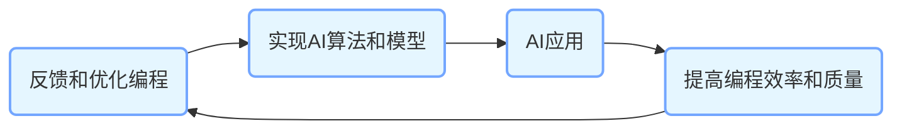

# 编程职业的AI赋能与技能重构

> 关键词：编程职业、AI赋能、技能重构、人工智能、编程技能、职业发展、技术融合

> 摘要：本文深入探讨了编程职业在人工智能时代所面临的变革，即AI赋能与技能重构。首先介绍了研究的背景、目的、预期读者和文档结构，明确了相关术语。接着阐述了编程与AI的核心概念及联系，详细讲解了核心算法原理和具体操作步骤，并结合数学模型和公式进行举例说明。通过项目实战案例，展示了如何在实际开发中应用这些技术。分析了编程职业在不同场景下的实际应用，推荐了学习、开发工具和相关论文著作等资源。最后总结了编程职业的未来发展趋势与挑战，解答了常见问题并提供了扩展阅读和参考资料，旨在帮助编程从业者适应AI时代的发展，实现职业技能的升级和转型。

## 1. 背景介绍 
### 1.1 目的和范围
在当今数字化时代，人工智能（AI）技术正以前所未有的速度发展，并对各个行业产生了深远的影响，编程职业也不例外。本文的目的在于全面探讨AI如何赋能编程职业，以及编程从业者需要进行怎样的技能重构以适应这一变革。研究范围涵盖了AI在编程领域的应用场景、核心算法原理、实际项目案例，以及为适应新趋势所需的技能提升和资源推荐等方面。

### 1.2 预期读者
本文主要面向编程领域的从业者，包括初级、中级和高级程序员、软件工程师、软件架构师等，帮助他们了解AI对编程职业的影响，掌握新的技能和知识，提升职业竞争力。同时，也适合对编程和AI技术感兴趣的学生、研究人员以及相关行业的管理者阅读，为他们提供关于编程职业发展趋势的深入洞察。

### 1.3 文档结构概述
本文将按照以下结构进行组织：首先介绍相关背景和术语，为后续的讨论奠定基础；接着阐述编程与AI的核心概念及联系，通过文本示意图和Mermaid流程图进行直观展示；然后详细讲解核心算法原理和具体操作步骤，并结合数学模型和公式进行分析；通过项目实战案例，展示AI在编程中的实际应用；分析编程职业在不同场景下的实际应用；推荐学习、开发工具和相关论文著作等资源；最后总结编程职业的未来发展趋势与挑战，解答常见问题并提供扩展阅读和参考资料。

### 1.4 术语表
#### 1.4.1 核心术语定义
- **编程职业**：指从事软件开发、程序设计、系统维护等相关工作的职业群体，包括程序员、软件工程师、软件架构师等不同岗位。
- **AI赋能**：指利用人工智能技术为编程职业提供支持和增强，提高编程效率、质量和创新能力。
- **技能重构**：指编程从业者为适应AI时代的发展，对自身的技能体系进行重新构建和升级，包括学习新的技术、方法和工具。
- **人工智能（AI）**：指计算机系统能够执行通常需要人类智能才能完成的任务，如学习、推理、解决问题等。
- **机器学习（ML）**：是人工智能的一个分支，研究计算机如何通过数据和经验来自动改进性能。
- **深度学习（DL）**：是机器学习的一个子领域，基于人工神经网络，通过多层神经网络模型来学习数据的复杂模式和特征。

#### 1.4.2 相关概念解释
- **代码生成**：指利用AI技术自动生成代码的过程，可以提高编程效率和减少人为错误。
- **代码优化**：指对已有的代码进行改进，以提高代码的性能、可读性和可维护性。
- **智能调试**：指利用AI技术辅助调试代码，快速定位和解决代码中的问题。
- **自动化测试**：指利用AI技术自动生成测试用例和执行测试，提高测试效率和覆盖率。

#### 1.4.3 缩略词列表
- **AI**：Artificial Intelligence（人工智能）
- **ML**：Machine Learning（机器学习）
- **DL**：Deep Learning（深度学习）
- **IDE**：Integrated Development Environment（集成开发环境）

## 2. 核心概念与联系 
### 编程与AI的核心概念
编程是指使用计算机语言编写程序，实现特定功能的过程。它是软件开发的基础，涉及到算法设计、数据结构、程序逻辑等多个方面。而人工智能则是让计算机模拟人类智能，实现自主学习、推理和决策的技术。它主要基于机器学习和深度学习等方法，通过大量的数据训练模型，使计算机能够自动识别模式、预测结果和解决问题。

### 编程与AI的联系
编程是实现人工智能的重要手段，几乎所有的AI算法和模型都需要通过编程来实现。同时，AI技术也可以为编程提供强大的支持，例如自动代码生成、智能代码补全、代码优化等。编程与AI的结合可以提高编程效率和质量，推动软件开发的创新和发展。

### 文本示意图
编程与AI的关系可以用以下文本示意图表示：

编程是基础，为AI提供实现的手段和平台。AI是编程的高级应用，通过编程实现各种智能算法和模型。两者相互促进、相互依存，共同推动软件开发和科技进步。

### Mermaid流程图


这个流程图展示了编程和AI之间的循环关系。编程为AI提供了实现的基础，AI应用又反馈并优化编程，形成一个不断发展和进步的循环。

## 3. 核心算法原理 & 具体操作步骤 
### 核心算法原理
在编程职业的AI赋能中，涉及到多种核心算法，以下以机器学习中的决策树算法为例进行详细讲解。

决策树是一种基于树结构进行决策的机器学习算法，它通过对数据的特征进行划分，构建一棵决策树，每个内部节点表示一个特征上的测试，每个分支表示一个测试输出，每个叶节点表示一个类别或值。决策树算法的核心思想是通过递归地选择最优特征进行划分，使得划分后的子数据集尽可能地纯净，即同一子数据集中的样本属于同一类别。

### Python源代码实现决策树算法
```python
import numpy as np
from collections import Counter

# 定义计算信息熵的函数
def entropy(y):
    hist = np.bincount(y)
    ps = hist / len(y)
    return -np.sum([p * np.log2(p) for p in ps if p > 0])

# 定义决策树节点类
class DecisionTreeNode:
    def __init__(self, feature=None, threshold=None, left=None, right=None, *, value=None):
        self.feature = feature
        self.threshold = threshold
        self.left = left
        self.right = right
        self.value = value

    def is_leaf_node(self):
        return self.value is not None

# 定义决策树分类器类
class DecisionTreeClassifier:
    def __init__(self, min_samples_split=2, max_depth=100, n_feats=None):
        self.min_samples_split = min_samples_split
        self.max_depth = max_depth
        self.n_feats = n_feats
        self.root = None

    def fit(self, X, y):
        self.n_feats = X.shape[1] if not self.n_feats else min(self.n_feats, X.shape[1])
        self.root = self._grow_tree(X, y)

    def _grow_tree(self, X, y, depth=0):
        n_samples, n_features = X.shape
        n_labels = len(np.unique(y))

        # 停止条件
        if (depth >= self.max_depth
                or n_labels == 1
                or n_samples < self.min_samples_split):
            leaf_value = self._most_common_label(y)
            return DecisionTreeNode(value=leaf_value)

        feat_idxs = np.random.choice(n_features, self.n_feats, replace=False)

        # 选择最优特征和阈值
        best_feat, best_thresh = self._best_criteria(X, y, feat_idxs)
        left_idxs, right_idxs = self._split(X[:, best_feat], best_thresh)

        # 递归构建左右子树
        left = self._grow_tree(X[left_idxs, :], y[left_idxs], depth + 1)
        right = self._grow_tree(X[right_idxs, :], y[right_idxs], depth + 1)
        return DecisionTreeNode(best_feat, best_thresh, left, right)

    def _best_criteria(self, X, y, feat_idxs):
        best_gain = -1
        split_idx, split_thresh = None, None
        for feat_idx in feat_idxs:
            X_column = X[:, feat_idx]
            thresholds = np.unique(X_column)
            for threshold in thresholds:
                gain = self._information_gain(y, X_column, threshold)

                if gain > best_gain:
                    best_gain = gain
                    split_idx = feat_idx
                    split_thresh = threshold

        return split_idx, split_thresh

    def _information_gain(self, y, X_column, split_thresh):
        # 计算父节点的熵
        parent_entropy = entropy(y)

        # 划分数据
        left_idxs, right_idxs = self._split(X_column, split_thresh)

        if len(left_idxs) == 0 or len(right_idxs) == 0:
            return 0

        # 计算子节点的加权熵
        n = len(y)
        n_l, n_r = len(left_idxs), len(right_idxs)
        e_l, e_r = entropy(y[left_idxs]), entropy(y[right_idxs])
        child_entropy = (n_l / n) * e_l + (n_r / n) * e_r

        # 计算信息增益
        ig = parent_entropy - child_entropy
        return ig

    def _split(self, X_column, split_thresh):
        left_idxs = np.argwhere(X_column <= split_thresh).flatten()
        right_idxs = np.argwhere(X_column > split_thresh).flatten()
        return left_idxs, right_idxs

    def _most_common_label(self, y):
        counter = Counter(y)
        most_common = counter.most_common(1)[0][0]
        return most_common

    def predict(self, X):
        return np.array([self._traverse_tree(x, self.root) for x in X])

    def _traverse_tree(self, x, node):
        if node.is_leaf_node():
            return node.value

        if x[node.feature] <= node.threshold:
            return self._traverse_tree(x, node.left)
        return self._traverse_tree(x, node.right)
```

### 具体操作步骤
1. **数据准备**：收集和整理需要处理的数据，将其分为特征矩阵 `X` 和标签向量 `y`。
2. **模型训练**：创建决策树分类器对象，并调用 `fit` 方法对数据进行训练。
```python
# 示例数据
X = np.array([[2.771244718, 1.784783929],
              [1.728571309, 1.169761413],
              [3.678319846, 2.81281357],
              [3.961043357, 2.61995032],
              [2.999208922, 2.209014212],
              [7.497545867, 3.162953546],
              [9.00220326, 3.339047188],
              [7.444542326, 0.476683375],
              [10.12493903, 3.234550982],
              [6.642287351, 3.319983761]])
y = np.array([0, 0, 0, 0, 0, 1, 1, 1, 1, 1])

# 创建决策树分类器对象
clf = DecisionTreeClassifier(max_depth=2)

# 训练模型
clf.fit(X, y)
```
3. **模型预测**：使用训练好的模型对新的数据进行预测。
```python
# 新数据
X_new = np.array([[3.0, 2.5], [7.5, 3.0]])

# 预测结果
predictions = clf.predict(X_new)
print(predictions)
```

通过以上步骤，我们可以使用决策树算法对数据进行分类，实现编程与AI的结合。

## 4. 数学模型和公式 & 详细讲解 & 举例说明 
### 信息熵
信息熵是衡量数据不确定性的一个指标，它表示数据集中的混乱程度。信息熵的计算公式为：

$$H(Y) = -\sum_{i=1}^{n} p(y_i) \log_2 p(y_i)$$

其中，$Y$ 是一个随机变量，$y_i$ 是 $Y$ 的取值，$p(y_i)$ 是 $y_i$ 出现的概率，$n$ 是 $Y$ 的取值个数。

**详细讲解**：信息熵的值越大，表示数据的不确定性越大，即数据越混乱；信息熵的值越小，表示数据的不确定性越小，即数据越纯净。

**举例说明**：假设有一个数据集，其中有 10 个样本，分为两类，第一类有 3 个样本，第二类有 7 个样本。则第一类的概率 $p_1 = \frac{3}{10}$，第二类的概率 $p_2 = \frac{7}{10}$。该数据集的信息熵为：

$$H(Y) = -(\frac{3}{10} \log_2 \frac{3}{10} + \frac{7}{10} \log_2 \frac{7}{10}) \approx 0.881$$

### 信息增益
信息增益是衡量特征对分类的重要性的一个指标，它表示使用某个特征进行划分后，数据的不确定性减少的程度。信息增益的计算公式为：

$$IG(Y, X) = H(Y) - H(Y|X)$$

其中，$IG(Y, X)$ 表示特征 $X$ 对随机变量 $Y$ 的信息增益，$H(Y)$ 是 $Y$ 的信息熵，$H(Y|X)$ 是在已知特征 $X$ 的条件下，$Y$ 的条件熵。

条件熵的计算公式为：

$$H(Y|X) = \sum_{j=1}^{m} p(x_j) H(Y|X = x_j)$$

其中，$x_j$ 是特征 $X$ 的取值，$p(x_j)$ 是 $x_j$ 出现的概率，$H(Y|X = x_j)$ 是在 $X = x_j$ 的条件下，$Y$ 的信息熵，$m$ 是特征 $X$ 的取值个数。

**详细讲解**：信息增益越大，表示使用该特征进行划分后，数据的不确定性减少得越多，即该特征对分类越重要。

**举例说明**：假设有一个数据集，其中有 10 个样本，分为两类，第一类有 3 个样本，第二类有 7 个样本。现在有一个特征 $X$，它有两个取值 $x_1$ 和 $x_2$，其中 $x_1$ 对应的样本有 4 个，第一类有 1 个，第二类有 3 个；$x_2$ 对应的样本有 6 个，第一类有 2 个，第二类有 4 个。

首先计算 $Y$ 的信息熵：

$$H(Y) = -(\frac{3}{10} \log_2 \frac{3}{10} + \frac{7}{10} \log_2 \frac{7}{10}) \approx 0.881$$

然后计算 $H(Y|X)$：

$p(x_1) = \frac{4}{10}$，$H(Y|X = x_1) = -(\frac{1}{4} \log_2 \frac{1}{4} + \frac{3}{4} \log_2 \frac{3}{4}) \approx 0.811$

$p(x_2) = \frac{6}{10}$，$H(Y|X = x_2) = -(\frac{2}{6} \log_2 \frac{2}{6} + \frac{4}{6} \log_2 \frac{4}{6}) \approx 0.918$

$$H(Y|X) = \frac{4}{10} \times 0.811 + \frac{6}{10} \times 0.918 \approx 0.878$$

最后计算信息增益：

$$IG(Y, X) = H(Y) - H(Y|X) = 0.881 - 0.878 = 0.003$$

通过以上计算，我们可以得到特征 $X$ 对分类的信息增益为 0.003。

## 5. 项目实战：代码实际案例和详细解释说明 
### 5.1  开发环境搭建
#### 安装Python
首先，需要安装Python编程语言。可以从Python官方网站（https://www.python.org/downloads/）下载适合自己操作系统的Python安装包，并按照安装向导进行安装。

#### 安装必要的库
在本项目中，需要使用 `numpy` 库进行数值计算。可以使用以下命令来安装 `numpy` 库：
```sh
pip install numpy
```

### 5.2  源代码详细实现和代码解读
以下是一个完整的决策树分类器的实现代码：

```python
import numpy as np
from collections import Counter

# 定义计算信息熵的函数
def entropy(y):
    hist = np.bincount(y)
    ps = hist / len(y)
    return -np.sum([p * np.log2(p) for p in ps if p > 0])

# 定义决策树节点类
class DecisionTreeNode:
    def __init__(self, feature=None, threshold=None, left=None, right=None, *, value=None):
        self.feature = feature
        self.threshold = threshold
        self.left = left
        self.right = right
        self.value = value

    def is_leaf_node(self):
        return self.value is not None

# 定义决策树分类器类
class DecisionTreeClassifier:
    def __init__(self, min_samples_split=2, max_depth=100, n_feats=None):
        self.min_samples_split = min_samples_split
        self.max_depth = max_depth
        self.n_feats = n_feats
        self.root = None

    def fit(self, X, y):
        self.n_feats = X.shape[1] if not self.n_feats else min(self.n_feats, X.shape[1])
        self.root = self._grow_tree(X, y)

    def _grow_tree(self, X, y, depth=0):
        n_samples, n_features = X.shape
        n_labels = len(np.unique(y))

        # 停止条件
        if (depth >= self.max_depth
                or n_labels == 1
                or n_samples < self.min_samples_split):
            leaf_value = self._most_common_label(y)
            return DecisionTreeNode(value=leaf_value)

        feat_idxs = np.random.choice(n_features, self.n_feats, replace=False)

        # 选择最优特征和阈值
        best_feat, best_thresh = self._best_criteria(X, y, feat_idxs)
        left_idxs, right_idxs = self._split(X[:, best_feat], best_thresh)

        # 递归构建左右子树
        left = self._grow_tree(X[left_idxs, :], y[left_idxs], depth + 1)
        right = self._grow_tree(X[right_idxs, :], y[right_idxs], depth + 1)
        return DecisionTreeNode(best_feat, best_thresh, left, right)

    def _best_criteria(self, X, y, feat_idxs):
        best_gain = -1
        split_idx, split_thresh = None, None
        for feat_idx in feat_idxs:
            X_column = X[:, feat_idx]
            thresholds = np.unique(X_column)
            for threshold in thresholds:
                gain = self._information_gain(y, X_column, threshold)

                if gain > best_gain:
                    best_gain = gain
                    split_idx = feat_idx
                    split_thresh = threshold

        return split_idx, split_thresh

    def _information_gain(self, y, X_column, split_thresh):
        # 计算父节点的熵
        parent_entropy = entropy(y)

        # 划分数据
        left_idxs, right_idxs = self._split(X_column, split_thresh)

        if len(left_idxs) == 0 or len(right_idxs) == 0:
            return 0

        # 计算子节点的加权熵
        n = len(y)
        n_l, n_r = len(left_idxs), len(right_idxs)
        e_l, e_r = entropy(y[left_idxs]), entropy(y[right_idxs])
        child_entropy = (n_l / n) * e_l + (n_r / n) * e_r

        # 计算信息增益
        ig = parent_entropy - child_entropy
        return ig

    def _split(self, X_column, split_thresh):
        left_idxs = np.argwhere(X_column <= split_thresh).flatten()
        right_idxs = np.argwhere(X_column > split_thresh).flatten()
        return left_idxs, right_idxs

    def _most_common_label(self, y):
        counter = Counter(y)
        most_common = counter.most_common(1)[0][0]
        return most_common

    def predict(self, X):
        return np.array([self._traverse_tree(x, self.root) for x in X])

    def _traverse_tree(self, x, node):
        if node.is_leaf_node():
            return node.value

        if x[node.feature] <= node.threshold:
            return self._traverse_tree(x, node.left)
        return self._traverse_tree(x, node.right)

# 示例数据
X = np.array([[2.771244718, 1.784783929],
              [1.728571309, 1.169761413],
              [3.678319846, 2.81281357],
              [3.961043357, 2.61995032],
              [2.999208922, 2.209014212],
              [7.497545867, 3.162953546],
              [9.00220326, 3.339047188],
              [7.444542326, 0.476683375],
              [10.12493903, 3.234550982],
              [6.642287351, 3.319983761]])
y = np.array([0, 0, 0, 0, 0, 1, 1, 1, 1, 1])

# 创建决策树分类器对象
clf = DecisionTreeClassifier(max_depth=2)

# 训练模型
clf.fit(X, y)

# 新数据
X_new = np.array([[3.0, 2.5], [7.5, 3.0]])

# 预测结果
predictions = clf.predict(X_new)
print(predictions)
```

### 5.3  代码解读与分析
#### 信息熵计算函数 `entropy`
该函数用于计算数据的信息熵。首先使用 `np.bincount` 函数统计每个标签出现的次数，然后计算每个标签出现的概率，最后根据信息熵的计算公式计算信息熵。

#### 决策树节点类 `DecisionTreeNode`
该类用于表示决策树的节点，包含特征、阈值、左右子节点和值等属性。`is_leaf_node` 方法用于判断该节点是否为叶节点。

#### 决策树分类器类 `DecisionTreeClassifier`
- `__init__` 方法：初始化决策树分类器的参数，包括最小样本分割数、最大深度和特征数等。
- `fit` 方法：用于训练决策树模型，调用 `_grow_tree` 方法递归构建决策树。
- `_grow_tree` 方法：递归构建决策树，根据停止条件判断是否为叶节点，选择最优特征和阈值进行划分，递归构建左右子树。
- `_best_criteria` 方法：选择最优特征和阈值，通过遍历所有特征和阈值，计算信息增益，选择信息增益最大的特征和阈值。
- `_information_gain` 方法：计算信息增益，根据信息增益的计算公式计算使用某个特征进行划分后的信息增益。
- `_split` 方法：根据阈值将数据划分为左右两部分。
- `_most_common_label` 方法：返回数据中出现次数最多的标签。
- `predict` 方法：对新数据进行预测，调用 `_traverse_tree` 方法遍历决策树。
- `_traverse_tree` 方法：递归遍历决策树，根据节点的特征和阈值判断向左还是向右遍历，直到到达叶节点。

通过以上代码和分析，我们可以看到如何使用Python实现一个简单的决策树分类器，并进行数据的分类预测。

## 6. 实际应用场景 
### 软件开发
在软件开发中，AI可以为编程提供多种支持，例如：
- **代码生成**：利用AI技术自动生成代码，提高开发效率。例如，一些代码生成工具可以根据用户的需求和模板，自动生成特定功能的代码。
- **代码优化**：通过分析代码的性能瓶颈和潜在问题，使用AI算法对代码进行优化，提高代码的执行效率和质量。
- **智能调试**：利用AI技术辅助调试代码，快速定位和解决代码中的问题。例如，一些调试工具可以通过分析代码的运行日志和错误信息，自动推荐可能的解决方案。

### 数据分析
在数据分析领域，编程与AI的结合可以实现更高效、更准确的数据分析。例如：
- **数据预处理**：使用编程和AI算法对数据进行清洗、转换和特征提取，提高数据的质量和可用性。
- **数据挖掘**：利用机器学习和深度学习算法挖掘数据中的潜在模式和规律，为决策提供支持。
- **预测分析**：通过建立预测模型，对未来的趋势和结果进行预测，帮助企业做出更明智的决策。

### 自然语言处理
在自然语言处理领域，编程和AI技术可以实现多种应用，例如：
- **机器翻译**：使用深度学习模型实现自动翻译，提高翻译的效率和质量。
- **文本分类**：对文本进行分类，例如新闻分类、情感分析等，帮助用户快速获取所需信息。
- **语音识别**：将语音转换为文本，实现语音交互，例如智能语音助手、语音输入等。

### 计算机视觉
在计算机视觉领域，编程和AI技术可以实现图像和视频的处理和分析，例如：
- **图像识别**：识别图像中的物体、场景和特征，例如人脸识别、物体检测等。
- **图像生成**：使用深度学习模型生成逼真的图像，例如图像风格转换、图像超分辨率等。
- **视频分析**：对视频进行分析，例如行为识别、视频监控等。

## 7. 工具和资源推荐
### 7.1 学习资源推荐
#### 7.1.1 书籍推荐
- 《Python机器学习》：这本书详细介绍了Python在机器学习中的应用，包括各种机器学习算法的原理和实现，以及如何使用Python进行数据处理、模型训练和评估等。
- 《深度学习》：由深度学习领域的三位顶尖专家所著，全面介绍了深度学习的理论和实践，是深度学习领域的经典教材。
- 《人工智能：一种现代的方法》：这本书是人工智能领域的权威教材，涵盖了人工智能的各个方面，包括搜索算法、知识表示、机器学习、自然语言处理等。

#### 7.1.2 在线课程
- Coursera上的“机器学习”课程：由斯坦福大学教授Andrew Ng主讲，是机器学习领域的经典课程，介绍了机器学习的基本概念、算法和应用。
- edX上的“深度学习”课程：由百度首席科学家吴恩达主讲，深入介绍了深度学习的原理和实践，包括神经网络、卷积神经网络、循环神经网络等。
- 中国大学MOOC上的“Python语言程序设计”课程：由北京理工大学教授嵩天主讲，适合初学者学习Python编程语言。

#### 7.1.3 技术博客和网站
- Medium：是一个知名的技术博客平台，上面有很多关于编程、AI和机器学习的优质文章。
- Towards Data Science：专注于数据科学和机器学习领域，提供了很多实用的技术文章和案例分析。
- GitHub：是全球最大的开源代码托管平台，上面有很多优秀的开源项目和代码示例，可以学习和参考。

### 7.2 开发工具框架推荐
#### 7.2.1 IDE和编辑器
- PyCharm：是一款专门为Python开发设计的集成开发环境，具有代码自动补全、调试、版本控制等功能，适合专业的Python开发者使用。
- Visual Studio Code：是一款轻量级的代码编辑器，支持多种编程语言，具有丰富的插件生态系统，可以根据自己的需求进行扩展。
- Jupyter Notebook：是一个交互式的编程环境，适合进行数据分析和机器学习实验，支持Python、R等多种编程语言。

#### 7.2.2 调试和性能分析工具
- PDB：是Python自带的调试工具，可以在代码中设置断点，逐步执行代码，查看变量的值和程序的执行流程。
- cProfile：是Python的性能分析工具，可以分析代码的运行时间和函数调用次数，帮助找出性能瓶颈。
- TensorBoard：是TensorFlow的可视化工具，可以用于可视化训练过程、模型结构和数据分布等。

#### 7.2.3 相关框架和库
- TensorFlow：是Google开发的开源深度学习框架，提供了丰富的工具和接口，支持各种深度学习模型的开发和训练。
- PyTorch：是Facebook开发的开源深度学习框架，具有动态图机制，易于使用和调试，受到了很多研究者和开发者的喜爱。
- Scikit-learn：是一个简单易用的机器学习库，提供了各种机器学习算法和工具，适合初学者和快速开发。

### 7.3 相关论文著作推荐
#### 7.3.1 经典论文
- 《Gradient-Based Learning Applied to Document Recognition》：这篇论文介绍了卷积神经网络（CNN）在手写数字识别中的应用，是CNN领域的经典论文。
- 《Long Short-Term Memory》：这篇论文提出了长短期记忆网络（LSTM），解决了传统循环神经网络（RNN）的梯度消失问题，是RNN领域的重要突破。
- 《Attention Is All You Need》：这篇论文提出了Transformer模型，是自然语言处理领域的重大创新，推动了语言模型的发展。

#### 7.3.2 最新研究成果
- 《GPT-3: Language Models are Few-Shot Learners》：介绍了OpenAI的GPT-3模型，该模型在自然语言处理任务中取得了惊人的成绩，展示了大规模预训练模型的强大能力。
- 《Masked Autoencoders Are Scalable Vision Learners》：提出了一种基于自编码器的视觉预训练方法，在计算机视觉领域取得了很好的效果。

#### 7.3.3 应用案例分析
- 《AI in Healthcare: Transforming the Future of Medicine》：分析了AI在医疗领域的应用案例，包括疾病诊断、药物研发、医疗影像分析等。
- 《AI in Finance: Revolutionizing the Financial Industry》：探讨了AI在金融领域的应用，如风险评估、投资决策、欺诈检测等。

## 8. 总结：未来发展趋势与挑战
### 未来发展趋势
- **AI与编程的深度融合**：未来，AI将更加深入地融入编程过程中，实现更高级的代码生成、智能调试和自动化测试等功能，大大提高编程效率和质量。
- **跨领域应用的拓展**：编程和AI技术将在更多的领域得到应用，如医疗、交通、能源等，为解决复杂的实际问题提供强大的支持。
- **低代码和无代码开发的普及**：随着AI技术的发展，低代码和无代码开发平台将越来越成熟，使得非专业编程人员也能够轻松开发出应用程序，进一步扩大编程的应用范围。
- **人工智能芯片的发展**：为了满足AI计算的需求，人工智能芯片将得到快速发展，提高AI算法的运行效率，推动AI技术的普及和应用。

### 挑战
- **技术更新换代快**：编程和AI技术发展迅速，知识更新换代快，编程从业者需要不断学习和更新知识，以适应技术的发展。
- **数据安全和隐私问题**：随着AI技术的广泛应用，数据安全和隐私问题日益突出。编程从业者需要关注数据安全和隐私保护，采取有效的措施来保障用户的数据安全。
- **伦理和法律问题**：AI技术的发展也带来了一系列伦理和法律问题，如算法偏见、人工智能的责任认定等。编程从业者需要了解相关的伦理和法律规定，确保AI技术的合法、合规应用。
- **人才短缺**：随着AI技术的发展，对编程和AI人才的需求越来越大，人才短缺问题日益突出。需要加强人才培养，提高编程和AI人才的数量和质量。

## 9. 附录：常见问题与解答
### 问题1：AI会取代编程职业吗？
解答：AI不会取代编程职业，但会对编程职业产生深远的影响。AI可以为编程提供支持和增强，提高编程效率和质量，但编程仍然需要人类的创造力、逻辑思维和问题解决能力。未来，编程从业者需要与AI技术相结合，不断提升自己的技能，以适应新的发展需求。

### 问题2：学习AI需要具备哪些编程基础？
解答：学习AI通常需要具备一定的Python编程基础，因为Python是AI领域最常用的编程语言之一，具有丰富的库和工具。此外，还需要了解一些基本的编程概念，如变量、数据类型、控制结构、函数等。

### 问题3：如何提高编程和AI技能？
解答：可以通过以下方式提高编程和AI技能：
- 学习相关的理论知识，阅读专业书籍和论文。
- 参加在线课程和培训，系统地学习编程和AI技术。
- 实践项目，通过实际项目来应用所学的知识，提高解决问题的能力。
- 参与开源项目，与其他开发者交流和合作，学习他们的经验和技巧。
- 关注行业动态和最新研究成果，不断更新自己的知识。

### 问题4：AI在编程中的应用有哪些限制？
解答：AI在编程中的应用存在一些限制，例如：
- 数据质量和数量：AI算法需要大量高质量的数据进行训练，如果数据质量不高或数量不足，可能会影响模型的性能。
- 模型解释性：一些复杂的AI模型，如深度学习模型，缺乏良好的解释性，难以理解模型的决策过程。
- 算法复杂度：一些AI算法的复杂度较高，需要大量的计算资源和时间，在实际应用中可能会受到限制。
- 伦理和法律问题：AI的应用可能会带来一些伦理和法律问题，如算法偏见、隐私保护等，需要谨慎处理。

## 10. 扩展阅读 & 参考资料
### 扩展阅读
- 《AI 3.0》：作者李开复在书中探讨了人工智能的发展现状和未来趋势，以及对人类社会的影响。
- 《智能时代》：吴军博士在书中介绍了智能时代的特点和发展趋势，以及如何在智能时代中取得成功。
- 《失控》：凯文·凯利的经典著作，探讨了科技、社会和生物系统中的失控现象，对理解人工智能的发展具有启发意义。

### 参考资料
- 《Python机器学习实战》：这本书提供了很多Python在机器学习中的实际应用案例，可以帮助读者更好地理解和掌握机器学习算法。
- 《深度学习实战》：通过实际项目介绍了深度学习的原理和应用，适合有一定编程基础的读者学习。
- 相关学术期刊和会议论文，如《Journal of Artificial Intelligence Research》、《Neural Information Processing Systems》等，这些文献可以提供最新的研究成果和技术进展。