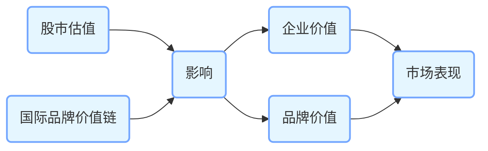

# 股市估值在国际品牌价值链分析中的应用

> 关键词：股市估值、国际品牌、价值链分析、企业价值、市场评估

> 摘要：本文聚焦于股市估值在国际品牌价值链分析中的应用。首先介绍了相关的背景知识，包括研究的目的、范围、预期读者等内容。接着阐述了股市估值和国际品牌价值链的核心概念及其联系，深入讲解了核心算法原理与具体操作步骤，并给出了相应的数学模型和公式。通过项目实战展示了如何运用相关理论进行实际操作，详细解读了代码案例。分析了股市估值在国际品牌价值链分析中的实际应用场景，推荐了相关的工具和资源，包括学习资料、开发工具框架以及论文著作等。最后总结了未来的发展趋势与挑战，提供了常见问题解答和扩展阅读参考资料，旨在全面探讨股市估值在国际品牌价值链分析领域的重要作用和应用方法。

## 1. 背景介绍 
### 1.1 目的和范围
在当今全球化的经济环境下，国际品牌的竞争日益激烈。品牌作为企业的重要资产，其价值的评估和管理对于企业的战略决策、市场竞争以及投资者的决策都具有至关重要的意义。股市估值作为一种市场对企业价值的评估方式，与国际品牌的价值链分析存在着密切的联系。本研究的目的在于深入探讨股市估值在国际品牌价值链分析中的应用，揭示两者之间的内在关系，为企业管理者、投资者以及相关研究人员提供理论和实践指导。

研究范围涵盖了不同行业、不同地区的国际品牌，分析股市估值的各种方法在国际品牌价值链不同环节的应用，包括品牌的创建、发展、维护和提升等阶段，以及这些应用对企业战略决策和市场表现的影响。

### 1.2 预期读者
本文预期读者包括企业管理者，尤其是品牌管理、市场营销和战略规划领域的专业人士，他们可以通过本文了解如何利用股市估值信息优化品牌价值链管理，制定更有效的品牌战略。投资者也可以从本文中获得启示，更好地评估国际品牌企业的投资价值，做出更明智的投资决策。此外，学术界的研究人员、学生以及对品牌价值评估和股市分析感兴趣的人士也可以从本文中获取有价值的信息和研究思路。

### 1.3 文档结构概述
本文将按照以下结构展开：首先介绍背景知识，包括研究目的、范围、预期读者等内容；接着阐述股市估值和国际品牌价值链的核心概念及其联系，通过文本示意图和 Mermaid 流程图进行直观展示；然后深入讲解核心算法原理与具体操作步骤，并给出相应的数学模型和公式；通过项目实战展示如何运用相关理论进行实际操作，详细解读代码案例；分析股市估值在国际品牌价值链分析中的实际应用场景；推荐相关的工具和资源，包括学习资料、开发工具框架以及论文著作等；最后总结未来的发展趋势与挑战，提供常见问题解答和扩展阅读参考资料。

### 1.4 术语表
#### 1.4.1 核心术语定义
- **股市估值**：是指通过各种方法和模型对股票的内在价值进行评估，以判断股票价格是否合理，从而为投资者的决策提供依据。常见的股市估值方法包括市盈率法、市净率法、现金流折现法等。
- **国际品牌**：是指在全球范围内具有较高知名度、美誉度和市场份额的品牌。国际品牌通常具有强大的品牌影响力、独特的品牌文化和较高的品牌忠诚度，能够在不同国家和地区的市场上获得消费者的认可和信任。
- **价值链分析**：是一种将企业的生产经营活动分解为一系列相互关联的价值创造环节的分析方法。通过对价值链的分析，可以识别企业的核心竞争力和竞争优势所在，发现潜在的价值增长点，从而为企业的战略决策提供支持。

#### 1.4.2 相关概念解释
- **品牌价值**：是指品牌在消费者心目中的形象、声誉和地位所带来的价值。品牌价值不仅包括品牌的经济价值，还包括品牌的社会价值和文化价值。品牌价值的评估是一个复杂的过程，需要综合考虑多个因素，如品牌知名度、品牌美誉度、品牌忠诚度、品牌市场份额等。
- **企业价值**：是指企业的整体价值，包括企业的有形资产和无形资产。企业价值的评估通常采用现金流折现法、市场比较法等方法，通过对企业未来现金流的预测和折现，以及与同行业其他企业的比较，来确定企业的价值。

#### 1.4.3 缩略词列表
- **PE**：市盈率（Price - Earnings Ratio），是指股票价格与每股收益的比率，用于衡量股票的估值水平。
- **PB**：市净率（Price - Book Ratio），是指股票价格与每股净资产的比率，用于衡量股票的估值水平。
- **DCF**：现金流折现法（Discounted Cash Flow），是一种通过对企业未来现金流进行预测和折现来评估企业价值的方法。

## 2. 核心概念与联系 
### 2.1 股市估值的核心概念
股市估值是金融领域中一个重要的概念，其目的是确定股票的内在价值，从而判断股票价格是否被高估或低估。常见的股市估值方法有以下几种：

- **市盈率法（PE）**：市盈率是股票价格与每股收益的比率，反映了投资者为获得一元净利润所愿意支付的价格。计算公式为：$PE=\frac{P}{EPS}$，其中 $P$ 为股票价格，$EPS$ 为每股收益。市盈率法适用于盈利稳定、增长前景明确的企业。
- **市净率法（PB）**：市净率是股票价格与每股净资产的比率，反映了股票价格相对于每股净资产的倍数。计算公式为：$PB=\frac{P}{BVPS}$，其中 $P$ 为股票价格，$BVPS$ 为每股净资产。市净率法适用于资产规模较大、净资产较为稳定的企业。
- **现金流折现法（DCF）**：现金流折现法是通过对企业未来现金流进行预测，并将其折现到当前时刻来评估企业价值的方法。该方法的核心思想是企业的价值等于其未来现金流的现值之和。计算公式为：$V=\sum_{t = 1}^{n}\frac{FCF_t}{(1 + r)^t}$，其中 $V$ 为企业价值，$FCF_t$ 为第 $t$ 期的自由现金流，$r$ 为折现率，$n$ 为预测期数。

### 2.2 国际品牌价值链的核心概念
国际品牌价值链是指国际品牌在创建、发展、维护和提升过程中所涉及的一系列价值创造活动的集合。国际品牌价值链可以分为上游、中游和下游三个环节：

- **上游环节**：主要包括品牌的研发、设计和创新等活动。这些活动是品牌价值创造的基础，决定了品牌的产品或服务的质量和差异化程度。
- **中游环节**：主要包括品牌的生产、制造和供应链管理等活动。这些活动确保了品牌的产品或服务能够高效、稳定地生产和供应。
- **下游环节**：主要包括品牌的营销、销售和客户服务等活动。这些活动是品牌价值实现的关键，决定了品牌的市场份额和品牌忠诚度。

### 2.3 股市估值与国际品牌价值链的联系
股市估值与国际品牌价值链之间存在着密切的联系。一方面，国际品牌的价值会影响股市估值。一个具有强大品牌价值的国际品牌企业，通常具有较高的市场竞争力和盈利能力，其股票价格也会相应地较高。另一方面，股市估值也可以反映国际品牌价值链的运行状况。通过对股市估值的分析，可以了解投资者对国际品牌企业的未来发展前景的预期，从而评估国际品牌价值链的有效性和可持续性。

### 2.4 文本示意图
```plaintext
股市估值 <------> 国际品牌价值链
    |                |
    |  相互影响      |  价值创造
    |                |
    V                V
企业价值           品牌价值
```

### 2.5 Mermaid 流程图


## 3. 核心算法原理 & 具体操作步骤 
### 3.1 市盈率法（PE）的算法原理与操作步骤
#### 3.1.1 算法原理
市盈率法的基本原理是通过比较目标企业的市盈率与同行业其他企业的市盈率，来判断目标企业的股票是否被高估或低估。如果目标企业的市盈率高于同行业平均水平，则可能意味着目标企业的股票被高估；反之，如果目标企业的市盈率低于同行业平均水平，则可能意味着目标企业的股票被低估。

#### 3.1.2 操作步骤
1. **确定同行业可比企业**：选择与目标企业处于同一行业、具有相似业务模式和财务状况的企业作为可比企业。
2. **计算可比企业的平均市盈率**：收集可比企业的股票价格和每股收益数据，计算其平均市盈率。
3. **计算目标企业的每股收益**：收集目标企业的财务报表数据，计算其每股收益。
4. **计算目标企业的合理股价**：用可比企业的平均市盈率乘以目标企业的每股收益，得到目标企业的合理股价。
5. **比较目标企业的实际股价与合理股价**：如果目标企业的实际股价高于合理股价，则可能意味着目标企业的股票被高估；反之，如果目标企业的实际股价低于合理股价，则可能意味着目标企业的股票被低估。

#### 3.1.3 Python 源代码实现
```python
# 定义可比企业的股票价格和每股收益数据
comparable_prices = [50, 60, 70]
comparable_eps = [2, 3, 4]

# 计算可比企业的平均市盈率
average_pe = sum([price / eps for price, eps in zip(comparable_prices, comparable_eps)]) / len(comparable_prices)

# 定义目标企业的每股收益
target_eps = 3

# 计算目标企业的合理股价
target_price = average_pe * target_eps

print(f"可比企业的平均市盈率: {average_pe}")
print(f"目标企业的合理股价: {target_price}")
```

### 3.2 市净率法（PB）的算法原理与操作步骤
#### 3.2.1 算法原理
市净率法的基本原理是通过比较目标企业的市净率与同行业其他企业的市净率，来判断目标企业的股票是否被高估或低估。如果目标企业的市净率高于同行业平均水平，则可能意味着目标企业的股票被高估；反之，如果目标企业的市净率低于同行业平均水平，则可能意味着目标企业的股票被低估。

#### 3.2.2 操作步骤
1. **确定同行业可比企业**：选择与目标企业处于同一行业、具有相似业务模式和财务状况的企业作为可比企业。
2. **计算可比企业的平均市净率**：收集可比企业的股票价格和每股净资产数据，计算其平均市净率。
3. **计算目标企业的每股净资产**：收集目标企业的财务报表数据，计算其每股净资产。
4. **计算目标企业的合理股价**：用可比企业的平均市净率乘以目标企业的每股净资产，得到目标企业的合理股价。
5. **比较目标企业的实际股价与合理股价**：如果目标企业的实际股价高于合理股价，则可能意味着目标企业的股票被高估；反之，如果目标企业的实际股价低于合理股价，则可能意味着目标企业的股票被低估。

#### 3.2.3 Python 源代码实现
```python
# 定义可比企业的股票价格和每股净资产数据
comparable_prices = [50, 60, 70]
comparable_bvps = [10, 12, 14]

# 计算可比企业的平均市净率
average_pb = sum([price / bvps for price, bvps in zip(comparable_prices, comparable_bvps)]) / len(comparable_prices)

# 定义目标企业的每股净资产
target_bvps = 13

# 计算目标企业的合理股价
target_price = average_pb * target_bvps

print(f"可比企业的平均市净率: {average_pb}")
print(f"目标企业的合理股价: {target_price}")
```

### 3.3 现金流折现法（DCF）的算法原理与操作步骤
#### 3.3.1 算法原理
现金流折现法的基本原理是将企业未来的自由现金流折现到当前时刻，以确定企业的内在价值。该方法基于货币时间价值的概念，认为未来的现金流在当前时刻的价值低于其名义价值，因此需要对未来现金流进行折现。

#### 3.3.2 操作步骤
1. **预测企业未来的自由现金流**：根据企业的历史财务数据、市场趋势和行业前景等因素，预测企业未来若干年的自由现金流。
2. **确定折现率**：折现率反映了投资者对企业未来现金流的风险预期，通常采用加权平均资本成本（WACC）作为折现率。
3. **计算企业的持续价值**：在预测期结束后，假设企业的自由现金流以一个稳定的增长率持续增长，计算企业的持续价值。
4. **折现未来现金流和持续价值**：将预测期内的自由现金流和持续价值折现到当前时刻，得到企业的内在价值。
5. **计算每股价值**：将企业的内在价值除以总股本，得到每股价值。

#### 3.3.3 Python 源代码实现
```python
# 定义预测期内的自由现金流
fcfs = [100, 120, 140, 160, 180]

# 定义折现率
discount_rate = 0.1

# 定义预测期结束后的增长率
terminal_growth_rate = 0.03

# 计算预测期内的现金流现值
present_values = []
for i, fcf in enumerate(fcfs):
    present_value = fcf / (1 + discount_rate) ** (i + 1)
    present_values.append(present_value)

# 计算持续价值
terminal_value = fcfs[-1] * (1 + terminal_growth_rate) / (discount_rate - terminal_growth_rate)
terminal_present_value = terminal_value / (1 + discount_rate) ** len(fcfs)

# 计算企业的内在价值
intrinsic_value = sum(present_values) + terminal_present_value

# 定义总股本
shares_outstanding = 100

# 计算每股价值
per_share_value = intrinsic_value / shares_outstanding

print(f"企业的内在价值: {intrinsic_value}")
print(f"每股价值: {per_share_value}")
```

## 4. 数学模型和公式 & 详细讲解 & 举例说明 
### 4.1 市盈率法（PE）的数学模型和公式
#### 4.1.1 数学模型
市盈率法的数学模型可以表示为：$P = PE\times EPS$，其中 $P$ 为股票价格，$PE$ 为市盈率，$EPS$ 为每股收益。

#### 4.1.2 详细讲解
市盈率是衡量股票估值水平的一个重要指标。它反映了投资者为获得一元净利润所愿意支付的价格。一般来说，市盈率越高，说明投资者对企业的未来增长前景越乐观；反之，市盈率越低，说明投资者对企业的未来增长前景越悲观。

#### 4.1.3 举例说明
假设某企业的每股收益为 $2$ 元，同行业平均市盈率为 $15$ 倍。根据市盈率法，该企业的合理股价为：$P = 15\times2 = 30$ 元。如果该企业的实际股价为 $35$ 元，则可能意味着该企业的股票被高估；反之，如果该企业的实际股价为 $25$ 元，则可能意味着该企业的股票被低估。

### 4.2 市净率法（PB）的数学模型和公式
#### 4.2.1 数学模型
市净率法的数学模型可以表示为：$P = PB\times BVPS$，其中 $P$ 为股票价格，$PB$ 为市净率，$BVPS$ 为每股净资产。

#### 4.2.2 详细讲解
市净率是衡量股票估值水平的另一个重要指标。它反映了股票价格相对于每股净资产的倍数。一般来说，市净率越高，说明企业的资产质量越好，市场对企业的认可度越高；反之，市净率越低，说明企业的资产质量越差，市场对企业的认可度越低。

#### 4.2.3 举例说明
假设某企业的每股净资产为 $10$ 元，同行业平均市净率为 $2$ 倍。根据市净率法，该企业的合理股价为：$P = 2\times10 = 20$ 元。如果该企业的实际股价为 $25$ 元，则可能意味着该企业的股票被高估；反之，如果该企业的实际股价为 $15$ 元，则可能意味着该企业的股票被低估。

### 4.3 现金流折现法（DCF）的数学模型和公式
#### 4.3.1 数学模型
现金流折现法的数学模型可以表示为：$V=\sum_{t = 1}^{n}\frac{FCF_t}{(1 + r)^t}+\frac{TV}{(1 + r)^n}$，其中 $V$ 为企业价值，$FCF_t$ 为第 $t$ 期的自由现金流，$r$ 为折现率，$n$ 为预测期数，$TV$ 为持续价值。

#### 4.3.2 详细讲解
现金流折现法的核心思想是将企业未来的自由现金流折现到当前时刻，以确定企业的内在价值。预测期内的自由现金流反映了企业在未来若干年内的经营活动所产生的现金流量，持续价值反映了企业在预测期结束后持续经营所产生的现金流量的现值。折现率反映了投资者对企业未来现金流的风险预期，通常采用加权平均资本成本（WACC）作为折现率。

#### 4.3.3 举例说明
假设某企业未来 $5$ 年的自由现金流分别为 $100$ 万元、$120$ 万元、$140$ 万元、$160$ 万元和 $180$ 万元，折现率为 $10\%$，预测期结束后的增长率为 $3\%$。则该企业的持续价值为：

$TV=\frac{180\times(1 + 0.03)}{0.1 - 0.03}=\frac{185.4}{0.07}\approx2648.57$（万元）

预测期内的现金流现值分别为：

$PV_1=\frac{100}{(1 + 0.1)^1}\approx90.91$（万元）

$PV_2=\frac{120}{(1 + 0.1)^2}\approx99.17$（万元）

$PV_3=\frac{140}{(1 + 0.1)^3}\approx105.18$（万元）

$PV_4=\frac{160}{(1 + 0.1)^4}\approx109.29$（万元）

$PV_5=\frac{180}{(1 + 0.1)^5}\approx111.74$（万元）

企业的内在价值为：

$V = 90.91 + 99.17 + 105.18 + 109.29 + 111.74+ \frac{2648.57}{(1 + 0.1)^5}\approx1975.64$（万元）

## 5. 项目实战：代码实际案例和详细解释说明 
### 5.1  开发环境搭建
#### 5.1.1 安装 Python
首先，需要安装 Python 开发环境。可以从 Python 官方网站（https://www.python.org/downloads/）下载适合自己操作系统的 Python 安装包，并按照安装向导进行安装。

#### 5.1.2 安装必要的库
在本项目中，需要使用一些 Python 库来进行数据处理和分析，如 `pandas`、`numpy` 等。可以使用 `pip` 命令来安装这些库：
```sh
pip install pandas numpy
```

### 5.2  源代码详细实现和代码解读
#### 5.2.1 数据获取与处理
```python
import pandas as pd
import numpy as np

# 模拟获取可比企业的财务数据
comparable_data = {
    '股票价格': [50, 60, 70],
    '每股收益': [2, 3, 4],
    '每股净资产': [10, 12, 14]
}

comparable_df = pd.DataFrame(comparable_data)

# 模拟获取目标企业的财务数据
target_data = {
    '每股收益': [3],
    '每股净资产': [13]
}

target_df = pd.DataFrame(target_data)

print("可比企业的财务数据:")
print(comparable_df)
print("目标企业的财务数据:")
print(target_df)
```
**代码解读**：
- 首先，使用 `pandas` 库创建了两个数据框 `comparable_df` 和 `target_df`，分别存储可比企业和目标企业的财务数据。
- 然后，打印出可比企业和目标企业的财务数据，方便查看和验证。

#### 5.2.2 市盈率法估值
```python
# 计算可比企业的平均市盈率
comparable_df['市盈率'] = comparable_df['股票价格'] / comparable_df['每股收益']
average_pe = comparable_df['市盈率'].mean()

# 计算目标企业的合理股价
target_df['合理股价（市盈率法）'] = average_pe * target_df['每股收益']

print("可比企业的平均市盈率:")
print(average_pe)
print("目标企业的合理股价（市盈率法）:")
print(target_df['合理股价（市盈率法）'])
```
**代码解读**：
- 首先，计算可比企业的市盈率，并将结果存储在 `comparable_df` 数据框的 `市盈率` 列中。
- 然后，计算可比企业的平均市盈率。
- 最后，使用平均市盈率乘以目标企业的每股收益，得到目标企业的合理股价，并将结果存储在 `target_df` 数据框的 `合理股价（市盈率法）` 列中。

#### 5.2.3 市净率法估值
```python
# 计算可比企业的平均市净率
comparable_df['市净率'] = comparable_df['股票价格'] / comparable_df['每股净资产']
average_pb = comparable_df['市净率'].mean()

# 计算目标企业的合理股价
target_df['合理股价（市净率法）'] = average_pb * target_df['每股净资产']

print("可比企业的平均市净率:")
print(average_pb)
print("目标企业的合理股价（市净率法）:")
print(target_df['合理股价（市净率法）'])
```
**代码解读**：
- 首先，计算可比企业的市净率，并将结果存储在 `comparable_df` 数据框的 `市净率` 列中。
- 然后，计算可比企业的平均市净率。
- 最后，使用平均市净率乘以目标企业的每股净资产，得到目标企业的合理股价，并将结果存储在 `target_df` 数据框的 `合理股价（市净率法）` 列中。

### 5.3  代码解读与分析
#### 5.3.1 数据处理部分
在数据处理部分，使用 `pandas` 库创建了数据框来存储可比企业和目标企业的财务数据。这种方式使得数据的管理和处理更加方便，同时也便于后续的计算和分析。

#### 5.3.2 估值计算部分
在估值计算部分，分别使用市盈率法和市净率法计算了目标企业的合理股价。通过计算可比企业的平均市盈率和平均市净率，并将其应用到目标企业的财务数据上，得到了目标企业的合理股价。这种方法基于同行业企业的估值水平来评估目标企业的价值，具有一定的合理性和参考价值。

#### 5.3.3 局限性分析
需要注意的是，本代码示例只是一个简单的模拟，实际应用中可能需要考虑更多的因素。例如，在选择可比企业时，需要确保其与目标企业具有相似的业务模式、财务状况和市场环境；在计算市盈率和市净率时，需要考虑企业的盈利质量、资产质量等因素。此外，不同的估值方法可能会得出不同的结果，因此需要综合考虑多种因素，选择合适的估值方法。

## 6. 实际应用场景 
### 6.1 企业战略决策
股市估值在国际品牌价值链分析中的应用可以为企业的战略决策提供重要的参考依据。通过对股市估值的分析，企业可以了解市场对自身品牌价值的认可程度，从而制定相应的品牌战略。例如，如果股市估值显示企业的品牌价值被低估，企业可以考虑加大品牌建设和营销投入，提升品牌知名度和美誉度，以提高品牌价值和股市估值。反之，如果股市估值显示企业的品牌价值被高估，企业需要谨慎对待，避免盲目扩张，注重品牌的可持续发展。

### 6.2 投资者决策
对于投资者来说，股市估值在国际品牌价值链分析中的应用可以帮助他们更好地评估国际品牌企业的投资价值。投资者可以通过分析股市估值和国际品牌价值链的相关指标，如市盈率、市净率、品牌知名度、市场份额等，来判断企业的投资潜力和风险。例如，如果一个国际品牌企业的股市估值较低，但品牌具有较强的竞争力和增长潜力，投资者可以考虑买入该企业的股票；反之，如果一个国际品牌企业的股市估值较高，但品牌面临激烈的市场竞争和增长瓶颈，投资者则需要谨慎投资。

### 6.3 品牌合作与并购
在品牌合作与并购活动中，股市估值在国际品牌价值链分析中的应用可以帮助企业评估合作或并购对象的价值。通过对目标企业的股市估值和品牌价值链进行分析，企业可以了解目标企业的品牌实力、市场地位和财务状况，从而确定合理的合作或并购价格。例如，如果一个国际品牌企业计划与另一个企业进行品牌合作或并购，它可以通过分析目标企业的股市估值和品牌价值链，判断目标企业是否具有协同效应和增长潜力，以决定是否进行合作或并购。

### 6.4 品牌价值评估与管理
股市估值在国际品牌价值链分析中的应用还可以用于品牌价值的评估与管理。企业可以通过分析股市估值的变化，了解市场对品牌价值的评价，及时调整品牌战略和经营策略，以提升品牌价值。例如，如果股市估值显示品牌价值下降，企业需要深入分析原因，可能是品牌形象老化、产品质量问题或市场竞争加剧等，然后采取相应的措施进行改进。

## 7. 工具和资源推荐
### 7.1 学习资源推荐
#### 7.1.1 书籍推荐
- 《价值评估：公司价值的衡量与管理》：本书详细介绍了各种企业价值评估的方法和模型，包括现金流折现法、市盈率法、市净率法等，同时还探讨了企业价值管理的策略和实践。
- 《品牌资产管理》：本书全面阐述了品牌资产的概念、评估方法和管理策略，对于理解国际品牌价值链和品牌价值评估具有重要的参考价值。
- 《金融市场与金融机构》：本书介绍了金融市场的基本原理和运行机制，以及各种金融机构的业务和功能，对于理解股市估值和金融市场的关系具有重要的帮助。

#### 7.1.2 在线课程
- Coursera 平台上的“企业估值与投资决策”课程：该课程由知名商学院的教授授课，系统地介绍了企业估值的方法和模型，以及如何运用这些方法进行投资决策。
- edX 平台上的“品牌管理与营销战略”课程：该课程深入探讨了品牌管理的理论和实践，包括品牌定位、品牌传播、品牌价值评估等内容。
- 中国大学 MOOC 平台上的“金融市场学”课程：该课程介绍了金融市场的基本概念、运行机制和金融工具，对于理解股市估值和金融市场的相关知识具有重要的帮助。

#### 7.1.3 技术博客和网站
- 雪球网：是一个投资者社区，提供了丰富的股市资讯、研究报告和投资者交流平台，对于了解股市估值和投资分析具有重要的参考价值。
- 金融界：是一个综合性的金融信息服务平台，提供了股票、基金、债券等金融产品的实时行情、研究报告和数据分析工具。
- 品牌中国网：是一个专注于品牌研究和推广的网站，提供了品牌价值评估、品牌战略规划、品牌营销案例等方面的资讯和资源。

### 7.2 开发工具框架推荐
#### 7.2.1 IDE和编辑器
- PyCharm：是一款专门为 Python 开发设计的集成开发环境（IDE），具有代码编辑、调试、版本控制等功能，适合用于开发和调试股市估值和国际品牌价值链分析相关的 Python 代码。
- Jupyter Notebook：是一个开源的 Web 应用程序，允许用户创建和共享包含代码、文本、可视化等内容的文档，适合用于数据探索、分析和演示。

#### 7.2.2 调试和性能分析工具
- pdb：是 Python 自带的调试器，可以帮助开发者逐行调试代码，查找和解决代码中的问题。
- cProfile：是 Python 自带的性能分析工具，可以帮助开发者分析代码的性能瓶颈，优化代码的执行效率。

#### 7.2.3 相关框架和库
- pandas：是一个强大的数据分析库，提供了数据结构和数据分析工具，适合用于处理和分析股市估值和国际品牌价值链分析相关的数据。
- numpy：是一个基础的科学计算库，提供了高效的数组操作和数学函数，适合用于进行数值计算和数据分析。
- matplotlib：是一个绘图库，提供了各种绘图函数和工具，适合用于可视化股市估值和国际品牌价值链分析的结果。

### 7.3 相关论文著作推荐
#### 7.3.1 经典论文
- “Valuation of Brands” by David Aaker：该论文深入探讨了品牌价值的评估方法和模型，提出了基于消费者认知和市场表现的品牌价值评估框架。
- “The Relationship between Brand Equity and Stock Market Performance” by Kevin Lane Keller：该论文研究了品牌资产与股市表现之间的关系，发现品牌资产对企业的股市估值具有重要的影响。
- “Corporate Valuation: A Survey of Theory and Practice” by Aswath Damodaran：该论文对企业估值的理论和实践进行了全面的综述，介绍了各种企业估值方法的优缺点和适用范围。

#### 7.3.2 最新研究成果
- 近年来，随着人工智能和大数据技术的发展，一些学者开始将这些技术应用于股市估值和国际品牌价值链分析中。例如，利用机器学习算法预测股票价格和品牌价值，利用大数据分析消费者行为和市场趋势等。相关的研究成果可以在学术期刊如《Journal of Financial Economics》、《Marketing Science》等上查找。

#### 7.3.3 应用案例分析
- 一些知名企业的品牌战略和股市表现的案例分析可以为我们提供实际的参考。例如，苹果公司的品牌价值提升和股市表现的关系，可口可乐公司的品牌营销和市场竞争策略等。这些案例可以在商业杂志如《哈佛商业评论》、《财富》等上查找。

## 8. 总结：未来发展趋势与挑战
### 8.1 未来发展趋势
#### 8.1.1 技术创新驱动
随着人工智能、大数据、区块链等技术的不断发展，股市估值和国际品牌价值链分析将迎来新的机遇和挑战。例如，利用人工智能算法可以更准确地预测股票价格和品牌价值，利用大数据分析可以更深入地了解消费者行为和市场趋势，利用区块链技术可以提高品牌信息的透明度和可信度。

#### 8.1.2 全球化趋势加强
在全球化的背景下，国际品牌的竞争将更加激烈，股市估值和国际品牌价值链分析将更加注重全球市场的因素。企业需要考虑不同国家和地区的市场环境、文化差异、政策法规等因素，制定更加国际化的品牌战略和投资决策。

#### 8.1.3 可持续发展意识增强
随着社会对可持续发展的关注度不断提高，股市估值和国际品牌价值链分析将更加注重企业的社会责任和环境绩效。投资者和消费者将更加倾向于投资和购买具有良好社会形象和环境友好型的企业的产品和股票，企业需要加强可持续发展管理，提升品牌的社会价值和环境价值。

### 8.2 挑战
#### 8.2.1 数据质量和隐私问题
在利用大数据进行股市估值和国际品牌价值链分析时，数据质量和隐私问题是一个重要的挑战。数据的准确性、完整性和一致性直接影响到分析结果的可靠性，而数据隐私问题则涉及到用户的个人信息安全和企业的商业机密。因此，需要加强数据管理和安全保护，确保数据的质量和隐私。

#### 8.2.2 模型的复杂性和不确定性
股市估值和国际品牌价值链分析的模型往往比较复杂，涉及到多个因素和变量。模型的准确性和可靠性受到多种因素的影响，如数据的质量、模型的假设条件、市场的不确定性等。因此，需要不断改进和优化模型，提高模型的准确性和可靠性。

#### 8.2.3 市场的波动性和不确定性
股市和品牌市场都具有较高的波动性和不确定性，受到宏观经济环境、政策法规、市场情绪等多种因素的影响。因此，在进行股市估值和国际品牌价值链分析时，需要充分考虑市场的波动性和不确定性，制定相应的风险管理策略。

## 9. 附录：常见问题与解答
### 9.1 股市估值方法的选择依据是什么？
股市估值方法的选择需要根据企业的特点、行业的性质和市场的环境等因素来确定。一般来说，市盈率法适用于盈利稳定、增长前景明确的企业；市净率法适用于资产规模较大、净资产较为稳定的企业；现金流折现法适用于具有长期稳定现金流的企业。在实际应用中，通常需要综合考虑多种估值方法，以提高估值的准确性和可靠性。

### 9.2 国际品牌价值链分析中需要考虑哪些因素？
国际品牌价值链分析中需要考虑多个因素，包括品牌的研发、设计、生产、营销、销售、客户服务等环节，以及品牌的知名度、美誉度、忠诚度、市场份额等指标。此外，还需要考虑不同国家和地区的市场环境、文化差异、政策法规等因素，以及竞争对手的情况和行业的发展趋势。

### 9.3 如何提高股市估值和国际品牌价值链分析的准确性？
提高股市估值和国际品牌价值链分析的准确性需要从多个方面入手。首先，需要收集准确、完整、可靠的数据，并对数据进行合理的处理和分析。其次，需要选择合适的估值方法和分析模型，并根据实际情况进行调整和优化。此外，还需要充分考虑市场的波动性和不确定性，制定相应的风险管理策略。最后，需要不断学习和掌握新的知识和技术，提高自己的专业水平和分析能力。

### 9.4 股市估值和国际品牌价值链分析对企业和投资者有什么意义？
股市估值和国际品牌价值链分析对企业和投资者都具有重要的意义。对于企业来说，股市估值可以帮助企业了解市场对自身价值的认可程度，从而制定相应的品牌战略和经营策略；国际品牌价值链分析可以帮助企业识别自身的核心竞争力和竞争优势所在，发现潜在的价值增长点，从而提高企业的市场竞争力和盈利能力。对于投资者来说，股市估值和国际品牌价值链分析可以帮助他们更好地评估企业的投资价值和风险，做出更明智的投资决策。

## 10. 扩展阅读 & 参考资料
### 10.1 扩展阅读
- 《竞争战略》：作者迈克尔·波特，本书介绍了企业竞争战略的基本理论和方法，对于理解国际品牌价值链分析中的竞争优势和战略选择具有重要的参考价值。
- 《金融炼金术》：作者乔治·索罗斯，本书介绍了金融市场的运行机制和投资者的行为心理，对于理解股市估值和金融市场的波动性具有重要的启示作用。
- 《品牌的起源》：作者艾·里斯和劳拉·里斯，本书介绍了品牌创建和发展的基本原理和方法，对于理解国际品牌价值链分析中的品牌定位和品牌传播具有重要的参考价值。

### 10.2 参考资料
- 上市公司的财务报表和年报：可以从证券交易所的官方网站或上市公司的官方网站上获取，这些资料包含了企业的财务状况、经营业绩、发展战略等重要信息，对于进行股市估值和国际品牌价值链分析具有重要的参考价值。
- 行业研究报告：可以从专业的市场研究机构或咨询公司获取，这些报告包含了行业的发展趋势、市场规模、竞争格局等信息，对于了解国际品牌所处的行业环境和市场状况具有重要的帮助。
- 学术期刊和会议论文：可以从学术数据库如知网、万方、Web of Science 等上获取，这些论文包含了最新的研究成果和理论方法，对于深入研究股市估值和国际品牌价值链分析具有重要的参考价值。