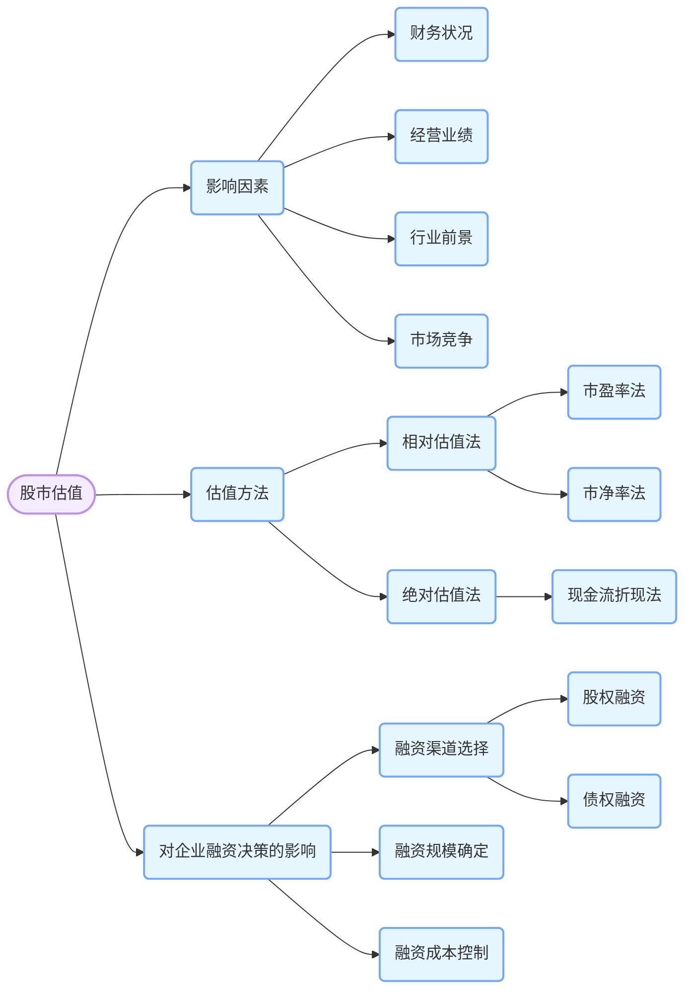

# 股市估值对企业融资决策的影响

> 关键词：股市估值、企业融资决策、股权融资、债权融资、市场信号

> 摘要：本文深入探讨了股市估值对企业融资决策的影响。首先介绍了研究的背景、目的、预期读者和文档结构，明确了相关术语。接着阐述了股市估值和企业融资决策的核心概念及其联系，并给出了相应的文本示意图和 Mermaid 流程图。详细讲解了核心算法原理，用 Python 代码进行了说明，同时给出了相关的数学模型和公式并举例。通过项目实战，展示了开发环境搭建、源代码实现及解读。分析了股市估值在不同场景下对企业融资决策的实际应用。推荐了学习资源、开发工具框架和相关论文著作。最后总结了未来发展趋势与挑战，提供了常见问题解答和扩展阅读参考资料。旨在帮助企业管理者更好地理解股市估值与融资决策之间的关系，做出更合理的融资决策。

## 1. 背景介绍 
### 1.1 目的和范围
本研究的目的在于全面剖析股市估值对企业融资决策的影响机制。在当今复杂多变的金融市场环境下，企业的融资决策直接关系到其生存与发展。股市估值作为市场对企业价值的综合评估指标，对企业的融资渠道选择、融资规模确定以及融资成本控制等方面都有着至关重要的影响。本研究将涵盖不同行业、不同规模企业在不同市场环境下，股市估值与融资决策之间的相互关系，为企业管理者提供科学的决策依据。

### 1.2 预期读者
本文的预期读者主要包括企业管理者、金融分析师、投资者以及对金融市场和企业融资决策感兴趣的研究人员。企业管理者可以通过本文了解股市估值对企业融资决策的影响，从而优化企业的融资策略；金融分析师可以借助本文的研究成果，更准确地评估企业的融资需求和融资能力；投资者可以从股市估值与企业融资决策的关系中，洞察企业的发展潜力和投资价值；研究人员则可以将本文作为进一步深入研究的参考。

### 1.3 文档结构概述
本文将按照以下结构展开：首先介绍研究的背景信息，包括目的、预期读者和文档结构概述，并对相关术语进行解释。接着阐述股市估值和企业融资决策的核心概念及其联系，通过文本示意图和 Mermaid 流程图进行直观展示。然后详细讲解核心算法原理，用 Python 代码进行具体实现，并给出相关的数学模型和公式进行详细说明和举例。通过项目实战，展示开发环境搭建、源代码实现及解读。分析股市估值在不同场景下对企业融资决策的实际应用。推荐学习资源、开发工具框架和相关论文著作。最后总结未来发展趋势与挑战，提供常见问题解答和扩展阅读参考资料。

### 1.4 术语表
#### 1.4.1 核心术语定义
- **股市估值**：指市场对上市公司价值的评估，通常通过各种估值方法，如市盈率、市净率等，来确定企业的股票价格是否合理。
- **企业融资决策**：企业为了满足自身的资金需求，对融资渠道、融资规模、融资成本等方面进行的选择和规划。
- **股权融资**：企业通过发行股票的方式向投资者筹集资金，投资者成为企业的股东，享有相应的权益。
- **债权融资**：企业通过向债权人借款的方式筹集资金，需要按照约定的期限和利率偿还本金和利息。

#### 1.4.2 相关概念解释
- **市盈率（P/E）**：是指股票价格除以每股收益的比率，反映了市场对企业未来盈利的预期。市盈率越高，说明市场对企业的未来发展越看好。
- **市净率（P/B）**：是指股票价格除以每股净资产的比率，反映了市场对企业资产价值的评估。市净率越高，说明市场对企业的资产质量和盈利能力越认可。

#### 1.4.3 缩略词列表
- **P/E**：Price-to-Earnings Ratio，市盈率
- **P/B**：Price-to-Book Ratio，市净率

## 2. 核心概念与联系 
### 核心概念原理
#### 股市估值
股市估值是市场参与者对上市公司价值的综合判断。它基于企业的财务状况、经营业绩、行业前景、市场竞争等多种因素，通过一定的估值方法来确定企业的股票价格是否合理。常见的估值方法包括相对估值法和绝对估值法。相对估值法是通过与同行业其他企业的比较来评估企业的价值，如市盈率法、市净率法等；绝对估值法是通过对企业未来现金流的折现来评估企业的价值，如现金流折现法等。

#### 企业融资决策
企业融资决策是企业为了实现自身的战略目标，对融资渠道、融资规模、融资成本等方面进行的选择和规划。企业的融资渠道主要包括股权融资和债权融资。股权融资可以为企业提供长期稳定的资金来源，但会稀释股东的股权；债权融资可以在不稀释股权的情况下筹集资金，但需要承担一定的债务利息和还款压力。企业在进行融资决策时，需要综合考虑自身的财务状况、经营战略、市场环境等因素，以选择最合适的融资方式和融资规模。

### 架构的文本示意图
```plaintext
股市估值
|
|-- 影响因素
|   |-- 财务状况
|   |-- 经营业绩
|   |-- 行业前景
|   |-- 市场竞争
|
|-- 估值方法
|   |-- 相对估值法
|   |   |-- 市盈率法
|   |   |-- 市净率法
|   |-- 绝对估值法
|       |-- 现金流折现法
|
|-- 对企业融资决策的影响
|   |-- 融资渠道选择
|   |   |-- 股权融资
|   |   |-- 债权融资
|   |-- 融资规模确定
|   |-- 融资成本控制
```

### Mermaid 流程图


## 3. 核心算法原理 & 具体操作步骤 
### 市盈率法估值原理
市盈率法是一种常用的相对估值方法，其基本原理是通过比较同行业其他企业的市盈率，来确定目标企业的合理市盈率，进而计算出目标企业的股票价值。具体公式为：

$$V = EPS \times P/E$$

其中，$V$ 表示企业的股票价值，$EPS$ 表示每股收益，$P/E$ 表示市盈率。

### Python 代码实现
```python
def pe_valuation(eps, pe_ratio):
    """
    使用市盈率法计算企业的股票价值
    :param eps: 每股收益
    :param pe_ratio: 市盈率
    :return: 股票价值
    """
    return eps * pe_ratio

# 示例数据
eps = 2.5
pe_ratio = 15

# 计算股票价值
stock_value = pe_valuation(eps, pe_ratio)
print(f"企业的股票价值为: {stock_value}")
```

### 具体操作步骤
1. **确定每股收益（EPS）**：每股收益是指企业净利润除以发行在外的普通股股数。可以从企业的财务报表中获取相关数据。
2. **确定市盈率（P/E）**：可以通过分析同行业其他企业的市盈率，结合目标企业的自身特点和市场情况，确定目标企业的合理市盈率。
3. **计算股票价值**：将每股收益和市盈率代入公式 $V = EPS \times P/E$，计算出企业的股票价值。

## 4. 数学模型和公式 & 详细讲解 & 举例说明 
### 市盈率法数学模型
市盈率法的数学模型为：

$$V = EPS \times P/E$$

其中，$V$ 表示企业的股票价值，$EPS$ 表示每股收益，$P/E$ 表示市盈率。

### 详细讲解
- **每股收益（EPS）**：每股收益是衡量企业盈利能力的重要指标，反映了企业每股普通股所获得的净利润。每股收益越高，说明企业的盈利能力越强。
- **市盈率（P/E）**：市盈率是市场对企业未来盈利的预期。市盈率越高，说明市场对企业的未来发展越看好；市盈率越低，说明市场对企业的未来发展越不看好。
- **股票价值（V）**：股票价值是根据每股收益和市盈率计算得出的，反映了市场对企业价值的评估。

### 举例说明
假设某企业的每股收益为 3 元，同行业类似企业的平均市盈率为 20 倍。则该企业的股票价值为：

$$V = 3 \times 20 = 60 \text{（元）}$$

这意味着市场认为该企业的每股价值为 60 元。如果该企业的实际股票价格低于 60 元，则可能被市场低估；如果实际股票价格高于 60 元，则可能被市场高估。

### 市净率法数学模型
市净率法的数学模型为：

$$V = BVPS \times P/B$$

其中，$V$ 表示企业的股票价值，$BVPS$ 表示每股净资产，$P/B$ 表示市净率。

### 详细讲解
- **每股净资产（BVPS）**：每股净资产是指企业的净资产除以发行在外的普通股股数，反映了企业每股普通股所拥有的净资产价值。每股净资产越高，说明企业的资产质量越好。
- **市净率（P/B）**：市净率是市场对企业资产价值的评估。市净率越高，说明市场对企业的资产质量和盈利能力越认可；市净率越低，说明市场对企业的资产质量和盈利能力越不看好。
- **股票价值（V）**：股票价值是根据每股净资产和市净率计算得出的，反映了市场对企业价值的评估。

### 举例说明
假设某企业的每股净资产为 5 元，同行业类似企业的平均市净率为 3 倍。则该企业的股票价值为：

$$V = 5 \times 3 = 15 \text{（元）}$$

这意味着市场认为该企业的每股价值为 15 元。如果该企业的实际股票价格低于 15 元，则可能被市场低估；如果实际股票价格高于 15 元，则可能被市场高估。

## 5. 项目实战：代码实际案例和详细解释说明 
### 5.1  开发环境搭建
#### 安装 Python
首先需要安装 Python 开发环境。可以从 Python 官方网站（https://www.python.org/downloads/）下载适合自己操作系统的 Python 安装包，并按照安装向导进行安装。

#### 安装必要的库
在本项目中，我们需要使用 `pandas` 库来处理数据，使用 `matplotlib` 库来进行数据可视化。可以使用以下命令来安装这些库：

```sh
pip install pandas matplotlib
```

### 5.2  源代码详细实现和代码解读
```python
import pandas as pd
import matplotlib.pyplot as plt

# 模拟企业财务数据
data = {
    'Year': [2018, 2019, 2020, 2021, 2022],
    'EPS': [1.2, 1.5, 1.8, 2.0, 2.2],
    'PE_Ratio': [12, 15, 18, 20, 22]
}

# 创建 DataFrame
df = pd.DataFrame(data)

# 计算每年的股票价值
df['Stock_Value'] = df['EPS'] * df['PE_Ratio']

# 打印结果
print(df)

# 绘制股票价值变化趋势图
plt.plot(df['Year'], df['Stock_Value'])
plt.xlabel('Year')
plt.ylabel('Stock Value')
plt.title('Stock Value Trend')
plt.show()
```

### 代码解读与分析
1. **数据模拟**：使用字典 `data` 模拟了企业 2018 - 2022 年的每股收益（EPS）和市盈率（PE_Ratio）数据。
2. **创建 DataFrame**：使用 `pandas` 库的 `DataFrame` 函数将模拟数据转换为 DataFrame 对象，方便进行数据处理和分析。
3. **计算股票价值**：使用市盈率法的公式 $V = EPS \times P/E$，计算每年的股票价值，并将结果存储在新的列 `Stock_Value` 中。
4. **打印结果**：使用 `print` 函数打印计算结果，展示每年的每股收益、市盈率和股票价值。
5. **数据可视化**：使用 `matplotlib` 库的 `plot` 函数绘制股票价值的变化趋势图，直观地展示股票价值随时间的变化情况。

## 6. 实际应用场景 
### 股权融资决策
当企业的股市估值较高时，意味着市场对企业的未来发展前景较为看好。此时，企业可以选择通过股权融资的方式筹集资金。因为在高估值的情况下，企业可以以较高的价格发行股票，从而筹集到更多的资金，同时稀释较少的股权。例如，一家科技企业在其技术创新取得重大突破后，股市估值大幅上升。该企业可以抓住这个时机，通过发行新股的方式进行股权融资，为企业的进一步发展提供资金支持。

### 债权融资决策
当企业的股市估值较低时，股权融资可能会导致股东权益的过度稀释。此时，企业可以考虑选择债权融资的方式。较低的股市估值可能意味着企业面临一定的经营风险，但如果企业的资产质量较好，仍然可以通过向银行等金融机构借款的方式筹集资金。例如，一家传统制造业企业由于行业竞争激烈，股市估值较低。该企业可以通过抵押固定资产等方式，向银行申请贷款，以满足企业的短期资金需求。

### 融资规模确定
股市估值还会影响企业的融资规模。当股市估值较高时，企业可以筹集到更多的资金，因此可以适当扩大融资规模，用于企业的扩张、研发等方面。相反，当股市估值较低时，企业需要谨慎确定融资规模，避免过度融资导致财务负担过重。例如，一家互联网企业在股市估值处于高位时，计划通过股权融资筹集资金用于开拓新的市场。企业可以根据股市估值情况，合理确定发行股票的数量和价格，以筹集到足够的资金。

### 融资成本控制
股市估值对企业的融资成本也有重要影响。在高估值的情况下，企业进行股权融资的成本相对较低，因为投资者愿意以较高的价格购买企业的股票。而在低估值的情况下，企业进行债权融资的成本可能相对较低，因为金融机构可能会根据企业的资产质量和经营状况，给予较低的贷款利率。例如，一家房地产企业在股市估值较高时，通过发行股票融资，投资者对企业的未来发展充满信心，愿意接受较低的股息率，从而降低了企业的股权融资成本。

## 7. 工具和资源推荐
### 7.1 学习资源推荐
#### 7.1.1 书籍推荐
- 《证券分析》（Security Analysis）：由本杰明·格雷厄姆（Benjamin Graham）和戴维·多德（David Dodd）所著，是价值投资领域的经典之作，详细介绍了股票估值的基本方法和原理。
- 《财务报表分析与证券定价》（Financial Statement Analysis and Security Valuation）：作者是斯蒂芬·佩因曼（Stephen Penman），该书结合财务报表分析和证券定价，为读者提供了深入了解企业估值的方法和技巧。
- 《公司理财》（Corporate Finance）：由理查德·布雷利（Richard Brealey）、斯图尔特·迈尔斯（Stewart Myers）和富兰克林·艾伦（Franklin Allen）所著，全面介绍了企业融资决策的相关理论和实践。

#### 7.1.2 在线课程
- Coursera 上的“Financial Markets”课程：由耶鲁大学的罗伯特·席勒（Robert Shiller）教授授课，深入讲解了金融市场的运行机制和资产定价理论。
- edX 上的“Corporate Finance Fundamentals”课程：提供了企业融资决策的基础知识和实用技巧。
- 中国大学 MOOC 上的“财务管理”课程：由国内知名高校的教授授课，结合中国实际情况，介绍了企业财务管理和融资决策的相关内容。

#### 7.1.3 技术博客和网站
- Seeking Alpha：提供了大量的股票分析和估值报告，以及专业投资者的观点和建议。
- Morningstar：是全球知名的投资研究机构，提供了丰富的金融数据和分析工具，帮助投资者进行股票估值和投资决策。
- 雪球网：是国内知名的投资社区，汇聚了众多投资者和金融专家，分享了大量的投资经验和股票分析文章。

### 7.2 开发工具框架推荐
#### 7.2.1 IDE和编辑器
- PyCharm：是一款专业的 Python 集成开发环境，提供了丰富的代码编辑、调试和项目管理功能，适合进行金融数据分析和编程。
- Jupyter Notebook：是一种交互式的开发环境，支持 Python、R 等多种编程语言，方便进行数据探索和可视化分析。
- Visual Studio Code：是一款轻量级的代码编辑器，支持多种编程语言和插件扩展，具有强大的代码编辑和调试功能。

#### 7.2.2 调试和性能分析工具
- PDB：是 Python 自带的调试工具，可以帮助开发者在代码中设置断点、单步执行代码，方便进行调试和错误排查。
- cProfile：是 Python 的性能分析工具，可以分析代码的运行时间和函数调用情况，帮助开发者优化代码性能。
- Memory Profiler：是一个 Python 内存分析工具，可以分析代码的内存使用情况，帮助开发者发现内存泄漏等问题。

#### 7.2.3 相关框架和库
- Pandas：是一个强大的数据分析库，提供了高效的数据结构和数据处理工具，适合进行金融数据的清洗、分析和可视化。
- NumPy：是 Python 的数值计算库，提供了高效的多维数组和数学函数，为金融数据分析提供了基础支持。
- Matplotlib：是一个常用的 Python 绘图库，提供了丰富的绘图功能，方便进行数据可视化和分析结果展示。

### 7.3 相关论文著作推荐
#### 7.3.1 经典论文
- Modigliani, F., & Miller, M. H. (1958). The Cost of Capital, Corporation Finance and the Theory of Investment. The American Economic Review, 48(3), 261 - 297. 该论文提出了著名的 MM 定理，奠定了现代企业融资理论的基础。
- Fama, E. F., & French, K. R. (1992). The Cross - Section of Expected Stock Returns. The Journal of Finance, 47(2), 427 - 465. 该论文提出了 Fama - French 三因子模型，对股票收益率的影响因素进行了深入研究。

#### 7.3.2 最新研究成果
- Baker, M., & Wurgler, J. (2002). Market Timing and Capital Structure. The Journal of Finance, 57(1), 1 - 32. 该论文研究了市场时机对企业资本结构的影响，为企业融资决策提供了新的视角。
- Stein, J. C. (1996). Rational Capital Budgeting in an Irrational World. The Journal of Business, 69(4), 429 - 455. 该论文探讨了在非理性市场环境下企业的资本预算决策问题。

#### 7.3.3 应用案例分析
- Graham, J. R., & Harvey, C. R. (2001). The Theory and Practice of Corporate Finance: Evidence from the Field. The Journal of Financial Economics, 60(2 - 3), 187 - 243. 该论文通过对企业财务经理的问卷调查，分析了企业融资决策的实际应用情况。
- Leary, M. T., & Roberts, M. R. (2005). Do Firms Rebalance Their Capital Structures?. The Journal of Finance, 60(6), 2575 - 2619. 该论文通过实证研究，分析了企业是否会调整其资本结构以适应市场变化。

## 8. 总结：未来发展趋势与挑战
### 未来发展趋势
- **数字化和智能化**：随着信息技术的快速发展，股市估值和企业融资决策将越来越依赖于数字化和智能化工具。例如，利用大数据和人工智能技术，可以更准确地分析企业的财务数据和市场信息，提高股市估值的准确性和企业融资决策的科学性。
- **绿色金融和可持续发展**：在全球关注气候变化和可持续发展的背景下，绿色金融和可持续发展将成为企业融资决策的重要考虑因素。股市估值也将更加关注企业的环境、社会和治理（ESG）表现，具有良好 ESG 表现的企业将更容易获得融资支持。
- **跨境融资和国际化**：随着经济全球化的深入发展，企业的跨境融资和国际化趋势将更加明显。股市估值将受到国际市场因素的影响，企业在进行融资决策时需要考虑国际市场的需求和竞争。

### 挑战
- **市场不确定性**：金融市场的不确定性是企业融资决策面临的最大挑战之一。股市估值受到多种因素的影响，如宏观经济环境、政策变化、行业竞争等，这些因素的不确定性增加了股市估值的难度和企业融资决策的风险。
- **信息不对称**：在股市估值和企业融资决策过程中，信息不对称问题较为突出。企业管理层通常比投资者拥有更多的内部信息，这可能导致投资者对企业的估值不准确，从而影响企业的融资决策。
- **监管政策变化**：监管政策的变化对企业融资决策也有着重要影响。不同国家和地区的监管政策存在差异，且监管政策可能会随着时间的推移而发生变化，企业需要及时了解和适应监管政策的变化，以确保融资决策的合规性。

## 9. 附录：常见问题与解答
### 问题 1：股市估值高就一定适合进行股权融资吗？
解答：不一定。虽然股市估值高时进行股权融资可以筹集到更多的资金且稀释较少的股权，但还需要考虑其他因素。例如，企业的发展战略是否需要大量的资金支持，如果企业目前没有合适的投资项目，过度融资可能会导致资金闲置，降低资金使用效率。此外，还需要考虑市场环境的稳定性，如果市场存在较大的不确定性，高估值可能难以持续，此时进行股权融资可能会面临一定的风险。

### 问题 2：如何准确确定企业的市盈率和市净率？
解答：确定企业的市盈率和市净率需要综合考虑多个因素。对于市盈率，可以参考同行业其他企业的平均市盈率，并结合企业的自身特点和发展前景进行调整。例如，企业的盈利能力、增长速度、市场竞争力等因素都会影响其合理的市盈率水平。对于市净率，需要分析企业的资产质量、资产结构和行业特点。一般来说，资产质量较好、盈利能力较强的企业，其市净率可能会相对较高。同时，还可以结合历史数据和市场趋势进行分析，以更准确地确定企业的市盈率和市净率。

### 问题 3：股市估值对企业债权融资有哪些具体影响？
解答：股市估值对企业债权融资的影响主要体现在以下几个方面。首先，股市估值较高的企业通常被认为经营状况较好、信用风险较低，金融机构更愿意为其提供贷款，且贷款利率可能相对较低。相反，股市估值较低的企业可能面临较高的信用风险，金融机构可能会提高贷款利率或要求提供更多的担保。其次，股市估值的变化会影响企业的资产价值和财务状况，从而影响企业的偿债能力。当股市估值下降时，企业的资产价值可能会缩水，偿债能力也会受到影响，这可能会增加企业债权融资的难度。

## 10. 扩展阅读 & 参考资料
### 扩展阅读
- 《聪明的投资者》（The Intelligent Investor）：本杰明·格雷厄姆的另一本经典著作，为投资者提供了实用的投资策略和方法。
- 《金融炼金术》（The Alchemy of Finance）：乔治·索罗斯（George Soros）所著，介绍了他的反身性理论和投资实践。
- 《漫步华尔街》（A Random Walk Down Wall Street）：作者是伯顿·马尔基尔（Burton Malkiel），该书探讨了股票市场的有效性和投资策略。

### 参考资料
- 上市公司的财务报表和公告，可从证券交易所网站或企业官方网站获取。
- 金融数据提供商，如 Wind、Bloomberg 等，提供了丰富的金融数据和分析工具。
- 学术期刊，如《Journal of Finance》、《Journal of Financial Economics》等，发表了大量关于股市估值和企业融资决策的研究论文。