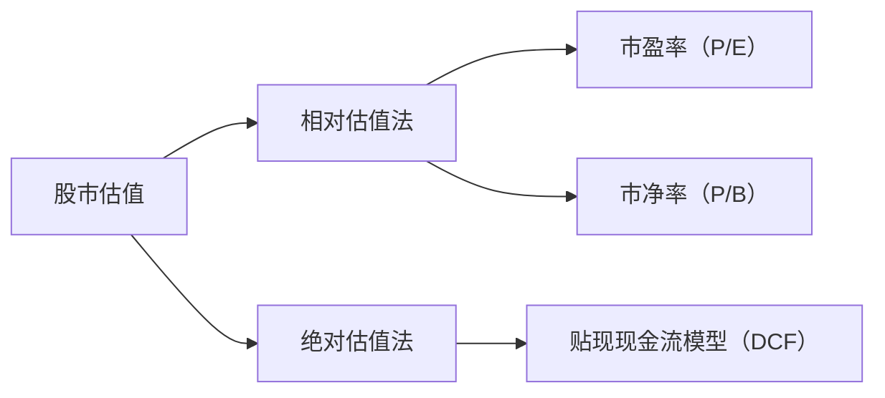
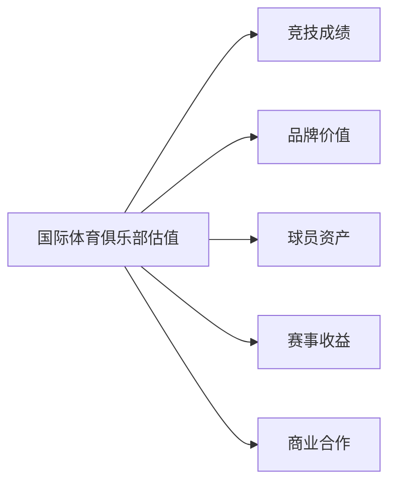

# 股市估值对国际体育俱乐部估值的影响

> 关键词：股市估值、国际体育俱乐部、俱乐部估值、金融市场、体育经济

> 摘要：本文旨在深入探讨股市估值对国际体育俱乐部估值的影响。通过对相关核心概念的阐述、算法原理的分析、数学模型的构建以及项目实战案例的研究，揭示两者之间的内在联系和作用机制。同时，分析了实际应用场景，推荐了相关的工具和资源，最后对未来发展趋势与挑战进行了总结，并提供了常见问题解答和参考资料，以期为体育经济领域的研究和实践提供有价值的参考。

## 1. 背景介绍 
### 1.1 目的和范围
本研究的主要目的是全面、深入地探究股市估值对国际体育俱乐部估值的影响。随着体育产业的蓬勃发展，越来越多的国际体育俱乐部选择上市，其估值不仅受到自身竞技成绩、商业运营等因素的影响，还与金融市场的股市估值密切相关。本研究将涵盖不同类型的国际体育俱乐部，包括足球、篮球、橄榄球等项目的俱乐部，分析股市估值在不同市场环境和俱乐部发展阶段的作用机制和影响程度。

### 1.2 预期读者
本文预期读者包括体育经济领域的研究人员、体育俱乐部的管理者和投资者、金融市场的分析师以及对体育产业和金融市场感兴趣的人士。研究成果将为他们提供理论支持和实践指导，帮助他们更好地理解体育俱乐部估值的影响因素，做出更明智的决策。

### 1.3 文档结构概述
本文将首先介绍相关的核心概念和它们之间的联系，包括股市估值和国际体育俱乐部估值的定义、原理和架构。接着，阐述核心算法原理和具体操作步骤，通过Python源代码进行详细说明。然后，构建数学模型和公式，结合具体例子进行讲解。在项目实战部分，将提供代码实际案例并进行详细解释。之后，分析实际应用场景，推荐相关的工具和资源。最后，总结未来发展趋势与挑战，提供常见问题解答和参考资料。

### 1.4 术语表
#### 1.4.1 核心术语定义
- **股市估值**：指对股票市场中上市公司的价值进行评估的过程和结果。通常通过各种估值方法，如市盈率（P/E）、市净率（P/B）等，来确定股票的合理价格范围。
- **国际体育俱乐部估值**：对国际体育俱乐部的整体价值进行评估，包括俱乐部的品牌价值、球员资产、赛事收益、商业合作等多个方面。

#### 1.4.2 相关概念解释
- **市盈率（P/E）**：是指股票价格除以每股收益（EPS）的比率，反映了市场对公司盈利能力的预期。较高的市盈率通常表示市场对公司未来增长的预期较高。
- **市净率（P/B）**：是指股票价格与每股净资产的比率，反映了市场对公司净资产的估值。较低的市净率可能表示股票被低估。

#### 1.4.3 缩略词列表
- **P/E**：市盈率（Price-to-Earnings Ratio）
- **P/B**：市净率（Price-to-Book Ratio）

## 2. 核心概念与联系 

### 股市估值的原理和架构
股市估值是金融市场中一项重要的活动，其目的是确定上市公司股票的合理价值。常见的估值方法包括相对估值法和绝对估值法。相对估值法通过与同行业或类似公司的估值指标进行比较，来评估目标公司的价值，如市盈率、市净率等。绝对估值法是通过对公司未来现金流的折现来计算公司的内在价值，如贴现现金流模型（DCF）。

其架构可以用以下示意图表示：


### 国际体育俱乐部估值的原理和架构
国际体育俱乐部估值是一个复杂的过程，需要考虑多个因素。主要包括俱乐部的竞技成绩、品牌价值、球员资产、赛事收益、商业合作等。竞技成绩是俱乐部的核心竞争力，直接影响俱乐部的门票收入、转播权收入等。品牌价值是俱乐部长期积累的无形资产，对商业合作和球迷忠诚度有重要影响。球员资产是俱乐部的重要资产，其价值取决于球员的实力、年龄、合同期限等。

其架构可以用以下示意图表示：


### 股市估值与国际体育俱乐部估值的联系
股市估值与国际体育俱乐部估值之间存在着密切的联系。当体育俱乐部上市后，其股票价格受到股市估值的影响。股市估值的变化会反映市场对俱乐部未来发展的预期，从而影响俱乐部的市场价值。例如，如果股市整体处于牛市，市场对体育俱乐部的预期也会较为乐观，俱乐部的股票价格可能会上涨，进而提高俱乐部的估值。反之，如果股市处于熊市，俱乐部的股票价格可能会下跌，估值也会相应降低。

同时，国际体育俱乐部的自身估值因素也会影响股市估值。俱乐部的竞技成绩、商业运营等情况会直接影响其财务状况和盈利能力，从而影响股市对其的估值。例如，如果俱乐部取得了优异的竞技成绩，获得了更多的赛事收益和商业合作机会，其盈利能力增强，股市对其的估值也会提高。

## 3. 核心算法原理 & 具体操作步骤 

### 市盈率估值算法原理
市盈率估值法是一种常用的相对估值方法，其基本原理是通过比较目标公司与同行业或类似公司的市盈率，来确定目标公司的合理价值。计算公式为：

$$V = EPS \times P/E$$

其中，$V$ 表示公司的价值，$EPS$ 表示每股收益，$P/E$ 表示市盈率。

### Python代码实现
```python
def pe_valuation(eps, pe_ratio):
    """
    市盈率估值函数
    :param eps: 每股收益
    :param pe_ratio: 市盈率
    :return: 公司价值
    """
    return eps * pe_ratio

# 示例数据
eps = 2.5  # 每股收益
pe_ratio = 20  # 市盈率

# 计算公司价值
value = pe_valuation(eps, pe_ratio)
print(f"公司价值: {value}")
```

### 操作步骤
1. 确定目标公司的每股收益（EPS）。可以通过公司的财务报表获取。
2. 选择合适的市盈率（P/E）。可以参考同行业或类似公司的平均市盈率。
3. 将每股收益和市盈率代入公式计算公司价值。

### 贴现现金流模型（DCF）算法原理
贴现现金流模型是一种绝对估值方法，其基本原理是将公司未来的现金流折现到当前时刻，以计算公司的内在价值。计算公式为：

$$V = \sum_{t=1}^{n} \frac{CF_t}{(1 + r)^t}$$

其中，$V$ 表示公司的价值，$CF_t$ 表示第 $t$ 期的现金流，$r$ 表示折现率，$n$ 表示预测期数。

### Python代码实现
```python
import numpy as np

def dcf_valuation(cash_flows, discount_rate):
    """
    贴现现金流估值函数
    :param cash_flows: 未来现金流列表
    :param discount_rate: 折现率
    :return: 公司价值
    """
    n = len(cash_flows)
    present_values = []
    for t in range(n):
        present_value = cash_flows[t] / (1 + discount_rate) ** (t + 1)
        present_values.append(present_value)
    return np.sum(present_values)

# 示例数据
cash_flows = [100, 120, 150, 180, 200]  # 未来现金流
discount_rate = 0.1  # 折现率

# 计算公司价值
value = dcf_valuation(cash_flows, discount_rate)
print(f"公司价值: {value}")
```

### 操作步骤
1. 预测公司未来的现金流（$CF_t$）。可以根据公司的历史数据和未来发展规划进行预测。
2. 确定折现率（$r$）。折现率反映了资金的时间价值和投资风险，可以参考市场利率和公司的风险水平来确定。
3. 将未来现金流和折现率代入公式计算公司价值。

## 4. 数学模型和公式 & 详细讲解 & 举例说明 

### 市盈率模型
如前面所述，市盈率模型的公式为：

$$V = EPS \times P/E$$

详细讲解：该公式的核心思想是通过每股收益和市盈率来计算公司的价值。每股收益反映了公司的盈利能力，市盈率反映了市场对公司盈利能力的预期。当市场对公司的预期较高时，市盈率会较高，公司的价值也会相应提高。

举例说明：假设一家国际体育俱乐部的每股收益为 $3$ 美元，同行业类似俱乐部的平均市盈率为 $25$。则该俱乐部的价值为：

$$V = 3 \times 25 = 75$$（美元）

### 贴现现金流模型（DCF）
贴现现金流模型的公式为：

$$V = \sum_{t=1}^{n} \frac{CF_t}{(1 + r)^t}$$

详细讲解：该公式的核心思想是将公司未来的现金流折现到当前时刻。由于资金具有时间价值，未来的现金流需要通过折现率进行折现，以反映其当前的价值。折现率越高，未来现金流的现值越低。

举例说明：假设一家国际体育俱乐部未来 $5$ 年的现金流分别为 $100$ 万美元、$120$ 万美元、$150$ 万美元、$180$ 万美元和 $200$ 万美元，折现率为 $10\%$。则该俱乐部的价值为：

$$V = \frac{100}{(1 + 0.1)^1} + \frac{120}{(1 + 0.1)^2} + \frac{150}{(1 + 0.1)^3} + \frac{180}{(1 + 0.1)^4} + \frac{200}{(1 + 0.1)^5}$$

```python
import numpy as np

cash_flows = [100, 120, 150, 180, 200]
discount_rate = 0.1
n = len(cash_flows)
present_values = []
for t in range(n):
    present_value = cash_flows[t] / (1 + discount_rate) ** (t + 1)
    present_values.append(present_value)
value = np.sum(present_values)
print(f"俱乐部价值: {value} 万美元")
```

计算结果为约 $582.34$ 万美元。

## 5. 项目实战：代码实际案例和详细解释说明 

### 5.1  开发环境搭建
- **操作系统**：可以选择 Windows、Linux 或 macOS。
- **Python 版本**：建议使用 Python 3.7 及以上版本。
- **开发工具**：可以选择 PyCharm、Jupyter Notebook 等。

### 5.2  源代码详细实现和代码解读
以下是一个综合应用市盈率和贴现现金流模型对国际体育俱乐部进行估值的 Python 代码示例：

```python
import numpy as np

def pe_valuation(eps, pe_ratio):
    """
    市盈率估值函数
    :param eps: 每股收益
    :param pe_ratio: 市盈率
    :return: 公司价值
    """
    return eps * pe_ratio

def dcf_valuation(cash_flows, discount_rate):
    """
    贴现现金流估值函数
    :param cash_flows: 未来现金流列表
    :param discount_rate: 折现率
    :return: 公司价值
    """
    n = len(cash_flows)
    present_values = []
    for t in range(n):
        present_value = cash_flows[t] / (1 + discount_rate) ** (t + 1)
        present_values.append(present_value)
    return np.sum(present_values)

# 示例数据
eps = 2.8  # 每股收益
pe_ratio = 22  # 市盈率
cash_flows = [110, 130, 160, 190, 210]  # 未来现金流
discount_rate = 0.09  # 折现率

# 计算市盈率估值
pe_value = pe_valuation(eps, pe_ratio)
print(f"市盈率估值: {pe_value}")

# 计算贴现现金流估值
dcf_value = dcf_valuation(cash_flows, discount_rate)
print(f"贴现现金流估值: {dcf_value}")

# 综合估值（简单平均）
total_value = (pe_value + dcf_value) / 2
print(f"综合估值: {total_value}")
```

### 代码解读与分析
1. **pe_valuation 函数**：该函数实现了市盈率估值的计算，接受每股收益和市盈率作为输入，返回公司的价值。
2. **dcf_valuation 函数**：该函数实现了贴现现金流估值的计算，接受未来现金流列表和折现率作为输入，返回公司的价值。
3. **示例数据**：定义了每股收益、市盈率、未来现金流和折现率等示例数据。
4. **计算估值**：分别调用 pe_valuation 和 dcf_valuation 函数计算市盈率估值和贴现现金流估值。
5. **综合估值**：将市盈率估值和贴现现金流估值进行简单平均，得到综合估值。

## 6. 实际应用场景 
### 投资者决策
对于投资者来说，了解股市估值对国际体育俱乐部估值的影响可以帮助他们做出更明智的投资决策。当股市估值上升时，投资者可以考虑增加对体育俱乐部股票的投资；当股市估值下降时，投资者可以考虑减少投资或持观望态度。同时，投资者还可以通过分析俱乐部的自身估值因素，如竞技成绩、商业运营等，来评估俱乐部的投资价值。

### 俱乐部融资
国际体育俱乐部在进行融资时，股市估值会影响其融资成本和融资规模。如果股市估值较高，俱乐部的股票价格也会相应较高，俱乐部可以通过发行股票获得更多的资金。反之，如果股市估值较低，俱乐部的融资成本会增加，融资规模也会受到限制。

### 并购重组
在体育俱乐部的并购重组过程中，股市估值和俱乐部估值是重要的参考依据。收购方会根据股市估值和俱乐部的自身估值来确定收购价格和交易方案。同时，被收购方也会根据自身的估值来争取更好的交易条件。

### 行业监管
行业监管部门可以通过监测股市估值和俱乐部估值的变化，来了解体育产业的发展状况和市场风险。当股市估值和俱乐部估值出现异常波动时，监管部门可以及时采取措施，维护市场的稳定和健康发展。

## 7. 工具和资源推荐
### 7.1 学习资源推荐
#### 7.1.1 书籍推荐
- 《金融市场与金融机构基础》：介绍了金融市场的基本原理和金融机构的运作方式，对于理解股市估值有很大帮助。
- 《体育经济学》：全面阐述了体育产业的经济原理和发展规律，有助于深入了解国际体育俱乐部估值的相关知识。
- 《估值：难点、解决方案及相关案例》：详细讲解了各种估值方法和技术，包括市盈率、贴现现金流模型等。

#### 7.1.2 在线课程
- Coursera 上的“Financial Markets”课程：由耶鲁大学教授授课，深入讲解了金融市场的理论和实践。
- edX 上的“Sports Economics”课程：介绍了体育经济学的基本概念和分析方法。

#### 7.1.3 技术博客和网站
- Seeking Alpha：提供了大量的金融市场分析和股票估值文章。
- ESPN 的商业板块：关注体育产业的商业动态和俱乐部估值情况。

### 7.2 开发工具框架推荐
#### 7.2.1 IDE和编辑器
- PyCharm：一款专业的 Python 集成开发环境，具有丰富的功能和插件。
- Jupyter Notebook：一种交互式的开发环境，适合进行数据分析和代码演示。

#### 7.2.2 调试和性能分析工具
- Py-Spy：用于分析 Python 代码的性能瓶颈。
- PDB：Python 自带的调试工具，方便调试代码。

#### 7.2.3 相关框架和库
- Pandas：用于数据处理和分析，在处理金融数据和体育俱乐部财务数据时非常有用。
- Numpy：提供了高效的数值计算功能，用于实现估值算法。

### 7.3 相关论文著作推荐
#### 7.3.1 经典论文
- “The Economics of Professional Team Sports: A Survey of Theory and Evidence”：对职业体育团队的经济学理论和实证研究进行了全面综述。
- “Valuation of Sports Teams: A Review of the Literature”：总结了体育团队估值的相关文献和方法。

#### 7.3.2 最新研究成果
- 关注《Journal of Sports Economics》、《European Sport Management Quarterly》等学术期刊上的最新研究论文。

#### 7.3.3 应用案例分析
- 可以参考一些知名体育俱乐部的财务报告和估值案例，如曼联、皇马等俱乐部的相关资料。

## 8. 总结：未来发展趋势与挑战
### 未来发展趋势
- **数字化转型加速**：随着科技的不断发展，国际体育俱乐部将加速数字化转型，通过大数据、人工智能等技术提升运营效率和球迷体验。这将对俱乐部的估值产生积极影响，因为数字化资产和数据将成为俱乐部的重要价值来源。
- **国际市场融合加深**：体育产业的国际化趋势将不断加强，国际体育俱乐部之间的交流与合作将更加频繁。这将促进俱乐部的品牌传播和商业拓展，提高俱乐部的国际影响力和估值水平。
- **金融创新推动**：金融市场的创新将为国际体育俱乐部的融资和估值带来新的机遇。例如，区块链技术的应用可以提高俱乐部的财务透明度和球迷参与度，新型金融工具的出现可以为俱乐部提供更多的融资渠道。

### 挑战
- **市场波动风险**：股市估值的波动会对国际体育俱乐部的估值产生直接影响。全球经济形势的不确定性、金融市场的动荡等因素都可能导致股市估值的大幅波动，从而增加俱乐部估值的不确定性。
- **竞争加剧**：随着体育产业的发展，国际体育俱乐部之间的竞争将日益激烈。俱乐部需要不断提升自身的竞技实力和商业运营能力，以在市场竞争中脱颖而出。否则，俱乐部的估值可能会受到影响。
- **法律法规变化**：不同国家和地区的法律法规对体育产业的监管政策可能会发生变化，这将对国际体育俱乐部的运营和估值产生影响。俱乐部需要密切关注法律法规的变化，及时调整经营策略。

## 9. 附录：常见问题与解答
### 问题 1：股市估值对国际体育俱乐部估值的影响程度有多大？
解答：股市估值对国际体育俱乐部估值的影响程度因多种因素而异，包括市场环境、俱乐部的自身实力和发展阶段等。在市场繁荣时期，股市估值的上升可能会显著提高俱乐部的估值；而在市场低迷时期，股市估值的下降可能会导致俱乐部估值大幅缩水。一般来说，上市的体育俱乐部受到股市估值的影响更为明显。

### 问题 2：如何准确评估国际体育俱乐部的价值？
解答：准确评估国际体育俱乐部的价值需要综合考虑多个因素，包括竞技成绩、品牌价值、球员资产、赛事收益、商业合作等。可以采用多种估值方法，如市盈率、贴现现金流模型等，并结合市场情况和行业趋势进行分析。同时，还需要对俱乐部的财务报表进行深入研究，了解其盈利能力和财务状况。

### 问题 3：体育俱乐部的品牌价值如何量化？
解答：体育俱乐部的品牌价值可以通过多种方法进行量化。一种常见的方法是基于品牌的市场影响力和商业价值进行评估，例如通过品牌授权收入、赞助费用等指标来衡量。另一种方法是采用品牌资产评估模型，如 Interbrand 品牌评估模型，该模型综合考虑了品牌的财务表现、品牌强度等因素。

## 10. 扩展阅读 & 参考资料
### 扩展阅读
- 《体育营销学》：深入介绍了体育营销的理论和实践，对于理解体育俱乐部的商业运营和品牌建设有很大帮助。
- 《金融风险管理》：帮助读者了解金融市场的风险和管理方法，对于应对股市估值波动对俱乐部估值的影响有一定的指导意义。

### 参考资料
- 各国际体育俱乐部的官方网站和财务报告。
- 金融市场数据提供商，如 Bloomberg、Reuters 等的数据。
- 相关学术期刊和研究报告。