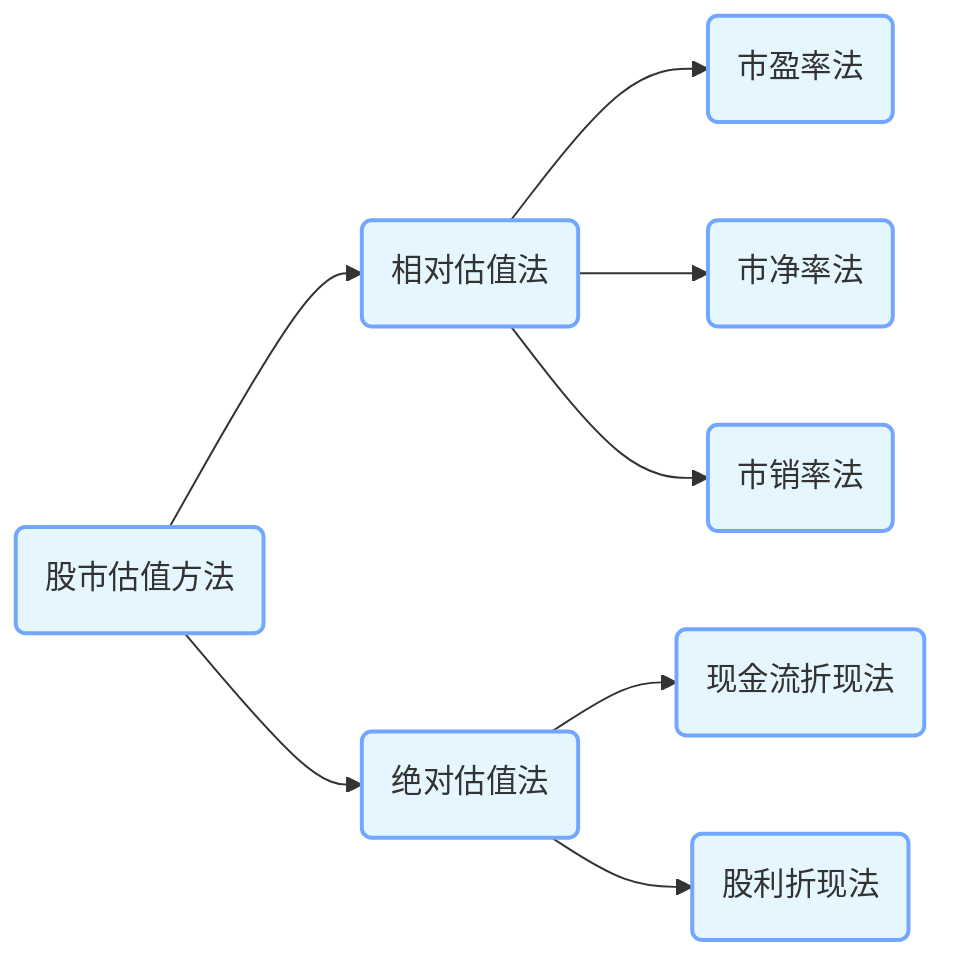
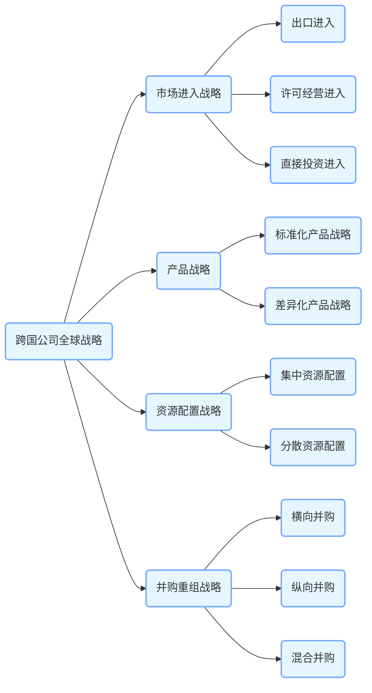

# 股市估值对跨国公司全球战略的影响

> 关键词：股市估值、跨国公司、全球战略、财务决策、市场竞争

> 摘要：本文深入探讨了股市估值对跨国公司全球战略的多方面影响。从背景介绍出发，阐述了研究目的、预期读者和文档结构。详细剖析了股市估值与跨国公司战略决策的核心概念及联系，介绍了相关算法原理和数学模型。通过项目实战案例展示了股市估值如何在实际中影响跨国公司的决策。同时，分析了股市估值在不同实际应用场景中的作用，推荐了相关学习资源、开发工具和论文著作。最后总结了未来发展趋势与挑战，并解答了常见问题，为跨国公司在全球市场的战略规划提供了全面而深入的参考。

## 1. 背景介绍 
### 1.1 目的和范围
本研究旨在全面深入地探究股市估值对跨国公司全球战略的具体影响。随着经济全球化的不断推进，跨国公司在全球市场中面临着日益复杂的竞争环境。股市估值作为反映公司市场价值的重要指标，不仅影响着公司的融资能力和投资者信心，还在很大程度上左右着跨国公司的战略决策。我们的研究范围涵盖了跨国公司在全球范围内的市场拓展、资源配置、并购重组等多个战略层面，分析股市估值如何在这些方面发挥作用，以及跨国公司应如何根据股市估值调整其全球战略。

### 1.2 预期读者
本文的预期读者主要包括跨国公司的高层管理人员、战略规划师、财务分析师，以及对国际金融和企业战略领域感兴趣的学者和研究人员。对于跨国公司的管理人员来说，了解股市估值对全球战略的影响有助于他们制定更加科学合理的战略决策；学者和研究人员可以从本文中获取相关的理论和实证研究成果，为进一步的学术研究提供参考。

### 1.3 文档结构概述
本文将按照以下结构展开：首先介绍核心概念与联系，明确股市估值和跨国公司全球战略的定义及二者之间的关联；接着阐述核心算法原理和具体操作步骤，通过Python代码详细说明如何进行股市估值的计算；然后介绍相关的数学模型和公式，并举例说明其应用；再通过项目实战案例，展示股市估值在跨国公司战略决策中的实际应用；之后分析股市估值在不同实际应用场景中的作用；推荐相关的学习资源、开发工具和论文著作；最后总结未来发展趋势与挑战，解答常见问题，并提供扩展阅读和参考资料。

### 1.4 术语表
#### 1.4.1 核心术语定义
- **股市估值**：是指对一家上市公司的股票价值进行评估的过程和结果。它反映了市场对该公司未来盈利能力、发展前景等因素的综合预期，常见的估值方法包括市盈率法、市净率法、现金流折现法等。
- **跨国公司**：是指在两个或两个以上国家从事国际化经营活动的企业。跨国公司通常在全球范围内进行资源配置、生产制造、销售和研发等活动，具有规模大、实力强、技术先进等特点。
- **全球战略**：是指跨国公司为了实现长期的发展目标，在全球范围内制定的一系列战略规划和决策。包括市场进入战略、产品战略、资源配置战略、并购重组战略等。

#### 1.4.2 相关概念解释
- **市盈率（P/E）**：是指股票价格与每股收益的比率，它反映了市场对公司盈利能力的预期。市盈率越高，说明市场对公司未来的盈利增长越看好。
- **市净率（P/B）**：是指股票价格与每股净资产的比率，它反映了市场对公司资产质量和价值的评估。市净率越高，说明市场对公司的资产价值越认可。
- **现金流折现法（DCF）**：是一种基于未来现金流预测的估值方法，通过将公司未来的现金流按照一定的折现率折现到当前，来计算公司的内在价值。

#### 1.4.3 缩略词列表
- **P/E**：市盈率（Price-to-Earnings Ratio）
- **P/B**：市净率（Price-to-Book Ratio）
- **DCF**：现金流折现法（Discounted Cash Flow）

## 2. 核心概念与联系 

### 股市估值的原理和架构
股市估值是一个复杂的过程，它基于多种因素对公司的股票价值进行评估。其核心原理是通过分析公司的财务状况、行业前景、市场竞争等因素，来预测公司未来的盈利能力和现金流，从而确定公司的内在价值。常见的股市估值方法可以用以下示意图表示：



相对估值法是通过与同行业的其他公司进行比较，来评估目标公司的价值。例如，市盈率法是将目标公司的市盈率与同行业平均市盈率进行比较，如果目标公司的市盈率低于同行业平均水平，则可能被认为是低估的。绝对估值法是通过对公司未来的现金流或股利进行折现，来计算公司的内在价值。例如，现金流折现法是将公司未来的自由现金流按照一定的折现率折现到当前，得到公司的内在价值。

### 跨国公司全球战略的架构
跨国公司的全球战略是一个多层次、多维度的体系，它包括以下几个主要方面：



市场进入战略是指跨国公司选择进入哪些市场以及采用何种方式进入。产品战略是指跨国公司如何开发和推广产品，以满足不同市场的需求。资源配置战略是指跨国公司如何在全球范围内配置资源，以实现资源的最优利用。并购重组战略是指跨国公司通过并购或重组其他企业，来实现规模扩张、资源整合和战略转型。

### 股市估值与跨国公司全球战略的联系
股市估值与跨国公司全球战略之间存在着密切的联系。一方面，股市估值反映了市场对跨国公司的预期和评价，会影响跨国公司的融资成本和投资者信心。如果股市估值较高，跨国公司可以以较低的成本进行融资，吸引更多的投资者，从而为其全球战略的实施提供资金支持。另一方面，跨国公司的全球战略决策也会影响股市估值。例如，跨国公司的市场进入战略和产品战略如果能够取得成功，将提高公司的盈利能力和市场竞争力，从而提升股市估值。

## 3. 核心算法原理 & 具体操作步骤 

### 市盈率法的Python实现
市盈率法是一种常用的相对估值方法，其计算公式为：

$$P = EPS \times P/E$$

其中，$P$ 表示股票价格，$EPS$ 表示每股收益，$P/E$ 表示市盈率。

以下是一个使用Python实现市盈率法估值的示例代码：

```python
def pe_valuation(eps, pe_ratio):
    """
    使用市盈率法计算股票价值
    :param eps: 每股收益
    :param pe_ratio: 市盈率
    :return: 股票价值
    """
    return eps * pe_ratio

# 示例数据
eps = 2.0  # 每股收益
pe_ratio = 15  # 市盈率

# 计算股票价值
stock_value = pe_valuation(eps, pe_ratio)
print(f"使用市盈率法计算的股票价值为: {stock_value}")
```

### 现金流折现法的Python实现
现金流折现法是一种常用的绝对估值方法，其计算公式为：

$$V = \sum_{t=1}^{n} \frac{FCF_t}{(1 + r)^t}$$

其中，$V$ 表示公司的内在价值，$FCF_t$ 表示第 $t$ 期的自由现金流，$r$ 表示折现率，$n$ 表示预测期数。

以下是一个使用Python实现现金流折现法估值的示例代码：

```python
def dcf_valuation(fcf_list, discount_rate):
    """
    使用现金流折现法计算公司内在价值
    :param fcf_list: 自由现金流列表
    :param discount_rate: 折现率
    :return: 公司内在价值
    """
    value = 0
    for i, fcf in enumerate(fcf_list):
        value += fcf / ((1 + discount_rate) ** (i + 1))
    return value

# 示例数据
fcf_list = [100, 120, 140, 160, 180]  # 自由现金流列表
discount_rate = 0.1  # 折现率

# 计算公司内在价值
company_value = dcf_valuation(fcf_list, discount_rate)
print(f"使用现金流折现法计算的公司内在价值为: {company_value}")
```

### 具体操作步骤
1. **数据收集**：收集跨国公司的财务数据，包括每股收益、自由现金流等，以及同行业的市盈率、折现率等数据。
2. **选择估值方法**：根据跨国公司的特点和数据的可用性，选择合适的估值方法，如市盈率法、现金流折现法等。
3. **参数确定**：确定估值方法中的参数，如每股收益、市盈率、自由现金流、折现率等。
4. **计算估值**：使用选定的估值方法和确定的参数，计算跨国公司的股票价值或内在价值。
5. **分析结果**：将计算得到的估值结果与市场价格进行比较，分析跨国公司的股票是否被低估或高估，并根据分析结果调整跨国公司的全球战略。

## 4. 数学模型和公式 & 详细讲解 & 举例说明 

### 市盈率法
#### 数学模型和公式
市盈率法的基本公式为：

$$P = EPS \times P/E$$

其中，$P$ 表示股票价格，$EPS$ 表示每股收益，$P/E$ 表示市盈率。

#### 详细讲解
市盈率是市场对公司盈利能力的预期，它反映了投资者愿意为每一元盈利支付的价格。市盈率越高，说明市场对公司未来的盈利增长越看好。在使用市盈率法进行估值时，需要先确定每股收益和市盈率。每股收益可以从公司的财务报表中获取，市盈率可以参考同行业的平均市盈率或根据公司的历史市盈率进行调整。

#### 举例说明
假设某跨国公司的每股收益为 $3$ 元，同行业的平均市盈率为 $20$ 倍。则根据市盈率法，该公司的股票价值为：

$$P = 3 \times 20 = 60$$（元）

如果该公司的股票市场价格为 $50$ 元，则说明该公司的股票被低估，可能具有投资价值。

### 现金流折现法
#### 数学模型和公式
现金流折现法的基本公式为：

$$V = \sum_{t=1}^{n} \frac{FCF_t}{(1 + r)^t}$$

其中，$V$ 表示公司的内在价值，$FCF_t$ 表示第 $t$ 期的自由现金流，$r$ 表示折现率，$n$ 表示预测期数。

#### 详细讲解
现金流折现法的核心思想是将公司未来的自由现金流按照一定的折现率折现到当前，得到公司的内在价值。自由现金流是指公司在满足了所有必要的投资和运营成本后，剩余的可以自由分配给股东和债权人的现金流量。折现率反映了投资者对投资风险的预期，折现率越高，说明投资者对投资风险的要求越高。

#### 举例说明
假设某跨国公司未来 $5$ 年的自由现金流分别为 $100$ 万元、$120$ 万元、$140$ 万元、$160$ 万元和 $180$ 万元，折现率为 $10\%$。则根据现金流折现法，该公司的内在价值为：

$$V = \frac{100}{(1 + 0.1)^1} + \frac{120}{(1 + 0.1)^2} + \frac{140}{(1 + 0.1)^3} + \frac{160}{(1 + 0.1)^4} + \frac{180}{(1 + 0.1)^5}$$

```python
import numpy as np

fcf_list = [100, 120, 140, 160, 180]
discount_rate = 0.1
n = len(fcf_list)
t = np.arange(1, n + 1)
value = np.sum(np.array(fcf_list) / ((1 + discount_rate) ** t))
print(f"该公司的内在价值为: {value} 万元")
```

### 市净率法
#### 数学模型和公式
市净率法的基本公式为：

$$P = BV \times P/B$$

其中，$P$ 表示股票价格，$BV$ 表示每股净资产，$P/B$ 表示市净率。

#### 详细讲解
市净率反映了市场对公司资产质量和价值的评估。市净率越高，说明市场对公司的资产价值越认可。在使用市净率法进行估值时，需要先确定每股净资产和市净率。每股净资产可以从公司的财务报表中获取，市净率可以参考同行业的平均市净率或根据公司的历史市净率进行调整。

#### 举例说明
假设某跨国公司的每股净资产为 $10$ 元，同行业的平均市净率为 $2$ 倍。则根据市净率法，该公司的股票价值为：

$$P = 10 \times 2 = 20$$（元）

如果该公司的股票市场价格为 $15$ 元，则说明该公司的股票被低估，可能具有投资价值。

## 5. 项目实战：代码实际案例和详细解释说明 

### 5.1  开发环境搭建
为了实现股市估值对跨国公司全球战略影响的分析，我们需要搭建以下开发环境：
- **操作系统**：Windows、Linux 或 macOS
- **编程语言**：Python 3.x
- **开发工具**：Jupyter Notebook 或 PyCharm
- **相关库**：pandas、numpy、matplotlib、scikit-learn 等

可以使用以下命令安装所需的库：

```sh
pip install pandas numpy matplotlib scikit-learn
```

### 5.2  源代码详细实现和代码解读
以下是一个完整的项目实战案例，展示了如何使用 Python 进行股市估值分析，并根据估值结果对跨国公司的全球战略进行调整。

```python
import pandas as pd
import numpy as np
import matplotlib.pyplot as plt

# 读取跨国公司的财务数据
data = pd.read_csv('financial_data.csv')

# 计算每股收益和每股净资产
data['EPS'] = data['Net Income'] / data['Shares Outstanding']
data['BV'] = data['Total Equity'] / data['Shares Outstanding']

# 计算市盈率和市净率
pe_ratio = data['Stock Price'] / data['EPS']
pb_ratio = data['Stock Price'] / data['BV']

# 绘制市盈率和市净率的折线图
plt.figure(figsize=(10, 6))
plt.plot(data['Year'], pe_ratio, label='P/E Ratio')
plt.plot(data['Year'], pb_ratio, label='P/B Ratio')
plt.xlabel('Year')
plt.ylabel('Ratio')
plt.title('P/E and P/B Ratios over Time')
plt.legend()
plt.show()

# 现金流折现法估值
def dcf_valuation(fcf_list, discount_rate):
    value = 0
    for i, fcf in enumerate(fcf_list):
        value += fcf / ((1 + discount_rate) ** (i + 1))
    return value

# 假设自由现金流数据
fcf_list = [100, 120, 140, 160, 180]
discount_rate = 0.1

# 计算公司内在价值
company_value = dcf_valuation(fcf_list, discount_rate)
print(f"使用现金流折现法计算的公司内在价值为: {company_value}")

# 根据估值结果调整全球战略
if company_value > data['Market Capitalization'].iloc[-1]:
    print("公司被低估，可考虑加大市场拓展和投资力度")
else:
    print("公司被高估，可考虑调整产品战略或进行并购重组")
```

### 5.3  代码解读与分析
1. **数据读取**：使用 `pandas` 库读取跨国公司的财务数据，包括净利润、发行在外的股份数、总权益和股票价格等。
2. **指标计算**：计算每股收益、每股净资产、市盈率和市净率等指标，并绘制折线图展示市盈率和市净率随时间的变化趋势。
3. **现金流折现法估值**：定义 `dcf_valuation` 函数，使用现金流折现法计算公司的内在价值。
4. **战略调整**：根据计算得到的公司内在价值和市场市值进行比较，判断公司是否被低估或高估，并给出相应的全球战略调整建议。

## 6. 实际应用场景 
### 市场进入战略
股市估值会影响跨国公司的市场进入战略。如果股市估值较高，跨国公司可以以较低的成本进行融资，从而有更多的资金用于市场进入。例如，跨国公司可以通过直接投资的方式进入新的市场，建立自己的生产基地和销售网络。相反，如果股市估值较低，跨国公司可能会选择较为保守的市场进入方式，如出口或许可经营。

### 产品战略
股市估值也会对跨国公司的产品战略产生影响。如果股市估值较高，市场对公司的未来发展前景较为看好，跨国公司可以加大对新产品研发的投入，推出更具创新性和竞争力的产品。例如，苹果公司在股市估值较高时，不断推出新的 iPhone 系列产品，满足消费者的需求，进一步提升了公司的市场竞争力。相反，如果股市估值较低，跨国公司可能会更加注重现有产品的成本控制和市场份额的维护。

### 资源配置战略
股市估值还会影响跨国公司的资源配置战略。如果股市估值较高，跨国公司可以吸引更多的投资者，获得更多的资金支持，从而可以在全球范围内进行更广泛的资源配置。例如，跨国公司可以在全球范围内寻找低成本的原材料供应地和生产基地，提高资源利用效率。相反，如果股市估值较低，跨国公司可能会收缩资源配置范围，集中资源发展核心业务。

### 并购重组战略
股市估值对跨国公司的并购重组战略也具有重要影响。如果股市估值较高，跨国公司可以以较高的价格出售自己的股份，从而获得更多的资金用于并购其他企业。例如，谷歌公司在股市估值较高时，进行了一系列的并购活动，如收购 YouTube、Android 等，进一步扩大了公司的业务范围和市场份额。相反，如果股市估值较低，跨国公司可能会成为被并购的对象，或者选择等待股市估值回升后再进行并购活动。

## 7. 工具和资源推荐
### 7.1 学习资源推荐
#### 7.1.1 书籍推荐
- 《证券分析》（本杰明·格雷厄姆著）：被誉为投资领域的圣经，详细介绍了股票估值的基本方法和理论。
- 《财务报表分析与证券定价》（斯蒂芬·佩因曼著）：从财务报表分析的角度出发，讲解了如何通过财务数据进行股票估值。
- 《跨国公司战略管理》（迈克尔·希特著）：系统介绍了跨国公司的战略管理理论和实践，包括全球战略的制定和实施。

#### 7.1.2 在线课程
- Coursera 上的“Financial Markets”（耶鲁大学）：由诺贝尔经济学奖得主罗伯特·席勒教授授课，讲解了金融市场的基本原理和股票估值的方法。
- edX 上的“Corporate Finance”（麻省理工学院）：系统介绍了公司财务的基本理论和方法，包括股票估值、资本预算等内容。
- Udemy 上的“International Business Strategy”：讲解了跨国公司的国际商务战略，包括市场进入战略、资源配置战略等。

#### 7.1.3 技术博客和网站
- Seeking Alpha：提供了大量的股票分析和估值报告，以及专家的投资建议。
- Morningstar：是一家知名的投资研究机构，提供了股票估值、基金评级等服务。
- Investopedia：是一个专业的金融知识学习网站，提供了股票估值、财务分析等方面的教程和文章。

### 7.2 开发工具框架推荐
#### 7.2.1 IDE和编辑器
- Jupyter Notebook：是一个交互式的开发环境，适合进行数据探索和分析，以及代码的演示和分享。
- PyCharm：是一款专业的 Python 开发工具，具有强大的代码编辑、调试和项目管理功能。
- Visual Studio Code：是一款轻量级的代码编辑器，支持多种编程语言和插件，适合快速开发和调试。

#### 7.2.2 调试和性能分析工具
- PDB：是 Python 自带的调试工具，可以帮助开发者定位和解决代码中的问题。
- cProfile：是 Python 自带的性能分析工具，可以帮助开发者分析代码的运行时间和内存使用情况。
- Py-Spy：是一个第三方的性能分析工具，可以实时监测 Python 程序的运行状态和性能指标。

#### 7.2.3 相关框架和库
- pandas：是一个强大的数据处理和分析库，提供了数据读取、清洗、转换和分析等功能。
- numpy：是一个用于科学计算的库，提供了高效的数组操作和数学函数。
- matplotlib：是一个用于数据可视化的库，提供了丰富的绘图功能，如折线图、柱状图、散点图等。
- scikit-learn：是一个用于机器学习的库，提供了各种机器学习算法和工具，如分类、回归、聚类等。

### 7.3 相关论文著作推荐
#### 7.3.1 经典论文
- “The Theory of Investment Value”（约翰·伯尔·威廉姆斯著）：提出了现金流折现法的基本理论，为股票估值提供了重要的理论基础。
- “Efficient Capital Markets: A Review of Theory and Empirical Work”（尤金·法玛著）：阐述了有效市场假说，对股票估值和投资决策产生了深远的影响。
- “Multinational Corporations and the Theory of International Trade”（雷蒙德·弗农著）：提出了产品生命周期理论，解释了跨国公司的国际投资和贸易行为。

#### 7.3.2 最新研究成果
- 关注顶级学术期刊，如《Journal of Finance》、《Journal of International Business Studies》、《Management Science》等，这些期刊上发表了许多关于股市估值和跨国公司战略的最新研究成果。
- 参加国际学术会议，如美国金融协会年会（AFA）、国际商务学会年会（AIB）等，与全球的学者和研究人员交流最新的研究进展。

#### 7.3.3 应用案例分析
- 可以参考一些知名跨国公司的案例分析，如苹果公司、谷歌公司、微软公司等，了解它们在不同股市估值情况下的全球战略决策和实施效果。
- 一些咨询公司和研究机构也会发布相关的案例研究报告，如麦肯锡、波士顿咨询集团等，可以从中获取有价值的信息和经验。

## 8. 总结：未来发展趋势与挑战
### 未来发展趋势
- **数字化转型加速**：随着信息技术的不断发展，跨国公司将加快数字化转型的步伐，利用大数据、人工智能等技术进行股市估值和全球战略决策。例如，通过分析海量的市场数据和社交媒体数据，更准确地预测股市走势和消费者需求，从而制定更加科学合理的全球战略。
- **绿色可持续发展成为主流**：在全球气候变化和环保意识不断提高的背景下，跨国公司将更加注重绿色可持续发展。股市估值也将更加关注公司的环境、社会和治理（ESG）表现。跨国公司需要将绿色可持续发展纳入全球战略，以提高公司的市场竞争力和股市估值。
- **区域化和本土化趋势增强**：随着贸易保护主义的抬头和全球供应链的调整，跨国公司将更加注重区域化和本土化发展。在制定全球战略时，需要更加考虑不同地区的市场需求、政策法规和文化差异。股市估值也将更加关注公司在不同地区的市场表现和竞争力。

### 挑战
- **市场不确定性增加**：全球经济形势的不确定性、地缘政治风险的增加以及自然灾害等因素，都会给股市估值和跨国公司的全球战略带来挑战。跨国公司需要更加灵活地应对市场变化，及时调整全球战略。
- **数据安全和隐私问题**：在数字化转型的过程中，跨国公司需要处理大量的敏感数据，如财务数据、客户信息等。数据安全和隐私问题成为跨国公司面临的重要挑战。如果数据泄露或滥用，将不仅会影响公司的声誉和股市估值，还可能面临法律风险。
- **人才短缺**：股市估值和全球战略决策需要具备专业知识和技能的人才，如金融分析师、战略规划师、数据科学家等。目前，这类人才相对短缺，跨国公司需要加大人才培养和引进的力度，以满足业务发展的需求。

## 9. 附录：常见问题与解答
### 股市估值的准确性如何保证？
股市估值是基于一定的假设和预测进行的，因此其准确性受到多种因素的影响。为了提高股市估值的准确性，可以采取以下措施：
- **收集准确的数据**：确保收集到的财务数据、市场数据等准确无误。
- **选择合适的估值方法**：根据跨国公司的特点和数据的可用性，选择合适的估值方法，如市盈率法、现金流折现法等。
- **进行敏感性分析**：对估值模型中的关键参数进行敏感性分析，评估参数变化对估值结果的影响。
- **参考多个估值结果**：可以使用多种估值方法进行估值，并参考同行业其他公司的估值结果，综合判断跨国公司的价值。

### 股市估值对跨国公司全球战略的影响是短期还是长期的？
股市估值对跨国公司全球战略的影响既有短期的，也有长期的。短期来看，股市估值的波动会影响跨国公司的融资成本和投资者信心，从而影响公司的短期战略决策，如市场进入、投资计划等。长期来看，股市估值反映了市场对跨国公司未来发展前景的预期，会影响公司的长期战略规划，如产品研发、资源配置、并购重组等。

### 跨国公司如何根据股市估值调整全球战略？
跨国公司可以根据股市估值的高低和变化趋势，采取以下措施调整全球战略：
- **如果股市估值较高**：可以加大市场拓展和投资力度，推出新产品，进行并购重组等，以进一步提升公司的市场竞争力和股市估值。
- **如果股市估值较低**：可以调整产品战略，注重成本控制和市场份额的维护；收缩资源配置范围，集中资源发展核心业务；或者等待股市估值回升后再进行战略调整。

### 股市估值和跨国公司的财务状况有什么关系？
股市估值和跨国公司的财务状况密切相关。股市估值是基于跨国公司的财务数据和未来盈利预期进行的，因此跨国公司的财务状况会直接影响股市估值。例如，公司的净利润、资产负债表、现金流等财务指标会影响市盈率、市净率等估值指标。同时，股市估值也会影响跨国公司的财务状况，如股市估值较高时，公司可以以较低的成本进行融资，从而改善公司的财务状况。

## 10. 扩展阅读 & 参考资料
### 扩展阅读
- 《金融炼金术》（乔治·索罗斯著）：探讨了金融市场的运行规律和投资者的心理行为，对理解股市估值和市场波动有一定的帮助。
- 《创新者的窘境》（克莱顿·克里斯坦森著）：分析了创新对企业战略和市场竞争的影响，对跨国公司的产品战略和创新战略有一定的启示。
- 《世界是平的》（托马斯·弗里德曼著）：阐述了全球化的趋势和影响，对跨国公司的全球战略制定有一定的参考价值。

### 参考资料
- 上市公司的财务报表和年报，可从证券交易所官网或公司官网获取。
- 金融数据提供商，如 Bloomberg、Reuters 等，提供了丰富的股市数据和分析报告。
- 学术数据库，如 Web of Science、EBSCOhost 等，可获取相关的学术论文和研究报告。