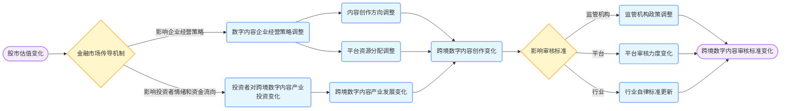

# 股市估值对跨境数字内容审核标准的影响

> 关键词：股市估值、跨境数字内容、审核标准、金融市场、内容监管、影响机制、数字经济

> 摘要：本文聚焦于股市估值对跨境数字内容审核标准的影响。首先介绍了研究的背景、目的、预期读者和文档结构等信息，明确了相关术语。接着阐述了股市估值、跨境数字内容及审核标准的核心概念及其联系。详细分析了核心算法原理，并给出具体操作步骤，同时引入数学模型和公式进行深入讲解与举例。通过项目实战，展示了代码实现及解读。探讨了该现象在实际中的应用场景，推荐了相关的学习资源、开发工具框架和论文著作。最后总结了未来发展趋势与挑战，解答常见问题并提供扩展阅读与参考资料。旨在全面剖析股市估值与跨境数字内容审核标准之间的内在关联，为相关领域的研究和实践提供参考。

## 1. 背景介绍 
### 1.1 目的和范围
本研究的目的在于深入探究股市估值与跨境数字内容审核标准之间的内在联系和相互影响机制。在当今全球化和数字化的时代，股市作为金融市场的核心组成部分，其估值波动不仅反映了宏观经济形势和企业的经营状况，还对多个领域产生着深远的影响。与此同时，跨境数字内容的传播和交流日益频繁，审核标准的制定和实施对于维护信息安全、文化多样性以及市场秩序至关重要。本研究将通过理论分析、算法建模、实际案例研究等多种方法，全面分析股市估值如何影响跨境数字内容审核标准，以及这种影响在不同市场环境和行业领域中的表现和作用。研究范围涵盖了全球主要金融市场和数字内容产业，包括但不限于股票市场、数字媒体、在线游戏、电子商务等领域。

### 1.2 预期读者
本文预期读者包括金融领域的专业人士，如股票分析师、投资经理、金融研究员等，他们可以从股市估值的角度，深入了解其对跨境数字内容审核标准的影响，为投资决策和市场分析提供新的视角。数字内容产业的从业者，如内容创作者、平台运营者、审核人员等，能够通过本文认识到股市估值因素在审核标准制定中的作用，优化内容创作和审核流程。监管机构的工作人员，可借助本文的研究成果，制定更加科学合理的跨境数字内容审核政策，平衡市场发展和监管要求。此外，对金融和数字内容领域交叉研究感兴趣的学者和学生也可以从本文中获取有价值的信息和研究思路。

### 1.3 文档结构概述
本文将按照以下结构展开：首先在背景介绍部分明确研究的目的、范围、预期读者和文档结构，同时给出相关术语的定义和解释。接着详细阐述股市估值、跨境数字内容和审核标准的核心概念及其相互联系，并通过文本示意图和 Mermaid 流程图进行直观展示。在核心算法原理和具体操作步骤部分，使用 Python 代码详细讲解相关算法。引入数学模型和公式，对股市估值与跨境数字内容审核标准之间的关系进行量化分析，并通过举例说明。通过项目实战，展示代码的实际应用和详细解读。探讨该研究在实际中的应用场景，推荐相关的学习资源、开发工具框架和论文著作。最后总结未来发展趋势与挑战，解答常见问题并提供扩展阅读和参考资料。

### 1.4 术语表
#### 1.4.1 核心术语定义
- **股市估值**：是指对股票市场中上市公司的价值进行评估的过程和结果。它通过各种估值方法，如市盈率（P/E）、市净率（P/B）、现金流折现法（DCF）等，来确定股票的合理价格范围，反映了市场对公司未来盈利能力和发展前景的预期。
- **跨境数字内容**：是指通过互联网等数字技术跨越国家或地区边界进行传播和交流的各种内容形式，包括但不限于文字、图片、音频、视频、游戏等。这些内容可以来自不同的文化背景和国家，具有多样性和复杂性的特点。
- **审核标准**：是指对跨境数字内容进行审查和评估时所依据的一系列规则和准则。审核标准通常涵盖内容的合法性、道德性、真实性、版权等多个方面，旨在确保数字内容符合当地法律法规和社会价值观。

#### 1.4.2 相关概念解释
- **金融市场传导机制**：是指股市估值的变化通过一系列经济和市场因素，如投资者情绪、资金流动、企业战略调整等，传导到其他领域的过程和方式。在本研究中，金融市场传导机制是股市估值影响跨境数字内容审核标准的重要途径。
- **数字内容产业生态系统**：是指由数字内容的创作者、传播者、消费者以及相关的技术平台、监管机构等组成的一个相互关联、相互作用的生态系统。股市估值的变化可能会影响数字内容产业生态系统中各主体的行为和决策，进而影响跨境数字内容审核标准。

#### 1.4.3 缩略词列表
- **P/E**：市盈率（Price-to-Earnings Ratio），是指股票价格与每股收益的比率，用于衡量股票的估值水平。
- **P/B**：市净率（Price-to-Book Ratio），是指股票价格与每股净资产的比率，反映了股票的市场价值与账面价值之间的关系。
- **DCF**：现金流折现法（Discounted Cash Flow），是一种通过预测企业未来现金流并将其折现到当前的估值方法。

## 2. 核心概念与联系 
### 核心概念原理
#### 股市估值原理
股市估值是基于对上市公司未来盈利能力和发展前景的预期。常用的估值方法有相对估值法和绝对估值法。相对估值法通过与同行业其他公司或市场平均水平进行比较，如市盈率（P/E）、市净率（P/B）等指标，来评估股票的相对价值。例如，一家公司的市盈率高于行业平均水平，可能意味着市场对该公司的未来增长预期较高。绝对估值法如现金流折现法（DCF），则是通过预测公司未来的现金流，并将其折现到当前来确定公司的内在价值。其基本公式为：

$$V = \sum_{t=1}^{n} \frac{CF_t}{(1 + r)^t}$$

其中，$V$ 表示公司的内在价值，$CF_t$ 表示第 $t$ 期的现金流，$r$ 表示折现率，$n$ 表示预测期数。

#### 跨境数字内容原理
跨境数字内容是利用互联网和数字技术，打破地域限制，实现内容的全球传播。其传播过程涉及内容的创作、生产、分发和消费等多个环节。内容创作者通过各种数字工具和平台创作内容，然后通过互联网平台进行分发，最终到达全球各地的消费者手中。例如，一部在线电影可以通过视频流媒体平台，同时向多个国家和地区的用户播放。

#### 审核标准原理
审核标准的制定是为了维护社会公共利益、保护知识产权、确保内容的合法性和道德性。审核标准通常由政府监管机构、行业协会或平台自身制定。审核过程包括对内容的初步筛选、详细审查和最终决策等环节。例如，对于一部跨境数字电影，审核人员会检查其是否包含暴力、色情、恐怖等违法违规内容，是否侵犯他人知识产权等。

### 核心概念架构的文本示意图
```plaintext
股市估值
|
|-- 金融市场传导机制
|   |
|   |-- 影响数字内容企业经营策略
|   |   |
|   |   |-- 内容创作方向调整
|   |   |-- 平台资源分配
|   |
|   |-- 影响投资者情绪和资金流向
|       |
|       |-- 对跨境数字内容产业投资变化
|
|-- 影响跨境数字内容审核标准
|   |
|   |-- 监管机构政策调整
|   |-- 平台审核力度变化
|   |-- 行业自律标准更新

跨境数字内容
|
|-- 内容创作
|   |
|   |-- 创作者意图和风格
|   |-- 市场需求和趋势
|
|-- 内容分发
|   |
|   |-- 平台选择和策略
|   |-- 传播渠道和范围
|
|-- 内容消费
|   |
|   |-- 用户反馈和评价
|   |-- 消费行为和习惯

审核标准
|
|-- 合法性标准
|   |
|   |-- 法律法规遵循
|   |-- 知识产权保护
|
|-- 道德性标准
|   |
|   |-- 社会价值观体现
|   |-- 公序良俗维护
|
|-- 真实性标准
|   |
|   |-- 事实核查和验证
|   |-- 信息准确性保障
```

### Mermaid 流程图


## 3. 核心算法原理 & 具体操作步骤 
### 核心算法原理
为了分析股市估值对跨境数字内容审核标准的影响，我们可以构建一个基于回归分析的模型。假设我们有股市估值指标（如市盈率）$X$ 和跨境数字内容审核标准的量化指标 $Y$。我们的目标是找出 $X$ 和 $Y$ 之间的线性关系。

线性回归模型的基本形式为：

$$Y = \beta_0 + \beta_1X + \epsilon$$

其中，$\beta_0$ 是截距，$\beta_1$ 是斜率，$\epsilon$ 是误差项。

### 具体操作步骤
#### 数据收集
- 收集股市估值数据，如上市公司的市盈率、市净率等指标，可以从金融数据提供商（如 Wind、Bloomberg 等）获取。
- 收集跨境数字内容审核标准的相关数据，如审核通过率、审核时间等。这些数据可以通过与跨境数字内容平台合作获取，或者从行业报告中收集。

#### 数据预处理
- 对收集到的数据进行清洗，去除缺失值和异常值。
- 对数据进行标准化处理，使不同变量具有相同的尺度，便于后续分析。

#### 模型训练
- 使用 Python 的 `scikit-learn` 库构建线性回归模型。
- 将数据分为训练集和测试集，使用训练集对模型进行训练。

#### 模型评估
- 使用测试集对训练好的模型进行评估，计算模型的均方误差（MSE）、决定系数（$R^2$）等指标，评估模型的性能。

### Python 源代码详细阐述
```python
import numpy as np
from sklearn.model_selection import train_test_split
from sklearn.linear_model import LinearRegression
from sklearn.metrics import mean_squared_error, r2_score

# 模拟股市估值数据
np.random.seed(0)
stock_valuation = np.random.rand(100, 1) * 100

# 模拟跨境数字内容审核标准数据
audit_standard = 20 + 0.5 * stock_valuation + np.random.randn(100, 1) * 5

# 数据预处理
# 这里简单示例，实际中可能需要更复杂的处理
# 划分训练集和测试集
X_train, X_test, y_train, y_test = train_test_split(stock_valuation, audit_standard, test_size=0.2, random_state=42)

# 构建线性回归模型
model = LinearRegression()

# 模型训练
model.fit(X_train, y_train)

# 模型预测
y_pred = model.predict(X_test)

# 模型评估
mse = mean_squared_error(y_test, y_pred)
r2 = r2_score(y_test, y_pred)

print(f"均方误差 (MSE): {mse}")
print(f"决定系数 (R^2): {r2}")
print(f"截距: {model.intercept_}")
print(f"斜率: {model.coef_}")
```

在上述代码中，我们首先模拟了股市估值数据和跨境数字内容审核标准数据。然后将数据划分为训练集和测试集，使用 `LinearRegression` 类构建线性回归模型，并对模型进行训练。最后，使用测试集进行预测，并计算均方误差和决定系数来评估模型的性能。

## 4. 数学模型和公式 & 详细讲解 & 举例说明 
### 数学模型和公式
#### 线性回归模型
如前文所述，线性回归模型的基本形式为：

$$Y = \beta_0 + \beta_1X + \epsilon$$

其中，$Y$ 是因变量（跨境数字内容审核标准的量化指标），$X$ 是自变量（股市估值指标），$\beta_0$ 是截距，$\beta_1$ 是斜率，$\epsilon$ 是误差项，服从均值为 0 的正态分布。

#### 均方误差（MSE）
均方误差是衡量模型预测值与真实值之间差异的指标，其计算公式为：

$$MSE = \frac{1}{n} \sum_{i=1}^{n} (y_i - \hat{y}_i)^2$$

其中，$n$ 是样本数量，$y_i$ 是真实值，$\hat{y}_i$ 是预测值。

#### 决定系数（$R^2$）
决定系数用于衡量模型对数据的拟合程度，其计算公式为：

$$R^2 = 1 - \frac{\sum_{i=1}^{n} (y_i - \hat{y}_i)^2}{\sum_{i=1}^{n} (y_i - \bar{y})^2}$$

其中，$\bar{y}$ 是真实值的均值。

### 详细讲解
#### 线性回归模型
线性回归模型假设自变量 $X$ 和因变量 $Y$ 之间存在线性关系。截距 $\beta_0$ 表示当 $X$ 为 0 时 $Y$ 的值，斜率 $\beta_1$ 表示 $X$ 每增加一个单位，$Y$ 的平均变化量。误差项 $\epsilon$ 表示模型无法解释的随机因素。

#### 均方误差（MSE）
均方误差通过计算预测值与真实值之间的平方差的平均值来衡量模型的误差。MSE 值越小，说明模型的预测效果越好。

#### 决定系数（$R^2$）
决定系数的取值范围在 0 到 1 之间。$R^2$ 值越接近 1，说明模型对数据的拟合程度越好，即自变量 $X$ 能够解释因变量 $Y$ 的大部分变化。

### 举例说明
假设我们收集了 10 家跨境数字内容企业的股市估值（市盈率）和审核通过率的数据，如下表所示：

| 企业编号 | 市盈率（$X$） | 审核通过率（$Y$） |
| ---- | ---- | ---- |
| 1 | 20 | 80% |
| 2 | 25 | 82% |
| 3 | 30 | 85% |
| 4 | 35 | 88% |
| 5 | 40 | 90% |
| 6 | 45 | 92% |
| 7 | 50 | 94% |
| 8 | 55 | 95% |
| 9 | 60 | 96% |
| 10 | 65 | 97% |

我们使用这些数据构建线性回归模型，通过计算得到截距 $\beta_0 = 70$，斜率 $\beta_1 = 0.4$。则线性回归方程为：

$$Y = 70 + 0.4X$$

这意味着市盈率每增加 1，审核通过率平均增加 0.4%。

我们还可以计算均方误差和决定系数来评估模型的性能。假设预测值和真实值的误差平方和为 10，真实值的总离差平方和为 50，则：

$$MSE = \frac{10}{10} = 1$$

$$R^2 = 1 - \frac{10}{50} = 0.8$$

这表明模型的均方误差为 1，决定系数为 0.8，说明模型的预测效果较好，能够解释 80% 的审核通过率的变化。

## 5. 项目实战：代码实际案例和详细解释说明 
### 5.1  开发环境搭建
#### 安装 Python
首先，需要安装 Python 环境。可以从 Python 官方网站（https://www.python.org/downloads/）下载适合自己操作系统的 Python 版本进行安装。建议安装 Python 3.7 及以上版本。

#### 安装必要的库
使用 `pip` 命令安装项目所需的库，包括 `numpy`、`pandas`、`scikit-learn` 等。打开命令行工具，执行以下命令：

```sh
pip install numpy pandas scikit-learn
```

### 5.2  源代码详细实现和代码解读
```python
import numpy as np
import pandas as pd
from sklearn.model_selection import train_test_split
from sklearn.linear_model import LinearRegression
from sklearn.metrics import mean_squared_error, r2_score

# 读取数据
data = pd.read_csv('stock_valuation_audit.csv')

# 提取自变量和因变量
X = data[['PE_ratio']].values
y = data['audit_pass_rate'].values

# 数据预处理
# 这里简单示例，实际中可能需要更复杂的处理
# 划分训练集和测试集
X_train, X_test, y_train, y_test = train_test_split(X, y, test_size=0.2, random_state=42)

# 构建线性回归模型
model = LinearRegression()

# 模型训练
model.fit(X_train, y_train)

# 模型预测
y_pred = model.predict(X_test)

# 模型评估
mse = mean_squared_error(y_test, y_pred)
r2 = r2_score(y_test, y_pred)

print(f"均方误差 (MSE): {mse}")
print(f"决定系数 (R^2): {r2}")
print(f"截距: {model.intercept_}")
print(f"斜率: {model.coef_}")
```

### 代码解读与分析
#### 数据读取
使用 `pandas` 库的 `read_csv` 函数读取存储股市估值和审核通过率数据的 CSV 文件。假设文件名为 `stock_valuation_audit.csv`，其中包含 `PE_ratio`（市盈率）和 `audit_pass_rate`（审核通过率）两列数据。

#### 数据提取
从读取的数据中提取自变量 `X`（市盈率）和因变量 `y`（审核通过率），并将其转换为 `numpy` 数组。

#### 数据预处理
使用 `train_test_split` 函数将数据划分为训练集和测试集，其中测试集占总数据的 20%。

#### 模型构建和训练
使用 `LinearRegression` 类构建线性回归模型，并使用训练集数据对模型进行训练。

#### 模型预测和评估
使用训练好的模型对测试集数据进行预测，并计算均方误差和决定系数来评估模型的性能。最后，打印出评估结果和模型的截距、斜率。

## 6. 实际应用场景 
### 金融投资领域
在金融投资领域，股市估值对跨境数字内容审核标准的影响可以为投资者提供决策参考。当股市估值上升时，意味着市场对数字内容企业的未来发展前景看好，企业可能会加大对内容创作和推广的投入。此时，审核标准可能会相对宽松，以鼓励更多优质内容的产生。投资者可以根据这一趋势，选择投资那些在内容创作和审核标准方面具有优势的跨境数字内容企业。例如，一家在线视频平台企业在股市估值上升时，可能会放宽对一些新兴题材视频的审核标准，以吸引更多用户。投资者可以关注这些平台的发展动态，适时进行投资。

### 数字内容产业监管
对于数字内容产业的监管机构来说，了解股市估值对跨境数字内容审核标准的影响有助于制定更加科学合理的监管政策。当股市估值波动较大时，监管机构需要密切关注数字内容企业的经营策略和审核标准的变化，防止企业为了追求短期利益而降低审核标准，导致不良内容的传播。例如，在股市估值下降期间，一些企业可能会为了降低成本而减少审核人员，放松审核标准。监管机构可以加强对这些企业的监管力度，确保审核标准的严格执行。

### 跨境数字内容平台运营
跨境数字内容平台在运营过程中，需要根据股市估值的变化调整审核标准。当股市估值较高时，平台可以适当提高审核标准，筛选出更优质、更具创新性的内容，以提升平台的品牌形象和用户体验。当股市估值较低时，平台可以在保证内容合法性的前提下，适当放宽审核标准，吸引更多的内容创作者和用户。例如，一家跨境游戏平台在股市估值上升时，可以加强对游戏内容的审核，确保游戏的质量和安全性；在股市估值下降时，可以推出一些扶持政策，鼓励更多小型游戏开发者上传游戏，同时加强对游戏的后期监管。

## 7. 工具和资源推荐
### 7.1 学习资源推荐
#### 7.1.1 书籍推荐
- 《金融市场学》：这本书系统地介绍了金融市场的基本概念、运行机制和各种金融工具，对于理解股市估值的原理和方法具有重要的帮助。
- 《数字内容产业研究》：深入探讨了数字内容产业的发展现状、趋势和相关理论，有助于了解跨境数字内容的产业生态和运营模式。
- 《回归分析及其应用》：详细讲解了回归分析的原理、方法和应用，对于学习如何构建和应用线性回归模型分析股市估值与跨境数字内容审核标准之间的关系非常有价值。

#### 7.1.2 在线课程
- Coursera 上的“金融市场”课程：由知名高校的教授授课，全面介绍了金融市场的各个方面，包括股市估值的方法和模型。
- edX 上的“数字内容战略”课程：聚焦于数字内容产业的战略规划和运营管理，对于理解跨境数字内容的发展和审核标准的制定具有指导意义。
- 网易云课堂上的“Python 数据分析与机器学习实战”课程：通过实际案例，教授如何使用 Python 进行数据分析和机器学习建模，有助于掌握本研究中所需的编程技能。

#### 7.1.3 技术博客和网站
- 金融界网站：提供丰富的金融市场资讯和数据分析，包括股市估值的相关数据和报告。
- 艾瑞咨询：专注于互联网和数字经济领域的研究，发布了大量关于数字内容产业的研究报告和分析文章。
- Medium 上的技术博客：有许多关于数据分析、机器学习和金融科技的优秀文章，可以从中获取最新的技术和研究动态。

### 7.2 开发工具框架推荐
#### 7.2.1 IDE和编辑器
- PyCharm：是一款专业的 Python 集成开发环境，具有强大的代码编辑、调试和项目管理功能，适合进行大规模的 Python 项目开发。
- Jupyter Notebook：是一个交互式的开发环境，支持 Python 代码的编写、运行和可视化展示，非常适合进行数据分析和机器学习实验。

#### 7.2.2 调试和性能分析工具
- PDB：是 Python 自带的调试工具，可以帮助开发者在代码中设置断点、查看变量值和执行流程，方便进行代码调试。
- cProfile：是 Python 的性能分析工具，可以统计代码的运行时间和函数调用次数，帮助开发者找出代码中的性能瓶颈。

#### 7.2.3 相关框架和库
- `numpy`：是 Python 中用于科学计算的基础库，提供了高效的数组操作和数学函数，是进行数据分析和机器学习的必备工具。
- `pandas`：是一个强大的数据处理和分析库，提供了灵活的数据结构和数据操作方法，方便进行数据清洗、转换和分析。
- `scikit-learn`：是 Python 中常用的机器学习库，提供了丰富的机器学习算法和工具，包括线性回归、决策树、支持向量机等，可用于构建和评估各种机器学习模型。

### 7.3 相关论文著作推荐
#### 7.3.1 经典论文
- “Efficient Capital Markets: A Review of Theory and Empirical Work”：该论文是有效市场假说的经典文献，对于理解股市估值的市场机制具有重要的参考价值。
- “The Economics of Digital Content: A Survey”：全面综述了数字内容产业的经济学理论和研究成果，为研究跨境数字内容的经济特性提供了理论基础。

#### 7.3.2 最新研究成果
- 近年来在《Journal of Financial Economics》《Management Science》等顶级学术期刊上发表的关于股市估值与行业发展关系的研究论文，这些论文反映了该领域的最新研究动态和前沿成果。
- 关于数字内容审核标准的最新研究，如在《Information Systems Research》《Journal of Management Information Systems》等期刊上发表的论文，探讨了审核标准的制定和优化方法。

#### 7.3.3 应用案例分析
- 一些知名咨询公司发布的关于跨境数字内容产业的案例分析报告，如麦肯锡、波士顿咨询等公司的报告，通过实际案例分析了股市估值对跨境数字内容审核标准的影响以及企业的应对策略。

## 8. 总结：未来发展趋势与挑战
### 未来发展趋势
#### 数据驱动的审核标准调整
随着大数据和人工智能技术的不断发展，未来跨境数字内容审核标准将更加依赖于数据驱动的决策。通过对股市估值数据、用户行为数据、内容特征数据等多源数据的分析，能够更加精准地调整审核标准，以适应市场变化和用户需求。例如，利用机器学习算法对股市估值的波动进行预测，提前调整审核标准，确保数字内容平台的稳定运营。

#### 跨领域融合的审核机制
股市估值与跨境数字内容审核标准的关系将促使金融、科技、文化等多个领域的深度融合。未来的审核机制将不再局限于单一领域的规则和标准，而是综合考虑金融市场的稳定性、数字内容的文化价值和社会影响等多方面因素。例如，建立跨部门的联合审核机制，由金融监管机构、文化部门和数字内容平台共同参与审核标准的制定和执行。

#### 国际化审核标准的协调
随着跨境数字内容的全球化传播，不同国家和地区之间的审核标准差异将成为一个突出问题。未来，国际社会将加强合作，推动国际化审核标准的协调和统一。通过建立国际标准组织、签订双边或多边协议等方式，促进跨境数字内容的顺畅流通，同时保障各国的文化安全和社会利益。

### 挑战
#### 数据隐私和安全问题
在利用大数据分析股市估值和跨境数字内容审核标准的过程中，数据隐私和安全问题是一个重要挑战。大量的用户数据和企业数据需要被收集和分析，如何确保这些数据的安全性和隐私性，防止数据泄露和滥用，是亟待解决的问题。例如，一些数字内容平台在收集用户数据时，可能会面临用户隐私保护的法律风险。

#### 技术复杂性和成本问题
构建和应用复杂的数据分析模型和算法来分析股市估值与跨境数字内容审核标准之间的关系，需要具备较高的技术水平和大量的计算资源。对于一些小型数字内容企业来说，可能难以承担这些技术和成本压力。此外，技术的不断更新换代也要求企业不断投入资源进行技术升级和人才培养。

#### 文化差异和价值观冲突
不同国家和地区具有不同的文化背景和价值观，这使得跨境数字内容审核标准的制定和执行面临文化差异和价值观冲突的挑战。例如，某些在一个国家被认为是合法和道德的内容，在另一个国家可能被视为违法或不道德。如何在尊重文化差异的前提下，制定出合理的审核标准，是一个需要深入研究和探讨的问题。

## 9. 附录：常见问题与解答
### 问题 1：股市估值对跨境数字内容审核标准的影响是直接的还是间接的？
解答：股市估值对跨境数字内容审核标准的影响通常是间接的。股市估值的变化会通过金融市场传导机制，影响数字内容企业的经营策略、投资者的情绪和资金流向等，进而导致监管机构、平台和行业对审核标准进行调整。例如，股市估值上升时，企业可能会加大对内容创作的投入，平台为了吸引更多优质内容，可能会适当放宽审核标准，但这并不是股市估值直接作用的结果。

### 问题 2：如何量化股市估值对跨境数字内容审核标准的影响程度？
解答：可以通过构建数学模型，如线性回归模型、时间序列模型等，来量化股市估值对跨境数字内容审核标准的影响程度。首先，需要收集股市估值数据和审核标准的相关数据，然后对数据进行预处理和分析，确定自变量和因变量之间的关系。通过计算模型的系数和统计指标，如斜率、决定系数等，可以评估股市估值对审核标准的影响程度。例如，在线性回归模型中，斜率表示股市估值每变化一个单位，审核标准的平均变化量。

### 问题 3：不同类型的跨境数字内容（如文字、视频、游戏等）在受到股市估值影响时，审核标准的变化是否相同？
解答：不同类型的跨境数字内容在受到股市估值影响时，审核标准的变化可能不同。这是因为不同类型的数字内容具有不同的特点和受众群体，其市场需求和监管要求也有所差异。例如，视频内容可能更注重内容的质量和版权问题，而游戏内容可能更关注游戏的安全性和可玩性。因此，当股市估值发生变化时，不同类型数字内容的审核标准调整方向和幅度可能会有所不同。

### 问题 4：股市估值下降时，跨境数字内容审核标准一定会变宽松吗？
解答：不一定。股市估值下降时，数字内容企业可能会面临资金压力和市场竞争加剧的情况。在这种情况下，企业可能会采取不同的策略来应对。一方面，为了降低成本，企业可能会减少审核人员，放松审核标准；另一方面，为了提高市场竞争力，企业可能会更加注重内容的质量和特色，提高审核标准，筛选出更优质的内容。此外，监管机构也可能会加强对企业的监管，防止审核标准的过度放松。因此，股市估值下降时，跨境数字内容审核标准的变化需要综合考虑多种因素。

## 10. 扩展阅读 & 参考资料
### 扩展阅读
- 《金融科技前沿》：深入探讨了金融科技在金融市场和各个行业的应用，包括股市估值分析和数字内容产业的创新发展。
- 《全球数字内容产业发展报告》：对全球数字内容产业的发展现状、趋势和政策进行了全面的分析和研究，有助于了解跨境数字内容产业的宏观环境。
- 《数据分析实战案例集》：通过大量实际案例，展示了数据分析在不同领域的应用方法和技巧，对于学习如何分析股市估值与跨境数字内容审核标准之间的关系具有启发作用。

### 参考资料
- 金融数据提供商（如 Wind、Bloomberg 等）发布的股市估值数据和研究报告。
- 国际电信联盟（ITU）、世界知识产权组织（WIPO）等国际组织发布的关于数字内容产业和知识产权保护的相关报告和政策文件。
- 各国政府监管机构发布的跨境数字内容审核政策和法规，如中国国家互联网信息办公室发布的《网络音视频信息服务管理规定》等。