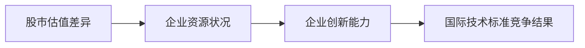

# 股市估值差异对国际技术标准竞争的影响

> 关键词：股市估值差异、国际技术标准竞争、企业创新、市场资源配置、产业生态

> 摘要：本文深入探讨了股市估值差异对国际技术标准竞争的影响。首先介绍了研究的背景、目的、预期读者等内容，接着阐述了股市估值差异和国际技术标准竞争的核心概念及联系。通过分析核心算法原理和数学模型，揭示两者之间的内在关系。结合项目实战案例，详细解读代码实现和原理。进一步探讨了其在实际应用场景中的表现，推荐了相关的学习资源、开发工具和论文著作。最后总结了未来发展趋势与挑战，解答了常见问题并提供了参考资料，旨在全面剖析股市估值差异在国际技术标准竞争中的作用和影响。

## 1. 背景介绍 
### 1.1 目的和范围
随着全球经济一体化的深入发展，国际技术标准竞争日益激烈，成为各国企业和产业争夺市场话语权和经济利益的关键战场。股市作为企业融资和价值评估的重要平台，其估值差异不仅反映了企业的市场表现，还可能对企业的战略决策和创新能力产生深远影响。本研究的目的在于深入探究股市估值差异与国际技术标准竞争之间的内在联系，分析股市估值差异如何影响企业在国际技术标准竞争中的行为和绩效，以及这种影响对产业发展和国家竞争力的意义。研究范围涵盖了不同行业、不同国家的企业在股市估值和技术标准竞争方面的相关数据和案例，旨在为企业制定战略、政府制定政策提供理论支持和实践参考。

### 1.2 预期读者
本文的预期读者包括企业管理者、投资者、政策制定者、学者以及对国际技术标准竞争和股市投资感兴趣的人士。对于企业管理者，本文可以帮助他们理解股市估值差异对企业技术标准竞争战略的影响，从而制定更加有效的发展策略；投资者可以从本文中了解股市估值与企业技术创新能力和市场竞争力的关系，为投资决策提供参考；政策制定者可以根据研究结果制定相关政策，促进企业技术创新和国际技术标准竞争能力的提升；学者可以在本文的基础上进行更深入的理论研究和实证分析。

### 1.3 文档结构概述
本文共分为十个部分。第一部分为背景介绍，阐述了研究的目的、范围、预期读者和文档结构概述，并对相关术语进行了定义和解释。第二部分介绍了股市估值差异和国际技术标准竞争的核心概念与联系，通过文本示意图和 Mermaid 流程图展示了两者之间的逻辑关系。第三部分详细讲解了核心算法原理和具体操作步骤，使用 Python 源代码进行了详细阐述。第四部分介绍了数学模型和公式，并通过具体例子进行了详细讲解。第五部分是项目实战，包括开发环境搭建、源代码详细实现和代码解读。第六部分探讨了实际应用场景。第七部分推荐了相关的学习资源、开发工具框架和论文著作。第八部分总结了未来发展趋势与挑战。第九部分是附录，解答了常见问题。第十部分提供了扩展阅读和参考资料。

### 1.4 术语表
#### 1.4.1 核心术语定义
- **股市估值差异**：指不同企业在股票市场上的估值水平存在差异，这种差异可以通过市盈率、市净率等指标来衡量。股市估值差异反映了市场对不同企业的预期和评价，受到企业的盈利能力、成长潜力、行业地位等多种因素的影响。
- **国际技术标准竞争**：指各国企业或产业在国际市场上围绕技术标准的制定、推广和应用展开的竞争。国际技术标准竞争的目的是通过掌握技术标准的话语权，获得市场竞争优势，提高产业附加值和国家竞争力。
- **技术标准**：是对标准化领域中需要协调统一的技术事项所制定的标准。技术标准规定了产品或服务的技术要求、质量指标、测试方法等内容，是企业生产经营和市场交易的重要依据。

#### 1.4.2 相关概念解释
- **企业创新能力**：指企业在技术、产品、管理等方面进行创新的能力。企业创新能力是企业在国际技术标准竞争中取得优势的关键因素，受到企业的研发投入、人才储备、创新文化等多种因素的影响。
- **市场资源配置**：指市场机制对资源的分配和调节作用。在股票市场中，股市估值差异会影响市场资源的配置方向，高估值的企业更容易获得资金、人才等资源，从而在技术标准竞争中占据优势。
- **产业生态**：指由相互关联的企业、科研机构、高校等组成的产业发展生态系统。产业生态的完善程度对企业的技术创新和国际技术标准竞争能力有着重要影响，良好的产业生态可以促进企业之间的合作与创新，提高产业的整体竞争力。

#### 1.4.3 缩略词列表
- **PE**：市盈率（Price - Earnings Ratio），是指股票价格除以每股收益的比率，反映了市场对企业盈利预期的高低。
- **PB**：市净率（Price - Book Ratio），是指股票价格与每股净资产的比率，反映了市场对企业净资产价值的评估。

## 2. 核心概念与联系 

### 核心概念原理
股市估值差异是股票市场对不同企业价值评估的结果。企业的盈利能力、成长潜力、行业前景、管理水平等因素都会影响其在股市中的估值。高估值的企业通常被市场认为具有较强的盈利能力和成长潜力，能够吸引更多的投资者和资金；低估值的企业则可能面临融资困难、市场信心不足等问题。

国际技术标准竞争是企业在全球市场上争夺技术话语权的重要手段。技术标准的制定和推广可以为企业带来巨大的经济利益和市场优势。掌握国际技术标准的企业可以通过技术授权、专利收费等方式获取高额利润，同时还可以提高产品的市场准入门槛，限制竞争对手的进入。

### 两者的联系
股市估值差异会对企业在国际技术标准竞争中的行为和绩效产生重要影响。高估值的企业由于更容易获得资金和资源，有更多的能力进行研发投入和技术创新，从而在国际技术标准竞争中占据优势。这些企业可以加大对新技术的研发力度，推动技术标准的制定和推广，提高自身在行业中的地位和影响力。

相反，低估值的企业由于资金和资源相对匮乏，可能难以进行大规模的研发投入和技术创新，在国际技术标准竞争中处于劣势。这些企业可能只能跟随高估值企业制定的技术标准，难以形成自己的核心竞争力。

### 文本示意图
```plaintext
股市估值差异
        |
        | 影响资源获取
        v
企业资源状况
        |
        | 影响研发投入
        v
企业创新能力
        |
        | 影响技术标准竞争
        v
国际技术标准竞争结果
```

### Mermaid 流程图


## 3. 核心算法原理 & 具体操作步骤 

### 核心算法原理
为了分析股市估值差异对国际技术标准竞争的影响，我们可以采用回归分析的方法。回归分析是一种统计方法，用于研究自变量（股市估值差异）与因变量（国际技术标准竞争绩效）之间的关系。

我们可以选择市盈率（PE）、市净率（PB）等指标来衡量股市估值差异，选择企业在国际技术标准制定中的参与度、技术标准的市场占有率等指标来衡量国际技术标准竞争绩效。

### 具体操作步骤
1. **数据收集**：收集不同企业的股市估值数据（PE、PB 等）和国际技术标准竞争绩效数据（技术标准参与度、市场占有率等）。数据来源可以包括股票交易市场、行业协会、企业年报等。
2. **数据预处理**：对收集到的数据进行清洗和整理，去除缺失值、异常值等。同时，对数据进行标准化处理，使不同指标的数据具有可比性。
3. **模型建立**：根据回归分析的原理，建立自变量（股市估值差异）与因变量（国际技术标准竞争绩效）之间的回归模型。可以选择线性回归模型、非线性回归模型等，根据数据的特点和分析目的进行选择。
4. **模型估计**：使用收集到的数据对回归模型进行估计，确定模型的参数。可以使用最小二乘法等方法进行参数估计。
5. **模型检验**：对估计得到的回归模型进行检验，包括拟合优度检验、显著性检验等。检验模型的合理性和可靠性。
6. **结果分析**：根据模型估计和检验的结果，分析股市估值差异对国际技术标准竞争绩效的影响。判断影响的方向和程度，以及是否具有统计学意义。

### Python 源代码实现
```python
import pandas as pd
import numpy as np
from sklearn.linear_model import LinearRegression
from sklearn.preprocessing import StandardScaler
from sklearn.model_selection import train_test_split
from sklearn.metrics import r2_score

# 数据收集和预处理
# 假设 data.csv 文件包含了企业的 PE、PB 和技术标准市场占有率等数据
data = pd.read_csv('data.csv')
X = data[['PE', 'PB']]  # 自变量：股市估值指标
y = data['market_share']  # 因变量：技术标准市场占有率

# 数据标准化处理
scaler = StandardScaler()
X_scaled = scaler.fit_transform(X)

# 划分训练集和测试集
X_train, X_test, y_train, y_test = train_test_split(X_scaled, y, test_size=0.2, random_state=42)

# 建立线性回归模型
model = LinearRegression()

# 模型训练
model.fit(X_train, y_train)

# 模型预测
y_pred = model.predict(X_test)

# 模型评估
r2 = r2_score(y_test, y_pred)
print(f"模型的 R2 得分: {r2}")

# 查看模型参数
print(f"模型的系数: {model.coef_}")
print(f"模型的截距: {model.intercept_}")
```

## 4. 数学模型和公式 & 详细讲解 & 举例说明 

### 数学模型
我们采用线性回归模型来分析股市估值差异对国际技术标准竞争绩效的影响。线性回归模型的一般形式为：

$$y = \beta_0 + \beta_1x_1 + \beta_2x_2 + \cdots + \beta_nx_n + \epsilon$$

其中，$y$ 是因变量（国际技术标准竞争绩效），$x_1, x_2, \cdots, x_n$ 是自变量（股市估值差异指标），$\beta_0$ 是截距，$\beta_1, \beta_2, \cdots, \beta_n$ 是回归系数，$\epsilon$ 是误差项。

在我们的例子中，假设我们选择市盈率（$x_1$）和市净率（$x_2$）作为自变量，技术标准市场占有率（$y$）作为因变量，则线性回归模型可以表示为：

$$y = \beta_0 + \beta_1PE + \beta_2PB + \epsilon$$

### 详细讲解
- **回归系数**：$\beta_1$ 和 $\beta_2$ 分别表示市盈率和市净率对技术标准市场占有率的影响程度。如果 $\beta_1$ 为正，说明市盈率越高，技术标准市场占有率越高；如果 $\beta_1$ 为负，说明市盈率越高，技术标准市场占有率越低。同理，$\beta_2$ 表示市净率对技术标准市场占有率的影响。
- **截距**：$\beta_0$ 表示当市盈率和市净率都为 0 时，技术标准市场占有率的估计值。在实际应用中，由于市盈率和市净率通常不会为 0，所以截距的实际意义相对较小。
- **误差项**：$\epsilon$ 表示模型无法解释的随机误差。误差项的存在是由于实际情况中存在许多无法观测或控制的因素，这些因素会影响技术标准市场占有率，但没有被纳入到模型中。

### 举例说明
假设我们通过数据估计得到的线性回归模型为：

$$y = 0.1 + 0.05PE + 0.03PB + \epsilon$$

这意味着，当市盈率每增加 1 个单位，技术标准市场占有率预计增加 0.05 个单位；当市净率每增加 1 个单位，技术标准市场占有率预计增加 0.03 个单位。截距 0.1 表示在市盈率和市净率都为 0 的情况下，技术标准市场占有率的估计值。

例如，某企业的市盈率为 20，市净率为 3，则根据上述模型，该企业的技术标准市场占有率的估计值为：

$$y = 0.1 + 0.05\times20 + 0.03\times3 = 0.1 + 1 + 0.09 = 1.19$$

当然，这只是一个估计值，实际的技术标准市场占有率还会受到误差项的影响。

## 5. 项目实战：代码实际案例和详细解释说明 

### 5.1  开发环境搭建
1. **安装 Python**：首先需要安装 Python 开发环境。可以从 Python 官方网站（https://www.python.org/downloads/） 下载适合自己操作系统的 Python 版本，并按照安装向导进行安装。
2. **安装必要的库**：在本项目中，我们需要使用 pandas、numpy、scikit - learn 等库。可以使用以下命令进行安装：
```sh
pip install pandas numpy scikit-learn
```
3. **准备数据文件**：将包含企业股市估值数据和技术标准竞争绩效数据的文件（例如 data.csv）放在项目目录下。

### 5.2  源代码详细实现和代码解读
```python
import pandas as pd
import numpy as np
from sklearn.linear_model import LinearRegression
from sklearn.preprocessing import StandardScaler
from sklearn.model_selection import train_test_split
from sklearn.metrics import r2_score

# 数据收集和预处理
# 假设 data.csv 文件包含了企业的 PE、PB 和技术标准市场占有率等数据
data = pd.read_csv('data.csv')
X = data[['PE', 'PB']]  # 自变量：股市估值指标
y = data['market_share']  # 因变量：技术标准市场占有率

# 数据标准化处理
scaler = StandardScaler()
X_scaled = scaler.fit_transform(X)

# 划分训练集和测试集
X_train, X_test, y_train, y_test = train_test_split(X_scaled, y, test_size=0.2, random_state=42)

# 建立线性回归模型
model = LinearRegression()

# 模型训练
model.fit(X_train, y_train)

# 模型预测
y_pred = model.predict(X_test)

# 模型评估
r2 = r2_score(y_test, y_pred)
print(f"模型的 R2 得分: {r2}")

# 查看模型参数
print(f"模型的系数: {model.coef_}")
print(f"模型的截距: {model.intercept_}")
```
- **数据收集和预处理**：使用 `pandas` 库的 `read_csv` 函数读取数据文件，将自变量（PE、PB）和因变量（市场占有率）分别存储在 `X` 和 `y` 中。然后使用 `StandardScaler` 对自变量进行标准化处理，使不同指标的数据具有可比性。
- **划分训练集和测试集**：使用 `train_test_split` 函数将数据划分为训练集和测试集，测试集占总数据的 20%。
- **建立线性回归模型**：使用 `LinearRegression` 类建立线性回归模型。
- **模型训练**：使用训练集数据对模型进行训练，调用 `fit` 方法。
- **模型预测**：使用训练好的模型对测试集数据进行预测，调用 `predict` 方法。
- **模型评估**：使用 `r2_score` 函数计算模型的 R2 得分，评估模型的拟合优度。
- **查看模型参数**：使用 `coef_` 和 `intercept_` 属性查看模型的系数和截距。

### 5.3  代码解读与分析
- **R2 得分**：R2 得分是衡量回归模型拟合优度的指标，取值范围在 0 到 1 之间。R2 得分越接近 1，说明模型对数据的拟合效果越好。如果 R2 得分较低，可能需要考虑增加自变量、更换模型或对数据进行进一步处理。
- **系数和截距**：系数表示自变量对因变量的影响程度，截距表示当所有自变量都为 0 时因变量的估计值。通过分析系数的正负和大小，可以了解股市估值差异对国际技术标准竞争绩效的影响方向和程度。

## 6. 实际应用场景 
### 企业战略决策
企业管理者可以根据股市估值差异来制定技术标准竞争战略。高估值的企业可以利用自身的资金和资源优势，加大研发投入，积极参与国际技术标准的制定和推广，提高企业的核心竞争力。例如，一些科技巨头公司通过高估值获得了大量的资金，用于研发新技术和推动行业标准的制定，从而在全球市场上占据了领先地位。

低估值的企业可以通过与高估值企业合作、加强自身的创新能力等方式，提高自己在国际技术标准竞争中的地位。例如，一些中小企业可以与行业龙头企业合作，参与技术标准的制定，借助龙头企业的资源和影响力，提升自己的技术水平和市场认可度。

### 投资者决策
投资者可以根据股市估值差异和企业在国际技术标准竞争中的表现来进行投资决策。高估值且在国际技术标准竞争中具有优势的企业，通常具有较高的投资价值。投资者可以关注这些企业的发展动态，适时进行投资。

相反，低估值且在国际技术标准竞争中处于劣势的企业，投资风险相对较高。投资者在进行投资时需要谨慎考虑，充分评估企业的发展前景和风险。

### 政府政策制定
政府可以根据股市估值差异和国际技术标准竞争的情况，制定相关政策来促进企业的技术创新和国际技术标准竞争能力的提升。例如，政府可以通过税收优惠、财政补贴等政策，鼓励高估值企业加大研发投入，推动技术标准的制定和推广。

同时，政府也可以通过建立公共服务平台、加强知识产权保护等措施，为低估值企业提供更好的发展环境，帮助它们提高技术创新能力和国际技术标准竞争能力。

## 7. 工具和资源推荐
### 7.1 学习资源推荐
#### 7.1.1 书籍推荐
- 《计量经济学》：介绍了计量经济学的基本理论和方法，包括回归分析、时间序列分析等，对于理解和应用回归模型分析股市估值差异和国际技术标准竞争之间的关系具有重要的指导作用。
- 《技术标准竞争战略》：深入探讨了技术标准竞争的理论和实践，分析了企业在技术标准竞争中的战略选择和应对策略。
- 《金融学》：涵盖了金融市场的基本原理和运作机制，包括股票市场、债券市场等，有助于了解股市估值的相关知识。

#### 7.1.2 在线课程
- Coursera 上的“计量经济学基础”课程：由知名高校的教授授课，系统地介绍了计量经济学的基本概念、方法和应用。
- edX 上的“技术创新与标准竞争”课程：结合实际案例，讲解了技术创新和标准竞争的相关理论和实践。
- 中国大学 MOOC 上的“金融学原理”课程：帮助学习者掌握金融学的基本原理和方法，了解股票市场的运行机制。

#### 7.1.3 技术博客和网站
- 雪球网：提供了丰富的股票市场数据和分析文章，有助于了解股市估值的动态和趋势。
- 中国标准化研究院官网：发布了关于技术标准的政策法规、研究成果等信息，是了解技术标准相关知识的重要渠道。
- 学术期刊网（如知网、万方等）：可以搜索到关于股市估值、技术标准竞争等方面的学术论文，获取最新的研究成果。

### 7.2 开发工具框架推荐
#### 7.2.1 IDE和编辑器
- PyCharm：是一款专门为 Python 开发设计的集成开发环境（IDE），具有强大的代码编辑、调试、智能提示等功能，适合进行数据处理和模型开发。
- Jupyter Notebook：是一个基于网页的交互式计算环境，支持 Python 等多种编程语言。可以方便地进行数据可视化、模型调试和结果展示。

#### 7.2.2 调试和性能分析工具
- IPython：是 Python 的交互式 shell，提供了强大的调试功能，如代码补全、语法高亮、错误提示等。
- Scikit - learn 的内置评估工具：可以对回归模型进行性能评估，如计算 R2 得分、均方误差等。

#### 7.2.3 相关框架和库
- Pandas：是一个用于数据处理和分析的 Python 库，提供了高效的数据结构和数据操作方法，方便进行数据清洗、整理和分析。
- Numpy：是 Python 的数值计算库，提供了高效的数组操作和数学函数，是许多机器学习库的基础。
- Scikit - learn：是一个强大的机器学习库，提供了各种机器学习算法和工具，如线性回归、决策树、聚类分析等。

### 7.3 相关论文著作推荐
#### 7.3.1 经典论文
- “The Economics of Technological Standards”：探讨了技术标准的经济学原理和市场机制，分析了技术标准对产业发展和市场竞争的影响。
- “Stock Market Valuation and Corporate Innovation”：研究了股市估值与企业创新之间的关系，为分析股市估值差异对国际技术标准竞争的影响提供了理论基础。

#### 7.3.2 最新研究成果
- 关注《管理世界》《中国工业经济》等国内权威学术期刊，以及《Journal of Financial Economics》《Strategic Management Journal》等国际知名学术期刊，获取关于股市估值、技术标准竞争等方面的最新研究成果。

#### 7.3.3 应用案例分析
- 分析华为、苹果等公司在国际技术标准竞争中的案例，了解这些公司如何利用自身的优势和资源，制定技术标准竞争战略，提高市场竞争力。

## 8. 总结：未来发展趋势与挑战
### 未来发展趋势
- **数字化转型加速**：随着数字化技术的不断发展，企业的数字化转型将加速。股市估值将更加关注企业的数字化能力和创新潜力，而国际技术标准竞争也将更多地围绕数字化技术展开。例如，人工智能、大数据、区块链等领域的技术标准竞争将日益激烈。
- **全球合作与竞争并存**：在全球化的背景下，企业在国际技术标准竞争中既面临着全球范围内的合作机会，也面临着更加激烈的竞争。各国企业将加强在技术研发、标准制定等方面的合作，共同推动全球技术标准的发展。同时，企业之间的竞争也将更加激烈，争夺技术标准的话语权和市场份额。
- **政策支持力度加大**：政府将更加重视国际技术标准竞争，加大对企业技术创新和标准制定的政策支持力度。例如，政府可能会出台更多的税收优惠、财政补贴等政策，鼓励企业加大研发投入，参与国际技术标准的制定和推广。

### 挑战
- **技术创新难度加大**：随着技术的不断进步，技术创新的难度越来越大。企业需要投入更多的资金和资源进行研发，才能在国际技术标准竞争中取得优势。同时，技术创新的不确定性也增加了企业的风险。
- **国际竞争环境复杂**：国际技术标准竞争受到政治、经济、文化等多种因素的影响，国际竞争环境日益复杂。企业在参与国际技术标准竞争时，需要面对不同国家的政策法规、市场需求、文化差异等问题，增加了竞争的难度。
- **数据安全和隐私问题**：在数字化时代，数据成为企业的重要资产。但数据安全和隐私问题也日益突出。企业在参与国际技术标准竞争时，需要加强数据安全和隐私保护，避免数据泄露和滥用。

## 9. 附录：常见问题与解答
### 1. 股市估值差异对国际技术标准竞争的影响是必然的吗？
股市估值差异对国际技术标准竞争的影响不是必然的。虽然高估值的企业通常具有更多的资金和资源优势，在技术标准竞争中可能更具优势，但这并不意味着低估值的企业就无法在国际技术标准竞争中取得成功。低估值的企业可以通过加强自身的创新能力、与其他企业合作等方式，提高自己在国际技术标准竞争中的地位。

### 2. 如何准确衡量股市估值差异和国际技术标准竞争绩效？
衡量股市估值差异可以使用市盈率、市净率等指标。这些指标可以反映市场对企业价值的评估。衡量国际技术标准竞争绩效可以使用企业在国际技术标准制定中的参与度、技术标准的市场占有率等指标。这些指标可以反映企业在国际技术标准竞争中的表现。

### 3. 线性回归模型是否适用于分析股市估值差异和国际技术标准竞争之间的关系？
线性回归模型是一种常用的统计方法，可以用于分析股市估值差异和国际技术标准竞争之间的关系。但线性回归模型有其局限性，它假设自变量和因变量之间存在线性关系。在实际应用中，股市估值差异和国际技术标准竞争之间的关系可能更为复杂，可能需要使用非线性回归模型或其他更复杂的模型进行分析。

### 4. 企业如何应对股市估值差异对国际技术标准竞争的影响？
高估值的企业可以利用自身的资金和资源优势，加大研发投入，积极参与国际技术标准的制定和推广，提高企业的核心竞争力。低估值的企业可以通过与高估值企业合作、加强自身的创新能力等方式，提高自己在国际技术标准竞争中的地位。

## 10. 扩展阅读 & 参考资料
### 扩展阅读
- 《创新者的窘境》：探讨了企业在创新过程中面临的挑战和机遇，对于理解企业在国际技术标准竞争中的创新策略具有一定的参考价值。
- 《标准战争》：通过具体案例分析了企业在技术标准竞争中的战略选择和竞争策略，为企业参与国际技术标准竞争提供了实践经验。

### 参考资料
- 相关股票交易市场的官方网站，获取股市估值数据。
- 行业协会发布的报告和统计数据，了解国际技术标准竞争的相关信息。
- 学术期刊上发表的关于股市估值、技术标准竞争等方面的研究论文。