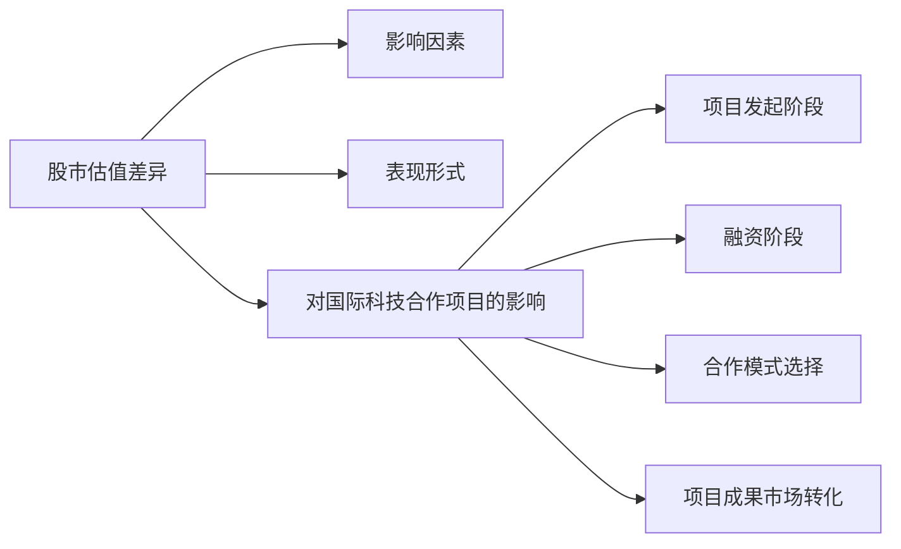

# 股市估值差异对国际科技合作项目的影响

> 关键词：股市估值差异、国际科技合作项目、估值影响机制、项目合作策略、金融市场联动

> 摘要：本文深入探讨了股市估值差异对国际科技合作项目的多方面影响。首先介绍了研究的背景、目的、预期读者、文档结构和相关术语。接着阐述了股市估值和国际科技合作项目的核心概念及其联系，并给出了相应的示意图和流程图。详细分析了影响国际科技合作项目的核心算法原理，用Python代码进行了说明，同时介绍了相关的数学模型和公式。通过实际项目案例，展示了股市估值差异在项目中的具体体现和作用。还探讨了该影响在不同场景下的实际应用，推荐了相关的学习资源、开发工具和论文著作。最后总结了未来发展趋势与挑战，解答了常见问题，并提供了扩展阅读和参考资料，旨在为相关领域的研究者和从业者提供全面且深入的见解。

## 1. 背景介绍 
### 1.1 目的和范围
本研究旨在全面剖析股市估值差异对国际科技合作项目的影响，范围涵盖了不同国家和地区金融市场中股市估值的特征，以及这些特征如何在国际科技合作项目的各个阶段产生作用，包括项目的发起、融资、合作模式选择和项目成果的市场转化等方面。通过研究，期望能够为国际科技合作项目的参与者提供决策依据，帮助他们更好地应对股市估值差异带来的机遇和挑战。

### 1.2 预期读者
本文的预期读者包括国际科技合作项目的管理者、投资者、科技企业的战略规划人员、金融分析师以及对金融市场与科技合作交叉领域感兴趣的研究人员。这些读者可以从本文中获取关于股市估值差异对国际科技合作项目影响的系统知识和实用建议。

### 1.3 文档结构概述
本文将首先介绍相关的核心概念，明确股市估值差异和国际科技合作项目的内涵及其联系。然后深入分析影响国际科技合作项目的核心算法原理和具体操作步骤，并给出相应的数学模型和公式。接着通过实际项目案例，详细展示股市估值差异在项目中的具体表现和作用。之后探讨该影响在不同场景下的实际应用，为读者提供实际操作的参考。再推荐相关的学习资源、开发工具和论文著作，帮助读者进一步深入研究。最后总结未来发展趋势与挑战，解答常见问题，并提供扩展阅读和参考资料。

### 1.4 术语表
#### 1.4.1 核心术语定义
- **股市估值**：是指对股票市场中上市公司价值的评估，通常通过市盈率（P/E）、市净率（P/B）等指标来衡量。股市估值反映了市场对上市公司未来盈利能力和资产质量的预期。
- **股市估值差异**：不同国家或地区的股市由于经济发展水平、市场成熟度、政策环境等因素的影响，导致同一行业或类似企业在不同股市中的估值存在差异。
- **国际科技合作项目**：是指不同国家或地区的科技企业、科研机构等主体之间，为了实现共同的科技目标，在技术研发、成果转化、市场拓展等方面进行的合作活动。

#### 1.4.2 相关概念解释
- **金融市场联动**：不同国家或地区的金融市场之间存在着相互影响和传导的关系。股市估值差异可能会通过金融市场联动机制，影响国际科技合作项目的融资成本和市场预期。
- **科技合作模式**：包括技术转让、联合研发、共建研发中心、战略联盟等多种形式。股市估值差异会影响合作双方对合作模式的选择和利益分配。

#### 1.4.3 缩略词列表
- **P/E**：市盈率（Price-to-Earnings Ratio），是指股票价格除以每股收益的比率，反映了市场对公司盈利的预期。
- **P/B**：市净率（Price-to-Book Ratio），是指股票价格除以每股净资产的比率，反映了市场对公司资产质量的评估。

## 2. 核心概念与联系 
### 核心概念原理
股市估值是金融市场对上市公司价值的一种综合评估，它受到多种因素的影响，包括公司的盈利能力、成长潜力、行业前景、宏观经济环境等。不同国家或地区的股市由于上述因素的差异，会导致同一行业或类似企业在不同股市中的估值不同。例如，新兴市场的科技企业可能由于其较高的成长潜力，在当地股市中获得较高的估值；而成熟市场的科技企业由于市场竞争激烈，估值可能相对较低。

国际科技合作项目则是基于科技资源的互补性和合作各方的共同利益而开展的。合作各方通过共享技术、资金、人才等资源，实现科技研发的协同效应和市场价值的最大化。在国际科技合作项目中，合作各方的股权结构、融资方式、利益分配等都与股市估值密切相关。

### 架构的文本示意图
```plaintext
股市估值差异
|
|-- 影响因素（经济发展、政策、行业竞争等）
|
|-- 表现形式（不同国家/地区股市的P/E、P/B差异）
|
|-- 对国际科技合作项目的影响
    |
    |-- 项目发起阶段（影响合作意愿和合作对象选择）
    |
    |-- 融资阶段（影响融资成本和融资渠道）
    |
    |-- 合作模式选择（影响股权结构和利益分配）
    |
    |-- 项目成果市场转化（影响市场预期和商业价值）
```

### Mermaid 流程图


## 3. 核心算法原理 & 具体操作步骤 
### 核心算法原理
在分析股市估值差异对国际科技合作项目的影响时，我们可以通过构建一个简单的模型来模拟合作双方的决策过程。假设合作双方分别来自不同股市，其企业的估值分别为 $V_1$ 和 $V_2$，合作项目的预期收益为 $R$。合作双方需要根据各自的估值和预期收益来确定股权比例和利益分配。

我们可以使用以下公式来计算合作双方的股权比例：
$$
\alpha_1 = \frac{V_1}{V_1 + V_2}
$$
$$
\alpha_2 = \frac{V_2}{V_1 + V_2}
$$
其中，$\alpha_1$ 和 $\alpha_2$ 分别为合作双方的股权比例。

### 具体操作步骤
以下是使用Python代码实现上述算法的具体步骤：

```python
# 定义合作双方的股市估值
valuation_1 = 1000  # 企业1的估值
valuation_2 = 1500  # 企业2的估值

# 计算股权比例
total_valuation = valuation_1 + valuation_2
alpha_1 = valuation_1 / total_valuation
alpha_2 = valuation_2 / total_valuation

# 输出结果
print(f"企业1的股权比例: {alpha_1 * 100:.2f}%")
print(f"企业2的股权比例: {alpha_2 * 100:.2f}%")
```

### 代码解释
1. 首先，我们定义了合作双方的股市估值 `valuation_1` 和 `valuation_2`。
2. 然后，计算双方估值的总和 `total_valuation`。
3. 接着，根据公式计算双方的股权比例 `alpha_1` 和 `alpha_2`。
4. 最后，使用 `print` 函数输出双方的股权比例，结果保留两位小数。

## 4. 数学模型和公式 & 详细讲解 & 举例说明 
### 数学模型
在国际科技合作项目中，我们可以构建一个基于博弈论的数学模型来分析股市估值差异对合作双方决策的影响。假设合作双方为企业 $A$ 和企业 $B$，它们的股市估值分别为 $V_A$ 和 $V_B$，合作项目的总收益为 $R$。合作双方需要协商确定股权比例 $\alpha_A$ 和 $\alpha_B$（$\alpha_A + \alpha_B = 1$），以分配项目收益。

双方的目标是最大化自己的收益，即：
$$
\max_{ \alpha_A } U_A = \alpha_A R - C_A
$$
$$
\max_{ \alpha_B } U_B = \alpha_B R - C_B
$$
其中，$U_A$ 和 $U_B$ 分别为企业 $A$ 和企业 $B$ 的收益，$C_A$ 和 $C_B$ 分别为双方参与合作项目的成本。

### 详细讲解
在这个模型中，合作双方的收益不仅取决于股权比例，还取决于参与项目的成本。股市估值差异会影响双方对股权比例的期望，因为高估值的企业可能认为自己应该获得更高的股权比例。同时，成本的差异也会影响双方的决策，成本较高的企业可能会要求更高的收益分配。

### 举例说明
假设企业 $A$ 的股市估值 $V_A = 2000$ 万元，企业 $B$ 的股市估值 $V_B = 3000$ 万元，合作项目的总收益 $R = 1000$ 万元，企业 $A$ 的参与成本 $C_A = 100$ 万元，企业 $B$ 的参与成本 $C_B = 150$ 万元。

根据前面的公式，我们可以计算出双方的股权比例：
$$
\alpha_A = \frac{V_A}{V_A + V_B} = \frac{2000}{2000 + 3000} = 0.4
$$
$$
\alpha_B = \frac{V_B}{V_A + V_B} = \frac{3000}{2000 + 3000} = 0.6
$$

双方的收益分别为：
$$
U_A = \alpha_A R - C_A = 0.4 \times 1000 - 100 = 300 \text{ 万元}
$$
$$
U_B = \alpha_B R - C_B = 0.6 \times 1000 - 150 = 450 \text{ 万元}
$$

从这个例子可以看出，股市估值差异会直接影响双方的股权比例和收益分配。高估值的企业在合作中可能会获得更高的股权比例和收益。

## 5. 项目实战：代码实际案例和详细解释说明 
### 5.1  开发环境搭建
为了实现一个模拟股市估值差异对国际科技合作项目影响的实际案例，我们可以使用Python进行开发。以下是开发环境的搭建步骤：

1. **安装Python**：从Python官方网站（https://www.python.org/downloads/）下载并安装Python 3.x版本。
2. **安装必要的库**：我们需要使用 `numpy` 和 `matplotlib` 库来进行数值计算和数据可视化。可以使用以下命令进行安装：
```sh
pip install numpy matplotlib
```

### 5.2  源代码详细实现和代码解读
以下是一个完整的Python代码示例，用于模拟不同股市估值差异下国际科技合作项目的股权分配和收益情况：

```python
import numpy as np
import matplotlib.pyplot as plt

# 定义合作项目的总收益
total_revenue = 1000

# 定义不同的股市估值差异场景
valuation_differences = np.linspace(0, 2000, 100)  # 估值差异范围从0到2000万元

# 初始化股权比例和收益列表
alpha_1_list = []
alpha_2_list = []
revenue_1_list = []
revenue_2_list = []

# 模拟不同估值差异下的股权分配和收益情况
for diff in valuation_differences:
    valuation_1 = 1000  # 企业1的固定估值
    valuation_2 = 1000 + diff  # 企业2的估值随差异变化
    
    # 计算股权比例
    total_valuation = valuation_1 + valuation_2
    alpha_1 = valuation_1 / total_valuation
    alpha_2 = valuation_2 / total_valuation
    
    # 计算收益
    revenue_1 = alpha_1 * total_revenue
    revenue_2 = alpha_2 * total_revenue
    
    # 保存结果
    alpha_1_list.append(alpha_1)
    alpha_2_list.append(alpha_2)
    revenue_1_list.append(revenue_1)
    revenue_2_list.append(revenue_2)

# 绘制股权比例和收益随估值差异变化的曲线
plt.figure(figsize=(12, 6))

plt.subplot(1, 2, 1)
plt.plot(valuation_differences, alpha_1_list, label='企业1股权比例')
plt.plot(valuation_differences, alpha_2_list, label='企业2股权比例')
plt.xlabel('股市估值差异 (万元)')
plt.ylabel('股权比例')
plt.title('股权比例随股市估值差异的变化')
plt.legend()

plt.subplot(1, 2, 2)
plt.plot(valuation_differences, revenue_1_list, label='企业1收益')
plt.plot(valuation_differences, revenue_2_list, label='企业2收益')
plt.xlabel('股市估值差异 (万元)')
plt.ylabel('收益 (万元)')
plt.title('收益随股市估值差异的变化')
plt.legend()

plt.tight_layout()
plt.show()
```

### 代码解读与分析
1. **导入必要的库**：导入 `numpy` 和 `matplotlib.pyplot` 库，分别用于数值计算和数据可视化。
2. **定义合作项目的总收益**：设置合作项目的总收益为 1000 万元。
3. **定义不同的股市估值差异场景**：使用 `np.linspace` 函数生成从 0 到 2000 万元的 100 个不同估值差异场景。
4. **初始化列表**：初始化用于保存股权比例和收益的列表。
5. **模拟不同估值差异下的股权分配和收益情况**：通过循环遍历不同的估值差异场景，计算企业 1 和企业 2 的股权比例和收益，并将结果保存到相应的列表中。
6. **绘制曲线**：使用 `matplotlib` 库绘制股权比例和收益随估值差异变化的曲线，直观展示股市估值差异对国际科技合作项目的影响。

从代码运行结果可以看出，随着股市估值差异的增大，高估值企业的股权比例和收益会逐渐增加，而低估值企业的股权比例和收益会逐渐减少。这表明股市估值差异对国际科技合作项目的股权分配和收益有着显著的影响。

## 6. 实际应用场景 
### 项目发起阶段
在国际科技合作项目的发起阶段，股市估值差异会影响合作双方的合作意愿和合作对象选择。高估值的企业可能更倾向于与低估值的企业合作，以获取更多的资源和市场份额。例如，一家美国的高估值科技企业可能会选择与一家中国的低估值科技企业合作，利用中国企业的低成本研发资源和庞大的市场潜力。

### 融资阶段
股市估值差异会影响国际科技合作项目的融资成本和融资渠道。在高估值股市上市的企业可以以较低的成本进行股权融资，从而为合作项目提供更多的资金支持。相反，在低估值股市上市的企业可能需要支付更高的融资成本，或者选择其他融资渠道，如债务融资。例如，一家在纳斯达克上市的科技企业可以通过增发股票轻松获得大量资金，而一家在国内中小板上市的企业可能需要通过银行贷款等方式融资，融资成本相对较高。

### 合作模式选择
股市估值差异会影响合作双方对合作模式的选择。高估值企业可能更倾向于采用股权合作的模式，以获取对合作项目的控制权和更多的利益分配。低估值企业则可能更倾向于采用技术转让、联合研发等非股权合作模式，以降低风险。例如，一家高估值的美国科技企业与一家低估值的印度科技企业合作时，美国企业可能会要求获得较高的股权比例，而印度企业可能更愿意以技术入股的方式参与合作。

### 项目成果市场转化
股市估值差异会影响国际科技合作项目成果的市场转化。高估值股市的投资者对科技项目的预期较高，愿意为具有创新性和高成长性的项目支付更高的价格。因此，在高估值股市上市的合作项目更容易获得市场认可和高估值。例如，一家中美合作的科技项目，如果在美国纳斯达克上市，可能会获得比在国内股市更高的估值和市场关注度。

## 7. 工具和资源推荐
### 7.1 学习资源推荐
#### 7.1.1 书籍推荐
- 《金融市场与金融机构》：这本书系统介绍了金融市场的基本原理和金融机构的运作模式，对于理解股市估值和国际金融市场有很大帮助。
- 《国际科技合作与创新》：深入探讨了国际科技合作的理论和实践，分析了科技合作项目中的各种问题和解决方案。
- 《博弈论与经济模型》：介绍了博弈论的基本概念和方法，对于理解合作双方在股市估值差异下的决策过程有重要意义。

#### 7.1.2 在线课程
- Coursera上的“金融市场”课程：由知名大学教授授课，全面讲解金融市场的知识和分析方法。
- edX上的“国际科技合作战略”课程：提供了国际科技合作的最新研究成果和实践经验。
- Udemy上的“Python金融数据分析”课程：教授如何使用Python进行金融数据的分析和处理，对于研究股市估值差异有实际应用价值。

#### 7.1.3 技术博客和网站
- 雪球网：是国内知名的财经社区，提供大量的股市分析和研究报告，对于了解股市估值和市场动态有很大帮助。
- Seeking Alpha：是美国的金融分析网站，有许多专业分析师对全球股市进行分析和评论。
- TechCrunch：专注于科技行业的新闻和分析，提供国际科技合作项目的最新动态和案例。

### 7.2 开发工具框架推荐
#### 7.2.1 IDE和编辑器
- PyCharm：是一款专业的Python集成开发环境，提供丰富的代码编辑、调试和分析功能，适合开发模拟股市估值差异的Python程序。
- Jupyter Notebook：是一个交互式的开发环境，适合进行数据分析和可视化，方便展示股市估值差异对国际科技合作项目影响的研究结果。

#### 7.2.2 调试和性能分析工具
- PDB：是Python自带的调试工具，可以帮助开发者定位代码中的问题和错误。
- cProfile：是Python的性能分析工具，可以分析代码的运行时间和资源消耗，优化代码性能。

#### 7.2.3 相关框架和库
- Pandas：是Python的数据分析库，提供高效的数据结构和数据处理方法，适合处理股市估值和合作项目的数据。
- Scikit-learn：是Python的机器学习库，可以用于构建预测模型，分析股市估值差异对国际科技合作项目的影响。

### 7.3 相关论文著作推荐
#### 7.3.1 经典论文
- "The Impact of Stock Market Valuation on Corporate Investment Decisions"：研究了股市估值对企业投资决策的影响，为理解股市估值差异对国际科技合作项目的影响提供了理论基础。
- "International Technology Cooperation: A Strategic Perspective"：从战略角度分析了国际科技合作的模式和影响因素，对于研究股市估值差异在国际科技合作中的作用有重要参考价值。

#### 7.3.2 最新研究成果
- 近年来，一些学者开始关注股市估值差异对跨国并购和国际科技合作的影响，相关研究成果发表在《Journal of Financial Economics》《Strategic Management Journal》等知名学术期刊上。

#### 7.3.3 应用案例分析
- 一些咨询公司和研究机构会发布关于国际科技合作项目的案例分析报告，分析股市估值差异在实际项目中的具体影响和应对策略。例如，麦肯锡公司的相关报告可以为从业者提供实际操作的参考。

## 8. 总结：未来发展趋势与挑战
### 未来发展趋势
- **金融市场全球化加深**：随着全球经济一体化的推进，不同国家和地区的金融市场之间的联系将更加紧密，股市估值差异可能会进一步缩小，但在短期内仍将存在。
- **科技合作模式创新**：为了应对股市估值差异带来的挑战，国际科技合作项目可能会采用更加灵活多样的合作模式，如混合所有制合作、知识产权共享等。
- **数据驱动的决策**：随着大数据和人工智能技术的发展，国际科技合作项目的参与者将更加依赖数据来分析股市估值差异的影响，做出更加科学合理的决策。

### 挑战
- **政策不确定性**：不同国家和地区的政策环境变化可能会影响股市估值和国际科技合作项目的开展。例如，贸易保护主义政策可能会增加国际科技合作的成本和风险。
- **文化差异**：国际科技合作项目涉及不同国家和地区的企业和人员，文化差异可能会导致沟通障碍和合作冲突，影响项目的顺利进行。
- **技术变革加速**：科技行业的技术变革日新月异，国际科技合作项目需要不断适应新技术的发展，否则可能会面临被市场淘汰的风险。

## 9. 附录：常见问题与解答
### 问题1：股市估值差异是否一定会对国际科技合作项目产生负面影响？
解答：不一定。股市估值差异既可能带来挑战，也可能带来机遇。高估值企业可以利用其估值优势获取更多资源和市场份额，低估值企业可以通过与高估值企业合作提升自身的技术水平和市场知名度。关键在于合作双方如何充分利用估值差异，实现优势互补。

### 问题2：如何衡量股市估值差异对国际科技合作项目的影响程度？
解答：可以通过构建数学模型和指标体系来衡量。例如，可以计算合作双方的股权比例变化、融资成本差异、项目收益分配差异等指标，分析这些指标随股市估值差异的变化情况，从而评估影响程度。

### 问题3：在国际科技合作项目中，如何应对股市估值差异带来的风险？
解答：可以采取以下措施：一是进行充分的市场调研和风险评估，了解不同国家和地区股市的估值情况和市场动态；二是选择合适的合作模式和合作伙伴，根据双方的估值情况和优势进行合理的股权分配和利益分配；三是建立风险预警机制，及时发现和应对股市估值差异带来的风险。

## 10. 扩展阅读 & 参考资料
### 扩展阅读
- 《全球科技竞争与合作》：深入探讨了全球科技竞争的格局和国际科技合作的趋势，为研究股市估值差异对国际科技合作项目的影响提供了更广阔的视野。
- 《金融科技时代的国际合作》：介绍了金融科技在国际合作中的应用和发展，对于理解金融市场与科技合作的融合有重要意义。

### 参考资料
- [1] Fama, E. F., & French, K. R. (1992). The cross-section of expected stock returns. The Journal of Finance, 47(2), 427-465.
- [2] Teece, D. J. (1986). Profiting from technological innovation: Implications for integration, collaboration, licensing and public policy. Research policy, 15(6), 285-305.
- [3] OECD. (2018). International co - operation in science, technology and innovation. OECD Publishing.