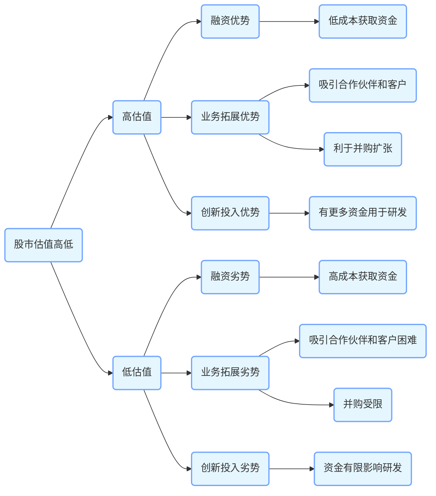

# 股市估值高低对企业开源策略的影响

> 关键词：股市估值、企业开源策略、市场预期、融资成本、业务拓展

> 摘要：本文深入探讨了股市估值高低对企业开源策略的多方面影响。通过分析股市估值的核心概念、相关算法原理以及数学模型，结合实际项目案例，阐述了不同估值水平下企业在融资、业务拓展、创新投入等开源策略方面的变化。同时，介绍了在研究和实践中可利用的工具和资源，最后总结了未来发展趋势与挑战，并对常见问题进行解答，为企业管理者和投资者提供了全面而深入的参考。

## 1. 背景介绍 
### 1.1 目的和范围
本研究旨在全面分析股市估值高低对企业开源策略的具体影响。范围涵盖了不同行业、不同规模的企业，从理论层面探讨股市估值与企业开源策略之间的内在联系，通过实际案例分析验证理论，并为企业制定合理的开源策略提供参考，同时为投资者理解企业行为和市场动态提供依据。

### 1.2 预期读者
本文预期读者包括企业管理者、投资者、金融分析师、学术研究人员以及对金融市场和企业管理感兴趣的人士。企业管理者可以从中获取关于如何根据股市估值调整开源策略的建议；投资者可以更好地理解企业的行为动机，从而做出更明智的投资决策；金融分析师可以将本文的分析方法和结论应用于实际的研究工作中；学术研究人员可以在此基础上开展进一步的理论研究；而对金融市场和企业管理感兴趣的人士可以通过本文了解相关领域的基本原理和实际应用。

### 1.3 文档结构概述
本文首先介绍了股市估值和企业开源策略的核心概念以及它们之间的联系，通过文本示意图和 Mermaid 流程图进行直观展示。接着详细阐述了与股市估值和开源策略相关的核心算法原理和具体操作步骤，并用 Python 源代码进行说明。然后介绍了相关的数学模型和公式，并通过举例进行详细讲解。在项目实战部分，给出了代码实际案例和详细的解释说明，包括开发环境搭建、源代码实现和代码解读。之后分析了股市估值高低对企业开源策略的实际应用场景。推荐了相关的学习资源、开发工具框架和论文著作。最后总结了未来发展趋势与挑战，解答了常见问题，并提供了扩展阅读和参考资料。

### 1.4 术语表
#### 1.4.1 核心术语定义
- **股市估值**：指对上市公司的价值进行评估，通过一定的方法和指标确定其股票的合理价格范围。常见的估值方法包括市盈率法、市净率法、现金流折现法等。
- **企业开源策略**：企业为了增加收入、拓展业务、提高市场竞争力而采取的一系列策略和措施，包括融资、业务拓展、创新投入、市场推广等方面。
- **市盈率（P/E）**：指股票价格除以每股收益的比率，反映了投资者为获取公司每一元盈利所愿意支付的价格。
- **市净率（P/B）**：指股票价格与每股净资产的比率，用于衡量股票的估值水平和投资价值。

#### 1.4.2 相关概念解释
- **市场预期**：投资者对企业未来发展前景、盈利水平等方面的预期，会影响股市估值。如果市场对企业的未来发展持乐观态度，股市估值往往会较高；反之则较低。
- **融资成本**：企业为了获取资金而支付的代价，包括利息、股息等。股市估值高低会影响企业的融资成本，高估值企业在融资时往往可以以较低的成本获得资金。
- **业务拓展**：企业通过扩大市场份额、进入新的市场领域、推出新产品或服务等方式来增加收入和利润。股市估值高低会影响企业的业务拓展策略，高估值企业可能更有动力和资源进行业务拓展。

#### 1.4.3 缩略词列表
- **P/E**：市盈率（Price-to-Earnings Ratio）
- **P/B**：市净率（Price-to-Book Ratio）
- **DCF**：现金流折现法（Discounted Cash Flow）

## 2. 核心概念与联系 
### 核心概念原理
#### 股市估值原理
股市估值是基于对企业未来盈利能力、资产价值、市场竞争力等因素的综合评估。常见的估值方法有以下几种：
- **市盈率法**：市盈率是最常用的估值指标之一，其计算公式为 $P/E = \frac{股价}{每股收益}$。该方法假设企业的盈利水平在未来保持相对稳定，通过与同行业其他企业的市盈率进行比较，来判断股票的估值高低。例如，如果某企业的市盈率高于同行业平均水平，可能意味着市场对该企业的未来发展前景更为乐观，或者该股票被高估。
- **市净率法**：市净率反映了股票价格与每股净资产的关系，计算公式为 $P/B = \frac{股价}{每股净资产}$。市净率越低，说明股票的估值相对较低，可能存在投资价值。但不同行业的市净率水平差异较大，需要结合行业特点进行分析。
- **现金流折现法**：该方法基于企业未来的现金流预测，将未来的现金流按照一定的折现率折现到当前时刻，得到企业的内在价值。现金流折现法考虑了货币的时间价值和企业未来的发展潜力，但需要对企业的未来现金流和折现率进行准确预测，难度较大。

#### 企业开源策略原理
企业开源策略的核心目标是增加收入和利润，提高企业的市场竞争力。常见的开源策略包括：
- **融资策略**：企业通过发行股票、债券、银行贷款等方式获取资金，用于业务拓展、研发投入等。不同的融资方式有不同的成本和风险，企业需要根据自身的情况选择合适的融资方式。
- **业务拓展策略**：企业通过扩大市场份额、进入新的市场领域、推出新产品或服务等方式来增加收入。业务拓展需要考虑市场需求、竞争状况、自身资源等因素。
- **创新投入策略**：企业通过加大研发投入，开发新技术、新产品或新服务，提高企业的核心竞争力。创新投入需要长期的资金和人力支持，并且存在一定的风险。

### 核心概念联系
股市估值高低与企业开源策略之间存在着密切的联系。具体如下：
- **高估值对企业开源策略的影响**
    - **融资方面**：高估值企业在股票市场上更容易以较高的价格发行股票，从而获得更多的资金。这使得企业在融资时具有更大的优势，可以降低融资成本，提高融资效率。例如，一家高估值的科技企业可以通过增发股票获得大量资金，用于研发新技术和拓展业务。
    - **业务拓展方面**：高估值意味着市场对企业的未来发展前景较为乐观，企业在市场上具有较高的声誉和品牌价值。这有助于企业吸引更多的合作伙伴和客户，拓展业务领域。同时，高估值企业也有更多的资金用于并购其他企业，实现快速扩张。
    - **创新投入方面**：高估值企业通常有更多的资金用于研发投入，因为投资者对企业的创新能力和未来发展潜力有较高的期望。企业可以加大在新技术、新产品研发方面的投入，提高自身的核心竞争力。
- **低估值对企业开源策略的影响**
    - **融资方面**：低估值企业在股票市场上发行股票时可能会面临困难，因为投资者对企业的信心不足。为了吸引投资者，企业可能需要降低发行价格，从而增加融资成本。此外，低估值企业在向银行贷款时也可能会面临更高的利率和更严格的贷款条件。
    - **业务拓展方面**：低估值企业在市场上的声誉和品牌价值相对较低，吸引合作伙伴和客户的难度较大。企业可能需要更加努力地进行市场推广和营销活动，以提高市场份额。同时，低估值企业在并购其他企业时也可能会受到限制，因为其资金实力相对较弱。
    - **创新投入方面**：低估值企业由于资金有限，可能会减少在研发投入方面的资金，从而影响企业的创新能力和未来发展潜力。

### 文本示意图
```plaintext
股市估值高低
├── 高估值
│   ├── 融资优势
│   │   └── 低成本获取资金
│   ├── 业务拓展优势
│   │   ├── 吸引合作伙伴和客户
│   │   └── 利于并购扩张
│   └── 创新投入优势
│       └── 有更多资金用于研发
└── 低估值
    ├── 融资劣势
    │   └── 高成本获取资金
    ├── 业务拓展劣势
    │   ├── 吸引合作伙伴和客户困难
    │   └── 并购受限
    └── 创新投入劣势
        └── 资金有限影响研发
```

### Mermaid 流程图


## 3. 核心算法原理 & 具体操作步骤 
### 股市估值算法原理
#### 市盈率法
市盈率法的核心思想是通过比较企业的市盈率与同行业平均市盈率或历史市盈率，来判断股票的估值高低。具体步骤如下：
```python
# 计算市盈率
def calculate_pe(stock_price, earnings_per_share):
    """
    计算市盈率
    :param stock_price: 股票价格
    :param earnings_per_share: 每股收益
    :return: 市盈率
    """
    if earnings_per_share == 0:
        return None
    return stock_price / earnings_per_share

# 示例数据
stock_price = 50
earnings_per_share = 5
pe = calculate_pe(stock_price, earnings_per_share)
print(f"市盈率: {pe}")

# 假设同行业平均市盈率为 10
industry_avg_pe = 10
if pe > industry_avg_pe:
    print("该股票可能被高估")
elif pe < industry_avg_pe:
    print("该股票可能被低估")
else:
    print("该股票估值合理")
```
#### 市净率法
市净率法通过比较企业的市净率与同行业平均市净率，来评估股票的估值。具体代码如下：
```python
# 计算市净率
def calculate_pb(stock_price, book_value_per_share):
    """
    计算市净率
    :param stock_price: 股票价格
    :param book_value_per_share: 每股净资产
    :return: 市净率
    """
    if book_value_per_share == 0:
        return None
    return stock_price / book_value_per_share

# 示例数据
stock_price = 50
book_value_per_share = 10
pb = calculate_pb(stock_price, book_value_per_share)
print(f"市净率: {pb}")

# 假设同行业平均市净率为 3
industry_avg_pb = 3
if pb > industry_avg_pb:
    print("该股票可能被高估")
elif pb < industry_avg_pb:
    print("该股票可能被低估")
else:
    print("该股票估值合理")
```
#### 现金流折现法
现金流折现法的核心是预测企业未来的现金流，并将其折现到当前时刻。以下是一个简化的现金流折现法示例：
```python
import numpy as np

# 计算现金流折现价值
def dcf_valuation(cash_flows, discount_rate):
    """
    计算现金流折现价值
    :param cash_flows: 未来各期现金流列表
    :param discount_rate: 折现率
    :return: 现金流折现价值
    """
    n = len(cash_flows)
    present_values = []
    for i in range(n):
        present_value = cash_flows[i] / ((1 + discount_rate) ** (i + 1))
        present_values.append(present_value)
    return np.sum(present_values)

# 示例数据
cash_flows = [100, 120, 150, 180, 200]
discount_rate = 0.1
dcf_value = dcf_valuation(cash_flows, discount_rate)
print(f"现金流折现价值: {dcf_value}")
```

### 企业开源策略相关算法
#### 融资成本计算
融资成本是企业在融资过程中需要考虑的重要因素。以下是一个简单的债务融资成本计算示例：
```python
# 计算债务融资成本
def calculate_debt_cost(interest_rate, tax_rate):
    """
    计算债务融资成本
    :param interest_rate: 债务利率
    :param tax_rate: 企业所得税税率
    :return: 债务融资成本
    """
    return interest_rate * (1 - tax_rate)

# 示例数据
interest_rate = 0.05
tax_rate = 0.25
debt_cost = calculate_debt_cost(interest_rate, tax_rate)
print(f"债务融资成本: {debt_cost}")
```
#### 业务拓展收益计算
业务拓展收益可以通过预测新业务的收入和成本来计算。以下是一个简单的示例：
```python
# 计算业务拓展收益
def calculate_expansion_profit(revenue, cost):
    """
    计算业务拓展收益
    :param revenue: 新业务收入
    :param cost: 新业务成本
    :return: 业务拓展收益
    """
    return revenue - cost

# 示例数据
revenue = 1000
cost = 800
expansion_profit = calculate_expansion_profit(revenue, cost)
print(f"业务拓展收益: {expansion_profit}")
```

## 4. 数学模型和公式 & 详细讲解 & 举例说明 
### 股市估值数学模型
#### 市盈率模型
市盈率模型的基本公式为 $P = E \times P/E$，其中 $P$ 为股票价格，$E$ 为每股收益，$P/E$ 为市盈率。该模型假设股票价格与每股收益成正比，市盈率反映了市场对企业盈利的预期。

例如，某企业每股收益为 2 元，同行业平均市盈率为 15，则该企业股票的合理价格为 $P = 2 \times 15 = 30$ 元。如果该企业股票当前价格为 40 元，则可能被高估；如果当前价格为 20 元，则可能被低估。

#### 市净率模型
市净率模型的基本公式为 $P = B \times P/B$，其中 $P$ 为股票价格，$B$ 为每股净资产，$P/B$ 为市净率。市净率模型适用于资产价值对企业价值影响较大的行业，如金融、房地产等。

例如，某企业每股净资产为 10 元，同行业平均市净率为 2，则该企业股票的合理价格为 $P = 10 \times 2 = 20$ 元。如果该企业股票当前价格为 25 元，则可能被高估；如果当前价格为 15 元，则可能被低估。

#### 现金流折现模型
现金流折现模型的基本公式为 $V = \sum_{t=1}^{n} \frac{CF_t}{(1 + r)^t}$，其中 $V$ 为企业的内在价值，$CF_t$ 为第 $t$ 期的现金流，$r$ 为折现率，$n$ 为预测期数。

例如，某企业未来 5 年的现金流分别为 100 万元、120 万元、150 万元、180 万元、200 万元，折现率为 10%，则该企业的内在价值为：
$$
\begin{align*}
V &= \frac{100}{(1 + 0.1)^1} + \frac{120}{(1 + 0.1)^2} + \frac{150}{(1 + 0.1)^3} + \frac{180}{(1 + 0.1)^4} + \frac{200}{(1 + 0.1)^5}\\
&= \frac{100}{1.1} + \frac{120}{1.21} + \frac{150}{1.331} + \frac{180}{1.4641} + \frac{200}{1.61051}\\
&\approx 90.91 + 99.17 + 112.69 + 122.94 + 124.18\\
&= 549.89 \text{（万元）}
\end{align*}
$$

### 企业开源策略数学模型
#### 融资成本模型
债务融资成本的计算公式为 $K_d = r_d(1 - T)$，其中 $K_d$ 为债务融资成本，$r_d$ 为债务利率，$T$ 为企业所得税税率。

例如，某企业的债务利率为 5%，企业所得税税率为 25%，则该企业的债务融资成本为 $K_d = 0.05 \times (1 - 0.25) = 0.0375$，即 3.75%。

#### 业务拓展收益模型
业务拓展收益的计算公式为 $\pi = R - C$，其中 $\pi$ 为业务拓展收益，$R$ 为新业务收入，$C$ 为新业务成本。

例如，某企业开展一项新业务，预计收入为 1000 万元，成本为 800 万元，则该业务的拓展收益为 $\pi = 1000 - 800 = 200$ 万元。

## 5. 项目实战：代码实际案例和详细解释说明 
### 5.1  开发环境搭建
本项目实战使用 Python 语言进行开发，需要安装以下库：
- `numpy`：用于数值计算。
- `pandas`：用于数据处理和分析。

可以使用以下命令进行安装：
```sh
pip install numpy pandas
```

### 5.2  源代码详细实现和代码解读
以下是一个综合案例，结合股市估值和企业开源策略进行分析：
```python
import numpy as np
import pandas as pd

# 计算市盈率
def calculate_pe(stock_price, earnings_per_share):
    if earnings_per_share == 0:
        return None
    return stock_price / earnings_per_share

# 计算市净率
def calculate_pb(stock_price, book_value_per_share):
    if book_value_per_share == 0:
        return None
    return stock_price / book_value_per_share

# 计算现金流折现价值
def dcf_valuation(cash_flows, discount_rate):
    n = len(cash_flows)
    present_values = []
    for i in range(n):
        present_value = cash_flows[i] / ((1 + discount_rate) ** (i + 1))
        present_values.append(present_value)
    return np.sum(present_values)

# 计算债务融资成本
def calculate_debt_cost(interest_rate, tax_rate):
    return interest_rate * (1 - tax_rate)

# 计算业务拓展收益
def calculate_expansion_profit(revenue, cost):
    return revenue - cost

# 示例数据
data = {
    "股票价格": [50, 60, 40],
    "每股收益": [5, 6, 4],
    "每股净资产": [10, 12, 8],
    "未来现金流": [
        [100, 120, 150, 180, 200],
        [110, 130, 160, 190, 210],
        [90, 110, 140, 170, 190]
    ],
    "债务利率": [0.05, 0.06, 0.04],
    "企业所得税税率": [0.25, 0.25, 0.25],
    "新业务收入": [1000, 1200, 800],
    "新业务成本": [800, 900, 600]
}

df = pd.DataFrame(data)

# 计算市盈率
df["市盈率"] = df.apply(lambda row: calculate_pe(row["股票价格"], row["每股收益"]), axis=1)

# 计算市净率
df["市净率"] = df.apply(lambda row: calculate_pb(row["股票价格"], row["每股净资产"]), axis=1)

# 计算现金流折现价值
df["现金流折现价值"] = df.apply(lambda row: dcf_valuation(row["未来现金流"], 0.1), axis=1)

# 计算债务融资成本
df["债务融资成本"] = df.apply(lambda row: calculate_debt_cost(row["债务利率"], row["企业所得税税率"]), axis=1)

# 计算业务拓展收益
df["业务拓展收益"] = df.apply(lambda row: calculate_expansion_profit(row["新业务收入"], row["新业务成本"]), axis=1)

print(df)
```
### 5.3  代码解读与分析
- **数据定义**：首先定义了一个包含股票价格、每股收益、每股净资产、未来现金流、债务利率、企业所得税税率、新业务收入和新业务成本的字典 `data`，并将其转换为 Pandas 的 DataFrame `df`。
- **指标计算**：使用 `apply` 方法对 DataFrame 的每一行应用相应的计算函数，计算市盈率、市净率、现金流折现价值、债务融资成本和业务拓展收益，并将结果添加到 DataFrame 中。
- **结果输出**：最后打印出包含所有计算结果的 DataFrame，方便分析和比较不同企业的股市估值和开源策略相关指标。

通过这个案例，我们可以直观地看到不同企业的股市估值和开源策略指标，从而分析股市估值高低对企业开源策略的影响。例如，高市盈率和市净率的企业可能在融资和业务拓展方面具有优势，而低市盈率和市净率的企业可能需要更加谨慎地制定开源策略。

## 6. 实际应用场景 
### 高估值企业的开源策略应用
#### 融资驱动的业务拓展
高估值企业在股票市场上具有较高的吸引力，可以通过增发股票等方式轻松获得大量资金。以特斯拉为例，其在新能源汽车领域具有较高的市场估值。特斯拉利用高估值带来的融资优势，不断加大在电动汽车研发、生产和销售网络建设方面的投入。通过增发股票获得的资金，特斯拉在美国、中国等地建设了多个超级工厂，扩大了生产规模，提高了市场份额。同时，特斯拉还将资金投入到自动驾驶技术研发中，提升了产品的竞争力。

#### 并购扩张
高估值企业可以利用自身的高市值进行并购活动，实现快速扩张。例如，谷歌在互联网搜索领域具有极高的估值。谷歌通过并购多家科技公司，如 YouTube、Android 等，迅速扩大了业务版图。YouTube 为谷歌带来了巨大的视频流量和广告收入，Android 则使谷歌在移动操作系统市场占据了主导地位。通过并购，谷歌不仅增加了收入来源，还提升了自身的技术实力和市场竞争力。

#### 创新投入
高估值企业通常会将大量资金投入到创新研发中，以保持领先地位。苹果公司以其高估值和强大的创新能力著称。苹果每年都会投入巨额资金用于新产品研发，如 iPhone、iPad、Mac 等系列产品的不断更新换代。苹果的创新投入不仅带来了产品的升级和用户体验的提升，还吸引了大量的消费者，进一步巩固了其在全球智能手机和电脑市场的领先地位。

### 低估值企业的开源策略应用
#### 优化融资渠道
低估值企业在融资方面面临一定的困难，需要优化融资渠道，降低融资成本。一些传统制造业企业由于行业竞争激烈、市场增长缓慢等原因，股市估值较低。这些企业可以通过与银行建立长期稳定的合作关系，争取更优惠的贷款利率。同时，企业还可以考虑发行可转换债券等创新融资工具，吸引投资者。例如，某钢铁企业通过发行可转换债券，在获得资金的同时，降低了融资成本，并且在债券转换为股票后，还可以优化股权结构。

#### 聚焦核心业务
低估值企业由于资金有限，需要聚焦核心业务，提高核心业务的盈利能力。一些小型零售企业在面对电商冲击和大型连锁超市竞争的情况下，股市估值较低。这些企业可以通过优化商品结构、提高服务质量等方式，聚焦核心商品和核心客户群体，提高核心业务的市场份额和利润率。例如，某小型便利店企业通过分析消费者需求，减少了非核心商品的库存，增加了热门商品的供应，同时加强了员工培训，提高了服务质量，从而提高了核心业务的盈利能力。

#### 寻求战略合作
低估值企业可以通过寻求战略合作，借助合作伙伴的资源和优势，实现业务拓展。例如，一些初创科技企业由于市场知名度较低、资金不足等原因，股市估值较低。这些企业可以与大型企业建立战略合作关系，利用大型企业的品牌、渠道和资金优势，推广自己的产品和服务。某初创人工智能企业与一家大型金融机构合作，将其人工智能技术应用于金融风险评估领域，借助金融机构的客户资源和数据优势，快速推广了自己的产品，实现了业务增长。

## 7. 工具和资源推荐
### 7.1 学习资源推荐
#### 7.1.1 书籍推荐
- 《证券分析》（Security Analysis）：由本杰明·格雷厄姆（Benjamin Graham）和戴维·多德（David Dodd）所著，是价值投资领域的经典著作。该书详细介绍了股票估值的方法和原则，对理解股市估值具有重要的指导意义。
- 《聪明的投资者》（The Intelligent Investor）：同样是本杰明·格雷厄姆的著作，被誉为“投资者的圣经”。书中强调了投资者的心态和投资策略的重要性，对企业开源策略的制定也有一定的启示作用。
- 《财务报表分析与证券定价》（Financial Statement Analysis and Security Valuation）：作者是斯蒂芬·佩因曼（Stephen Penman），该书从财务报表分析的角度出发，介绍了如何通过分析企业的财务报表来评估企业的价值和投资价值。

#### 7.1.2 在线课程
- Coursera 上的“Financial Markets”：由耶鲁大学的罗伯特·席勒（Robert Shiller）教授授课，课程涵盖了金融市场的基本原理、股票估值、债券市场等内容，对理解股市估值和企业融资有很大帮助。
- edX 上的“Corporate Finance”：由麻省理工学院的教授授课，课程主要介绍了企业财务管理的基本理论和方法，包括资本预算、融资决策、股利政策等，对企业开源策略的制定有重要的参考价值。
- 中国大学 MOOC 上的“公司金融”：由国内知名高校的教授授课，课程结合中国的实际情况，介绍了公司金融的基本概念、理论和方法，适合国内学习者。

#### 7.1.3 技术博客和网站
- Seeking Alpha：是一个知名的金融投资博客网站，提供了大量的股票分析、市场评论和投资策略等内容。许多专业的金融分析师和投资者会在该网站上分享自己的观点和研究成果。
- Bloomberg：是全球著名的金融信息服务提供商，其网站提供了实时的金融市场数据、新闻资讯、分析报告等内容。通过 Bloomberg 可以及时了解全球金融市场的动态和企业的相关信息。
- 东方财富网：是国内知名的金融财经网站，提供了丰富的股票行情、财经新闻、研究报告等内容。同时，东方财富网还提供了一些金融分析工具，如财务报表分析、估值分析等，方便投资者进行研究和分析。

### 7.2 开发工具框架推荐
#### 7.2.1 IDE和编辑器
- PyCharm：是一款专门为 Python 开发设计的集成开发环境（IDE），具有强大的代码编辑、调试、自动补全、代码分析等功能。对于使用 Python 进行股市估值和企业开源策略分析的开发者来说，PyCharm 是一个不错的选择。
- Jupyter Notebook：是一个基于网页的交互式开发环境，支持多种编程语言，如 Python、R 等。Jupyter Notebook 可以将代码、文本、图表等内容集成在一个文档中，方便进行数据分析和可视化展示。在进行股市估值和企业开源策略的案例分析时，Jupyter Notebook 可以帮助开发者更好地展示和分享分析结果。
- Visual Studio Code：是一款轻量级的代码编辑器，支持多种编程语言和插件扩展。Visual Studio Code 具有丰富的插件库，可以安装各种与 Python 开发相关的插件，如代码格式化、调试、代码检查等插件，提高开发效率。

#### 7.2.2 调试和性能分析工具
- PDB：是 Python 内置的调试工具，可以帮助开发者在代码中设置断点、单步执行代码、查看变量值等。通过 PDB 可以快速定位代码中的问题和错误。
- cProfile：是 Python 标准库中的性能分析工具，可以分析代码的运行时间和函数调用次数。通过 cProfile 可以找出代码中的性能瓶颈，进行优化。
- Py-Spy：是一个轻量级的 Python 性能分析工具，可以在不修改代码的情况下对 Python 程序进行性能分析。Py-Spy 可以实时显示程序的 CPU 使用率、函数调用栈等信息，帮助开发者快速定位性能问题。

#### 7.2.3 相关框架和库
- Pandas：是一个强大的数据分析库，提供了丰富的数据结构和数据处理功能。在进行股市估值和企业开源策略分析时，Pandas 可以帮助开发者处理和分析大量的金融数据，如股票价格、财务报表等。
- NumPy：是 Python 科学计算的基础库，提供了高效的多维数组对象和数学函数。在进行现金流折现计算、统计分析等方面，NumPy 可以提高计算效率。
- Matplotlib：是一个常用的绘图库，用于数据可视化。在进行股市估值和企业开源策略分析时，Matplotlib 可以帮助开发者将分析结果以图表的形式展示出来，更直观地呈现数据和分析结果。

### 7.3 相关论文著作推荐
#### 7.3.1 经典论文
- “The Capital Asset Pricing Model: Theory and Evidence”：由 Eugene F. Fama 和 Kenneth R. French 所著，该论文对资本资产定价模型进行了深入的研究和分析，是金融领域的经典论文之一。资本资产定价模型在股市估值和投资决策中具有重要的应用。
- “Agency Costs of Free Cash Flow, Corporate Finance, and Takeovers”：由 Michael C. Jensen 所著，该论文提出了自由现金流的代理成本理论，对企业的融资决策和股利政策有重要的启示作用。
- “Efficient Capital Markets: A Review of Theory and Empirical Work”：由 Eugene F. Fama 所著，该论文对有效市场假说进行了系统的阐述和总结，是金融市场效率研究的经典论文。

#### 7.3.2 最新研究成果
- 可以关注《Journal of Financial Economics》《Review of Financial Studies》《Journal of Finance》等国际顶级金融学术期刊，这些期刊会发表关于股市估值、企业融资、公司治理等方面的最新研究成果。
- 国内的《金融研究》《经济研究》等学术期刊也会发表一些关于中国金融市场和企业财务管理的研究论文，可以关注这些期刊获取最新的研究动态。

#### 7.3.3 应用案例分析
- 一些知名的咨询公司和研究机构会发布关于企业开源策略和股市估值的应用案例分析报告，如麦肯锡、波士顿咨询集团等。这些报告通常会结合实际案例，分析企业在不同股市估值水平下的开源策略选择和实施效果。
- 企业自身的年报和财务报告也是很好的应用案例分析资源。通过分析企业的年报和财务报告，可以了解企业的发展战略、融资决策、业务拓展等方面的情况，以及股市估值对企业开源策略的影响。

## 8. 总结：未来发展趋势与挑战
### 未来发展趋势
#### 数字化转型加速
随着信息技术的快速发展，企业的数字化转型将加速。高估值的科技企业将继续引领数字化转型的潮流，通过加大在人工智能、大数据、云计算等领域的研发投入，提升企业的智能化水平和运营效率。低估值企业也将积极寻求数字化转型的机会，通过与科技企业合作或自主研发，实现业务的数字化升级，提高企业的竞争力。

#### 绿色金融和可持续发展
在全球气候变化和可持续发展的背景下，绿色金融和可持续发展将成为企业开源策略的重要方向。高估值的环保企业和新能源企业将获得更多的融资支持和市场认可，进一步扩大业务规模。低估值企业也将面临越来越大的环保和可持续发展压力，需要在开源策略中考虑环保因素，推动企业的可持续发展。

#### 国际化合作加强
随着经济全球化的深入发展，企业的国际化合作将加强。高估值企业将利用自身的技术和资金优势，开展跨国并购和合作，拓展国际市场。低估值企业也将通过与国际企业的合作，引进先进的技术和管理经验，提升自身的竞争力。

### 挑战
#### 市场不确定性增加
全球经济形势的不确定性、政策变化、地缘政治风险等因素将增加市场的不确定性。高估值企业可能面临估值回调的风险，低估值企业可能面临市场竞争加剧和融资困难的挑战。企业需要加强风险管理，提高应对市场不确定性的能力。

#### 技术创新压力增大
科技的快速发展使得技术创新的速度加快，企业需要不断投入大量的资金和人力进行技术研发，以保持竞争优势。高估值企业需要持续创新，以维持高估值；低估值企业则需要通过技术创新实现逆袭。技术创新的高成本和高风险对企业的开源策略提出了更高的要求。

#### 监管加强
随着金融市场的发展和企业行为的日益复杂，监管部门将加强对企业的监管。企业在开源策略的制定和实施过程中，需要遵守相关的法律法规和监管要求，否则可能面临处罚和声誉损失。

## 9. 附录：常见问题与解答
### 问题 1：股市估值高就一定意味着企业的开源策略会更成功吗？
解答：不一定。股市估值高只是表明市场对企业的未来发展前景较为乐观，但并不意味着企业的开源策略一定会成功。企业的开源策略是否成功还取决于多种因素，如企业的管理能力、市场竞争状况、行业发展趋势等。高估值企业如果不能有效地利用融资资金进行业务拓展和创新投入，也可能会面临失败的风险。

### 问题 2：低估值企业是否就没有开源的机会了？
解答：不是的。低估值企业虽然在融资和市场竞争方面面临一定的困难，但仍然有开源的机会。低估值企业可以通过优化融资渠道、聚焦核心业务、寻求战略合作等方式，实现业务增长和开源。例如，一些低估值的传统企业可以通过数字化转型和创新，提升自身的竞争力，从而获得更多的开源机会。

### 问题 3：如何准确地评估股市估值？
解答：准确评估股市估值是一个复杂的过程，需要综合考虑多种因素。常见的估值方法包括市盈率法、市净率法、现金流折现法等，但这些方法都有一定的局限性。在评估股市估值时，还需要考虑企业的行业特点、市场前景、竞争状况、财务状况等因素。同时，还可以参考同行业其他企业的估值水平和市场平均估值水平，进行综合分析和判断。

### 问题 4：企业在制定开源策略时，应该如何考虑股市估值的因素？
解答：企业在制定开源策略时，应该充分考虑股市估值的因素。高估值企业可以利用融资优势，加大在业务拓展和创新投入方面的力度；低估值企业则需要更加谨慎地制定开源策略，优化融资渠道，聚焦核心业务。同时，企业还需要关注股市估值的变化趋势，及时调整开源策略。例如，如果股市估值下降，企业可能需要减少融资规模或调整业务拓展计划。

## 10. 扩展阅读 & 参考资料
### 扩展阅读
- 《金融炼金术》（The Alchemy of Finance）：乔治·索罗斯（George Soros）的著作，探讨了金融市场的运行规律和投资者的心理行为，对理解股市估值和市场波动有一定的帮助。
- 《资本的游戏》：房西苑的著作，介绍了企业融资、并购、上市等资本运作的方法和技巧，对企业开源策略的制定有一定的参考价值。
- 《创新者的窘境》（The Innovator's Dilemma）：克莱顿·克里斯坦森（Clayton Christensen）的著作，分析了企业在创新过程中面临的挑战和困境，对企业的创新投入策略有一定的启示作用。

### 参考资料
- 相关上市公司的年报和财务报告。
- 金融数据提供商（如 Wind、Bloomberg 等）提供的金融数据和研究报告。
- 国内外金融学术期刊和研究机构发布的研究论文和报告。