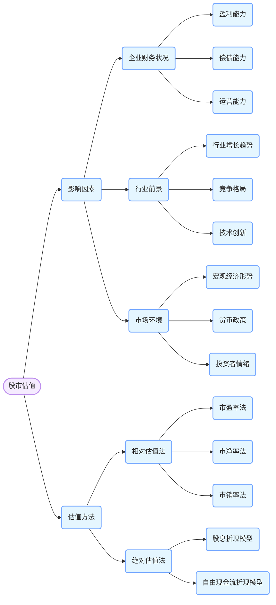
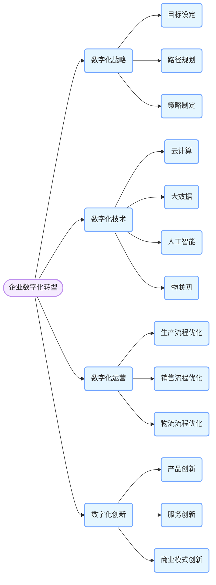
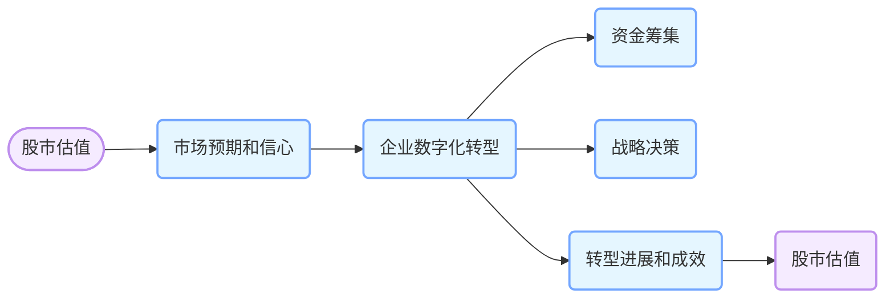

# 股市估值高低对企业数字化转型的影响

> 关键词：股市估值、企业数字化转型、市场预期、资金成本、战略决策

> 摘要：本文旨在深入探讨股市估值高低对企业数字化转型的多方面影响。通过对股市估值和企业数字化转型核心概念的剖析，阐述两者之间的内在联系。从资金获取、战略决策、市场预期等角度分析股市估值高低对企业数字化转型的作用机制。结合数学模型和实际案例，进一步论证其影响的具体表现。同时介绍相关工具和资源，探讨未来发展趋势与挑战，为企业在不同股市估值环境下推进数字化转型提供全面的理论参考和实践指导。

## 1. 背景介绍 
### 1.1 目的和范围
随着数字化时代的到来，企业数字化转型已成为提升竞争力、实现可持续发展的关键战略。而股市作为企业融资和价值评估的重要场所，其估值高低反映了市场对企业的预期和评价。本研究旨在探究股市估值高低如何影响企业数字化转型，涵盖不同行业、不同规模企业在数字化转型过程中受股市估值影响的各个方面，包括资金筹集、战略制定、资源配置等。

### 1.2 预期读者
本文预期读者包括企业管理者、投资者、金融分析师、研究学者以及对企业数字化转型和股市相关领域感兴趣的人士。企业管理者可以从中获取关于如何在不同股市估值环境下推进数字化转型的策略建议；投资者能够更好地理解企业数字化转型与股市估值之间的关系，为投资决策提供参考；金融分析师可借助本文的分析框架对企业的数字化转型潜力和股市表现进行评估；研究学者则可在此基础上开展更深入的学术研究。

### 1.3 文档结构概述
本文首先介绍背景信息，包括研究目的、预期读者和文档结构。接着阐述股市估值和企业数字化转型的核心概念及其联系，通过文本示意图和 Mermaid 流程图进行直观展示。然后深入探讨核心算法原理和具体操作步骤，结合 Python 源代码进行详细说明。再通过数学模型和公式对影响机制进行量化分析，并举例说明。之后通过项目实战，给出代码实际案例并进行详细解释。随后介绍股市估值高低对企业数字化转型的实际应用场景。接着推荐相关的工具和资源，包括学习资源、开发工具框架和相关论文著作。最后总结未来发展趋势与挑战，提供常见问题与解答以及扩展阅读和参考资料。

### 1.4 术语表
#### 1.4.1 核心术语定义
- **股市估值**：是指对企业在股票市场上的价值进行评估的过程和结果，通常通过市盈率、市净率、市销率等指标来衡量。它反映了市场参与者对企业未来盈利能力、成长潜力和风险水平的预期。
- **企业数字化转型**：是指企业利用数字技术，对业务流程、组织架构、商业模式等进行全面变革和创新，以提升企业的运营效率、创新能力和竞争力，实现可持续发展的过程。

#### 1.4.2 相关概念解释
- **市场预期**：是指市场参与者对企业未来发展前景、盈利能力、业绩表现等方面的预期和判断。市场预期会影响股市估值，进而对企业数字化转型产生影响。
- **资金成本**：是指企业为筹集和使用资金而付出的代价，包括利息、股息、发行费用等。股市估值高低会影响企业的资金成本，从而影响企业数字化转型的资金投入和决策。

#### 1.4.3 缩略词列表
- **PE**：市盈率（Price-to-Earnings Ratio），是指股票价格与每股收益的比率，反映了市场对企业盈利的预期。
- **PB**：市净率（Price-to-Book Ratio），是指股票价格与每股净资产的比率，反映了市场对企业净资产的估值。
- **PS**：市销率（Price-to-Sales Ratio），是指股票价格与每股销售收入的比率，反映了市场对企业销售收入的预期。

## 2. 核心概念与联系 

### 股市估值的原理和架构
股市估值是一个复杂的过程，涉及多个因素和方法。其基本原理是基于企业的财务数据、行业前景、市场环境等因素，对企业的未来现金流进行预测，并将其折现到当前时点，从而得出企业的内在价值。常见的估值方法包括相对估值法和绝对估值法。

相对估值法是通过比较同行业或类似企业的估值指标，如市盈率、市净率、市销率等，来评估企业的价值。例如，如果同行业企业的平均市盈率为 20 倍，而某企业的市盈率为 15 倍，则该企业可能被低估。

绝对估值法是通过预测企业未来的现金流，并将其折现到当前时点，来计算企业的内在价值。常见的绝对估值模型包括股息折现模型（DDM）、自由现金流折现模型（DCF）等。

下面是股市估值的文本示意图：

股市估值受到企业财务状况、行业前景、市场环境等多种因素的影响。企业财务状况包括盈利能力、偿债能力、运营能力等指标；行业前景包括行业增长趋势、竞争格局、技术创新等因素；市场环境包括宏观经济形势、货币政策、投资者情绪等因素。通过对这些因素的分析和评估，可以采用相对估值法或绝对估值法来确定企业的股市估值。



### 企业数字化转型的原理和架构
企业数字化转型是一个系统性的工程，涉及企业的各个层面和环节。其基本原理是利用数字技术，对企业的业务流程、组织架构、商业模式等进行全面变革和创新，以提升企业的运营效率、创新能力和竞争力。

企业数字化转型的架构包括数字化战略、数字化技术、数字化运营和数字化创新四个层面。数字化战略是企业数字化转型的方向和指导，明确企业数字化转型的目标、路径和策略；数字化技术是企业数字化转型的支撑和手段，包括云计算、大数据、人工智能、物联网等技术；数字化运营是企业数字化转型的核心和关键，通过数字化技术对企业的生产、销售、物流等业务流程进行优化和重构；数字化创新是企业数字化转型的动力和源泉，通过数字化技术推动企业的产品创新、服务创新和商业模式创新。

下面是企业数字化转型的文本示意图：

企业数字化转型以数字化战略为指导，依托数字化技术，对企业的业务流程、组织架构、商业模式等进行全面变革和创新。数字化战略明确企业数字化转型的目标和方向，数字化技术为企业数字化转型提供技术支持，数字化运营优化企业的业务流程，提高运营效率，数字化创新推动企业的产品、服务和商业模式创新，提升企业的竞争力。



### 股市估值与企业数字化转型的联系
股市估值高低与企业数字化转型之间存在着密切的联系。一方面，股市估值反映了市场对企业未来发展前景的预期，而企业数字化转型是提升企业未来竞争力和盈利能力的重要途径，因此股市估值会影响市场对企业数字化转型的预期和信心。另一方面，企业数字化转型的进展和成效也会影响股市估值。如果企业数字化转型取得成功，能够提升企业的运营效率、创新能力和竞争力，从而提高企业的盈利能力和市场价值，进而提升股市估值；反之，如果企业数字化转型失败，可能会导致企业业绩下滑，市场价值下降，从而降低股市估值。

下面是股市估值与企业数字化转型联系的文本示意图：

股市估值高低影响市场对企业数字化转型的预期和信心，进而影响企业数字化转型的资金筹集和战略决策。企业数字化转型的进展和成效也会影响股市估值，成功的数字化转型会提升股市估值，失败的数字化转型会降低股市估值。



## 3. 核心算法原理 & 具体操作步骤 

### 股市估值算法原理及 Python 实现
#### 市盈率估值法
市盈率估值法是一种常见的相对估值方法，其基本原理是通过比较同行业或类似企业的市盈率，来评估目标企业的价值。计算公式为：

$$V = EPS \times PE$$

其中，$V$ 表示企业的估值，$EPS$ 表示每股收益，$PE$ 表示市盈率。

下面是使用 Python 实现市盈率估值法的代码：

```python
def pe_valuation(eps, pe):
    """
    市盈率估值法
    :param eps: 每股收益
    :param pe: 市盈率
    :return: 企业估值
    """
    return eps * pe

# 示例数据
eps = 2.0  # 每股收益
pe = 20  # 市盈率

# 计算企业估值
valuation = pe_valuation(eps, pe)
print(f"企业估值: {valuation}")
```

#### 自由现金流折现模型
自由现金流折现模型是一种常见的绝对估值方法，其基本原理是通过预测企业未来的自由现金流，并将其折现到当前时点，来计算企业的内在价值。计算公式为：

$$V = \sum_{t=1}^{n} \frac{FCF_t}{(1 + r)^t} + \frac{TV}{(1 + r)^n}$$

其中，$V$ 表示企业的内在价值，$FCF_t$ 表示第 $t$ 期的自由现金流，$r$ 表示折现率，$n$ 表示预测期数，$TV$ 表示终值。

下面是使用 Python 实现自由现金流折现模型的代码：

```python
def dcf_valuation(fcf_list, r, n, tv):
    """
    自由现金流折现模型
    :param fcf_list: 未来各期自由现金流列表
    :param r: 折现率
    :param n: 预测期数
    :param tv: 终值
    :return: 企业内在价值
    """
    value = 0
    for t in range(1, n + 1):
        value += fcf_list[t - 1] / (1 + r) ** t
    value += tv / (1 + r) ** n
    return value

# 示例数据
fcf_list = [100, 120, 140, 160, 180]  # 未来 5 期自由现金流
r = 0.1  # 折现率
n = 5  # 预测期数
tv = 2000  # 终值

# 计算企业内在价值
valuation = dcf_valuation(fcf_list, r, n, tv)
print(f"企业内在价值: {valuation}")
```

### 企业数字化转型决策算法原理及 Python 实现
企业在进行数字化转型决策时，需要综合考虑多个因素，如转型成本、转型收益、转型风险等。一种常见的决策方法是使用净现值（NPV）法，其基本原理是计算数字化转型项目的净现值，即项目未来现金流入的现值减去项目未来现金流出的现值。如果净现值大于零，则项目可行；否则，项目不可行。

计算公式为：

$$NPV = \sum_{t=0}^{n} \frac{CF_t}{(1 + r)^t}$$

其中，$NPV$ 表示净现值，$CF_t$ 表示第 $t$ 期的现金流量，$r$ 表示折现率，$n$ 表示项目期数。

下面是使用 Python 实现净现值法进行数字化转型决策的代码：

```python
def npv_decision(cf_list, r):
    """
    净现值法进行数字化转型决策
    :param cf_list: 未来各期现金流量列表
    :param r: 折现率
    :return: 净现值
    """
    npv = 0
    for t in range(len(cf_list)):
        npv += cf_list[t] / (1 + r) ** t
    return npv

# 示例数据
cf_list = [-1000, 200, 300, 400, 500]  # 未来 5 期现金流量，初始投资为 -1000
r = 0.1  # 折现率

# 计算净现值
npv = npv_decision(cf_list, r)
if npv > 0:
    print("数字化转型项目可行")
else:
    print("数字化转型项目不可行")
```

## 4. 数学模型和公式 & 详细讲解 & 举例说明 

### 股市估值对企业数字化转型资金成本的影响模型
企业在进行数字化转型时，通常需要筹集大量的资金。股市估值高低会影响企业的资金成本，从而影响企业数字化转型的资金投入和决策。下面建立一个简单的数学模型来分析股市估值对企业数字化转型资金成本的影响。

假设企业通过股权融资的方式筹集数字化转型所需的资金，企业的股权融资成本可以用资本资产定价模型（CAPM）来计算：

$$r_e = r_f + \beta (r_m - r_f)$$

其中，$r_e$ 表示股权融资成本，$r_f$ 表示无风险利率，$\beta$ 表示企业股票的贝塔系数，$r_m$ 表示市场收益率。

股市估值高低会影响企业股票的贝塔系数 $\beta$。一般来说，股市估值越高，企业股票的贝塔系数越大，股权融资成本越高；反之，股市估值越低，企业股票的贝塔系数越小，股权融资成本越低。

假设企业数字化转型所需的资金为 $I$，股权融资比例为 $\alpha$，债务融资比例为 $1 - \alpha$，债务融资成本为 $r_d$，则企业数字化转型的加权平均资金成本（WACC）为：

$$WACC = \alpha r_e + (1 - \alpha) r_d$$

下面举例说明：

假设无风险利率 $r_f = 3\%$，市场收益率 $r_m = 10\%$，企业股票的贝塔系数在股市估值高时 $\beta_1 = 1.5$，在股市估值低时 $\beta_2 = 1.0$，债务融资成本 $r_d = 5\%$，股权融资比例 $\alpha = 0.6$。

在股市估值高时，股权融资成本为：

$$r_{e1} = r_f + \beta_1 (r_m - r_f) = 3\% + 1.5 \times (10\% - 3\%) = 13.5\%$$

加权平均资金成本为：

$$WACC_1 = \alpha r_{e1} + (1 - \alpha) r_d = 0.6 \times 13.5\% + (1 - 0.6) \times 5\% = 9.1\%$$

在股市估值低时，股权融资成本为：

$$r_{e2} = r_f + \beta_2 (r_m - r_f) = 3\% + 1.0 \times (10\% - 3\%) = 10\%$$

加权平均资金成本为：

$$WACC_2 = \alpha r_{e2} + (1 - \alpha) r_d = 0.6 \times 10\% + (1 - 0.6) \times 5\% = 8\%$$

可以看出，股市估值高时，企业数字化转型的加权平均资金成本较高；股市估值低时，企业数字化转型的加权平均资金成本较低。

### 股市估值对企业数字化转型战略决策的影响模型
股市估值高低会影响企业的市场预期和信心，从而影响企业数字化转型的战略决策。下面建立一个简单的数学模型来分析股市估值对企业数字化转型战略决策的影响。

假设企业数字化转型有两种战略选择：激进战略和保守战略。激进战略的预期收益为 $R_1$，风险为 $\sigma_1$；保守战略的预期收益为 $R_2$，风险为 $\sigma_2$，且 $R_1 > R_2$，$\sigma_1 > \sigma_2$。

企业的决策取决于市场对企业的预期和信心，而市场预期和信心又与股市估值高低有关。假设市场对企业的预期和信心可以用一个参数 $\theta$ 来表示，$\theta$ 取值范围为 $[0, 1]$，$\theta$ 越大，表示市场对企业的预期和信心越高。

企业选择激进战略的概率 $P_1$ 和选择保守战略的概率 $P_2$ 可以表示为：

$$P_1 = \frac{\theta R_1}{\theta R_1 + (1 - \theta) R_2}$$

$$P_2 = \frac{(1 - \theta) R_2}{\theta R_1 + (1 - \theta) R_2}$$

可以看出，当股市估值高时，市场对企业的预期和信心较高，$\theta$ 较大，企业选择激进战略的概率 $P_1$ 较大；当股市估值低时，市场对企业的预期和信心较低，$\theta$ 较小，企业选择保守战略的概率 $P_2$ 较大。

下面举例说明：

假设激进战略的预期收益 $R_1 = 100$，风险 $\sigma_1 = 20$；保守战略的预期收益 $R_2 = 50$，风险 $\sigma_2 = 10$。

当股市估值高时，$\theta = 0.8$，则企业选择激进战略的概率为：

$$P_1 = \frac{\theta R_1}{\theta R_1 + (1 - \theta) R_2} = \frac{0.8 \times 100}{0.8 \times 100 + (1 - 0.8) \times 50} = \frac{80}{80 + 10} = \frac{8}{9} \approx 0.89$$

企业选择保守战略的概率为：

$$P_2 = \frac{(1 - \theta) R_2}{\theta R_1 + (1 - \theta) R_2} = \frac{(1 - 0.8) \times 50}{0.8 \times 100 + (1 - 0.8) \times 50} = \frac{10}{80 + 10} = \frac{1}{9} \approx 0.11$$

当股市估值低时，$\theta = 0.2$，则企业选择激进战略的概率为：

$$P_1 = \frac{\theta R_1}{\theta R_1 + (1 - \theta) R_2} = \frac{0.2 \times 100}{0.2 \times 100 + (1 - 0.2) \times 50} = \frac{20}{20 + 40} = \frac{1}{3} \approx 0.33$$

企业选择保守战略的概率为：

$$P_2 = \frac{(1 - \theta) R_2}{\theta R_1 + (1 - \theta) R_2} = \frac{(1 - 0.2) \times 50}{0.2 \times 100 + (1 - 0.2) \times 50} = \frac{40}{20 + 40} = \frac{2}{3} \approx 0.67$$

可以看出，股市估值高时，企业更倾向于选择激进战略；股市估值低时，企业更倾向于选择保守战略。

## 5. 项目实战：代码实际案例和详细解释说明 

### 5.1  开发环境搭建
本项目实战使用 Python 语言进行开发，需要安装以下库：

- `pandas`：用于数据处理和分析。
- `numpy`：用于数值计算。
- `matplotlib`：用于数据可视化。

可以使用以下命令安装这些库：

```sh
pip install pandas numpy matplotlib
```

### 5.2  源代码详细实现和代码解读
下面是一个模拟股市估值高低对企业数字化转型影响的代码示例：

```python
import pandas as pd
import numpy as np
import matplotlib.pyplot as plt

# 定义企业数字化转型相关参数
initial_investment = 1000  # 初始投资
cash_flows_high_valuation = [200, 300, 400, 500, 600]  # 股市估值高时未来 5 期现金流量
cash_flows_low_valuation = [100, 200, 300, 400, 500]  # 股市估值低时未来 5 期现金流量
discount_rate = 0.1  # 折现率

# 定义计算净现值的函数
def npv(cash_flows, discount_rate):
    npv_value = -initial_investment
    for t in range(len(cash_flows)):
        npv_value += cash_flows[t] / (1 + discount_rate) ** (t + 1)
    return npv_value

# 计算股市估值高时的净现值
npv_high_valuation = npv(cash_flows_high_valuation, discount_rate)

# 计算股市估值低时的净现值
npv_low_valuation = npv(cash_flows_low_valuation, discount_rate)

# 输出结果
print(f"股市估值高时的净现值: {npv_high_valuation}")
print(f"股市估值低时的净现值: {npv_low_valuation}")

# 可视化结果
labels = ['High Valuation', 'Low Valuation']
npv_values = [npv_high_valuation, npv_low_valuation]

plt.bar(labels, npv_values)
plt.xlabel('Stock Valuation')
plt.ylabel('Net Present Value')
plt.title('Effect of Stock Valuation on Digital Transformation NPV')
plt.show()
```

### 5.3  代码解读与分析
1. **参数定义**：定义了企业数字化转型的初始投资、股市估值高和低时的未来 5 期现金流量以及折现率。
2. **净现值计算函数**：定义了一个计算净现值的函数 `npv`，该函数接受现金流量列表和折现率作为参数，返回净现值。
3. **净现值计算**：分别计算股市估值高和低时的净现值。
4. **结果输出**：输出股市估值高和低时的净现值。
5. **可视化结果**：使用 `matplotlib` 库绘制柱状图，直观展示股市估值高低对企业数字化转型净现值的影响。

从代码结果可以看出，股市估值高时的净现值大于股市估值低时的净现值，这表明股市估值高时企业数字化转型的投资回报更高，更有利于企业进行数字化转型。

## 6. 实际应用场景 

### 高股市估值下的企业数字化转型
在高股市估值下，企业通常具有以下优势：
- **资金筹集更容易**：高股市估值意味着企业的股票价格较高，企业可以通过股权融资的方式筹集更多的资金，为数字化转型提供充足的资金支持。
- **市场预期和信心高**：高股市估值反映了市场对企业未来发展前景的乐观预期和信心，这有助于企业吸引优秀的人才、合作伙伴和客户，为数字化转型创造良好的外部环境。
- **战略决策更激进**：高股市估值下，企业更倾向于选择激进的数字化转型战略，加大对新技术、新业务的投入，以实现快速增长和创新。

例如，一些科技巨头公司在高股市估值下，积极推进数字化转型，加大对人工智能、大数据、云计算等领域的研发投入，推出一系列创新产品和服务，进一步巩固了其市场地位。

### 低股市估值下的企业数字化转型
在低股市估值下，企业面临着以下挑战：
- **资金筹集困难**：低股市估值意味着企业的股票价格较低，企业通过股权融资的方式筹集资金的难度较大，资金成本较高，这可能会限制企业数字化转型的资金投入。
- **市场预期和信心低**：低股市估值反映了市场对企业未来发展前景的悲观预期和信心不足，这可能会影响企业吸引人才、合作伙伴和客户的能力，为数字化转型带来一定的困难。
- **战略决策更保守**：低股市估值下，企业更倾向于选择保守的数字化转型战略，注重现有业务的优化和成本控制，以提高企业的盈利能力和抗风险能力。

例如，一些传统制造业企业在低股市估值下，可能会选择逐步推进数字化转型，先从生产流程的自动化和信息化入手，提高生产效率和质量，再逐步拓展到其他领域。

## 7. 工具和资源推荐
### 7.1 学习资源推荐
#### 7.1.1 书籍推荐
- 《数字化转型：企业破局与重生》：本书系统地介绍了企业数字化转型的理论、方法和实践案例，对企业管理者和从业者具有很高的参考价值。
- 《股市估值与投资分析》：详细讲解了股市估值的方法和技巧，以及如何利用估值信息进行投资决策。
- 《数字经济时代的企业战略》：探讨了数字经济时代企业面临的机遇和挑战，以及如何制定有效的数字化转型战略。

#### 7.1.2 在线课程
- Coursera 上的“数字化转型战略”课程：由知名商学院教授授课，涵盖了数字化转型的各个方面，包括战略规划、技术应用、组织变革等。
- edX 上的“股市投资与估值”课程：系统地介绍了股市投资和估值的基本理论和方法，通过案例分析和实践操作，帮助学员掌握相关技能。
- 网易云课堂上的“企业数字化转型实战”课程：结合实际案例，讲解企业数字化转型的具体步骤和方法，具有很强的实用性。

#### 7.1.3 技术博客和网站
- 36氪：关注新经济领域的创新和创业，提供大量关于企业数字化转型、科技趋势等方面的资讯和分析。
- 虎嗅网：聚焦商业、科技和创新领域，发布深度的行业分析和评论文章，对企业数字化转型和股市动态有深入的报道。
- 艾瑞网：专注于互联网、新经济领域的研究和咨询，提供权威的行业数据和研究报告，为企业数字化转型和股市投资提供参考。

### 7.2 开发工具框架推荐
#### 7.2.1 IDE和编辑器
- PyCharm：一款功能强大的 Python 集成开发环境，提供代码编辑、调试、版本控制等功能，适合开发与股市估值和企业数字化转型相关的 Python 程序。
- Visual Studio Code：一款轻量级的代码编辑器，支持多种编程语言和插件扩展，可用于快速开发和调试相关代码。

#### 7.2.2 调试和性能分析工具
- PDB：Python 内置的调试器，可用于调试 Python 代码，帮助开发者定位和解决问题。
- cProfile：Python 标准库中的性能分析工具，可用于分析 Python 代码的性能瓶颈，优化代码性能。

#### 7.2.3 相关框架和库
- Pandas：用于数据处理和分析的 Python 库，可用于处理股市数据和企业财务数据。
- Numpy：用于数值计算的 Python 库，可用于实现股市估值和数字化转型决策的数学模型。
- Scikit-learn：用于机器学习的 Python 库，可用于构建股市预测模型和数字化转型效果评估模型。

### 7.3 相关论文著作推荐
#### 7.3.1 经典论文
- 《资本资产定价模型：理论与实证》：介绍了资本资产定价模型的基本原理和实证研究，对理解股市估值和企业资金成本具有重要意义。
- 《企业数字化转型的战略逻辑与实现路径》：探讨了企业数字化转型的战略逻辑和实现路径，为企业数字化转型提供了理论指导。

#### 7.3.2 最新研究成果
- 《基于大数据的股市估值模型研究》：利用大数据技术构建股市估值模型，提高了股市估值的准确性和效率。
- 《人工智能在企业数字化转型中的应用研究》：研究了人工智能技术在企业数字化转型中的应用场景和效果，为企业数字化转型提供了新的思路和方法。

#### 7.3.3 应用案例分析
- 《某科技公司数字化转型案例分析》：详细分析了某科技公司的数字化转型过程、策略和成效，为其他企业提供了借鉴和参考。
- 《传统制造业企业数字化转型的实践与探索》：介绍了传统制造业企业在数字化转型过程中面临的问题和解决方案，对传统制造业企业的数字化转型具有重要的指导意义。

## 8. 总结：未来发展趋势与挑战
### 未来发展趋势
- **数字化转型加速**：随着数字技术的不断发展和应用，企业数字化转型将成为必然趋势，高股市估值将为企业数字化转型提供更多的资金和动力，加速企业数字化转型的进程。
- **技术创新驱动**：人工智能、大数据、云计算、物联网等新兴技术将不断推动企业数字化转型的创新和发展，企业将更加注重技术创新和应用，以提升自身的竞争力。
- **生态协同发展**：企业数字化转型将不再是孤立的行为，而是与供应商、合作伙伴、客户等形成生态协同发展的模式，共同推动整个产业链的数字化转型。

### 挑战
- **技术挑战**：数字技术的快速发展和更新换代，要求企业不断学习和掌握新的技术，以满足数字化转型的需求。同时，技术的复杂性和不确定性也给企业数字化转型带来了一定的风险。
- **人才挑战**：企业数字化转型需要大量既懂技术又懂业务的复合型人才，而目前这类人才相对短缺，企业面临着人才招聘、培养和留住的挑战。
- **文化挑战**：企业数字化转型需要打破传统的企业文化和管理模式，建立适应数字化时代的新文化和新机制，这需要企业管理者和员工的观念转变和积极参与。

## 9. 附录：常见问题与解答
### 问题 1：股市估值高低是如何确定的？
股市估值高低是通过多种方法和指标来确定的，常见的方法包括相对估值法和绝对估值法。相对估值法通过比较同行业或类似企业的估值指标，如市盈率、市净率、市销率等，来评估企业的价值；绝对估值法通过预测企业未来的现金流，并将其折现到当前时点，来计算企业的内在价值。

### 问题 2：企业数字化转型一定能提升股市估值吗？
不一定。企业数字化转型的成效取决于多种因素，如转型战略的正确性、执行能力、市场环境等。如果企业数字化转型取得成功，能够提升企业的运营效率、创新能力和竞争力，从而提高企业的盈利能力和市场价值，进而提升股市估值；反之，如果企业数字化转型失败，可能会导致企业业绩下滑，市场价值下降，从而降低股市估值。

### 问题 3：低股市估值下企业就不能进行数字化转型了吗？
不是。虽然低股市估值下企业面临着资金筹集困难、市场预期和信心低等挑战，但企业仍然可以通过优化内部管理、降低成本、寻求合作等方式来推进数字化转型。同时，低股市估值也可能为企业提供一些并购和整合的机会，加速企业数字化转型的进程。

## 10. 扩展阅读 & 参考资料
### 扩展阅读
- 《数字化生存》：介绍了数字化时代的社会、经济和文化变革，对理解企业数字化转型的背景和意义具有重要的参考价值。
- 《金融炼金术》：探讨了金融市场的运行规律和投资者的行为心理，对理解股市估值和投资决策具有一定的启示作用。

### 参考资料
- 相关上市公司的年报和财务报告。
- 各大证券交易所发布的市场数据和研究报告。
- 行业协会和研究机构发布的行业研究报告和统计数据。