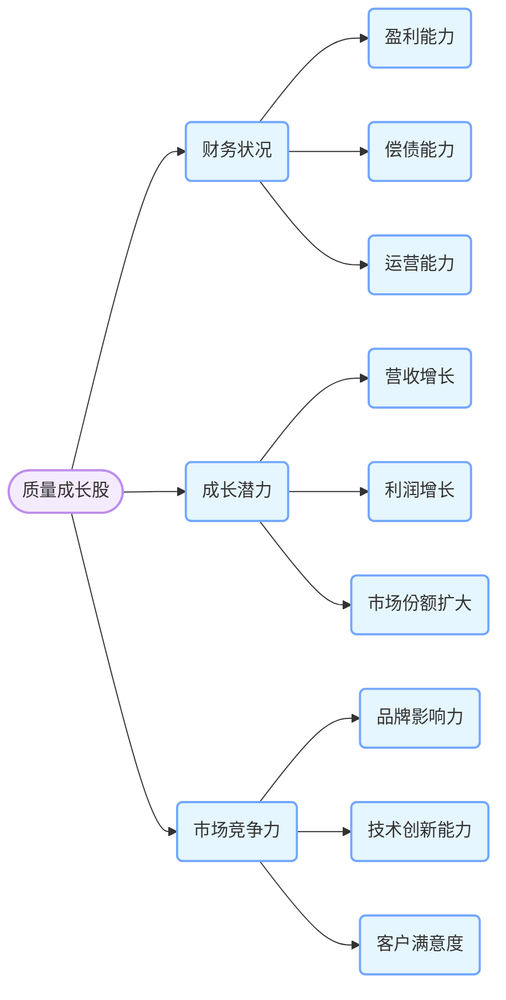

# 肯尼斯·费雪的质量成长股特征

> 关键词：肯尼斯·费雪、质量成长股、股票特征、投资策略、财务指标、成长潜力、市场竞争力

> 摘要：本文深入探讨肯尼斯·费雪所定义的质量成长股的特征。肯尼斯·费雪作为投资领域的知名人物，其对质量成长股的见解具有重要的参考价值。通过对质量成长股特征的分析，投资者能够更好地识别具有潜力的股票，优化投资组合。文章将详细阐述质量成长股在财务、成长、市场竞争力等多方面的特征，同时结合实际案例和相关理论，为投资者提供全面且深入的指导，帮助其在复杂多变的股票市场中做出更明智的投资决策。

## 1. 背景介绍 
### 1.1 目的和范围
本部分旨在全面剖析肯尼斯·费雪提出的质量成长股特征，为投资者提供一套系统的、可操作的选股标准。范围涵盖质量成长股的多个维度，包括财务状况、成长潜力、市场竞争力等方面的特征。通过对这些特征的深入研究，帮助投资者理解质量成长股的本质，从而在股票投资中能够准确筛选出具有长期投资价值的股票。

### 1.2 预期读者
本文预期读者主要包括股票投资者，无论是初入股市的新手，还是有一定投资经验的专业人士，都能从本文中获取有价值的信息。同时，金融专业的学生、研究人员以及对股票投资理论感兴趣的人士也可以作为本文的读者群体，通过阅读本文深入了解肯尼斯·费雪的投资理念和质量成长股的相关知识。

### 1.3 文档结构概述
本文将按照以下结构展开：首先介绍肯尼斯·费雪及其提出的质量成长股概念的背景信息；接着详细阐述质量成长股的核心概念与联系，包括其与其他类型股票的区别；然后深入分析质量成长股的核心特征，通过具体的财务指标、成长指标等进行讲解，并结合Python代码对相关指标的计算进行演示；之后介绍质量成长股的数学模型和公式，帮助读者从理论层面理解其特征；再通过实际案例展示如何运用这些特征进行股票筛选和投资决策；随后探讨质量成长股的实际应用场景；接着推荐相关的学习资源、开发工具框架和论文著作；最后总结质量成长股的未来发展趋势与挑战，并对常见问题进行解答，同时提供扩展阅读和参考资料。

### 1.4 术语表
#### 1.4.1 核心术语定义
- **质量成长股**：由肯尼斯·费雪提出，指那些具有较高质量和良好成长潜力的股票。这类股票通常在财务状况、市场竞争力、创新能力等方面表现出色，能够在长期为投资者带来稳定的回报。
- **投资回报率（ROI）**：是指通过投资而应返回的价值，即企业从一项投资活动中得到的经济回报。它涵盖了企业的获利目标。利润和投入经营所必备的财产相关，因为管理人员必须通过投资和现有财产获得利润。
- **净资产收益率（ROE）**：又称股东权益报酬率/净值报酬率/权益报酬率/权益利润率/净资产利润率，是净利润与平均股东权益的百分比，是公司税后利润除以净资产得到的百分比率，该指标反映股东权益的收益水平，用以衡量公司运用自有资本的效率。

#### 1.4.2 相关概念解释
- **成长潜力**：指公司在未来一段时间内实现业务增长、盈利提升的可能性和能力。成长潜力受到多种因素的影响，如市场需求、技术创新、管理能力等。
- **市场竞争力**：企业在市场竞争中表现出的综合能力，包括产品或服务的质量、价格、品牌影响力、客户满意度等方面。具有较强市场竞争力的企业能够在市场中占据优势地位，获得更多的市场份额和利润。

#### 1.4.3 缩略词列表
- **ROI**：Return on Investment（投资回报率）
- **ROE**：Return on Equity（净资产收益率）

## 2. 核心概念与联系 
### 2.1 肯尼斯·费雪与质量成长股概念的提出
肯尼斯·费雪是投资领域的杰出人物，他在长期的投资实践和研究中，提出了质量成长股的概念。他认为在股票市场中，存在一类股票既具有较高的质量，又具备良好的成长潜力，这类股票与传统的价值股和成长股有所不同。质量成长股不仅关注公司的当前财务状况，更注重其未来的发展前景和创新能力。

### 2.2 质量成长股与其他类型股票的区别
- **与价值股的区别**：价值股通常是指那些股价相对较低、市盈率和市净率等估值指标较低的股票。价值股的投资逻辑主要基于公司的现有资产和盈利能力，投资者认为这些股票被市场低估，具有投资价值。而质量成长股更注重公司的成长潜力和创新能力，即使其当前的估值指标可能相对较高，但由于其未来的增长前景广阔，仍然具有投资价值。
- **与传统成长股的区别**：传统成长股主要关注公司的业绩增长速度，通常具有较高的营收和利润增长率。然而，传统成长股可能存在财务状况不稳定、估值过高的问题。质量成长股在关注成长速度的同时，更强调公司的质量，包括财务健康、市场竞争力、管理能力等方面，以确保公司的成长具有可持续性。

### 2.3 质量成长股核心概念原理和架构的文本示意图
质量成长股的核心概念原理基于公司的多个方面的综合表现。从财务角度来看，包括盈利能力、偿债能力、运营能力等；从成长角度来看，涉及营收增长、利润增长、市场份额扩大等；从市场竞争力角度来看，包括品牌影响力、技术创新能力、客户满意度等。这些方面相互关联、相互影响，共同构成了质量成长股的核心特征。

### 2.4 质量成长股的Mermaid流程图


## 3. 核心算法原理 & 具体操作步骤 
### 3.1 核心算法原理
在分析质量成长股的特征时，需要综合考虑多个财务指标和非财务指标。以下是一些常用的指标及其计算方法：
- **投资回报率（ROI）**：计算公式为 $ROI = \frac{净利润}{投资成本} \times 100\%$
- **净资产收益率（ROE）**：计算公式为 $ROE = \frac{净利润}{平均股东权益} \times 100\%$
- **营收增长率**：计算公式为 $营收增长率 = \frac{本期营收 - 上期营收}{上期营收} \times 100\%$

### 3.2 具体操作步骤
1. **数据收集**：收集目标公司的财务报表、市场调研数据等相关信息。
2. **指标计算**：根据上述公式计算各项指标的值。
3. **指标分析**：将计算得到的指标值与同行业其他公司进行比较，评估目标公司在各方面的表现。
4. **综合评估**：综合考虑多个指标的结果，对目标公司是否为质量成长股进行判断。

### 3.3 Python源代码实现
```python
import pandas as pd

# 示例数据
data = {
    '公司名称': ['A公司', 'B公司', 'C公司'],
    '净利润': [1000, 1500, 2000],
    '投资成本': [5000, 8000, 10000],
    '平均股东权益': [4000, 6000, 8000],
    '本期营收': [8000, 10000, 12000],
    '上期营收': [7000, 9000, 11000]
}

df = pd.DataFrame(data)

# 计算投资回报率（ROI）
df['ROI'] = (df['净利润'] / df['投资成本']) * 100

# 计算净资产收益率（ROE）
df['ROE'] = (df['净利润'] / df['平均股东权益']) * 100

# 计算营收增长率
df['营收增长率'] = ((df['本期营收'] - df['上期营收']) / df['上期营收']) * 100

print(df)
```
### 3.4 代码解释
- 首先，我们使用`pandas`库创建了一个包含示例数据的`DataFrame`。
- 然后，根据上述公式分别计算了投资回报率（ROI）、净资产收益率（ROE）和营收增长率，并将结果添加到`DataFrame`中。
- 最后，打印出包含各项指标的`DataFrame`，方便我们进行分析。

## 4. 数学模型和公式 & 详细讲解 & 举例说明 
### 4.1 投资回报率（ROI）
#### 4.1.1 公式
$ROI = \frac{净利润}{投资成本} \times 100\%$

#### 4.1.2 详细讲解
投资回报率（ROI）是衡量投资效益的重要指标，它反映了投资所获得的利润与投资成本之间的比例关系。ROI越高，说明投资的效益越好。在分析质量成长股时，较高的ROI通常意味着公司能够有效地利用投资资金，实现盈利增长。

#### 4.1.3 举例说明
假设某公司的净利润为1000万元，投资成本为5000万元，则该公司的ROI为：
$ROI = \frac{1000}{5000} \times 100\% = 20\%$

### 4.2 净资产收益率（ROE）
#### 4.2.1 公式
$ROE = \frac{净利润}{平均股东权益} \times 100\%$

#### 4.2.2 详细讲解
净资产收益率（ROE）反映了公司运用自有资本的效率，即股东权益的收益水平。ROE越高，说明公司利用自有资本创造利润的能力越强。对于质量成长股来说，较高的ROE是其重要特征之一，表明公司具有良好的盈利能力和股东回报能力。

#### 4.2.3 举例说明
假设某公司的净利润为1500万元，平均股东权益为6000万元，则该公司的ROE为：
$ROE = \frac{1500}{6000} \times 100\% = 25\%$

### 4.3 营收增长率
#### 4.3.1 公式
$营收增长率 = \frac{本期营收 - 上期营收}{上期营收} \times 100\%$

#### 4.3.2 详细讲解
营收增长率反映了公司业务的增长速度，是衡量公司成长潜力的重要指标。较高的营收增长率表明公司的市场份额在扩大，业务在不断发展。对于质量成长股来说，持续的营收增长是其成长的重要动力。

#### 4.3.3 举例说明
假设某公司本期营收为10000万元，上期营收为9000万元，则该公司的营收增长率为：
$营收增长率 = \frac{10000 - 9000}{9000} \times 100\% \approx 11.11\%$

## 5. 项目实战：代码实际案例和详细解释说明 
### 5.1  开发环境搭建
- **Python环境**：建议使用Python 3.7及以上版本，可以从Python官方网站（https://www.python.org/downloads/）下载并安装。
- **开发工具**：可以使用PyCharm、Jupyter Notebook等开发工具。PyCharm是一款功能强大的Python集成开发环境（IDE），适合专业开发人员使用；Jupyter Notebook则是一种交互式的开发环境，适合数据探索和分析。
- **相关库**：需要安装`pandas`、`numpy`等库，可以使用`pip`命令进行安装：
```sh
pip install pandas numpy
```

### 5.2  源代码详细实现和代码解读
```python
import pandas as pd
import numpy as np

# 读取股票数据文件
data = pd.read_csv('stock_data.csv')

# 计算各项指标
data['ROI'] = (data['净利润'] / data['投资成本']) * 100
data['ROE'] = (data['净利润'] / data['平均股东权益']) * 100
data['营收增长率'] = ((data['本期营收'] - data['上期营收']) / data['上期营收']) * 100

# 筛选质量成长股
# 假设ROI大于15%，ROE大于20%，营收增长率大于10%的股票为质量成长股
quality_growth_stocks = data[(data['ROI'] > 15) & (data['ROE'] > 20) & (data['营收增长率'] > 10)]

# 打印筛选结果
print(quality_growth_stocks)
```
### 5.3  代码解读与分析
- **数据读取**：使用`pandas`的`read_csv`函数读取股票数据文件`stock_data.csv`，将数据存储在`DataFrame`中。
- **指标计算**：根据前面介绍的公式，计算投资回报率（ROI）、净资产收益率（ROE）和营收增长率，并将结果添加到`DataFrame`中。
- **股票筛选**：使用条件筛选语句，筛选出ROI大于15%，ROE大于20%，营收增长率大于10%的股票，将这些股票定义为质量成长股。
- **结果输出**：打印出筛选得到的质量成长股的信息。

## 6. 实际应用场景 
### 6.1 个人投资者选股
对于个人投资者来说，了解质量成长股的特征可以帮助他们在众多股票中筛选出具有潜力的投资标的。通过分析公司的财务指标、成长潜力和市场竞争力等方面的特征，个人投资者可以更准确地判断股票的投资价值，从而优化自己的投资组合，提高投资收益。

### 6.2 机构投资者资产配置
机构投资者如基金公司、保险公司等，在进行资产配置时，也会关注质量成长股。质量成长股通常具有较高的稳定性和成长潜力，适合作为长期投资的资产。机构投资者可以通过投资质量成长股，实现资产的保值增值，同时分散投资风险。

### 6.3 公司战略决策
对于上市公司来说，了解质量成长股的特征可以帮助公司管理层制定合理的战略决策。公司可以通过提升自身的财务状况、增强成长潜力和市场竞争力，使公司成为质量成长股，从而吸引更多的投资者，提高公司的市场价值。

## 7. 工具和资源推荐
### 7.1 学习资源推荐
#### 7.1.1 书籍推荐
- 《超级强势股》（肯尼斯·费雪著）：本书是肯尼斯·费雪的经典著作，详细阐述了他的投资理念和选股方法，对质量成长股的特征进行了深入分析。
- 《聪明的投资者》（本杰明·格雷厄姆著）：这本书是价值投资的经典之作，虽然主要关注价值股的投资，但其中的一些投资理念和分析方法对理解质量成长股也有一定的帮助。

#### 7.1.2 在线课程
- Coursera上的“投资学原理”课程：该课程由知名大学的教授授课，涵盖了投资学的基本原理和方法，包括股票投资、资产配置等方面的内容。
- 网易云课堂上的“股票投资实战技巧”课程：该课程结合实际案例，讲解了股票投资的实战技巧，对初学者有很大的帮助。

#### 7.1.3 技术博客和网站
- 雪球网：是一个投资者交流和分享的社区，上面有很多关于股票投资的分析文章和讨论，可以帮助投资者了解市场动态和其他投资者的观点。
- 东方财富网：提供丰富的股票数据和资讯，投资者可以通过该网站获取公司的财务报表、行业数据等信息，进行股票分析。

### 7.2 开发工具框架推荐
#### 7.2.1 IDE和编辑器
- PyCharm：功能强大的Python集成开发环境，具有代码编辑、调试、版本控制等功能，适合专业开发人员使用。
- Jupyter Notebook：交互式的开发环境，适合数据探索和分析，方便用户编写和运行代码，同时可以添加文本说明和可视化图表。

#### 7.2.2 调试和性能分析工具
- `pdb`：Python自带的调试工具，可以帮助用户在代码中设置断点，逐步执行代码，查找问题。
- `cProfile`：Python的性能分析工具，可以帮助用户分析代码的性能瓶颈，优化代码的执行效率。

#### 7.2.3 相关框架和库
- `pandas`：强大的数据处理和分析库，提供了丰富的数据结构和函数，方便用户进行数据读取、清洗、分析等操作。
- `numpy`：Python的数值计算库，提供了高效的数组操作和数学函数，是很多数据分析和机器学习库的基础。

### 7.3 相关论文著作推荐
#### 7.3.1 经典论文
- “The Cross - Section of Expected Stock Returns”（Eugene F. Fama and Kenneth R. French著）：这篇论文提出了著名的Fama - French三因子模型，对股票收益率的影响因素进行了深入研究，对理解股票投资的风险和收益具有重要意义。
- “Capital Asset Pricing Model: Theory and Evidence”（Fischer Black, Michael C. Jensen, and Myron Scholes著）：该论文对资本资产定价模型（CAPM）进行了详细的阐述和实证检验，是现代金融理论的重要基础之一。

#### 7.3.2 最新研究成果
- 可以通过学术数据库如Web of Science、EBSCO等搜索关于质量成长股、股票投资等方面的最新研究论文，了解该领域的前沿动态和研究进展。

#### 7.3.3 应用案例分析
- 一些金融研究机构和咨询公司会发布关于股票投资的应用案例分析报告，投资者可以通过阅读这些报告，学习如何运用各种投资理论和方法进行股票分析和投资决策。

## 8. 总结：未来发展趋势与挑战
### 8.1 未来发展趋势
- **科技驱动**：随着科技的不断发展，新兴科技行业将涌现出更多的质量成长股。例如，人工智能、大数据、新能源等领域的公司，具有较高的创新能力和成长潜力，有望成为未来的质量成长股。
- **国际化趋势**：全球经济一体化的趋势下，跨国公司的发展将越来越受到关注。具有国际竞争力的公司，能够在全球市场中获取更多的资源和市场份额，更有可能成为质量成长股。
- **可持续发展**：投资者越来越关注公司的可持续发展能力，包括环境、社会和治理（ESG）等方面。那些注重可持续发展的公司，将更受投资者青睐，有望成为质量成长股。

### 8.2 挑战
- **市场不确定性**：股票市场受到宏观经济、政策、行业竞争等多种因素的影响，具有较高的不确定性。即使是质量成长股，也可能面临市场波动的风险，投资者需要具备较强的风险承受能力和风险管理能力。
- **信息不对称**：在股票市场中，投资者获取信息的能力存在差异，可能导致信息不对称。一些公司可能会隐瞒或夸大某些信息，给投资者的判断带来困难。投资者需要通过多种渠道获取信息，提高自己的信息分析能力。
- **估值难题**：质量成长股通常具有较高的成长潜力，但其估值也相对较高。如何准确评估质量成长股的价值，避免高估或低估，是投资者面临的一个难题。投资者需要运用合理的估值方法，结合公司的基本面和市场情况进行综合判断。

## 9. 附录：常见问题与解答
### 9.1 如何判断一个公司是否为质量成长股？
判断一个公司是否为质量成长股需要综合考虑多个方面的因素，包括财务状况（如盈利能力、偿债能力、运营能力等）、成长潜力（如营收增长、利润增长、市场份额扩大等）、市场竞争力（如品牌影响力、技术创新能力、客户满意度等）。可以通过分析公司的财务报表、市场调研数据等信息，计算相关指标（如ROI、ROE、营收增长率等），并与同行业其他公司进行比较，来评估公司的表现。

### 9.2 质量成长股一定能带来高回报吗？
虽然质量成长股通常具有较高的成长潜力和投资价值，但并不意味着一定能带来高回报。股票市场具有不确定性，质量成长股也可能受到市场波动、行业竞争、公司内部管理等多种因素的影响。投资者需要具备风险意识，合理配置资产，以降低投资风险。

### 9.3 如何获取公司的财务报表和市场调研数据？
公司的财务报表可以通过公司的官方网站、证券交易所网站等渠道获取。市场调研数据可以通过专业的市场调研机构、金融资讯网站等渠道获取。此外，还可以参考一些研究报告和分析文章，获取相关的信息和观点。

## 10. 扩展阅读 & 参考资料
### 10.1 扩展阅读
- 《金融炼金术》（乔治·索罗斯著）：本书探讨了金融市场的运行规律和投资者的心理行为，对理解股票市场的复杂性和不确定性有很大的帮助。
- 《漫步华尔街》（伯顿·马尔基尔著）：这本书介绍了多种投资策略和方法，包括随机漫步理论、有效市场假说等，对投资者的投资决策具有一定的指导意义。

### 10.2 参考资料
- 肯尼斯·费雪的相关著作和研究论文。
- 金融行业的研究报告和统计数据。
- 各大证券交易所和金融机构发布的信息和公告。