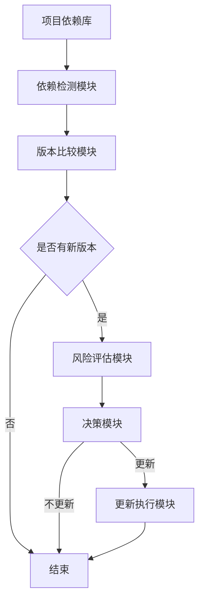

# 自动化依赖更新风险评估:简化库管理决策

> 关键词：自动化依赖更新、风险评估、库管理、决策简化、依赖分析、版本控制、安全漏洞

> 摘要：在现代软件开发中，依赖管理是一项至关重要的任务。自动化依赖更新虽然能带来诸多便利，如获取新功能、修复安全漏洞等，但也伴随着一定风险，如兼容性问题、引入新的安全隐患等。本文旨在深入探讨自动化依赖更新风险评估的相关内容，从核心概念、算法原理、数学模型、实际案例等多个角度进行详细分析，为开发者提供一套全面的方法来简化库管理决策，从而在享受自动化依赖更新带来的好处的同时，有效降低潜在风险。

## 1. 背景介绍 
### 1.1 目的和范围
在当今快速发展的软件开发领域，依赖库的使用变得越来越普遍。这些依赖库为开发者提供了丰富的功能和便利，大大缩短了开发周期。然而，随着依赖库数量的增加和版本的不断更新，依赖管理变得越来越复杂。自动化依赖更新工具的出现，为解决依赖管理的部分问题提供了方案，但同时也带来了新的风险。本文章的目的在于深入研究自动化依赖更新的风险评估方法，帮助开发者更好地理解和管理这些风险，从而简化库管理决策。文章的范围涵盖了自动化依赖更新的核心概念、风险评估的算法原理、数学模型、实际应用案例以及相关的工具和资源推荐等方面。

### 1.2 预期读者
本文的预期读者主要包括软件开发人员、软件测试人员、软件架构师、项目管理人员以及对依赖管理和风险评估感兴趣的技术爱好者。这些读者在软件开发过程中可能会涉及到依赖库的管理和使用，需要了解自动化依赖更新的风险以及如何进行有效的评估和管理。

### 1.3 文档结构概述
本文将按照以下结构进行组织：首先介绍自动化依赖更新的背景知识，包括目的、预期读者和文档结构概述等；接着阐述核心概念与联系，通过文本示意图和 Mermaid 流程图展示自动化依赖更新的原理和架构；然后详细讲解核心算法原理和具体操作步骤，使用 Python 源代码进行阐述；之后介绍数学模型和公式，并通过举例说明进行详细讲解；再通过项目实战展示代码实际案例和详细解释说明；接着探讨实际应用场景；随后推荐相关的工具和资源；最后进行总结，分析未来发展趋势与挑战，并提供常见问题与解答以及扩展阅读和参考资料。

### 1.4 术语表
#### 1.4.1 核心术语定义
- **自动化依赖更新**：指通过工具自动检测项目中依赖库的新版本，并将其更新到项目中的过程。
- **风险评估**：对自动化依赖更新可能带来的各种风险进行分析和评估的过程。
- **依赖库**：是其他软件项目所依赖的代码库，提供了特定的功能和服务。
- **兼容性问题**：指更新依赖库后，项目中其他部分与新库版本不兼容的问题。
- **安全漏洞**：依赖库中存在的可能被攻击者利用的安全缺陷。

#### 1.4.2 相关概念解释
- **版本控制**：是一种管理软件版本的方法，通过记录软件版本的变化，方便开发者进行回滚、比较和协作开发。
- **依赖分析**：对项目中依赖库的关系和使用情况进行分析的过程，有助于了解项目的依赖结构。
- **库管理决策**：根据风险评估结果，决定是否更新依赖库以及如何更新的决策过程。

#### 1.4.3 缩略词列表
- **CVE**：Common Vulnerabilities and Exposures，通用漏洞披露。
- **NVD**：National Vulnerability Database，国家漏洞数据库。

## 2. 核心概念与联系 

### 核心概念原理
自动化依赖更新的核心原理是通过工具定期检查项目中依赖库的最新版本，并与当前使用的版本进行比较。如果发现有新版本可用，工具会尝试自动更新项目中的依赖库。然而，这个过程并非没有风险，因为新版本的依赖库可能会引入兼容性问题、安全漏洞或其他问题。

风险评估的原理是通过对依赖库的多个方面进行分析，如版本历史、安全报告、社区反馈等，来评估更新依赖库可能带来的风险。评估结果可以帮助开发者做出合理的库管理决策。

### 架构的文本示意图
自动化依赖更新风险评估的架构可以分为以下几个主要部分：

1. **依赖检测模块**：负责检测项目中使用的依赖库及其当前版本。
2. **版本比较模块**：将当前使用的依赖库版本与最新版本进行比较，确定是否有新版本可用。
3. **风险评估模块**：对更新依赖库可能带来的风险进行评估，考虑因素包括兼容性、安全漏洞、性能变化等。
4. **决策模块**：根据风险评估结果，做出是否更新依赖库的决策。
5. **更新执行模块**：如果决策是更新依赖库，则执行更新操作。

### Mermaid 流程图


## 3. 核心算法原理 & 具体操作步骤 

### 核心算法原理
风险评估的核心算法可以基于多因素分析，考虑以下几个主要因素：

1. **版本距离**：当前使用的版本与最新版本之间的版本号差距。版本距离越大，风险可能越高。
2. **安全漏洞数量**：新的依赖库版本中已知的安全漏洞数量。安全漏洞数量越多，风险越高。
3. **社区反馈**：通过分析社区论坛、开源项目的 issue 等渠道，了解其他开发者对新依赖库版本的反馈。如果有大量负面反馈，风险可能较高。
4. **兼容性测试结果**：对新依赖库版本进行兼容性测试，根据测试结果评估风险。

### 具体操作步骤
以下是实现自动化依赖更新风险评估的具体操作步骤：

1. **收集依赖信息**：使用工具（如 `pip freeze` 用于 Python 项目）收集项目中使用的依赖库及其当前版本。
2. **获取最新版本信息**：通过依赖库的官方源（如 PyPI 对于 Python 库）获取最新版本信息。
3. **计算版本距离**：比较当前版本和最新版本的版本号，计算版本距离。
4. **查询安全漏洞信息**：从安全漏洞数据库（如 NVD）查询新依赖库版本的安全漏洞信息。
5. **收集社区反馈**：通过爬虫或 API 接口收集社区论坛、开源项目的 issue 等渠道的反馈信息。
6. **进行兼容性测试**：在测试环境中对新依赖库版本进行兼容性测试。
7. **综合评估风险**：根据以上因素，综合评估更新依赖库的风险。
8. **做出决策**：根据风险评估结果，决定是否更新依赖库。

### Python 源代码实现
```python
import requests
import packaging.version

# 示例：计算版本距离
def calculate_version_distance(current_version, latest_version):
    try:
        current = packaging.version.parse(current_version)
        latest = packaging.version.parse(latest_version)
        if isinstance(current, packaging.version.Version) and isinstance(latest, packaging.version.Version):
            return sum([abs(a - b) for a, b in zip(current.release, latest.release)])
        else:
            return 0
    except Exception as e:
        print(f"Error calculating version distance: {e}")
        return 0

# 示例：查询安全漏洞信息（使用 NVD API 简化示例）
def query_security_vulnerabilities(library_name, version):
    base_url = "https://services.nvd.nist.gov/rest/json/cves/1.0"
    params = {
        "keyword": library_name,
        "version": version
    }
    try:
        response = requests.get(base_url, params=params)
        if response.status_code == 200:
            data = response.json()
            return data.get('totalResults', 0)
        else:
            return 0
    except Exception as e:
        print(f"Error querying security vulnerabilities: {e}")
        return 0

# 示例：综合风险评估
def risk_assessment(current_version, latest_version, library_name):
    version_distance = calculate_version_distance(current_version, latest_version)
    security_vulnerabilities = query_security_vulnerabilities(library_name, latest_version)
    # 简单的风险评分公式，可根据实际情况调整权重
    risk_score = version_distance * 0.5 + security_vulnerabilities * 0.5
    return risk_score

# 示例使用
current_version = "1.0.0"
latest_version = "2.0.0"
library_name = "example-library"
risk_score = risk_assessment(current_version, latest_version, library_name)
print(f"Risk score: {risk_score}")
```

## 4. 数学模型和公式 & 详细讲解 & 举例说明 

### 数学模型
我们可以使用一个线性加权模型来综合评估自动化依赖更新的风险。设风险评分为 $R$，版本距离为 $d$，安全漏洞数量为 $v$，社区反馈得分（可以通过情感分析等方法量化）为 $f$，兼容性测试得分（如通过测试用例的比例）为 $c$，各因素的权重分别为 $w_d$、$w_v$、$w_f$ 和 $w_c$，则风险评分的数学模型可以表示为：

$$R = w_d \times d + w_v \times v + w_f \times f + w_c \times c$$

其中，$0 \leq w_d, w_v, w_f, w_c \leq 1$，且 $w_d + w_v + w_f + w_c = 1$。

### 详细讲解
- **版本距离 $d$**：版本距离反映了当前使用的版本与最新版本之间的差异程度。版本距离越大，说明更新的变化越大，潜在风险可能越高。例如，从 1.0.0 到 2.0.0 的版本距离可能比从 1.0.0 到 1.1.0 的版本距离大，因为 2.0.0 可能有更多的功能更新和 API 变化。
- **安全漏洞数量 $v$**：安全漏洞是依赖更新中需要重点关注的问题。新的依赖库版本中可能会引入新的安全漏洞，或者修复旧的安全漏洞。安全漏洞数量越多，风险越高。
- **社区反馈得分 $f$**：社区反馈可以反映其他开发者对新依赖库版本的使用体验和评价。通过情感分析等方法，可以将社区反馈量化为一个得分。如果社区反馈大多是负面的，说明新依赖库版本可能存在一些问题，风险较高。
- **兼容性测试得分 $c$**：兼容性测试是验证新依赖库版本是否与项目其他部分兼容的重要手段。兼容性测试得分越高，说明新依赖库版本与项目的兼容性越好，风险越低。

### 举例说明
假设我们有一个 Python 项目，使用的依赖库 `example-library` 当前版本为 1.0.0，最新版本为 2.0.0。通过计算，版本距离 $d = 2$（假设版本号为三位数字，每个数字的差值累加），查询 NVD 发现新的版本有 1 个安全漏洞，即 $v = 1$。通过情感分析社区反馈，得到社区反馈得分 $f = 0.6$（满分 1 分），兼容性测试通过了 80% 的测试用例，即 $c = 0.8$。各因素的权重分别为 $w_d = 0.3$，$w_v = 0.3$，$w_f = 0.2$，$w_c = 0.2$。

则风险评分 $R$ 为：

$$
\begin{align*}
R &= w_d \times d + w_v \times v + w_f \times f + w_c \times c\\
&= 0.3 \times 2 + 0.3 \times 1 + 0.2 \times 0.6 + 0.2 \times 0.8\\
&= 0.6 + 0.3 + 0.12 + 0.16\\
&= 1.18
\end{align*}
$$

根据风险评分，我们可以设定一个阈值（如 1.0），如果风险评分超过阈值，则需要谨慎考虑是否更新依赖库。

## 5. 项目实战：代码实际案例和详细解释说明 

### 5.1  开发环境搭建
以下以 Python 项目为例，介绍开发环境的搭建步骤：

1. **安装 Python**：从 Python 官方网站（https://www.python.org/downloads/）下载并安装 Python 3.x 版本。
2. **创建虚拟环境**：使用 `venv` 模块创建虚拟环境，以隔离项目的依赖。
```bash
python -m venv myenv
```
3. **激活虚拟环境**：
- 在 Windows 上：
```bash
myenv\Scripts\activate
```
- 在 Linux 或 macOS 上：
```bash
source myenv/bin/activate
```
4. **安装依赖库**：安装项目所需的依赖库，如 `requests`、`packaging` 等。
```bash
pip install requests packaging
```

### 5.2  源代码详细实现和代码解读
以下是一个完整的 Python 脚本，用于实现自动化依赖更新风险评估：

```python
import requests
import packaging.version
import json

# 计算版本距离
def calculate_version_distance(current_version, latest_version):
    try:
        current = packaging.version.parse(current_version)
        latest = packaging.version.parse(latest_version)
        if isinstance(current, packaging.version.Version) and isinstance(latest, packaging.version.Version):
            return sum([abs(a - b) for a, b in zip(current.release, latest.release)])
        else:
            return 0
    except Exception as e:
        print(f"Error calculating version distance: {e}")
        return 0

# 查询安全漏洞信息（使用 NVD API 简化示例）
def query_security_vulnerabilities(library_name, version):
    base_url = "https://services.nvd.nist.gov/rest/json/cves/1.0"
    params = {
        "keyword": library_name,
        "version": version
    }
    try:
        response = requests.get(base_url, params=params)
        if response.status_code == 200:
            data = response.json()
            return data.get('totalResults', 0)
        else:
            return 0
    except Exception as e:
        print(f"Error querying security vulnerabilities: {e}")
        return 0

# 模拟收集社区反馈（实际应用中需要更复杂的实现）
def collect_community_feedback(library_name):
    # 这里简单返回一个固定值，实际中需要从社区论坛等渠道收集数据并进行情感分析
    return 0.6

# 模拟兼容性测试（实际应用中需要运行测试用例）
def compatibility_test(library_name, version):
    # 这里简单返回一个固定值，实际中需要运行测试用例并统计通过率
    return 0.8

# 综合风险评估
def risk_assessment(current_version, latest_version, library_name):
    version_distance = calculate_version_distance(current_version, latest_version)
    security_vulnerabilities = query_security_vulnerabilities(library_name, latest_version)
    community_feedback = collect_community_feedback(library_name)
    compatibility_score = compatibility_test(library_name, latest_version)

    # 各因素权重
    w_d = 0.3
    w_v = 0.3
    w_f = 0.2
    w_c = 0.2

    # 风险评分公式
    risk_score = w_d * version_distance + w_v * security_vulnerabilities + w_f * community_feedback + w_c * compatibility_score
    return risk_score

# 主函数
def main():
    current_version = "1.0.0"
    latest_version = "2.0.0"
    library_name = "example-library"

    risk_score = risk_assessment(current_version, latest_version, library_name)
    print(f"Risk score for {library_name}: {risk_score}")

    # 设定风险阈值
    risk_threshold = 1.0
    if risk_score > risk_threshold:
        print("It is recommended to be cautious when updating this library.")
    else:
        print("It is relatively safe to update this library.")

if __name__ == "__main__":
    main()
```

### 5.3  代码解读与分析
- **`calculate_version_distance` 函数**：该函数用于计算当前版本和最新版本之间的版本距离。通过 `packaging.version` 模块解析版本号，并计算每个版本号数字的差值之和。
- **`query_security_vulnerabilities` 函数**：该函数通过调用 NVD API 查询新依赖库版本的安全漏洞信息。如果查询成功，返回安全漏洞的数量；否则返回 0。
- **`collect_community_feedback` 函数**：该函数模拟收集社区反馈，实际应用中需要从社区论坛、开源项目的 issue 等渠道收集数据，并进行情感分析。
- **`compatibility_test` 函数**：该函数模拟兼容性测试，实际应用中需要运行测试用例并统计通过率。
- **`risk_assessment` 函数**：该函数综合考虑版本距离、安全漏洞数量、社区反馈和兼容性测试得分，根据线性加权模型计算风险评分。
- **`main` 函数**：该函数是程序的入口，设定当前版本、最新版本和依赖库名称，调用 `risk_assessment` 函数计算风险评分，并根据风险阈值判断是否建议更新依赖库。

## 6. 实际应用场景 
### 企业级软件开发
在企业级软件开发中，通常会使用大量的依赖库来提高开发效率。自动化依赖更新可以帮助企业及时获取依赖库的新功能和安全修复，但同时也需要对更新风险进行评估。例如，金融行业的软件系统对安全性要求极高，在更新依赖库时，需要仔细评估安全漏洞和兼容性问题，以确保系统的稳定性和安全性。

### 开源项目开发
开源项目通常会有大量的贡献者和用户，依赖库的更新可能会影响到众多开发者和用户。因此，在开源项目中进行自动化依赖更新时，需要进行充分的风险评估。例如，一个流行的 Python 开源框架，在更新依赖库时，需要考虑到不同版本的 Python 解释器和其他依赖库的兼容性，以及新依赖库版本可能引入的安全问题。

### 移动应用开发
移动应用开发也会依赖大量的第三方库，如网络请求库、UI 组件库等。自动化依赖更新可以帮助开发者及时修复安全漏洞和获取新功能，但同时需要注意更新可能会导致应用的兼容性问题，如在不同的 Android 或 iOS 版本上出现崩溃或显示异常。因此，在移动应用开发中，进行自动化依赖更新风险评估是非常必要的。

## 7. 工具和资源推荐
### 7.1 学习资源推荐
#### 7.1.1 书籍推荐
- 《Python 实战：自动化项目》：这本书介绍了如何使用 Python 进行自动化任务，包括依赖管理和更新。
- 《软件安全工程：构建安全的软件》：该书深入探讨了软件安全的各个方面，包括依赖库的安全管理。

#### 7.1.2 在线课程
- Coursera 上的 “软件安全” 课程：该课程由知名大学的教授授课，介绍了软件安全的理论和实践，包括依赖库安全评估。
- Udemy 上的 “Python 自动化测试” 课程：该课程讲解了如何使用 Python 进行自动化测试，对依赖库的兼容性测试有一定的指导作用。

#### 7.1.3 技术博客和网站
- Medium 上的技术博客：许多开发者会在 Medium 上分享关于依赖管理和风险评估的经验和技巧。
- GitHub 官方博客：GitHub 会发布关于依赖管理和安全的最新资讯和技术文章。

### 7.2 开发工具框架推荐
#### 7.2.1 IDE和编辑器
- PyCharm：一款功能强大的 Python IDE，支持依赖管理和自动化更新。
- Visual Studio Code：一款轻量级的代码编辑器，通过安装插件可以实现依赖管理和风险评估的相关功能。

#### 7.2.2 调试和性能分析工具
- PDB：Python 内置的调试工具，可以帮助开发者调试依赖库更新过程中出现的问题。
- cProfile：Python 标准库中的性能分析工具，可以分析依赖库更新对项目性能的影响。

#### 7.2.3 相关框架和库
- pip-tools：用于管理 Python 项目的依赖，支持锁定依赖版本和更新依赖。
- Snyk：一款开源的安全工具，可以检测项目中依赖库的安全漏洞，并提供修复建议。

### 7.3 相关论文著作推荐
#### 7.3.1 经典论文
- “Software Dependencies: A Research Agenda”：该论文探讨了软件依赖的相关问题，包括依赖管理和风险评估。
- “A Survey on Software Vulnerability Prediction”：该论文对软件漏洞预测的方法和技术进行了综述，对依赖库的安全风险评估有一定的参考价值。

#### 7.3.2 最新研究成果
- 关注顶级学术会议（如 ACM SIGSOFT 国际软件工程会议）上关于软件依赖管理和风险评估的最新研究成果。
- 查阅学术期刊（如 IEEE Transactions on Software Engineering）上的相关论文。

#### 7.3.3 应用案例分析
- 研究一些知名软件项目（如 Linux 内核、Apache 项目等）的依赖管理和更新策略，分析其风险评估方法和实践经验。

## 8. 总结：未来发展趋势与挑战
### 未来发展趋势
- **智能化风险评估**：随着人工智能和机器学习技术的发展，未来的自动化依赖更新风险评估将更加智能化。通过对大量的依赖库数据和更新历史进行学习，模型可以更准确地预测更新风险，并提供个性化的决策建议。
- **实时风险监测**：未来的风险评估工具将实现实时监测依赖库的安全漏洞和更新信息，及时通知开发者进行处理，确保项目的安全性和稳定性。
- **生态系统整合**：不同的依赖库管理工具和风险评估工具将更加紧密地整合在一起，形成一个完整的生态系统。开发者可以在一个平台上完成依赖管理、风险评估和更新操作，提高开发效率。

### 挑战
- **数据质量和完整性**：风险评估依赖于大量的数据，如安全漏洞信息、社区反馈等。然而，这些数据的质量和完整性可能存在问题，影响风险评估的准确性。
- **复杂的依赖关系**：现代软件项目的依赖关系越来越复杂，一个依赖库的更新可能会影响到多个其他依赖库。如何准确评估这种复杂的依赖关系带来的风险是一个挑战。
- **兼容性测试的复杂性**：随着软件系统的不断发展，兼容性测试的复杂性也在增加。不同的操作系统、硬件平台和软件版本都可能对依赖库的兼容性产生影响，如何进行全面有效的兼容性测试是一个难题。

## 9. 附录：常见问题与解答
### 1. 自动化依赖更新一定会带来风险吗？
不一定。自动化依赖更新本身是为了提高开发效率和获取新功能、修复安全漏洞等。但由于新的依赖库版本可能会引入兼容性问题、安全漏洞或其他问题，所以存在一定的风险。通过合理的风险评估和管理，可以降低这些风险。

### 2. 如何选择合适的风险评估因素和权重？
选择合适的风险评估因素和权重需要根据项目的特点和需求来确定。例如，对于对安全性要求极高的项目，安全漏洞数量的权重可以设置得高一些；对于对兼容性要求较高的项目，兼容性测试得分的权重可以设置得高一些。可以通过实验和经验来调整权重，以达到最佳的评估效果。

### 3. 风险评估的结果一定准确吗？
风险评估的结果是基于当前已知的信息和数据进行的，可能存在一定的误差。因为新的安全漏洞可能会在更新后被发现，社区反馈也可能存在主观性。因此，风险评估结果只是一个参考，开发者还需要结合实际情况进行判断。

### 4. 如何处理风险评分较高的依赖库更新？
对于风险评分较高的依赖库更新，建议谨慎处理。可以先在测试环境中进行全面的兼容性测试和安全审计，确保更新不会对项目造成影响。也可以查看社区反馈，了解其他开发者的经验和建议。如果可能的话，可以考虑等待一段时间，等新的依赖库版本稳定后再进行更新。

## 10. 扩展阅读 & 参考资料
- [Python 官方文档](https://docs.python.org/3/)
- [NVD 官方网站](https://nvd.nist.gov/)
- [GitHub 官方文档](https://docs.github.com/)
- [Snyk 官方文档](https://docs.snyk.io/)
- 相关学术论文和研究报告

通过以上文章，我们对自动化依赖更新风险评估进行了全面深入的探讨，希望能为开发者在库管理决策方面提供有益的参考和指导。