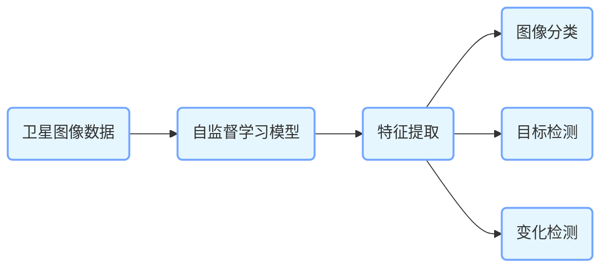

# 自监督学习在卫星图像分析中的应用

> 关键词：自监督学习、卫星图像分析、深度学习、遥感、特征提取、图像分类、目标检测

> 摘要：本文围绕自监督学习在卫星图像分析中的应用展开。首先介绍了自监督学习和卫星图像分析的背景知识，阐述了研究目的与范围、预期读者等内容。接着深入讲解自监督学习的核心概念、算法原理，通过Python代码进行详细阐述，并给出相关数学模型和公式。然后通过项目实战，展示自监督学习在卫星图像分析中的具体实现过程。随后探讨了自监督学习在卫星图像分析中的实际应用场景，推荐了相关的学习资源、开发工具和论文著作。最后总结了自监督学习在卫星图像分析领域的未来发展趋势与挑战，并给出常见问题解答和参考资料，旨在为相关领域的研究和实践提供全面且深入的技术指导。

## 1. 背景介绍 
### 1.1 目的和范围
随着卫星技术的不断发展，每天都会产生海量的卫星图像数据。这些数据蕴含着丰富的地理、环境和人类活动信息，对于城市规划、农业监测、环境评估、灾害预警等多个领域具有重要意义。然而，卫星图像数据的标注成本极高，需要专业的地理信息知识和大量的人力、时间投入。自监督学习作为一种无需大量标注数据的学习方法，为卫星图像分析提供了新的解决方案。

本文的目的在于深入探讨自监督学习在卫星图像分析中的应用原理、方法和实践案例。范围涵盖自监督学习的核心概念、算法原理、数学模型，以及在卫星图像分类、目标检测、变化检测等具体任务中的应用，并提供相关的学习资源和开发工具推荐。

### 1.2 预期读者
本文预期读者包括但不限于以下几类人群：
- **科研人员**：对遥感、计算机视觉、机器学习等领域的前沿技术感兴趣，希望深入了解自监督学习在卫星图像分析中的应用原理和研究进展。
- **工程师**：从事卫星图像分析、地理信息系统开发等相关工作，需要掌握自监督学习的具体实现方法和应用技巧，以解决实际项目中的问题。
- **学生**：学习计算机科学、地理学、遥感科学与技术等相关专业，希望通过本文了解自监督学习和卫星图像分析的基础知识和实践案例，为后续的学习和研究打下基础。

### 1.3 文档结构概述
本文的结构如下：
- **核心概念与联系**：介绍自监督学习和卫星图像分析的核心概念，以及它们之间的联系，通过文本示意图和Mermaid流程图进行直观展示。
- **核心算法原理 & 具体操作步骤**：详细讲解自监督学习的核心算法原理，并用Python源代码进行具体实现和阐述。
- **数学模型和公式 & 详细讲解 & 举例说明**：给出自监督学习的数学模型和公式，并进行详细讲解和举例说明。
- **项目实战：代码实际案例和详细解释说明**：通过一个具体的卫星图像分析项目，展示自监督学习的实际应用过程，包括开发环境搭建、源代码实现和代码解读。
- **实际应用场景**：探讨自监督学习在卫星图像分析中的实际应用场景，如土地利用分类、目标检测、变化检测等。
- **工具和资源推荐**：推荐相关的学习资源、开发工具和论文著作，帮助读者进一步深入学习和研究。
- **总结：未来发展趋势与挑战**：总结自监督学习在卫星图像分析领域的未来发展趋势和面临的挑战。
- **附录：常见问题与解答**：解答读者在学习和实践过程中可能遇到的常见问题。
- **扩展阅读 & 参考资料**：提供相关的扩展阅读材料和参考资料，方便读者进一步探索。

### 1.4 术语表
#### 1.4.1 核心术语定义
- **自监督学习（Self-Supervised Learning）**：一种无监督学习方法，通过从数据本身自动生成监督信号来学习数据的特征表示。
- **卫星图像（Satellite Image）**：由卫星上搭载的传感器获取的地球表面的图像数据。
- **特征提取（Feature Extraction）**：从原始数据中提取出具有代表性的特征的过程。
- **图像分类（Image Classification）**：将图像划分到不同类别的任务。
- **目标检测（Object Detection）**：在图像中定位和识别特定目标的任务。
- **变化检测（Change Detection）**：检测不同时间点的卫星图像中发生变化的区域的任务。

#### 1.4.2 相关概念解释
- **无监督学习（Unsupervised Learning）**：在没有标注数据的情况下，从数据中发现模式和结构的学习方法。自监督学习是无监督学习的一种特殊形式。
- **监督学习（Supervised Learning）**：使用标注数据进行学习的方法，通过输入数据和对应的标签来训练模型。
- **深度学习（Deep Learning）**：基于深度神经网络的机器学习方法，能够自动学习数据的复杂特征表示。

#### 1.4.3 缩略词列表
- **CNN（Convolutional Neural Network）**：卷积神经网络
- **ResNet（Residual Neural Network）**：残差神经网络
- **ViT（Vision Transformer）**：视觉Transformer
- **SSL（Self-Supervised Learning）**：自监督学习

## 2. 核心概念与联系 
### 自监督学习的核心概念
自监督学习的核心思想是利用数据本身的结构和信息来自动生成监督信号，从而学习数据的特征表示。在自监督学习中，模型不需要人工标注的标签，而是通过解决一些预定义的自监督任务来学习数据的内在规律。例如，在图像领域，常见的自监督任务包括图像旋转预测、图像拼图、颜色预测等。

### 卫星图像分析的核心概念
卫星图像分析是指对卫星获取的地球表面图像数据进行处理、分析和理解的过程。卫星图像分析的任务包括图像分类、目标检测、变化检测、图像分割等，旨在从卫星图像中提取有用的信息，为地理、环境、农业等领域的决策提供支持。

### 自监督学习与卫星图像分析的联系
自监督学习在卫星图像分析中具有重要的应用价值。由于卫星图像数据量巨大，标注成本高，自监督学习可以在没有大量标注数据的情况下学习卫星图像的特征表示，从而提高模型的泛化能力和性能。同时，自监督学习可以利用卫星图像数据的自身结构和信息，如不同波段之间的关系、图像的空间结构等，来设计自监督任务，从而更好地学习卫星图像的特征。

### 文本示意图
自监督学习在卫星图像分析中的应用可以用以下文本示意图表示：

卫星图像数据 -> 自监督学习模型（预训练） -> 特征提取 -> 下游任务（图像分类、目标检测、变化检测等）

### Mermaid 流程图


## 3. 核心算法原理 & 具体操作步骤 
### 自监督学习的核心算法原理
自监督学习的核心算法包括多个方面，下面以基于对比学习的自监督学习算法为例进行详细讲解。

对比学习的基本思想是通过对比正样本对和负样本对，学习数据的特征表示，使得正样本对的特征表示在特征空间中距离更近，负样本对的特征表示距离更远。

#### 算法步骤
1. **数据增强**：对输入的卫星图像进行随机的数据增强操作，如随机裁剪、旋转、颜色抖动等，生成两个不同的视图。
2. **特征提取**：将两个视图分别输入到编码器网络中，提取特征表示。
3. **对比损失计算**：计算正样本对（同一图像的两个视图）和负样本对（不同图像的视图）之间的对比损失。
4. **模型更新**：根据对比损失，使用优化算法更新编码器网络的参数。

### Python 源代码实现
```python
import torch
import torch.nn as nn
import torch.optim as optim
from torchvision import transforms, datasets
import torchvision.models as models

# 定义数据增强
train_transform = transforms.Compose([
    transforms.RandomResizedCrop(224),
    transforms.RandomHorizontalFlip(),
    transforms.ColorJitter(brightness=0.2, contrast=0.2, saturation=0.2, hue=0.1),
    transforms.ToTensor(),
    transforms.Normalize(mean=[0.485, 0.456, 0.406], std=[0.229, 0.224, 0.225])
])

# 加载卫星图像数据集
train_dataset = datasets.ImageFolder(root='path/to/satellite_images', transform=train_transform)
train_loader = torch.utils.data.DataLoader(train_dataset, batch_size=32, shuffle=True)

# 定义编码器网络
encoder = models.resnet50(pretrained=False)
encoder.fc = nn.Identity()  # 去掉最后一层全连接层

# 定义投影头
projection_head = nn.Sequential(
    nn.Linear(2048, 2048),
    nn.ReLU(),
    nn.Linear(2048, 128)
)

# 定义对比损失函数
criterion = nn.CrossEntropyLoss()

# 定义优化器
optimizer = optim.Adam(list(encoder.parameters()) + list(projection_head.parameters()), lr=0.001)

# 训练循环
for epoch in range(100):
    for images, _ in train_loader:
        # 生成两个不同的视图
        view1 = train_transform(images)
        view2 = train_transform(images)

        # 特征提取
        features1 = encoder(view1)
        features2 = encoder(view2)

        # 投影到低维空间
        projections1 = projection_head(features1)
        projections2 = projection_head(features2)

        # 计算对比损失
        logits = torch.matmul(projections1, projections2.T) / 0.1  # 温度参数
        labels = torch.arange(logits.shape[0]).to(logits.device)
        loss = (criterion(logits, labels) + criterion(logits.T, labels)) / 2

        # 模型更新
        optimizer.zero_grad()
        loss.backward()
        optimizer.step()

    print(f'Epoch {epoch+1}, Loss: {loss.item()}')
```

### 代码解释
1. **数据增强**：使用`torchvision.transforms`模块对卫星图像进行随机的数据增强操作，生成两个不同的视图。
2. **编码器网络**：使用预训练的ResNet50作为编码器网络，去掉最后一层全连接层，提取图像的特征表示。
3. **投影头**：将编码器提取的特征投影到低维空间，方便计算对比损失。
4. **对比损失函数**：使用交叉熵损失函数计算正样本对和负样本对之间的对比损失。
5. **优化器**：使用Adam优化器更新编码器网络和投影头的参数。
6. **训练循环**：在每个训练周期中，对卫星图像进行数据增强，提取特征，计算对比损失，并更新模型参数。

## 4. 数学模型和公式 & 详细讲解 & 举例说明 
### 对比学习的数学模型
对比学习的目标是学习一个编码器网络 $f(\cdot)$，将输入的图像 $x$ 映射到特征空间 $z = f(x)$，使得正样本对的特征表示在特征空间中距离更近，负样本对的特征表示距离更远。

对比损失函数通常使用InfoNCE（Info Noise Contrastive Estimation）损失，其数学公式如下：

$$
\mathcal{L}_{InfoNCE} = -\log \frac{\exp(\text{sim}(z_i, z_j)/\tau)}{\sum_{k=1}^{N} \exp(\text{sim}(z_i, z_k)/\tau)}
$$

其中，$z_i$ 和 $z_j$ 是正样本对的特征表示，$z_k$ 是负样本对的特征表示，$\text{sim}(\cdot, \cdot)$ 是相似度函数，通常使用点积相似度 $\text{sim}(a, b) = a^T b$，$\tau$ 是温度参数。

### 详细讲解
InfoNCE损失的核心思想是通过对比正样本对和负样本对的相似度，使得模型学习到能够区分正样本对和负样本对的特征表示。具体来说，对于一个正样本对 $(z_i, z_j)$，InfoNCE损失希望 $\exp(\text{sim}(z_i, z_j)/\tau)$ 在所有相似度得分的指数和中占比更大，从而使得正样本对的特征表示在特征空间中距离更近。

### 举例说明
假设我们有一个小批量的图像数据，包含 $N$ 个样本。对于每个样本 $x_i$，我们生成两个不同的视图 $x_{i1}$ 和 $x_{i2}$，对应的特征表示为 $z_{i1}$ 和 $z_{i2}$。那么，对于样本 $x_{i1}$，其正样本对为 $(z_{i1}, z_{i2})$，负样本对为 $(z_{i1}, z_{k2})$，其中 $k \neq i$。

我们可以计算样本 $x_{i1}$ 的InfoNCE损失如下：

$$
\mathcal{L}_{i1} = -\log \frac{\exp(\text{sim}(z_{i1}, z_{i2})/\tau)}{\exp(\text{sim}(z_{i1}, z_{i2})/\tau) + \sum_{k \neq i} \exp(\text{sim}(z_{i1}, z_{k2})/\tau)}
$$

整个小批量的InfoNCE损失为所有样本的损失之和：

$$
\mathcal{L} = \frac{1}{2N} \sum_{i=1}^{N} (\mathcal{L}_{i1} + \mathcal{L}_{i2})
$$

## 5. 项目实战：代码实际案例和详细解释说明 
### 5.1  开发环境搭建
#### 操作系统
本项目可以在Windows、Linux或macOS操作系统上运行。建议使用Linux操作系统，因为它在深度学习开发中具有更好的稳定性和性能。

#### 编程语言和框架
- **Python**：建议使用Python 3.7及以上版本。
- **PyTorch**：深度学习框架，用于构建和训练神经网络。可以根据自己的CUDA版本安装相应的PyTorch版本。

#### 依赖库安装
可以使用以下命令安装项目所需的依赖库：
```bash
pip install torch torchvision numpy matplotlib
```

### 5.2  源代码详细实现和代码解读
#### 数据加载和预处理
```python
import torch
from torchvision import transforms, datasets
from torch.utils.data import DataLoader

# 定义数据增强
train_transform = transforms.Compose([
    transforms.RandomResizedCrop(224),
    transforms.RandomHorizontalFlip(),
    transforms.ColorJitter(brightness=0.2, contrast=0.2, saturation=0.2, hue=0.1),
    transforms.ToTensor(),
    transforms.Normalize(mean=[0.485, 0.456, 0.406], std=[0.229, 0.224, 0.225])
])

# 加载卫星图像数据集
train_dataset = datasets.ImageFolder(root='path/to/satellite_images', transform=train_transform)
train_loader = DataLoader(train_dataset, batch_size=32, shuffle=True)
```
**代码解读**：
- `transforms.Compose`：用于组合多个数据增强操作。
- `RandomResizedCrop`：随机裁剪图像并调整大小。
- `RandomHorizontalFlip`：随机水平翻转图像。
- `ColorJitter`：随机调整图像的亮度、对比度、饱和度和色调。
- `ToTensor`：将图像转换为张量。
- `Normalize`：对图像进行归一化处理。
- `datasets.ImageFolder`：用于加载图像数据集，要求数据集按照类别文件夹进行组织。
- `DataLoader`：用于批量加载数据。

#### 模型定义
```python
import torch.nn as nn
import torchvision.models as models

# 定义编码器网络
encoder = models.resnet50(pretrained=False)
encoder.fc = nn.Identity()  # 去掉最后一层全连接层

# 定义投影头
projection_head = nn.Sequential(
    nn.Linear(2048, 2048),
    nn.ReLU(),
    nn.Linear(2048, 128)
)
```
**代码解读**：
- `models.resnet50`：使用预训练的ResNet50作为编码器网络。
- `nn.Identity()`：用于去掉最后一层全连接层，只保留特征提取部分。
- `nn.Sequential`：用于定义一个顺序的神经网络模块。
- `nn.Linear`：全连接层。
- `nn.ReLU`：激活函数。

#### 损失函数和优化器
```python
import torch.optim as optim

# 定义对比损失函数
criterion = nn.CrossEntropyLoss()

# 定义优化器
optimizer = optim.Adam(list(encoder.parameters()) + list(projection_head.parameters()), lr=0.001)
```
**代码解读**：
- `nn.CrossEntropyLoss`：交叉熵损失函数，用于计算对比损失。
- `optim.Adam`：Adam优化器，用于更新模型参数。

#### 训练循环
```python
for epoch in range(100):
    for images, _ in train_loader:
        # 生成两个不同的视图
        view1 = train_transform(images)
        view2 = train_transform(images)

        # 特征提取
        features1 = encoder(view1)
        features2 = encoder(view2)

        # 投影到低维空间
        projections1 = projection_head(features1)
        projections2 = projection_head(features2)

        # 计算对比损失
        logits = torch.matmul(projections1, projections2.T) / 0.1  # 温度参数
        labels = torch.arange(logits.shape[0]).to(logits.device)
        loss = (criterion(logits, labels) + criterion(logits.T, labels)) / 2

        # 模型更新
        optimizer.zero_grad()
        loss.backward()
        optimizer.step()

    print(f'Epoch {epoch+1}, Loss: {loss.item()}')
```
**代码解读**：
- `train_transform`：对图像进行数据增强，生成两个不同的视图。
- `encoder`：提取图像的特征表示。
- `projection_head`：将特征投影到低维空间。
- `torch.matmul`：计算特征的点积相似度。
- `criterion`：计算对比损失。
- `optimizer.zero_grad()`：清空梯度。
- `loss.backward()`：反向传播计算梯度。
- `optimizer.step()`：更新模型参数。

### 5.3  代码解读与分析
#### 数据增强的作用
数据增强可以增加数据的多样性，提高模型的泛化能力。在卫星图像分析中，由于卫星图像的复杂性和多样性，数据增强可以帮助模型学习到更鲁棒的特征表示。

#### 对比损失的作用
对比损失通过对比正样本对和负样本对的相似度，使得模型学习到能够区分正样本对和负样本对的特征表示。在自监督学习中，对比损失可以帮助模型学习到数据的内在结构和信息。

#### 模型更新的过程
模型更新的过程是通过反向传播算法计算梯度，并使用优化器更新模型参数。在每个训练步骤中，模型根据对比损失调整参数，使得正样本对的特征表示在特征空间中距离更近，负样本对的特征表示距离更远。

## 6. 实际应用场景 
### 土地利用分类
土地利用分类是卫星图像分析中的一个重要任务，旨在将卫星图像中的土地划分为不同的类别，如耕地、林地、草地、水域等。自监督学习可以在没有大量标注数据的情况下学习卫星图像的特征表示，从而提高土地利用分类的准确性和效率。

### 目标检测
目标检测是在卫星图像中定位和识别特定目标的任务，如建筑物、车辆、船只等。自监督学习可以帮助模型学习到目标的通用特征，从而提高目标检测的性能。

### 变化检测
变化检测是检测不同时间点的卫星图像中发生变化的区域的任务，如城市扩张、土地覆盖变化、自然灾害等。自监督学习可以学习到卫星图像的时空特征，从而更好地检测出图像中的变化区域。

### 环境监测
环境监测是利用卫星图像监测地球环境变化的任务，如植被覆盖变化、水体污染、空气质量等。自监督学习可以帮助模型学习到环境相关的特征，从而提高环境监测的准确性和及时性。

## 7. 工具和资源推荐
### 7.1 学习资源推荐
#### 7.1.1 书籍推荐
- 《深度学习》（Deep Learning）：由Ian Goodfellow、Yoshua Bengio和Aaron Courville合著，是深度学习领域的经典教材。
- 《遥感图像处理与分析》（Remote Sensing Image Processing and Analysis）：介绍了遥感图像处理和分析的基本原理和方法。
- 《计算机视觉：算法与应用》（Computer Vision: Algorithms and Applications）：涵盖了计算机视觉的各个方面，包括图像分类、目标检测、图像分割等。

#### 7.1.2 在线课程
- Coursera上的“深度学习专项课程”（Deep Learning Specialization）：由Andrew Ng教授授课，是深度学习领域的经典在线课程。
- edX上的“遥感与地理信息系统”（Remote Sensing and Geographic Information Systems）：介绍了遥感和地理信息系统的基本原理和应用。
- 哔哩哔哩上的“动手学深度学习”（Dive into Deep Learning）：由李沐等人主讲，通过实践项目介绍深度学习的基本原理和应用。

#### 7.1.3 技术博客和网站
- Medium：有很多关于深度学习和遥感的技术博客文章。
- arXiv：可以查找最新的学术论文和研究成果。
- Kaggle：提供了很多卫星图像分析的竞赛和数据集，可以学习到实际项目中的经验和技巧。

### 7.2 开发工具框架推荐
#### 7.2.1 IDE和编辑器
- PyCharm：功能强大的Python集成开发环境，适合开发深度学习项目。
- Visual Studio Code：轻量级的代码编辑器，支持多种编程语言和插件扩展。

#### 7.2.2 调试和性能分析工具
- TensorBoard：用于可视化深度学习模型的训练过程和性能指标。
- PyTorch Profiler：用于分析PyTorch模型的性能瓶颈。

#### 7.2.3 相关框架和库
- PyTorch：深度学习框架，提供了丰富的神经网络模块和优化算法。
- torchvision：PyTorch的计算机视觉库，提供了常用的图像数据集、模型和数据增强方法。
- scikit-learn：机器学习库，提供了常用的机器学习算法和工具。

### 7.3 相关论文著作推荐
#### 7.3.1 经典论文
- “Momentum Contrast for Unsupervised Visual Representation Learning”：提出了基于动量对比的自监督学习方法。
- “A Simple Framework for Contrastive Learning of Visual Representations”：提出了SimCLR自监督学习框架。
- “Remote Sensing Image Classification Based on Deep Learning: A Review”：对基于深度学习的遥感图像分类方法进行了综述。

#### 7.3.2 最新研究成果
- 关注arXiv上的最新论文，了解自监督学习在卫星图像分析领域的最新研究进展。
- 参加相关的学术会议，如IEEE International Geoscience and Remote Sensing Symposium（IGARSS），获取最新的研究成果。

#### 7.3.3 应用案例分析
- 查看相关的研究报告和项目文档，了解自监督学习在实际卫星图像分析项目中的应用案例和经验总结。

## 8. 总结：未来发展趋势与挑战
### 未来发展趋势
- **多模态融合**：将卫星图像与其他模态的数据，如气象数据、地形数据、社交媒体数据等进行融合，提高卫星图像分析的准确性和全面性。
- **自监督学习与强化学习的结合**：利用自监督学习学习数据的特征表示，利用强化学习进行决策和优化，提高卫星图像分析的智能水平。
- **大规模预训练模型**：类似于自然语言处理中的大规模预训练模型，在卫星图像领域也将出现大规模预训练模型，通过自监督学习在大规模卫星图像数据上进行预训练，然后在具体任务上进行微调，提高模型的性能和泛化能力。
- **跨域迁移学习**：将在一个领域或地区训练的自监督学习模型迁移到其他领域或地区，解决不同地区卫星图像数据差异大、标注数据少的问题。

### 挑战
- **数据质量和标注问题**：卫星图像数据存在噪声、云遮挡、光照变化等问题，影响数据质量。同时，卫星图像数据的标注成本高，标注难度大，需要专业的地理信息知识。
- **计算资源需求**：自监督学习通常需要大量的计算资源和时间，尤其是在处理大规模卫星图像数据时，对计算资源的需求更加突出。
- **模型可解释性**：深度学习模型通常是黑盒模型，缺乏可解释性。在卫星图像分析中，模型的可解释性对于决策和应用非常重要，需要进一步研究和解决。
- **数据安全和隐私问题**：卫星图像数据涉及到地理信息和隐私问题，需要加强数据安全和隐私保护，防止数据泄露和滥用。

## 9. 附录：常见问题与解答
### 问题1：自监督学习在卫星图像分析中的优势是什么？
自监督学习在卫星图像分析中的优势主要包括：
- 无需大量标注数据：卫星图像数据标注成本高，自监督学习可以在没有大量标注数据的情况下学习数据的特征表示，降低标注成本。
- 提高模型泛化能力：自监督学习可以学习到数据的内在结构和信息，从而提高模型的泛化能力，在不同的数据集和任务上都能取得较好的性能。
- 利用数据自身信息：自监督学习可以利用卫星图像数据的自身结构和信息，如不同波段之间的关系、图像的空间结构等，来设计自监督任务，从而更好地学习卫星图像的特征。

### 问题2：如何选择合适的自监督学习算法？
选择合适的自监督学习算法需要考虑以下因素：
- 数据特点：不同的自监督学习算法适用于不同类型的数据。例如，基于对比学习的算法适用于图像数据，而基于生成模型的算法适用于文本数据。
- 任务需求：不同的自监督学习算法在不同的任务上表现不同。例如，在图像分类任务中，基于对比学习的算法通常表现较好；在图像生成任务中，基于生成模型的算法通常表现较好。
- 计算资源：不同的自监督学习算法对计算资源的需求不同。例如，基于Transformer的算法通常需要更多的计算资源，而基于卷积神经网络的算法相对较少。

### 问题3：自监督学习模型的训练时间通常需要多久？
自监督学习模型的训练时间取决于多个因素，如数据集大小、模型复杂度、计算资源等。一般来说，在大规模卫星图像数据集上训练自监督学习模型可能需要数天甚至数周的时间。为了缩短训练时间，可以采用分布式训练、模型量化等技术。

### 问题4：如何评估自监督学习模型在卫星图像分析中的性能？
评估自监督学习模型在卫星图像分析中的性能可以采用以下方法：
- 下游任务评估：将自监督学习模型学习到的特征表示应用到具体的下游任务中，如图像分类、目标检测等，通过评估下游任务的性能来间接评估自监督学习模型的性能。
- 特征可视化：通过可视化自监督学习模型学习到的特征表示，观察特征的分布和聚类情况，评估模型学习到的特征的质量。
- 对比实验：与其他监督学习模型或无监督学习模型进行对比实验，比较不同模型在相同任务上的性能，评估自监督学习模型的优势和不足。

## 10. 扩展阅读 & 参考资料
### 扩展阅读
- 《遥感数字图像处理》（Remote Sensing Digital Image Processing）：深入介绍了遥感数字图像处理的原理和方法。
- 《深度学习中的注意力机制》（Attention Mechanisms in Deep Learning）：介绍了深度学习中的注意力机制及其在计算机视觉、自然语言处理等领域的应用。
- 《强化学习导论》（Reinforcement Learning: An Introduction）：介绍了强化学习的基本原理和算法。

### 参考资料
- Goodfellow, I., Bengio, Y., & Courville, A. (2016). Deep Learning. MIT Press.
- Chen, T., Kornblith, S., Norouzi, M., & Hinton, G. (2020). A Simple Framework for Contrastive Learning of Visual Representations. arXiv preprint arXiv:2002.05709.
- He, K., Fan, H., Wu, Y., Xie, S., & Girshick, R. (2020). Momentum Contrast for Unsupervised Visual Representation Learning. In Proceedings of the IEEE/CVF Conference on Computer Vision and Pattern Recognition (pp. 9729-9738).
- Zhu, X. X., Tuia, D., Mou, L., Xia, G. S., Zhang, L., Xu, F., ... & Fua, P. (2017). Deep Learning in Remote Sensing: A Comprehensive Review and List of Resources. IEEE Geoscience and Remote Sensing Magazine, 5(4), 8-36.