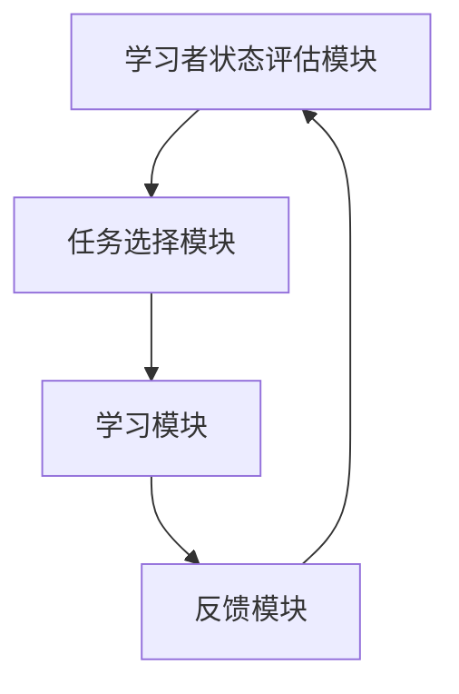

# 自适应课程学习优化AI推理的知识获取效率提升

> 关键词：自适应课程学习、AI推理、知识获取效率、优化策略、学习模型

> 摘要：本文聚焦于自适应课程学习在优化AI推理的知识获取效率提升方面的应用与研究。详细阐述了自适应课程学习的核心概念、算法原理、数学模型等内容，通过项目实战展示其在实际应用中的效果。深入探讨了该技术在不同场景下的应用，推荐了相关的学习资源、开发工具和论文著作。最后总结了未来发展趋势与挑战，并对常见问题进行了解答。旨在为相关领域的研究人员和开发者提供全面且深入的技术参考，推动自适应课程学习在AI领域的进一步发展。

## 1. 背景介绍 
### 1.1 目的和范围
在人工智能领域，知识获取效率一直是影响AI推理性能的关键因素。传统的学习方法往往缺乏对学习者个体差异和学习过程动态变化的考虑，导致知识获取效率不高。自适应课程学习作为一种新兴的学习策略，旨在根据学习者的能力和学习进度，动态调整学习内容和顺序，从而提高知识获取效率，优化AI推理性能。本文的研究范围涵盖了自适应课程学习的基本概念、算法原理、数学模型、实际应用等多个方面，旨在全面深入地探讨其在提升AI推理知识获取效率方面的作用和价值。

### 1.2 预期读者
本文预期读者包括人工智能领域的研究人员、开发者、学生以及对自适应学习和AI推理感兴趣的技术爱好者。对于研究人员，本文提供了深入的理论分析和最新的研究进展；对于开发者，文中包含的项目实战案例和代码实现可作为实际开发的参考；对于学生和技术爱好者，详细的概念解释和丰富的学习资源推荐有助于他们快速入门和深入学习。

### 1.3 文档结构概述
本文将按照以下结构展开：首先介绍自适应课程学习的背景和相关概念；接着阐述其核心算法原理和具体操作步骤，并给出相应的Python代码实现；然后介绍相关的数学模型和公式，并通过举例进行详细讲解；之后通过项目实战展示自适应课程学习在实际中的应用；再探讨其实际应用场景；推荐相关的学习资源、开发工具和论文著作；最后总结未来发展趋势与挑战，解答常见问题并提供扩展阅读和参考资料。

### 1.4 术语表
#### 1.4.1 核心术语定义
- **自适应课程学习（Adaptive Curriculum Learning）**：一种学习策略，根据学习者的当前状态（如知识水平、学习能力等）动态调整学习任务的难度和顺序，以提高学习效率。
- **AI推理（AI Inference）**：指人工智能系统根据已学习的知识和模型，对新的输入数据进行处理和判断，得出相应结论的过程。
- **知识获取效率（Knowledge Acquisition Efficiency）**：衡量学习者在单位时间内获取有效知识的能力和速度。

#### 1.4.2 相关概念解释
- **课程学习（Curriculum Learning）**：是一种将学习任务按照一定的顺序进行组织和安排的学习方法，通常从简单任务开始，逐步过渡到复杂任务。自适应课程学习是课程学习的进一步发展，它能够根据学习者的实际情况动态调整课程。
- **强化学习（Reinforcement Learning）**：一种通过智能体与环境进行交互，根据环境反馈的奖励信号来学习最优行为策略的机器学习方法。在自适应课程学习中，强化学习可用于动态调整学习任务的难度。

#### 1.4.3 缩略词列表
- **AI**：Artificial Intelligence（人工智能）
- **RL**：Reinforcement Learning（强化学习）

## 2. 核心概念与联系 

### 核心概念原理
自适应课程学习的核心原理是根据学习者的当前状态和学习进度，动态地选择合适的学习任务。它基于这样一个假设：学习者在面对难度适中的任务时，学习效果最佳。如果任务过于简单，学习者可能会感到无聊，无法充分发挥其学习潜力；如果任务过于困难，学习者可能会感到挫败，导致学习效率低下。因此，自适应课程学习通过不断评估学习者的能力，调整学习任务的难度和顺序，使学习者始终处于一个适度挑战的学习环境中。

在AI推理的背景下，自适应课程学习可以帮助AI模型更高效地获取知识。通过动态调整训练数据的难度和顺序，模型可以更快地收敛到最优解，提高推理性能。例如，在图像识别任务中，模型可以先从简单的图像分类任务开始学习，逐渐过渡到复杂的目标检测和语义分割任务。

### 架构的文本示意图
自适应课程学习系统主要由以下几个部分组成：
1. **学习者状态评估模块**：负责评估学习者的当前状态，包括知识水平、学习能力、学习进度等。评估方法可以基于学习者的历史学习数据、测试成绩、行为表现等。
2. **任务选择模块**：根据学习者的状态评估结果，从任务池中选择合适的学习任务。任务池中的任务按照难度等级进行分类，任务选择模块会根据学习者的能力选择难度适中的任务。
3. **学习模块**：学习者在选择的任务上进行学习，通过与任务的交互获取知识和技能。
4. **反馈模块**：将学习者的学习结果反馈给学习者状态评估模块，以便更新学习者的状态信息。

### Mermaid 流程图


## 3. 核心算法原理 & 具体操作步骤 

### 核心算法原理
自适应课程学习的核心算法可以基于强化学习实现。以下是一个简单的基于Q学习算法的自适应课程学习示例。

Q学习是一种无模型的强化学习算法，它通过学习一个动作价值函数 $Q(s,a)$ 来确定在状态 $s$ 下采取动作 $a$ 的价值。在自适应课程学习中，状态 $s$ 可以表示学习者的当前状态，动作 $a$ 可以表示选择的学习任务。

Q学习的更新公式为：
$$Q(s,a) \leftarrow Q(s,a) + \alpha [r + \gamma \max_{a'} Q(s',a') - Q(s,a)]$$
其中，$\alpha$ 是学习率，$r$ 是奖励信号，$\gamma$ 是折扣因子，$s'$ 是下一个状态。

### 具体操作步骤
1. **初始化**：初始化Q表 $Q(s,a)$，将所有的 $Q$ 值设置为0。
2. **选择任务**：根据当前学习者状态 $s$，使用 $\epsilon$-贪心策略选择一个学习任务 $a$。$\epsilon$-贪心策略以 $\epsilon$ 的概率随机选择一个任务，以 $1 - \epsilon$ 的概率选择 $Q(s,a)$ 值最大的任务。
3. **执行任务**：学习者执行选择的任务，得到奖励信号 $r$ 和下一个状态 $s'$。
4. **更新Q表**：根据Q学习的更新公式更新 $Q(s,a)$。
5. **重复步骤2 - 4**：直到达到终止条件。

### Python源代码实现
```python
import numpy as np

# 定义Q学习类
class QLearning:
    def __init__(self, state_size, action_size, learning_rate=0.1, discount_factor=0.9, epsilon=0.1):
        self.state_size = state_size
        self.action_size = action_size
        self.learning_rate = learning_rate
        self.discount_factor = discount_factor
        self.epsilon = epsilon
        self.q_table = np.zeros((state_size, action_size))

    def choose_action(self, state):
        if np.random.uniform(0, 1) < self.epsilon:
            # 随机选择一个动作
            action = np.random.choice(self.action_size)
        else:
            # 选择Q值最大的动作
            action = np.argmax(self.q_table[state, :])
        return action

    def update_q_table(self, state, action, reward, next_state):
        # Q学习更新公式
        predict = self.q_table[state, action]
        target = reward + self.discount_factor * np.max(self.q_table[next_state, :])
        self.q_table[state, action] += self.learning_rate * (target - predict)
```

## 4. 数学模型和公式 & 详细讲解 & 举例说明 

### 数学模型和公式
#### Q学习更新公式
如前面所述，Q学习的更新公式为：
$$Q(s,a) \leftarrow Q(s,a) + \alpha [r + \gamma \max_{a'} Q(s',a') - Q(s,a)]$$
其中：
- $Q(s,a)$ 表示在状态 $s$ 下采取动作 $a$ 的动作价值。
- $\alpha$ 是学习率，控制每次更新的步长。$\alpha$ 越大，更新速度越快，但可能会导致算法不稳定；$\alpha$ 越小，更新速度越慢，但算法更稳定。
- $r$ 是奖励信号，表示在状态 $s$ 下采取动作 $a$ 后得到的即时奖励。
- $\gamma$ 是折扣因子，取值范围在 $[0,1]$ 之间。$\gamma$ 越接近1，表示算法更注重长远奖励；$\gamma$ 越接近0，表示算法更注重即时奖励。
- $\max_{a'} Q(s',a')$ 表示在下一个状态 $s'$ 下所有可能动作中最大的动作价值。

#### 期望累计奖励
在强化学习中，我们通常关心的是智能体在一个序列的状态和动作下的期望累计奖励。设 $R_t$ 表示从时间步 $t$ 开始的累计奖励，则：
$$R_t = r_t + \gamma r_{t+1} + \gamma^2 r_{t+2} + \cdots$$
其中，$r_i$ 表示在时间步 $i$ 得到的奖励。

### 详细讲解
Q学习的目标是通过不断更新Q表，使得 $Q(s,a)$ 能够逼近最优动作价值函数 $Q^*(s,a)$。最优动作价值函数表示在状态 $s$ 下采取动作 $a$ 后，遵循最优策略所能获得的期望累计奖励。

在每次更新Q表时，我们使用当前的奖励信号 $r$ 和下一个状态的最大动作价值 $\max_{a'} Q(s',a')$ 来更新当前状态和动作的Q值。这样，Q表会逐渐收敛到最优动作价值函数。

### 举例说明
假设我们有一个简单的自适应课程学习场景，学习者的状态有3种（$s_0, s_1, s_2$），学习任务有2种（$a_0, a_1$）。初始时，Q表的值都为0。

学习者当前状态为 $s_0$，使用 $\epsilon$-贪心策略选择动作 $a_1$。执行任务后，得到奖励 $r = 1$，下一个状态为 $s_1$。

设学习率 $\alpha = 0.1$，折扣因子 $\gamma = 0.9$。则更新Q表的过程如下：
- 初始时，$Q(s_0,a_1) = 0$。
- 计算目标值：$\max_{a'} Q(s_1,a')$，假设当前 $Q(s_1,a_0) = 0$，$Q(s_1,a_1) = 0$，则 $\max_{a'} Q(s_1,a') = 0$。
- 计算更新值：$Q(s_0,a_1) \leftarrow Q(s_0,a_1) + \alpha [r + \gamma \max_{a'} Q(s_1,a') - Q(s_0,a_1)] = 0 + 0.1 [1 + 0.9 \times 0 - 0] = 0.1$。

经过多次更新，Q表会逐渐收敛到最优值。

## 5. 项目实战：代码实际案例和详细解释说明 

### 5.1  开发环境搭建
#### 操作系统
可以选择Windows、Linux或macOS操作系统。
#### 编程语言
使用Python 3.x版本。
#### 依赖库
安装以下Python库：
- `numpy`：用于数值计算。
- `matplotlib`：用于数据可视化（可选）。

可以使用以下命令安装依赖库：
```sh
pip install numpy matplotlib
```

### 5.2  源代码详细实现和代码解读
以下是一个完整的自适应课程学习项目实战代码示例：
```python
import numpy as np
import matplotlib.pyplot as plt

# 定义Q学习类
class QLearning:
    def __init__(self, state_size, action_size, learning_rate=0.1, discount_factor=0.9, epsilon=0.1):
        self.state_size = state_size
        self.action_size = action_size
        self.learning_rate = learning_rate
        self.discount_factor = discount_factor
        self.epsilon = epsilon
        self.q_table = np.zeros((state_size, action_size))

    def choose_action(self, state):
        if np.random.uniform(0, 1) < self.epsilon:
            # 随机选择一个动作
            action = np.random.choice(self.action_size)
        else:
            # 选择Q值最大的动作
            action = np.argmax(self.q_table[state, :])
        return action

    def update_q_table(self, state, action, reward, next_state):
        # Q学习更新公式
        predict = self.q_table[state, action]
        target = reward + self.discount_factor * np.max(self.q_table[next_state, :])
        self.q_table[state, action] += self.learning_rate * (target - predict)

# 定义环境类
class Environment:
    def __init__(self, state_size, action_size):
        self.state_size = state_size
        self.action_size = action_size
        self.current_state = np.random.randint(0, state_size)

    def step(self, action):
        # 简单的环境反馈，根据动作返回奖励和下一个状态
        next_state = (self.current_state + action) % self.state_size
        if next_state == 0:
            reward = 1
        else:
            reward = 0
        self.current_state = next_state
        return next_state, reward

# 主函数
def main():
    state_size = 5
    action_size = 2
    episodes = 1000

    # 初始化Q学习和环境
    q_learning = QLearning(state_size, action_size)
    env = Environment(state_size, action_size)

    rewards = []
    for episode in range(episodes):
        state = env.current_state
        total_reward = 0
        for _ in range(10):
            action = q_learning.choose_action(state)
            next_state, reward = env.step(action)
            q_learning.update_q_table(state, action, reward, next_state)
            state = next_state
            total_reward += reward
        rewards.append(total_reward)

    # 绘制奖励曲线
    plt.plot(rewards)
    plt.xlabel('Episode')
    plt.ylabel('Total Reward')
    plt.title('Adaptive Curriculum Learning with Q-Learning')
    plt.show()

if __name__ == "__main__":
    main()
```

### 5.3  代码解读与分析
#### QLearning类
- `__init__` 方法：初始化Q学习的参数，包括状态数量、动作数量、学习率、折扣因子和探索率，同时初始化Q表。
- `choose_action` 方法：根据 $\epsilon$-贪心策略选择一个动作。
- `update_q_table` 方法：根据Q学习的更新公式更新Q表。

#### Environment类
- `__init__` 方法：初始化环境的状态数量、动作数量，并随机选择一个初始状态。
- `step` 方法：根据动作返回下一个状态和奖励。在这个简单的环境中，如果下一个状态为0，则奖励为1，否则为0。

#### main函数
- 初始化Q学习和环境。
- 进行1000个回合的训练，每个回合中学习者执行10个时间步的学习任务。
- 记录每个回合的总奖励，并绘制奖励曲线。

通过观察奖励曲线，我们可以判断算法的学习效果。如果奖励曲线逐渐上升，说明算法在不断学习和优化。

## 6. 实际应用场景 
### 教育领域
在在线教育平台中，自适应课程学习可以根据学生的学习进度和能力，为每个学生定制个性化的学习课程。例如，对于数学课程，系统可以先评估学生的数学基础，然后从简单的知识点开始教学，逐步增加难度。当学生掌握了一定的知识后，系统会自动调整课程内容，提供更具挑战性的学习任务，从而提高学生的学习效率和学习效果。

### 智能客服领域
在智能客服系统中，自适应课程学习可以帮助客服机器人不断学习和优化回答策略。客服机器人可以根据用户的问题类型和难度，动态调整回答的方式和内容。对于简单的问题，机器人可以快速给出准确的回答；对于复杂的问题，机器人可以通过与用户的交互，逐步获取更多信息，然后提供更详细的解决方案。

### 游戏领域
在游戏开发中，自适应课程学习可以用于设计智能对手。智能对手可以根据玩家的游戏水平和策略，动态调整自己的行为和难度。例如，在棋类游戏中，智能对手可以先采用简单的策略与玩家对战，随着玩家水平的提高，逐渐增加自己的难度，为玩家提供更具挑战性的游戏体验。

### 医疗领域
在医疗诊断辅助系统中，自适应课程学习可以帮助系统根据患者的病情和症状，逐步学习和积累诊断知识。系统可以先从常见的疾病诊断开始学习，随着经验的积累，逐渐处理复杂的病例。通过自适应学习，系统可以提高诊断的准确性和效率，为医生提供更可靠的诊断建议。

## 7. 工具和资源推荐
### 7.1 学习资源推荐
#### 7.1.1 书籍推荐
- 《Reinforcement Learning: An Introduction》（《强化学习：原理与Python实现》）：这是一本强化学习领域的经典教材，全面介绍了强化学习的基本概念、算法和应用。
- 《Artificial Intelligence: A Modern Approach》（《人工智能：一种现代的方法》）：涵盖了人工智能的各个方面，包括机器学习、知识表示、推理等，对理解自适应课程学习的背景和相关技术有很大帮助。

#### 7.1.2 在线课程
- Coursera上的“Reinforcement Learning Specialization”：由知名学者授课，提供了系统的强化学习课程，包括理论讲解、编程实践等内容。
- edX上的“Artificial Intelligence”：全面介绍人工智能的相关知识，其中包含了机器学习和强化学习的部分内容。

#### 7.1.3 技术博客和网站
- OpenAI Blog：OpenAI发布的最新研究成果和技术文章，涵盖了人工智能的多个领域，包括强化学习和自适应学习。
- Medium上的AI相关博客：有很多人工智能领域的专家和开发者分享他们的研究成果和实践经验。

### 7.2 开发工具框架推荐
#### 7.2.1 IDE和编辑器
- PyCharm：一款功能强大的Python集成开发环境，提供了代码编辑、调试、版本控制等功能，适合Python开发。
- Visual Studio Code：一款轻量级的代码编辑器，支持多种编程语言，有丰富的插件扩展功能。

#### 7.2.2 调试和性能分析工具
- PDB：Python自带的调试工具，可以帮助开发者定位代码中的问题。
- cProfile：Python的性能分析工具，可以分析代码的运行时间和函数调用情况。

#### 7.2.3 相关框架和库
- Gym：OpenAI开发的一个开源的强化学习环境库，提供了多种模拟环境，方便开发者进行强化学习算法的测试和开发。
- Stable Baselines：一个基于TensorFlow和PyTorch的强化学习库，提供了多种预训练的强化学习算法，方便开发者快速实现和应用。

### 7.3 相关论文著作推荐
#### 7.3.1 经典论文
- “Curriculum Learning”（Bengio et al., 2009）：该论文首次提出了课程学习的概念，为自适应课程学习的研究奠定了基础。
- “Playing Atari with Deep Reinforcement Learning”（Mnih et al., 2013）：介绍了深度强化学习在Atari游戏中的应用，展示了强化学习的强大能力。

#### 7.3.2 最新研究成果
- 关注顶级人工智能会议（如NeurIPS、ICML、CVPR等）上发表的关于自适应课程学习和强化学习的论文，了解最新的研究进展。

#### 7.3.3 应用案例分析
- 查看相关领域的应用案例论文，如教育、医疗、游戏等领域，了解自适应课程学习在实际应用中的效果和经验。

## 8. 总结：未来发展趋势与挑战
### 未来发展趋势
- **与深度学习的深度融合**：随着深度学习的不断发展，自适应课程学习与深度学习的结合将更加紧密。通过将自适应课程学习应用于深度学习模型的训练中，可以提高模型的训练效率和性能，加速模型的收敛。
- **多智能体自适应学习**：在多智能体系统中，每个智能体都可以根据自身的状态和其他智能体的行为进行自适应学习。多智能体自适应学习将在机器人协作、网络安全等领域有广泛的应用前景。
- **个性化学习的进一步发展**：在教育、医疗等领域，自适应课程学习将进一步实现个性化学习。根据每个学习者或患者的独特需求和特征，提供更加精准的学习或治疗方案。

### 挑战
- **状态评估的准确性**：准确评估学习者的状态是自适应课程学习的关键。然而，学习者的状态是复杂多变的，包括知识水平、学习能力、学习动机等多个方面。如何准确地评估这些状态，是一个亟待解决的问题。
- **计算资源的需求**：自适应课程学习通常需要大量的计算资源，特别是在处理复杂的任务和大规模的数据时。如何在有限的计算资源下实现高效的自适应学习，是一个挑战。
- **伦理和隐私问题**：在自适应课程学习中，需要收集和处理大量的学习者数据。如何保护学习者的隐私，避免数据泄露和滥用，是一个重要的伦理问题。

## 9. 附录：常见问题与解答
### 1. 自适应课程学习与传统课程学习有什么区别？
传统课程学习通常按照固定的顺序和难度安排学习任务，而自适应课程学习会根据学习者的实际情况动态调整学习任务的难度和顺序，更能满足学习者的个性化需求，提高学习效率。

### 2. 如何选择合适的学习率和折扣因子？
学习率和折扣因子的选择通常需要通过实验来确定。一般来说，学习率可以在 $0.1 - 0.01$ 之间选择，折扣因子可以在 $0.9 - 0.99$ 之间选择。可以通过多次实验，观察算法的收敛速度和性能，选择最优的参数值。

### 3. 自适应课程学习在实际应用中需要注意什么？
在实际应用中，需要注意以下几点：
- 准确评估学习者的状态，确保任务选择的合理性。
- 合理设置学习率、折扣因子等参数，避免算法不稳定或收敛缓慢。
- 保护学习者的隐私，确保数据的安全和合规使用。

## 10. 扩展阅读 & 参考资料
### 扩展阅读
- 阅读更多关于强化学习、深度学习、机器学习等领域的书籍和论文，深入了解相关技术的原理和应用。
- 关注人工智能领域的最新研究动态和发展趋势，参加相关的学术会议和技术交流活动。

### 参考资料
- Bengio, Y., Louradour, J., Collobert, R., & Weston, J. (2009). Curriculum learning. In Proceedings of the 26th annual international conference on machine learning (pp. 41-48).
- Mnih, V., Kavukcuoglu, K., Silver, D., Graves, A., Antonoglou, I., Wierstra, D., & Riedmiller, M. (2013). Playing atari with deep reinforcement learning. arXiv preprint arXiv:1312.5602.
- Sutton, R. S., & Barto, A. G. (2018). Reinforcement learning: An introduction. MIT press.
- Russell, S. J., & Norvig, P. (2016). Artificial intelligence: A modern approach. Pearson.