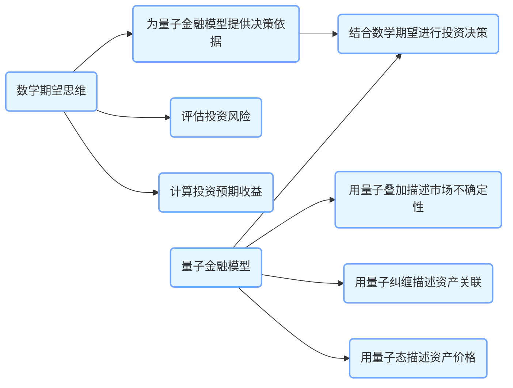

# 芒格的“数学期望”思维在量子金融模型中的应用

> 关键词：芒格、数学期望、量子金融模型、金融投资、决策分析

> 摘要：本文旨在深入探讨芒格的“数学期望”思维在量子金融模型中的应用。首先介绍了背景知识，包括目的范围、预期读者等内容。接着阐述了核心概念及联系，通过文本示意图和 Mermaid 流程图进行清晰展示。详细讲解了核心算法原理，结合 Python 源代码进行说明，同时给出相关数学模型和公式并举例。通过项目实战，展示代码案例并进行详细解读。分析了实际应用场景，推荐了相关工具和资源。最后总结未来发展趋势与挑战，解答常见问题并提供扩展阅读与参考资料，帮助读者全面理解和掌握“数学期望”思维在量子金融模型中的重要作用及应用方法。

## 1. 背景介绍 
### 1.1 目的和范围
本研究的目的在于揭示芒格的“数学期望”思维在量子金融模型中的具体应用方式及其带来的价值。范围涵盖了从理论基础的阐述到实际应用案例的分析，涉及到金融市场的多个层面，包括股票、债券、衍生品等领域。通过将“数学期望”思维引入量子金融模型，旨在为金融从业者和研究者提供一种新的视角和方法，以更好地进行风险评估、投资决策和资产定价。

### 1.2 预期读者
本文预期读者包括金融领域的专业人士，如投资经理、交易员、金融分析师等，他们可以从文中获取新的决策思路和方法；同时也面向对金融数学和量子金融感兴趣的学者和学生，为他们的研究和学习提供参考；对于对金融市场有一定了解并希望深入学习的普通投资者，也能从本文中获得有益的启示。

### 1.3 文档结构概述
本文首先介绍相关背景知识，让读者对研究的目的、范围和预期读者有清晰的认识。接着阐述核心概念与联系，通过图形化的方式帮助读者理解“数学期望”思维和量子金融模型的原理及关系。然后详细讲解核心算法原理和具体操作步骤，结合 Python 代码进行说明。给出相关数学模型和公式，并通过具体例子进行讲解。通过项目实战展示代码的实际应用和详细解读。分析“数学期望”思维在量子金融模型中的实际应用场景。推荐相关的学习资源、开发工具框架和论文著作。最后总结未来发展趋势与挑战，解答常见问题并提供扩展阅读与参考资料。

### 1.4 术语表
#### 1.4.1 核心术语定义
- **数学期望**：在概率论和统计学中，数学期望是试验中每次可能结果的概率乘以其结果的总和，反映了随机变量取值的平均水平。对于离散型随机变量 $X$，其数学期望 $E(X)$ 的计算公式为 $E(X)=\sum_{i}x_{i}P(X = x_{i})$，其中 $x_{i}$ 是随机变量 $X$ 的取值，$P(X = x_{i})$ 是取值 $x_{i}$ 对应的概率。
- **量子金融模型**：是将量子力学的原理和方法应用于金融领域的一种新型模型。它利用量子态、量子纠缠、量子叠加等概念来描述金融市场中的不确定性和复杂性，试图更准确地模拟金融资产的价格波动和市场行为。
- **风险评估**：是对投资或金融活动中可能面临的风险进行识别、分析和评估的过程，通过量化风险因素，帮助投资者做出合理的决策。
- **投资决策**：是指投资者在进行投资活动时，根据自身的投资目标、风险承受能力和市场情况等因素，选择合适的投资对象和投资策略的过程。

#### 1.4.2 相关概念解释
- **量子态**：在量子力学中，量子态是描述量子系统状态的数学对象。在量子金融模型中，量子态可以用来表示金融市场的不同状态，例如市场的繁荣、衰退或平稳等。
- **量子纠缠**：是指两个或多个量子系统之间存在的一种特殊的关联关系，即使它们在空间上相隔很远，一个系统的状态变化也会立即影响到另一个系统的状态。在量子金融模型中，量子纠缠可以用来描述金融市场中不同资产之间的相互关联和影响。
- **量子叠加**：是指量子系统可以同时处于多个不同的状态的叠加态。在量子金融模型中，量子叠加可以用来表示金融市场的不确定性，即市场可能同时存在多种不同的发展趋势。

#### 1.4.3 缩略词列表
- **EMV**：Expected Monetary Value，期望货币值，是数学期望在金融领域的一种应用，用于计算投资项目的预期收益。
- **QFM**：Quantum Financial Model，量子金融模型。

## 2. 核心概念与联系 
### 2.1 数学期望思维原理
数学期望是概率论中的一个重要概念，它是对随机变量取值的平均水平的一种度量。在金融领域，随机变量可以是投资的收益、资产的价格等。通过计算数学期望，投资者可以对投资的预期收益有一个大致的了解。

例如，假设有一项投资，有 50% 的概率获得 100 元的收益，有 50% 的概率损失 50 元。那么该投资的数学期望为：

$E(X)=0.5\times100 + 0.5\times(-50)=25$（元）

这意味着从长期来看，平均每次投资可以获得 25 元的收益。

### 2.2 量子金融模型原理
量子金融模型是基于量子力学的原理发展而来的。量子力学中的一些概念，如量子态、量子纠缠和量子叠加，可以用来描述金融市场中的不确定性和复杂性。

在量子金融模型中，金融资产的价格可以被看作是一个量子态，它可能处于多种不同的状态。例如，股票的价格可能同时存在上涨、下跌和平稳三种状态，这就是量子叠加的体现。而不同股票之间的价格变化可能存在相互关联，就像量子纠缠一样。

### 2.3 数学期望思维与量子金融模型的联系
数学期望思维可以为量子金融模型提供一种决策依据。在量子金融模型中，由于市场的不确定性，资产的价格和收益都是随机变量。通过计算这些随机变量的数学期望，投资者可以在量子金融模型的框架下，对不同的投资策略进行评估和比较，选择具有最高数学期望的投资策略。

例如，在一个量子金融模型中，有两种投资策略 A 和 B。策略 A 有 30% 的概率获得 200 元的收益，有 70% 的概率损失 100 元；策略 B 有 60% 的概率获得 100 元的收益，有 40% 的概率损失 50 元。

策略 A 的数学期望为：

$E(A)=0.3\times200 + 0.7\times(-100)= -10$（元）

策略 B 的数学期望为：

$E(B)=0.6\times100 + 0.4\times(-50)= 40$（元）

从数学期望的角度来看，策略 B 更具有优势，投资者可以选择策略 B 进行投资。

### 2.4 文本示意图
```plaintext
数学期望思维
|
|-- 计算投资预期收益
|-- 评估投资风险
|
|-- 为量子金融模型提供决策依据
|
量子金融模型
|
|-- 用量子态描述资产价格
|-- 用量子纠缠描述资产关联
|-- 用量子叠加描述市场不确定性
|
|-- 结合数学期望进行投资决策
```

### 2.5 Mermaid 流程图


## 3. 核心算法原理 & 具体操作步骤 
### 3.1 数学期望计算算法原理
数学期望的计算是基于概率论的基本原理。对于离散型随机变量 $X$，其数学期望 $E(X)$ 的计算公式为：

$E(X)=\sum_{i}x_{i}P(X = x_{i})$

其中 $x_{i}$ 是随机变量 $X$ 的取值，$P(X = x_{i})$ 是取值 $x_{i}$ 对应的概率。

对于连续型随机变量 $X$，其数学期望 $E(X)$ 的计算公式为：

$E(X)=\int_{-\infty}^{\infty}x f(x)dx$

其中 $f(x)$ 是随机变量 $X$ 的概率密度函数。

### 3.2 具体操作步骤
1. **确定随机变量**：在金融领域，随机变量可以是投资的收益、资产的价格等。
2. **确定概率分布**：根据历史数据或市场分析，确定随机变量的概率分布。对于离散型随机变量，需要确定每个取值的概率；对于连续型随机变量，需要确定概率密度函数。
3. **计算数学期望**：根据随机变量的类型，使用相应的公式计算数学期望。

### 3.3 Python 源代码实现
```python
# 计算离散型随机变量的数学期望
def discrete_expectation(values, probabilities):
    if len(values) != len(probabilities):
        raise ValueError("Values and probabilities must have the same length.")
    expectation = 0
    for i in range(len(values)):
        expectation += values[i] * probabilities[i]
    return expectation

# 示例数据
values = [100, -50]
probabilities = [0.5, 0.5]

# 计算数学期望
result = discrete_expectation(values, probabilities)
print("离散型随机变量的数学期望为:", result)

# 计算连续型随机变量的数学期望（使用数值积分）
import numpy as np
from scipy.integrate import quad

# 定义概率密度函数（示例）
def f(x):
    return np.exp(-x) if x >= 0 else 0

# 计算数学期望
result_continuous, _ = quad(lambda x: x * f(x), 0, np.inf)
print("连续型随机变量的数学期望为:", result_continuous)
```

### 3.4 代码解释
- `discrete_expectation` 函数用于计算离散型随机变量的数学期望。它接受两个参数：`values` 表示随机变量的取值列表，`probabilities` 表示对应的概率列表。函数通过遍历取值列表和概率列表，将每个取值乘以对应的概率并累加，得到数学期望。
- 对于连续型随机变量的数学期望计算，使用了 `scipy.integrate.quad` 函数进行数值积分。首先定义了一个概率密度函数 `f(x)`，然后使用 `quad` 函数计算 $\int_{0}^{\infty}x f(x)dx$ 的值，得到连续型随机变量的数学期望。

## 4. 数学模型和公式 & 详细讲解 & 举例说明 
### 4.1 数学期望的基本公式
对于离散型随机变量 $X$，其数学期望 $E(X)$ 的计算公式为：

$$E(X)=\sum_{i}x_{i}P(X = x_{i})$$

其中 $x_{i}$ 是随机变量 $X$ 的取值，$P(X = x_{i})$ 是取值 $x_{i}$ 对应的概率。

对于连续型随机变量 $X$，其数学期望 $E(X)$ 的计算公式为：

$$E(X)=\int_{-\infty}^{\infty}x f(x)dx$$

其中 $f(x)$ 是随机变量 $X$ 的概率密度函数。

### 4.2 详细讲解
- **离散型随机变量**：离散型随机变量的取值是有限个或可数个。在计算数学期望时，我们需要将每个取值乘以其对应的概率，然后将这些乘积相加。例如，一个骰子的点数是一个离散型随机变量，其取值为 1, 2, 3, 4, 5, 6，每个取值的概率都是 $\frac{1}{6}$。那么骰子点数的数学期望为：

$$E(X)=\sum_{i = 1}^{6}i\times\frac{1}{6}=\frac{1 + 2 + 3 + 4 + 5 + 6}{6}=3.5$$

- **连续型随机变量**：连续型随机变量的取值是连续的，其概率分布用概率密度函数来描述。在计算数学期望时，我们需要对 $x f(x)$ 进行积分，积分区间为 $(-\infty, \infty)$。例如，一个服从指数分布的随机变量 $X$，其概率密度函数为 $f(x)=\lambda e^{-\lambda x}$，其中 $\lambda > 0$，$x \geq 0$。那么该随机变量的数学期望为：

$$E(X)=\int_{0}^{\infty}x\lambda e^{-\lambda x}dx=\frac{1}{\lambda}$$

### 4.3 举例说明
#### 4.3.1 离散型随机变量示例
假设有一项投资，有 30% 的概率获得 200 元的收益，有 50% 的概率获得 100 元的收益，有 20% 的概率损失 50 元。那么该投资的数学期望为：

$$E(X)=0.3\times200 + 0.5\times100 + 0.2\times(-50)=60 + 50 - 10 = 100$$（元）

这意味着从长期来看，平均每次投资可以获得 100 元的收益。

#### 4.3.2 连续型随机变量示例
假设有一个随机变量 $X$ 服从均匀分布 $U(a, b)$，其概率密度函数为：

$$f(x)=\begin{cases}\frac{1}{b - a}, & a \leq x \leq b \\ 0, & \text{其他}\end{cases}$$

那么该随机变量的数学期望为：

$$E(X)=\int_{a}^{b}x\times\frac{1}{b - a}dx=\frac{a + b}{2}$$

例如，当 $a = 1$，$b = 5$ 时，$E(X)=\frac{1 + 5}{2}=3$。

## 5. 项目实战：代码实际案例和详细解释说明 
### 5.1 开发环境搭建
#### 5.1.1 安装 Python
首先需要安装 Python 环境，建议使用 Python 3.7 及以上版本。可以从 Python 官方网站（https://www.python.org/downloads/） 下载适合自己操作系统的安装包，然后按照安装向导进行安装。

#### 5.1.2 安装必要的库
在本项目中，需要使用 `numpy` 和 `scipy` 库。可以使用以下命令进行安装：

```sh
pip install numpy scipy
```

### 5.2 源代码详细实现和代码解读
```python
import numpy as np
from scipy.integrate import quad

# 定义一个函数来计算离散型随机变量的数学期望
def discrete_expectation(values, probabilities):
    """
    计算离散型随机变量的数学期望

    参数:
    values (list): 随机变量的取值列表
    probabilities (list): 对应的概率列表

    返回:
    float: 离散型随机变量的数学期望
    """
    if len(values) != len(probabilities):
        raise ValueError("Values and probabilities must have the same length.")
    expectation = 0
    for i in range(len(values)):
        expectation += values[i] * probabilities[i]
    return expectation

# 定义一个函数来计算连续型随机变量的数学期望
def continuous_expectation(f, a, b):
    """
    计算连续型随机变量的数学期望

    参数:
    f (function): 概率密度函数
    a (float): 积分下限
    b (float): 积分上限

    返回:
    float: 连续型随机变量的数学期望
    """
    result, _ = quad(lambda x: x * f(x), a, b)
    return result

# 示例数据
# 离散型随机变量示例
discrete_values = [100, 200, -50]
discrete_probabilities = [0.3, 0.5, 0.2]

# 计算离散型随机变量的数学期望
discrete_result = discrete_expectation(discrete_values, discrete_probabilities)
print("离散型随机变量的数学期望为:", discrete_result)

# 连续型随机变量示例
# 定义概率密度函数（均匀分布）
def uniform_pdf(x, a, b):
    if a <= x <= b:
        return 1 / (b - a)
    else:
        return 0

a = 1
b = 5
# 计算连续型随机变量的数学期望
continuous_result = continuous_expectation(lambda x: uniform_pdf(x, a, b), a, b)
print("连续型随机变量的数学期望为:", continuous_result)
```

### 5.3 代码解读与分析
- **`discrete_expectation` 函数**：该函数用于计算离散型随机变量的数学期望。它接受两个参数：`values` 表示随机变量的取值列表，`probabilities` 表示对应的概率列表。在函数内部，首先检查取值列表和概率列表的长度是否相等，如果不相等则抛出异常。然后通过遍历取值列表和概率列表，将每个取值乘以对应的概率并累加，得到数学期望。
- **`continuous_expectation` 函数**：该函数用于计算连续型随机变量的数学期望。它接受三个参数：`f` 表示概率密度函数，`a` 表示积分下限，`b` 表示积分上限。在函数内部，使用 `scipy.integrate.quad` 函数对 $x f(x)$ 进行积分，得到连续型随机变量的数学期望。
- **示例数据**：定义了离散型随机变量的取值列表和概率列表，以及连续型随机变量的概率密度函数（均匀分布）。然后分别调用 `discrete_expectation` 函数和 `continuous_expectation` 函数计算数学期望，并打印结果。

## 6. 实际应用场景 
### 6.1 投资决策
在投资决策中，投资者可以使用数学期望来评估不同投资项目的预期收益。例如，在选择股票时，投资者可以根据历史数据和市场分析，估计股票在不同市场情况下的收益和对应的概率，然后计算股票的数学期望。通过比较不同股票的数学期望，投资者可以选择具有较高数学期望的股票进行投资。

### 6.2 风险评估
数学期望可以帮助投资者评估投资的风险。如果一个投资项目的数学期望较高，但概率分布比较分散，说明该投资项目的风险较大；反之，如果数学期望较高且概率分布比较集中，说明该投资项目的风险较小。投资者可以根据自己的风险承受能力，选择合适的投资项目。

### 6.3 资产定价
在资产定价中，数学期望可以用来计算资产的预期收益。例如，在债券定价中，投资者可以根据债券的票面利率、到期时间和市场利率等因素，估计债券在不同情况下的收益和对应的概率，然后计算债券的数学期望。根据债券的数学期望和市场利率，投资者可以确定债券的合理价格。

### 6.4 量子金融模型中的应用
在量子金融模型中，数学期望可以为投资决策提供依据。由于量子金融模型考虑了市场的不确定性和复杂性，资产的价格和收益都是随机变量。通过计算这些随机变量的数学期望，投资者可以在量子金融模型的框架下，对不同的投资策略进行评估和比较，选择具有最高数学期望的投资策略。

## 7. 工具和资源推荐
### 7.1 学习资源推荐
#### 7.1.1 书籍推荐
- 《概率论与数理统计》：这是一本经典的概率论教材，系统地介绍了概率论和数理统计的基本概念、理论和方法。通过学习这本书，读者可以深入理解数学期望的概念和计算方法。
- 《金融数学》：这本书将数学知识应用于金融领域，介绍了金融市场中的各种数学模型和方法，包括投资组合理论、期权定价理论等。读者可以从中学习到数学期望在金融领域的应用。
- 《量子金融导论》：这本书是量子金融领域的入门书籍，介绍了量子力学的基本原理和量子金融模型的基本概念。读者可以通过这本书了解量子金融模型的发展现状和应用前景。

#### 7.1.2 在线课程
- Coursera 上的“Probability-The Science of Uncertainty and Data”：这是一门由斯坦福大学开设的在线课程，介绍了概率论的基本概念和方法。通过学习这门课程，读者可以掌握数学期望的计算和应用。
- edX 上的“Financial Engineering and Risk Management”：这是一门由哥伦比亚大学开设的在线课程，介绍了金融工程和风险管理的基本理论和方法。读者可以从中学习到数学期望在金融风险管理中的应用。
- Udemy 上的“Quantum Finance for Beginners”：这是一门面向初学者的量子金融在线课程，介绍了量子金融模型的基本原理和应用。读者可以通过这门课程了解量子金融模型的基本概念和方法。

#### 7.1.3 技术博客和网站
- Medium：Medium 上有很多关于金融数学和量子金融的技术博客，读者可以从中获取最新的研究成果和应用案例。
- arXiv：arXiv 是一个预印本数据库，上面有很多关于量子金融的研究论文。读者可以通过 arXiv 了解量子金融领域的最新研究动态。
- Towards Data Science：这是一个数据科学领域的技术博客，上面有很多关于金融数据分析和建模的文章。读者可以从中学习到数学期望在金融数据分析中的应用。

### 7.2 开发工具框架推荐
#### 7.2.1 IDE和编辑器
- PyCharm：PyCharm 是一款专门用于 Python 开发的集成开发环境，具有代码编辑、调试、版本控制等功能。它提供了丰富的插件和工具，可以提高开发效率。
- Jupyter Notebook：Jupyter Notebook 是一个交互式的开发环境，支持多种编程语言，包括 Python。它可以将代码、文本、图表等内容整合在一起，方便进行数据分析和模型开发。
- Visual Studio Code：Visual Studio Code 是一款轻量级的代码编辑器，支持多种编程语言。它具有丰富的插件和扩展功能，可以满足不同的开发需求。

#### 7.2.2 调试和性能分析工具
- pdb：pdb 是 Python 自带的调试工具，可以帮助开发者调试 Python 代码。通过设置断点、单步执行等功能，开发者可以快速定位代码中的问题。
- cProfile：cProfile 是 Python 自带的性能分析工具，可以帮助开发者分析 Python 代码的性能瓶颈。通过分析函数调用时间和次数，开发者可以优化代码性能。
- Py-Spy：Py-Spy 是一个轻量级的 Python 性能分析工具，可以在不修改代码的情况下分析 Python 程序的性能。它可以实时显示函数的调用栈和执行时间，帮助开发者快速定位性能问题。

#### 7.2.3 相关框架和库
- numpy：numpy 是一个用于科学计算的 Python 库，提供了高效的数组操作和数学函数。在计算数学期望时，可以使用 numpy 数组来存储数据，提高计算效率。
- scipy：scipy 是一个基于 numpy 的科学计算库，提供了丰富的数学算法和工具。在计算连续型随机变量的数学期望时，可以使用 scipy 中的积分函数进行数值积分。
- pandas：pandas 是一个用于数据处理和分析的 Python 库，提供了高效的数据结构和数据操作方法。在处理金融数据时，可以使用 pandas 来读取、清洗和分析数据。

### 7.3 相关论文著作推荐
#### 7.3.1 经典论文
- "The Theory of Investment Value" by John Burr Williams：这篇论文提出了股利贴现模型，是金融投资领域的经典论文之一。它强调了预期收益在资产定价中的重要性，与数学期望的概念密切相关。
- "Portfolio Selection" by Harry Markowitz：这篇论文提出了投资组合理论，是现代金融理论的基石之一。它通过数学期望和方差来描述投资组合的收益和风险，为投资者提供了一种有效的投资决策方法。
- "Quantum Finance: An Overview" by El Naschie：这篇论文对量子金融的发展现状和研究成果进行了综述，介绍了量子金融模型的基本原理和应用。

#### 7.3.2 最新研究成果
- "Quantum Machine Learning for Financial Risk Assessment"：这篇论文提出了一种基于量子机器学习的金融风险评估方法，利用量子算法来处理金融数据，提高了风险评估的准确性和效率。
- "A Quantum Approach to Option Pricing"：这篇论文提出了一种基于量子力学的期权定价模型，考虑了市场的不确定性和复杂性，为期权定价提供了一种新的思路。
- "Quantum Financial Networks: Modeling and Analysis"：这篇论文研究了量子金融网络的建模和分析方法，探讨了量子纠缠和量子叠加在金融网络中的应用。

#### 7.3.3 应用案例分析
- "Case Study: Applying Mathematical Expectation in Stock Investment"：这篇案例分析文章介绍了如何使用数学期望来进行股票投资决策。通过对历史数据的分析和概率估计，计算股票的数学期望，从而选择具有较高预期收益的股票。
- "Quantum Financial Model in Portfolio Optimization: A Case Study"：这篇案例分析文章介绍了如何在投资组合优化中应用量子金融模型。通过考虑市场的不确定性和资产之间的关联，使用量子金融模型来优化投资组合，提高投资收益。
- "Risk Assessment in Derivatives Trading Using Mathematical Expectation: A Real - World Case"：这篇案例分析文章介绍了如何使用数学期望来进行衍生品交易的风险评估。通过对衍生品的收益和风险进行分析，计算数学期望，从而评估衍生品交易的风险。

## 8. 总结：未来发展趋势与挑战
### 8.1 未来发展趋势
#### 8.1.1 量子金融模型的进一步发展
随着量子计算技术的不断进步，量子金融模型将得到进一步的发展和完善。量子金融模型将能够更准确地描述金融市场的不确定性和复杂性，为投资者提供更有效的决策依据。

#### 8.1.2 数学期望思维与人工智能的结合
数学期望思维将与人工智能技术相结合，如机器学习、深度学习等。通过人工智能技术，可以更准确地估计随机变量的概率分布，从而提高数学期望的计算精度。同时，人工智能技术还可以自动分析和处理大量的金融数据，为投资者提供更智能的投资决策建议。

#### 8.1.3 跨学科研究的加强
量子金融模型涉及到量子力学、数学、金融等多个学科领域。未来，跨学科研究将得到加强，不同学科的专家将共同合作，推动量子金融模型的发展和应用。

### 8.2 挑战
#### 8.2.1 量子计算技术的限制
目前，量子计算技术还处于发展阶段，存在着计算精度低、稳定性差等问题。这些问题将限制量子金融模型的应用和发展。需要进一步研究和改进量子计算技术，提高其性能和可靠性。

#### 8.2.2 数据的准确性和可靠性
在计算数学期望和构建量子金融模型时，需要大量的金融数据。这些数据的准确性和可靠性将直接影响到模型的性能和决策的准确性。因此，需要加强数据的收集、整理和分析，提高数据的质量。

#### 8.2.3 模型的解释性和可理解性
量子金融模型通常比较复杂，其解释性和可理解性较差。投资者和监管机构往往难以理解模型的工作原理和决策依据。因此，需要提高模型的解释性和可理解性，让投资者和监管机构能够更好地信任和使用模型。

## 9. 附录：常见问题与解答
### 9.1 什么是数学期望？
数学期望是概率论和统计学中的一个重要概念，它是试验中每次可能结果的概率乘以其结果的总和，反映了随机变量取值的平均水平。对于离散型随机变量 $X$，其数学期望 $E(X)$ 的计算公式为 $E(X)=\sum_{i}x_{i}P(X = x_{i})$；对于连续型随机变量 $X$，其数学期望 $E(X)$ 的计算公式为 $E(X)=\int_{-\infty}^{\infty}x f(x)dx$。

### 9.2 量子金融模型与传统金融模型有什么区别？
传统金融模型通常基于经典概率论和统计学，假设市场是完全理性和可预测的。而量子金融模型将量子力学的原理和方法应用于金融领域，考虑了市场的不确定性和复杂性，能够更准确地描述金融市场的行为。

### 9.3 如何计算数学期望？
对于离散型随机变量，计算数学期望的步骤为：确定随机变量的取值和对应的概率，然后将每个取值乘以其对应的概率并累加。对于连续型随机变量，需要先确定概率密度函数，然后对 $x f(x)$ 进行积分。可以使用 Python 等编程语言来实现数学期望的计算。

### 9.4 数学期望在投资决策中有什么作用？
数学期望可以帮助投资者评估不同投资项目的预期收益。通过比较不同投资项目的数学期望，投资者可以选择具有较高预期收益的项目进行投资。同时，数学期望还可以帮助投资者评估投资的风险，根据自己的风险承受能力选择合适的投资项目。

### 9.5 量子金融模型的应用前景如何？
量子金融模型具有广阔的应用前景。随着量子计算技术的不断进步，量子金融模型将能够更准确地描述金融市场的不确定性和复杂性，为投资者提供更有效的决策依据。量子金融模型还可以应用于风险管理、资产定价、投资组合优化等多个领域。

## 10. 扩展阅读 & 参考资料
### 10.1 扩展阅读
- 《随机过程》：这本书介绍了随机过程的基本概念和理论，包括马尔可夫过程、布朗运动等。随机过程在金融领域有广泛的应用，通过学习这本书，读者可以深入了解金融市场的动态变化。
- 《量子力学原理》：这是一本经典的量子力学教材，系统地介绍了量子力学的基本原理和方法。通过学习这本书，读者可以深入理解量子金融模型的理论基础。
- 《金融风险管理》：这本书介绍了金融风险管理的基本理论和方法，包括市场风险、信用风险、操作风险等。通过学习这本书，读者可以了解如何使用数学期望和量子金融模型来进行金融风险管理。

### 10.2 参考资料
- Williams, J. B. (1938). The Theory of Investment Value. Harvard University Press.
- Markowitz, H. (1952). Portfolio Selection. The Journal of Finance, 7(1), 77 - 91.
- El Naschie, M. S. (2005). Quantum Finance: An Overview. Chaos, Solitons & Fractals, 26(1), 1 - 10.
- Nielsen, M. A., & Chuang, I. L. (2010). Quantum Computation and Quantum Information. Cambridge University Press.
- Ross, S. M. (2014). A First Course in Probability. Pearson.