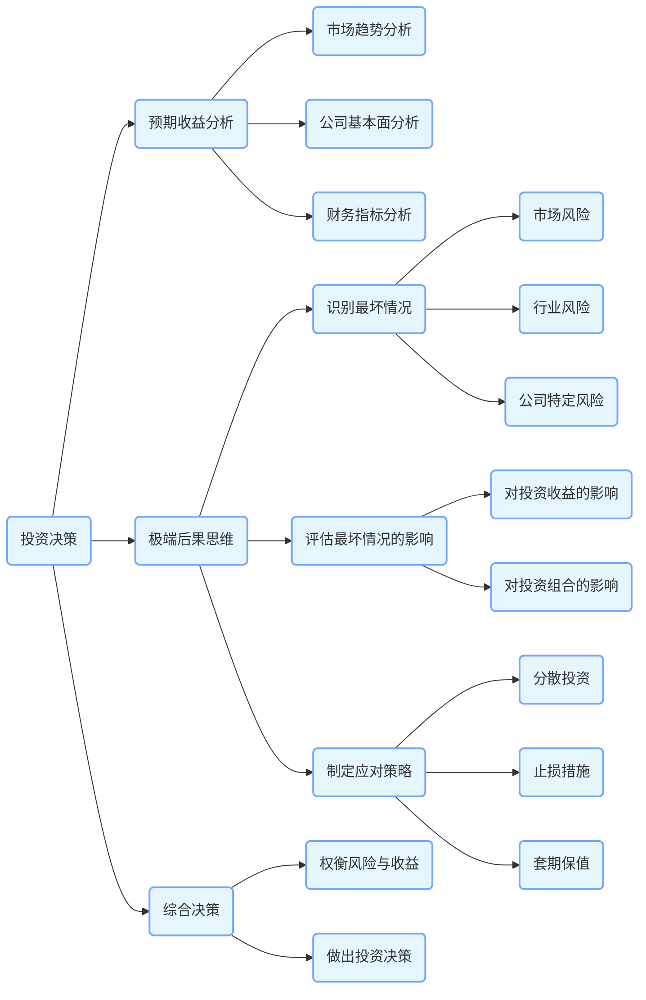

# 芒格的"极端后果"思维：在投资决策中考虑最坏情况

> 关键词：芒格、极端后果思维、投资决策、最坏情况、风险管理

> 摘要：本文深入探讨了芒格的“极端后果”思维在投资决策中的重要性与应用。通过对该思维的背景介绍，阐述其核心概念与联系，详细剖析其核心算法原理及操作步骤，借助数学模型和公式进一步说明，结合项目实战案例进行代码实现与解读，分析其实际应用场景，推荐相关工具和资源，最后总结未来发展趋势与挑战，并提供常见问题解答和参考资料，旨在帮助投资者更好地理解和运用“极端后果”思维，在投资决策中充分考虑最坏情况，降低风险，提高投资的成功率。

## 1. 背景介绍 
### 1.1 目的和范围
本文章的目的在于全面、深入地研究芒格的“极端后果”思维在投资决策领域的应用。旨在帮助投资者理解该思维的本质、原理和操作方法，掌握如何在投资决策过程中充分考虑最坏情况，从而有效降低投资风险，提高投资收益。范围涵盖了“极端后果”思维的理论基础、实际应用案例、相关工具和资源，以及未来发展趋势与挑战等方面。

### 1.2 预期读者
本文预期读者主要包括对投资领域感兴趣的个人投资者、专业投资机构的从业者、金融领域的研究人员以及希望学习风险管理和决策方法的相关人士。无论您是投资新手还是经验丰富的专业人士，都能从本文中获得有价值的信息和启示。

### 1.3 文档结构概述
本文将按照以下结构展开：首先介绍背景信息，包括目的、预期读者和文档结构概述；接着阐述“极端后果”思维的核心概念与联系，通过文本示意图和 Mermaid 流程图进行说明；然后详细讲解核心算法原理及具体操作步骤，并使用 Python 源代码进行阐述；再介绍相关的数学模型和公式，并举例说明；之后通过项目实战案例展示代码的实际应用和详细解释；分析该思维在实际中的应用场景；推荐相关的工具和资源；最后总结未来发展趋势与挑战，提供常见问题解答和参考资料。

### 1.4 术语表
#### 1.4.1 核心术语定义
- **极端后果思维**：由芒格提出的一种思维方式，在投资决策过程中，充分考虑可能出现的最坏情况及其影响，以此来评估投资的风险和可行性。
- **投资决策**：投资者根据自身的投资目标、风险承受能力和市场情况等因素，对投资项目进行分析、评估和选择的过程。
- **最坏情况**：在投资过程中，可能出现的对投资结果产生最不利影响的情况，包括市场暴跌、公司财务危机、政策变化等。
- **风险管理**：识别、评估和应对投资过程中各种风险的过程，旨在降低风险对投资收益的影响。

#### 1.4.2 相关概念解释
- **风险厌恶**：投资者对风险的一种态度，倾向于避免或减少风险，更愿意选择风险较低的投资项目。
- **预期收益**：投资者根据对投资项目的分析和预测，预期在未来能够获得的收益。
- **止损**：在投资过程中，当投资损失达到一定程度时，采取的卖出投资资产以避免进一步损失的措施。

#### 1.4.3 缩略词列表
- **VAR**：Value at Risk，风险价值，一种衡量投资风险的指标。
- **CVAR**：Conditional Value at Risk，条件风险价值，是对 VAR 的一种改进，考虑了损失超过 VAR 的情况。

## 2. 核心概念与联系 

### 核心概念原理
芒格的“极端后果”思维强调在投资决策中，不能仅仅关注预期收益，还要充分考虑可能出现的最坏情况。这种思维方式基于以下原理：
- **不确定性原理**：投资市场充满了不确定性，未来的市场情况和投资结果难以准确预测。因此，在决策时需要考虑到各种可能的情况，包括最坏的情况。
- **风险与收益的平衡原理**：投资的风险和收益是相互关联的，通常高收益伴随着高风险。通过考虑最坏情况，可以更好地评估投资的风险，从而在风险和收益之间找到平衡。
- **损失厌恶原理**：投资者通常对损失更为敏感，损失带来的痛苦往往大于同等收益带来的快乐。因此，在投资决策中，需要充分考虑可能的损失，以避免过度冒险。

### 架构的文本示意图
```plaintext
投资决策
|
|-- 预期收益分析
|   |-- 市场趋势分析
|   |-- 公司基本面分析
|   |-- 财务指标分析
|
|-- 极端后果思维
|   |-- 识别最坏情况
|   |   |-- 市场风险
|   |   |-- 行业风险
|   |   |-- 公司特定风险
|   |
|   |-- 评估最坏情况的影响
|   |   |-- 对投资收益的影响
|   |   |-- 对投资组合的影响
|   |
|   |-- 制定应对策略
|       |-- 分散投资
|       |-- 止损措施
|       |-- 套期保值
|
|-- 综合决策
|   |-- 权衡风险与收益
|   |-- 做出投资决策
```

### Mermaid 流程图


## 3. 核心算法原理 & 具体操作步骤 

### 核心算法原理
在投资决策中应用“极端后果”思维的核心算法原理可以概括为以下几个步骤：
1. **风险识别**：识别可能影响投资的各种风险因素，包括市场风险、行业风险和公司特定风险等。
2. **最坏情况模拟**：根据识别出的风险因素，模拟可能出现的最坏情况。
3. **影响评估**：评估最坏情况对投资收益和投资组合的影响。
4. **应对策略制定**：根据评估结果，制定相应的应对策略，以降低风险。

### 具体操作步骤
以下是使用 Python 实现“极端后果”思维在投资决策中的具体操作步骤和代码示例：

```python
import numpy as np

# 步骤 1: 风险识别
# 假设我们有一个投资组合，包含三只股票，分别计算它们的风险因素
# 这里简单用历史波动率作为风险因素的度量
# 历史波动率可以通过股票价格的历史数据计算得到
# 以下是模拟的历史波动率数据
stock_volatilities = [0.2, 0.3, 0.4]

# 步骤 2: 最坏情况模拟
# 假设市场出现极端情况，股票价格下跌的幅度与波动率相关
# 我们可以通过随机模拟来生成最坏情况下的股票价格变化
# 这里使用正态分布来模拟价格变化
def simulate_worst_case(volatilities, num_simulations=1000):
    worst_case_changes = []
    for volatility in volatilities:
        # 生成服从正态分布的随机数，均值为负的波动率，标准差为波动率
        changes = np.random.normal(-volatility, volatility, num_simulations)
        worst_case_changes.append(changes)
    return worst_case_changes

worst_case_changes = simulate_worst_case(stock_volatilities)

# 步骤 3: 影响评估
# 假设初始投资金额为 10000 元，投资组合的权重分别为 0.3, 0.3, 0.4
initial_investment = 10000
weights = [0.3, 0.3, 0.4]

# 计算最坏情况下的投资组合价值变化
portfolio_value_changes = []
for i in range(len(worst_case_changes[0])):
    portfolio_value_change = 0
    for j in range(len(stock_volatilities)):
        portfolio_value_change += initial_investment * weights[j] * worst_case_changes[j][i]
    portfolio_value_changes.append(portfolio_value_change)

# 计算最坏情况下的投资组合价值的均值和标准差
mean_value_change = np.mean(portfolio_value_changes)
std_value_change = np.std(portfolio_value_changes)

print(f"最坏情况下投资组合价值变化的均值: {mean_value_change}")
print(f"最坏情况下投资组合价值变化的标准差: {std_value_change}")

# 步骤 4: 应对策略制定
# 根据评估结果，我们可以制定相应的应对策略
# 例如，设置止损点，当投资组合价值下降到一定程度时，卖出部分或全部股票
stop_loss_threshold = -0.2 * initial_investment  # 设置止损点为初始投资的 20%
if mean_value_change < stop_loss_threshold:
    print("触发止损条件，建议卖出部分或全部股票")
else:
    print("未触发止损条件，可以继续持有")
```

## 4. 数学模型和公式 & 详细讲解 & 举例说明 

### 风险价值（VAR）模型
风险价值（VAR）是一种常用的衡量投资风险的指标，它表示在一定的置信水平下，投资组合在未来一段时间内可能遭受的最大损失。VAR 的计算公式如下：

$$VAR = z_{\alpha} \times \sigma \times V_0$$

其中：
- $z_{\alpha}$ 是对应置信水平 $\alpha$ 的标准正态分布的分位数。例如，当置信水平为 95% 时，$z_{\alpha} = 1.645$；当置信水平为 99% 时，$z_{\alpha} = 2.326$。
- $\sigma$ 是投资组合的波动率。
- $V_0$ 是投资组合的初始价值。

### 条件风险价值（CVAR）模型
条件风险价值（CVAR）是对 VAR 的一种改进，它考虑了损失超过 VAR 的情况。CVAR 的计算公式如下：

$$CVAR = \frac{1}{1 - \alpha} \int_{-\infty}^{-VAR} -x f(x) dx$$

其中：
- $\alpha$ 是置信水平。
- $f(x)$ 是投资组合收益率的概率密度函数。

### 详细讲解
VAR 模型通过计算在一定置信水平下的最大损失，为投资者提供了一个简单直观的风险度量指标。然而，VAR 模型只考虑了损失的上限，没有考虑损失超过 VAR 的情况。CVAR 模型则弥补了这一不足，它计算了在损失超过 VAR 的情况下的平均损失，更全面地反映了投资组合的风险。

### 举例说明
假设一个投资组合的初始价值为 $V_0 = 10000$ 元，波动率为 $\sigma = 0.2$，置信水平为 95%。则：
- 首先计算 $z_{\alpha}$，当置信水平为 95% 时，$z_{\alpha} = 1.645$。
- 然后计算 VAR：
$$VAR = z_{\alpha} \times \sigma \times V_0 = 1.645 \times 0.2 \times 10000 = 3290$$

这意味着在 95% 的置信水平下，该投资组合在未来一段时间内可能遭受的最大损失为 3290 元。

为了计算 CVAR，我们需要知道投资组合收益率的概率密度函数 $f(x)$。假设投资组合收益率服从正态分布，则可以通过数值积分的方法计算 CVAR。在实际应用中，通常使用蒙特卡罗模拟等方法来估计 CVAR。

## 5. 项目实战：代码实际案例和详细解释说明 

### 5.1  开发环境搭建
为了运行上述代码，我们需要搭建一个 Python 开发环境。以下是具体步骤：
1. **安装 Python**：从 Python 官方网站（https://www.python.org/downloads/）下载并安装 Python 3.x 版本。
2. **安装必要的库**：我们需要安装 `numpy` 库来进行数值计算。可以使用以下命令进行安装：
```sh
pip install numpy
```
3. **选择开发工具**：可以选择使用 PyCharm、Jupyter Notebook 等开发工具来编写和运行代码。

### 5.2  源代码详细实现和代码解读
以下是上述代码的详细实现和解读：

```python
import numpy as np

# 步骤 1: 风险识别
# 假设我们有一个投资组合，包含三只股票，分别计算它们的风险因素
# 这里简单用历史波动率作为风险因素的度量
# 历史波动率可以通过股票价格的历史数据计算得到
# 以下是模拟的历史波动率数据
stock_volatilities = [0.2, 0.3, 0.4]

# 步骤 2: 最坏情况模拟
# 假设市场出现极端情况，股票价格下跌的幅度与波动率相关
# 我们可以通过随机模拟来生成最坏情况下的股票价格变化
# 这里使用正态分布来模拟价格变化
def simulate_worst_case(volatilities, num_simulations=1000):
    worst_case_changes = []
    for volatility in volatilities:
        # 生成服从正态分布的随机数，均值为负的波动率，标准差为波动率
        changes = np.random.normal(-volatility, volatility, num_simulations)
        worst_case_changes.append(changes)
    return worst_case_changes

worst_case_changes = simulate_worst_case(stock_volatilities)

# 步骤 3: 影响评估
# 假设初始投资金额为 10000 元，投资组合的权重分别为 0.3, 0.3, 0.4
initial_investment = 10000
weights = [0.3, 0.3, 0.4]

# 计算最坏情况下的投资组合价值变化
portfolio_value_changes = []
for i in range(len(worst_case_changes[0])):
    portfolio_value_change = 0
    for j in range(len(stock_volatilities)):
        portfolio_value_change += initial_investment * weights[j] * worst_case_changes[j][i]
    portfolio_value_changes.append(portfolio_value_change)

# 计算最坏情况下的投资组合价值的均值和标准差
mean_value_change = np.mean(portfolio_value_changes)
std_value_change = np.std(portfolio_value_changes)

print(f"最坏情况下投资组合价值变化的均值: {mean_value_change}")
print(f"最坏情况下投资组合价值变化的标准差: {std_value_change}")

# 步骤 4: 应对策略制定
# 根据评估结果，我们可以制定相应的应对策略
# 例如，设置止损点，当投资组合价值下降到一定程度时，卖出部分或全部股票
stop_loss_threshold = -0.2 * initial_investment  # 设置止损点为初始投资的 20%
if mean_value_change < stop_loss_threshold:
    print("触发止损条件，建议卖出部分或全部股票")
else:
    print("未触发止损条件，可以继续持有")
```

### 代码解读与分析
1. **风险识别**：通过定义 `stock_volatilities` 列表，我们模拟了三只股票的历史波动率，作为风险因素的度量。
2. **最坏情况模拟**：定义了 `simulate_worst_case` 函数，使用 `np.random.normal` 函数生成服从正态分布的随机数，模拟最坏情况下的股票价格变化。
3. **影响评估**：计算了最坏情况下的投资组合价值变化，并计算了其均值和标准差，以评估最坏情况对投资组合的影响。
4. **应对策略制定**：设置了止损点 `stop_loss_threshold`，根据最坏情况下投资组合价值变化的均值判断是否触发止损条件，并给出相应的建议。

## 6. 实际应用场景 
芒格的“极端后果”思维在投资决策中有广泛的实际应用场景，以下是一些常见的场景：
- **股票投资**：在选择股票时，投资者不仅要考虑公司的基本面和预期收益，还要考虑可能出现的最坏情况，如公司业绩下滑、行业竞争加剧、宏观经济环境变化等。通过运用“极端后果”思维，投资者可以更好地评估股票的风险，避免过度投资高风险股票。
- **基金投资**：在选择基金时，投资者需要考虑基金的投资策略、历史业绩、风险水平等因素。同时，也要考虑可能出现的最坏情况，如市场暴跌、基金经理离职、基金投资组合出现重大失误等。通过分析最坏情况，投资者可以选择更加稳健的基金产品。
- **债券投资**：债券投资虽然相对较为稳健，但也存在一定的风险，如信用风险、利率风险等。投资者在投资债券时，需要考虑可能出现的最坏情况，如债券发行人违约、利率大幅上升等。通过运用“极端后果”思维，投资者可以更好地评估债券的风险，选择合适的债券品种和投资期限。
- **投资组合管理**：在构建投资组合时，投资者需要考虑不同资产之间的相关性和风险收益特征。通过运用“极端后果”思维，投资者可以模拟不同市场情况下投资组合的表现，优化投资组合的配置，降低投资组合的整体风险。

## 7. 工具和资源推荐
### 7.1 学习资源推荐
#### 7.1.1 书籍推荐
- 《穷查理宝典：查理·芒格的智慧箴言录》：本书收录了查理·芒格的演讲、文章和访谈等内容，全面展示了他的投资理念、思维方式和人生智慧。
- 《聪明的投资者》：本杰明·格雷厄姆的经典著作，被誉为投资领域的“圣经”，书中介绍了价值投资的基本原理和方法，对投资者具有重要的指导意义。
- 《金融炼金术》：乔治·索罗斯的代表作，书中介绍了他的反身性理论和投资实践，对理解金融市场的运行机制和投资决策具有重要的参考价值。

#### 7.1.2 在线课程
- Coursera 上的“投资学原理”：该课程由知名高校的教授授课，系统介绍了投资学的基本原理和方法，包括资产定价、投资组合管理、风险管理等内容。
- edX 上的“金融市场”：该课程由耶鲁大学的教授授课，深入探讨了金融市场的运行机制和投资决策，对理解金融市场和投资领域具有重要的帮助。

#### 7.1.3 技术博客和网站
- 雪球网：国内知名的投资社区，提供股票、基金、债券等投资品种的信息和分析，投资者可以在上面交流投资经验和心得。
- 东方财富网：国内知名的金融信息网站，提供丰富的金融资讯、行情数据和分析工具，对投资者了解市场动态和进行投资决策具有重要的参考价值。

### 7.2 开发工具框架推荐
#### 7.2.1 IDE和编辑器
- PyCharm：一款专业的 Python 集成开发环境，提供代码编辑、调试、自动补全、版本控制等功能，适合开发 Python 投资分析程序。
- Jupyter Notebook：一款交互式的开发环境，支持 Python、R 等多种编程语言，适合进行数据探索、分析和可视化。

#### 7.2.2 调试和性能分析工具
- pdb：Python 内置的调试工具，可以帮助开发者调试 Python 代码，定位和解决问题。
- cProfile：Python 内置的性能分析工具，可以帮助开发者分析 Python 代码的性能瓶颈，优化代码性能。

#### 7.2.3 相关框架和库
- Pandas：一个强大的数据处理和分析库，提供了高效的数据结构和数据操作方法，适合进行金融数据的处理和分析。
- NumPy：一个用于科学计算的 Python 库，提供了高效的数组操作和数学函数，适合进行数值计算和模拟。
- Matplotlib：一个用于数据可视化的 Python 库，提供了丰富的绘图功能，适合进行金融数据的可视化分析。

### 7.3 相关论文著作推荐
#### 7.3.1 经典论文
- Markowitz, H. M. (1952). Portfolio Selection. The Journal of Finance, 7(1), 77-91. 该论文提出了现代投资组合理论，为投资组合的优化和风险管理提供了重要的理论基础。
- Sharpe, W. F. (1964). Capital Asset Prices: A Theory of Market Equilibrium Under Conditions of Risk. The Journal of Finance, 19(3), 425-442. 该论文提出了资本资产定价模型（CAPM），为资产定价和投资决策提供了重要的理论依据。

#### 7.3.2 最新研究成果
- 可以关注《Journal of Financial Economics》、《The Review of Financial Studies》等金融领域的顶级学术期刊，了解最新的研究成果和发展趋势。

#### 7.3.3 应用案例分析
- 可以参考一些投资机构的研究报告和案例分析，了解他们在投资决策中如何应用风险管理和决策方法，以及如何应对极端情况。

## 8. 总结：未来发展趋势与挑战
### 未来发展趋势
- **智能化决策**：随着人工智能和机器学习技术的不断发展，未来投资决策将越来越智能化。通过运用大数据分析、深度学习等技术，投资者可以更准确地识别风险、模拟最坏情况，并制定更优化的投资策略。
- **多元化投资**：未来投资者将更加注重多元化投资，通过投资不同资产、不同行业和不同地区的产品，降低投资组合的整体风险。同时，随着金融市场的不断创新，新的投资品种和投资方式将不断涌现，为投资者提供更多的选择。
- **风险管理的重要性日益凸显**：在全球经济不确定性增加、金融市场波动加剧的背景下，风险管理的重要性将日益凸显。投资者将更加重视“极端后果”思维的应用，加强对投资风险的识别、评估和管理。

### 挑战
- **数据质量和可靠性**：在运用“极端后果”思维进行投资决策时，需要大量的历史数据和市场信息。然而，数据的质量和可靠性可能存在问题，如数据缺失、数据错误等，这将影响风险评估和决策的准确性。
- **模型的局限性**：目前的风险评估模型和决策方法都存在一定的局限性，无法完全准确地预测未来的市场情况和投资结果。例如，一些模型假设市场是正态分布的，但实际市场情况往往是非正态的，这可能导致模型的预测结果与实际情况存在较大偏差。
- **投资者情绪和行为的影响**：投资者的情绪和行为往往会对投资决策产生重要影响。在市场波动较大的情况下，投资者可能会出现恐慌、贪婪等情绪，从而做出不理性的投资决策。如何克服投资者情绪和行为的影响，是未来投资决策面临的一个重要挑战。

## 9. 附录：常见问题与解答
### 1. 什么是“极端后果”思维？
“极端后果”思维是由芒格提出的一种思维方式，在投资决策过程中，充分考虑可能出现的最坏情况及其影响，以此来评估投资的风险和可行性。

### 2. 为什么要在投资决策中考虑最坏情况？
投资市场充满了不确定性，未来的市场情况和投资结果难以准确预测。通过考虑最坏情况，可以更好地评估投资的风险，避免过度冒险，从而在风险和收益之间找到平衡。

### 3. 如何识别投资中的最坏情况？
可以从市场风险、行业风险和公司特定风险等方面进行识别。市场风险包括宏观经济环境变化、政策调整等；行业风险包括行业竞争加剧、技术变革等；公司特定风险包括公司业绩下滑、管理层变动等。

### 4. 如何评估最坏情况对投资的影响？
可以通过模拟最坏情况，计算投资组合在最坏情况下的价值变化、收益率等指标，评估最坏情况对投资收益和投资组合的影响。也可以使用风险价值（VAR）、条件风险价值（CVAR）等指标来衡量投资的风险。

### 5. 如何制定应对最坏情况的策略？
可以采取分散投资、止损措施、套期保值等策略来降低风险。分散投资可以通过投资不同资产、不同行业和不同地区的产品，降低投资组合的整体风险；止损措施可以在投资损失达到一定程度时，卖出投资资产以避免进一步损失；套期保值可以通过购买期货、期权等衍生品来对冲投资风险。

## 10. 扩展阅读 & 参考资料
- 《投资中最简单的事》，邱国鹭著
- 《黑天鹅：如何应对不可预知的未来》，纳西姆·尼古拉斯·塔勒布著
- 《漫步华尔街》，伯顿·马尔基尔著
- 维基百科相关词条：投资决策、风险管理、风险价值等
- 各大金融资讯网站和投资社区的相关文章和讨论

以上就是关于芒格的“极端后果”思维在投资决策中考虑最坏情况的详细介绍，希望对投资者有所帮助。在投资过程中，我们应该充分运用“极端后果”思维，谨慎决策，降低风险，实现投资的稳健增长。