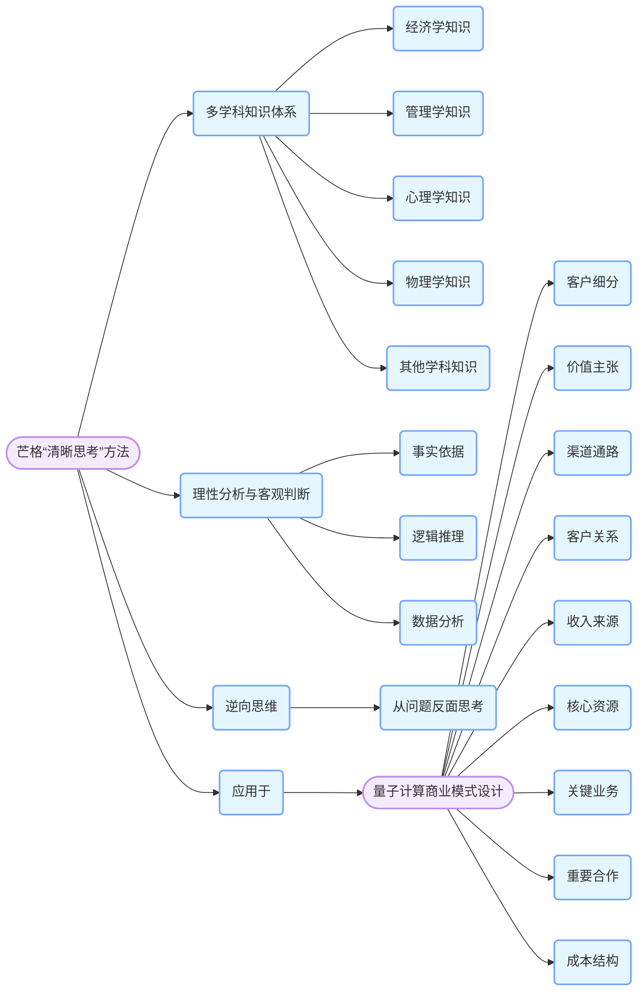

# 芒格的"清晰思考"方法在量子计算商业模式设计中的应用

> 关键词：芒格、清晰思考方法、量子计算、商业模式设计、商业逻辑

> 摘要：本文旨在探讨芒格的“清晰思考”方法在量子计算商业模式设计中的应用。首先介绍了背景信息，包括目的范围、预期读者等内容。接着阐述了芒格“清晰思考”方法和量子计算商业模式的核心概念与联系，通过示意图和流程图直观呈现。然后深入讲解核心算法原理，结合 Python 代码进行详细阐述，并给出相关数学模型和公式。通过项目实战，展示量子计算商业模式设计的代码案例并进行详细解释。分析了量子计算商业模式的实际应用场景，推荐了相关的学习资源、开发工具框架以及论文著作。最后总结了未来发展趋势与挑战，解答常见问题并提供扩展阅读和参考资料，希望为量子计算领域的商业模式设计提供新的思路和方法。

## 1. 背景介绍 
### 1.1 目的和范围
本研究的目的在于探索如何将芒格的“清晰思考”方法有效地应用于量子计算商业模式的设计过程中。通过对这一方法的深入剖析和实践应用，期望能够为量子计算企业提供一种系统、科学且具有创新性的商业模式设计思路，从而提高量子计算技术在商业领域的应用效率和价值创造能力。

研究范围涵盖了芒格“清晰思考”方法的核心理论、量子计算技术的基本原理和发展现状、量子计算商业模式的主要构成要素和设计原则，以及如何将二者有机结合并应用于实际商业场景中的具体策略和方法。

### 1.2 预期读者
本文的预期读者主要包括量子计算领域的科研人员、企业管理者、创业者、投资者，以及对商业创新和量子计算技术感兴趣的研究人员和爱好者。对于科研人员，本文可以为他们在技术商业化方面提供有益的参考；对于企业管理者和创业者，有助于他们设计出更具竞争力的量子计算商业模式；对于投资者，能够帮助他们更好地理解量子计算商业项目的潜在价值和风险；对于其他爱好者和研究人员，则可以拓宽他们在量子计算商业应用方面的视野和思路。

### 1.3 文档结构概述
本文共分为十个部分。第一部分为背景介绍，阐述了研究的目的、范围、预期读者和文档结构概述，并对相关术语进行了定义和解释。第二部分介绍了芒格的“清晰思考”方法和量子计算商业模式的核心概念与联系，通过文本示意图和 Mermaid 流程图进行直观展示。第三部分深入讲解了核心算法原理，并结合 Python 代码进行详细阐述。第四部分给出了相关的数学模型和公式，并进行详细讲解和举例说明。第五部分通过项目实战，展示了量子计算商业模式设计的代码案例并进行详细解释。第六部分分析了量子计算商业模式的实际应用场景。第七部分推荐了相关的学习资源、开发工具框架以及论文著作。第八部分总结了未来发展趋势与挑战。第九部分解答了常见问题。第十部分提供了扩展阅读和参考资料。

### 1.4 术语表
#### 1.4.1 核心术语定义
- **芒格的“清晰思考”方法**：由查理·芒格提出的一种思考方式，强调通过多学科的知识体系、理性分析、逆向思维等方法，全面、深入、客观地看待问题，从而做出明智的决策。
- **量子计算**：基于量子力学原理进行信息处理的新型计算模式，具有强大的计算能力和并行处理能力，能够在某些特定问题上比传统计算机更快地得出结果。
- **商业模式**：企业为了创造价值、传递价值和获取价值而建立的一种逻辑架构和运营方式，包括客户细分、价值主张、渠道通路、客户关系、收入来源、核心资源、关键业务、重要合作和成本结构等要素。

#### 1.4.2 相关概念解释
- **量子比特**：量子计算中的基本信息单位，与传统计算机中的比特类似，但由于量子力学的特性，量子比特可以同时处于 0 和 1 的叠加态，从而使得量子计算机能够进行并行计算。
- **商业逻辑**：企业在商业活动中遵循的一系列规则和原理，用于指导企业的战略决策、运营管理和价值创造过程。

#### 1.4.3 缩略词列表
- **QC**：Quantum Computing，量子计算
- **Qubit**：Quantum Bit，量子比特

## 2. 核心概念与联系 
### 芒格“清晰思考”方法的原理
芒格的“清晰思考”方法建立在多学科知识的基础之上。他认为，世界是一个复杂的系统，各个学科之间相互关联、相互影响。因此，要全面、深入地理解一个问题，就需要运用多个学科的知识和方法。例如，在分析一个商业问题时，不仅需要运用经济学、管理学的知识，还需要考虑心理学、社会学、物理学等学科的因素。

芒格强调理性分析和客观判断的重要性。他主张在面对问题时，要摆脱情绪和偏见的影响，以事实为依据，运用逻辑推理和数据分析来做出决策。同时，他还提倡逆向思维，即从问题的反面去思考，寻找解决问题的新途径。

### 量子计算商业模式的架构
量子计算商业模式主要由以下几个关键要素构成：
- **客户细分**：确定量子计算技术的潜在客户群体，包括科研机构、金融机构、制药企业、物流企业等不同行业的客户。
- **价值主张**：明确量子计算技术为客户提供的独特价值，如快速的计算速度、更高的计算精度、解决复杂问题的能力等。
- **渠道通路**：选择合适的渠道将量子计算技术推向市场，如直接销售、合作伙伴推广、线上平台等。
- **客户关系**：建立良好的客户关系，提供优质的客户服务，以提高客户满意度和忠诚度。
- **收入来源**：确定企业的收入模式，如销售量子计算设备、提供量子计算服务、收取技术授权费用等。
- **核心资源**：明确企业的核心资源，包括量子计算硬件、软件、科研团队、专利技术等。
- **关键业务**：确定企业的关键业务活动，如量子计算技术的研发、生产、销售和服务等。
- **重要合作**：与其他企业、科研机构等建立合作关系，共同推动量子计算技术的发展和应用。
- **成本结构**：分析企业的成本构成，包括研发成本、生产成本、营销成本、运营成本等。

### 核心概念联系的文本示意图
```plaintext
芒格“清晰思考”方法
|
|--多学科知识体系
|   |--经济学知识
|   |--管理学知识
|   |--心理学知识
|   |--物理学知识
|   |--其他学科知识
|
|--理性分析与客观判断
|
|--逆向思维
|
|--应用于
|
量子计算商业模式设计
|
|--客户细分
|--价值主张
|--渠道通路
|--客户关系
|--收入来源
|--核心资源
|--关键业务
|--重要合作
|--成本结构
```

### Mermaid 流程图


## 3. 核心算法原理 & 具体操作步骤 
### 量子计算中状态表示的算法原理
在量子计算中，量子比特的状态可以用复数向量来表示。一个量子比特的状态可以表示为 $|\psi\rangle = \alpha|0\rangle + \beta|1\rangle$，其中 $\alpha$ 和 $\beta$ 是复数，且满足 $|\alpha|^2 + |\beta|^2 = 1$。下面是一个用 Python 代码实现量子比特状态表示的示例：

```python
import numpy as np

# 定义量子比特状态
alpha = np.sqrt(0.3)
beta = np.sqrt(0.7)

# 量子比特状态向量
qubit_state = np.array([alpha, beta])

print("量子比特状态向量:", qubit_state)
```

### 量子门操作的算法原理
量子门是量子计算中用于操作量子比特状态的基本工具。常见的量子门包括 Pauli 门（如 X 门、Y 门、Z 门）、Hadamard 门等。下面是一个用 Python 代码实现 Hadamard 门操作的示例：

```python
import numpy as np

# 定义 Hadamard 门矩阵
H = np.array([[1/np.sqrt(2), 1/np.sqrt(2)], [1/np.sqrt(2), -1/np.sqrt(2)]])

# 定义初始量子比特状态
qubit_state = np.array([1, 0])

# 应用 Hadamard 门操作
new_state = np.dot(H, qubit_state)

print("应用 Hadamard 门后的量子比特状态:", new_state)
```

### 量子测量的算法原理
量子测量是将量子比特的状态从量子态转换为经典态的过程。在测量时，量子比特的状态会以一定的概率坍缩到 $|0\rangle$ 或 $|1\rangle$ 状态。下面是一个用 Python 代码实现量子测量的示例：

```python
import numpy as np

# 定义量子比特状态
alpha = np.sqrt(0.6)
beta = np.sqrt(0.4)
qubit_state = np.array([alpha, beta])

# 计算测量到 0 和 1 的概率
prob_0 = np.abs(alpha)**2
prob_1 = np.abs(beta)**2

# 进行测量
measurement_result = np.random.choice([0, 1], p=[prob_0, prob_1])

print("测量结果:", measurement_result)
```

### 具体操作步骤
1. **状态初始化**：根据具体的问题需求，初始化量子比特的状态。可以使用复数向量来表示量子比特的状态，并确保满足归一化条件。
2. **量子门操作**：选择合适的量子门对量子比特的状态进行操作。通过矩阵乘法来实现量子门的作用。
3. **量子测量**：在需要获取经典结果时，对量子比特的状态进行测量。根据测量概率随机选择测量结果。

## 4. 数学模型和公式 & 详细讲解 & 举例说明 
### 量子比特状态的数学模型
一个量子比特的状态可以用二维复向量空间中的向量来表示，即 $|\psi\rangle = \alpha|0\rangle + \beta|1\rangle$，其中 $\alpha, \beta \in \mathbb{C}$，且 $|\alpha|^2 + |\beta|^2 = 1$。$|0\rangle$ 和 $|1\rangle$ 是量子比特的两个基态，分别表示为：

$$
|0\rangle = \begin{bmatrix} 1 \\ 0 \end{bmatrix}, \quad |1\rangle = \begin{bmatrix} 0 \\ 1 \end{bmatrix}
$$

$|\alpha|^2$ 表示测量量子比特得到 $|0\rangle$ 状态的概率，$|\beta|^2$ 表示测量量子比特得到 $|1\rangle$ 状态的概率。

**举例说明**：假设 $\alpha = \frac{1}{\sqrt{2}}$，$\beta = \frac{1}{\sqrt{2}}$，则量子比特的状态为 $|\psi\rangle = \frac{1}{\sqrt{2}}|0\rangle + \frac{1}{\sqrt{2}}|1\rangle$。测量该量子比特得到 $|0\rangle$ 状态的概率为 $|\frac{1}{\sqrt{2}}|^2 = \frac{1}{2}$，得到 $|1\rangle$ 状态的概率也为 $|\frac{1}{\sqrt{2}}|^2 = \frac{1}{2}$。

### 量子门的数学模型
量子门可以用幺正矩阵来表示。幺正矩阵满足 $U^{\dagger}U = I$，其中 $U^{\dagger}$ 是 $U$ 的共轭转置矩阵，$I$ 是单位矩阵。

**Hadamard 门**：Hadamard 门的矩阵表示为：

$$
H = \frac{1}{\sqrt{2}}\begin{bmatrix} 1 & 1 \\ 1 & -1 \end{bmatrix}
$$

将 Hadamard 门应用于量子比特状态 $|\psi\rangle$ 时，新的状态 $|\psi'\rangle$ 可以通过矩阵乘法得到：$|\psi'\rangle = H|\psi\rangle$。

**举例说明**：假设量子比特的初始状态为 $|0\rangle$，将 Hadamard 门应用于该状态：

$$
H|0\rangle = \frac{1}{\sqrt{2}}\begin{bmatrix} 1 & 1 \\ 1 & -1 \end{bmatrix}\begin{bmatrix} 1 \\ 0 \end{bmatrix} = \frac{1}{\sqrt{2}}\begin{bmatrix} 1 \\ 1 \end{bmatrix} = \frac{1}{\sqrt{2}}|0\rangle + \frac{1}{\sqrt{2}}|1\rangle
$$

### 量子测量的数学模型
量子测量是一个概率性的过程。假设量子比特的状态为 $|\psi\rangle = \alpha|0\rangle + \beta|1\rangle$，测量该量子比特得到 $|0\rangle$ 状态的概率为 $P(0) = |\alpha|^2$，得到 $|1\rangle$ 状态的概率为 $P(1) = |\beta|^2$。测量后，量子比特的状态会坍缩到测量结果对应的基态。

**举例说明**：假设量子比特的状态为 $|\psi\rangle = \frac{\sqrt{3}}{2}|0\rangle + \frac{1}{2}|1\rangle$，则测量该量子比特得到 $|0\rangle$ 状态的概率为 $P(0) = |\frac{\sqrt{3}}{2}|^2 = \frac{3}{4}$，得到 $|1\rangle$ 状态的概率为 $P(1) = |\frac{1}{2}|^2 = \frac{1}{4}$。如果测量结果为 $|0\rangle$，则测量后量子比特的状态坍缩到 $|0\rangle$。

## 5. 项目实战：代码实际案例和详细解释说明 
### 5.1  开发环境搭建
#### 安装 Python
首先，需要安装 Python 编程语言。可以从 Python 官方网站（https://www.python.org/downloads/） 下载适合自己操作系统的 Python 安装包，并按照安装向导进行安装。

#### 安装量子计算库
为了进行量子计算的开发，需要安装一些相关的量子计算库，如 Qiskit、Cirq 等。以 Qiskit 为例，可以使用以下命令进行安装：

```sh
pip install qiskit
```

### 5.2  源代码详细实现和代码解读
以下是一个使用 Qiskit 实现简单量子电路的代码示例：

```python
from qiskit import QuantumCircuit, Aer, execute
import matplotlib.pyplot as plt

# 创建一个包含 1 个量子比特和 1 个经典比特的量子电路
qc = QuantumCircuit(1, 1)

# 应用 Hadamard 门到量子比特上
qc.h(0)

# 对量子比特进行测量，并将结果存储到经典比特上
qc.measure(0, 0)

# 打印量子电路
print(qc)

# 选择模拟器后端
backend = Aer.get_backend('qasm_simulator')

# 执行量子电路
job = execute(qc, backend, shots=1000)

# 获取结果
result = job.result()

# 统计测量结果
counts = result.get_counts(qc)

# 打印测量结果
print("测量结果:", counts)

# 绘制测量结果的柱状图
plt.bar(counts.keys(), counts.values())
plt.xlabel('测量结果')
plt.ylabel('计数')
plt.title('量子电路测量结果')
plt.show()
```

### 5.3  代码解读与分析
1. **导入必要的库**：从 `qiskit` 库中导入 `QuantumCircuit`、`Aer` 和 `execute` 等模块，用于创建量子电路、选择模拟器后端和执行量子电路。同时，导入 `matplotlib.pyplot` 用于绘制测量结果的柱状图。
2. **创建量子电路**：使用 `QuantumCircuit(1, 1)` 创建一个包含 1 个量子比特和 1 个经典比特的量子电路。
3. **应用量子门**：使用 `qc.h(0)` 应用 Hadamard 门到第 0 个量子比特上，将量子比特的状态从 $|0\rangle$ 转换为 $\frac{1}{\sqrt{2}}|0\rangle + \frac{1}{\sqrt{2}}|1\rangle$。
4. **测量量子比特**：使用 `qc.measure(0, 0)` 对第 0 个量子比特进行测量，并将结果存储到第 0 个经典比特上。
5. **选择模拟器后端**：使用 `Aer.get_backend('qasm_simulator')` 选择量子电路模拟器后端。
6. **执行量子电路**：使用 `execute(qc, backend, shots=1000)` 执行量子电路 1000 次。
7. **获取结果**：使用 `job.result()` 获取执行结果。
8. **统计测量结果**：使用 `result.get_counts(qc)` 统计测量结果。
9. **打印和绘制测量结果**：打印测量结果，并使用 `matplotlib` 绘制测量结果的柱状图。

## 6. 实际应用场景 
### 金融领域
- **风险分析**：量子计算可以在短时间内处理大量的金融数据，进行复杂的风险模型计算。例如，通过对市场波动、利率变化、信用风险等多种因素的综合分析，更准确地评估投资组合的风险，帮助金融机构制定更合理的风险管理策略。
- **投资组合优化**：量子计算能够在众多的投资选项中快速找到最优的投资组合，考虑到各种约束条件和目标函数，如最大化收益、最小化风险等。这可以提高投资决策的效率和准确性，为投资者带来更高的回报。

### 制药领域
- **药物研发**：量子计算可以模拟分子的结构和相互作用，加速药物研发的过程。通过对大量的分子进行筛选和分析，寻找潜在的药物靶点和新型药物分子，减少研发周期和成本。
- **蛋白质折叠预测**：蛋白质的折叠方式决定了其功能和性质，而蛋白质折叠预测是一个非常复杂的问题。量子计算可以利用其强大的计算能力，更准确地预测蛋白质的折叠结构，为理解生物过程和开发新的治疗方法提供重要的支持。

### 物流领域
- **路径优化**：量子计算可以在复杂的物流网络中快速找到最优的运输路径，考虑到交通状况、货物重量、运输时间等多种因素。这可以降低物流成本，提高运输效率。
- **仓库布局优化**：通过量子计算，可以对仓库的布局进行优化，合理安排货物的存储位置和搬运路径，提高仓库的空间利用率和货物处理效率。

### 密码学领域
- **量子加密**：量子计算的发展也为密码学带来了新的机遇和挑战。量子加密技术利用量子力学的特性，实现了更加安全的通信方式，如量子密钥分发，可以确保信息的保密性和完整性。
- **密码分析**：量子计算机的强大计算能力可能会对现有的密码系统构成威胁。因此，需要研究新的密码算法和加密技术，以应对量子计算带来的挑战。

## 7. 工具和资源推荐
### 7.1 学习资源推荐
#### 7.1.1 书籍推荐
- 《量子计算与量子信息》（Quantum Computation and Quantum Information）：由 Michael A. Nielsen 和 Isaac L. Chuang 所著，是量子计算领域的经典教材，全面介绍了量子计算的基本原理、算法和应用。
- 《Charlie Munger: The Complete Investor》：深入介绍了芒格的投资理念和思考方法，对于理解芒格的“清晰思考”方法有很大的帮助。

#### 7.1.2 在线课程
- Coursera 上的“Quantum Computing for Everyone”：该课程由专业的教授授课，适合初学者了解量子计算的基本概念和原理。
- edX 上的“Applied Quantum Computing with IBM Q”：通过实际的案例和实验，帮助学习者掌握量子计算的应用和开发。

#### 7.1.3 技术博客和网站
- Qiskit 官方博客（https://qiskit.org/blog/）：提供了关于量子计算最新技术和研究成果的资讯和教程。
- Medium 上的量子计算相关博客：有许多专业人士分享的关于量子计算的技术文章和思考。

### 7.2 开发工具框架推荐
#### 7.2.1 IDE和编辑器
- PyCharm：一款功能强大的 Python 集成开发环境，提供了丰富的代码编辑、调试和版本控制功能，适合量子计算项目的开发。
- Visual Studio Code：轻量级的代码编辑器，支持多种编程语言和插件扩展，方便快捷地进行量子计算代码的编写和调试。

#### 7.2.2 调试和性能分析工具
- Qiskit 的调试工具：Qiskit 提供了一系列的调试工具，如 `QuantumCircuit.draw()` 可以可视化量子电路，帮助开发者检查电路的正确性。
- Profiler 工具：可以使用 Python 的 `cProfile` 等工具对量子计算代码进行性能分析，找出性能瓶颈并进行优化。

#### 7.2.3 相关框架和库
- Qiskit：IBM 开发的开源量子计算框架，提供了丰富的量子电路构建、模拟和执行工具，支持多种后端和算法实现。
- Cirq：Google 开发的量子计算框架，专注于量子电路的设计和模拟，具有简洁易用的 API。

### 7.3 相关论文著作推荐
#### 7.3.1 经典论文
- “Algorithms for Quantum Computation: Discrete Logarithms and Factoring”：由 Peter Shor 发表，提出了著名的 Shor 算法，该算法在量子计算领域具有重要的意义，能够在多项式时间内解决整数分解问题。
- “Quantum Mechanics Helps in Searching for a Needle in a Haystack”：由 Lov Grover 发表，介绍了 Grover 算法，该算法可以在无序数据库中进行快速搜索。

#### 7.3.2 最新研究成果
- 关注 Nature、Science 等顶级学术期刊上关于量子计算的最新研究论文，了解量子计算领域的前沿技术和发展趋势。
- 参加量子计算领域的国际学术会议，如 IEEE International Conference on Quantum Computing and Engineering（QCE），获取最新的研究成果和学术动态。

#### 7.3.3 应用案例分析
- 研究一些实际的量子计算商业应用案例，如金融机构、制药企业等使用量子计算技术解决实际问题的案例，学习他们的商业模式设计和实施经验。

## 8. 总结：未来发展趋势与挑战
### 未来发展趋势
- **技术突破**：随着量子计算技术的不断发展，预计在量子比特的稳定性、量子门的精度、量子纠错等方面将取得更大的突破，从而提高量子计算机的性能和可靠性。
- **商业应用拓展**：量子计算将在更多的领域得到应用，如人工智能、机器学习、材料科学等。同时，量子计算的商业模式也将不断创新和完善，为企业带来更多的商业机会和价值。
- **产业生态完善**：量子计算产业将形成更加完善的生态系统，包括硬件制造商、软件开发商、科研机构、用户等各个环节。各方将加强合作，共同推动量子计算技术的发展和应用。

### 挑战
- **技术难题**：量子计算技术仍然面临许多技术难题，如量子比特的退相干、量子噪声的影响等。解决这些技术难题需要大量的研究和投入。
- **成本高昂**：目前量子计算机的研发和制造成本非常高昂，限制了量子计算技术的普及和应用。降低成本是量子计算产业发展的关键挑战之一。
- **人才短缺**：量子计算是一个新兴的领域，需要具备多学科知识和技能的专业人才。目前，量子计算领域的人才短缺问题较为严重，制约了产业的发展。

## 9. 附录：常见问题与解答
### 问题 1：量子计算与传统计算有什么区别？
量子计算基于量子力学原理，利用量子比特的叠加态和纠缠态进行信息处理，具有强大的并行计算能力。而传统计算基于经典比特，每次只能处理一个状态。因此，量子计算在某些特定问题上能够比传统计算更快地得出结果。

### 问题 2：芒格的“清晰思考”方法如何具体应用于量子计算商业模式设计中？
在客户细分方面，可以运用多学科知识，从经济学、社会学等角度分析不同行业客户的需求和特点；在价值主张设计时，通过理性分析和客观判断，准确评估量子计算技术为客户带来的价值；在制定收入来源和成本结构时，可以运用逆向思维，考虑如何降低成本、提高收入。

### 问题 3：量子计算技术目前的发展水平如何？
目前，量子计算技术取得了一定的进展，但仍然处于发展阶段。虽然已经实现了一些简单的量子算法和实验，但在量子比特的数量、稳定性和量子纠错等方面还存在许多挑战。

### 问题 4：学习量子计算需要具备哪些基础知识？
学习量子计算需要具备一定的数学基础，如线性代数、概率论等，以及物理学基础，如量子力学。同时，还需要掌握编程语言，如 Python，以便进行量子计算的编程和实验。

## 10. 扩展阅读 & 参考资料
### 扩展阅读
- 《The Big Short: Inside the Doomsday Machine》：通过讲述金融领域的故事，深入了解商业决策和风险管理的重要性，对量子计算在金融领域的应用有一定的启发。
- 《Superintelligence: Paths, Dangers, Strategies》：探讨了人工智能和超级智能的发展趋势和潜在风险，与量子计算在人工智能领域的应用有一定的关联。

### 参考资料
- Nielsen, M. A., & Chuang, I. L. (2010). Quantum Computation and Quantum Information. Cambridge University Press.
- Munger, C. T. (2008). Poor Charlie's Almanack: The Wit and Wisdom of Charles T. Munger. Donning Company Publishers.
- Qiskit Documentation (https://qiskit.org/documentation/).
- Cirq Documentation (https://quantumai.google/cirq).