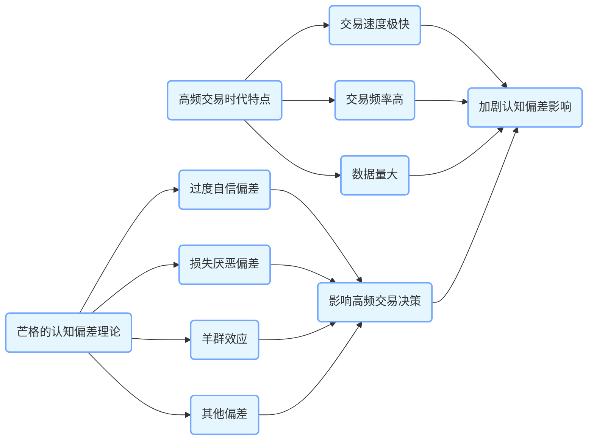

# 芒格的认知偏差理论：如何在高频交易时代保持理性

> 关键词：芒格、认知偏差理论、高频交易、理性决策、投资心理学

> 摘要：在当今高频交易时代，市场变化迅速且复杂，投资者面临着巨大的挑战。芒格的认知偏差理论为我们理解人类在决策过程中容易出现的思维误区提供了深刻的洞见。本文将深入探讨芒格的认知偏差理论，分析高频交易时代的特点以及认知偏差对交易决策的影响，进而阐述如何运用该理论在高频交易中保持理性，同时结合实际案例和相关工具资源，为投资者提供全面且有价值的参考。

## 1. 背景介绍 
### 1.1 目的和范围
本文章的目的在于深入剖析芒格的认知偏差理论，并探讨其在高频交易时代的应用。通过研究该理论，帮助投资者识别和克服在高频交易中可能出现的认知偏差，从而做出更为理性的决策。文章的范围涵盖了芒格认知偏差理论的核心概念、高频交易时代的特点、认知偏差对交易决策的影响、保持理性的方法、实际应用场景、相关工具和资源推荐等多个方面。

### 1.2 预期读者
本文预期读者主要包括金融市场的投资者，无论是个人投资者还是专业投资机构的从业者；对投资心理学、行为金融学感兴趣的研究人员；以及希望在高频交易环境中提升自身决策能力的金融从业者和相关爱好者。

### 1.3 文档结构概述
本文将首先介绍芒格认知偏差理论的背景和相关术语，接着阐述核心概念及其联系，通过Python代码详细讲解核心算法原理和具体操作步骤，用数学模型和公式进一步说明认知偏差的影响机制，结合项目实战展示如何在实际交易中应用该理论，探讨其实际应用场景，推荐相关的学习资源、开发工具框架和论文著作，最后总结未来发展趋势与挑战，并提供常见问题的解答和扩展阅读参考资料。

### 1.4 术语表
#### 1.4.1 核心术语定义
- **芒格的认知偏差理论**：由查理·芒格（Charlie Munger）提出的一系列关于人类认知过程中容易出现的系统性偏差的理论，这些偏差会影响人们的决策和判断。
- **高频交易**：指利用计算机算法和高速网络，在极短时间内进行大量交易的交易方式，其特点是交易速度快、交易频率高。
- **理性决策**：指在决策过程中，充分考虑各种信息和因素，运用合理的逻辑和方法，以实现最优目标的决策方式。

#### 1.4.2 相关概念解释
- **认知偏差**：是指人们在感知、记忆、思考等认知过程中，由于各种因素的影响而产生的偏离客观事实的现象。常见的认知偏差包括过度自信、损失厌恶、羊群效应等。
- **行为金融学**：是将心理学、社会学等学科的理论和方法应用于金融市场研究的交叉学科，主要研究投资者的行为和决策对金融市场的影响。

#### 1.4.3 缩略词列表
- **AI**：Artificial Intelligence，人工智能
- **ML**：Machine Learning，机器学习

## 2. 核心概念与联系 

### 2.1 芒格的认知偏差理论核心概念
芒格总结了人类在认知过程中常见的多种偏差，这些偏差源于人类的心理、生理和社会等多方面因素。以下是一些主要的认知偏差：
- **过度自信偏差**：人们往往对自己的能力和判断过于自信，高估自己成功的概率，低估风险。例如，投资者可能过度相信自己的分析能力，在没有充分研究的情况下就进行大量投资。
- **损失厌恶偏差**：人们对损失的感受比对收益的感受更为强烈，为了避免损失，往往会做出非理性的决策。比如，当股票价格下跌时，投资者可能因为害怕损失而急于卖出股票，而忽略了股票的长期价值。
- **羊群效应**：个体在群体的影响下，会放弃自己的独立思考，跟随群体的行为和决策。在金融市场中，当大多数投资者都在买入或卖出某只股票时，其他投资者可能会盲目跟风。

### 2.2 高频交易时代的特点
高频交易时代具有以下显著特点：
- **交易速度极快**：借助先进的计算机技术和高速网络，高频交易可以在毫秒甚至微秒级的时间内完成交易，使得市场变化更加迅速。
- **交易频率高**：高频交易者在短时间内进行大量的交易，交易次数远远超过传统交易方式。
- **数据量大**：高频交易产生大量的交易数据，这些数据包含了市场的各种信息，需要快速处理和分析。

### 2.3 认知偏差与高频交易的联系
在高频交易时代，认知偏差对交易决策的影响更为显著。由于交易速度快、频率高，投资者往往没有足够的时间进行深入思考和分析，更容易受到认知偏差的影响。例如，过度自信偏差可能导致投资者在高频交易中频繁操作，增加交易成本和风险；损失厌恶偏差可能使投资者在市场波动时做出错误的止损决策；羊群效应可能引发市场的过度波动。

### 2.4 核心概念原理和架构的文本示意图
```plaintext
芒格的认知偏差理论
|-- 过度自信偏差
|-- 损失厌恶偏差
|-- 羊群效应
|-- 其他偏差

高频交易时代特点
|-- 交易速度极快
|-- 交易频率高
|-- 数据量大

认知偏差与高频交易的联系
|-- 认知偏差影响高频交易决策
|-- 高频交易环境加剧认知偏差影响
```

### 2.5 Mermaid 流程图


## 3. 核心算法原理 & 具体操作步骤 

### 3.1 模拟认知偏差对交易决策影响的算法原理
为了更好地理解认知偏差对交易决策的影响，我们可以通过模拟的方式进行研究。以下是一个简单的模拟算法原理：
- 定义投资者的初始资金、交易规则和认知偏差参数。
- 模拟市场的价格波动，根据市场价格和投资者的认知偏差参数，计算投资者的交易决策。
- 记录每次交易的结果，更新投资者的资金和持仓情况。
- 重复上述步骤，直到模拟结束。

### 3.2 Python 源代码实现
```python
import numpy as np
import matplotlib.pyplot as plt

# 定义投资者类
class Investor:
    def __init__(self, initial_funds, overconfidence=1.2, loss_aversion=2.0):
        self.funds = initial_funds
        self.overconfidence = overconfidence
        self.loss_aversion = loss_aversion
        self.position = 0
        self.trade_history = []

    def make_decision(self, current_price, previous_price):
        # 计算价格变化率
        price_change = (current_price - previous_price) / previous_price

        # 过度自信偏差：高估价格上涨的概率
        expected_price_change = price_change * self.overconfidence

        # 损失厌恶偏差：对损失更敏感
        if price_change < 0:
            expected_price_change *= self.loss_aversion

        # 根据预期价格变化做出交易决策
        if expected_price_change > 0:
            # 买入
            amount_to_buy = self.funds / current_price
            self.position += amount_to_buy
            self.funds = 0
            self.trade_history.append(('buy', current_price))
        else:
            # 卖出
            self.funds += self.position * current_price
            self.position = 0
            self.trade_history.append(('sell', current_price))

# 模拟市场价格波动
def simulate_market(num_periods, initial_price, volatility):
    prices = [initial_price]
    for _ in range(num_periods - 1):
        price_change = np.random.normal(0, volatility)
        new_price = prices[-1] * (1 + price_change)
        prices.append(new_price)
    return prices

# 模拟交易过程
def simulate_trading(initial_funds, num_periods, initial_price, volatility):
    investor = Investor(initial_funds)
    prices = simulate_market(num_periods, initial_price, volatility)

    for i in range(1, num_periods):
        investor.make_decision(prices[i], prices[i - 1])

    # 计算最终资金
    final_funds = investor.funds + investor.position * prices[-1]
    return final_funds, prices, investor.trade_history

# 运行模拟
initial_funds = 10000
num_periods = 100
initial_price = 100
volatility = 0.01

final_funds, prices, trade_history = simulate_trading(initial_funds, num_periods, initial_price, volatility)

# 绘制价格走势图和交易记录
plt.figure(figsize=(12, 6))
plt.plot(prices, label='Market Price')
for trade in trade_history:
    if trade[0] == 'buy':
        plt.axvline(prices.index(trade[1]), color='g', linestyle='--', label='Buy' if trade == trade_history[0] else "")
    else:
        plt.axvline(prices.index(trade[1]), color='r', linestyle='--', label='Sell' if trade == trade_history[0] else "")
plt.title('Simulated Trading with Cognitive Biases')
plt.xlabel('Time')
plt.ylabel('Price')
plt.legend()
plt.show()

print(f"Initial Funds: {initial_funds}")
print(f"Final Funds: {final_funds}")
```

### 3.3 具体操作步骤
1. **定义投资者类**：在`Investor`类中，我们定义了投资者的初始资金、过度自信参数和损失厌恶参数，以及持仓情况和交易历史记录。
2. **模拟市场价格波动**：使用`simulate_market`函数模拟市场价格的随机波动，生成一系列价格数据。
3. **模拟交易过程**：在`simulate_trading`函数中，我们创建一个投资者对象，根据市场价格和投资者的认知偏差参数，模拟投资者的交易决策过程。
4. **记录和分析结果**：记录每次交易的结果，更新投资者的资金和持仓情况，最后计算最终资金，并绘制价格走势图和交易记录。

## 4. 数学模型和公式 & 详细讲解 & 举例说明 

### 4.1 价格变化率计算
价格变化率是衡量市场价格波动的重要指标，计算公式如下：
$$
\text{价格变化率} = \frac{\text{当前价格} - \text{前一价格}}{\text{前一价格}}
$$
例如，某股票前一价格为 100 元，当前价格为 105 元，则价格变化率为：
$$
\frac{105 - 100}{100} = 0.05 = 5\%
$$

### 4.2 过度自信偏差调整
过度自信偏差会使投资者高估价格上涨的概率，我们可以通过一个系数来调整预期价格变化率，公式如下：
$$
\text{预期价格变化率} = \text{价格变化率} \times \text{过度自信系数}
$$
假设过度自信系数为 1.2，上述例子中的预期价格变化率为：
$$
0.05 \times 1.2 = 0.06 = 6\%
$$

### 4.3 损失厌恶偏差调整
损失厌恶偏差会使投资者对损失更加敏感，当价格变化率为负时，我们可以通过一个系数来放大预期价格变化的影响，公式如下：
$$
\text{预期价格变化率} = \text{价格变化率} \times \text{损失厌恶系数} \quad (\text{价格变化率} < 0)
$$
假设损失厌恶系数为 2.0，若某股票前一价格为 100 元，当前价格为 95 元，价格变化率为：
$$
\frac{95 - 100}{100} = -0.05 = -5\%
$$
调整后的预期价格变化率为：
$$
-0.05 \times 2.0 = -0.1 = -10\%
$$

### 4.4 交易决策规则
根据预期价格变化率，我们可以制定交易决策规则：
- 若预期价格变化率大于 0，则买入；
- 若预期价格变化率小于等于 0，则卖出。

## 5. 项目实战：代码实际案例和详细解释说明 

### 5.1  开发环境搭建
- **Python 安装**：确保你已经安装了 Python 3.x 版本。可以从 Python 官方网站（https://www.python.org/downloads/） 下载并安装。
- **库安装**：本项目使用了`numpy`和`matplotlib`库，你可以使用以下命令进行安装：
```sh
pip install numpy matplotlib
```

### 5.2  源代码详细实现和代码解读
```python
import numpy as np
import matplotlib.pyplot as plt

# 定义投资者类
class Investor:
    def __init__(self, initial_funds, overconfidence=1.2, loss_aversion=2.0):
        # 初始化投资者的初始资金
        self.funds = initial_funds
        # 过度自信系数
        self.overconfidence = overconfidence
        # 损失厌恶系数
        self.loss_aversion = loss_aversion
        # 持仓数量
        self.position = 0
        # 交易历史记录
        self.trade_history = []

    def make_decision(self, current_price, previous_price):
        # 计算价格变化率
        price_change = (current_price - previous_price) / previous_price

        # 过度自信偏差：高估价格上涨的概率
        expected_price_change = price_change * self.overconfidence

        # 损失厌恶偏差：对损失更敏感
        if price_change < 0:
            expected_price_change *= self.loss_aversion

        # 根据预期价格变化做出交易决策
        if expected_price_change > 0:
            # 买入
            amount_to_buy = self.funds / current_price
            self.position += amount_to_buy
            self.funds = 0
            self.trade_history.append(('buy', current_price))
        else:
            # 卖出
            self.funds += self.position * current_price
            self.position = 0
            self.trade_history.append(('sell', current_price))

# 模拟市场价格波动
def simulate_market(num_periods, initial_price, volatility):
    prices = [initial_price]
    for _ in range(num_periods - 1):
        # 生成随机价格变化
        price_change = np.random.normal(0, volatility)
        new_price = prices[-1] * (1 + price_change)
        prices.append(new_price)
    return prices

# 模拟交易过程
def simulate_trading(initial_funds, num_periods, initial_price, volatility):
    investor = Investor(initial_funds)
    prices = simulate_market(num_periods, initial_price, volatility)

    for i in range(1, num_periods):
        investor.make_decision(prices[i], prices[i - 1])

    # 计算最终资金
    final_funds = investor.funds + investor.position * prices[-1]
    return final_funds, prices, investor.trade_history

# 运行模拟
initial_funds = 10000
num_periods = 100
initial_price = 100
volatility = 0.01

final_funds, prices, trade_history = simulate_trading(initial_funds, num_periods, initial_price, volatility)

# 绘制价格走势图和交易记录
plt.figure(figsize=(12, 6))
plt.plot(prices, label='Market Price')
for trade in trade_history:
    if trade[0] == 'buy':
        plt.axvline(prices.index(trade[1]), color='g', linestyle='--', label='Buy' if trade == trade_history[0] else "")
    else:
        plt.axvline(prices.index(trade[1]), color='r', linestyle='--', label='Sell' if trade == trade_history[0] else "")
plt.title('Simulated Trading with Cognitive Biases')
plt.xlabel('Time')
plt.ylabel('Price')
plt.legend()
plt.show()

print(f"Initial Funds: {initial_funds}")
print(f"Final Funds: {final_funds}")
```

### 5.3  代码解读与分析
- **投资者类（`Investor`）**：该类封装了投资者的属性和行为。`__init__`方法用于初始化投资者的初始资金、过度自信系数、损失厌恶系数、持仓数量和交易历史记录。`make_decision`方法根据当前价格和前一价格计算价格变化率，考虑过度自信偏差和损失厌恶偏差，做出买入或卖出的决策。
- **模拟市场价格波动函数（`simulate_market`）**：该函数使用`numpy`的`random.normal`函数生成随机的价格变化，模拟市场价格的波动。
- **模拟交易过程函数（`simulate_trading`）**：该函数创建一个投资者对象，调用`simulate_market`函数生成市场价格数据，然后在每个时间步调用投资者的`make_decision`方法进行交易决策，最后计算最终资金。
- **可视化部分**：使用`matplotlib`库绘制价格走势图和交易记录，直观地展示交易过程。

通过运行该代码，我们可以观察到认知偏差对交易决策的影响，以及最终的交易结果。

## 6. 实际应用场景 
### 6.1 个人投资者
对于个人投资者来说，了解芒格的认知偏差理论可以帮助他们在高频交易中保持理性。例如，当市场出现剧烈波动时，个人投资者可能会受到损失厌恶偏差的影响，急于卖出股票。通过认识到这种偏差，投资者可以冷静分析市场情况，避免做出错误的决策。此外，个人投资者也可以通过制定合理的投资计划和风险控制策略，减少过度自信偏差的影响。

### 6.2 专业投资机构
专业投资机构在高频交易中面临着更大的挑战和压力。认知偏差理论可以帮助投资机构的交易员和分析师识别和纠正自己的思维误区，提高决策的准确性和效率。例如，投资机构可以通过建立完善的风险评估体系和决策流程，减少羊群效应的影响，避免盲目跟风投资。同时，投资机构也可以利用大数据和人工智能技术，对市场数据进行深入分析，更好地理解投资者的行为和市场趋势。

### 6.3 金融监管机构
金融监管机构可以利用芒格的认知偏差理论加强对金融市场的监管。例如，监管机构可以通过宣传和教育，提高投资者的风险意识和理性投资能力，减少认知偏差对市场的负面影响。此外，监管机构还可以加强对高频交易的监管，规范交易行为，防止市场操纵和过度投机。

## 7. 工具和资源推荐
### 7.1 学习资源推荐
#### 7.1.1 书籍推荐
- 《穷查理宝典：查理·芒格的智慧箴言录》：这本书全面介绍了查理·芒格的投资理念、思维方式和人生智慧，其中包括他的认知偏差理论。
- 《思考，快与慢》：作者丹尼尔·卡尼曼是行为经济学领域的大师，这本书深入探讨了人类的思维模式和认知偏差，对投资决策有很大的启发。
- 《行为金融学》：系统介绍了行为金融学的理论和方法，帮助读者理解投资者的行为和决策对金融市场的影响。

#### 7.1.2 在线课程
- Coursera 上的“Behavioral Finance”课程：由知名教授授课，深入讲解行为金融学的理论和应用。
- edX 上的“Investment Management with Python and Machine Learning”课程：结合 Python 和机器学习技术，介绍投资管理的方法和策略。

#### 7.1.3 技术博客和网站
- 雪球网：一个投资交流社区，提供大量的投资分析和讨论，有助于了解投资者的行为和市场动态。
- 集思录：专注于金融数据和投资策略的网站，提供丰富的投资信息和工具。

### 7.2 开发工具框架推荐
#### 7.2.1 IDE和编辑器
- PyCharm：一款功能强大的 Python 集成开发环境，提供代码编辑、调试、版本控制等功能。
- Jupyter Notebook：一个交互式的开发环境，适合进行数据分析和可视化。

#### 7.2.2 调试和性能分析工具
- PDB：Python 内置的调试器，用于调试 Python 代码。
- cProfile：Python 内置的性能分析工具，用于分析代码的性能瓶颈。

#### 7.2.3 相关框架和库
- Pandas：用于数据处理和分析的 Python 库，提供了丰富的数据结构和操作方法。
- Scikit-learn：一个机器学习库，提供了多种机器学习算法和工具，可用于金融数据分析和预测。

### 7.3 相关论文著作推荐
#### 7.3.1 经典论文
- Kahneman, D., & Tversky, A. (1979). Prospect theory: An analysis of decision under risk. Econometrica, 47(2), 263 - 291. 这篇论文提出了前景理论，是行为金融学的经典之作。
- Barberis, N., & Thaler, R. H. (2003). A survey of behavioral finance. Handbook of the economics of finance, 1, 1053 - 1128. 对行为金融学的理论和研究进行了全面的综述。

#### 7.3.2 最新研究成果
- 关注顶级金融期刊，如《Journal of Finance》《Review of Financial Studies》等，了解行为金融学和高频交易领域的最新研究进展。

#### 7.3.3 应用案例分析
- 可以参考一些金融机构的研究报告和案例分析，了解认知偏差理论在实际投资中的应用和效果。

## 8. 总结：未来发展趋势与挑战
### 8.1 未来发展趋势
- **技术融合**：随着人工智能、大数据、区块链等技术的不断发展，这些技术将与认知偏差理论和高频交易更加深度融合。例如，利用人工智能算法可以更准确地识别投资者的认知偏差，提供个性化的投资建议；区块链技术可以提高交易的透明度和安全性。
- **跨学科研究**：认知偏差理论的研究将更加注重跨学科的融合，结合心理学、社会学、神经科学等多个学科的知识，深入探讨人类决策行为的本质和机制。
- **投资者教育**：越来越多的机构和个人将重视投资者教育，通过宣传和培训，提高投资者的理性投资能力，减少认知偏差对市场的影响。

### 8.2 挑战
- **技术复杂性**：高频交易和相关技术的发展使得市场环境变得更加复杂，投资者和监管机构需要不断学习和掌握新的技术和知识，以应对市场的变化。
- **认知偏差的多样性**：人类的认知偏差具有多样性和复杂性，不同的投资者可能存在不同的认知偏差，如何准确识别和应对这些偏差是一个挑战。
- **市场不确定性**：金融市场本身具有不确定性，高频交易的快速发展进一步加剧了市场的波动和不确定性，投资者需要在复杂的市场环境中保持理性和冷静。

## 9. 附录：常见问题与解答
### 9.1 什么是认知偏差？
认知偏差是指人们在感知、记忆、思考等认知过程中，由于各种因素的影响而产生的偏离客观事实的现象。常见的认知偏差包括过度自信、损失厌恶、羊群效应等。

### 9.2 认知偏差对高频交易有什么影响？
在高频交易时代，认知偏差对交易决策的影响更为显著。由于交易速度快、频率高，投资者往往没有足够的时间进行深入思考和分析，更容易受到认知偏差的影响。例如，过度自信偏差可能导致投资者在高频交易中频繁操作，增加交易成本和风险；损失厌恶偏差可能使投资者在市场波动时做出错误的止损决策；羊群效应可能引发市场的过度波动。

### 9.3 如何在高频交易中克服认知偏差？
可以通过以下方法在高频交易中克服认知偏差：
- 学习和了解认知偏差理论，提高对自身认知偏差的认识。
- 制定合理的投资计划和风险控制策略，避免盲目决策。
- 保持冷静和理性，不受情绪的影响。
- 利用数据分析和技术工具，辅助决策。

### 9.4 芒格的认知偏差理论有哪些局限性？
芒格的认知偏差理论虽然提供了有价值的见解，但也存在一定的局限性。例如，该理论主要基于经验和观察，缺乏严格的科学验证；不同的认知偏差之间可能存在相互作用，难以准确分离和量化；该理论在不同的文化和社会背景下的适用性可能存在差异。

## 10. 扩展阅读 & 参考资料
- 查理·芒格. 《穷查理宝典：查理·芒格的智慧箴言录》. 中信出版社.
- 丹尼尔·卡尼曼. 《思考，快与慢》. 中信出版社.
- Barberis, N., & Thaler, R. H. (2003). A survey of behavioral finance. Handbook of the economics of finance, 1, 1053 - 1128.
- Kahneman, D., & Tversky, A. (1979). Prospect theory: An analysis of decision under risk. Econometrica, 47(2), 263 - 291.
- 雪球网：https://xueqiu.com/
- 集思录：https://www.jisilu.cn/
- Coursera：https://www.coursera.org/
- edX：https://www.edx.org/