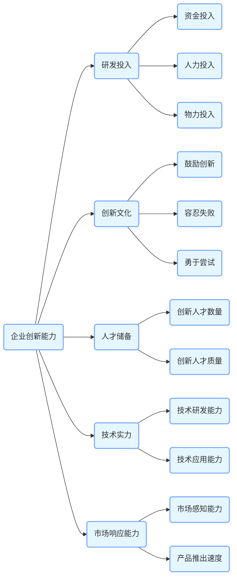

# 菲利普·费雪的创新能力评估模型

> 关键词：菲利普·费雪、创新能力评估模型、企业评估、投资分析、创新指标、商业创新、评估方法

> 摘要：本文围绕菲利普·费雪的创新能力评估模型展开深入探讨。首先介绍了该模型提出的背景、目的和适用范围，明确预期读者群体。详细阐述了模型的核心概念、架构及各要素间的联系，通过Mermaid流程图和文本示意图进行直观展示。深入剖析了模型的核心算法原理，结合Python源代码进行具体说明。运用数学模型和公式对模型进行量化分析，并举例说明其应用。通过项目实战，搭建开发环境，展示源代码实现并进行详细解读。探讨了该模型在实际商业和投资领域的应用场景。推荐了学习该模型相关的工具和资源，包括书籍、在线课程、技术博客、开发工具框架以及相关论文著作。最后总结了该模型的未来发展趋势与挑战，解答常见问题，并提供扩展阅读和参考资料，旨在为读者全面理解和应用菲利普·费雪的创新能力评估模型提供全面且深入的指导。

## 1. 背景介绍 
### 1.1 目的和范围
菲利普·费雪是投资领域的传奇人物，他提出的创新能力评估模型旨在帮助投资者和企业管理者评估企业的创新潜力和能力。该模型的目的在于通过一系列的指标和方法，对企业的创新活动进行系统的分析和评价，从而判断企业是否具备持续发展和创造价值的能力。

此模型的范围涵盖了多个方面，包括企业的研发投入、创新文化、人才储备、技术实力、市场响应能力等。通过综合考虑这些因素，能够更全面地了解企业的创新状况，为投资决策、企业战略规划等提供有力的支持。

### 1.2 预期读者
本文的预期读者主要包括以下几类人群：
1. **投资者**：希望通过评估企业的创新能力，筛选出具有投资价值的企业，获取长期的投资回报。
2. **企业管理者**：借助该模型了解企业自身的创新优势和不足，制定相应的战略和措施，提升企业的创新竞争力。
3. **学术研究人员**：对创新理论和评估方法感兴趣，希望通过研究该模型，进一步拓展和完善创新评估的理论体系。
4. **行业分析师**：用于分析行业内企业的创新动态和竞争格局，为行业研究和报告提供有价值的信息。

### 1.3 文档结构概述
本文将按照以下结构进行阐述：
1. **核心概念与联系**：介绍菲利普·费雪创新能力评估模型的核心概念，包括各评估指标的含义和相互关系，通过文本示意图和Mermaid流程图进行直观展示。
2. **核心算法原理 & 具体操作步骤**：详细讲解模型的核心算法原理，并使用Python源代码进行具体实现和说明。
3. **数学模型和公式 & 详细讲解 & 举例说明**：运用数学模型和公式对模型进行量化分析，并通过实际案例说明其应用。
4. **项目实战：代码实际案例和详细解释说明**：搭建开发环境，展示源代码的详细实现，并对代码进行解读和分析。
5. **实际应用场景**：探讨该模型在实际商业和投资领域的应用场景。
6. **工具和资源推荐**：推荐学习该模型相关的书籍、在线课程、技术博客、开发工具框架以及相关论文著作。
7. **总结：未来发展趋势与挑战**：总结该模型的未来发展趋势和面临的挑战。
8. **附录：常见问题与解答**：解答读者在理解和应用该模型过程中可能遇到的常见问题。
9. **扩展阅读 & 参考资料**：提供相关的扩展阅读资料和参考书目。

### 1.4 术语表
#### 1.4.1 核心术语定义
1. **创新能力**：企业在技术、产品、服务、管理等方面进行创新的能力，包括创新的意愿、创新的资源投入、创新的产出等方面。
2. **研发投入**：企业为了开展研发活动而投入的资金、人力、物力等资源。
3. **创新文化**：企业内部形成的鼓励创新、容忍失败、勇于尝试的文化氛围。
4. **人才储备**：企业拥有的具有创新能力和专业知识的人才数量和质量。
5. **技术实力**：企业在技术研发、技术应用等方面的能力和水平。
6. **市场响应能力**：企业对市场变化的感知和反应能力，能够及时推出符合市场需求的产品和服务。

#### 1.4.2 相关概念解释
1. **创新指标体系**：由多个评估指标组成的体系，用于全面、客观地评估企业的创新能力。
2. **权重分配**：为了反映各评估指标在评估模型中的重要程度，需要对每个指标分配相应的权重。
3. **评估得分**：通过对各评估指标的评分和权重计算得到的综合得分，用于衡量企业的创新能力。

#### 1.4.3 缩略词列表
本文中未使用缩略词。

## 2. 核心概念与联系 
菲利普·费雪的创新能力评估模型的核心概念包括研发投入、创新文化、人才储备、技术实力和市场响应能力等。这些概念相互关联，共同构成了企业创新能力的评估体系。

### 核心概念原理
1. **研发投入**：研发投入是企业创新的基础，它反映了企业对创新的重视程度和资源投入力度。足够的研发投入可以为企业的创新活动提供物质保障，促进新技术、新产品的研发。
2. **创新文化**：创新文化是企业创新的土壤，它能够激发员工的创新热情和创造力，营造良好的创新氛围。在创新文化的熏陶下，员工更愿意尝试新的想法和方法，为企业的创新做出贡献。
3. **人才储备**：人才是企业创新的核心力量，拥有高素质的创新人才是企业创新成功的关键。企业需要吸引和培养具有创新能力和专业知识的人才，为创新活动提供智力支持。
4. **技术实力**：技术实力是企业创新的支撑，它决定了企业在技术研发和应用方面的能力和水平。企业需要不断提升自身的技术实力，掌握核心技术，才能在市场竞争中占据优势。
5. **市场响应能力**：市场响应能力是企业创新的导向，它要求企业能够及时了解市场需求的变化，快速推出符合市场需求的产品和服务。只有满足市场需求，企业的创新成果才能得到市场的认可。

### 架构的文本示意图
```plaintext
企业创新能力
|-- 研发投入
|   |-- 资金投入
|   |-- 人力投入
|   |-- 物力投入
|-- 创新文化
|   |-- 鼓励创新
|   |-- 容忍失败
|   |-- 勇于尝试
|-- 人才储备
|   |-- 创新人才数量
|   |-- 创新人才质量
|-- 技术实力
|   |-- 技术研发能力
|   |-- 技术应用能力
|-- 市场响应能力
|   |-- 市场感知能力
|   |-- 产品推出速度
```

### Mermaid流程图


从流程图可以看出，企业创新能力由研发投入、创新文化、人才储备、技术实力和市场响应能力这五个核心要素共同构成。每个核心要素又包含了多个具体的子要素，这些子要素相互影响、相互作用，共同决定了企业的创新能力水平。

## 3. 核心算法原理 & 具体操作步骤 
### 核心算法原理
菲利普·费雪的创新能力评估模型采用加权评分法来计算企业的创新能力得分。具体步骤如下：
1. **确定评估指标**：根据模型的核心概念，确定研发投入、创新文化、人才储备、技术实力和市场响应能力等评估指标。
2. **确定指标权重**：根据各评估指标在企业创新能力中的重要程度，为每个指标分配相应的权重。权重之和为1。
3. **指标评分**：对每个评估指标进行评分，评分范围通常为0 - 10分。评分可以通过定性和定量相结合的方法进行。
4. **计算加权得分**：将每个评估指标的评分乘以其对应的权重，然后将所有指标的加权得分相加，得到企业的创新能力总得分。

### 具体操作步骤
以下是使用Python实现菲利普·费雪创新能力评估模型的具体代码：
```python
# 定义评估指标及其权重
indicators = {
    "研发投入": 0.2,
    "创新文化": 0.2,
    "人才储备": 0.2,
    "技术实力": 0.2,
    "市场响应能力": 0.2
}

# 定义各指标的评分
scores = {
    "研发投入": 7,
    "创新文化": 8,
    "人才储备": 6,
    "技术实力": 7,
    "市场响应能力": 8
}

# 计算加权得分
total_score = 0
for indicator, weight in indicators.items():
    score = scores[indicator]
    weighted_score = score * weight
    total_score += weighted_score

# 输出结果
print(f"企业的创新能力总得分: {total_score}")
```
### 代码解释
1. **定义评估指标及其权重**：使用字典`indicators`存储评估指标及其对应的权重。
2. **定义各指标的评分**：使用字典`scores`存储各评估指标的评分。
3. **计算加权得分**：通过遍历`indicators`字典，将每个指标的评分乘以其对应的权重，然后将所有指标的加权得分相加，得到企业的创新能力总得分。
4. **输出结果**：使用`print`函数输出企业的创新能力总得分。

通过以上步骤，我们可以使用Python实现菲利普·费雪的创新能力评估模型，并计算出企业的创新能力得分。

## 4. 数学模型和公式 & 详细讲解 & 举例说明 
### 数学模型和公式
菲利普·费雪的创新能力评估模型的数学模型可以表示为：
$$
S = \sum_{i=1}^{n} w_i \times s_i
$$
其中，$S$ 表示企业的创新能力总得分，$n$ 表示评估指标的数量，$w_i$ 表示第 $i$ 个评估指标的权重，$s_i$ 表示第 $i$ 个评估指标的评分。

### 详细讲解
1. **评估指标**：$n$ 个评估指标包括研发投入、创新文化、人才储备、技术实力和市场响应能力等。
2. **权重**：$w_i$ 表示每个评估指标的重要程度，权重之和为1，即 $\sum_{i=1}^{n} w_i = 1$。
3. **评分**：$s_i$ 表示每个评估指标的评分，评分范围通常为0 - 10分。
4. **总得分**：通过将每个评估指标的评分乘以其对应的权重，然后将所有指标的加权得分相加，得到企业的创新能力总得分 $S$。

### 举例说明
假设我们要评估一家企业的创新能力，评估指标及其权重如下：
| 评估指标 | 权重 |
| ---- | ---- |
| 研发投入 | 0.2 |
| 创新文化 | 0.2 |
| 人才储备 | 0.2 |
| 技术实力 | 0.2 |
| 市场响应能力 | 0.2 |

各评估指标的评分如下：
| 评估指标 | 评分 |
| ---- | ---- |
| 研发投入 | 7 |
| 创新文化 | 8 |
| 人才储备 | 6 |
| 技术实力 | 7 |
| 市场响应能力 | 8 |

根据上述公式，计算该企业的创新能力总得分：
$$
\begin{align*}
S &= 0.2 \times 7 + 0.2 \times 8 + 0.2 \times 6 + 0.2 \times 7 + 0.2 \times 8 \\
&= 1.4 + 1.6 + 1.2 + 1.4 + 1.6 \\
&= 7.2
\end{align*}
$$

因此，该企业的创新能力总得分是7.2分。通过这个得分，我们可以对该企业的创新能力有一个初步的了解，并与其他企业进行比较。

## 5. 项目实战：代码实际案例和详细解释说明 
### 5.1  开发环境搭建
为了实现菲利普·费雪的创新能力评估模型，我们需要搭建一个Python开发环境。以下是具体的搭建步骤：
1. **安装Python**：从Python官方网站（https://www.python.org/downloads/）下载并安装Python 3.x版本。
2. **安装开发工具**：推荐使用Visual Studio Code或PyCharm作为开发工具。这些工具提供了丰富的功能，如代码编辑、调试、版本控制等。
3. **创建虚拟环境**：为了避免不同项目之间的依赖冲突，建议创建一个虚拟环境。在命令行中执行以下命令：
```bash
python -m venv myenv
```
其中，`myenv` 是虚拟环境的名称。
4. **激活虚拟环境**：在命令行中执行以下命令激活虚拟环境：
- Windows系统：
```bash
myenv\Scripts\activate
```
- Linux/Mac系统：
```bash
source myenv/bin/activate
```

### 5.2  源代码详细实现和代码解读
以下是一个完整的Python代码示例，用于实现菲利普·费雪的创新能力评估模型：
```python
# 定义评估指标及其权重
indicators = {
    "研发投入": 0.2,
    "创新文化": 0.2,
    "人才储备": 0.2,
    "技术实力": 0.2,
    "市场响应能力": 0.2
}

# 定义各指标的评分函数
def get_scores():
    scores = {}
    for indicator in indicators.keys():
        while True:
            try:
                score = float(input(f"请输入 {indicator} 的评分 (0 - 10): "))
                if 0 <= score <= 10:
                    scores[indicator] = score
                    break
                else:
                    print("评分必须在0 - 10之间，请重新输入。")
            except ValueError:
                print("输入无效，请输入一个有效的数字。")
    return scores

# 计算加权得分
def calculate_total_score(indicators, scores):
    total_score = 0
    for indicator, weight in indicators.items():
        score = scores[indicator]
        weighted_score = score * weight
        total_score += weighted_score
    return total_score

# 主函数
def main():
    scores = get_scores()
    total_score = calculate_total_score(indicators, scores)
    print(f"企业的创新能力总得分: {total_score}")

if __name__ == "__main__":
    main()
```
### 代码解读
1. **定义评估指标及其权重**：使用字典`indicators`存储评估指标及其对应的权重。
2. **定义各指标的评分函数**：`get_scores`函数用于获取用户输入的各评估指标的评分。通过循环和异常处理，确保用户输入的评分在0 - 10之间。
3. **计算加权得分**：`calculate_total_score`函数用于计算企业的创新能力总得分。通过遍历`indicators`字典，将每个指标的评分乘以其对应的权重，然后将所有指标的加权得分相加。
4. **主函数**：`main`函数是程序的入口点，它调用`get_scores`函数获取用户输入的评分，然后调用`calculate_total_score`函数计算总得分，并输出结果。

### 5.3  代码解读与分析
通过上述代码，我们可以实现一个简单的菲利普·费雪创新能力评估模型。用户可以根据实际情况输入各评估指标的评分，程序将自动计算企业的创新能力总得分。

该代码的优点是简单易懂，易于实现。但也存在一些不足之处，例如：
1. **评分方式单一**：目前只支持用户手动输入评分，缺乏更客观的数据来源。
2. **缺乏数据存储和分析功能**：代码没有提供数据存储和分析的功能，无法对多个企业的创新能力进行比较和分析。
3. **权重固定**：评估指标的权重是固定的，无法根据不同的行业和企业特点进行调整。

为了改进这些不足之处，我们可以考虑以下优化方案：
1. **引入客观数据**：可以从企业的财务报表、专利数据库等获取研发投入、技术实力等方面的客观数据，减少主观评分的误差。
2. **数据存储和分析**：使用数据库或文件系统存储企业的评估数据，并开发相应的分析工具，对数据进行统计和分析。
3. **动态调整权重**：根据不同的行业和企业特点，动态调整评估指标的权重，提高评估的准确性。

## 6. 实际应用场景 
菲利普·费雪的创新能力评估模型在实际商业和投资领域具有广泛的应用场景。以下是一些具体的应用场景：
### 投资决策
投资者在选择投资对象时，可以使用该模型评估企业的创新能力。具有较高创新能力的企业通常具有更强的竞争力和发展潜力，能够为投资者带来更高的回报。通过对不同企业的创新能力进行比较和分析，投资者可以筛选出具有投资价值的企业，降低投资风险。

### 企业战略规划
企业管理者可以使用该模型评估企业自身的创新能力，了解企业在创新方面的优势和不足。根据评估结果，企业可以制定相应的战略和措施，加大研发投入，培养创新人才，营造创新文化，提升企业的创新竞争力。同时，企业还可以根据市场需求和竞争态势，调整创新战略，优化产品和服务，提高市场占有率。

### 行业分析
行业分析师可以使用该模型对行业内企业的创新能力进行评估和分析，了解行业的创新动态和竞争格局。通过比较不同企业的创新能力得分，分析师可以发现行业内的创新领导者和追随者，预测行业的发展趋势。这有助于企业制定行业竞争策略，政府部门制定相关政策，促进整个行业的创新发展。

### 合作伙伴选择
企业在选择合作伙伴时，可以使用该模型评估合作伙伴的创新能力。与具有较高创新能力的合作伙伴合作，可以实现资源共享、优势互补，共同开展创新项目，提高企业的创新效率和竞争力。同时，创新能力强的合作伙伴还能够为企业带来新的技术、理念和市场机会，促进企业的发展。

## 7. 工具和资源推荐
### 7.1 学习资源推荐
#### 7.1.1 书籍推荐
1. 《怎样选择成长股》（Common Stocks and Uncommon Profits）：菲利普·费雪的经典著作，详细阐述了他的投资理念和方法，其中包括对企业创新能力的评估和分析。
2. 《创新者的窘境》（The Innovator's Dilemma）：克莱顿·克里斯坦森的经典著作，探讨了企业在创新过程中面临的挑战和困境，以及如何应对这些挑战。
3. 《创新管理》（Managing Innovation）：克里斯托弗·弗里曼和卢桑·苏特的著作，系统介绍了创新管理的理论和方法，对企业的创新能力评估和提升具有重要的指导意义。

#### 7.1.2 在线课程
1. Coursera平台上的“Innovation Management and Entrepreneurship”课程：由欧洲工商管理学院（INSEAD）的教授授课，介绍了创新管理的基本概念、方法和工具，以及如何在创业和企业管理中应用创新。
2. edX平台上的“Technology and Innovation Management”课程：由麻省理工学院（MIT）的教授授课，探讨了技术创新的战略、组织和管理问题，帮助学员了解如何推动企业的技术创新。
3. Udemy平台上的“Innovation Strategy and Management”课程：提供了创新战略和管理的实用技巧和方法，适合企业管理者和创业者学习。

#### 7.1.3 技术博客和网站
1. Harvard Business Review（哈佛商业评论）：提供了大量关于创新管理、企业战略和领导力的文章和研究报告，是商业领域的权威媒体。
2. MIT Technology Review（麻省理工科技评论）：关注科技领域的最新发展和创新趋势，发表了许多关于新兴技术和创新企业的报道和分析。
3. Fast Company（快公司）：以创新和创业为主题，报道了许多创新企业和创新人物的故事，提供了创新思维和实践的灵感。

### 7.2 开发工具框架推荐
#### 7.2.1 IDE和编辑器
1. Visual Studio Code：一款轻量级的开源代码编辑器，支持多种编程语言和开发框架，具有丰富的插件和扩展功能。
2. PyCharm：一款专门为Python开发设计的集成开发环境（IDE），提供了代码编辑、调试、版本控制等一系列功能，适合Python开发者使用。
3. Jupyter Notebook：一种交互式的编程环境，支持多种编程语言，适合进行数据探索、数据分析和机器学习等任务。

#### 7.2.2 调试和性能分析工具
1. Py-Spy：一款用于Python程序的性能分析工具，可以实时监测Python程序的CPU使用率、函数调用时间等信息，帮助开发者找出程序的性能瓶颈。
2. cProfile：Python标准库中的性能分析模块，可以统计Python程序中各个函数的调用次数、执行时间等信息，帮助开发者优化程序性能。
3. PDB：Python标准库中的调试模块，可以在Python程序中设置断点，单步执行代码，查看变量的值等，帮助开发者调试程序。

#### 7.2.3 相关框架和库
1. Pandas：一个用于数据处理和分析的Python库，提供了高效的数据结构和数据操作方法，适合处理和分析企业的评估数据。
2. NumPy：一个用于科学计算的Python库，提供了高效的多维数组对象和数学函数，适合进行数值计算和矩阵运算。
3. Scikit-learn：一个用于机器学习的Python库，提供了丰富的机器学习算法和工具，适合进行数据建模和预测分析。

### 7.3 相关论文著作推荐
#### 7.3.1 经典论文
1. “A Contribution to the Theory of Economic Growth”（Robert M. Solow）：该论文提出了新古典经济增长模型，强调了技术进步在经济增长中的重要作用，为创新理论的发展奠定了基础。
2. “The Sources of Innovation”（Eric von Hippel）：该论文探讨了创新的来源和创新过程，提出了用户创新和开放式创新的概念，对企业的创新管理具有重要的启示。
3. “Innovation and Entrepreneurship: Practice and Principles”（Peter F. Drucker）：该论文阐述了创新和创业的基本原理和方法，强调了创新在企业发展中的重要性，是创新管理领域的经典之作。

#### 7.3.2 最新研究成果
1. 近年来，随着人工智能、大数据、区块链等新兴技术的发展，创新管理领域也涌现出了许多新的研究成果。例如，一些研究探讨了如何利用人工智能技术提高企业的创新能力，如何利用大数据分析挖掘创新机会等。
2. 此外，一些研究还关注了创新生态系统的构建和发展，探讨了企业、政府、高校和科研机构等不同主体在创新生态系统中的作用和合作机制。

#### 7.3.3 应用案例分析
1. 《创新者的基因》（The Innovator's DNA）：该书通过对大量创新企业和创新人物的案例分析，总结了创新者的五个关键技能和行为模式，为企业培养创新人才和推动创新提供了实践指导。
2. 《从零到一》（Zero to One）：该书介绍了创业公司从无到有的过程和方法，通过对特斯拉、PayPal等创新企业的案例分析，探讨了如何在竞争激烈的市场中实现创新和突破。
3. 《腾讯传》：该书讲述了腾讯公司的发展历程和创新故事，通过对腾讯公司在社交、游戏、金融等领域的创新实践的分析，展示了企业如何通过持续创新实现快速发展。

## 8. 总结：未来发展趋势与挑战
### 未来发展趋势
1. **与新兴技术融合**：随着人工智能、大数据、区块链等新兴技术的不断发展，菲利普·费雪的创新能力评估模型将与这些技术深度融合。例如，利用人工智能技术对企业的创新数据进行分析和挖掘，提高评估的准确性和效率；利用区块链技术确保评估数据的安全性和可信度。
2. **强调创新生态系统评估**：未来的创新能力评估将不仅仅关注企业自身的创新能力，还将更加注重企业所处的创新生态系统。评估模型将考虑企业与供应商、客户、合作伙伴、高校和科研机构等创新生态系统中的其他主体的合作关系和互动情况，以更全面地评估企业的创新潜力。
3. **动态评估和实时监测**：传统的创新能力评估通常是定期进行的，具有一定的滞后性。未来的评估模型将实现动态评估和实时监测，能够及时反映企业创新能力的变化情况。通过实时收集和分析企业的创新数据，为企业和投资者提供及时的决策支持。
4. **跨行业和跨国界评估**：随着全球化的发展，企业的创新活动越来越跨越行业和国家的界限。未来的评估模型将能够进行跨行业和跨国界的评估，比较不同行业和不同国家企业的创新能力，为企业的国际化发展和全球创新合作提供参考。

### 面临的挑战
1. **数据获取和质量问题**：创新能力评估需要大量的数据支持，包括企业的研发投入、专利数据、市场销售数据等。然而，这些数据的获取往往存在一定的困难，并且数据的质量也参差不齐。如何获取准确、完整、可靠的数据是评估模型面临的一个重要挑战。
2. **指标体系的动态调整**：随着科技的不断进步和市场环境的变化，企业的创新模式和创新要素也在不断演变。因此，评估模型的指标体系需要不断进行动态调整，以适应新的创新趋势和需求。如何确定合理的指标体系和调整机制是一个具有挑战性的问题。
3. **主观因素的影响**：创新能力评估中难免会受到主观因素的影响，例如评估人员的专业知识、经验和判断能力等。如何减少主观因素的影响，提高评估的客观性和公正性是评估模型需要解决的问题。
4. **模型的可解释性和透明度**：随着评估模型的不断复杂和智能化，模型的可解释性和透明度变得越来越重要。投资者和企业管理者需要了解模型的评估原理和过程，以便对评估结果进行合理的判断和决策。如何提高模型的可解释性和透明度是一个亟待解决的问题。

## 9. 附录：常见问题与解答
### 问题1：如何确定评估指标的权重？
评估指标的权重可以根据不同的行业和企业特点进行调整。一般来说，可以采用专家咨询法、层次分析法等方法来确定权重。专家咨询法是通过邀请行业专家和学者对各评估指标的重要程度进行打分，然后根据打分结果确定权重。层次分析法是一种多目标决策分析方法，通过构建层次结构模型，对各评估指标的相对重要性进行比较和判断，从而确定权重。

### 问题2：评分的标准是什么？
评分的标准可以根据具体的评估指标和实际情况进行制定。一般来说，可以采用定性和定量相结合的方法进行评分。例如，对于研发投入指标，可以根据企业的研发费用占销售收入的比例进行定量评分；对于创新文化指标，可以通过问卷调查、访谈等方式进行定性评分。评分范围通常为0 - 10分，分数越高表示该指标的表现越好。

### 问题3：该模型适用于所有行业的企业吗？
该模型的基本原理和方法适用于大多数行业的企业，但在具体应用时需要根据不同行业的特点进行调整。例如，对于高科技行业的企业，研发投入和技术实力可能更为重要；对于服务业的企业，市场响应能力和创新文化可能更为关键。因此，在使用该模型时，需要结合行业特点和企业实际情况，合理确定评估指标和权重。

### 问题4：如何提高企业的创新能力得分？
企业可以从以下几个方面提高创新能力得分：
1. **加大研发投入**：增加研发资金、人力和物力的投入，提高企业的研发能力。
2. **营造创新文化**：鼓励员工创新，容忍失败，营造良好的创新氛围。
3. **培养和吸引创新人才**：加强人才培养和引进，提高企业的人才储备。
4. **提升技术实力**：加强技术研发和应用，掌握核心技术，提高企业的技术水平。
5. **增强市场响应能力**：及时了解市场需求的变化，快速推出符合市场需求的产品和服务。

### 问题5：该模型可以用于预测企业的未来发展吗？
该模型可以在一定程度上预测企业的未来发展，但不能完全准确地预测。创新能力是企业未来发展的重要因素之一，但企业的发展还受到市场环境、竞争态势、管理水平等多种因素的影响。因此，在使用该模型进行预测时，需要结合其他因素进行综合分析，以提高预测的准确性。

## 10. 扩展阅读 & 参考资料
### 扩展阅读
1. 《创新者的密码》（The Innovator's Code）：介绍了创新的基本原理和方法，以及如何在企业中培养创新文化和创新能力。
2. 《创意阶层的崛起》（The Rise of the Creative Class）：探讨了创意阶层在经济发展和社会变革中的作用，以及如何吸引和留住创意人才。
3. 《颠覆式创新》（Disruptive Innovation）：介绍了颠覆式创新的概念和理论，以及如何通过颠覆式创新实现企业的突破和发展。

### 参考资料
1. Fisher, Philip A. Common Stocks and Uncommon Profits. Harper & Brothers, 1958.
2. Christensen, Clayton M. The Innovator's Dilemma: When New Technologies Cause Great Firms to Fail. Harvard Business School Press, 1997.
3. Freeman, Christopher, and Luc Soete. Managing Innovation: The Collection. Oxford University Press, 2009.
4. von Hippel, Eric. The Sources of Innovation. Oxford University Press, 1988.
5. Drucker, Peter F. Innovation and Entrepreneurship: Practice and Principles. Harper & Row, 1985.