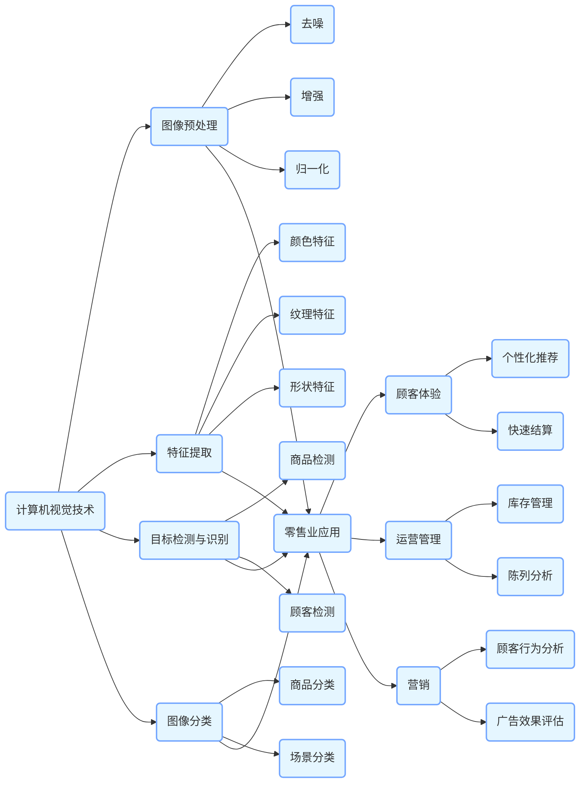

# 计算机视觉技术在零售业的应用与投资机会

> 关键词：计算机视觉技术、零售业、应用场景、投资机会、技术原理

> 摘要：本文深入探讨了计算机视觉技术在零售业的应用与投资机会。首先介绍了相关背景，包括目的范围、预期读者等。接着阐述了计算机视觉的核心概念及与零售业的联系，详细讲解了核心算法原理和操作步骤，给出了数学模型和公式。通过项目实战展示了代码实现及解读，分析了实际应用场景。推荐了相关的学习资源、开发工具框架和论文著作。最后总结了未来发展趋势与挑战，解答了常见问题并提供了扩展阅读和参考资料，旨在为关注计算机视觉在零售业应用及投资的人士提供全面且深入的参考。

## 1. 背景介绍 
### 1.1 目的和范围
本文旨在全面剖析计算机视觉技术在零售业中的具体应用，以及由此带来的投资机会。我们将涵盖计算机视觉技术的基本原理、在零售业各环节的应用案例、相关算法和数学模型，同时分析当前的投资环境和潜在的投资方向。范围涉及从线下实体店铺到线上电商平台的各种零售场景，包括但不限于商品陈列分析、顾客行为识别、智能结算等方面。

### 1.2 预期读者
本文的预期读者包括零售行业从业者，如零售商、店铺运营管理人员等，他们可以从中了解如何利用计算机视觉技术提升运营效率和顾客体验；计算机视觉技术开发者和研究人员，可获取在零售领域的应用场景和需求；投资者则能洞察该领域的投资机会和潜在风险；此外，对新兴技术在传统行业应用感兴趣的普通读者也能从中获得相关知识。

### 1.3 文档结构概述
本文将按照以下结构展开：首先介绍计算机视觉技术和零售业相关的核心概念及它们之间的联系；接着详细讲解计算机视觉的核心算法原理和具体操作步骤，包括使用 Python 代码进行阐述；然后给出相关的数学模型和公式，并举例说明；通过项目实战展示代码的实际应用和详细解释；分析计算机视觉技术在零售业的实际应用场景；推荐相关的学习资源、开发工具框架和论文著作；最后总结未来发展趋势与挑战，解答常见问题并提供扩展阅读和参考资料。

### 1.4 术语表
#### 1.4.1 核心术语定义
- **计算机视觉技术**：是指让计算机从图像或视频中获取信息，像人类视觉系统一样理解和解释视觉数据的技术。它涉及图像采集、处理、分析和理解等多个环节。
- **零售业**：是指通过买卖形式将工农业生产者生产的产品直接售给居民作为生活消费用或售给社会集团供公共消费用的商品销售行业。
- **目标检测**：计算机视觉中的一项任务，旨在识别图像或视频中特定目标的位置和类别。
- **图像分类**：将图像分配到预定义的类别中的过程。
- **人脸识别**：识别和验证人脸的技术，可用于顾客身份识别等场景。

#### 1.4.2 相关概念解释
- **深度学习**：是机器学习的一个分支领域，它通过构建具有多个层次的神经网络模型，自动从大量数据中学习特征和模式，在计算机视觉中得到广泛应用。
- **卷积神经网络（CNN）**：一种专门为处理具有网格结构数据（如图像）而设计的深度学习模型，通过卷积层、池化层等结构提取图像特征。
- **强化学习**：一种机器学习方法，智能体通过与环境进行交互，根据环境反馈的奖励信号来学习最优的行为策略。

#### 1.4.3 缩略词列表
- **CNN**：Convolutional Neural Network（卷积神经网络）
- **RCNN**：Region-based Convolutional Neural Network（基于区域的卷积神经网络）
- **YOLO**：You Only Look Once（一种实时目标检测算法）
- **SIFT**：Scale-Invariant Feature Transform（尺度不变特征变换）

## 2. 核心概念与联系 

### 2.1 计算机视觉技术核心概念
计算机视觉技术主要包括图像预处理、特征提取、目标检测与识别、图像分类等核心环节。

图像预处理是对原始图像进行去噪、增强、归一化等操作，以提高后续处理的准确性。例如，在零售场景中，由于光照条件不同，图像可能存在亮度不均的问题，通过直方图均衡化等方法可以改善图像的视觉效果。

特征提取是从图像中提取具有代表性的特征，这些特征可以描述图像的内容和结构。常见的特征包括颜色特征、纹理特征和形状特征等。例如，在商品识别中，可以提取商品的颜色、纹理等特征来区分不同的商品。

目标检测与识别是确定图像中目标的位置和类别。例如，在超市货架上检测商品的位置和种类，以便进行库存管理和陈列分析。

图像分类是将图像分配到预定义的类别中。例如，将商品图像分类为食品、日用品、服装等类别。

### 2.2 计算机视觉技术与零售业的联系
计算机视觉技术可以为零售业带来多方面的提升。在顾客体验方面，通过人脸识别技术可以实现个性化推荐，根据顾客的历史购买记录和偏好，为其推荐合适的商品。在运营管理方面，利用目标检测技术可以实时监测货架上商品的库存情况，及时补货，提高运营效率。在营销方面，通过分析顾客的行为和表情，了解顾客对商品的兴趣度，制定更有效的营销策略。

### 2.3 文本示意图
计算机视觉技术在零售业的应用可以用以下示意图表示：

计算机视觉技术
|-- 图像预处理
|   |-- 去噪
|   |-- 增强
|   |-- 归一化
|-- 特征提取
|   |-- 颜色特征
|   |-- 纹理特征
|   |-- 形状特征
|-- 目标检测与识别
|   |-- 商品检测
|   |-- 顾客检测
|-- 图像分类
|   |-- 商品分类
|   |-- 场景分类

零售业应用
|-- 顾客体验
|   |-- 个性化推荐
|   |-- 快速结算
|-- 运营管理
|   |-- 库存管理
|   |-- 陈列分析
|-- 营销
|   |-- 顾客行为分析
|   |-- 广告效果评估

### 2.4 Mermaid 流程图


## 3. 核心算法原理 & 具体操作步骤 

### 3.1 目标检测算法 - YOLO（You Only Look Once）原理
YOLO 是一种实时目标检测算法，它将目标检测问题转化为一个回归问题。YOLO 算法将输入图像划分为 $S\times S$ 个网格，每个网格负责预测一定数量的边界框（bounding boxes）和对应的类别概率。

具体来说，对于每个网格，YOLO 预测 $B$ 个边界框，每个边界框包含 5 个参数：边界框的中心坐标 $(x,y)$、宽 $w$、高 $h$ 和置信度 $confidence$。置信度表示边界框内包含目标的概率以及边界框的预测准确性。同时，每个网格还预测 $C$ 个类别概率，表示该网格内目标属于各个类别的概率。

### 3.2 Python 代码实现 YOLO 目标检测
```python
import cv2
import numpy as np

# 加载 YOLO 模型
net = cv2.dnn.readNet('yolov3.weights', 'yolov3.cfg')

# 获取 YOLO 模型的输出层名称
layer_names = net.getLayerNames()
output_layers = [layer_names[i[0] - 1] for i in net.getUnconnectedOutLayers()]

# 加载图像
img = cv2.imread('retail_image.jpg')
height, width, channels = img.shape

# 对图像进行预处理
blob = cv2.dnn.blobFromImage(img, 0.00392, (416, 416), (0, 0, 0), True, crop=False)
net.setInput(blob)

# 前向传播
outs = net.forward(output_layers)

# 初始化变量
class_ids = []
confidences = []
boxes = []

# 遍历输出层的结果
for out in outs:
    for detection in out:
        scores = detection[5:]
        class_id = np.argmax(scores)
        confidence = scores[class_id]
        if confidence > 0.5:
            # 检测到目标
            center_x = int(detection[0] * width)
            center_y = int(detection[1] * height)
            w = int(detection[2] * width)
            h = int(detection[3] * height)

            # 计算边界框的左上角坐标
            x = int(center_x - w / 2)
            y = int(center_y - h / 2)

            boxes.append([x, y, w, h])
            confidences.append(float(confidence))
            class_ids.append(class_id)

# 非极大值抑制
indexes = cv2.dnn.NMSBoxes(boxes, confidences, 0.5, 0.4)

# 绘制边界框和标签
font = cv2.FONT_HERSHEY_PLAIN
colors = np.random.uniform(0, 255, size=(len(boxes), 3))
if len(indexes) > 0:
    for i in indexes.flatten():
        x, y, w, h = boxes[i]
        label = str(class_ids[i])
        confidence = str(round(confidences[i], 2))
        color = colors[i]
        cv2.rectangle(img, (x, y), (x + w, y + h), color, 2)
        cv2.putText(img, label + " " + confidence, (x, y + 20), font, 2, color, 2)

# 显示结果
cv2.imshow('Object Detection', img)
cv2.waitKey(0)
cv2.destroyAllWindows()
```

### 3.3 代码解读
1. **加载模型**：使用 `cv2.dnn.readNet` 函数加载 YOLO 模型的权重文件和配置文件。
2. **获取输出层名称**：通过 `net.getUnconnectedOutLayers` 函数获取 YOLO 模型的输出层名称。
3. **图像预处理**：使用 `cv2.dnn.blobFromImage` 函数将输入图像转换为适合模型输入的格式。
4. **前向传播**：调用 `net.forward` 函数进行前向传播，得到模型的输出结果。
5. **处理输出结果**：遍历输出结果，筛选出置信度大于 0.5 的边界框，并记录其坐标、置信度和类别。
6. **非极大值抑制**：使用 `cv2.dnn.NMSBoxes` 函数进行非极大值抑制，去除重叠的边界框。
7. **绘制边界框和标签**：使用 `cv2.rectangle` 和 `cv2.putText` 函数在图像上绘制边界框和标签。
8. **显示结果**：使用 `cv2.imshow` 函数显示处理后的图像。

### 3.4 图像分类算法 - 卷积神经网络（CNN）原理
卷积神经网络（CNN）是一种专门用于处理图像数据的深度学习模型。它主要由卷积层、池化层和全连接层组成。

卷积层通过卷积核在图像上滑动，进行卷积操作，提取图像的特征。卷积核可以学习到图像的局部特征，如边缘、纹理等。

池化层用于降低特征图的维度，减少计算量，同时增强模型的鲁棒性。常见的池化操作有最大池化和平均池化。

全连接层将卷积层和池化层提取的特征进行融合，输出最终的分类结果。

### 3.5 Python 代码实现简单的 CNN 图像分类
```python
import tensorflow as tf
from tensorflow.keras import layers, models

# 构建 CNN 模型
model = models.Sequential()
model.add(layers.Conv2D(32, (3, 3), activation='relu', input_shape=(32, 32, 3)))
model.add(layers.MaxPooling2D((2, 2)))
model.add(layers.Conv2D(64, (3, 3), activation='relu'))
model.add(layers.MaxPooling2D((2, 2)))
model.add(layers.Conv2D(64, (3, 3), activation='relu'))
model.add(layers.Flatten())
model.add(layers.Dense(64, activation='relu'))
model.add(layers.Dense(10))

# 编译模型
model.compile(optimizer='adam',
              loss=tf.keras.losses.SparseCategoricalCrossentropy(from_logits=True),
              metrics=['accuracy'])

# 加载数据集
(train_images, train_labels), (test_images, test_labels) = tf.keras.datasets.cifar10.load_data()

# 数据预处理
train_images, test_images = train_images / 255.0, test_images / 255.0

# 训练模型
history = model.fit(train_images, train_labels, epochs=10, 
                    validation_data=(test_images, test_labels))

# 评估模型
test_loss, test_acc = model.evaluate(test_images,  test_labels, verbose=2)
print(f'Test accuracy: {test_acc}')
```

### 3.6 代码解读
1. **构建模型**：使用 `tensorflow.keras.Sequential` 构建一个简单的 CNN 模型，包含卷积层、池化层和全连接层。
2. **编译模型**：使用 `model.compile` 函数编译模型，指定优化器、损失函数和评估指标。
3. **加载数据集**：使用 `tf.keras.datasets.cifar10.load_data` 加载 CIFAR-10 数据集。
4. **数据预处理**：将图像数据归一化到 [0, 1] 范围内。
5. **训练模型**：使用 `model.fit` 函数训练模型，指定训练数据、训练轮数和验证数据。
6. **评估模型**：使用 `model.evaluate` 函数评估模型在测试数据上的性能。

## 4. 数学模型和公式 & 详细讲解 & 举例说明 

### 4.1 卷积操作数学模型
卷积操作是卷积神经网络的核心操作，其数学模型可以表示为：

$$y(m,n) = \sum_{i=0}^{M-1}\sum_{j=0}^{N-1} x(m + i, n + j) \cdot w(i,j)$$

其中，$x$ 是输入图像，$w$ 是卷积核，$y$ 是卷积结果，$M$ 和 $N$ 分别是卷积核的高度和宽度。

例如，假设输入图像 $x$ 是一个 $3\times3$ 的矩阵：

$$x = \begin{bmatrix}
1 & 2 & 3 \\
4 & 5 & 6 \\
7 & 8 & 9
\end{bmatrix}$$

卷积核 $w$ 是一个 $2\times2$ 的矩阵：

$$w = \begin{bmatrix}
1 & 0 \\
0 & 1
\end{bmatrix}$$

则卷积结果 $y$ 可以通过以下计算得到：

$$y(0,0) = x(0,0) \cdot w(0,0) + x(0,1) \cdot w(0,1) + x(1,0) \cdot w(1,0) + x(1,1) \cdot w(1,1) = 1\times1 + 2\times0 + 4\times0 + 5\times1 = 6$$

$$y(0,1) = x(0,1) \cdot w(0,0) + x(0,2) \cdot w(0,1) + x(1,1) \cdot w(1,0) + x(1,2) \cdot w(1,1) = 2\times1 + 3\times0 + 5\times0 + 6\times1 = 8$$

$$y(1,0) = x(1,0) \cdot w(0,0) + x(1,1) \cdot w(0,1) + x(2,0) \cdot w(1,0) + x(2,1) \cdot w(1,1) = 4\times1 + 5\times0 + 7\times0 + 8\times1 = 12$$

$$y(1,1) = x(1,1) \cdot w(0,0) + x(1,2) \cdot w(0,1) + x(2,1) \cdot w(1,0) + x(2,2) \cdot w(1,1) = 5\times1 + 6\times0 + 8\times0 + 9\times1 = 14$$

所以，卷积结果 $y$ 为：

$$y = \begin{bmatrix}
6 & 8 \\
12 & 14
\end{bmatrix}$$

### 4.2 池化操作数学模型
最大池化操作是一种常见的池化操作，其数学模型可以表示为：

$$y(m,n) = \max_{i=0}^{M-1}\max_{j=0}^{N-1} x(m \cdot s + i, n \cdot s + j)$$

其中，$x$ 是输入特征图，$y$ 是池化结果，$M$ 和 $N$ 分别是池化窗口的高度和宽度，$s$ 是步长。

例如，假设输入特征图 $x$ 是一个 $4\times4$ 的矩阵：

$$x = \begin{bmatrix}
1 & 2 & 3 & 4 \\
5 & 6 & 7 & 8 \\
9 & 10 & 11 & 12 \\
13 & 14 & 15 & 16
\end{bmatrix}$$

池化窗口大小为 $2\times2$，步长 $s = 2$，则池化结果 $y$ 可以通过以下计算得到：

$$y(0,0) = \max\{x(0,0), x(0,1), x(1,0), x(1,1)\} = \max\{1, 2, 5, 6\} = 6$$

$$y(0,1) = \max\{x(0,2), x(0,3), x(1,2), x(1,3)\} = \max\{3, 4, 7, 8\} = 8$$

$$y(1,0) = \max\{x(2,0), x(2,1), x(3,0), x(3,1)\} = \max\{9, 10, 13, 14\} = 14$$

$$y(1,1) = \max\{x(2,2), x(2,3), x(3,2), x(3,3)\} = \max\{11, 12, 15, 16\} = 16$$

所以，池化结果 $y$ 为：

$$y = \begin{bmatrix}
6 & 8 \\
14 & 16
\end{bmatrix}$$

### 4.3 损失函数 - 交叉熵损失函数
在图像分类任务中，常用的损失函数是交叉熵损失函数。对于一个多分类问题，交叉熵损失函数的数学模型可以表示为：

$$L = -\frac{1}{N}\sum_{i=1}^{N}\sum_{j=1}^{C} y_{ij} \log(p_{ij})$$

其中，$N$ 是样本数量，$C$ 是类别数量，$y_{ij}$ 是第 $i$ 个样本属于第 $j$ 类的真实标签（通常为 0 或 1），$p_{ij}$ 是第 $i$ 个样本属于第 $j$ 类的预测概率。

例如，假设我们有 3 个样本，每个样本有 2 个类别，真实标签 $y$ 和预测概率 $p$ 分别为：

$$y = \begin{bmatrix}
1 & 0 \\
0 & 1 \\
1 & 0
\end{bmatrix}$$

$$p = \begin{bmatrix}
0.8 & 0.2 \\
0.3 & 0.7 \\
0.6 & 0.4
\end{bmatrix}$$

则交叉熵损失 $L$ 可以通过以下计算得到：

$$L = -\frac{1}{3} \left[ (1\times\log(0.8) + 0\times\log(0.2)) + (0\times\log(0.3) + 1\times\log(0.7)) + (1\times\log(0.6) + 0\times\log(0.4)) \right]$$

$$L \approx -\frac{1}{3} \left[ \log(0.8) + \log(0.7) + \log(0.6) \right] \approx 0.35$$

## 5. 项目实战：代码实际案例和详细解释说明 

### 5.1  开发环境搭建
#### 5.1.1 安装 Python
首先，需要安装 Python 环境。可以从 Python 官方网站（https://www.python.org/downloads/） 下载适合自己操作系统的 Python 版本，并按照安装向导进行安装。

#### 5.1.2 安装深度学习框架
本文使用 TensorFlow 和 OpenCV 作为深度学习框架和计算机视觉库。可以使用以下命令进行安装：

```bash
pip install tensorflow
pip install opencv-python
```

#### 5.1.3 安装其他依赖库
还需要安装一些其他的依赖库，如 NumPy、Matplotlib 等。可以使用以下命令进行安装：

```bash
pip install numpy
pip install matplotlib
```

### 5.2  源代码详细实现和代码解读
#### 5.2.1 商品库存管理系统
以下是一个简单的商品库存管理系统的代码实现：

```python
import cv2
import numpy as np

# 加载商品模板图像
template = cv2.imread('product_template.jpg', 0)
w, h = template.shape[::-1]

# 加载货架图像
shelf_image = cv2.imread('shelf_image.jpg', 0)

# 使用模板匹配方法检测商品
res = cv2.matchTemplate(shelf_image, template, cv2.TM_CCOEFF_NORMED)
threshold = 0.8
loc = np.where(res >= threshold)

# 绘制检测到的商品边界框
for pt in zip(*loc[::-1]):
    cv2.rectangle(shelf_image, pt, (pt[0] + w, pt[1] + h), (0, 255, 0), 2)

# 统计商品数量
product_count = len(loc[0])

# 显示结果
cv2.imshow('Product Detection', shelf_image)
cv2.waitKey(0)
cv2.destroyAllWindows()

print(f'商品数量: {product_count}')
```

#### 5.2.2 代码解读
1. **加载商品模板图像和货架图像**：使用 `cv2.imread` 函数加载商品模板图像和货架图像，并将其转换为灰度图像。
2. **模板匹配**：使用 `cv2.matchTemplate` 函数进行模板匹配，得到匹配结果。
3. **筛选匹配结果**：设置一个阈值，筛选出匹配度大于阈值的位置。
4. **绘制边界框**：使用 `cv2.rectangle` 函数在货架图像上绘制检测到的商品边界框。
5. **统计商品数量**：统计匹配结果的数量，即为商品的数量。
6. **显示结果**：使用 `cv2.imshow` 函数显示处理后的货架图像，并输出商品数量。

### 5.3  代码解读与分析
#### 5.3.1 模板匹配方法的优缺点
优点：
- 实现简单，不需要复杂的训练过程。
- 对于固定形状和尺寸的商品检测效果较好。

缺点：
- 对光照变化、旋转和尺度变化比较敏感。
- 只能检测与模板完全匹配的商品，缺乏灵活性。

#### 5.3.2 改进方案
可以使用深度学习方法，如 YOLO 或 Faster R-CNN，来提高商品检测的准确性和鲁棒性。这些方法可以自动学习商品的特征，对光照变化、旋转和尺度变化具有更好的适应性。

## 6. 实际应用场景 
### 6.1 顾客行为分析
计算机视觉技术可以用于分析顾客在店铺内的行为，如行走路径、停留时间、关注商品等。通过在店铺内安装摄像头，采集顾客的视频数据，然后使用目标检测和跟踪算法，识别顾客的位置和动作。

例如，通过分析顾客的行走路径，可以了解店铺的布局是否合理，哪些区域顾客流量较大，哪些区域顾客很少光顾。根据分析结果，可以调整商品陈列和店铺布局，提高顾客的购物体验。

### 6.2 商品陈列分析
计算机视觉技术可以对商品陈列进行分析，评估商品的陈列效果。通过检测货架上商品的位置、数量和排列方式，判断商品是否陈列整齐、是否有缺货现象。

例如，使用目标检测算法检测货架上的商品，统计商品的数量，与库存数据进行对比，及时发现缺货商品。同时，可以分析商品的陈列方式，如商品的摆放高度、颜色搭配等，评估其对顾客购买意愿的影响。

### 6.3 智能结算
计算机视觉技术可以实现智能结算，提高结算效率。通过在结算台上安装摄像头，识别顾客所购买的商品，自动计算商品的价格并完成结算。

例如，使用图像分类算法对顾客放在结算台上的商品进行分类，然后根据商品的类别和价格信息，计算总金额。顾客只需将商品放在结算台上，无需手动扫描商品条码，即可完成结算，节省了结算时间。

### 6.4 个性化推荐
计算机视觉技术可以结合人脸识别技术，实现个性化推荐。通过识别顾客的面部特征，获取顾客的身份信息，然后根据顾客的历史购买记录和偏好，为其推荐合适的商品。

例如，当顾客进入店铺时，摄像头识别顾客的面部特征，将其与数据库中的顾客信息进行匹配。根据顾客的历史购买记录，推荐顾客可能感兴趣的商品，提高顾客的购买转化率。

## 7. 工具和资源推荐
### 7.1 学习资源推荐
#### 7.1.1 书籍推荐
- 《深度学习》（Deep Learning）：由 Ian Goodfellow、Yoshua Bengio 和 Aaron Courville 所著，是深度学习领域的经典教材，涵盖了深度学习的基本原理、算法和应用。
- 《计算机视觉：算法与应用》（Computer Vision: Algorithms and Applications）：由 Richard Szeliski 所著，全面介绍了计算机视觉的各种算法和应用，包括图像滤波、特征提取、目标检测等。
- 《Python 深度学习》（Deep Learning with Python）：由 Francois Chollet 所著，以 Keras 框架为例，介绍了如何使用 Python 进行深度学习开发，适合初学者。

#### 7.1.2 在线课程
- Coursera 上的“深度学习专项课程”（Deep Learning Specialization）：由 Andrew Ng 教授授课，包括深度学习基础、卷积神经网络、循环神经网络等多个主题，是学习深度学习的优质课程。
- edX 上的“计算机视觉：从基础到实践”（Computer Vision: From Fundamentals to Practice）：介绍了计算机视觉的基本概念、算法和应用，通过实践项目帮助学习者掌握计算机视觉技术。
- Udemy 上的“Python 计算机视觉实战”（Practical Computer Vision with Python）：通过实际项目，教授如何使用 Python 和 OpenCV 进行计算机视觉开发。

#### 7.1.3 技术博客和网站
- Medium 上的 Towards Data Science：是一个数据科学和机器学习领域的技术博客，经常发布关于计算机视觉、深度学习等方面的文章。
- arXiv：是一个预印本平台，提供了大量的计算机科学、物理学等领域的研究论文，包括计算机视觉领域的最新研究成果。
- OpenCV 官方文档：提供了 OpenCV 库的详细文档和教程，是学习和使用 OpenCV 的重要资源。

### 7.2 开发工具框架推荐
#### 7.2.1 IDE和编辑器
- PyCharm：是一款专门为 Python 开发设计的集成开发环境（IDE），提供了代码编辑、调试、版本控制等功能，适合开发大型 Python 项目。
- Jupyter Notebook：是一个交互式的开发环境，支持 Python、R 等多种编程语言，适合进行数据分析和模型训练的实验。
- Visual Studio Code：是一款轻量级的代码编辑器，支持多种编程语言，通过安装插件可以实现 Python 开发的各种功能。

#### 7.2.2 调试和性能分析工具
- TensorBoard：是 TensorFlow 提供的可视化工具，可以用于可视化模型的训练过程、损失函数曲线、模型结构等，帮助开发者调试和优化模型。
- PyTorch Profiler：是 PyTorch 提供的性能分析工具，可以分析模型的运行时间、内存使用情况等，帮助开发者找出性能瓶颈。
- OpenCV Profiler：是 OpenCV 提供的性能分析工具，可以分析计算机视觉算法的运行时间，帮助开发者优化算法性能。

#### 7.2.3 相关框架和库
- TensorFlow：是一个开源的深度学习框架，提供了丰富的深度学习模型和工具，支持 CPU、GPU 和 TPU 等多种计算设备。
- PyTorch：是另一个流行的开源深度学习框架，具有动态图机制，易于使用和调试，在学术界和工业界都有广泛的应用。
- OpenCV：是一个开源的计算机视觉库，提供了各种计算机视觉算法和工具，包括图像滤波、特征提取、目标检测等。

### 7.3 相关论文著作推荐
#### 7.3.1 经典论文
- “ImageNet Classification with Deep Convolutional Neural Networks”：由 Alex Krizhevsky、Ilya Sutskever 和 Geoffrey E. Hinton 发表于 2012 年的 NIPS 会议，介绍了 AlexNet 模型，开启了深度学习在计算机视觉领域的应用热潮。
- “Faster R-CNN: Towards Real-Time Object Detection with Region Proposal Networks”：由 Shaoqing Ren、Kaiming He、Ross Girshick 和 Jian Sun 发表于 2015 年的 NIPS 会议，提出了 Faster R-CNN 目标检测算法，大大提高了目标检测的速度和准确性。
- “You Only Look Once: Unified, Real-Time Object Detection”：由 Joseph Redmon、Santosh Divvala、Ross Girshick 和 Ali Farhadi 发表于 2016 年的 CVPR 会议，提出了 YOLO 目标检测算法，实现了实时目标检测。

#### 7.3.2 最新研究成果
- 关注 CVPR、ICCV、ECCV 等计算机视觉领域的顶级会议，这些会议每年都会发表大量的最新研究成果。
- 关注 arXiv 上的计算机视觉领域的预印本论文，及时了解最新的研究动态。

#### 7.3.3 应用案例分析
- 可以参考一些商业公司的技术博客，如 Google AI Blog、Facebook AI Research 等，了解计算机视觉技术在实际应用中的案例和经验。
- 阅读一些行业报告和分析文章，了解计算机视觉技术在零售业等领域的应用现状和发展趋势。

## 8. 总结：未来发展趋势与挑战
### 8.1 未来发展趋势
#### 8.1.1 多模态融合
未来，计算机视觉技术将与其他技术如语音识别、传感器技术等进行多模态融合。例如，在零售店铺中，结合计算机视觉和语音识别技术，实现更加智能的交互体验。顾客可以通过语音查询商品信息，同时摄像头可以识别顾客的位置和动作，提供更加个性化的服务。

#### 8.1.2 边缘计算
随着物联网技术的发展，越来越多的设备具备了计算能力。计算机视觉技术将向边缘计算方向发展，将数据处理和分析放在设备端进行，减少数据传输延迟，提高系统的响应速度。例如，在智能货架上安装边缘计算设备，实时处理摄像头采集的图像数据，及时反馈商品的库存情况。

#### 8.1.3 强化学习应用
强化学习将在计算机视觉在零售业的应用中发挥更大的作用。通过强化学习算法，智能体可以根据环境的反馈不断优化自己的行为策略。例如，在商品陈列优化中，使用强化学习算法可以根据顾客的购买行为和反馈，自动调整商品的陈列方式，提高销售额。

### 8.2 挑战
#### 8.2.1 数据隐私和安全
计算机视觉技术在零售业的应用需要采集大量的顾客图像数据，这涉及到数据隐私和安全问题。如何保护顾客的个人信息，防止数据泄露和滥用，是一个亟待解决的问题。

#### 8.2.2 算法准确性和鲁棒性
虽然计算机视觉技术取得了很大的进展，但在实际应用中，算法的准确性和鲁棒性仍然面临挑战。例如，在复杂的光照条件下，目标检测和识别的准确率可能会下降。如何提高算法的准确性和鲁棒性，是需要进一步研究的问题。

#### 8.2.3 成本和可扩展性
计算机视觉技术的应用需要一定的硬件设备和计算资源，成本较高。同时，随着业务的扩展，系统的可扩展性也是一个挑战。如何降低成本，提高系统的可扩展性，是企业在应用计算机视觉技术时需要考虑的问题。

## 9. 附录：常见问题与解答
### 9.1 计算机视觉技术在零售业的应用需要哪些硬件设备？
通常需要摄像头来采集图像或视频数据，根据具体应用场景的不同，可能还需要服务器来进行数据处理和分析。对于一些边缘计算应用，还需要在设备端安装具备计算能力的硬件设备。

### 9.2 如何提高计算机视觉算法在零售业应用中的准确性？
可以通过以下方法提高准确性：
- 使用更多的训练数据，让模型学习到更多的特征和模式。
- 选择合适的算法和模型，根据具体的应用场景进行优化和调整。
- 进行数据增强，如对图像进行旋转、翻转、缩放等操作，增加数据的多样性。
- 结合多种算法和技术，如融合目标检测和图像分类算法，提高整体的准确性。

### 9.3 计算机视觉技术在零售业的应用会取代人工吗？
计算机视觉技术在零售业的应用主要是为了提高效率和服务质量，并不会完全取代人工。虽然一些重复性的工作可以由计算机视觉系统完成，但在一些需要人类情感和判断力的场景中，如顾客咨询和售后服务，仍然需要人工的参与。

### 9.4 投资计算机视觉技术在零售业的应用有哪些风险？
投资风险包括技术风险，如算法的准确性和稳定性可能无法满足实际需求；市场风险，如市场竞争激烈，产品可能无法获得足够的市场份额；法律风险，如数据隐私和安全问题可能导致法律纠纷等。投资者需要充分评估这些风险，做出合理的投资决策。

## 10. 扩展阅读 & 参考资料
### 10.1 扩展阅读
- 《人工智能时代的零售业变革》：深入探讨了人工智能技术包括计算机视觉技术对零售业的影响和变革。
- 《计算机视觉前沿技术与应用》：介绍了计算机视觉领域的最新前沿技术和应用案例。

### 10.2 参考资料
- 相关学术论文和研究报告，如 CVPR、ICCV 等会议的论文。
- 行业报告和市场研究机构的分析报告，如 Gartner、IDC 等发布的关于计算机视觉技术在零售业应用的报告。
- 各大科技公司的官方文档和技术博客，如 Google、Facebook、Microsoft 等公司的相关资料。