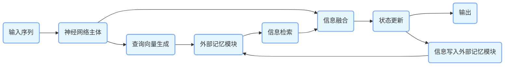

# 记忆增强神经网络:长期依赖性的建模

> 关键词：记忆增强神经网络、长期依赖性、建模、循环神经网络、外部记忆

> 摘要：本文围绕记忆增强神经网络对长期依赖性的建模展开深入探讨。首先介绍了研究背景，包括目的、预期读者、文档结构和相关术语。接着阐述了记忆增强神经网络的核心概念、原理和架构，并给出了对应的文本示意图和Mermaid流程图。详细讲解了核心算法原理，通过Python代码进行说明，同时介绍了相关的数学模型和公式。通过项目实战展示了代码实现过程，分析了代码细节。探讨了记忆增强神经网络在多个实际场景中的应用，推荐了学习资源、开发工具框架和相关论文著作。最后总结了未来发展趋势与挑战，并提供了常见问题解答和扩展阅读参考资料。

## 1. 背景介绍 
### 1.1 目的和范围
在自然语言处理、时间序列分析等众多领域中，处理长期依赖性是一个关键问题。传统的神经网络在处理长序列时，往往难以捕捉到远距离的依赖关系。记忆增强神经网络（Memory-Augmented Neural Networks，MANNs）应运而生，旨在解决长期依赖性的建模问题。本文的目的是深入介绍记忆增强神经网络对长期依赖性建模的原理、算法、实际应用等方面，帮助读者全面了解这一领域。范围涵盖从核心概念的阐述到实际项目的实现，以及相关工具和资源的推荐。

### 1.2 预期读者
本文预期读者包括对人工智能、机器学习尤其是神经网络领域感兴趣的科研人员、工程师和学生。对于想要深入了解如何处理序列数据中的长期依赖性问题的人员，以及希望将记忆增强神经网络应用到实际项目中的开发者，本文将提供有价值的参考。

### 1.3 文档结构概述
本文首先介绍记忆增强神经网络的背景知识，包括目的、读者对象和文档结构等。接着阐述核心概念，展示其原理和架构。然后详细讲解核心算法原理，通过Python代码实现。介绍相关的数学模型和公式，并举例说明。通过项目实战展示代码实现过程和分析。探讨实际应用场景，推荐学习资源、开发工具框架和相关论文著作。最后总结未来发展趋势与挑战，提供常见问题解答和扩展阅读参考资料。

### 1.4 术语表
#### 1.4.1 核心术语定义
- **记忆增强神经网络（Memory-Augmented Neural Networks，MANNs）**：是一类在传统神经网络基础上引入外部记忆模块的神经网络，通过记忆模块来存储和检索信息，以更好地处理长期依赖性问题。
- **长期依赖性**：指在序列数据中，当前时刻的输出与远距离之前的输入之间存在依赖关系。例如，在自然语言处理中，一个句子的最后一个词的含义可能与句子开头的某个词相关。
- **外部记忆模块**：是记忆增强神经网络中的一个重要组件，用于存储历史信息，神经网络可以通过读写操作与该模块进行交互。

#### 1.4.2 相关概念解释
- **循环神经网络（Recurrent Neural Networks，RNN）**：是一种用于处理序列数据的神经网络，通过隐藏状态在时间步之间传递信息。然而，RNN在处理长序列时容易出现梯度消失或梯度爆炸问题，导致难以捕捉长期依赖性。
- **长短期记忆网络（Long Short-Term Memory，LSTM）**：是RNN的一种变体，通过引入门控机制来解决RNN的梯度问题，在一定程度上能够处理长期依赖性，但仍存在局限性。

#### 1.4.3 缩略词列表
- MANNs：Memory-Augmented Neural Networks
- RNN：Recurrent Neural Networks
- LSTM：Long Short-Term Memory

## 2. 核心概念与联系 

### 核心概念原理
记忆增强神经网络的核心思想是在传统神经网络的基础上引入一个外部记忆模块。传统神经网络在处理序列数据时，其内部状态的容量有限，难以保存长距离的历史信息。而外部记忆模块可以作为一个大容量的存储单元，允许网络在需要时存储和检索历史信息。

在处理序列数据时，神经网络根据当前输入和之前的状态生成查询向量，通过查询向量在外部记忆模块中进行检索，获取相关的历史信息。然后将这些信息与当前输入进行融合，用于更新网络的状态和生成输出。同时，网络还可以将当前的一些重要信息写入外部记忆模块，以便后续使用。

### 架构的文本示意图
以下是记忆增强神经网络的架构文本示意图：

输入序列 -> 神经网络主体 -> 查询向量生成 -> 外部记忆模块（存储历史信息）
                    |                      |
                    |                      |
                    |                      V
                    |                信息检索
                    |                      |
                    |                      |
                    V                      |
          信息融合（当前输入与检索信息） -> 状态更新 -> 输出
                    |
                    |
                    V
             信息写入外部记忆模块

### Mermaid流程图


这个流程图展示了记忆增强神经网络的工作流程。输入序列首先进入神经网络主体，生成查询向量用于在外部记忆模块中检索信息。检索到的信息与当前输入进行融合，更新网络状态并生成输出。同时，网络将一些信息写入外部记忆模块，以便后续使用。

## 3. 核心算法原理 & 具体操作步骤 

### 核心算法原理
记忆增强神经网络的核心算法主要包括三个部分：查询生成、信息检索和信息写入。

#### 查询生成
神经网络根据当前输入和之前的状态生成查询向量 $q_t$。查询向量用于在外部记忆模块中查找相关信息。一般可以通过一个全连接层将当前输入 $x_t$ 和之前的隐藏状态 $h_{t-1}$ 映射到查询向量空间：

$$q_t = W_q [x_t; h_{t-1}] + b_q$$

其中 $W_q$ 是权重矩阵，$b_q$ 是偏置向量，$[x_t; h_{t-1}]$ 表示将 $x_t$ 和 $h_{t-1}$ 拼接在一起。

#### 信息检索
使用查询向量 $q_t$ 在外部记忆模块 $M_t$ 中进行信息检索。常见的检索方法是基于相似度计算，例如余弦相似度。对于记忆模块中的每个记忆单元 $m_{i,t}$，计算其与查询向量的相似度 $s_{i,t}$：

$$s_{i,t} = \frac{q_t \cdot m_{i,t}}{\|q_t\| \|m_{i,t}\|}$$

然后通过一个 softmax 函数将相似度转换为权重 $w_{i,t}$：

$$w_{i,t} = \frac{\exp(s_{i,t})}{\sum_{j=1}^N \exp(s_{j,t})}$$

其中 $N$ 是记忆单元的数量。最后，将权重与记忆单元加权求和得到检索到的信息 $r_t$：

$$r_t = \sum_{i=1}^N w_{i,t} m_{i,t}$$

#### 信息写入
网络根据当前的输入和状态决定要写入外部记忆模块的信息。一般可以通过一个门控机制来控制写入的内容。例如，定义一个写入门 $g_t$：

$$g_t = \sigma(W_g [x_t; h_{t-1}] + b_g)$$

其中 $\sigma$ 是 sigmoid 函数，$W_g$ 和 $b_g$ 是权重矩阵和偏置向量。然后根据写入门更新记忆模块：

$$M_{t+1} = (1 - g_t) M_t + g_t \Delta M_t$$

其中 $\Delta M_t$ 是要写入的信息，可以根据当前输入和检索到的信息计算得到。

### 具体操作步骤
以下是使用Python实现一个简单的记忆增强神经网络的具体步骤：

```python
import numpy as np

# 定义参数
input_size = 10
hidden_size = 20
memory_size = 30
memory_dim = 15

# 初始化权重和偏置
W_q = np.random.randn(hidden_size + input_size, memory_dim)
b_q = np.random.randn(memory_dim)
W_g = np.random.randn(hidden_size + input_size, 1)
b_g = np.random.randn(1)

# 初始化记忆模块
M = np.random.randn(memory_size, memory_dim)

# 定义 sigmoid 函数
def sigmoid(x):
    return 1 / (1 + np.exp(-x))

# 处理输入序列
input_sequence = np.random.randn(5, input_size)
h_prev = np.zeros(hidden_size)

for t in range(len(input_sequence)):
    x_t = input_sequence[t]
    
    # 查询生成
    query_input = np.concatenate((x_t, h_prev))
    q_t = np.dot(query_input, W_q) + b_q
    
    # 信息检索
    similarities = []
    for i in range(memory_size):
        m_i = M[i]
        similarity = np.dot(q_t, m_i) / (np.linalg.norm(q_t) * np.linalg.norm(m_i))
        similarities.append(similarity)
    similarities = np.array(similarities)
    weights = np.exp(similarities) / np.sum(np.exp(similarities))
    r_t = np.dot(weights, M)
    
    # 信息融合和状态更新（简单示例）
    h_t = np.tanh(np.dot(np.concatenate((x_t, r_t)), np.random.randn(input_size + memory_dim, hidden_size)))
    
    # 信息写入
    g_t = sigmoid(np.dot(query_input, W_g) + b_g)
    delta_M_t = np.random.randn(memory_size, memory_dim)  # 简单示例
    M = (1 - g_t) * M + g_t * delta_M_t
    
    h_prev = h_t

print("Final hidden state:", h_prev)
```

在这个代码示例中，我们首先定义了网络的参数，包括输入大小、隐藏大小、记忆模块的大小和维度。然后初始化了权重和偏置，以及记忆模块。在处理输入序列时，依次进行查询生成、信息检索、信息融合和状态更新，最后进行信息写入。

## 4. 数学模型和公式 & 详细讲解 & 举例说明 

### 数学模型和公式
#### 查询生成
查询生成的公式为：

$$q_t = W_q [x_t; h_{t-1}] + b_q$$

这个公式表示将当前输入 $x_t$ 和之前的隐藏状态 $h_{t-1}$ 拼接在一起，通过一个全连接层（由权重矩阵 $W_q$ 和偏置向量 $b_q$ 定义）映射到查询向量空间。查询向量 $q_t$ 用于在外部记忆模块中查找相关信息。

#### 信息检索
信息检索的过程包括相似度计算和权重计算。相似度计算的公式为：

$$s_{i,t} = \frac{q_t \cdot m_{i,t}}{\|q_t\| \|m_{i,t}\|}$$

这个公式计算查询向量 $q_t$ 与记忆模块中第 $i$ 个记忆单元 $m_{i,t}$ 的余弦相似度。余弦相似度衡量了两个向量的方向相似性，值越大表示两个向量越相似。

权重计算的公式为：

$$w_{i,t} = \frac{\exp(s_{i,t})}{\sum_{j=1}^N \exp(s_{j,t})}$$

这个公式通过 softmax 函数将相似度转换为权重。softmax 函数将相似度映射到 $[0, 1]$ 区间，并且所有权重之和为 1。这样可以确保在加权求和时，每个记忆单元的贡献是合理的。

最后，检索到的信息 $r_t$ 是权重与记忆单元的加权求和：

$$r_t = \sum_{i=1}^N w_{i,t} m_{i,t}$$

#### 信息写入
信息写入的过程通过写入门 $g_t$ 来控制。写入门的计算公式为：

$$g_t = \sigma(W_g [x_t; h_{t-1}] + b_g)$$

其中 $\sigma$ 是 sigmoid 函数，它将输入映射到 $[0, 1]$ 区间。写入门的值表示要写入的信息的比例。记忆模块的更新公式为：

$$M_{t+1} = (1 - g_t) M_t + g_t \Delta M_t$$

这个公式表示新的记忆模块 $M_{t+1}$ 是旧的记忆模块 $M_t$ 和要写入的信息 $\Delta M_t$ 的加权和，权重由写入门 $g_t$ 决定。

### 详细讲解
#### 查询生成
查询生成的目的是根据当前输入和之前的状态生成一个向量，用于在外部记忆模块中查找相关信息。通过将当前输入和之前的隐藏状态拼接在一起，可以综合考虑当前信息和历史信息。全连接层的作用是将这个拼接向量映射到一个合适的查询向量空间，使得查询向量能够有效地表示要查找的信息。

#### 信息检索
信息检索的核心是通过相似度计算找到与查询向量最相关的记忆单元。余弦相似度是一种常用的相似度度量方法，它只考虑向量的方向，而不考虑向量的长度。通过 softmax 函数将相似度转换为权重，可以确保每个记忆单元的贡献是合理的，并且可以使用加权求和的方式得到一个综合的检索信息。

#### 信息写入
信息写入的过程通过写入门来控制，写入门的值决定了要写入的信息的比例。这样可以避免过度写入或写入无关信息。记忆模块的更新公式确保了旧的信息不会被完全覆盖，而是与新的信息进行融合。

### 举例说明
假设我们有一个简单的文本处理任务，输入序列是一个单词序列。每个单词被表示为一个 10 维的向量（即 $input_size = 10$）。网络的隐藏大小为 20（即 $hidden_size = 20$），记忆模块有 30 个记忆单元，每个记忆单元的维度为 15（即 $memory_size = 30$，$memory_dim = 15$）。

在某个时间步 $t$，当前输入单词 $x_t$ 是一个 10 维向量，之前的隐藏状态 $h_{t-1}$ 是一个 20 维向量。首先，将 $x_t$ 和 $h_{t-1}$ 拼接在一起得到一个 30 维的向量，然后通过查询生成公式得到一个 15 维的查询向量 $q_t$。

接着，使用 $q_t$ 在记忆模块中进行信息检索。对于记忆模块中的每个 15 维记忆单元 $m_{i,t}$，计算其与 $q_t$ 的余弦相似度 $s_{i,t}$。通过 softmax 函数将相似度转换为权重 $w_{i,t}$，并将权重与记忆单元加权求和得到检索到的信息 $r_t$。

最后，根据当前输入和检索到的信息更新网络的隐藏状态 $h_t$。同时，计算写入门 $g_t$，根据写入门更新记忆模块。例如，如果 $g_t = 0.8$，表示要将 80% 的新信息写入记忆模块，20% 的旧信息保留。

## 5. 项目实战：代码实际案例和详细解释说明 

### 5.1  开发环境搭建
为了实现记忆增强神经网络的项目实战，我们可以使用Python和一些常见的深度学习库。以下是开发环境的搭建步骤：

#### 安装Python
确保你已经安装了Python 3.6 或更高版本。可以从Python官方网站（https://www.python.org/downloads/）下载并安装。

#### 安装深度学习库
我们将使用PyTorch作为深度学习框架。可以使用以下命令安装PyTorch：

```bash
pip install torch torchvision
```

另外，还可以安装一些辅助库，如NumPy、Matplotlib等：

```bash
pip install numpy matplotlib
```

### 5.2  源代码详细实现和代码解读
以下是一个使用PyTorch实现的简单记忆增强神经网络的代码示例：

```python
import torch
import torch.nn as nn
import torch.optim as optim

# 定义记忆增强神经网络
class MemoryAugmentedNN(nn.Module):
    def __init__(self, input_size, hidden_size, memory_size, memory_dim):
        super(MemoryAugmentedNN, self).__init__()
        self.input_size = input_size
        self.hidden_size = hidden_size
        self.memory_size = memory_size
        self.memory_dim = memory_dim
        
        # 查询生成层
        self.query_layer = nn.Linear(input_size + hidden_size, memory_dim)
        
        # 写入门层
        self.write_gate_layer = nn.Linear(input_size + hidden_size, 1)
        
        # 隐藏状态更新层
        self.hidden_update_layer = nn.Linear(input_size + memory_dim, hidden_size)
        
        # 初始化记忆模块
        self.memory = nn.Parameter(torch.randn(memory_size, memory_dim))
        
    def forward(self, input_sequence):
        batch_size = input_sequence.size(0)
        seq_length = input_sequence.size(1)
        h = torch.zeros(batch_size, self.hidden_size)
        
        for t in range(seq_length):
            x_t = input_sequence[:, t]
            
            # 查询生成
            query_input = torch.cat((x_t, h), dim=1)
            q_t = self.query_layer(query_input)
            
            # 信息检索
            similarities = torch.matmul(q_t, self.memory.t()) / (torch.norm(q_t, dim=1, keepdim=True) * torch.norm(self.memory, dim=1, keepdim=True).t())
            weights = torch.softmax(similarities, dim=1)
            r_t = torch.matmul(weights, self.memory)
            
            # 信息融合和状态更新
            update_input = torch.cat((x_t, r_t), dim=1)
            h = torch.tanh(self.hidden_update_layer(update_input))
            
            # 信息写入
            write_gate_input = torch.cat((x_t, h), dim=1)
            g_t = torch.sigmoid(self.write_gate_layer(write_gate_input))
            delta_M_t = torch.randn(self.memory_size, self.memory_dim)  # 简单示例
            self.memory = (1 - g_t) * self.memory + g_t * delta_M_t
        
        return h

# 定义训练参数
input_size = 10
hidden_size = 20
memory_size = 30
memory_dim = 15
batch_size = 16
seq_length = 5
num_epochs = 10
learning_rate = 0.001

# 初始化模型
model = MemoryAugmentedNN(input_size, hidden_size, memory_size, memory_dim)

# 定义损失函数和优化器
criterion = nn.MSELoss()
optimizer = optim.Adam(model.parameters(), lr=learning_rate)

# 生成随机输入数据和目标数据
input_data = torch.randn(batch_size, seq_length, input_size)
target_data = torch.randn(batch_size, hidden_size)

# 训练模型
for epoch in range(num_epochs):
    optimizer.zero_grad()
    output = model(input_data)
    loss = criterion(output, target_data)
    loss.backward()
    optimizer.step()
    
    print(f'Epoch {epoch+1}/{num_epochs}, Loss: {loss.item()}')
```

### 5.3  代码解读与分析
#### 模型定义
`MemoryAugmentedNN` 类继承自 `nn.Module`，定义了记忆增强神经网络的结构。在 `__init__` 方法中，初始化了查询生成层、写入门层、隐藏状态更新层和记忆模块。

#### 前向传播
在 `forward` 方法中，实现了记忆增强神经网络的前向传播过程。首先初始化隐藏状态 $h$，然后遍历输入序列的每个时间步。在每个时间步，进行查询生成、信息检索、信息融合和状态更新，最后进行信息写入。

#### 训练过程
在训练过程中，使用均方误差损失函数 `nn.MSELoss()` 计算输出与目标数据之间的损失。使用Adam优化器进行参数更新。通过多次迭代训练，不断调整模型的参数，使得损失逐渐减小。

## 6. 实际应用场景 
### 自然语言处理
在自然语言处理中，记忆增强神经网络可以用于处理长文本。例如，在机器翻译任务中，源语言句子可能很长，传统的神经网络难以捕捉到句子开头和结尾之间的依赖关系。记忆增强神经网络可以通过外部记忆模块存储句子的历史信息，在翻译过程中根据需要检索相关信息，从而提高翻译的准确性。

在文本生成任务中，如故事生成、诗歌创作等，记忆增强神经网络可以利用记忆模块保存之前生成的内容，使得生成的文本具有连贯性和逻辑性。

### 时间序列分析
在时间序列分析中，如股票价格预测、气象预报等，数据通常具有长期依赖性。记忆增强神经网络可以通过记忆模块存储历史数据的特征，在预测当前时刻的值时，结合历史信息进行更准确的预测。

### 机器人控制
在机器人控制中，机器人需要根据历史的感知信息和动作决策来规划未来的行动。记忆增强神经网络可以用于存储机器人的历史经验，在面对新的环境时，检索相关的经验信息，帮助机器人做出更合理的决策。

### 图像序列处理
在处理图像序列时，如视频分析、动作识别等，记忆增强神经网络可以用于捕捉图像序列中的长期动态信息。通过记忆模块存储之前的图像特征，在分析当前图像时，结合历史信息进行更准确的理解和识别。

## 7. 工具和资源推荐
### 7.1 学习资源推荐
#### 7.1.1 书籍推荐
- 《深度学习》（Deep Learning）：由Ian Goodfellow、Yoshua Bengio和Aaron Courville合著，是深度学习领域的经典教材，涵盖了神经网络的基本原理、训练方法和应用等方面的内容。
- 《神经网络与深度学习》（Neural Networks and Deep Learning）：作者是Michael Nielsen，这本书以通俗易懂的方式介绍了神经网络和深度学习的基本概念和算法。

#### 7.1.2 在线课程
- Coursera上的“深度学习专项课程”（Deep Learning Specialization）：由Andrew Ng教授授课，包括深度学习的基础知识、卷积神经网络、循环神经网络等内容。
- edX上的“人工智能基础”（Introduction to Artificial Intelligence）：介绍了人工智能的基本概念和方法，包括神经网络和机器学习的相关内容。

#### 7.1.3 技术博客和网站
- Medium上的Towards Data Science：有很多关于深度学习和人工智能的技术文章和案例分析。
- arXiv.org：是一个预印本平台，发布了大量的最新研究成果，包括记忆增强神经网络方面的论文。

### 7.2 开发工具框架推荐
#### 7.2.1 IDE和编辑器
- PyCharm：是一款专门为Python开发设计的集成开发环境，提供了丰富的代码编辑、调试和项目管理功能。
- Jupyter Notebook：是一个交互式的开发环境，适合进行数据分析和模型实验。

#### 7.2.2 调试和性能分析工具
- TensorBoard：是TensorFlow提供的一个可视化工具，可以用于可视化模型的训练过程、损失曲线、网络结构等。
- PyTorch Profiler：是PyTorch提供的性能分析工具，可以帮助开发者分析模型的性能瓶颈。

#### 7.2.3 相关框架和库
- PyTorch：是一个开源的深度学习框架，提供了丰富的神经网络层和优化算法，支持GPU加速。
- TensorFlow：是另一个广泛使用的深度学习框架，具有强大的分布式训练和部署能力。

### 7.3 相关论文著作推荐
#### 7.3.1 经典论文
- "Neural Turing Machines"：这篇论文首次提出了神经图灵机（Neural Turing Machines）的概念，是记忆增强神经网络领域的经典论文。
- "Memory Networks"：介绍了记忆网络（Memory Networks）的架构和算法，为后续的研究奠定了基础。

#### 7.3.2 最新研究成果
可以通过arXiv.org等预印本平台搜索关于记忆增强神经网络的最新研究成果。例如，一些研究致力于改进记忆模块的结构和操作，提高网络的性能和效率。

#### 7.3.3 应用案例分析
在ACM、IEEE等学术数据库中可以找到一些关于记忆增强神经网络在实际应用中的案例分析。这些案例分析可以帮助读者了解如何将记忆增强神经网络应用到具体的项目中。

## 8. 总结：未来发展趋势与挑战
### 未来发展趋势
#### 模型结构优化
未来的研究可能会致力于优化记忆增强神经网络的模型结构，例如设计更高效的记忆模块、改进查询和写入机制等。通过优化模型结构，可以提高网络的性能和效率，更好地处理长期依赖性问题。

#### 多模态融合
随着多模态数据（如文本、图像、音频等）的广泛应用，记忆增强神经网络可能会与多模态融合技术相结合。通过将不同模态的数据信息存储在记忆模块中，可以实现更全面的信息处理和分析。

#### 强化学习应用
记忆增强神经网络在强化学习领域有着广阔的应用前景。在强化学习中，智能体需要根据历史的状态和动作来做出决策。记忆增强神经网络可以帮助智能体更好地存储和利用历史信息，提高学习效率和决策能力。

### 挑战
#### 计算资源需求
记忆增强神经网络通常需要较大的计算资源，尤其是在处理大规模数据和复杂任务时。如何在有限的计算资源下实现高效的训练和推理是一个挑战。

#### 可解释性
记忆增强神经网络的内部机制较为复杂，其决策过程往往难以解释。在一些对可解释性要求较高的领域，如医疗、金融等，如何提高记忆增强神经网络的可解释性是一个亟待解决的问题。

#### 数据质量和数量
记忆增强神经网络的性能很大程度上依赖于数据的质量和数量。在实际应用中，获取高质量、大规模的数据往往是困难的。如何在有限的数据条件下训练出高性能的模型是一个挑战。

## 9. 附录：常见问题与解答
### 问题1：记忆增强神经网络与传统神经网络有什么区别？
记忆增强神经网络在传统神经网络的基础上引入了外部记忆模块，用于存储和检索历史信息。传统神经网络的内部状态容量有限，难以保存长距离的历史信息，而记忆增强神经网络通过外部记忆模块可以更好地处理长期依赖性问题。

### 问题2：记忆增强神经网络的训练难度大吗？
记忆增强神经网络的训练难度相对较大。一方面，其模型结构较为复杂，需要调整的参数较多；另一方面，训练过程中需要处理大量的历史信息，对计算资源和数据质量都有较高的要求。

### 问题3：如何选择合适的记忆模块大小和维度？
记忆模块的大小和维度需要根据具体的任务和数据特点来选择。一般来说，如果任务需要处理的历史信息较多，可以适当增大记忆模块的大小和维度。但过大的记忆模块会增加计算复杂度和训练难度，需要在性能和效率之间进行权衡。

### 问题4：记忆增强神经网络可以应用于哪些领域？
记忆增强神经网络可以应用于自然语言处理、时间序列分析、机器人控制、图像序列处理等多个领域，只要这些领域的任务存在长期依赖性问题，都可以考虑使用记忆增强神经网络来解决。

## 10. 扩展阅读 & 参考资料
### 扩展阅读
- "End-to-End Memory Networks"：进一步研究了记忆网络的端到端训练方法，提高了模型的性能。
- "Differentiable Neural Computers"：提出了可微神经计算机（Differentiable Neural Computers）的概念，将记忆增强神经网络与图灵机的计算能力相结合。

### 参考资料
- Goodfellow, I., Bengio, Y., & Courville, A. (2016). Deep Learning. MIT Press.
- Nielsen, M. A. (2015). Neural Networks and Deep Learning. Determination Press.
- Graves, A., Wayne, G., & Danihelka, I. (2014). Neural Turing Machines. arXiv preprint arXiv:1410.5401.
- Weston, J., Chopra, S., & Bordes, A. (2014). Memory Networks. arXiv preprint arXiv:1410.3916.