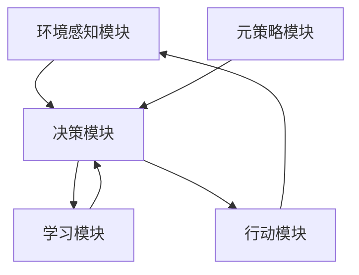

# 设计AI Agent的元控制学习策略

> 关键词：AI Agent、元控制学习、策略设计、强化学习、智能决策

> 摘要：本文聚焦于AI Agent的元控制学习策略设计，深入探讨了元控制学习的核心概念、算法原理、数学模型等内容。通过详细的Python代码示例和项目实战，展示了如何在实际场景中应用元控制学习策略。同时，分析了其实际应用场景，推荐了相关的学习资源、开发工具和论文著作。最后对AI Agent元控制学习策略的未来发展趋势与挑战进行了总结，并提供了常见问题解答和参考资料，旨在为相关领域的研究者和开发者提供全面且深入的技术指导。

## 1. 背景介绍 
### 1.1 目的和范围
随着人工智能技术的飞速发展，AI Agent在越来越多的领域得到应用，如机器人控制、游戏竞技、自动驾驶等。然而，在复杂多变的环境中，AI Agent需要具备更高效、智能的决策能力。元控制学习策略旨在让AI Agent能够根据环境变化和任务需求，动态地调整自身的学习和决策过程，从而提高其适应性和性能。本文的范围涵盖了元控制学习策略的基本概念、算法原理、数学模型、实际应用等方面，旨在为读者提供一个全面的技术框架和实践指导。

### 1.2 预期读者
本文预期读者包括人工智能领域的研究者、开发者、学生以及对AI Agent和元控制学习感兴趣的技术爱好者。对于有一定编程基础和机器学习知识的读者，能够更深入地理解本文中的算法原理和代码实现；而对于初学者，也可以通过本文对元控制学习策略有一个初步的认识和了解。

### 1.3 文档结构概述
本文将按照以下结构进行组织：首先介绍元控制学习的背景和相关概念，包括核心术语和缩略词的定义；接着阐述元控制学习的核心概念和架构，通过文本示意图和Mermaid流程图进行展示；然后详细讲解核心算法原理，并使用Python源代码进行阐述；之后介绍数学模型和公式，并举例说明；通过项目实战展示代码实际案例和详细解释；分析实际应用场景；推荐相关的工具和资源；最后总结未来发展趋势与挑战，提供常见问题解答和参考资料。

### 1.4 术语表
#### 1.4.1 核心术语定义
- **AI Agent**：人工智能代理，是一种能够感知环境、进行决策并采取行动的智能实体。
- **元控制学习**：一种高级的学习策略，旨在让AI Agent能够自主地控制和调整自身的学习过程和决策机制。
- **策略**：AI Agent在特定环境下选择行动的规则或方法。
- **强化学习**：一种机器学习方法，通过智能体与环境进行交互，根据环境反馈的奖励信号来学习最优策略。

#### 1.4.2 相关概念解释
- **环境**：AI Agent所处的外部世界，包含各种状态和可能的行动。
- **状态**：环境在某一时刻的特征描述，AI Agent根据当前状态进行决策。
- **动作**：AI Agent在某一状态下可以采取的行为。
- **奖励**：环境对AI Agent采取的动作的反馈，用于评价动作的好坏。

#### 1.4.3 缩略词列表
- **RL**：Reinforcement Learning，强化学习
- **MDP**：Markov Decision Process，马尔可夫决策过程

## 2. 核心概念与联系 

### 核心概念原理
元控制学习的核心思想是让AI Agent能够在不同的任务和环境中，动态地调整自身的学习和决策策略。传统的学习方法通常是针对特定的任务进行训练，缺乏灵活性和适应性。而元控制学习通过引入元策略，使得AI Agent能够根据当前的环境状态和任务需求，选择合适的学习策略和决策机制。

例如，在一个机器人导航任务中，机器人可能会遇到不同的地形和障碍物。在平坦的地面上，机器人可以采用快速移动的策略；而在遇到复杂地形时，机器人需要调整策略，采用更谨慎的移动方式。元控制学习可以让机器人根据当前的地形状态，自动选择合适的移动策略。

### 架构的文本示意图
元控制学习的架构主要包括以下几个部分：
1. **环境感知模块**：负责感知环境的状态信息，将其传递给决策模块。
2. **决策模块**：根据环境状态和元策略，选择合适的学习策略和行动策略。
3. **学习模块**：根据选择的学习策略，对AI Agent的模型进行训练和更新。
4. **行动模块**：根据选择的行动策略，执行具体的行动。
5. **元策略模块**：存储和管理元策略，根据环境变化和任务需求进行调整。

### Mermaid 流程图


## 3. 核心算法原理 & 具体操作步骤 

### 核心算法原理
元控制学习的核心算法通常基于强化学习。强化学习的目标是让AI Agent通过与环境进行交互，学习到一个最优策略，使得累积奖励最大化。在元控制学习中，我们需要学习一个元策略，用于选择合适的学习策略和行动策略。

一种常见的方法是使用层次化强化学习。层次化强化学习将学习过程分为多个层次，每个层次负责不同的任务。高层的元策略负责选择低层的学习策略和行动策略，低层的策略负责具体的学习和行动。

### 具体操作步骤
1. **定义环境和任务**：明确AI Agent所处的环境和要完成的任务，包括环境的状态空间、动作空间和奖励函数。
2. **设计元策略**：设计元策略的结构和参数，用于选择学习策略和行动策略。
3. **初始化模型**：初始化AI Agent的模型和元策略的参数。
4. **交互学习**：AI Agent与环境进行交互，根据元策略选择学习策略和行动策略，执行行动并获取奖励。
5. **更新模型和元策略**：根据奖励信号，更新AI Agent的模型和元策略的参数。
6. **重复步骤4和5**：不断重复交互学习和更新过程，直到达到收敛条件。

### Python源代码详细阐述
以下是一个简单的基于Python和OpenAI Gym的元控制学习示例：
```python
import gym
import numpy as np

# 定义环境
env = gym.make('CartPole-v1')

# 初始化参数
num_episodes = 1000
learning_rate = 0.1
discount_factor = 0.99

# 初始化Q表
state_space_size = env.observation_space.shape[0]
action_space_size = env.action_space.n
Q_table = np.zeros((state_space_size, action_space_size))

# 元策略：简单的随机策略
def meta_policy():
    return np.random.choice(action_space_size)

# 训练过程
for episode in range(num_episodes):
    state = env.reset()
    done = False
    total_reward = 0

    while not done:
        # 根据元策略选择动作
        action = meta_policy()

        # 执行动作
        next_state, reward, done, _ = env.step(action)

        # 更新Q表
        max_q_next = np.max(Q_table[next_state])
        Q_table[state, action] += learning_rate * (reward + discount_factor * max_q_next - Q_table[state, action])

        state = next_state
        total_reward += reward

    print(f"Episode {episode}: Total Reward = {total_reward}")

# 关闭环境
env.close()
```
在这个示例中，我们使用OpenAI Gym的CartPole-v1环境，实现了一个简单的元控制学习过程。元策略采用随机策略，选择动作并执行，然后根据奖励信号更新Q表。

## 4. 数学模型和公式 & 详细讲解 & 举例说明 

### 马尔可夫决策过程（MDP）
马尔可夫决策过程是强化学习中常用的数学模型，用于描述AI Agent与环境的交互过程。MDP可以用一个五元组 $<S, A, P, R, \gamma>$ 表示，其中：
- $S$ 是状态空间，表示环境的所有可能状态。
- $A$ 是动作空间，表示AI Agent可以采取的所有可能动作。
- $P(s'|s, a)$ 是状态转移概率，表示在状态 $s$ 下采取动作 $a$ 后转移到状态 $s'$ 的概率。
- $R(s, a)$ 是奖励函数，表示在状态 $s$ 下采取动作 $a$ 后获得的奖励。
- $\gamma$ 是折扣因子，用于权衡当前奖励和未来奖励的重要性。

### 价值函数
在MDP中，价值函数用于评估状态或状态-动作对的价值。常用的价值函数有状态价值函数 $V(s)$ 和动作价值函数 $Q(s, a)$。

- 状态价值函数 $V(s)$ 表示从状态 $s$ 开始，遵循某一策略 $\pi$ 所能获得的期望累积奖励：
$$V^{\pi}(s) = \mathbb{E}_{\pi} \left[ \sum_{t=0}^{\infty} \gamma^t R_{t+1} | S_0 = s \right]$$

- 动作价值函数 $Q(s, a)$ 表示在状态 $s$ 下采取动作 $a$，然后遵循某一策略 $\pi$ 所能获得的期望累积奖励：
$$Q^{\pi}(s, a) = \mathbb{E}_{\pi} \left[ \sum_{t=0}^{\infty} \gamma^t R_{t+1} | S_0 = s, A_0 = a \right]$$

### 贝尔曼方程
贝尔曼方程是价值函数的递归方程，用于求解最优价值函数和最优策略。

- 状态价值函数的贝尔曼方程：
$$V^{\pi}(s) = \sum_{a \in A} \pi(a|s) \left( R(s, a) + \gamma \sum_{s' \in S} P(s'|s, a) V^{\pi}(s') \right)$$

- 动作价值函数的贝尔曼方程：
$$Q^{\pi}(s, a) = R(s, a) + \gamma \sum_{s' \in S} P(s'|s, a) \sum_{a' \in A} \pi(a'|s') Q^{\pi}(s', a')$$

### 举例说明
考虑一个简单的网格世界环境，AI Agent的目标是从起点到达终点。环境的状态空间 $S$ 是网格的所有位置，动作空间 $A$ 是上下左右四个方向。奖励函数 $R(s, a)$ 在到达终点时为正，撞到障碍物时为负，其他情况为零。

假设折扣因子 $\gamma = 0.9$，初始状态 $s_0$，动作 $a_0$ 是向右移动。根据贝尔曼方程，我们可以计算出动作价值函数 $Q(s_0, a_0)$：
1. 首先，根据状态转移概率 $P(s'|s_0, a_0)$ 确定下一个状态 $s'$。
2. 然后，计算下一个状态的状态价值函数 $V(s')$。
3. 最后，根据贝尔曼方程计算 $Q(s_0, a_0) = R(s_0, a_0) + \gamma V(s')$。

通过不断迭代贝尔曼方程，我们可以求解出最优价值函数和最优策略。

## 5. 项目实战：代码实际案例和详细解释说明 

### 5.1  开发环境搭建
在进行元控制学习的项目实战之前，需要搭建相应的开发环境。以下是具体的步骤：
1. **安装Python**：推荐使用Python 3.7及以上版本，可以从Python官方网站下载并安装。
2. **安装必要的库**：使用pip安装OpenAI Gym、NumPy、Matplotlib等库。
```bash
pip install gym numpy matplotlib
```
3. **验证环境**：编写一个简单的Python脚本，测试OpenAI Gym环境是否正常工作。
```python
import gym

env = gym.make('CartPole-v1')
state = env.reset()
for _ in range(100):
    env.render()
    action = env.action_space.sample()
    state, reward, done, _ = env.step(action)
    if done:
        state = env.reset()
env.close()
```

### 5.2  源代码详细实现和代码解读
以下是一个更完整的元控制学习项目实战代码，使用深度强化学习中的深度Q网络（DQN）：
```python
import gym
import numpy as np
import torch
import torch.nn as nn
import torch.optim as optim
import random
from collections import deque

# 定义DQN网络
class DQN(nn.Module):
    def __init__(self, input_dim, output_dim):
        super(DQN, self).__init__()
        self.fc1 = nn.Linear(input_dim, 64)
        self.fc2 = nn.Linear(64, 64)
        self.fc3 = nn.Linear(64, output_dim)

    def forward(self, x):
        x = torch.relu(self.fc1(x))
        x = torch.relu(self.fc2(x))
        return self.fc3(x)

# 定义元控制学习类
class MetaControlAgent:
    def __init__(self, state_space_size, action_space_size):
        self.state_space_size = state_space_size
        self.action_space_size = action_space_size
        self.memory = deque(maxlen=10000)
        self.gamma = 0.99
        self.epsilon = 1.0
        self.epsilon_min = 0.01
        self.epsilon_decay = 0.995
        self.learning_rate = 0.001
        self.model = DQN(state_space_size, action_space_size)
        self.optimizer = optim.Adam(self.model.parameters(), lr=self.learning_rate)
        self.criterion = nn.MSELoss()

    def remember(self, state, action, reward, next_state, done):
        self.memory.append((state, action, reward, next_state, done))

    def act(self, state):
        if np.random.rand() <= self.epsilon:
            return random.randrange(self.action_space_size)
        state = torch.FloatTensor(state).unsqueeze(0)
        act_values = self.model(state)
        action = np.argmax(act_values.detach().numpy())
        return action

    def replay(self, batch_size):
        minibatch = random.sample(self.memory, batch_size)
        for state, action, reward, next_state, done in minibatch:
            state = torch.FloatTensor(state).unsqueeze(0)
            next_state = torch.FloatTensor(next_state).unsqueeze(0)
            target = reward
            if not done:
                target = (reward + self.gamma * torch.max(self.model(next_state)).item())
            target_f = self.model(state)
            target_f[0][action] = target
            self.optimizer.zero_grad()
            loss = self.criterion(self.model(state), target_f)
            loss.backward()
            self.optimizer.step()
        if self.epsilon > self.epsilon_min:
            self.epsilon *= self.epsilon_decay

# 主训练函数
def train():
    env = gym.make('CartPole-v1')
    state_space_size = env.observation_space.shape[0]
    action_space_size = env.action_space.n
    agent = MetaControlAgent(state_space_size, action_space_size)
    num_episodes = 1000
    batch_size = 32

    for episode in range(num_episodes):
        state = env.reset()
        done = False
        total_reward = 0
        while not done:
            action = agent.act(state)
            next_state, reward, done, _ = env.step(action)
            agent.remember(state, action, reward, next_state, done)
            state = next_state
            total_reward += reward
            if len(agent.memory) > batch_size:
                agent.replay(batch_size)
        print(f"Episode {episode}: Total Reward = {total_reward}")

    env.close()

if __name__ == "__main__":
    train()
```
### 5.3  代码解读与分析
1. **DQN网络定义**：`DQN` 类定义了一个简单的三层全连接神经网络，用于近似动作价值函数。
2. **元控制学习类 `MetaControlAgent`**：
    - `__init__` 方法初始化了代理的参数，包括记忆缓冲区、折扣因子、探索率等。
    - `remember` 方法用于将经验样本存储到记忆缓冲区中。
    - `act` 方法根据探索率选择动作，以平衡探索和利用。
    - `replay` 方法从记忆缓冲区中随机采样一批经验样本，进行训练和更新网络参数。
3. **主训练函数 `train`**：
    - 初始化环境和代理。
    - 进行多轮训练，每轮训练中，代理与环境进行交互，收集经验样本并进行训练。
    - 打印每轮训练的总奖励。

通过这个项目实战，我们可以看到如何使用深度强化学习实现元控制学习，提高AI Agent的决策能力。

## 6. 实际应用场景 
### 机器人控制
在机器人控制领域，元控制学习策略可以让机器人根据不同的任务和环境，动态地调整自身的运动策略和行为模式。例如，在救援任务中，机器人可能会遇到不同的地形和障碍物，元控制学习可以让机器人根据当前的地形状态，选择合适的移动方式和操作策略，提高救援效率。

### 游戏竞技
在游戏竞技中，AI Agent需要根据对手的策略和游戏状态，快速做出决策。元控制学习可以让AI Agent学习到不同的游戏策略，并根据当前的游戏情况选择最优的策略。例如，在实时战略游戏中，AI Agent可以根据对手的兵力部署和资源情况，选择进攻、防守或发展经济等策略。

### 自动驾驶
在自动驾驶领域，元控制学习可以让自动驾驶车辆根据不同的路况和交通信号，动态地调整行驶速度、车道选择等策略。例如，在拥堵的城市道路上，自动驾驶车辆可以选择更灵活的行驶路线，避免拥堵；在高速公路上，自动驾驶车辆可以保持稳定的行驶速度，提高行驶安全性。

### 智能医疗
在智能医疗领域，元控制学习可以帮助医生根据患者的病情和身体状况，选择合适的治疗方案。例如，在癌症治疗中，元控制学习可以分析患者的基因数据、病情进展等信息，为医生提供个性化的治疗建议。

## 7. 工具和资源推荐
### 7.1 学习资源推荐
#### 7.1.1 书籍推荐
- 《Reinforcement Learning: An Introduction》：这是强化学习领域的经典书籍，详细介绍了强化学习的基本概念、算法和应用。
- 《Artificial Intelligence: A Modern Approach》：全面介绍了人工智能的各个领域，包括AI Agent、机器学习、知识表示等内容。
- 《Deep Learning》：深度学习领域的权威书籍，介绍了深度学习的基本原理、模型和应用。

#### 7.1.2 在线课程
- Coursera上的“Reinforcement Learning Specialization”：由著名学者Richard Sutton教授授课，系统地介绍了强化学习的理论和实践。
- edX上的“Artificial Intelligence”：提供了人工智能的全面学习内容，包括AI Agent、机器学习、自然语言处理等。
- Udemy上的“Deep Reinforcement Learning Hands-On”：通过实际项目案例，讲解深度强化学习的应用和实践。

#### 7.1.3 技术博客和网站
- OpenAI Blog：OpenAI发布的最新研究成果和技术文章，涵盖了人工智能的各个领域。
- Medium上的“Towards Data Science”：提供了大量关于数据科学、机器学习、人工智能的技术文章和教程。
- arXiv.org：一个预印本数据库，包含了大量的学术论文，是获取最新研究成果的重要渠道。

### 7.2 开发工具框架推荐
#### 7.2.1 IDE和编辑器
- PyCharm：一款功能强大的Python集成开发环境，提供了代码编辑、调试、版本控制等功能。
- Jupyter Notebook：一个交互式的开发环境，适合进行数据分析、模型训练和实验验证。
- Visual Studio Code：一款轻量级的代码编辑器，支持多种编程语言和插件扩展。

#### 7.2.2 调试和性能分析工具
- TensorBoard：TensorFlow提供的可视化工具，用于监控模型训练过程、查看模型结构和性能指标。
- PyTorch Profiler：PyTorch提供的性能分析工具，用于分析模型的计算性能和内存使用情况。
- cProfile：Python内置的性能分析工具，用于分析Python代码的执行时间和函数调用关系。

#### 7.2.3 相关框架和库
- OpenAI Gym：一个开源的强化学习环境库，提供了多种经典的强化学习环境，方便进行算法测试和验证。
- Stable Baselines：一个基于OpenAI Gym的强化学习库，提供了多种预训练的强化学习算法和模型。
- PyTorch和TensorFlow：两个流行的深度学习框架，提供了丰富的深度学习模型和工具，可用于实现元控制学习算法。

### 7.3 相关论文著作推荐
#### 7.3.1 经典论文
- “Learning to Reinforcement Learn”：提出了元控制学习的基本概念和方法，为后续的研究奠定了基础。
- “Deep Q-Networks”：介绍了深度Q网络（DQN）算法，是深度强化学习领域的经典论文。
- “Proximal Policy Optimization Algorithms”：提出了近端策略优化（PPO）算法，是一种高效的强化学习算法。

#### 7.3.2 最新研究成果
- 关注arXiv.org上关于元控制学习、强化学习的最新论文，了解该领域的最新研究进展。
- 参加相关的学术会议，如NeurIPS、ICML等，获取最新的研究成果和技术报告。

#### 7.3.3 应用案例分析
- 查看相关的学术期刊和会议论文，了解元控制学习在机器人控制、游戏竞技、自动驾驶等领域的应用案例和实践经验。
- 参考工业界的技术博客和开源项目，学习实际应用中的最佳实践和解决方案。

## 8. 总结：未来发展趋势与挑战
### 未来发展趋势
- **多智能体协同**：未来的AI Agent将越来越多地面临多智能体协同的场景，元控制学习策略需要能够支持多智能体之间的协作和沟通，实现更高效的团队决策和行动。
- **自适应学习**：随着环境的不断变化和任务的多样性，AI Agent需要具备更强的自适应学习能力。元控制学习将朝着能够快速适应新环境、新任务的方向发展，实现更智能的决策和学习。
- **与其他技术融合**：元控制学习将与其他人工智能技术，如计算机视觉、自然语言处理等进行深度融合，实现更复杂的任务和应用场景。例如，在智能医疗领域，结合计算机视觉技术进行疾病诊断，结合自然语言处理技术进行医患对话和治疗方案推荐。

### 挑战
- **计算资源需求**：元控制学习通常需要大量的计算资源和时间，特别是在使用深度强化学习算法时。如何提高算法的效率，降低计算资源需求，是一个亟待解决的问题。
- **可解释性**：AI Agent的决策过程往往是黑盒的，缺乏可解释性。在一些关键领域，如医疗、自动驾驶等，可解释性是非常重要的。如何提高元控制学习策略的可解释性，是一个挑战。
- **环境建模**：准确地建模环境是元控制学习的基础。然而，在复杂的现实环境中，环境的不确定性和动态性使得环境建模变得困难。如何建立更准确、更通用的环境模型，是一个需要研究的问题。

## 9. 附录：常见问题与解答
### 问题1：元控制学习和传统强化学习有什么区别？
传统强化学习通常是针对特定的任务进行训练，学习一个固定的策略。而元控制学习则是让AI Agent能够根据环境变化和任务需求，动态地调整自身的学习和决策策略。元控制学习更具灵活性和适应性。

### 问题2：元控制学习的应用场景有哪些限制？
元控制学习的应用场景受到计算资源、环境建模难度等因素的限制。在一些计算资源有限的设备上，元控制学习算法可能无法正常运行。此外，在复杂的现实环境中，准确地建模环境是一个挑战，可能会影响元控制学习的效果。

### 问题3：如何评估元控制学习策略的性能？
可以使用多种指标来评估元控制学习策略的性能，如累积奖励、平均回报、策略收敛速度等。此外，还可以通过实际应用场景中的任务完成情况、效率等指标来评估。

### 问题4：元控制学习需要多少数据？
元控制学习需要的数据量取决于具体的算法和应用场景。一般来说，使用深度强化学习算法时，需要大量的数据来训练模型。可以通过增加数据采集的频率、使用数据增强技术等方法来获取更多的数据。

## 10. 扩展阅读 & 参考资料
1. Sutton, R. S., & Barto, A. G. (2018). Reinforcement Learning: An Introduction. MIT press.
2. Russell, S. J., & Norvig, P. (2016). Artificial Intelligence: A Modern Approach. Pearson.
3. Goodfellow, I., Bengio, Y., & Courville, A. (2016). Deep Learning. MIT press.
4. OpenAI Gym Documentation: https://gym.openai.com/docs/
5. PyTorch Documentation: https://pytorch.org/docs/stable/
6. TensorFlow Documentation: https://www.tensorflow.org/api_docs
7. arXiv.org: https://arxiv.org/
8. NeurIPS Conference: https://neurips.cc/
9. ICML Conference: https://icml.cc/