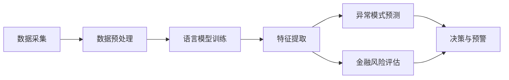

# 语言模型在复杂系统异常模式预测与金融风险防控中的应用

> 关键词：语言模型、复杂系统、异常模式预测、金融风险防控、自然语言处理

> 摘要：本文深入探讨了语言模型在复杂系统异常模式预测与金融风险防控领域的应用。首先介绍了相关背景，包括研究目的、预期读者、文档结构和术语表等内容。接着阐述了核心概念及其联系，详细讲解了核心算法原理与具体操作步骤，通过数学模型和公式进行理论支持并举例说明。然后结合项目实战，给出代码实际案例和详细解释。之后探讨了实际应用场景，推荐了相关的工具和资源。最后总结了未来发展趋势与挑战，提供了常见问题与解答以及扩展阅读和参考资料，旨在为相关领域的研究者和从业者提供全面的技术指导和参考。

## 1. 背景介绍 
### 1.1 目的和范围
随着科技的飞速发展，复杂系统的规模和复杂度不断增加，其异常模式的准确预测成为了保障系统稳定运行的关键。同时，金融市场的波动性和不确定性使得金融风险防控的重要性日益凸显。语言模型作为自然语言处理领域的重要技术，具有强大的文本理解和生成能力。本研究的目的在于探索语言模型在复杂系统异常模式预测与金融风险防控中的应用，通过挖掘文本数据中的潜在信息，实现对异常模式的精准识别和金融风险的有效预警。

本研究的范围涵盖了语言模型的基本原理、在复杂系统和金融领域的应用方法、相关算法的实现以及实际案例的分析。旨在为相关领域的研究和实践提供理论支持和技术指导。

### 1.2 预期读者
本文预期读者包括计算机科学、金融工程、系统工程等领域的研究人员、学者，以及从事复杂系统监控、金融风险防控等相关工作的从业者。对于对自然语言处理和金融科技感兴趣的技术爱好者也具有一定的参考价值。

### 1.3 文档结构概述
本文共分为十个部分。第一部分为背景介绍，阐述研究的目的、范围、预期读者和文档结构概述，并给出术语表。第二部分介绍核心概念与联系，包括语言模型、复杂系统异常模式、金融风险等概念的原理和架构，以及相关的流程图。第三部分讲解核心算法原理与具体操作步骤，通过Python源代码详细阐述。第四部分给出数学模型和公式，并进行详细讲解和举例说明。第五部分进行项目实战，包括开发环境搭建、源代码详细实现和代码解读。第六部分探讨实际应用场景。第七部分推荐相关的工具和资源，包括学习资源、开发工具框架和相关论文著作。第八部分总结未来发展趋势与挑战。第九部分为附录，提供常见问题与解答。第十部分为扩展阅读与参考资料。

### 1.4 术语表
#### 1.4.1 核心术语定义
- **语言模型**：是一种基于概率统计的模型，用于计算文本序列出现的概率，能够对语言的生成和理解进行建模。
- **复杂系统**：由大量相互作用的组件组成，具有高度的非线性、不确定性和动态性的系统。
- **异常模式**：在复杂系统中，偏离正常运行状态的模式或行为。
- **金融风险**：在金融活动中，由于各种不确定因素导致的资产损失或收益波动的可能性。
- **自然语言处理**：研究如何让计算机理解和处理人类语言的技术领域。

#### 1.4.2 相关概念解释
- **文本数据挖掘**：从大量文本数据中提取有价值信息的过程，包括文本分类、情感分析、命名实体识别等任务。
- **时间序列分析**：对按时间顺序排列的数据进行分析，以发现数据中的趋势、周期性和异常点等特征。
- **机器学习**：让计算机通过数据学习模式和规律，从而实现预测和决策的技术。
- **深度学习**：一种基于神经网络的机器学习方法，能够自动提取数据的深层特征。

#### 1.4.3 缩略词列表
- **NLP**：Natural Language Processing（自然语言处理）
- **ML**：Machine Learning（机器学习）
- **DL**：Deep Learning（深度学习）
- **RNN**：Recurrent Neural Network（循环神经网络）
- **LSTM**：Long Short - Term Memory（长短期记忆网络）
- **GRU**：Gated Recurrent Unit（门控循环单元）
- **BERT**：Bidirectional Encoder Representations from Transformers（基于Transformer的双向编码器表示）

## 2. 核心概念与联系 
### 2.1 语言模型原理
语言模型的核心目标是计算一个文本序列 $w_1, w_2, \cdots, w_n$ 出现的概率 $P(w_1, w_2, \cdots, w_n)$。常见的语言模型包括统计语言模型和神经网络语言模型。

统计语言模型基于概率论和统计学原理，通过计算词频和共现频率来估计语言的概率分布。例如，n - 元语法模型（n - gram model）假设一个词的出现只依赖于其前面的 $n - 1$ 个词，其概率计算公式为：

$P(w_i|w_1, w_2, \cdots, w_{i - 1}) \approx P(w_i|w_{i - n + 1}, \cdots, w_{i - 1})$

神经网络语言模型则利用神经网络来学习语言的表示和概率分布。例如，RNN、LSTM、GRU 等循环神经网络能够处理序列数据，通过不断更新隐藏状态来捕捉序列中的上下文信息。Transformer 架构则通过自注意力机制（self - attention mechanism）实现对长序列的高效建模。

### 2.2 复杂系统异常模式
复杂系统的异常模式是指系统在运行过程中出现的偏离正常状态的行为或特征。异常模式的识别和预测对于保障系统的安全和稳定运行至关重要。复杂系统的异常模式可以分为静态异常和动态异常。静态异常是指系统的某些参数或状态超出了正常范围，而动态异常则是指系统的行为模式发生了显著变化。

### 2.3 金融风险
金融风险是指在金融活动中，由于各种不确定因素导致的资产损失或收益波动的可能性。常见的金融风险包括市场风险、信用风险、流动性风险等。金融风险的防控需要对市场数据、企业财务数据、新闻舆情等多源数据进行分析和挖掘，以发现潜在的风险因素。

### 2.4 核心概念的联系
语言模型可以用于处理和分析与复杂系统和金融领域相关的文本数据，如系统日志、新闻报道、金融研报等。通过对这些文本数据的分析，语言模型可以提取出与异常模式和金融风险相关的信息，如事件描述、情感倾向、风险评级等。然后，结合时间序列分析、机器学习等方法，可以对复杂系统的异常模式进行预测，对金融风险进行评估和预警。

### 2.5 架构的文本示意图
语言模型在复杂系统异常模式预测与金融风险防控中的应用架构主要包括数据采集、数据预处理、语言模型训练、特征提取、异常模式预测和金融风险评估等模块。

数据采集模块负责收集与复杂系统和金融领域相关的文本数据和非文本数据。数据预处理模块对采集到的数据进行清洗、分词、标注等处理。语言模型训练模块使用预处理后的数据训练语言模型。特征提取模块从语言模型的输出中提取与异常模式和金融风险相关的特征。异常模式预测模块和金融风险评估模块分别使用提取的特征进行异常模式预测和金融风险评估。

### 2.6 Mermaid 流程图


## 3. 核心算法原理 & 具体操作步骤 
### 3.1 基于 BERT 的文本特征提取算法原理
BERT 是一种基于 Transformer 架构的预训练语言模型，它通过双向编码的方式学习文本的上下文表示。BERT 的输入是一个词元序列，经过嵌入层将词元转换为向量表示，然后通过多个 Transformer 编码层进行特征提取。

BERT 的输出是每个词元的上下文表示向量，这些向量可以用于后续的文本分类、情感分析等任务。在复杂系统异常模式预测与金融风险防控中，我们可以使用 BERT 提取文本的特征，然后将这些特征输入到机器学习模型中进行预测和评估。

### 3.2 Python 源代码实现
```python
import torch
from transformers import BertTokenizer, BertModel

# 加载预训练的 BERT 模型和分词器
tokenizer = BertTokenizer.from_pretrained('bert-base-uncased')
model = BertModel.from_pretrained('bert-base-uncased')

# 示例文本
text = "The system is experiencing an abnormal behavior."

# 对文本进行分词
inputs = tokenizer(text, return_tensors='pt')

# 输入 BERT 模型进行特征提取
with torch.no_grad():
    outputs = model(**inputs)

# 获取最后一层的隐藏状态
last_hidden_states = outputs.last_hidden_state

# 取 [CLS] 标记的表示作为整个文本的特征
text_feature = last_hidden_states[:, 0, :].squeeze()

print("Text feature shape:", text_feature.shape)
```
### 3.3 具体操作步骤
1. **安装依赖库**：使用 `pip install transformers torch` 安装所需的库。
2. **加载预训练模型和分词器**：使用 `BertTokenizer.from_pretrained` 和 `BertModel.from_pretrained` 加载预训练的 BERT 模型和分词器。
3. **准备输入文本**：将需要分析的文本作为输入。
4. **对文本进行分词**：使用分词器对文本进行分词，并将其转换为 PyTorch 张量。
5. **特征提取**：将分词后的输入张量输入到 BERT 模型中，获取最后一层的隐藏状态。
6. **获取文本特征**：取 [CLS] 标记的表示作为整个文本的特征。

## 4. 数学模型和公式 & 详细讲解 & 举例说明 
### 4.1 语言模型的概率计算
语言模型的核心是计算文本序列的概率。对于一个长度为 $n$ 的文本序列 $w_1, w_2, \cdots, w_n$，其概率可以表示为：

$P(w_1, w_2, \cdots, w_n) = P(w_1)P(w_2|w_1)P(w_3|w_1, w_2) \cdots P(w_n|w_1, w_2, \cdots, w_{n - 1})$

在 n - 元语法模型中，假设一个词的出现只依赖于其前面的 $n - 1$ 个词，则上述公式可以简化为：

$P(w_i|w_1, w_2, \cdots, w_{i - 1}) \approx P(w_i|w_{i - n + 1}, \cdots, w_{i - 1})$

例如，对于二元语法模型（n = 2），$P(w_i|w_1, w_2, \cdots, w_{i - 1}) \approx P(w_i|w_{i - 1})$。

### 4.2 基于机器学习的异常模式预测模型
假设我们有一个训练数据集 $D = \{(x_1, y_1), (x_2, y_2), \cdots, (x_m, y_m)\}$，其中 $x_i$ 是输入特征向量，$y_i$ 是对应的标签（正常或异常）。我们可以使用逻辑回归模型进行异常模式预测，逻辑回归模型的输出概率可以表示为：

$P(y = 1|x) = \frac{1}{1 + e^{-(w^T x + b)}}$

其中 $w$ 是权重向量，$b$ 是偏置项。模型的目标是最小化损失函数，常用的损失函数是交叉熵损失函数：

$L(w, b) = -\frac{1}{m} \sum_{i = 1}^{m} [y_i \log P(y = 1|x_i) + (1 - y_i) \log (1 - P(y = 1|x_i))]$

### 4.3 举例说明
假设我们有一个简单的文本数据集，包含以下两条文本：
- "The system is normal."（正常）
- "The system is abnormal."（异常）

我们使用二元语法模型计算这两条文本的概率。首先，对文本进行分词：
- ["The", "system", "is", "normal", "."]
- ["The", "system", "is", "abnormal", "."]

假设我们已经统计了词频和共现频率，计算得到：
- $P(The) = 0.2$，$P(system|The) = 0.8$，$P(is|system) = 0.9$，$P(normal|is) = 0.7$，$P(.|normal) = 0.9$
- $P(abnormal|is) = 0.3$，$P(.|abnormal) = 0.9$

则第一条文本的概率为：

$P(The, system, is, normal,.) = P(The)P(system|The)P(is|system)P(normal|is)P(.|normal) = 0.2 \times 0.8 \times 0.9 \times 0.7 \times 0.9 = 0.1008$

第二条文本的概率为：

$P(The, system, is, abnormal,.) = P(The)P(system|The)P(is|system)P(abnormal|is)P(.|abnormal) = 0.2 \times 0.8 \times 0.9 \times 0.3 \times 0.9 = 0.03888$

## 5. 项目实战：代码实际案例和详细解释说明 
### 5.1  开发环境搭建
1. **安装 Python**：推荐使用 Python 3.7 及以上版本。可以从 Python 官方网站下载并安装。
2. **安装依赖库**：使用以下命令安装所需的库：
```bash
pip install pandas numpy scikit-learn transformers torch
```
3. **准备数据集**：收集与复杂系统异常模式和金融风险相关的文本数据集，并进行标注。

### 5.2  源代码详细实现和代码解读
```python
import pandas as pd
import numpy as np
from sklearn.model_selection import train_test_split
from sklearn.linear_model import LogisticRegression
from sklearn.metrics import accuracy_score
from transformers import BertTokenizer, BertModel
import torch

# 加载预训练的 BERT 模型和分词器
tokenizer = BertTokenizer.from_pretrained('bert-base-uncased')
model = BertModel.from_pretrained('bert-base-uncased')

# 加载数据集
data = pd.read_csv('data.csv')
texts = data['text'].tolist()
labels = data['label'].tolist()

# 定义函数提取文本特征
def extract_features(texts):
    features = []
    for text in texts:
        inputs = tokenizer(text, return_tensors='pt')
        with torch.no_grad():
            outputs = model(**inputs)
        last_hidden_states = outputs.last_hidden_state
        text_feature = last_hidden_states[:, 0, :].squeeze().numpy()
        features.append(text_feature)
    return np.array(features)

# 提取特征
X = extract_features(texts)
y = np.array(labels)

# 划分训练集和测试集
X_train, X_test, y_train, y_test = train_test_split(X, y, test_size=0.2, random_state=42)

# 训练逻辑回归模型
model = LogisticRegression()
model.fit(X_train, y_train)

# 预测
y_pred = model.predict(X_test)

# 计算准确率
accuracy = accuracy_score(y_test, y_pred)
print("Accuracy:", accuracy)
```
### 5.3  代码解读与分析
1. **数据加载**：使用 `pandas` 库加载数据集，将文本数据和标签分别存储在 `texts` 和 `labels` 列表中。
2. **特征提取**：定义 `extract_features` 函数，使用 BERT 模型提取文本的特征。对于每个文本，首先使用分词器进行分词，然后输入到 BERT 模型中，取 [CLS] 标记的表示作为整个文本的特征。
3. **数据集划分**：使用 `train_test_split` 函数将数据集划分为训练集和测试集。
4. **模型训练**：使用逻辑回归模型进行训练，将训练集的特征和标签作为输入。
5. **预测和评估**：使用训练好的模型对测试集进行预测，并计算准确率。

## 6. 实际应用场景 
### 6.1 复杂系统异常模式预测
- **工业控制系统**：在工业生产中，通过分析设备的日志数据、操作记录等文本信息，使用语言模型预测设备是否存在异常模式，及时发现潜在的故障隐患，保障生产的安全和稳定。
- **网络安全系统**：对网络日志、安全事件报告等文本数据进行分析，识别网络攻击的异常模式，如恶意软件入侵、网络钓鱼等，及时采取防范措施，保护网络安全。

### 6.2 金融风险防控
- **信用风险评估**：通过分析企业的财务报表、新闻报道、社交媒体信息等文本数据，使用语言模型评估企业的信用风险，预测企业是否可能违约，为金融机构的信贷决策提供参考。
- **市场风险预警**：对金融市场的新闻舆情、研报等文本数据进行分析，捕捉市场情绪和趋势，预测市场的波动和风险，帮助投资者及时调整投资策略。

## 7. 工具和资源推荐
### 7.1 学习资源推荐
#### 7.1.1 书籍推荐
- 《自然语言处理入门》：介绍自然语言处理的基本概念、算法和技术，适合初学者。
- 《深度学习》：全面介绍深度学习的理论和应用，包括神经网络、卷积神经网络、循环神经网络等。
- 《Python 自然语言处理》：详细介绍如何使用 Python 进行自然语言处理任务，包括文本处理、分类、情感分析等。

#### 7.1.2 在线课程
- Coursera 上的“Natural Language Processing Specialization”：由顶尖高校的教授授课，系统介绍自然语言处理的前沿技术和应用。
- edX 上的“Deep Learning for Natural Language Processing”：深入讲解深度学习在自然语言处理中的应用，包括语言模型、机器翻译等。

#### 7.1.3 技术博客和网站
- Medium 上的自然语言处理相关博客：有很多专业的技术文章和案例分享。
- Hugging Face 官网：提供丰富的预训练模型和自然语言处理工具，以及相关的文档和教程。

### 7.2 开发工具框架推荐
#### 7.2.1 IDE和编辑器
- PyCharm：功能强大的 Python 集成开发环境，提供代码编辑、调试、版本控制等功能。
- Visual Studio Code：轻量级的代码编辑器，支持多种编程语言，有丰富的插件扩展。

#### 7.2.2 调试和性能分析工具
- TensorBoard：用于可视化深度学习模型的训练过程和性能指标。
- PyTorch Profiler：可以对 PyTorch 模型进行性能分析，找出性能瓶颈。

#### 7.2.3 相关框架和库
- Transformers：由 Hugging Face 开发的自然语言处理框架，提供了丰富的预训练模型和工具。
- Scikit - learn：简单易用的机器学习库，提供了多种机器学习算法和工具。
- Pandas：用于数据处理和分析的 Python 库，提供了高效的数据结构和数据操作方法。

### 7.3 相关论文著作推荐
#### 7.3.1 经典论文
- “Attention Is All You Need”：介绍了 Transformer 架构，是自然语言处理领域的经典论文。
- “BERT: Pre - training of Deep Bidirectional Transformers for Language Understanding”：提出了 BERT 模型，推动了自然语言处理技术的发展。

#### 7.3.2 最新研究成果
- 关注 ACL（Association for Computational Linguistics）、EMNLP（Conference on Empirical Methods in Natural Language Processing）等自然语言处理领域的顶级会议，了解最新的研究成果。

#### 7.3.3 应用案例分析
- 一些金融科技公司和研究机构会发布关于语言模型在金融风险防控中的应用案例，可以参考这些案例了解实际应用中的经验和方法。

## 8. 总结：未来发展趋势与挑战
### 8.1 未来发展趋势
- **多模态融合**：将语言模型与图像、音频等多模态数据相结合，更全面地分析复杂系统和金融领域的信息，提高异常模式预测和金融风险防控的准确性。
- **强化学习与语言模型的结合**：通过强化学习算法优化语言模型的决策过程，使其能够在动态环境中实时调整策略，更好地应对复杂系统的不确定性和金融市场的波动性。
- **联邦学习与隐私保护**：在保证数据隐私的前提下，利用联邦学习技术联合多个机构的数据进行语言模型的训练，提高模型的泛化能力和性能。

### 8.2 挑战
- **数据质量和标注**：高质量的数据是语言模型训练的基础，但复杂系统和金融领域的数据往往存在噪声、缺失值等问题，且数据标注的成本较高，如何提高数据质量和标注效率是一个挑战。
- **模型可解释性**：语言模型通常是黑盒模型，其决策过程难以解释，在复杂系统异常模式预测和金融风险防控等领域，模型的可解释性至关重要，如何提高模型的可解释性是需要解决的问题。
- **计算资源和效率**：训练和部署大规模的语言模型需要大量的计算资源和时间，如何优化模型结构和算法，提高计算效率，降低成本，是未来发展的关键。

## 9. 附录：常见问题与解答
### 9.1 语言模型在复杂系统异常模式预测和金融风险防控中的准确性如何保证？
可以通过以下方法保证准确性：
- **数据质量**：收集高质量、有代表性的数据，并进行严格的清洗和预处理。
- **模型选择和调优**：选择合适的语言模型，并对模型的超参数进行调优。
- **特征工程**：提取有价值的特征，结合多源数据进行分析。
- **模型评估和验证**：使用交叉验证、测试集等方法对模型进行评估和验证，不断改进模型。

### 9.2 如何处理复杂系统和金融领域的非文本数据？
可以将非文本数据转换为文本数据，或者将语言模型与其他机器学习模型相结合。例如，对于时间序列数据，可以将其转换为文本描述，然后使用语言模型进行分析；对于图像数据，可以使用图像识别技术提取文本信息，再进行处理。

### 9.3 语言模型在实际应用中如何进行实时监测和预警？
可以使用流式数据处理技术，实时获取数据并进行处理。将训练好的语言模型部署到实时监测系统中，当检测到异常模式或金融风险时，及时发出预警信号。同时，可以设置合理的阈值和规则，提高预警的准确性和及时性。

## 10. 扩展阅读 & 参考资料
### 10.1 扩展阅读
- 关注自然语言处理、机器学习、金融科技等领域的最新研究动态和技术发展趋势。
- 阅读相关的学术论文、技术报告和行业研究报告，深入了解语言模型在复杂系统异常模式预测和金融风险防控中的应用案例和实践经验。

### 10.2 参考资料
- 相关的学术论文、书籍、在线课程等。
- 公开的数据集和代码库，如 Kaggle 上的金融数据集、GitHub 上的自然语言处理开源项目等。
- 专业的技术论坛和社区，如 Stack Overflow、Reddit 上的相关板块，与其他开发者和研究者交流经验和心得。