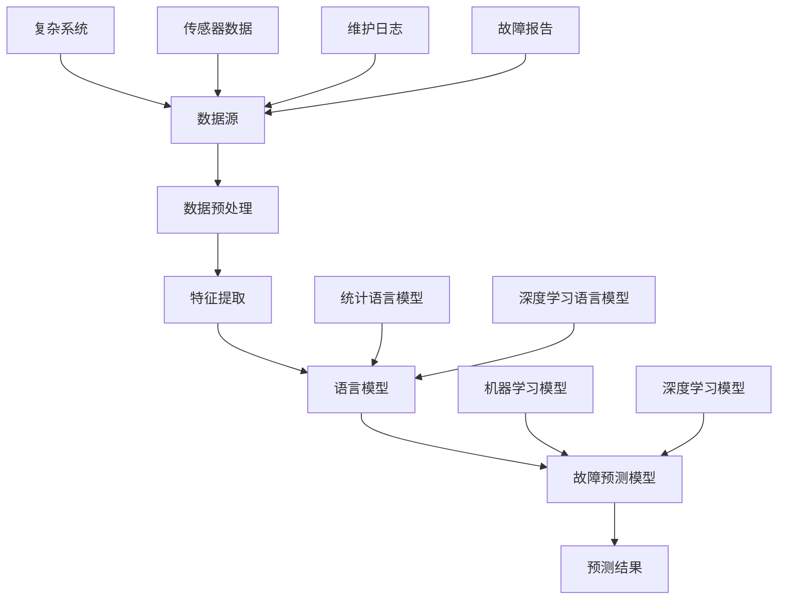

# 语言模型在复杂系统故障预测中的应用探索

> 关键词：语言模型、复杂系统、故障预测、机器学习、自然语言处理、数据挖掘、智能诊断

> 摘要：本文聚焦于语言模型在复杂系统故障预测中的应用。首先介绍了研究的背景、目的和范围，阐述了预期读者和文档结构。接着深入探讨了语言模型、复杂系统故障预测的核心概念及其联系，给出了相应的原理和架构示意图与流程图。详细讲解了相关核心算法原理，并结合Python源代码进行具体操作步骤的说明。从数学模型和公式层面进行剖析，辅以举例加深理解。通过项目实战，展示了开发环境搭建、源代码实现及解读分析。探讨了语言模型在复杂系统故障预测中的实际应用场景，推荐了学习资源、开发工具框架和相关论文著作。最后总结了未来发展趋势与挑战，解答常见问题并提供扩展阅读与参考资料，旨在全面深入地探索语言模型在复杂系统故障预测领域的应用。

## 1. 背景介绍 
### 1.1 目的和范围
随着现代科技的飞速发展，复杂系统在各个领域的应用日益广泛，如航空航天、电力系统、工业制造等。这些复杂系统往往结构复杂、组件众多且相互关联，一旦发生故障，可能会造成巨大的经济损失甚至危及生命安全。因此，准确、及时地预测复杂系统的故障具有至关重要的意义。

本研究的目的在于探索语言模型在复杂系统故障预测中的应用潜力，研究如何利用语言模型对复杂系统产生的大量文本数据（如维护日志、故障报告、传感器数据的文本描述等）进行分析和处理，以实现对复杂系统故障的有效预测。

研究范围涵盖了多种类型的复杂系统，包括但不限于工业自动化系统、交通运输系统、能源供应系统等。同时，涉及多种语言模型，如基于规则的语言模型、统计语言模型以及近年来发展迅速的深度学习语言模型（如Transformer架构的语言模型）。

### 1.2 预期读者
本文的预期读者包括但不限于以下几类人群：
- **科研人员**：对人工智能、机器学习、自然语言处理等领域有深入研究，关注语言模型在不同领域应用的科研工作者。
- **工程师**：从事复杂系统设计、开发、维护和管理的工程师，希望借助新的技术手段提高复杂系统的可靠性和安全性。
- **技术爱好者**：对语言模型、复杂系统故障预测等技术感兴趣，希望了解相关技术原理和应用案例的技术爱好者。
- **企业管理者**：负责复杂系统运营和管理的企业管理者，关注如何利用先进技术降低系统故障风险，提高企业的经济效益和竞争力。

### 1.3 文档结构概述
本文将按照以下结构进行组织：
- **核心概念与联系**：介绍语言模型和复杂系统故障预测的核心概念，阐述它们之间的联系，并给出相应的原理和架构示意图与流程图。
- **核心算法原理 & 具体操作步骤**：详细讲解语言模型在复杂系统故障预测中应用的核心算法原理，结合Python源代码说明具体操作步骤。
- **数学模型和公式 & 详细讲解 & 举例说明**：从数学模型和公式层面进行剖析，辅以具体例子加深理解。
- **项目实战：代码实际案例和详细解释说明**：通过实际项目案例，展示开发环境搭建、源代码实现及解读分析。
- **实际应用场景**：探讨语言模型在复杂系统故障预测中的实际应用场景。
- **工具和资源推荐**：推荐学习资源、开发工具框架和相关论文著作。
- **总结：未来发展趋势与挑战**：总结语言模型在复杂系统故障预测领域的未来发展趋势与挑战。
- **附录：常见问题与解答**：解答读者可能遇到的常见问题。
- **扩展阅读 & 参考资料**：提供扩展阅读的相关资料和参考文献。

### 1.4 术语表
#### 1.4.1 核心术语定义
- **语言模型**：是一种对语言概率分布进行建模的模型，它可以根据给定的上下文预测下一个词或字符出现的概率。在自然语言处理中，语言模型用于文本生成、机器翻译、语音识别等任务。
- **复杂系统**：是由大量相互作用的组件组成的系统，这些组件之间的关系复杂且非线性，系统的行为往往具有涌现性、不确定性和动态性。
- **故障预测**：是指通过对系统运行状态的监测和分析，提前预测系统可能发生的故障，以便采取相应的措施进行预防和修复。
- **机器学习**：是一门多领域交叉学科，涉及概率论、统计学、逼近论、凸分析、算法复杂度理论等多门学科。它专门研究计算机怎样模拟或实现人类的学习行为，以获取新的知识或技能，重新组织已有的知识结构使之不断改善自身的性能。
- **自然语言处理**：是计算机科学与人工智能领域中的一个重要方向。它研究能实现人与计算机之间用自然语言进行有效通信的各种理论和方法。

#### 1.4.2 相关概念解释
- **深度学习语言模型**：是基于深度学习技术的语言模型，如基于神经网络的循环神经网络（RNN）、长短时记忆网络（LSTM）、门控循环单元（GRU）以及Transformer架构的语言模型（如BERT、GPT等）。这些模型能够自动学习语言的复杂模式和特征，在自然语言处理任务中取得了很好的效果。
- **传感器数据**：是指由各种传感器采集到的数据，如温度传感器、压力传感器、振动传感器等采集到的数据。这些数据可以反映系统的运行状态，是复杂系统故障预测的重要依据。
- **维护日志**：是记录系统维护过程和相关信息的文档，包括维护时间、维护人员、维护内容、故障现象等。维护日志中包含了大量与系统故障相关的信息，可以为故障预测提供重要的线索。

#### 1.4.3 缩略词列表
- **RNN**：Recurrent Neural Network，循环神经网络
- **LSTM**：Long Short-Term Memory，长短时记忆网络
- **GRU**：Gated Recurrent Unit，门控循环单元
- **BERT**：Bidirectional Encoder Representations from Transformers，基于Transformer的双向编码器表示
- **GPT**：Generative Pretrained Transformer，生成式预训练Transformer

## 2. 核心概念与联系 

### 2.1 语言模型核心概念
语言模型的主要目标是对语言的概率分布进行建模，从而能够预测一个词序列出现的概率。在实际应用中，语言模型可以用于文本生成、机器翻译、语音识别等任务。

从原理上来说，传统的统计语言模型基于n-gram模型，它假设一个词的出现只与前面的n-1个词有关。例如，在一个二元语法（bigram）模型中，一个词的概率只依赖于它前面的一个词。其数学表达式为：

$$P(w_1^m)=\prod_{i=1}^{m}P(w_i|w_1^{i - 1})\approx\prod_{i=1}^{m}P(w_i|w_{i - n + 1}^{i - 1})$$

其中，$w_1^m$ 表示一个长度为m的词序列，$P(w_i|w_1^{i - 1})$ 表示在给定前面 $i - 1$ 个词的条件下，第 $i$ 个词出现的概率。

深度学习语言模型则通过神经网络来学习语言的表示和模式。例如，基于RNN的语言模型可以处理变长的输入序列，通过隐藏状态来捕捉序列中的上下文信息。

### 2.2 复杂系统故障预测核心概念
复杂系统故障预测是指通过对系统运行状态的监测和分析，提前预测系统可能发生的故障。复杂系统的故障往往具有多样性、复杂性和不确定性，其故障原因可能涉及多个组件和因素的相互作用。

故障预测的一般流程包括数据采集、数据预处理、特征提取、模型训练和故障预测等步骤。数据采集是指从系统的各种传感器、维护日志等数据源中获取相关数据；数据预处理是对采集到的数据进行清洗、归一化等操作，以提高数据的质量；特征提取是从预处理后的数据中提取能够反映系统故障状态的特征；模型训练是使用提取的特征对故障预测模型进行训练；故障预测是使用训练好的模型对系统的未来状态进行预测。

### 2.3 语言模型与复杂系统故障预测的联系
语言模型可以在复杂系统故障预测中发挥重要作用。复杂系统产生的大量文本数据，如维护日志、故障报告等，包含了丰富的故障信息。语言模型可以对这些文本数据进行分析和处理，提取其中的关键信息和模式，从而为故障预测提供支持。

例如，通过对维护日志中的文本描述进行分析，语言模型可以识别出故障的类型、原因和发生频率等信息。这些信息可以作为故障预测模型的输入特征，提高故障预测的准确性。此外，语言模型还可以用于对故障报告进行自动分类和归纳，方便后续的故障分析和处理。

### 2.4 核心概念原理和架构的文本示意图
```plaintext
+----------------------+
|  复杂系统            |
|  (包含多个组件)      |
+----------------------+
           |
           | 数据采集
           v
+----------------------+
|  数据源              |
|  (传感器数据、维护  |
|   日志、故障报告等) |
+----------------------+
           |
           | 数据预处理
           v
+----------------------+
|  预处理后数据        |
+----------------------+
           |
           | 特征提取
           v
+----------------------+
|  特征向量            |
+----------------------+
           |
           | 语言模型处理
           v
+----------------------+
|  语言模型            |
|  (统计语言模型、深  |
|   度学习语言模型)   |
+----------------------+
           |
           | 输出关键信息
           v
+----------------------+
|  故障预测模型        |
|  (机器学习模型、深  |
|   度学习模型)       |
+----------------------+
           |
           | 故障预测
           v
+----------------------+
|  预测结果            |
+----------------------+
```

### 2.5 Mermaid流程图


## 3. 核心算法原理 & 具体操作步骤 

### 3.1 基于n-gram的语言模型算法原理
n-gram语言模型基于马尔可夫假设，即一个词的出现只与前面的n-1个词有关。以二元语法（bigram）模型为例，其核心思想是计算每个词对 $(w_{i - 1}, w_i)$ 出现的概率。

具体步骤如下：
1. **数据收集**：收集大量的文本数据，如维护日志、故障报告等。
2. **数据预处理**：对收集到的文本数据进行清洗，去除噪声和无关信息，然后进行分词处理。
3. **统计词频**：统计每个词对 $(w_{i - 1}, w_i)$ 出现的频率 $C(w_{i - 1}, w_i)$ 和每个词 $w_{i - 1}$ 出现的频率 $C(w_{i - 1})$。
4. **计算概率**：根据统计的词频计算每个词对的条件概率 $P(w_i|w_{i - 1})=\frac{C(w_{i - 1}, w_i)}{C(w_{i - 1})}$。

### 3.2 Python实现基于n-gram的语言模型
```python
import re
from collections import defaultdict, Counter

def preprocess_text(text):
    # 去除标点符号并转换为小写
    text = re.sub(r'[^\w\s]', '', text).lower()
    # 分词
    tokens = text.split()
    return tokens

def create_bigram_model(tokens):
    bigram_counts = defaultdict(Counter)
    for i in range(len(tokens) - 1):
        bigram_counts[tokens[i]][tokens[i + 1]] += 1
    bigram_probs = {}
    for prev_word, next_words in bigram_counts.items():
        total_count = sum(next_words.values())
        bigram_probs[prev_word] = {word: count / total_count for word, count in next_words.items()}
    return bigram_probs

# 示例文本
text = "The system has a fault. The fault is serious."
tokens = preprocess_text(text)
bigram_model = create_bigram_model(tokens)

# 打印bigram模型的部分结果
for prev_word, next_probs in list(bigram_model.items())[:5]:
    print(f"Prev word: {prev_word}")
    for next_word, prob in next_probs.items():
        print(f"  Next word: {next_word}, Probability: {prob}")
```

### 3.3 基于LSTM的语言模型算法原理
LSTM是一种特殊的RNN，它能够有效地处理长序列数据，解决了传统RNN中的梯度消失问题。LSTM通过门控机制来控制信息的流动，包括输入门、遗忘门和输出门。

具体步骤如下：
1. **数据准备**：将文本数据转换为数值序列，通常使用词嵌入（word embedding）将每个词映射到一个低维向量空间。
2. **模型构建**：构建LSTM模型，包括输入层、LSTM层和输出层。输入层接收词嵌入向量，LSTM层处理序列信息，输出层输出预测的词概率分布。
3. **模型训练**：使用训练数据对LSTM模型进行训练，通过反向传播算法更新模型的参数。
4. **故障预测**：使用训练好的LSTM模型对新的文本数据进行预测，得到故障相关的信息。

### 3.4 Python实现基于LSTM的语言模型
```python
import numpy as np
from tensorflow.keras.preprocessing.text import Tokenizer
from tensorflow.keras.preprocessing.sequence import pad_sequences
from tensorflow.keras.models import Sequential
from tensorflow.keras.layers import Embedding, LSTM, Dense

# 示例文本数据
texts = ["The system has a minor fault", "The fault is resolved quickly", "There is a major fault in the system"]

# 分词并创建词表
tokenizer = Tokenizer()
tokenizer.fit_on_texts(texts)
total_words = len(tokenizer.word_index) + 1

# 准备训练数据
input_sequences = []
for line in texts:
    token_list = tokenizer.texts_to_sequences([line])[0]
    for i in range(1, len(token_list)):
        n_gram_sequence = token_list[:i + 1]
        input_sequences.append(n_gram_sequence)

max_sequence_len = max([len(x) for x in input_sequences])
input_sequences = np.array(pad_sequences(input_sequences, maxlen=max_sequence_len, padding='pre'))

# 划分输入和标签
xs, labels = input_sequences[:, :-1], input_sequences[:, -1]

# 构建LSTM模型
model = Sequential()
model.add(Embedding(total_words, 100, input_length=max_sequence_len - 1))
model.add(LSTM(100))
model.add(Dense(total_words, activation='softmax'))
model.compile(loss='sparse_categorical_crossentropy', optimizer='adam', metrics=['accuracy'])

# 训练模型
model.fit(xs, labels, epochs=100, verbose=1)

# 预测示例
seed_text = "The system"
next_words = 3
for _ in range(next_words):
    token_list = tokenizer.texts_to_sequences([seed_text])[0]
    token_list = pad_sequences([token_list], maxlen=max_sequence_len - 1, padding='pre')
    predicted = np.argmax(model.predict(token_list), axis=-1)
    output_word = ""
    for word, index in tokenizer.word_index.items():
        if index == predicted:
            output_word = word
            break
    seed_text += " " + output_word

print("Predicted text:", seed_text)
```

## 4. 数学模型和公式 & 详细讲解 & 举例说明 

### 4.1 n-gram语言模型的数学模型和公式
n-gram语言模型基于马尔可夫假设，即一个词的出现只与前面的n-1个词有关。对于一个长度为m的词序列 $w_1^m$，其概率可以表示为：

$$P(w_1^m)=\prod_{i=1}^{m}P(w_i|w_1^{i - 1})\approx\prod_{i=1}^{m}P(w_i|w_{i - n + 1}^{i - 1})$$

其中，$P(w_i|w_{i - n + 1}^{i - 1})$ 可以通过最大似然估计来计算：

$$P(w_i|w_{i - n + 1}^{i - 1})=\frac{C(w_{i - n + 1}^{i})}{C(w_{i - n + 1}^{i - 1})}$$

其中，$C(w_{i - n + 1}^{i})$ 表示词序列 $w_{i - n + 1}^{i}$ 出现的频率，$C(w_{i - n + 1}^{i - 1})$ 表示词序列 $w_{i - n + 1}^{i - 1}$ 出现的频率。

**举例说明**：假设有文本数据 "The cat is on the mat"，我们要计算二元语法（bigram）模型中 $P(is|cat)$ 的概率。首先统计 $C(cat, is)$ 和 $C(cat)$ 的频率，假设 $C(cat, is)=1$，$C(cat)=1$，则 $P(is|cat)=\frac{C(cat, is)}{C(cat)} = 1$。

### 4.2 LSTM的数学模型和公式
LSTM的核心是通过门控机制来控制信息的流动，包括输入门 $i_t$、遗忘门 $f_t$ 和输出门 $o_t$。

遗忘门 $f_t$ 的计算公式为：

$$f_t=\sigma(W_f[h_{t - 1}, x_t]+b_f)$$

输入门 $i_t$ 的计算公式为：

$$i_t=\sigma(W_i[h_{t - 1}, x_t]+b_i)$$

候选细胞状态 $\tilde{C}_t$ 的计算公式为：

$$\tilde{C}_t=\tanh(W_C[h_{t - 1}, x_t]+b_C)$$

细胞状态 $C_t$ 的计算公式为：

$$C_t=f_t\odot C_{t - 1}+i_t\odot\tilde{C}_t$$

输出门 $o_t$ 的计算公式为：

$$o_t=\sigma(W_o[h_{t - 1}, x_t]+b_o)$$

隐藏状态 $h_t$ 的计算公式为：

$$h_t=o_t\odot\tanh(C_t)$$

其中，$\sigma$ 是sigmoid函数，$\tanh$ 是双曲正切函数，$W$ 是权重矩阵，$b$ 是偏置向量，$\odot$ 表示逐元素相乘，$h_{t - 1}$ 是上一时刻的隐藏状态，$x_t$ 是当前时刻的输入。

**举例说明**：假设输入 $x_t$ 是一个词嵌入向量，$h_{t - 1}$ 是上一时刻的隐藏状态。首先计算遗忘门 $f_t$，通过将 $h_{t - 1}$ 和 $x_t$ 拼接后乘以权重矩阵 $W_f$ 并加上偏置向量 $b_f$，然后通过sigmoid函数得到遗忘门的值。遗忘门的值决定了上一时刻细胞状态 $C_{t - 1}$ 中哪些信息需要被遗忘。接着计算输入门 $i_t$ 和候选细胞状态 $\tilde{C}_t$，输入门的值决定了候选细胞状态 $\tilde{C}_t$ 中哪些信息需要被添加到细胞状态 $C_t$ 中。最后计算输出门 $o_t$ 和隐藏状态 $h_t$，输出门的值决定了细胞状态 $C_t$ 中哪些信息需要被输出到隐藏状态 $h_t$ 中。

### 4.3 故障预测模型的数学模型和公式
故障预测模型通常基于机器学习或深度学习算法，如逻辑回归、决策树、神经网络等。以逻辑回归为例，其数学模型可以表示为：

$$P(y = 1|x)=\frac{1}{1 + e^{-(w^Tx + b)}}$$

其中，$y$ 是故障标签（$y = 1$ 表示故障发生，$y = 0$ 表示正常），$x$ 是输入特征向量，$w$ 是权重向量，$b$ 是偏置项。

逻辑回归的目标是最小化损失函数，通常使用交叉熵损失函数：

$$L(w, b)=-\frac{1}{N}\sum_{i = 1}^{N}[y_i\log(P(y_i = 1|x_i))+(1 - y_i)\log(1 - P(y_i = 1|x_i))]$$

其中，$N$ 是样本数量。

**举例说明**：假设我们有一组故障预测的样本数据，每个样本包含多个特征（如温度、压力、振动等）和对应的故障标签。我们使用逻辑回归模型对这些样本数据进行训练，通过最小化交叉熵损失函数来更新权重向量 $w$ 和偏置项 $b$。训练完成后，对于一个新的样本 $x$，我们可以使用上述公式计算其发生故障的概率 $P(y = 1|x)$，如果 $P(y = 1|x)$ 大于某个阈值（如0.5），则预测该样本会发生故障。

## 5. 项目实战：代码实际案例和详细解释说明 

### 5.1  开发环境搭建
#### 5.1.1 操作系统
本项目可以在多种操作系统上进行开发，如Windows、Linux（如Ubuntu）、macOS等。建议使用Linux系统，因为它在开发和部署方面具有更好的兼容性和稳定性。

#### 5.1.2 Python环境
安装Python 3.6及以上版本。可以从Python官方网站（https://www.python.org/downloads/） 下载并安装Python。安装完成后，建议使用虚拟环境来管理项目的依赖。可以使用`venv`或`conda`来创建虚拟环境。

使用`venv`创建虚拟环境的命令如下：
```bash
python -m venv myenv
source myenv/bin/activate  # 在Windows上使用 myenv\Scripts\activate
```

#### 5.1.3 安装依赖库
在虚拟环境中安装项目所需的依赖库，主要包括`tensorflow`、`numpy`、`pandas`、`scikit-learn`等。可以使用`pip`来安装这些库：
```bash
pip install tensorflow numpy pandas scikit-learn
```

### 5.2  源代码详细实现和代码解读
#### 5.2.1 数据准备
```python
import pandas as pd
from sklearn.model_selection import train_test_split
from tensorflow.keras.preprocessing.text import Tokenizer
from tensorflow.keras.preprocessing.sequence import pad_sequences

# 读取数据
data = pd.read_csv('fault_data.csv')
texts = data['text'].values
labels = data['label'].values

# 分词并创建词表
tokenizer = Tokenizer()
tokenizer.fit_on_texts(texts)
total_words = len(tokenizer.word_index) + 1

# 将文本转换为数值序列
sequences = tokenizer.texts_to_sequences(texts)

# 填充序列
max_sequence_len = max([len(x) for x in sequences])
padded_sequences = pad_sequences(sequences, maxlen=max_sequence_len, padding='pre')

# 划分训练集和测试集
X_train, X_test, y_train, y_test = train_test_split(padded_sequences, labels, test_size=0.2, random_state=42)
```
**代码解读**：
- 首先使用`pandas`库读取包含故障文本数据和标签的CSV文件。
- 然后使用`Tokenizer`对文本数据进行分词并创建词表。
- 将文本数据转换为数值序列，并使用`pad_sequences`对序列进行填充，使其长度一致。
- 最后使用`train_test_split`将数据划分为训练集和测试集。

#### 5.2.2 模型构建
```python
from tensorflow.keras.models import Sequential
from tensorflow.keras.layers import Embedding, LSTM, Dense

# 构建LSTM模型
model = Sequential()
model.add(Embedding(total_words, 100, input_length=max_sequence_len))
model.add(LSTM(100))
model.add(Dense(1, activation='sigmoid'))
model.compile(loss='binary_crossentropy', optimizer='adam', metrics=['accuracy'])
```
**代码解读**：
- 使用`Sequential`模型构建一个简单的LSTM模型。
- `Embedding`层将输入的数值序列转换为词嵌入向量。
- `LSTM`层处理序列信息。
- `Dense`层作为输出层，使用`sigmoid`激活函数输出故障概率。
- 使用`binary_crossentropy`作为损失函数，`adam`作为优化器，`accuracy`作为评估指标。

#### 5.2.3 模型训练
```python
# 训练模型
model.fit(X_train, y_train, epochs=10, batch_size=32, validation_data=(X_test, y_test))
```
**代码解读**：
- 使用`fit`方法对模型进行训练，指定训练集、训练轮数、批次大小和验证集。

#### 5.2.4 模型评估
```python
# 评估模型
loss, accuracy = model.evaluate(X_test, y_test)
print(f"Test Loss: {loss}, Test Accuracy: {accuracy}")
```
**代码解读**：
- 使用`evaluate`方法对模型在测试集上的性能进行评估，输出损失值和准确率。

### 5.3  代码解读与分析
#### 5.3.1 数据处理部分
数据处理部分的主要目的是将文本数据转换为模型可以处理的数值序列。`Tokenizer`将文本分词并创建词表，`pad_sequences`将序列填充到相同的长度，这样可以确保模型输入的一致性。

#### 5.3.2 模型构建部分
模型构建部分使用了一个简单的LSTM模型。`Embedding`层将词索引转换为词嵌入向量，LSTM层捕捉序列中的上下文信息，`Dense`层输出故障概率。`sigmoid`激活函数适用于二分类问题，`binary_crossentropy`损失函数可以有效地优化模型的参数。

#### 5.3.3 模型训练和评估部分
模型训练部分使用`fit`方法对模型进行训练，通过多次迭代更新模型的参数。验证集用于监控模型在训练过程中的性能，防止过拟合。模型评估部分使用`evaluate`方法对模型在测试集上的性能进行评估，得到损失值和准确率，这两个指标可以反映模型的性能好坏。

## 6. 实际应用场景 
### 6.1 工业自动化系统
在工业自动化系统中，大量的传感器和设备会产生各种运行数据和维护日志。语言模型可以对这些文本数据进行分析，预测设备可能出现的故障。例如，通过对设备维护日志中的文本描述进行分析，语言模型可以识别出设备的异常情况，如温度过高、振动异常等，并提前预测设备可能发生的故障，以便及时进行维护和修复，减少停机时间和生产损失。

### 6.2 交通运输系统
交通运输系统（如飞机、火车、汽车等）的安全性至关重要。语言模型可以对飞机的飞行日志、火车的运行记录、汽车的故障报告等文本数据进行分析，预测交通运输工具可能出现的故障。例如，通过对飞机飞行日志中的文本信息进行分析，语言模型可以识别出飞机发动机、航电系统等部件的潜在故障，提前采取措施，确保飞行安全。

### 6.3 能源供应系统
能源供应系统（如电力系统、石油化工系统等）的稳定运行对社会经济发展至关重要。语言模型可以对能源供应系统的设备运行数据、维护报告等文本信息进行分析，预测设备故障和能源供应中断的风险。例如，通过对电力系统中变压器的维护日志进行分析，语言模型可以预测变压器可能出现的故障，提前安排检修计划，保障电力供应的稳定性。

### 6.4 医疗设备系统
医疗设备的正常运行直接关系到患者的生命安全。语言模型可以对医疗设备的使用记录、维护报告等文本数据进行分析，预测医疗设备可能出现的故障。例如，通过对心电图机的使用日志进行分析，语言模型可以识别出设备的异常情况，提前通知维修人员进行检修，确保医疗设备的可靠性。

## 7. 工具和资源推荐
### 7.1 学习资源推荐
#### 7.1.1 书籍推荐
- 《深度学习》（Deep Learning）：由Ian Goodfellow、Yoshua Bengio和Aaron Courville合著，是深度学习领域的经典教材，涵盖了深度学习的基本原理、算法和应用。
- 《自然语言处理入门》：由何晗著，介绍了自然语言处理的基本概念、算法和实践，适合初学者入门。
- 《Python机器学习》（Python Machine Learning）：由Sebastian Raschka和Vahid Mirjalili合著，介绍了Python在机器学习中的应用，包括各种机器学习算法的实现和实践。

#### 7.1.2 在线课程
- Coursera上的“深度学习专项课程”（Deep Learning Specialization）：由Andrew Ng教授主讲，涵盖了深度学习的各个方面，包括神经网络、卷积神经网络、循环神经网络等。
- edX上的“自然语言处理基础”（Foundations of Natural Language Processing）：介绍了自然语言处理的基本概念、算法和应用。
- Udemy上的“Python for Data Science and Machine Learning Bootcamp”：介绍了Python在数据科学和机器学习中的应用，包括数据处理、可视化、机器学习算法等。

#### 7.1.3 技术博客和网站
- Medium：是一个技术博客平台，上面有很多关于语言模型、机器学习、自然语言处理等领域的优秀文章。
- arXiv：是一个预印本平台，上面有很多最新的学术研究成果，包括语言模型在各个领域的应用研究。
- Towards Data Science：是一个专注于数据科学和机器学习的技术博客，上面有很多实用的教程和案例分析。

### 7.2 开发工具框架推荐
#### 7.2.1 IDE和编辑器
- PyCharm：是一款专业的Python集成开发环境，提供了丰富的功能，如代码编辑、调试、版本控制等，适合Python开发。
- Visual Studio Code：是一款轻量级的代码编辑器，支持多种编程语言，有丰富的插件可以扩展其功能，适合快速开发和调试。

#### 7.2.2 调试和性能分析工具
- TensorBoard：是TensorFlow的可视化工具，可以用于监控模型的训练过程、可视化模型的结构和性能指标等。
- Py-Spy：是一个Python性能分析工具，可以用于分析Python程序的性能瓶颈，找出耗时的函数和代码段。

#### 7.2.3 相关框架和库
- TensorFlow：是一个开源的深度学习框架，提供了丰富的工具和接口，支持多种深度学习任务，如图像识别、自然语言处理等。
- PyTorch：是另一个流行的深度学习框架，具有动态图的特点，易于使用和调试，适合研究和开发。
- NLTK：是一个自然语言处理工具包，提供了丰富的语料库和工具，用于文本处理、分词、词性标注等任务。

### 7.3 相关论文著作推荐
#### 7.3.1 经典论文
- “Attention Is All You Need”：介绍了Transformer架构，是自然语言处理领域的经典论文，为后续的语言模型发展奠定了基础。
- “Long Short-Term Memory”：介绍了LSTM的原理和应用，解决了传统RNN中的梯度消失问题。
- “BERT: Pre-training of Deep Bidirectional Transformers for Language Understanding”：介绍了BERT模型，是一种基于Transformer的预训练语言模型，在自然语言处理任务中取得了很好的效果。

#### 7.3.2 最新研究成果
- 关注arXiv上关于语言模型在复杂系统故障预测领域的最新研究论文，了解该领域的最新技术和方法。
- 参加相关的学术会议，如NeurIPS、ACL、ICML等，获取最新的研究成果和前沿动态。

#### 7.3.3 应用案例分析
- 一些知名企业和研究机构会发布语言模型在复杂系统故障预测中的应用案例，如Google、Microsoft等公司的技术博客和研究报告。通过分析这些应用案例，可以了解语言模型在实际应用中的实现方法和效果。

## 8. 总结：未来发展趋势与挑战
### 8.1 未来发展趋势
#### 8.1.1 多模态融合
未来的语言模型在复杂系统故障预测中可能会与其他模态的数据（如图像、音频、视频等）进行融合。例如，在工业自动化系统中，结合设备的图像数据和维护日志文本数据，可以更全面地了解设备的运行状态，提高故障预测的准确性。

#### 8.1.2 强化学习与语言模型的结合
强化学习可以根据系统的反馈不断优化故障预测策略。将强化学习与语言模型相结合，可以使语言模型在复杂系统故障预测中更加智能和自适应。例如，通过强化学习可以动态调整语言模型的参数和预测策略，以适应不同的系统状态和环境变化。

#### 8.1.3 预训练语言模型的应用
预训练语言模型（如BERT、GPT等）在自然语言处理领域取得了巨大的成功。未来，这些预训练语言模型可能会在复杂系统故障预测中得到更广泛的应用。通过对预训练语言模型进行微调，可以使其更好地适应复杂系统故障预测的任务，提高预测的性能和效率。

### 8.2 挑战
#### 8.2.1 数据质量和标注问题
复杂系统产生的文本数据往往存在噪声、不规范和缺失等问题，这会影响语言模型的训练和预测效果。此外，故障数据的标注需要专业知识和大量的人力，标注的准确性和一致性也会影响模型的性能。

#### 8.2.2 模型可解释性问题
深度学习语言模型通常是黑盒模型，其决策过程难以解释。在复杂系统故障预测中，模型的可解释性非常重要，因为决策者需要了解模型预测的依据和可靠性。如何提高语言模型的可解释性是一个亟待解决的问题。

#### 8.2.3 计算资源和效率问题
语言模型的训练和推理通常需要大量的计算资源和时间。在实际应用中，需要在保证预测准确性的前提下，提高模型的计算效率，降低计算成本。

## 9. 附录：常见问题与解答
### 9.1 语言模型在复杂系统故障预测中的准确率如何提高？
可以从以下几个方面提高语言模型在复杂系统故障预测中的准确率：
- **数据预处理**：对原始数据进行清洗、归一化、去噪等操作，提高数据的质量。
- **特征工程**：提取更有代表性和区分性的特征，如文本的关键词、词性、句法结构等。
- **模型选择和调优**：选择合适的语言模型，并对模型的参数进行调优，如学习率、批次大小、训练轮数等。
- **多模型融合**：将多个不同的语言模型或其他类型的模型进行融合，综合利用它们的优势。

### 9.2 如何处理复杂系统中的非文本数据（如图像、音频等）？
可以将非文本数据转换为文本数据或与文本数据进行融合处理。例如，对于图像数据，可以使用图像识别技术将图像中的信息转换为文本描述；对于音频数据，可以使用语音识别技术将音频转换为文本。然后将这些转换后的文本数据与原始的文本数据一起输入到语言模型中进行处理。

### 9.3 语言模型在复杂系统故障预测中的实时性如何保证？
可以从以下几个方面保证语言模型在复杂系统故障预测中的实时性：
- **模型优化**：选择轻量级的语言模型，并对模型进行优化，减少计算量和推理时间。
- **硬件加速**：使用GPU、TPU等硬件加速设备，提高模型的计算效率。
- **数据流式处理**：采用数据流式处理的方式，实时处理新产生的数据，减少数据处理的延迟。

## 10. 扩展阅读 & 参考资料
### 10.1 扩展阅读
- 《人工智能：现代方法》（Artificial Intelligence: A Modern Approach）：全面介绍了人工智能的基本概念、算法和应用，是人工智能领域的经典教材。
- 《深度学习实战》（Deep Learning in Practice）：介绍了深度学习在各个领域的实际应用案例，包括自然语言处理、图像识别、语音识别等。
- 《自然语言处理综论》（Speech and Language Processing）：是自然语言处理领域的权威著作，涵盖了自然语言处理的各个方面，包括语言模型、机器翻译、信息检索等。

### 10.2 参考资料
- 相关的学术论文和研究报告，可以从IEEE Xplore、ACM Digital Library、ScienceDirect等学术数据库中获取。
- 各个深度学习框架和工具的官方文档，如TensorFlow官方文档（https://www.tensorflow.org/）、PyTorch官方文档（https://pytorch.org/）等。
- 相关的技术博客和论坛，如Stack Overflow、GitHub等，上面有很多开发者分享的经验和代码。