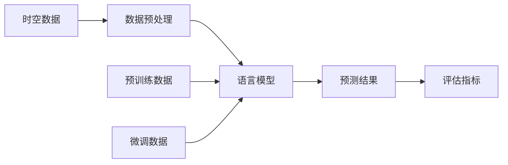

# 语言模型在时空数据分析与预测中的表现评估

> 关键词：语言模型、时空数据分析、时空数据预测、表现评估、性能指标

> 摘要：本文聚焦于语言模型在时空数据分析与预测领域的应用，深入探讨其表现评估的相关问题。首先介绍了时空数据分析与预测的背景知识，阐述语言模型在该领域的应用目的和范围。接着详细讲解语言模型的核心概念、相关联系以及架构原理，并通过Mermaid流程图和Python源代码进行清晰展示。同时，给出相关数学模型和公式并举例说明。通过项目实战，从开发环境搭建到源代码实现与解读，全面呈现语言模型在时空数据分析与预测中的具体应用。还探讨了其实际应用场景，推荐了学习资源、开发工具框架以及相关论文著作。最后总结未来发展趋势与挑战，并提供常见问题解答和扩展阅读参考资料，旨在为研究和应用语言模型进行时空数据分析与预测提供全面而深入的指导。

## 1. 背景介绍 
### 1.1 目的和范围
时空数据分析与预测在众多领域都具有重要意义，如气象预报、交通流量预测、城市规划等。语言模型作为一种强大的人工智能工具，近年来在自然语言处理领域取得了显著成就。本研究的目的在于评估语言模型在时空数据分析与预测中的表现，探索其在处理时空数据时的优势与不足，为相关领域的研究和应用提供参考。

研究范围涵盖了常见的语言模型，如GPT系列、BERT等，以及多种时空数据集，包括气象数据、交通数据等。通过对不同语言模型在不同时空数据集上的实验，全面评估其在时空数据分析与预测任务中的性能。

### 1.2 预期读者
本文预期读者包括从事人工智能、数据挖掘、地理信息系统等领域的研究人员和工程师，以及对时空数据分析与预测感兴趣的学生和爱好者。对于希望了解语言模型在时空领域应用的专业人士，本文提供了深入的技术分析和实践指导；对于初学者，本文的详细讲解和示例也有助于他们快速入门。

### 1.3 文档结构概述
本文共分为十个部分。第一部分为背景介绍，阐述研究的目的、范围、预期读者和文档结构概述，并给出术语表。第二部分介绍语言模型在时空数据分析与预测中的核心概念与联系，包括原理和架构的文本示意图以及Mermaid流程图。第三部分讲解核心算法原理，并通过Python源代码详细阐述具体操作步骤。第四部分给出数学模型和公式，进行详细讲解并举例说明。第五部分是项目实战，包括开发环境搭建、源代码详细实现和代码解读以及代码分析。第六部分探讨实际应用场景。第七部分推荐学习资源、开发工具框架和相关论文著作。第八部分总结未来发展趋势与挑战。第九部分为附录，提供常见问题与解答。第十部分给出扩展阅读和参考资料。

### 1.4 术语表
#### 1.4.1 核心术语定义
- **语言模型**：一种基于概率统计的模型，用于预测给定上下文下下一个词或字符的概率分布。在本研究中，主要指基于深度学习的预训练语言模型，如GPT、BERT等。
- **时空数据**：包含时间和空间信息的数据，如气象数据中的时间、地点和气象参数，交通数据中的时间、路段和车流量等。
- **时空数据分析**：对时空数据进行挖掘、处理和分析，以发现数据中的模式、趋势和规律。
- **时空数据预测**：根据历史时空数据，预测未来某个时间点或时间段内的时空数据值。
- **表现评估**：通过一系列指标和方法，对语言模型在时空数据分析与预测任务中的性能进行评价和比较。

#### 1.4.2 相关概念解释
- **预训练**：在大规模无监督数据上对语言模型进行训练，学习语言的通用特征和模式，以便在后续的特定任务中进行微调。
- **微调**：在预训练的基础上，使用特定任务的有监督数据对语言模型进行进一步训练，使其适应特定任务的需求。
- **嵌入表示**：将文本或时空数据转换为低维向量表示，以便在神经网络中进行处理和计算。

#### 1.4.3 缩略词列表
- **GPT**：Generative Pretrained Transformer，生成式预训练变换器
- **BERT**：Bidirectional Encoder Representations from Transformers，基于变换器的双向编码器表示
- **MSE**：Mean Squared Error，均方误差
- **MAE**：Mean Absolute Error，平均绝对误差
- **RMSE**：Root Mean Squared Error，均方根误差

## 2. 核心概念与联系 
### 语言模型原理
语言模型的核心思想是学习语言的概率分布，即给定一个词序列，预测下一个词的概率。基于深度学习的语言模型通常采用神经网络结构，如循环神经网络（RNN）、长短期记忆网络（LSTM）、门控循环单元（GRU）以及变换器（Transformer）等。

以Transformer为例，它采用了自注意力机制（Self-Attention），能够捕捉输入序列中不同位置之间的依赖关系。Transformer由编码器和解码器组成，编码器负责对输入序列进行编码，解码器根据编码器的输出生成输出序列。

### 时空数据与语言模型的联系
时空数据可以看作是一种特殊的序列数据，其中时间和空间信息构成了序列的维度。语言模型可以通过学习时空数据的序列模式，对未来的时空数据进行预测。例如，可以将时空数据转换为文本序列，然后使用语言模型进行处理。

### 文本示意图
```plaintext
时空数据 -> 数据预处理（特征提取、编码） -> 语言模型（预训练、微调） -> 预测结果 -> 评估指标（MSE、MAE、RMSE等）
```

### Mermaid流程图


## 3. 核心算法原理 & 具体操作步骤 
### 算法原理
以基于Transformer的语言模型为例，其核心算法原理包括自注意力机制和前馈神经网络。

自注意力机制的计算公式如下：
$$Attention(Q, K, V) = softmax(\frac{QK^T}{\sqrt{d_k}})V$$
其中，$Q$、$K$、$V$分别为查询矩阵、键矩阵和值矩阵，$d_k$为键向量的维度。

前馈神经网络通常由两个线性层和一个激活函数组成，计算公式如下：
$$FFN(x) = max(0, xW_1 + b_1)W_2 + b_2$$
其中，$W_1$、$W_2$为权重矩阵，$b_1$、$b_2$为偏置向量。

### 具体操作步骤
#### 步骤1：数据预处理
将时空数据进行特征提取和编码，转换为适合语言模型输入的格式。例如，可以将时间信息转换为时间戳，将空间信息转换为地理编码。

#### 步骤2：语言模型预训练
使用大规模无监督数据对语言模型进行预训练，学习语言的通用特征和模式。

#### 步骤3：语言模型微调
使用特定任务的有监督数据对预训练的语言模型进行微调，使其适应时空数据分析与预测任务。

#### 步骤4：预测
使用微调后的语言模型对未来的时空数据进行预测。

#### 步骤5：评估
使用评估指标（如MSE、MAE、RMSE等）对预测结果进行评估。

### Python源代码实现
```python
import torch
import torch.nn as nn
import torch.optim as optim

# 定义Transformer编码器层
class TransformerEncoderLayer(nn.Module):
    def __init__(self, d_model, nhead, dim_feedforward=2048, dropout=0.1):
        super(TransformerEncoderLayer, self).__init__()
        self.self_attn = nn.MultiheadAttention(d_model, nhead, dropout=dropout)
        self.linear1 = nn.Linear(d_model, dim_feedforward)
        self.dropout = nn.Dropout(dropout)
        self.linear2 = nn.Linear(dim_feedforward, d_model)
        self.norm1 = nn.LayerNorm(d_model)
        self.norm2 = nn.LayerNorm(d_model)
        self.dropout1 = nn.Dropout(dropout)
        self.dropout2 = nn.Dropout(dropout)

    def forward(self, src, src_mask=None, src_key_padding_mask=None):
        src2 = self.self_attn(src, src, src, attn_mask=src_mask,
                              key_padding_mask=src_key_padding_mask)[0]
        src = src + self.dropout1(src2)
        src = self.norm1(src)
        src2 = self.linear2(self.dropout(torch.relu(self.linear1(src))))
        src = src + self.dropout2(src2)
        src = self.norm2(src)
        return src

# 定义基于Transformer的语言模型
class TransformerLanguageModel(nn.Module):
    def __init__(self, d_model, nhead, num_layers, dim_feedforward=2048, dropout=0.1):
        super(TransformerLanguageModel, self).__init__()
        encoder_layer = TransformerEncoderLayer(d_model, nhead, dim_feedforward, dropout)
        self.transformer_encoder = nn.TransformerEncoder(encoder_layer, num_layers)
        self.decoder = nn.Linear(d_model, 1)

    def forward(self, src, src_mask=None, src_key_padding_mask=None):
        output = self.transformer_encoder(src, src_mask, src_key_padding_mask)
        output = self.decoder(output)
        return output

# 训练模型
def train_model(model, train_loader, criterion, optimizer, device):
    model.train()
    total_loss = 0
    for inputs, targets in train_loader:
        inputs, targets = inputs.to(device), targets.to(device)
        optimizer.zero_grad()
        outputs = model(inputs)
        loss = criterion(outputs.squeeze(), targets)
        loss.backward()
        optimizer.step()
        total_loss += loss.item()
    return total_loss / len(train_loader)

# 预测
def predict(model, test_loader, device):
    model.eval()
    predictions = []
    with torch.no_grad():
        for inputs in test_loader:
            inputs = inputs.to(device)
            outputs = model(inputs)
            predictions.extend(outputs.squeeze().tolist())
    return predictions
```

## 4. 数学模型和公式 & 详细讲解 & 举例说明 
### 评估指标
#### 均方误差（MSE）
均方误差是预测值与真实值之间误差的平方的平均值，计算公式如下：
$$MSE = \frac{1}{n}\sum_{i=1}^{n}(y_i - \hat{y}_i)^2$$
其中，$y_i$为真实值，$\hat{y}_i$为预测值，$n$为样本数量。

MSE反映了预测值与真实值之间的平均误差程度，误差越大，MSE值越大。

#### 平均绝对误差（MAE）
平均绝对误差是预测值与真实值之间误差的绝对值的平均值，计算公式如下：
$$MAE = \frac{1}{n}\sum_{i=1}^{n}|y_i - \hat{y}_i|$$
MAE同样反映了预测值与真实值之间的平均误差程度，但对异常值的敏感性较低。

#### 均方根误差（RMSE）
均方根误差是均方误差的平方根，计算公式如下：
$$RMSE = \sqrt{\frac{1}{n}\sum_{i=1}^{n}(y_i - \hat{y}_i)^2}$$
RMSE与MSE类似，但具有与原始数据相同的单位，更直观地反映了预测误差的大小。

### 举例说明
假设我们有以下真实值和预测值：
真实值：$y = [1, 2, 3, 4, 5]$
预测值：$\hat{y} = [1.2, 2.1, 2.9, 4.2, 4.8]$

计算MSE：
$$MSE = \frac{(1 - 1.2)^2 + (2 - 2.1)^2 + (3 - 2.9)^2 + (4 - 4.2)^2 + (5 - 4.8)^2}{5} = 0.02$$

计算MAE：
$$MAE = \frac{|1 - 1.2| + |2 - 2.1| + |3 - 2.9| + |4 - 4.2| + |5 - 4.8|}{5} = 0.12$$

计算RMSE：
$$RMSE = \sqrt{0.02} \approx 0.1414$$

## 5. 项目实战：代码实际案例和详细解释说明 
### 5.1  开发环境搭建
#### 安装Python
首先需要安装Python 3.x版本，可以从Python官方网站（https://www.python.org/downloads/）下载并安装。

#### 安装依赖库
使用pip安装所需的依赖库，包括torch、numpy、pandas等。
```sh
pip install torch numpy pandas
```

### 5.2  源代码详细实现和代码解读
```python
import torch
import torch.nn as nn
import torch.optim as optim
import numpy as np
import pandas as pd
from torch.utils.data import Dataset, DataLoader

# 定义数据集类
class TimeSeriesDataset(Dataset):
    def __init__(self, data, seq_length):
        self.data = data
        self.seq_length = seq_length

    def __len__(self):
        return len(self.data) - self.seq_length

    def __getitem__(self, idx):
        inputs = self.data[idx:idx+self.seq_length]
        target = self.data[idx+self.seq_length]
        return torch.tensor(inputs, dtype=torch.float32), torch.tensor(target, dtype=torch.float32)

# 加载数据
data = pd.read_csv('time_series_data.csv', header=None).values.flatten()

# 划分训练集和测试集
train_size = int(len(data) * 0.8)
train_data = data[:train_size]
test_data = data[train_size:]

# 数据集和数据加载器
seq_length = 10
train_dataset = TimeSeriesDataset(train_data, seq_length)
train_loader = DataLoader(train_dataset, batch_size=32, shuffle=True)
test_dataset = TimeSeriesDataset(test_data, seq_length)
test_loader = DataLoader(test_dataset, batch_size=32, shuffle=False)

# 定义模型
d_model = 64
nhead = 4
num_layers = 2
model = TransformerLanguageModel(d_model, nhead, num_layers)

# 定义损失函数和优化器
criterion = nn.MSELoss()
optimizer = optim.Adam(model.parameters(), lr=0.001)

# 训练模型
device = torch.device('cuda' if torch.cuda.is_available() else 'cpu')
model.to(device)
num_epochs = 10
for epoch in range(num_epochs):
    loss = train_model(model, train_loader, criterion, optimizer, device)
    print(f'Epoch {epoch+1}/{num_epochs}, Loss: {loss:.4f}')

# 预测
predictions = predict(model, test_loader, device)
```

### 5.3  代码解读与分析
- **数据集类**：`TimeSeriesDataset`类用于将时间序列数据转换为适合模型输入的格式，每个样本包含一个长度为`seq_length`的输入序列和一个对应的目标值。
- **数据加载**：使用`pandas`读取时间序列数据，并将其划分为训练集和测试集。然后使用`DataLoader`创建数据加载器，方便批量训练和预测。
- **模型定义**：定义了基于Transformer的语言模型`TransformerLanguageModel`，包括编码器层和线性解码器。
- **训练过程**：使用均方误差损失函数和Adam优化器进行训练，训练过程中打印每个epoch的损失值。
- **预测过程**：使用训练好的模型对测试集进行预测，得到预测结果。

## 6. 实际应用场景 
### 气象预报
语言模型可以学习历史气象数据的时空模式，预测未来的气象参数，如温度、湿度、降水等。通过对不同地区和时间的气象数据进行分析和预测，有助于提前做好气象灾害防范和农业生产安排。

### 交通流量预测
在交通领域，语言模型可以根据历史交通流量数据，预测未来的交通流量情况。这对于交通管理部门合理安排交通资源、优化交通信号控制以及驾驶员选择出行路线都具有重要意义。

### 城市规划
在城市规划中，语言模型可以分析城市不同区域的时空数据，如人口密度、土地利用、建筑物分布等，预测未来城市发展的趋势和需求。这有助于城市规划者制定合理的城市发展策略，提高城市的可持续发展能力。

### 环境监测
语言模型可以对环境监测数据进行分析和预测，如空气质量、水质等。通过及时掌握环境变化情况，采取相应的措施进行环境保护和治理。

## 7. 工具和资源推荐
### 7.1 学习资源推荐
#### 7.1.1 书籍推荐
- 《深度学习》（Deep Learning）：由Ian Goodfellow、Yoshua Bengio和Aaron Courville合著，是深度学习领域的经典教材，涵盖了神经网络、优化算法、深度学习应用等方面的内容。
- 《Python深度学习》（Deep Learning with Python）：由Francois Chollet著，介绍了使用Python和Keras进行深度学习的方法和实践，适合初学者快速入门。
- 《动手学深度学习》（Dive into Deep Learning）：由 Aston Zhang、Zachary C. Lipton、Mu Li和Alexander J. Smola合著，提供了丰富的深度学习代码示例和实践项目，适合边学边练。

#### 7.1.2 在线课程
- Coursera上的“深度学习专项课程”（Deep Learning Specialization）：由Andrew Ng教授授课，包括神经网络和深度学习、改善深层神经网络、结构化机器学习项目、卷积神经网络、序列模型等五个课程，系统地介绍了深度学习的理论和实践。
- edX上的“麻省理工学院：深度学习基础”（MITx: 6.S191x Introduction to Deep Learning）：由麻省理工学院的Lex Fridman教授授课，通过实际案例和代码实现，深入浅出地介绍了深度学习的基本概念和方法。
- 哔哩哔哩上的“李沐深度学习”系列课程：由李沐博士讲解，内容生动有趣，结合了大量的代码示例和实际应用，适合初学者学习。

#### 7.1.3 技术博客和网站
- Medium：一个技术博客平台，有许多深度学习和人工智能领域的专家分享他们的研究成果和实践经验。
- Towards Data Science：专注于数据科学和机器学习领域的技术博客，提供了大量的高质量文章和教程。
- arXiv：一个预印本数据库，收录了许多最新的学术论文，包括深度学习、人工智能等领域的研究成果。

### 7.2 开发工具框架推荐
#### 7.2.1 IDE和编辑器
- PyCharm：一款专业的Python集成开发环境，提供了代码编辑、调试、版本控制等功能，适合大规模项目开发。
- Jupyter Notebook：一种交互式的开发环境，支持Python、R等多种编程语言，方便进行数据探索、模型训练和可视化。
- Visual Studio Code：一款轻量级的代码编辑器，支持多种编程语言和插件，具有丰富的扩展功能。

#### 7.2.2 调试和性能分析工具
- TensorBoard：TensorFlow的可视化工具，可用于查看模型的训练过程、损失曲线、准确率等指标，帮助调试和优化模型。
- PyTorch Profiler：PyTorch的性能分析工具，可用于分析模型的计算性能、内存使用情况等，找出性能瓶颈。
- NVIDIA Nsight Systems：一款用于GPU性能分析的工具，可帮助开发者优化GPU代码，提高计算效率。

#### 7.2.3 相关框架和库
- PyTorch：一个开源的深度学习框架，提供了丰富的神经网络层和优化算法，支持GPU加速，广泛应用于学术界和工业界。
- TensorFlow：另一个流行的深度学习框架，具有高度的灵活性和可扩展性，提供了多种高级API和工具，方便模型的开发和部署。
- scikit-learn：一个用于机器学习的Python库，提供了多种机器学习算法和工具，如分类、回归、聚类等，适合快速实现和验证机器学习模型。

### 7.3 相关论文著作推荐
#### 7.3.1 经典论文
- “Attention Is All You Need”：介绍了Transformer架构，提出了自注意力机制，为现代语言模型的发展奠定了基础。
- “BERT: Pre-training of Deep Bidirectional Transformers for Language Understanding”：提出了BERT模型，通过双向预训练的方式学习语言的表示，在自然语言处理任务中取得了显著的效果。
- “Generative Pretrained Transformer 3”：介绍了GPT-3模型，展示了大规模预训练语言模型的强大能力。

#### 7.3.2 最新研究成果
- 关注顶级学术会议，如NeurIPS、ICML、ACL等，这些会议收录了许多最新的深度学习和人工智能领域的研究成果。
- 查阅相关的学术期刊，如Journal of Artificial Intelligence Research（JAIR）、Artificial Intelligence等，了解最新的研究动态。

#### 7.3.3 应用案例分析
- 一些开源项目和企业实践案例，如谷歌的BERT应用、OpenAI的GPT-3应用等，通过实际案例可以更好地理解语言模型在不同领域的应用方法和效果。

## 8. 总结：未来发展趋势与挑战
### 未来发展趋势
- **多模态融合**：将语言模型与图像、音频等多模态数据进行融合，实现更加全面和深入的时空数据分析与预测。例如，结合卫星图像和气象数据，提高气象预报的准确性。
- **强化学习与语言模型结合**：利用强化学习的方法优化语言模型的决策过程，使其能够在动态的时空环境中做出更优的预测和决策。
- **大规模预训练模型的优化**：不断优化大规模预训练语言模型的结构和训练方法，提高其在时空数据分析与预测任务中的性能和效率。
- **跨领域应用拓展**：将语言模型在时空数据分析与预测中的应用拓展到更多领域，如医疗、金融、能源等，为不同领域的决策提供支持。

### 挑战
- **数据质量和标注问题**：时空数据通常具有噪声、缺失值等问题，数据标注也比较困难。如何提高数据质量和标注效率是一个重要的挑战。
- **计算资源需求**：大规模预训练语言模型需要大量的计算资源和时间进行训练，如何在有限的资源下提高训练效率是一个亟待解决的问题。
- **模型可解释性**：语言模型通常是黑盒模型，其决策过程难以解释。在时空数据分析与预测领域，需要提高模型的可解释性，以便用户理解和信任模型的预测结果。
- **隐私和安全问题**：时空数据通常包含敏感信息，如个人位置、企业商业机密等。如何在使用语言模型进行数据分析和预测的同时，保护数据的隐私和安全是一个重要的挑战。

## 9. 附录：常见问题与解答
### 问题1：语言模型在时空数据分析与预测中的优势是什么？
答：语言模型具有强大的序列建模能力，能够学习时空数据中的复杂模式和依赖关系。同时，预训练语言模型可以利用大规模无监督数据学习语言的通用特征，在微调后可以快速适应特定的时空数据分析与预测任务，提高模型的性能和泛化能力。

### 问题2：如何选择合适的语言模型进行时空数据分析与预测？
答：需要考虑多个因素，如数据集的规模和特点、任务的复杂度、计算资源等。对于小规模数据集和简单任务，可以选择相对轻量级的语言模型；对于大规模数据集和复杂任务，可以选择大规模预训练语言模型，并进行微调。

### 问题3：如何处理时空数据中的缺失值和噪声？
答：对于缺失值，可以采用插值、填充等方法进行处理；对于噪声，可以采用滤波、平滑等方法进行去除。同时，在数据预处理阶段，可以对数据进行标准化、归一化等操作，提高数据的质量和稳定性。

### 问题4：如何评估语言模型在时空数据分析与预测中的性能？
答：可以使用多种评估指标，如均方误差（MSE）、平均绝对误差（MAE）、均方根误差（RMSE）等。同时，可以进行交叉验证、可视化分析等，全面评估模型的性能和可靠性。

## 10. 扩展阅读 & 参考资料
### 扩展阅读
- 《人工智能：一种现代的方法》（Artificial Intelligence: A Modern Approach）：全面介绍了人工智能的理论和方法，包括搜索算法、知识表示、机器学习、自然语言处理等方面的内容。
- 《自然语言处理入门》（Natural Language Processing: A Machine Learning Perspective）：系统地介绍了自然语言处理的基本概念、算法和应用，适合对自然语言处理感兴趣的读者。
- 《深度学习实战》（Deep Learning in Practice）：通过实际案例和代码实现，介绍了深度学习在计算机视觉、自然语言处理、语音识别等领域的应用，帮助读者将理论知识应用到实际项目中。

### 参考资料
- Goodfellow, I., Bengio, Y., & Courville, A. (2016). Deep Learning. MIT Press.
- Chollet, F. (2018). Deep Learning with Python. Manning Publications.
- Vaswani, A., Shazeer, N., Parmar, N., Uszkoreit, J., Jones, L., Gomez, A. N., ... & Polosukhin, I. (2017). Attention is all you need. In Advances in neural information processing systems (pp. 5998-6008).
- Devlin, J., Chang, M. W., Lee, K., & Toutanova, K. (2018). Bert: Pre-training of deep bidirectional transformers for language understanding. arXiv preprint arXiv:1810.04805.
- Brown, T. B., Mann, B., Ryder, N., Subbiah, M., Kaplan, J. D., Dhariwal, P., ... & Amodei, D. (2020). Language models are few-shot learners. arXiv preprint arXiv:2005.14165.