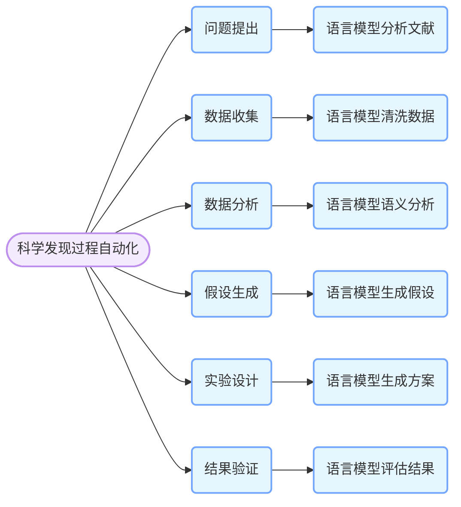

# 语言模型在科学发现过程自动化中的应用探索

> 关键词：语言模型、科学发现自动化、自然语言处理、机器学习、人工智能、知识图谱、数据挖掘

> 摘要：本文旨在深入探索语言模型在科学发现过程自动化中的应用。首先介绍了相关的背景知识，包括目的范围、预期读者等内容。接着阐述了语言模型和科学发现自动化的核心概念及其联系，通过文本示意图和 Mermaid 流程图进行直观展示。详细讲解了核心算法原理，并给出 Python 源代码示例。同时，介绍了相关的数学模型和公式，并举例说明。通过项目实战，展示了代码的实际案例并进行详细解释。探讨了语言模型在科学发现自动化中的实际应用场景。推荐了学习、开发相关的工具和资源以及论文著作。最后总结了未来的发展趋势与挑战，提供了常见问题解答和扩展阅读参考资料，全面且深入地对语言模型在科学发现过程自动化中的应用进行了剖析。

## 1. 背景介绍 
### 1.1 目的和范围
科学发现是推动人类社会进步的重要动力，传统的科学发现过程往往依赖于科学家的个人经验、直觉和大量的实验探索，这不仅耗费大量的时间和资源，而且受到人类认知能力的限制。随着人工智能技术的快速发展，语言模型作为自然语言处理领域的重要成果，展现出强大的文本理解、生成和推理能力。本研究的目的在于探索如何利用语言模型实现科学发现过程的自动化，提高科学发现的效率和准确性。

本研究的范围涵盖了语言模型的基本原理、科学发现过程的关键环节，以及语言模型在这些环节中的具体应用。同时，涉及到相关的机器学习、自然语言处理技术，以及在不同科学领域的应用案例分析。

### 1.2 预期读者
本文预期读者包括对人工智能、自然语言处理、科学研究方法等领域感兴趣的科研人员、工程师、学生以及相关领域的爱好者。对于希望了解如何利用先进的人工智能技术推动科学研究创新的人员，本文将提供有价值的参考和思路。

### 1.3 文档结构概述
本文将按照以下结构展开：首先介绍语言模型和科学发现自动化的背景知识，包括术语定义和相关概念解释。接着阐述核心概念与联系，通过文本示意图和 Mermaid 流程图展示其内在逻辑。详细讲解核心算法原理，并给出 Python 代码示例。介绍相关的数学模型和公式，并进行举例说明。通过项目实战，展示语言模型在科学发现自动化中的具体实现和代码解读。探讨实际应用场景，推荐相关的学习资源、开发工具和论文著作。最后总结未来发展趋势与挑战，提供常见问题解答和扩展阅读参考资料。

### 1.4 术语表
#### 1.4.1 核心术语定义
- **语言模型**：是一种基于概率统计的模型，用于计算自然语言序列的概率分布，能够预测下一个词或字符的出现概率。在深度学习时代，通常指基于神经网络的预训练语言模型，如 GPT、BERT 等。
- **科学发现自动化**：指利用计算机技术和人工智能算法，自动完成科学研究过程中的某些环节，如数据收集、数据分析、假设生成、实验设计等，以提高科学发现的效率和准确性。
- **自然语言处理（NLP）**：是人工智能的一个重要领域，研究如何让计算机理解、处理和生成自然语言，包括文本分类、命名实体识别、机器翻译、问答系统等任务。
- **知识图谱**：是一种以图的形式表示知识的方法，由实体、关系和属性组成，用于存储和管理大量的结构化和半结构化知识。
- **机器学习**：是一门多领域交叉学科，涉及概率论、统计学、逼近论、凸分析、算法复杂度理论等多门学科。它专门研究计算机怎样模拟或实现人类的学习行为，以获取新的知识或技能，重新组织已有的知识结构使之不断改善自身的性能。

#### 1.4.2 相关概念解释
- **预训练语言模型**：是在大规模无监督文本数据上进行预训练的语言模型，通过学习文本的语言模式和语义信息，能够在多种自然语言处理任务中取得良好的效果。预训练语言模型通常采用自监督学习的方式，如掩码语言模型（Masked Language Model）和下一句预测（Next Sentence Prediction）等任务。
- **微调（Fine-tuning）**：是指在预训练语言模型的基础上，针对特定的任务，使用少量的标注数据对模型进行进一步训练，以调整模型的参数，使其更好地适应特定任务的需求。
- **生成式语言模型**：能够根据输入的文本生成新的文本，如文本摘要、故事创作、代码生成等。生成式语言模型通常基于自回归模型，通过不断预测下一个词来生成文本。

#### 1.4.3 缩略词列表
- **NLP**：自然语言处理（Natural Language Processing）
- **GPT**：生成式预训练变换器（Generative Pretrained Transformer）
- **BERT**：双向编码器表示来自变换器（Bidirectional Encoder Representations from Transformers）
- **ML**：机器学习（Machine Learning）
- **KG**：知识图谱（Knowledge Graph）

## 2. 核心概念与联系 

### 语言模型原理
语言模型的目标是计算自然语言序列的概率分布 $P(w_1, w_2, \cdots, w_n)$，其中 $w_i$ 表示第 $i$ 个词。传统的语言模型基于统计方法，如 n-gram 模型，通过计算词的共现频率来估计概率。在深度学习时代，基于神经网络的语言模型得到了广泛应用，如循环神经网络（RNN）、长短时记忆网络（LSTM）、门控循环单元（GRU）等。

近年来，基于变换器（Transformer）架构的预训练语言模型取得了巨大的成功，如 GPT 和 BERT。Transformer 架构采用了自注意力机制（Self-Attention Mechanism），能够有效地捕捉文本中的长距离依赖关系。预训练语言模型通过在大规模无监督文本数据上进行预训练，学习到了丰富的语言知识和语义信息，然后可以通过微调（Fine-tuning）的方式应用于各种自然语言处理任务。

### 科学发现过程自动化原理
科学发现过程通常包括以下几个关键环节：问题提出、数据收集、数据分析、假设生成、实验设计、结果验证等。科学发现过程自动化的目标是利用计算机技术和人工智能算法，自动完成这些环节中的某些任务，以提高科学发现的效率和准确性。

例如，在数据收集阶段，可以利用网络爬虫技术自动收集相关的科学文献、实验数据等；在数据分析阶段，可以利用机器学习算法对数据进行分类、聚类、回归等分析；在假设生成阶段，可以利用语言模型根据已有的知识和数据生成可能的假设；在实验设计阶段，可以利用优化算法设计最优的实验方案；在结果验证阶段，可以利用统计方法对实验结果进行验证。

### 核心概念联系
语言模型在科学发现过程自动化中具有重要的作用。在问题提出阶段，语言模型可以帮助科学家更好地理解研究领域的现状和热点问题，通过对大量科学文献的分析，提取关键信息和研究趋势，从而提出有价值的研究问题。

在数据收集阶段，语言模型可以用于对收集到的文本数据进行清洗、预处理和分类，提高数据的质量和可用性。在数据分析阶段，语言模型可以与机器学习算法相结合，对文本数据进行语义分析、情感分析等，挖掘数据中的潜在信息。

在假设生成阶段，语言模型可以根据已有的知识和数据生成可能的假设，为科学家提供新的研究思路。在实验设计阶段，语言模型可以用于生成实验方案的文本描述，辅助科学家进行实验设计。在结果验证阶段，语言模型可以用于对实验结果的文本报告进行分析和评估，帮助科学家判断实验结果的可靠性和有效性。

### 文本示意图
语言模型与科学发现过程自动化的联系可以用以下文本示意图表示：

科学发现过程自动化
|-- 问题提出
|   |-- 语言模型：分析文献，提取关键信息和研究趋势
|-- 数据收集
|   |-- 语言模型：清洗、预处理和分类文本数据
|-- 数据分析
|   |-- 语言模型：语义分析、情感分析等
|-- 假设生成
|   |-- 语言模型：根据知识和数据生成假设
|-- 实验设计
|   |-- 语言模型：生成实验方案文本描述
|-- 结果验证
|   |-- 语言模型：分析和评估实验结果文本报告

### Mermaid 流程图


## 3. 核心算法原理 & 具体操作步骤 

### 语言模型核心算法原理
以基于 Transformer 架构的预训练语言模型为例，介绍其核心算法原理。Transformer 架构主要由编码器（Encoder）和解码器（Decoder）组成，在预训练语言模型中，通常只使用编码器部分（如 BERT）或只使用解码器部分（如 GPT）。

#### 自注意力机制（Self-Attention Mechanism）
自注意力机制是 Transformer 架构的核心，它能够计算输入序列中每个位置与其他位置之间的相关性，从而捕捉文本中的长距离依赖关系。给定输入序列 $\mathbf{X} = [\mathbf{x}_1, \mathbf{x}_2, \cdots, \mathbf{x}_n]$，其中 $\mathbf{x}_i \in \mathbb{R}^d$ 表示第 $i$ 个词的嵌入向量，自注意力机制的计算步骤如下：

1. 计算查询（Query）、键（Key）和值（Value）矩阵：
   - $\mathbf{Q} = \mathbf{X} \mathbf{W}^Q$
   - $\mathbf{K} = \mathbf{X} \mathbf{W}^K$
   - $\mathbf{V} = \mathbf{X} \mathbf{W}^V$
   其中 $\mathbf{W}^Q \in \mathbb{R}^{d \times d_k}$，$\mathbf{W}^K \in \mathbb{R}^{d \times d_k}$，$\mathbf{W}^V \in \mathbb{R}^{d \times d_v}$ 是可学习的权重矩阵。

2. 计算注意力分数：
   - $\mathbf{A} = \text{softmax}\left(\frac{\mathbf{Q} \mathbf{K}^T}{\sqrt{d_k}}\right)$
   其中 $\text{softmax}$ 是 softmax 函数，用于将注意力分数归一化到 $[0, 1]$ 之间。

3. 计算注意力输出：
   - $\mathbf{Z} = \mathbf{A} \mathbf{V}$

#### 多头注意力机制（Multi-Head Attention Mechanism）
为了捕捉不同方面的信息，Transformer 架构采用了多头注意力机制，即将自注意力机制并行执行多次，然后将结果拼接起来。多头注意力机制的计算步骤如下：

1. 计算多个头的查询、键和值矩阵：
   - $\mathbf{Q}_i = \mathbf{X} \mathbf{W}_i^Q$
   - $\mathbf{K}_i = \mathbf{X} \mathbf{W}_i^K$
   - $\mathbf{V}_i = \mathbf{X} \mathbf{W}_i^V$
   其中 $i = 1, 2, \cdots, h$，$h$ 表示头的数量。

2. 计算每个头的注意力输出：
   - $\mathbf{Z}_i = \text{softmax}\left(\frac{\mathbf{Q}_i \mathbf{K}_i^T}{\sqrt{d_k}}\right) \mathbf{V}_i$

3. 拼接所有头的注意力输出：
   - $\mathbf{Z} = [\mathbf{Z}_1, \mathbf{Z}_2, \cdots, \mathbf{Z}_h]$

4. 线性变换：
   - $\mathbf{Z} = \mathbf{Z} \mathbf{W}^O$
   其中 $\mathbf{W}^O \in \mathbb{R}^{h d_v \times d}$ 是可学习的权重矩阵。

### 具体操作步骤
以下是使用 Python 和 PyTorch 库实现一个简单的自注意力机制的代码示例：

```python
import torch
import torch.nn as nn
import torch.nn.functional as F

class SelfAttention(nn.Module):
    def __init__(self, input_dim, d_k, d_v):
        super(SelfAttention, self).__init__()
        self.W_q = nn.Linear(input_dim, d_k)
        self.W_k = nn.Linear(input_dim, d_k)
        self.W_v = nn.Linear(input_dim, d_v)

    def forward(self, X):
        Q = self.W_q(X)
        K = self.W_k(X)
        V = self.W_v(X)

        attention_scores = torch.matmul(Q, K.transpose(-2, -1)) / torch.sqrt(torch.tensor(Q.size(-1)).float())
        attention_probs = F.softmax(attention_scores, dim=-1)
        output = torch.matmul(attention_probs, V)

        return output

# 示例使用
input_dim = 128
d_k = 64
d_v = 64
batch_size = 32
seq_len = 10

X = torch.randn(batch_size, seq_len, input_dim)
self_attention = SelfAttention(input_dim, d_k, d_v)
output = self_attention(X)
print(output.shape)  # 输出形状：(batch_size, seq_len, d_v)
```

### 语言模型在科学发现自动化中的应用算法
在科学发现自动化中，语言模型可以用于假设生成。以下是一个简单的基于语言模型的假设生成算法步骤：

1. **数据准备**：收集相关的科学文献、实验数据等，并进行清洗和预处理。
2. **模型选择**：选择合适的预训练语言模型，如 GPT、BERT 等。
3. **微调模型**：使用收集到的数据对预训练语言模型进行微调，使其更好地适应科学发现任务。
4. **假设生成**：输入相关的问题或条件，让微调后的语言模型生成可能的假设。
5. **假设评估**：使用专家知识或其他评估方法对生成的假设进行评估，筛选出有价值的假设。

以下是一个简单的基于 GPT-2 模型的假设生成代码示例：

```python
from transformers import GPT2LMHeadModel, GPT2Tokenizer

# 加载预训练模型和分词器
model_name = "gpt2"
tokenizer = GPT2Tokenizer.from_pretrained(model_name)
model = GPT2LMHeadModel.from_pretrained(model_name)

# 输入问题
question = "在物理学中，关于暗物质的可能性质有哪些假设？"
input_ids = tokenizer.encode(question, return_tensors="pt")

# 生成假设
output = model.generate(input_ids, max_length=100, num_return_sequences=3)

# 解码输出
for i in range(len(output)):
    generated_text = tokenizer.decode(output[i], skip_special_tokens=True)
    print(f"假设 {i+1}: {generated_text}")
```

## 4. 数学模型和公式 & 详细讲解 & 举例说明 

### 语言模型的数学模型
语言模型的目标是计算自然语言序列的概率分布 $P(w_1, w_2, \cdots, w_n)$，其中 $w_i$ 表示第 $i$ 个词。根据链式法则，这个概率可以分解为：

$$P(w_1, w_2, \cdots, w_n) = \prod_{i=1}^{n} P(w_i | w_1, w_2, \cdots, w_{i-1})$$

#### n-gram 模型
n-gram 模型是一种基于统计的语言模型，它假设每个词的出现只依赖于前面的 $n-1$ 个词。因此，n-gram 模型的概率计算公式为：

$$P(w_i | w_1, w_2, \cdots, w_{i-1}) \approx P(w_i | w_{i-n+1}, w_{i-n+2}, \cdots, w_{i-1})$$

n-gram 模型的参数可以通过最大似然估计（Maximum Likelihood Estimation，MLE）来估计，即：

$$P(w_i | w_{i-n+1}, w_{i-n+2}, \cdots, w_{i-1}) = \frac{C(w_{i-n+1}, w_{i-n+2}, \cdots, w_{i})}{C(w_{i-n+1}, w_{i-n+2}, \cdots, w_{i-1})}$$

其中 $C(\cdot)$ 表示词序列的出现次数。

**举例说明**：假设我们有一个文本语料库，其中包含以下句子：“I like to eat apples”。如果我们使用 2-gram 模型（即 bigram 模型），那么 $P(\text{like} | \text{I})$ 可以计算为：

$C(\text{I}, \text{like}) = 1$，$C(\text{I}) = 1$，所以 $P(\text{like} | \text{I}) = \frac{1}{1} = 1$。

#### 神经网络语言模型
神经网络语言模型通过神经网络来学习语言的概率分布。以简单的前馈神经网络语言模型为例，它的输入是前面的 $n-1$ 个词的嵌入向量，输出是下一个词的概率分布。假设输入的词嵌入向量为 $\mathbf{x}_1, \mathbf{x}_2, \cdots, \mathbf{x}_{n-1}$，输出的概率分布为 $\mathbf{p}$，则神经网络语言模型可以表示为：

$$\mathbf{p} = \text{softmax}(\mathbf{W}_2 \tanh(\mathbf{W}_1 [\mathbf{x}_1, \mathbf{x}_2, \cdots, \mathbf{x}_{n-1}] + \mathbf{b}_1) + \mathbf{b}_2)$$

其中 $\mathbf{W}_1$ 和 $\mathbf{W}_2$ 是权重矩阵，$\mathbf{b}_1$ 和 $\mathbf{b}_2$ 是偏置向量。

### 自注意力机制的数学模型
自注意力机制的数学模型在前面已经介绍过，这里再进行详细讲解。给定输入序列 $\mathbf{X} = [\mathbf{x}_1, \mathbf{x}_2, \cdots, \mathbf{x}_n]$，自注意力机制的计算步骤如下：

1. 计算查询（Query）、键（Key）和值（Value）矩阵：
   - $\mathbf{Q} = \mathbf{X} \mathbf{W}^Q$
   - $\mathbf{K} = \mathbf{X} \mathbf{W}^K$
   - $\mathbf{V} = \mathbf{X} \mathbf{W}^V$

2. 计算注意力分数：
   - $\mathbf{A} = \text{softmax}\left(\frac{\mathbf{Q} \mathbf{K}^T}{\sqrt{d_k}}\right)$

3. 计算注意力输出：
   - $\mathbf{Z} = \mathbf{A} \mathbf{V}$

**举例说明**：假设输入序列 $\mathbf{X} = \begin{bmatrix} 1 & 2 \\ 3 & 4 \\ 5 & 6 \end{bmatrix}$，$d_k = 2$，$\mathbf{W}^Q = \begin{bmatrix} 1 & 0 \\ 0 & 1 \end{bmatrix}$，$\mathbf{W}^K = \begin{bmatrix} 1 & 0 \\ 0 & 1 \end{bmatrix}$，$\mathbf{W}^V = \begin{bmatrix} 1 & 0 \\ 0 & 1 \end{bmatrix}$。

首先计算 $\mathbf{Q} = \mathbf{X} \mathbf{W}^Q = \begin{bmatrix} 1 & 2 \\ 3 & 4 \\ 5 & 6 \end{bmatrix}$，$\mathbf{K} = \mathbf{X} \mathbf{W}^K = \begin{bmatrix} 1 & 2 \\ 3 & 4 \\ 5 & 6 \end{bmatrix}$，$\mathbf{V} = \mathbf{X} \mathbf{W}^V = \begin{bmatrix} 1 & 2 \\ 3 & 4 \\ 5 & 6 \end{bmatrix}$。

然后计算注意力分数：
$\mathbf{Q} \mathbf{K}^T = \begin{bmatrix} 1 & 2 \\ 3 & 4 \\ 5 & 6 \end{bmatrix} \begin{bmatrix} 1 & 3 & 5 \\ 2 & 4 & 6 \end{bmatrix} = \begin{bmatrix} 5 & 11 & 17 \\ 11 & 25 & 39 \\ 17 & 39 & 61 \end{bmatrix}$
$\frac{\mathbf{Q} \mathbf{K}^T}{\sqrt{d_k}} = \frac{1}{\sqrt{2}} \begin{bmatrix} 5 & 11 & 17 \\ 11 & 25 & 39 \\ 17 & 39 & 61 \end{bmatrix}$
$\mathbf{A} = \text{softmax}\left(\frac{\mathbf{Q} \mathbf{K}^T}{\sqrt{d_k}}\right)$

最后计算注意力输出：
$\mathbf{Z} = \mathbf{A} \mathbf{V}$

### 语言模型在科学发现自动化中的应用数学模型
在科学发现自动化中，语言模型可以用于假设生成。假设我们有一个语言模型 $M$，输入为问题 $q$，输出为假设 $h$ 的概率分布 $P(h | q)$。我们的目标是找到最可能的假设 $\hat{h}$，即：

$$\hat{h} = \arg\max_{h} P(h | q)$$

这个概率分布可以通过语言模型的训练得到，例如使用最大似然估计来训练语言模型，使得模型在训练数据上的似然函数最大。

## 5. 项目实战：代码实际案例和详细解释说明 

### 5.1  开发环境搭建
在进行语言模型在科学发现自动化中的项目实战之前，需要搭建相应的开发环境。以下是具体的步骤：

#### 安装 Python
首先，确保你已经安装了 Python 3.6 或更高版本。可以从 Python 官方网站（https://www.python.org/downloads/） 下载并安装适合你操作系统的 Python 版本。

#### 创建虚拟环境
为了避免不同项目之间的依赖冲突，建议使用虚拟环境。可以使用 `venv` 或 `conda` 来创建虚拟环境。

使用 `venv` 创建虚拟环境的命令如下：
```bash
python -m venv myenv
```
激活虚拟环境：
- 在 Windows 上：
  ```bash
  myenv\Scripts\activate
  ```
- 在 Linux 或 macOS 上：
  ```bash
  source myenv/bin/activate
  ```

#### 安装必要的库
在虚拟环境中，安装必要的库，包括 `transformers`、`torch` 等。可以使用 `pip` 来安装：
```bash
pip install transformers torch
```

### 5.2  源代码详细实现和代码解读
以下是一个基于 GPT-2 模型的科学假设生成的代码示例：

```python
from transformers import GPT2LMHeadModel, GPT2Tokenizer

# 加载预训练模型和分词器
model_name = "gpt2"
tokenizer = GPT2Tokenizer.from_pretrained(model_name)
model = GPT2LMHeadModel.from_pretrained(model_name)

# 输入问题
question = "在生物学中，关于物种进化的新假设可能有哪些？"
input_ids = tokenizer.encode(question, return_tensors="pt")

# 生成假设
output = model.generate(input_ids, max_length=100, num_return_sequences=3, temperature=0.7)

# 解码输出
for i in range(len(output)):
    generated_text = tokenizer.decode(output[i], skip_special_tokens=True)
    print(f"假设 {i+1}: {generated_text}")
```

#### 代码解读
1. **加载预训练模型和分词器**：
   - `GPT2Tokenizer.from_pretrained(model_name)`：从预训练的 GPT-2 模型中加载分词器，用于将文本转换为模型可以处理的输入格式。
   - `GPT2LMHeadModel.from_pretrained(model_name)`：从预训练的 GPT-2 模型中加载语言模型。

2. **输入问题**：
   - `question`：定义输入的问题，这里是关于生物学中物种进化的问题。
   - `tokenizer.encode(question, return_tensors="pt")`：使用分词器将问题编码为模型可以处理的输入张量。

3. **生成假设**：
   - `model.generate(input_ids, max_length=100, num_return_sequences=3, temperature=0.7)`：使用模型生成假设。
     - `max_length`：生成文本的最大长度。
     - `num_return_sequences`：生成的假设数量。
     - `temperature`：控制生成文本的随机性，值越大，生成的文本越随机。

4. **解码输出**：
   - `tokenizer.decode(output[i], skip_special_tokens=True)`：使用分词器将模型生成的张量解码为文本，并跳过特殊标记。

### 5.3  代码解读与分析
#### 优点
- **简单易用**：使用 `transformers` 库可以方便地加载预训练模型和进行文本生成，无需自己实现复杂的模型结构。
- **可扩展性**：可以使用不同的预训练模型，如 GPT-3、BERT 等，以适应不同的任务需求。

#### 缺点
- **生成质量**：生成的假设可能存在语法错误、逻辑不合理等问题，需要进一步的人工筛选和修正。
- **知识局限性**：模型的知识来源于预训练数据，可能存在知识更新不及时、知识覆盖不全面等问题。

#### 改进方向
- **微调模型**：使用领域特定的数据对预训练模型进行微调，以提高模型在科学发现任务中的性能。
- **结合知识图谱**：将知识图谱与语言模型相结合，利用知识图谱中的结构化知识来约束和引导模型的生成，提高生成假设的质量和合理性。

## 6. 实际应用场景 
### 天文学领域
在天文学中，语言模型可以用于分析大量的天文观测数据和科学文献。例如，通过对星系演化、恒星形成等方面的文献进行分析，语言模型可以提取关键信息和研究趋势，帮助天文学家提出新的研究问题和假设。在寻找系外行星的过程中，语言模型可以对观测数据的文本描述进行分析，辅助天文学家判断行星的特征和潜在的宜居性。

### 生物学领域
在生物学中，语言模型可以用于基因序列分析、蛋白质结构预测等任务。例如，通过对基因序列的文本表示进行分析，语言模型可以预测基因的功能和调控机制。在药物研发中，语言模型可以对药物靶点和作用机制的相关文献进行分析，帮助研究人员生成新的药物设计方案和假设。

### 物理学领域
在物理学中，语言模型可以用于理论物理的研究。例如，通过对量子力学、相对论等理论的文献进行分析，语言模型可以帮助物理学家理解理论的发展历程和研究热点，提出新的理论假设和研究方向。在实验物理中，语言模型可以用于实验方案的设计和实验结果的分析，提高实验效率和准确性。

### 化学领域
在化学中，语言模型可以用于化学反应预测、材料设计等任务。例如，通过对化学反应的文本描述进行分析，语言模型可以预测反应的产物和条件。在材料科学中，语言模型可以对材料的性能和结构的相关文献进行分析，帮助研究人员设计新的材料和探索材料的应用领域。

## 7. 工具和资源推荐
### 7.1 学习资源推荐
#### 7.1.1 书籍推荐
- 《深度学习》（Deep Learning）：由 Ian Goodfellow、Yoshua Bengio 和 Aaron Courville 合著，是深度学习领域的经典教材，全面介绍了深度学习的基本概念、算法和应用。
- 《自然语言处理入门》（Natural Language Processing in Action）：由 Hojin Choi、Isaac Jung 和 Matthew Jockers 合著，介绍了自然语言处理的基本技术和应用，包括文本分类、命名实体识别、机器翻译等。
- 《Python 自然语言处理》（Natural Language Processing with Python）：由 Steven Bird、Ewan Klein 和 Edward Loper 合著，介绍了如何使用 Python 进行自然语言处理，包括文本处理、词性标注、句法分析等。

#### 7.1.2 在线课程
- Coursera 上的 “深度学习专项课程”（Deep Learning Specialization）：由 Andrew Ng 教授授课，包括深度学习的基础、卷积神经网络、循环神经网络等内容。
- edX 上的 “自然语言处理基础”（Foundations of Natural Language Processing）：介绍了自然语言处理的基本概念、算法和应用。
- 哔哩哔哩（B 站）上的相关人工智能和自然语言处理教程：有许多优秀的开源课程和教学视频，可以帮助学习者快速入门。

#### 7.1.3 技术博客和网站
- arXiv（https://arxiv.org/）：是一个免费的电子预印本库，包含了大量的科学研究论文，特别是在人工智能、机器学习、自然语言处理等领域。
- Medium（https://medium.com/）：有许多技术博客和文章，涉及人工智能、自然语言处理等领域的最新研究成果和实践经验。
- 机器之心（https://www.alternative.me/）：专注于人工智能领域的资讯和技术解读，提供了许多有价值的技术文章和案例分析。

### 7.2 开发工具框架推荐
#### 7.2.1 IDE和编辑器
- PyCharm：是一款专门为 Python 开发设计的集成开发环境（IDE），提供了丰富的功能，如代码编辑、调试、版本控制等。
- Visual Studio Code：是一款轻量级的代码编辑器，支持多种编程语言，包括 Python。它有丰富的插件生态系统，可以方便地进行代码开发和调试。

#### 7.2.2 调试和性能分析工具
- PyTorch Profiler：是 PyTorch 提供的性能分析工具，可以帮助开发者分析模型的性能瓶颈，优化模型的训练和推理过程。
- TensorBoard：是 TensorFlow 提供的可视化工具，也可以与 PyTorch 结合使用，用于可视化模型的训练过程、损失曲线、模型结构等。

#### 7.2.3 相关框架和库
- Transformers：是 Hugging Face 开发的一个用于自然语言处理的开源库，提供了多种预训练语言模型，如 GPT、BERT 等，以及相应的工具和接口，方便开发者进行模型的加载、微调、推理等操作。
- PyTorch：是一个开源的深度学习框架，具有动态计算图的特点，易于使用和调试，广泛应用于自然语言处理、计算机视觉等领域。
- NLTK（Natural Language Toolkit）：是一个用于自然语言处理的 Python 库，提供了丰富的文本处理工具和语料库，如词性标注、句法分析、词干提取等。

### 7.3 相关论文著作推荐
#### 7.3.1 经典论文
- “Attention Is All You Need”：介绍了 Transformer 架构，是自然语言处理领域的经典论文，提出了自注意力机制和多头注意力机制，为后续的预训练语言模型奠定了基础。
- “BERT: Pre-training of Deep Bidirectional Transformers for Language Understanding”：介绍了 BERT 模型，是一种基于 Transformer 架构的预训练语言模型，在多种自然语言处理任务中取得了显著的效果。
- “Generative Pretrained Transformer 3 (GPT-3): Language Models are Few-Shot Learners”：介绍了 GPT-3 模型，是一种强大的生成式预训练语言模型，具有很强的文本生成能力。

#### 7.3.2 最新研究成果
- 在 arXiv 上搜索关于语言模型在科学发现自动化中的最新研究论文，关注相关领域的前沿进展。
- 参加国际人工智能和自然语言处理会议，如 ACL（Association for Computational Linguistics）、EMNLP（Conference on Empirical Methods in Natural Language Processing）等，了解最新的研究成果和趋势。

#### 7.3.3 应用案例分析
- 一些科研机构和企业会发布语言模型在科学发现自动化中的应用案例，可以通过相关的技术博客、论文和报告了解这些案例，学习实际应用中的经验和方法。

## 8. 总结：未来发展趋势与挑战
### 未来发展趋势
#### 多模态融合
未来的语言模型将不仅仅局限于处理文本数据，还将与图像、音频、视频等多模态数据进行融合。在科学发现中，多模态数据可以提供更丰富的信息，例如在天文学中结合天文图像和观测数据的文本描述，在生物学中结合蛋白质结构的图像和基因序列的文本信息等，从而提高科学发现的准确性和效率。

#### 强化学习与语言模型的结合
强化学习可以为语言模型提供一种基于环境反馈的学习机制，使得语言模型能够在动态的环境中进行学习和优化。在科学发现自动化中，强化学习可以用于优化实验设计、选择最优的研究路径等，从而提高科学发现的成功率。

#### 知识增强的语言模型
将知识图谱等结构化知识与语言模型相结合，构建知识增强的语言模型。知识图谱可以为语言模型提供丰富的背景知识和语义信息，帮助语言模型更好地理解和处理科学文本，生成更准确、更合理的假设和结论。

#### 跨学科应用
语言模型在科学发现自动化中的应用将越来越广泛地涉及多个学科领域，促进学科之间的交叉融合。例如，在生物医学领域，结合生物学、医学、计算机科学等多学科的知识和技术，利用语言模型进行疾病诊断、药物研发等工作。

### 挑战
#### 数据质量和多样性
科学数据通常具有复杂性、专业性和多样性的特点，数据质量参差不齐。语言模型的性能很大程度上依赖于数据的质量和多样性，因此如何收集、整理和标注高质量的科学数据是一个挑战。此外，不同学科领域的数据格式和特点差异较大，如何统一处理和利用这些数据也是一个问题。

#### 模型可解释性
目前的语言模型大多是基于深度学习的黑盒模型，其决策过程和推理机制难以解释。在科学发现中，可解释性是非常重要的，科学家需要了解模型生成的假设和结论的依据。因此，如何提高语言模型的可解释性是一个亟待解决的问题。

#### 计算资源和效率
训练和使用大规模的语言模型需要大量的计算资源和时间。在科学发现自动化中，需要处理大量的科学数据和进行复杂的计算，如何提高模型的训练和推理效率，降低计算成本，是一个挑战。

#### 伦理和法律问题
语言模型在科学发现自动化中的应用可能会涉及到伦理和法律问题，例如数据隐私、知识产权、算法偏见等。如何确保语言模型的应用符合伦理和法律规范，是一个需要关注的问题。

## 9. 附录：常见问题与解答
### 1. 语言模型在科学发现自动化中能完全替代人类科学家吗？
不能。语言模型虽然具有强大的文本处理和推理能力，但它缺乏人类科学家的直觉、创造力和判断力。在科学发现中，人类科学家的经验和专业知识仍然起着至关重要的作用。语言模型可以作为辅助工具，帮助科学家提高工作效率和准确性，但不能完全替代人类科学家。

### 2. 如何选择适合科学发现自动化任务的语言模型？
选择适合的语言模型需要考虑多个因素，如任务的性质、数据的特点、计算资源等。如果任务侧重于文本生成，可以选择生成式语言模型，如 GPT 系列；如果任务侧重于文本理解和分类，可以选择基于编码器的语言模型，如 BERT 系列。此外，还可以根据数据的规模和特点选择合适的预训练模型，并进行微调以适应具体任务的需求。

### 3. 语言模型在科学发现自动化中可能会出现哪些错误？
语言模型可能会出现语法错误、逻辑错误、知识错误等。由于语言模型的知识来源于预训练数据，可能存在知识更新不及时、知识覆盖不全面等问题，导致生成的假设和结论不准确或不合理。此外，语言模型的训练过程可能存在过拟合、欠拟合等问题，也会影响模型的性能和准确性。

### 4. 如何评估语言模型在科学发现自动化中的性能？
可以从多个方面评估语言模型在科学发现自动化中的性能，如生成假设的质量、准确性、合理性，模型的可解释性，计算效率等。可以使用人工评估和自动评估相结合的方法，例如让专家对生成的假设进行评估，使用指标如准确率、召回率、F1 值等对模型的分类和预测性能进行评估。

### 5. 语言模型在科学发现自动化中的应用对科学家的技能要求有哪些变化？
语言模型的应用要求科学家具备一定的计算机科学和人工智能知识，如数据处理、机器学习、自然语言处理等。科学家需要能够理解和使用语言模型的输出结果，对模型生成的假设和结论进行评估和验证。此外，科学家还需要具备跨学科的知识和能力，能够将不同领域的知识和技术相结合，以更好地应用语言模型进行科学发现。

## 10. 扩展阅读 & 参考资料
### 书籍
- 《人工智能：现代方法》（Artificial Intelligence: A Modern Approach），作者：Stuart Russell、Peter Norvig
- 《统计自然语言处理基础》（Foundations of Statistical Natural Language Processing），作者：Christopher D. Manning、Hinrich Schütze
- 《科学发现的逻辑》（The Logic of Scientific Discovery），作者：Karl Popper

### 论文
- “Attention Is All You Need”，作者：Ashish Vaswani 等
- “BERT: Pre-training of Deep Bidirectional Transformers for Language Understanding”，作者：Jacob Devlin 等
- “Generative Pretrained Transformer 3 (GPT-3): Language Models are Few-Shot Learners”，作者：Tom B. Brown 等

### 网站和博客
- Hugging Face 官方网站（https://huggingface.co/）
- OpenAI 官方网站（https://openai.com/）
- Google AI Blog（https://ai.googleblog.com/）

### 其他资源
- 国际人工智能联合会议（IJCAI）、神经信息处理系统大会（NeurIPS）、计算语言学协会会议（ACL）等相关会议的论文和报告。
- 相关科研机构和企业发布的技术报告和研究成果。