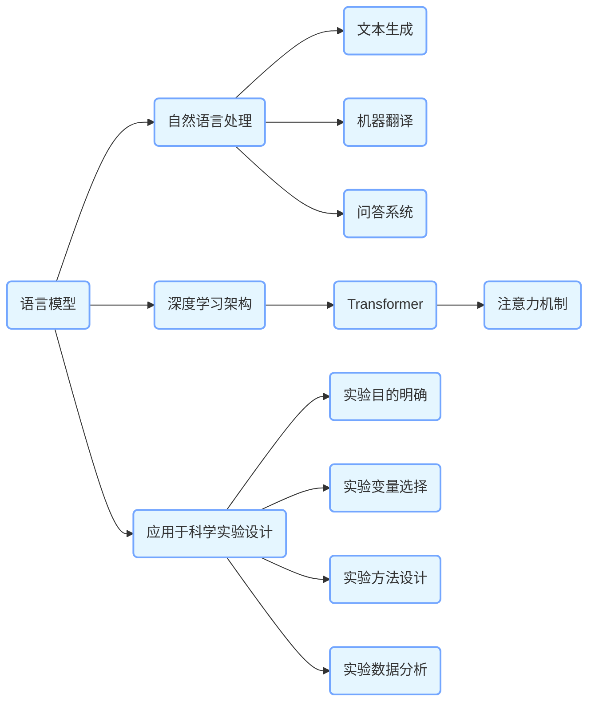

# 语言模型在科学实验设计自动化中的应用

> 关键词：语言模型、科学实验设计、自动化、人工智能、实验优化、数据驱动、机器学习

> 摘要：本文深入探讨了语言模型在科学实验设计自动化领域的应用。首先介绍了相关背景知识，包括研究目的、预期读者、文档结构和术语表等。接着阐述了语言模型与科学实验设计的核心概念及联系，详细讲解了核心算法原理和具体操作步骤，并给出了数学模型和公式。通过项目实战案例展示了代码实现和详细解释，分析了语言模型在实际应用场景中的作用。此外，还推荐了学习资源、开发工具框架以及相关论文著作。最后总结了未来发展趋势与挑战，解答了常见问题并提供了扩展阅读和参考资料，旨在全面剖析语言模型在科学实验设计自动化中的应用，为相关领域的研究和实践提供有价值的参考。

## 1. 背景介绍 
### 1.1 目的和范围
科学实验设计是科研工作的重要环节，传统的实验设计方式往往依赖于研究人员的经验和专业知识，过程繁琐且效率较低。随着人工智能技术的发展，语言模型展现出强大的自然语言处理能力。本研究的目的在于探索如何利用语言模型实现科学实验设计的自动化，提高实验设计的效率和质量。范围涵盖了从基础的概念理解到算法实现，再到实际应用案例分析，以及对未来发展的展望。

### 1.2 预期读者
本文预期读者包括科研工作者、人工智能领域的研究人员、软件开发人员以及对科学实验设计自动化感兴趣的爱好者。对于科研工作者，希望能为其提供利用语言模型改进实验设计的思路和方法；对于人工智能和软件开发人员，可从技术实现的角度获得启发；对于爱好者，能帮助他们了解该领域的前沿动态。

### 1.3 文档结构概述
本文首先介绍相关背景知识，为读者建立基本的认知框架。然后详细阐述语言模型与科学实验设计的核心概念及联系，使读者理解两者之间的内在逻辑。接着讲解核心算法原理和具体操作步骤，并给出数学模型和公式，为技术实现提供理论支持。通过项目实战案例，展示代码实现和详细解释，让读者了解实际应用中的具体操作。分析语言模型在实际应用场景中的作用，使读者明白其应用价值。推荐学习资源、开发工具框架以及相关论文著作，方便读者进一步深入学习。最后总结未来发展趋势与挑战，解答常见问题并提供扩展阅读和参考资料，使读者对整个领域有全面的了解。

### 1.4 术语表
#### 1.4.1 核心术语定义
- **语言模型**：是一种基于概率统计的模型，用于计算语言序列的概率分布，预测下一个可能出现的词或字符。在自然语言处理中，语言模型可以帮助计算机理解和生成自然语言。
- **科学实验设计**：是指为了实现特定的科研目标，对实验的各个环节进行规划和安排，包括实验目的的确定、实验变量的选择、实验方法的设计、实验数据的收集和分析等。
- **自动化**：是指利用计算机技术和人工智能算法，使系统能够自动完成某些任务，减少人工干预，提高效率和准确性。

#### 1.4.2 相关概念解释
- **自然语言处理（NLP）**：是人工智能的一个重要领域，主要研究如何让计算机处理和理解人类语言。语言模型是自然语言处理中的核心技术之一，用于实现文本生成、机器翻译、问答系统等应用。
- **机器学习**：是一门多领域交叉学科，涉及概率论、统计学、逼近论、凸分析、算法复杂度理论等多门学科。它专门研究计算机怎样模拟或实现人类的学习行为，以获取新的知识或技能，重新组织已有的知识结构使之不断改善自身的性能。

#### 1.4.3 缩略词列表
- **NLP**：自然语言处理（Natural Language Processing）
- **ML**：机器学习（Machine Learning）

## 2. 核心概念与联系 

### 语言模型原理
语言模型的核心目标是计算一个句子或文本序列的概率。给定一个词序列 $w_1, w_2, \cdots, w_n$，语言模型要计算 $P(w_1, w_2, \cdots, w_n)$。根据链式法则，$P(w_1, w_2, \cdots, w_n) = P(w_1)P(w_2|w_1)P(w_3|w_1, w_2)\cdots P(w_n|w_1, w_2, \cdots, w_{n - 1})$。

在实际应用中，为了简化计算，常常使用 $n$-gram 模型。$n$-gram 模型假设一个词的出现只依赖于它前面的 $n - 1$ 个词，即 $P(w_i|w_1, w_2, \cdots, w_{i - 1}) \approx P(w_i|w_{i - n + 1}, w_{i - n + 2}, \cdots, w_{i - 1})$。

现代的语言模型，如基于深度学习的 Transformer 架构的模型（如 GPT 系列），通过大量的无监督学习来学习语言的模式和规律。Transformer 架构中的注意力机制能够捕捉文本中不同位置之间的依赖关系，从而提高语言模型的性能。

### 科学实验设计原理
科学实验设计的目的是通过合理的规划和安排，有效地收集数据，以验证假设或发现新知识。实验设计通常包括以下几个关键要素：
- **实验目的**：明确实验要解决的问题或验证的假设。
- **实验变量**：包括自变量、因变量和控制变量。自变量是研究者可以操纵的变量，因变量是需要观察和测量的变量，控制变量是需要保持不变的变量。
- **实验方法**：选择合适的实验方法，如实验设计类型（如完全随机设计、随机区组设计等）、实验步骤和数据收集方法。
- **实验数据的分析**：选择合适的统计方法对实验数据进行分析，以得出结论。

### 语言模型与科学实验设计的联系
语言模型可以在科学实验设计的多个环节发挥作用。在实验目的的明确阶段，语言模型可以帮助研究人员更准确地表达实验目的，将模糊的想法转化为清晰的文本描述。在实验变量的选择方面，语言模型可以根据实验目的和相关领域知识，提供可能的变量建议。在实验方法的设计中，语言模型可以参考已有的实验设计案例，生成合适的实验步骤和数据收集方法。在实验数据的分析阶段，语言模型可以帮助解释数据分析结果，生成清晰的报告。

### 文本示意图
```plaintext
语言模型
|
|-- 自然语言处理
|   |-- 文本生成
|   |-- 机器翻译
|   |-- 问答系统
|
|-- 深度学习架构（如 Transformer）
|   |-- 注意力机制
|
|-- 应用于科学实验设计
    |-- 实验目的明确
    |-- 实验变量选择
    |-- 实验方法设计
    |-- 实验数据分析
```

### Mermaid 流程图


## 3. 核心算法原理 & 具体操作步骤 

### 核心算法原理
我们以一个简单的基于 Python 的语言模型为例，使用 NLTK 库实现一个 $n$-gram 语言模型。$n$-gram 语言模型的基本思想是统计语料库中每个 $n$-gram 出现的频率，然后根据这些频率来计算下一个词的概率。

以下是实现 $n$-gram 语言模型的 Python 代码：
```python
import nltk
from nltk.util import ngrams
from collections import Counter

# 下载必要的语料库
nltk.download('punkt')

def create_ngram_model(text, n):
    # 分词
    tokens = nltk.word_tokenize(text)
    # 生成 n-gram
    ngram_list = list(ngrams(tokens, n))
    # 统计 n-gram 频率
    ngram_freq = Counter(ngram_list)
    return ngram_freq

def predict_next_word(previous_words, ngram_freq, n):
    previous_ngram = tuple(previous_words[-n + 1:])
    possible_next_words = []
    for ngram, freq in ngram_freq.items():
        if ngram[:-1] == previous_ngram:
            possible_next_words.append((ngram[-1], freq))
    # 按频率排序
    possible_next_words.sort(key=lambda x: x[1], reverse=True)
    if possible_next_words:
        return possible_next_words[0][0]
    else:
        return None
```

### 具体操作步骤
1. **数据准备**：收集与科学实验设计相关的文本语料库，如科研论文、实验报告等。将这些文本进行预处理，包括去除标点符号、转换为小写等。
2. **模型训练**：调用 `create_ngram_model` 函数，将预处理后的文本和 $n$ 值作为参数传入，训练 $n$-gram 语言模型。
3. **实验设计辅助**：在进行科学实验设计时，对于需要生成文本的环节，如实验目的描述、实验步骤设计等，将已有的文本作为 `previous_words` 传入 `predict_next_word` 函数，得到下一个可能的词，逐步生成完整的文本。

以下是一个使用示例：
```python
# 示例文本
text = "在科学实验中 我们通常需要明确实验目的 选择合适的实验变量 设计合理的实验方法"
# 训练 3-gram 模型
ngram_freq = create_ngram_model(text, 3)
# 预测下一个词
previous_words = ["在", "科学", "实验"]
next_word = predict_next_word(previous_words, ngram_freq, 3)
print("预测的下一个词是:", next_word)
```

## 4. 数学模型和公式 & 详细讲解 & 举例说明 

### 数学模型和公式
#### 链式法则
在语言模型中，计算一个词序列 $w_1, w_2, \cdots, w_n$ 的概率时，使用链式法则：
$$P(w_1, w_2, \cdots, w_n) = P(w_1)P(w_2|w_1)P(w_3|w_1, w_2)\cdots P(w_n|w_1, w_2, \cdots, w_{n - 1})$$
这个公式的含义是，一个词序列的概率等于第一个词的概率乘以在第一个词出现的条件下第二个词的概率，再乘以在前两个词出现的条件下第三个词的概率，以此类推。

#### $n$-gram 模型
$n$-gram 模型假设一个词的出现只依赖于它前面的 $n - 1$ 个词，即：
$$P(w_i|w_1, w_2, \cdots, w_{i - 1}) \approx P(w_i|w_{i - n + 1}, w_{i - n + 2}, \cdots, w_{i - 1})$$
$n$-gram 的概率可以通过最大似然估计来计算：
$$P(w_i|w_{i - n + 1}, w_{i - n + 2}, \cdots, w_{i - 1}) = \frac{C(w_{i - n + 1}, w_{i - n + 2}, \cdots, w_{i})}{C(w_{i - n + 1}, w_{i - n + 2}, \cdots, w_{i - 1})}$$
其中 $C(\cdot)$ 表示语料库中某个 $n$-gram 或 $(n - 1)$-gram 出现的次数。

### 详细讲解
链式法则是概率论中的基本法则，用于计算多个事件同时发生的概率。在语言模型中，我们将每个词看作一个事件，通过链式法则计算整个词序列的概率。

$n$-gram 模型是对链式法则的一种简化，它假设一个词的出现只与前面的 $n - 1$ 个词有关，而忽略了更前面的词的影响。这种假设在实际应用中可以减少计算复杂度，提高模型的效率。

最大似然估计是一种常用的参数估计方法，用于估计 $n$-gram 的概率。它的基本思想是选择使观察到的语料库出现概率最大的参数值。

### 举例说明
假设我们有一个语料库：["The cat sat on the mat", "The dog chased the cat"]。

#### 计算 2-gram 概率
- 首先统计 2-gram 的出现次数：
  - $C$("The", "cat") = 1
  - $C$("The", "dog") = 1
  - $C$("cat", "sat") = 1
  - $\cdots$
- 然后统计 1-gram 的出现次数：
  - $C$("The") = 2
  - $C$("cat") = 2
  - $\cdots$
- 计算 $P$("cat"|"The")：
  - 根据公式 $P$("cat"|"The") = $\frac{C$("The", "cat")}{C$("The")}$ = $\frac{1}{2}$

## 5. 项目实战：代码实际案例和详细解释说明 

### 5.1  开发环境搭建
1. **安装 Python**：确保你的系统中安装了 Python 3.x 版本。可以从 Python 官方网站（https://www.python.org/downloads/） 下载并安装。
2. **安装必要的库**：使用以下命令安装所需的库：
```bash
pip install nltk
```
3. **下载 NLTK 语料库**：在 Python 中运行以下代码下载必要的语料库：
```python
import nltk
nltk.download('punkt')
```

### 5.2  源代码详细实现和代码解读
以下是一个完整的项目代码示例，用于利用语言模型辅助科学实验设计：
```python
import nltk
from nltk.util import ngrams
from collections import Counter

# 下载必要的语料库
nltk.download('punkt')

def create_ngram_model(text, n):
    """
    训练 n-gram 语言模型
    :param text: 输入的文本
    :param n: n-gram 的阶数
    :return: n-gram 频率统计
    """
    # 分词
    tokens = nltk.word_tokenize(text)
    # 生成 n-gram
    ngram_list = list(ngrams(tokens, n))
    # 统计 n-gram 频率
    ngram_freq = Counter(ngram_list)
    return ngram_freq

def predict_next_word(previous_words, ngram_freq, n):
    """
    预测下一个词
    :param previous_words: 前面的词列表
    :param ngram_freq: n-gram 频率统计
    :param n: n-gram 的阶数
    :return: 预测的下一个词
    """
    previous_ngram = tuple(previous_words[-n + 1:])
    possible_next_words = []
    for ngram, freq in ngram_freq.items():
        if ngram[:-1] == previous_ngram:
            possible_next_words.append((ngram[-1], freq))
    # 按频率排序
    possible_next_words.sort(key=lambda x: x[1], reverse=True)
    if possible_next_words:
        return possible_next_words[0][0]
    else:
        return None

# 示例文本，可替换为实际的科学实验设计相关文本
text = "在科学实验中 我们通常需要明确实验目的 选择合适的实验变量 设计合理的实验方法 收集和分析实验数据 以验证假设"
# 训练 3-gram 模型
ngram_freq = create_ngram_model(text, 3)

# 模拟实验设计过程，生成实验步骤
previous_words = ["在", "科学", "实验"]
experiment_steps = previous_words.copy()
for _ in range(10):
    next_word = predict_next_word(previous_words, ngram_freq, 3)
    if next_word:
        experiment_steps.append(next_word)
        previous_words.append(next_word)
        previous_words = previous_words[-3:]

print("生成的实验步骤:", " ".join(experiment_steps))
```
### 5.3  代码解读与分析
1. **`create_ngram_model` 函数**：
    - 首先使用 `nltk.word_tokenize` 函数对输入的文本进行分词，将文本分割成单个的词。
    - 然后使用 `ngrams` 函数生成 $n$-gram 序列。
    - 最后使用 `Counter` 类统计每个 $n$-gram 出现的频率。
2. **`predict_next_word` 函数**：
    - 提取前面的词列表中的最后 $n - 1$ 个词，组成一个 $(n - 1)$-gram。
    - 遍历 $n$-gram 频率统计，找出所有以该 $(n - 1)$-gram 开头的 $n$-gram。
    - 将这些 $n$-gram 的最后一个词及其频率作为可能的下一个词及其概率。
    - 按频率对可能的下一个词进行排序，返回频率最高的词。
3. **主程序**：
    - 定义示例文本，可替换为实际的科学实验设计相关文本。
    - 训练 3-gram 模型。
    - 模拟实验设计过程，从一个初始的词列表开始，不断预测下一个词，生成实验步骤。

## 6. 实际应用场景 
### 实验目的明确
在科研项目开始时，研究人员可能只有一个模糊的研究方向。语言模型可以帮助他们将这个模糊的方向转化为具体的实验目的描述。例如，研究人员有一个关于“探索某种新型材料的性能”的大致想法，语言模型可以根据相关领域的知识和已有的实验目的描述，生成具体的实验目的，如“在不同温度和压力条件下，测试新型材料的强度、硬度和导电性，以确定其适用范围”。

### 实验变量选择
语言模型可以根据实验目的和相关领域的知识，提供可能的实验变量建议。例如，在研究植物生长的实验中，实验目的是“探究影响植物生长的因素”，语言模型可以建议自变量如光照强度、温度、水分含量等，因变量如植物的高度、叶片数量、生物量等，以及控制变量如土壤类型、肥料种类和用量等。

### 实验方法设计
语言模型可以参考已有的实验设计案例，生成合适的实验步骤和数据收集方法。例如，在化学实验中，对于“合成某种化合物”的实验，语言模型可以生成详细的实验步骤，包括试剂的选择和用量、反应条件的控制、实验装置的搭建等，以及数据收集方法，如测量反应时间、产物的产量和纯度等。

### 实验数据分析
在实验数据收集完成后，语言模型可以帮助解释数据分析结果，生成清晰的报告。例如，对于一组关于药物疗效的实验数据，语言模型可以根据统计分析的结果，生成结论性的描述，如“在本次实验中，药物 A 在降低患者血压方面的效果显著优于药物 B，且副作用发生率较低”，并可以进一步生成对结果的讨论和建议。

## 7. 工具和资源推荐
### 7.1 学习资源推荐
#### 7.1.1 书籍推荐
- 《自然语言处理入门》：这本书系统地介绍了自然语言处理的基本概念、算法和技术，适合初学者入门。
- 《深度学习》：由 Ian Goodfellow、Yoshua Bengio 和 Aaron Courville 所著，是深度学习领域的经典教材，对理解语言模型的深度学习架构有很大帮助。
- 《实验设计与分析》：详细介绍了科学实验设计的原理、方法和统计分析，对于理解科学实验设计的基本理论和实践操作有重要意义。

#### 7.1.2 在线课程
- Coursera 上的“Natural Language Processing Specialization”：由顶尖高校的教授授课，全面介绍自然语言处理的各个方面，包括语言模型的原理和应用。
- edX 上的“Deep Learning for Natural Language Processing”：专注于深度学习在自然语言处理中的应用，深入讲解语言模型的实现和优化。
- 中国大学 MOOC 上的“实验设计与统计分析”：由国内高校的专家讲授，结合实际案例介绍科学实验设计的方法和统计分析技术。

#### 7.1.3 技术博客和网站
- Medium：上面有很多关于自然语言处理和人工智能的技术博客文章，作者来自不同的领域和背景，可以提供不同的视角和思路。
- arXiv.org：是一个预印本服务器，提供了大量的学术论文，包括语言模型和科学实验设计相关的最新研究成果。
- 开源中国：有很多开发者分享的技术文章和项目经验，对于学习和实践有很大的帮助。

### 7.2 开发工具框架推荐
#### 7.2.1 IDE和编辑器
- PyCharm：是一款专业的 Python 集成开发环境，提供了丰富的代码编辑、调试和版本控制功能，适合开发基于 Python 的语言模型和科学实验设计自动化项目。
- Jupyter Notebook：是一个交互式的开发环境，支持多种编程语言，尤其适合进行数据探索、模型训练和结果可视化，方便快速验证想法和进行实验。
- Visual Studio Code：是一款轻量级的代码编辑器，具有丰富的插件生态系统，可以通过安装相关插件来支持 Python 开发和自然语言处理任务。

#### 7.2.2 调试和性能分析工具
- pdb：是 Python 自带的调试器，可以帮助开发者逐行调试代码，查找问题和错误。
- cProfile：是 Python 的性能分析工具，可以分析代码的执行时间和函数调用次数，帮助开发者找出性能瓶颈。
- TensorBoard：是 TensorFlow 提供的可视化工具，可以用于可视化训练过程中的指标变化、模型结构等，方便开发者监控和优化模型。

#### 7.2.3 相关框架和库
- NLTK：是 Python 中常用的自然语言处理库，提供了丰富的语料库、工具和算法，方便进行文本处理、分词、词性标注等任务。
- Transformers：是 Hugging Face 开发的用于自然语言处理的库，提供了预训练的语言模型，如 GPT、BERT 等，可以方便地进行文本生成、问答系统等任务。
- Scikit-learn：是 Python 中常用的机器学习库，提供了各种机器学习算法和工具，可用于实验数据的分析和建模。

### 7.3 相关论文著作推荐
#### 7.3.1 经典论文
- “Attention Is All You Need”：介绍了 Transformer 架构，是现代语言模型的重要基础。
- “A Neural Probabilistic Language Model”：提出了基于神经网络的概率语言模型，为深度学习语言模型的发展奠定了基础。
- “Design and Analysis of Experiments”：是实验设计领域的经典论文，系统地介绍了实验设计的原理和方法。

#### 7.3.2 最新研究成果
- 在 arXiv.org 上搜索“language model in scientific experiment design automation”，可以找到关于语言模型在科学实验设计自动化领域的最新研究论文。
- 相关学术会议，如 ACL（Association for Computational Linguistics）、ICML（International Conference on Machine Learning）等，会发表该领域的最新研究成果。

#### 7.3.3 应用案例分析
- 一些科研机构和企业会发布他们在语言模型应用于科学实验设计自动化方面的成功案例，可以通过他们的官方网站或相关学术期刊获取。
- 开源项目平台，如 GitHub，上也有很多相关的项目和案例，可以参考学习。

## 8. 总结：未来发展趋势与挑战
### 未来发展趋势
- **多模态融合**：未来的语言模型可能会与图像、音频等多模态数据进行融合，以更全面地理解科学实验设计中的信息。例如，在生物实验中，结合显微镜图像和实验步骤文本，提供更准确的实验设计建议。
- **强化学习优化**：利用强化学习算法对语言模型进行优化，使其能够根据实验结果不断调整实验设计方案，提高实验的效率和成功率。
- **跨学科应用**：语言模型在科学实验设计自动化中的应用将越来越广泛，涉及物理、化学、生物、医学等多个学科领域，促进学科之间的交叉融合。

### 挑战
- **数据质量和多样性**：高质量、多样化的训练数据是语言模型性能的关键。科学实验设计涉及多个领域的知识和数据，如何收集、整理和标注这些数据是一个挑战。
- **模型解释性**：语言模型通常是黑盒模型，其决策过程难以解释。在科学实验设计中，需要模型能够提供可解释的建议，以便研究人员理解和信任模型的输出。
- **伦理和法律问题**：语言模型在科学实验设计中的应用可能会涉及伦理和法律问题，如数据隐私、知识产权、实验结果的责任认定等，需要制定相应的规范和准则。

## 9. 附录：常见问题与解答
### 问题 1：语言模型生成的实验设计方案一定可靠吗？
解答：语言模型生成的实验设计方案是基于已有的数据和模式，不能保证一定可靠。它可以提供参考和建议，但最终的实验设计方案还需要研究人员根据专业知识和实际情况进行评估和调整。

### 问题 2：如何选择合适的 $n$ 值来训练 $n$-gram 语言模型？
解答：$n$ 值的选择需要根据具体的应用场景和数据特点来确定。较小的 $n$ 值（如 $n = 2$ 或 $n = 3$）计算复杂度较低，但可能会忽略一些长距离的依赖关系；较大的 $n$ 值可以捕捉更多的上下文信息，但计算复杂度较高，且可能会出现数据稀疏的问题。通常可以通过实验来选择合适的 $n$ 值。

### 问题 3：语言模型在科学实验设计自动化中的应用会取代研究人员吗？
解答：不会。语言模型只是辅助研究人员进行科学实验设计，提供建议和支持。科学实验设计需要研究人员的专业知识、创造力和判断力，语言模型无法完全替代研究人员的作用。

## 10. 扩展阅读 & 参考资料
- Jurafsky, D., & Martin, J. H. (2022). Speech and Language Processing. Pearson.
- Montgomery, D. C. (2017). Design and Analysis of Experiments. Wiley.
- Goodfellow, I., Bengio, Y., & Courville, A. (2016). Deep Learning. MIT Press.
- Hugging Face官方文档：https://huggingface.co/docs
- NLTK官方文档：https://www.nltk.org/
- Scikit-learn官方文档：https://scikit-learn.org/stable/ 