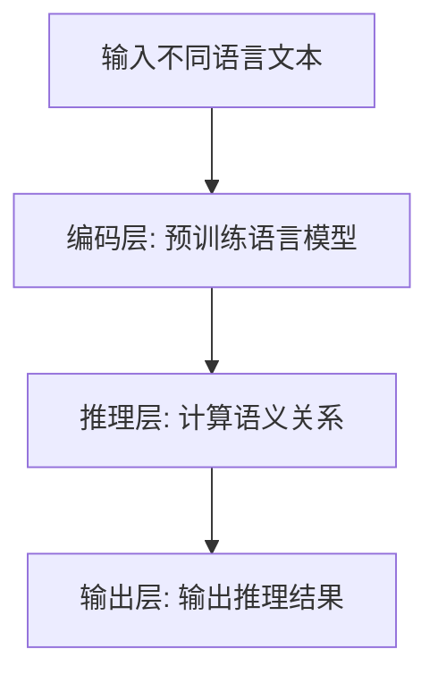

# 语言模型在跨语言推理任务中的表现研究

> 关键词：语言模型、跨语言推理任务、多语言表示、语义理解、推理性能

> 摘要：本文旨在深入研究语言模型在跨语言推理任务中的表现。随着全球化的发展，跨语言交流与理解的需求日益增长，跨语言推理任务变得至关重要。语言模型作为自然语言处理领域的核心技术，其在跨语言推理中的表现影响着众多应用的效果。文章将详细介绍相关背景知识，剖析语言模型在跨语言推理中的核心概念与联系，阐述核心算法原理及具体操作步骤，借助数学模型和公式深入讲解，通过项目实战展示代码案例并进行分析，探讨实际应用场景，推荐相关工具和资源，最后总结未来发展趋势与挑战，为该领域的研究和实践提供全面且深入的参考。

## 1. 背景介绍 
### 1.1 目的和范围
本研究的主要目的是全面评估语言模型在跨语言推理任务中的表现。具体范围包括对不同类型、不同规模的语言模型进行测试和分析，涵盖多种常见的跨语言推理任务，如跨语言问答、跨语言文本蕴含判断等。通过对这些任务的研究，深入了解语言模型在处理跨语言信息时的优势与不足，为进一步改进语言模型和提升跨语言推理能力提供理论和实践依据。

### 1.2 预期读者
本文预期读者包括自然语言处理领域的研究人员、从事跨语言信息处理的工程师、对语言模型和跨语言推理感兴趣的学生以及相关领域的技术爱好者。希望本文能为他们提供有价值的参考，帮助他们深入了解语言模型在跨语言推理任务中的工作机制和性能特点。

### 1.3 文档结构概述
本文首先介绍相关背景知识，包括目的、预期读者和文档结构概述等内容。接着阐述语言模型在跨语言推理中的核心概念与联系，通过文本示意图和 Mermaid 流程图进行直观展示。然后详细讲解核心算法原理及具体操作步骤，使用 Python 源代码进行阐述。之后借助数学模型和公式深入剖析跨语言推理的原理，并举例说明。通过项目实战展示代码案例并进行详细分析，探讨实际应用场景。推荐相关的学习资源、开发工具框架和论文著作。最后总结未来发展趋势与挑战，提供附录解答常见问题，并列出扩展阅读和参考资料。

### 1.4 术语表
#### 1.4.1 核心术语定义
- **语言模型**：一种基于概率统计或深度学习的模型，用于对自然语言文本进行建模，预测文本中下一个词或序列的概率分布。
- **跨语言推理任务**：需要处理不同语言之间的语义关系，进行逻辑推理和判断的任务，如判断两种不同语言的文本是否具有蕴含关系等。
- **多语言表示**：将不同语言的文本表示为统一的向量空间，使得不同语言的语义信息能够在该空间中进行比较和计算。

#### 1.4.2 相关概念解释
- **语义理解**：对文本所表达的语义信息进行理解和分析，包括词汇、句子和篇章的语义。在跨语言推理中，需要准确理解不同语言文本的语义，才能进行有效的推理。
- **推理性能**：指语言模型在跨语言推理任务中正确完成推理的能力，通常用准确率、召回率等指标来衡量。

#### 1.4.3 缩略词列表
- **NLP**：Natural Language Processing，自然语言处理
- **LM**：Language Model，语言模型
- **CLR**：Cross - Language Reasoning，跨语言推理

## 2. 核心概念与联系 

### 核心概念原理
语言模型在跨语言推理任务中的核心在于实现多语言的语义理解和推理。语言模型首先需要将不同语言的文本进行编码，将其转换为向量表示。这个过程通常基于深度学习中的神经网络，如 Transformer 架构。通过预训练，语言模型学习到不同语言的词汇、语法和语义信息，从而能够将文本映射到一个统一的向量空间中。

在这个向量空间中，不同语言的语义相近的文本会具有相似的向量表示。这样，当进行跨语言推理任务时，就可以通过比较不同语言文本的向量表示来判断它们之间的语义关系，如蕴含关系、矛盾关系等。

### 架构的文本示意图
语言模型在跨语言推理中的架构可以分为以下几个主要部分：

1. **输入层**：接收不同语言的文本作为输入。
2. **编码层**：使用预训练的语言模型（如 BERT 多语言版本）将输入的文本转换为向量表示。
3. **推理层**：根据编码后的向量表示，进行推理计算，判断文本之间的关系。
4. **输出层**：输出推理结果，如蕴含、矛盾或中性等标签。

### Mermaid 流程图


## 3. 核心算法原理 & 具体操作步骤 

### 核心算法原理
在跨语言推理中，常用的算法基于预训练的语言模型，如 BERT 多语言版本。BERT 模型通过自注意力机制学习文本的上下文信息，能够捕捉到文本中的语义和语法结构。

具体来说，BERT 模型的输入是一系列的词元（tokens），经过嵌入层将词元转换为词向量，然后通过多层的 Transformer 编码器进行特征提取。最终得到的输出是每个词元的上下文表示。

在跨语言推理任务中，将不同语言的文本分别输入到 BERT 模型中，得到它们的向量表示。然后，可以使用一个分类器（如全连接层）对这些向量表示进行处理，判断它们之间的关系。

### 具体操作步骤

#### 步骤 1：数据预处理
将不同语言的文本数据进行清洗和分词，将其转换为 BERT 模型能够处理的格式。

```python
import torch
from transformers import BertTokenizer

# 加载 BERT 多语言分词器
tokenizer = BertTokenizer.from_pretrained('bert-base-multilingual-cased')

# 示例文本
text1 = "This is a sample sentence."
text2 = "这是一个示例句子。"

# 分词
tokens1 = tokenizer.tokenize(text1)
tokens2 = tokenizer.tokenize(text2)

# 转换为词元 ID
input_ids1 = tokenizer.convert_tokens_to_ids(tokens1)
input_ids2 = tokenizer.convert_tokens_to_ids(tokens2)

# 添加特殊标记
input_ids1 = [tokenizer.cls_token_id] + input_ids1 + [tokenizer.sep_token_id]
input_ids2 = [tokenizer.cls_token_id] + input_ids2 + [tokenizer.sep_token_id]

# 转换为 PyTorch 张量
input_tensor1 = torch.tensor([input_ids1])
input_tensor2 = torch.tensor([input_ids2])
```

#### 步骤 2：加载预训练模型
加载 BERT 多语言预训练模型。

```python
from transformers import BertModel

# 加载 BERT 多语言模型
model = BertModel.from_pretrained('bert-base-multilingual-cased')
```

#### 步骤 3：获取文本的向量表示
将输入的文本张量输入到 BERT 模型中，获取文本的向量表示。

```python
# 前向传播
with torch.no_grad():
    outputs1 = model(input_tensor1)
    outputs2 = model(input_tensor2)

# 获取 [CLS] 标记的向量表示
embedding1 = outputs1.last_hidden_state[:, 0, :]
embedding2 = outputs2.last_hidden_state[:, 0, :]
```

#### 步骤 4：构建分类器进行推理
构建一个简单的分类器，对文本的向量表示进行处理，判断它们之间的关系。

```python
import torch.nn as nn

# 定义分类器
class Classifier(nn.Module):
    def __init__(self, input_dim, num_classes):
        super(Classifier, self).__init__()
        self.fc = nn.Linear(input_dim, num_classes)

    def forward(self, x):
        return self.fc(x)

# 初始化分类器
input_dim = embedding1.shape[1]
num_classes = 3  # 例如，蕴含、矛盾、中性
classifier = Classifier(input_dim, num_classes)

# 拼接向量
combined_embedding = torch.cat((embedding1, embedding2), dim=1)

# 进行推理
logits = classifier(combined_embedding)
```

## 4. 数学模型和公式 & 详细讲解 & 举例说明 

### 数学模型和公式
在跨语言推理中，主要涉及到以下几个数学模型和公式：

#### 词元嵌入
假设输入的词元序列为 $x = [x_1, x_2, \cdots, x_n]$，其中 $x_i$ 表示第 $i$ 个词元。词元嵌入层将每个词元映射到一个低维向量空间中，得到词向量 $e_i$。词元嵌入的公式可以表示为：

$$e_i = E(x_i)$$

其中 $E$ 是词元嵌入矩阵。

#### Transformer 编码器
Transformer 编码器由多个多头自注意力层和前馈神经网络层组成。多头自注意力层的输出可以表示为：

$$\text{MultiHead}(Q, K, V) = \text{Concat}(\text{head}_1, \cdots, \text{head}_h)W^O$$

其中 $\text{head}_i = \text{Attention}(QW_i^Q, KW_i^K, VW_i^V)$，$\text{Attention}(Q, K, V) = \text{softmax}(\frac{QK^T}{\sqrt{d_k}})V$，$Q$、$K$、$V$ 分别是查询、键和值矩阵，$W_i^Q$、$W_i^K$、$W_i^V$ 和 $W^O$ 是可学习的权重矩阵，$d_k$ 是键向量的维度。

#### 分类器
分类器通常是一个全连接层，其输出可以表示为：

$$\text{logits} = W_f \cdot h + b_f$$

其中 $W_f$ 是全连接层的权重矩阵，$h$ 是输入的特征向量，$b_f$ 是偏置向量。

### 详细讲解
词元嵌入层的作用是将离散的词元转换为连续的向量表示，使得模型能够处理文本数据。Transformer 编码器通过多头自注意力机制，能够捕捉到文本中不同位置之间的依赖关系，从而学习到文本的上下文信息。分类器则根据文本的特征向量，输出不同类别的得分，通过 softmax 函数可以将得分转换为概率分布。

### 举例说明
假设我们有两个句子：“The cat is on the mat.” 和 “猫在垫子上。”。首先，将这两个句子进行分词和词元嵌入，得到每个词元的向量表示。然后，将这些向量输入到 Transformer 编码器中，经过多层的处理，得到句子的上下文表示。最后，将这两个句子的上下文表示输入到分类器中，得到它们之间关系的得分。如果得分最高的类别是“蕴含”，则表示这两个句子在语义上具有蕴含关系。

## 5. 项目实战：代码实际案例和详细解释说明 

### 5.1  开发环境搭建
#### 安装 Python
首先，确保你已经安装了 Python 3.6 或更高版本。可以从 Python 官方网站（https://www.python.org/downloads/） 下载并安装。

#### 安装依赖库
使用 pip 安装所需的依赖库，包括 `transformers`、`torch` 等。

```bash
pip install transformers torch
```

### 5.2  源代码详细实现和代码解读
```python
import torch
from transformers import BertTokenizer, BertModel
import torch.nn as nn

# 加载 BERT 多语言分词器
tokenizer = BertTokenizer.from_pretrained('bert-base-multilingual-cased')

# 加载 BERT 多语言模型
model = BertModel.from_pretrained('bert-base-multilingual-cased')

# 定义分类器
class Classifier(nn.Module):
    def __init__(self, input_dim, num_classes):
        super(Classifier, self).__init__()
        self.fc = nn.Linear(input_dim, num_classes)

    def forward(self, x):
        return self.fc(x)

# 示例文本
text1 = "This is a sample sentence."
text2 = "这是一个示例句子。"

# 分词
tokens1 = tokenizer.tokenize(text1)
tokens2 = tokenizer.tokenize(text2)

# 转换为词元 ID
input_ids1 = tokenizer.convert_tokens_to_ids(tokens1)
input_ids2 = tokenizer.convert_tokens_to_ids(tokens2)

# 添加特殊标记
input_ids1 = [tokenizer.cls_token_id] + input_ids1 + [tokenizer.sep_token_id]
input_ids2 = [tokenizer.cls_token_id] + input_ids2 + [tokenizer.sep_token_id]

# 转换为 PyTorch 张量
input_tensor1 = torch.tensor([input_ids1])
input_tensor2 = torch.tensor([input_ids2])

# 前向传播
with torch.no_grad():
    outputs1 = model(input_tensor1)
    outputs2 = model(input_tensor2)

# 获取 [CLS] 标记的向量表示
embedding1 = outputs1.last_hidden_state[:, 0, :]
embedding2 = outputs2.last_hidden_state[:, 0, :]

# 拼接向量
combined_embedding = torch.cat((embedding1, embedding2), dim=1)

# 初始化分类器
input_dim = combined_embedding.shape[1]
num_classes = 3  # 例如，蕴含、矛盾、中性
classifier = Classifier(input_dim, num_classes)

# 进行推理
logits = classifier(combined_embedding)

# 输出结果
print("推理得分:", logits)
```

### 5.3  代码解读与分析
- **分词和词元 ID 转换**：使用 `BertTokenizer` 对输入的文本进行分词，并将分词结果转换为词元 ID。添加特殊标记（如 `[CLS]` 和 `[SEP]`）是为了让 BERT 模型能够正确处理句子。
- **加载预训练模型**：使用 `BertModel.from_pretrained` 加载 BERT 多语言预训练模型。
- **获取向量表示**：将输入的文本张量输入到 BERT 模型中，通过 `last_hidden_state` 获取每个词元的上下文表示，取 `[CLS]` 标记的向量作为句子的表示。
- **分类器**：定义一个简单的全连接层作为分类器，对拼接后的向量进行处理，输出不同类别的得分。
- **推理**：将拼接后的向量输入到分类器中，得到推理得分。

## 6. 实际应用场景 
### 跨语言问答系统
在跨语言问答系统中，用户可能使用不同的语言提出问题，系统需要从不同语言的知识库中寻找答案。语言模型在跨语言推理中的表现直接影响到系统能否准确理解用户问题的语义，并找到相关的答案。例如，一个国际旅游问答系统，用户可能用英语、中文、法语等不同语言询问旅游景点、交通等信息，系统需要能够处理这些不同语言的问题，并进行有效的推理和回答。

### 跨语言文本蕴含判断
在信息检索和文本分析中，经常需要判断不同语言的文本之间是否具有蕴含关系。例如，在跨国新闻报道中，需要判断不同语言的新闻文本是否表达了相同或相关的事件。语言模型可以帮助进行跨语言文本蕴含判断，提高信息检索的准确性和效率。

### 机器翻译辅助
在机器翻译过程中，语言模型的跨语言推理能力可以用于辅助翻译。例如，通过推理源语言和目标语言文本之间的语义关系，选择更合适的翻译策略和词汇，提高翻译的质量。

## 7. 工具和资源推荐
### 7.1 学习资源推荐
#### 7.1.1 书籍推荐
- 《自然语言处理入门》：介绍了自然语言处理的基本概念和方法，适合初学者。
- 《深度学习》：全面介绍了深度学习的理论和实践，包括神经网络、卷积神经网络、循环神经网络等，对理解语言模型的原理有很大帮助。
- 《Speech and Language Processing》：经典的自然语言处理教材，涵盖了语言模型、机器翻译、信息检索等多个领域的内容。

#### 7.1.2 在线课程
- Coursera 上的“Natural Language Processing Specialization”：由斯坦福大学教授授课，系统介绍了自然语言处理的各个方面。
- edX 上的“Deep Learning for Natural Language Processing”：深入讲解了深度学习在自然语言处理中的应用，包括语言模型、文本分类等。

#### 7.1.3 技术博客和网站
- Hugging Face Blog：提供了关于语言模型和自然语言处理的最新研究成果和技术文章。
- arXiv.org：一个预印本服务器，包含了大量关于自然语言处理和语言模型的研究论文。

### 7.2 开发工具框架推荐
#### 7.2.1 IDE和编辑器
- PyCharm：功能强大的 Python 集成开发环境，提供了代码编辑、调试、版本控制等功能。
- Visual Studio Code：轻量级的代码编辑器，支持多种编程语言，有丰富的插件可以扩展功能。

#### 7.2.2 调试和性能分析工具
- TensorBoard：用于可视化深度学习模型的训练过程和性能指标。
- PyTorch Profiler：可以帮助分析 PyTorch 模型的性能瓶颈，优化代码。

#### 7.2.3 相关框架和库
- Transformers：由 Hugging Face 开发的库，提供了多种预训练的语言模型，方便进行自然语言处理任务。
- PyTorch：一个开源的深度学习框架，广泛应用于自然语言处理领域。

### 7.3 相关论文著作推荐
#### 7.3.1 经典论文
- “BERT: Pre-training of Deep Bidirectional Transformers for Language Understanding”：介绍了 BERT 模型的原理和训练方法，是自然语言处理领域的经典论文。
- “Attention Is All You Need”：提出了 Transformer 架构，为语言模型的发展奠定了基础。

#### 7.3.2 最新研究成果
- 关注 ACL（Association for Computational Linguistics）、EMNLP（Conference on Empirical Methods in Natural Language Processing）等自然语言处理领域的顶级会议，获取最新的研究成果。

#### 7.3.3 应用案例分析
- 一些知名科技公司的技术博客会分享他们在跨语言推理和自然语言处理方面的应用案例，可以从中学习到实际应用中的经验和技巧。

## 8. 总结：未来发展趋势与挑战
### 未来发展趋势
- **多模态融合**：未来的语言模型可能会融合图像、音频等多模态信息，进一步提高跨语言推理的能力。例如，在处理跨语言的旅游信息时，可以结合图片和文字信息，更全面地理解和推理。
- **知识增强**：将外部知识图谱等知识资源融入语言模型中，增强语言模型的语义理解和推理能力。这样可以更好地处理一些需要专业知识的跨语言推理任务。
- **个性化定制**：根据不同用户的需求和语言习惯，定制个性化的语言模型，提高跨语言推理的准确性和用户体验。

### 挑战
- **语言多样性**：世界上存在着众多的语言和方言，每种语言都有其独特的语法、词汇和语义特点。语言模型要处理如此丰富的语言多样性，面临着巨大的挑战。
- **语义鸿沟**：不同语言之间存在着语义鸿沟，即使是相同的概念，在不同语言中的表达方式也可能不同。如何准确地跨越语义鸿沟，进行有效的跨语言推理，是一个亟待解决的问题。
- **数据稀缺**：对于一些小语种和特定领域的语言数据，可能存在数据稀缺的问题。这会影响语言模型的训练效果，导致在处理这些语言和领域的跨语言推理任务时性能下降。

## 9. 附录：常见问题与解答
### 问题 1：语言模型在跨语言推理任务中，对不同语言的处理效果是否相同？
解答：不同语言的处理效果可能不同。这与语言的复杂程度、数据的丰富程度等因素有关。一般来说，数据丰富、语法结构相对简单的语言，语言模型的处理效果可能会更好。

### 问题 2：如何提高语言模型在跨语言推理任务中的性能？
解答：可以从以下几个方面入手：使用更多的训练数据，特别是多语言的平行语料；采用更先进的模型架构和训练方法；融合外部知识资源等。

### 问题 3：跨语言推理任务中，如何处理语言的文化差异？
解答：目前还没有完全有效的方法。可以通过引入文化知识图谱、进行文化特征分析等方式，尝试在一定程度上处理文化差异。但这仍然是一个具有挑战性的问题，需要进一步的研究和探索。

## 10. 扩展阅读 & 参考资料
### 扩展阅读
- 《Advances in Neural Information Processing Systems》（NeurIPS）会议论文集中关于自然语言处理和语言模型的相关论文。
- 《Journal of Artificial Intelligence Research》等人工智能领域的学术期刊上的相关研究。

### 参考资料
- Hugging Face 官方文档：https://huggingface.co/docs
- PyTorch 官方文档：https://pytorch.org/docs/stable/index.html
- 相关学术论文和研究报告。