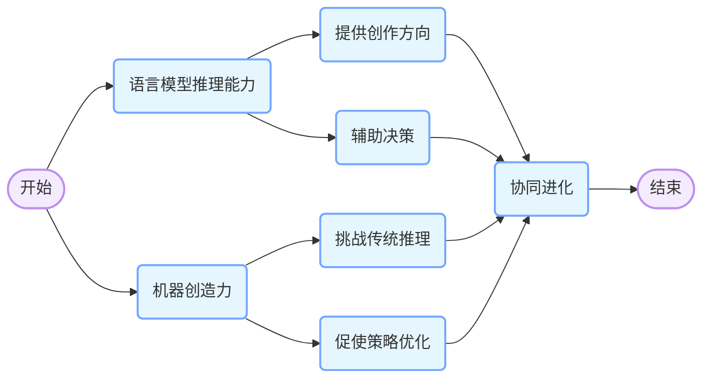

# 语言模型推理能力与机器创造力的协同进化

> 关键词：语言模型、推理能力、机器创造力、协同进化、人工智能

> 摘要：本文聚焦于语言模型推理能力与机器创造力的协同进化这一前沿话题。首先介绍了研究此课题的背景、目的、预期读者等内容。接着详细阐述了语言模型推理能力和机器创造力的核心概念及其联系，包括原理和架构的示意图与流程图。深入讲解了相关的核心算法原理，并给出Python源代码示例。通过数学模型和公式对其进行理论剖析，辅以具体例子说明。结合项目实战，展示代码实现并进行详细解读。探讨了语言模型推理能力与机器创造力协同进化在多个领域的实际应用场景。推荐了学习资源、开发工具框架以及相关论文著作。最后总结未来发展趋势与挑战，解答常见问题，并提供扩展阅读与参考资料，旨在全面深入地探讨这一领域，为相关研究和实践提供有价值的参考。

## 1. 背景介绍 
### 1.1 目的和范围
语言模型在自然语言处理领域取得了显著进展，其推理能力不断提升，而机器创造力也逐渐成为人工智能领域的重要研究方向。本研究的目的在于深入探讨语言模型推理能力与机器创造力之间的协同进化关系，揭示两者相互促进、相互影响的内在机制。范围涵盖了从理论层面的概念阐述、算法原理分析，到实践层面的项目实战、实际应用场景探索，力求全面且系统地研究这一前沿课题。

### 1.2 预期读者
本文预期读者包括人工智能领域的研究人员、开发者、学者，以及对语言模型、机器创造力等相关技术感兴趣的爱好者。无论是希望深入了解理论知识的专业人士，还是想要学习实践技能的初学者，都能从本文中获取有价值的信息。

### 1.3 文档结构概述
本文将按照以下结构展开：首先介绍背景信息，包括目的、预期读者和文档结构概述等。接着阐述语言模型推理能力与机器创造力的核心概念及其联系，通过示意图和流程图进行直观展示。然后深入讲解核心算法原理，给出Python源代码示例。运用数学模型和公式对其进行理论分析，并举例说明。结合项目实战，展示代码实现和详细解读。探讨实际应用场景，推荐学习资源、开发工具框架和相关论文著作。最后总结未来发展趋势与挑战，解答常见问题，并提供扩展阅读与参考资料。

### 1.4 术语表
#### 1.4.1 核心术语定义
- **语言模型**：是一种对自然语言进行建模的概率模型，用于预测文本序列中每个词出现的概率，常见的有基于统计的语言模型和基于深度学习的语言模型。
- **推理能力**：指语言模型根据给定的输入信息，运用逻辑规则、知识储备等进行分析、判断和得出结论的能力。
- **机器创造力**：是指机器能够产生新颖、有价值的想法、作品或解决方案的能力，涉及到对知识的创新运用和突破常规的思考。
- **协同进化**：指语言模型推理能力和机器创造力在相互作用、相互影响的过程中共同发展、不断提升的现象。

#### 1.4.2 相关概念解释
- **自然语言处理**：是人工智能的一个重要分支，旨在让计算机理解、处理和生成人类语言，语言模型是自然语言处理中的关键技术之一。
- **深度学习**：是一种基于人工神经网络的机器学习方法，在语言模型的发展中起到了至关重要的作用，通过大量数据的训练可以学习到语言的复杂模式。

#### 1.4.3 缩略词列表
- **NLP**：Natural Language Processing，自然语言处理
- **DNN**：Deep Neural Network，深度神经网络
- **RNN**：Recurrent Neural Network，循环神经网络
- **LSTM**：Long Short - Term Memory，长短期记忆网络
- **GPT**：Generative Pretrained Transformer，生成式预训练变压器

## 2. 核心概念与联系 
### 2.1 语言模型推理能力
语言模型的推理能力是其在自然语言处理任务中至关重要的能力之一。从原理上来说，基于深度学习的语言模型通常通过大规模语料库的训练来学习语言的模式和规律。例如，Transformer架构的语言模型，通过自注意力机制捕捉文本中不同位置之间的依赖关系，从而能够理解文本的语义信息。

在进行推理时，语言模型会根据输入的文本，结合自身学习到的知识，预测后续可能出现的文本内容。以问答系统为例，当用户提出一个问题时，语言模型会对问题进行分析，提取关键信息，然后在其知识储备中寻找相关的答案，并生成合理的回答。

### 2.2 机器创造力
机器创造力是指机器能够突破常规，产生新颖、有价值的想法或作品的能力。从原理上看，机器创造力的实现往往依赖于对大量数据的学习和分析，以及对算法的巧妙设计。例如，在艺术创作领域，机器可以通过学习大量的艺术作品，掌握不同的风格和表现手法，然后运用这些知识进行创新创作。

机器创造力的实现还涉及到对随机因素的引入和对搜索空间的探索。通过在一定范围内随机调整参数或进行搜索，机器可以尝试不同的创作路径，从而产生多样化的结果。

### 2.3 两者的联系
语言模型的推理能力为机器创造力提供了基础。强大的推理能力使得机器能够更好地理解问题的背景和要求，从而在创作过程中做出合理的决策。例如，在故事创作中，语言模型的推理能力可以帮助机器理解故事的主题、情节发展逻辑等，为创造力的发挥提供方向。

反过来，机器创造力也可以促进语言模型推理能力的提升。在创造新颖的作品或解决方案的过程中，机器可能会遇到一些传统推理方法无法解决的问题，这就促使语言模型不断优化和扩展其推理策略，从而提高推理能力。

### 2.4 核心概念原理和架构的文本示意图
```plaintext
语言模型推理能力
|-- 数据输入（文本）
|   |-- 预处理（分词、词嵌入等）
|-- 模型架构（如Transformer）
|   |-- 自注意力机制
|   |-- 前馈神经网络
|-- 推理过程
|   |-- 语义理解
|   |-- 知识匹配
|   |-- 结果生成

机器创造力
|-- 数据学习（大量作品数据）
|   |-- 特征提取
|-- 创新机制
|   |-- 随机因素引入
|   |-- 搜索空间探索
|-- 创作过程
|   |-- 风格选择
|   |-- 内容生成

协同进化
|-- 推理能力促进创造力
|   |-- 提供创作方向
|   |-- 辅助决策
|-- 创造力提升推理能力
|   |-- 挑战传统推理
|   |-- 促使策略优化
```

### 2.5 Mermaid流程图


## 3. 核心算法原理 & 具体操作步骤 
### 3.1 语言模型推理算法原理
以基于Transformer架构的语言模型为例，其核心算法原理主要包括自注意力机制和前馈神经网络。

自注意力机制允许模型在处理每个位置的输入时，考虑到整个输入序列的信息。其计算过程如下：
1. 对于输入序列中的每个词，将其嵌入向量分别与三个可学习的矩阵 $W^Q$、$W^K$ 和 $W^V$ 相乘，得到查询向量 $Q$、键向量 $K$ 和值向量 $V$。
2. 计算查询向量和键向量之间的点积，得到注意力分数。
3. 对注意力分数进行缩放和softmax操作，得到注意力权重。
4. 将注意力权重与值向量相乘并求和，得到加权和，作为该位置的输出。

前馈神经网络则是对自注意力机制的输出进行非线性变换，进一步提取特征。

### 3.2 Python源代码示例
```python
import torch
import torch.nn as nn
import torch.nn.functional as F

class SelfAttention(nn.Module):
    def __init__(self, input_dim, d_k):
        super(SelfAttention, self).__init__()
        self.W_q = nn.Linear(input_dim, d_k)
        self.W_k = nn.Linear(input_dim, d_k)
        self.W_v = nn.Linear(input_dim, d_k)

    def forward(self, x):
        Q = self.W_q(x)
        K = self.W_k(x)
        V = self.W_v(x)

        scores = torch.matmul(Q, K.transpose(-2, -1)) / torch.sqrt(torch.tensor(Q.size(-1), dtype=torch.float32))
        attention_weights = F.softmax(scores, dim=-1)
        output = torch.matmul(attention_weights, V)
        return output

class TransformerLayer(nn.Module):
    def __init__(self, input_dim, d_k):
        super(TransformerLayer, self).__init__()
        self.self_attention = SelfAttention(input_dim, d_k)
        self.feed_forward = nn.Sequential(
            nn.Linear(input_dim, 4 * input_dim),
            nn.ReLU(),
            nn.Linear(4 * input_dim, input_dim)
        )
        self.norm1 = nn.LayerNorm(input_dim)
        self.norm2 = nn.LayerNorm(input_dim)

    def forward(self, x):
        attn_output = self.self_attention(x)
        x = self.norm1(x + attn_output)
        ff_output = self.feed_forward(x)
        x = self.norm2(x + ff_output)
        return x
```

### 3.3 机器创造力算法原理
机器创造力的算法通常涉及到生成式模型，如生成对抗网络（GAN）或变分自编码器（VAE）。以GAN为例，其由生成器和判别器两个部分组成。

生成器的作用是从随机噪声中生成样本，而判别器的任务是区分生成的样本和真实样本。在训练过程中，生成器和判别器相互对抗，不断优化自身的性能。生成器通过学习如何生成更逼真的样本，来欺骗判别器，而判别器则通过学习如何更准确地识别真实样本和生成样本，来提高自身的判别能力。

### 3.4 Python源代码示例
```python
import torch
import torch.nn as nn
import torch.optim as optim

# 生成器
class Generator(nn.Module):
    def __init__(self, input_dim, output_dim):
        super(Generator, self).__init__()
        self.model = nn.Sequential(
            nn.Linear(input_dim, 128),
            nn.LeakyReLU(0.2),
            nn.Linear(128, 256),
            nn.BatchNorm1d(256),
            nn.LeakyReLU(0.2),
            nn.Linear(256, 512),
            nn.BatchNorm1d(512),
            nn.LeakyReLU(0.2),
            nn.Linear(512, output_dim),
            nn.Tanh()
        )

    def forward(self, x):
        return self.model(x)

# 判别器
class Discriminator(nn.Module):
    def __init__(self, input_dim):
        super(Discriminator, self).__init__()
        self.model = nn.Sequential(
            nn.Linear(input_dim, 512),
            nn.LeakyReLU(0.2),
            nn.Linear(512, 256),
            nn.LeakyReLU(0.2),
            nn.Linear(256, 1),
            nn.Sigmoid()
        )

    def forward(self, x):
        return self.model(x)

# 训练过程
def train_gan():
    input_dim = 100
    output_dim = 784
    batch_size = 32
    num_epochs = 100

    generator = Generator(input_dim, output_dim)
    discriminator = Discriminator(output_dim)

    criterion = nn.BCELoss()
    g_optimizer = optim.Adam(generator.parameters(), lr=0.0002)
    d_optimizer = optim.Adam(discriminator.parameters(), lr=0.0002)

    for epoch in range(num_epochs):
        # 训练判别器
        discriminator.zero_grad()
        real_data = torch.randn(batch_size, output_dim)
        real_labels = torch.ones(batch_size, 1)
        fake_labels = torch.zeros(batch_size, 1)

        real_output = discriminator(real_data)
        d_real_loss = criterion(real_output, real_labels)

        noise = torch.randn(batch_size, input_dim)
        fake_data = generator(noise)
        fake_output = discriminator(fake_data.detach())
        d_fake_loss = criterion(fake_output, fake_labels)

        d_loss = d_real_loss + d_fake_loss
        d_loss.backward()
        d_optimizer.step()

        # 训练生成器
        generator.zero_grad()
        fake_output = discriminator(fake_data)
        g_loss = criterion(fake_output, real_labels)
        g_loss.backward()
        g_optimizer.step()

        if epoch % 10 == 0:
            print(f'Epoch {epoch}: D Loss: {d_loss.item()}, G Loss: {g_loss.item()}')
```

### 3.5 具体操作步骤
1. **数据准备**：对于语言模型推理，需要准备大规模的文本语料库进行训练；对于机器创造力，根据具体任务准备相应的数据集，如图像数据集、音乐数据集等。
2. **模型定义**：按照上述算法原理，使用Python和深度学习框架（如PyTorch）定义语言模型和机器创造力模型。
3. **模型训练**：使用准备好的数据对模型进行训练，调整模型的参数，使其达到较好的性能。
4. **推理和创作**：在训练完成后，使用训练好的模型进行推理任务和创作任务，如问答系统的回答生成、艺术作品的创作等。

## 4. 数学模型和公式 & 详细讲解 & 举例说明 
### 4.1 语言模型推理的数学模型和公式
#### 4.1.1 自注意力机制公式
自注意力机制的核心计算过程可以用以下公式表示：

设输入序列为 $X = [x_1, x_2, \cdots, x_n]$，其中 $x_i \in \mathbb{R}^d$ 是第 $i$ 个词的嵌入向量。

查询向量 $Q$、键向量 $K$ 和值向量 $V$ 的计算如下：
$$Q = XW^Q$$
$$K = XW^K$$
$$V = XW^V$$

其中 $W^Q \in \mathbb{R}^{d \times d_k}$，$W^K \in \mathbb{R}^{d \times d_k}$，$W^V \in \mathbb{R}^{d \times d_k}$ 是可学习的矩阵。

注意力分数 $S$ 的计算为：
$$S = \frac{QK^T}{\sqrt{d_k}}$$

注意力权重 $A$ 通过对注意力分数进行softmax操作得到：
$$A = \text{softmax}(S)$$

最终的输出 $O$ 为：
$$O = AV$$

#### 4.1.2 详细讲解
自注意力机制的核心思想是通过计算每个词与其他词之间的相关性，来动态地分配权重，从而更好地捕捉文本中的依赖关系。通过查询向量和键向量的点积，得到每个词与其他词之间的相似度分数，然后通过softmax操作将这些分数转化为权重。最后，将这些权重与值向量相乘并求和，得到每个词的加权表示。

#### 4.1.3 举例说明
假设输入序列为 $X = [\begin{bmatrix}1\\2\\3\end{bmatrix}, \begin{bmatrix}4\\5\\6\end{bmatrix}]$，$d = 3$，$d_k = 2$。

$W^Q = \begin{bmatrix}0.1 & 0.2\\0.3 & 0.4\\0.5 & 0.6\end{bmatrix}$，$W^K = \begin{bmatrix}0.7 & 0.8\\0.9 & 1.0\\1.1 & 1.2\end{bmatrix}$，$W^V = \begin{bmatrix}1.3 & 1.4\\1.5 & 1.6\\1.7 & 1.8\end{bmatrix}$。

计算查询向量 $Q$：
$$Q = XW^Q = \begin{bmatrix}1 & 2 & 3\\4 & 5 & 6\end{bmatrix}\begin{bmatrix}0.1 & 0.2\\0.3 & 0.4\\0.5 & 0.6\end{bmatrix} = \begin{bmatrix}2.2 & 2.8\\5.2 & 6.4\end{bmatrix}$$

计算键向量 $K$：
$$K = XW^K = \begin{bmatrix}1 & 2 & 3\\4 & 5 & 6\end{bmatrix}\begin{bmatrix}0.7 & 0.8\\0.9 & 1.0\\1.1 & 1.2\end{bmatrix} = \begin{bmatrix}5.8 & 6.4\\13.6 & 14.8\end{bmatrix}$$

计算注意力分数 $S$：
$$S = \frac{QK^T}{\sqrt{d_k}} = \frac{1}{\sqrt{2}}\begin{bmatrix}2.2 & 2.8\\5.2 & 6.4\end{bmatrix}\begin{bmatrix}5.8 & 13.6\\6.4 & 14.8\end{bmatrix} = \frac{1}{\sqrt{2}}\begin{bmatrix}32.44 & 76.8\\73.44 & 173.12\end{bmatrix}$$

计算注意力权重 $A$：
$$A = \text{softmax}(S) = \begin{bmatrix}e^{32.44/\sqrt{2}}/(e^{32.44/\sqrt{2}} + e^{76.8/\sqrt{2}}) & e^{76.8/\sqrt{2}}/(e^{32.44/\sqrt{2}} + e^{76.8/\sqrt{2}})\\e^{73.44/\sqrt{2}}/(e^{73.44/\sqrt{2}} + e^{173.12/\sqrt{2}}) & e^{173.12/\sqrt{2}}/(e^{73.44/\sqrt{2}} + e^{173.12/\sqrt{2}})\end{bmatrix}$$

计算值向量 $V$：
$$V = XW^V = \begin{bmatrix}1 & 2 & 3\\4 & 5 & 6\end{bmatrix}\begin{bmatrix}1.3 & 1.4\\1.5 & 1.6\\1.7 & 1.8\end{bmatrix} = \begin{bmatrix}9.4 & 10\\22.6 & 24.4\end{bmatrix}$$

最终输出 $O$：
$$O = AV$$

### 4.2 机器创造力的数学模型和公式
#### 4.2.1 GAN的目标函数
在GAN中，生成器 $G$ 和判别器 $D$ 的目标函数可以表示为：

$$\min_G \max_D V(D, G) = \mathbb{E}_{x \sim p_{data}(x)}[\log D(x)] + \mathbb{E}_{z \sim p_z(z)}[\log(1 - D(G(z)))]$$

其中 $p_{data}(x)$ 是真实数据的分布，$p_z(z)$ 是噪声的分布。

#### 4.2.2 详细讲解
GAN的目标是找到一个生成器 $G$ 和一个判别器 $D$，使得判别器 $D$ 能够尽可能准确地判断一个样本是真实样本还是生成样本，而生成器 $G$ 能够尽可能生成逼真的样本，使得判别器 $D$ 无法区分。目标函数中的第一项 $\mathbb{E}_{x \sim p_{data}(x)}[\log D(x)]$ 表示判别器对真实样本的正确判断的期望，第二项 $\mathbb{E}_{z \sim p_z(z)}[\log(1 - D(G(z)))]$ 表示判别器对生成样本的正确判断的期望。生成器的目标是最小化这个目标函数，而判别器的目标是最大化这个目标函数。

#### 4.2.3 举例说明
假设真实数据分布 $p_{data}(x)$ 是一个二维高斯分布，噪声分布 $p_z(z)$ 是一个均匀分布。生成器 $G$ 是一个简单的神经网络，将噪声向量 $z$ 映射到二维空间中的点。判别器 $D$ 也是一个神经网络，输出一个标量值，表示输入样本是真实样本的概率。

在训练过程中，判别器会不断学习如何区分真实样本和生成样本，而生成器会不断学习如何生成更逼真的样本，使得判别器无法准确判断。

## 5. 项目实战：代码实际案例和详细解释说明 
### 5.1 开发环境搭建
#### 5.1.1 操作系统
建议使用Linux或macOS系统，因为它们对深度学习框架的支持更好。如果使用Windows系统，也可以通过安装WSL（Windows Subsystem for Linux）来获得类似的开发环境。

#### 5.1.2 编程语言
使用Python 3.7及以上版本。可以通过Anaconda或Miniconda来管理Python环境。

#### 5.1.3 深度学习框架
使用PyTorch作为深度学习框架。可以通过以下命令安装：
```bash
pip install torch torchvision
```

#### 5.1.4 其他依赖库
安装其他必要的依赖库，如numpy、matplotlib等：
```bash
pip install numpy matplotlib
```

### 5.2 源代码详细实现和代码解读
#### 5.2.1 语言模型推理示例
以下是一个简单的语言模型推理示例，使用PyTorch实现一个基于Transformer的语言模型。

```python
import torch
import torch.nn as nn
import torch.nn.functional as F

# 定义Transformer层
class TransformerLayer(nn.Module):
    def __init__(self, input_dim, d_k):
        super(TransformerLayer, self).__init__()
        self.self_attention = nn.MultiheadAttention(input_dim, num_heads=1)
        self.feed_forward = nn.Sequential(
            nn.Linear(input_dim, 4 * input_dim),
            nn.ReLU(),
            nn.Linear(4 * input_dim, input_dim)
        )
        self.norm1 = nn.LayerNorm(input_dim)
        self.norm2 = nn.LayerNorm(input_dim)

    def forward(self, x):
        attn_output, _ = self.self_attention(x, x, x)
        x = self.norm1(x + attn_output)
        ff_output = self.feed_forward(x)
        x = self.norm2(x + ff_output)
        return x

# 定义语言模型
class LanguageModel(nn.Module):
    def __init__(self, input_dim, d_k, num_layers):
        super(LanguageModel, self).__init__()
        self.layers = nn.ModuleList([TransformerLayer(input_dim, d_k) for _ in range(num_layers)])
        self.fc = nn.Linear(input_dim, input_dim)

    def forward(self, x):
        for layer in self.layers:
            x = layer(x)
        x = self.fc(x)
        return x

# 示例使用
input_dim = 128
d_k = 64
num_layers = 2
model = LanguageModel(input_dim, d_k, num_layers)

# 生成随机输入
input_data = torch.randn(10, 1, input_dim)

# 进行推理
output = model(input_data)
print(output.shape)
```

#### 5.2.2 代码解读
- `TransformerLayer` 类定义了一个Transformer层，包括自注意力机制和前馈神经网络。自注意力机制使用 `nn.MultiheadAttention` 实现，前馈神经网络由两个线性层和一个ReLU激活函数组成。
- `LanguageModel` 类定义了一个语言模型，由多个Transformer层和一个全连接层组成。
- 在示例使用中，我们生成了一个随机输入，并将其输入到语言模型中进行推理，最后打印输出的形状。

#### 5.2.3 机器创造力示例
以下是一个简单的GAN示例，用于生成手写数字图像。

```python
import torch
import torch.nn as nn
import torch.optim as optim
import torchvision
import torchvision.datasets as datasets
import torchvision.transforms as transforms
import matplotlib.pyplot as plt
import numpy as np

# 定义生成器
class Generator(nn.Module):
    def __init__(self, input_dim, output_dim):
        super(Generator, self).__init__()
        self.model = nn.Sequential(
            nn.Linear(input_dim, 256),
            nn.LeakyReLU(0.2),
            nn.Linear(256, 512),
            nn.LeakyReLU(0.2),
            nn.Linear(512, output_dim),
            nn.Tanh()
        )

    def forward(self, x):
        return self.model(x)

# 定义判别器
class Discriminator(nn.Module):
    def __init__(self, input_dim):
        super(Discriminator, self).__init__()
        self.model = nn.Sequential(
            nn.Linear(input_dim, 512),
            nn.LeakyReLU(0.2),
            nn.Linear(512, 256),
            nn.LeakyReLU(0.2),
            nn.Linear(256, 1),
            nn.Sigmoid()
        )

    def forward(self, x):
        return self.model(x)

# 训练参数
input_dim = 100
output_dim = 784
batch_size = 32
num_epochs = 100
learning_rate = 0.0002

# 数据加载
transform = transforms.Compose([
    transforms.ToTensor(),
    transforms.Normalize((0.5,), (0.5,))
])
train_dataset = datasets.MNIST(root='./data', train=True, transform=transform, download=True)
train_loader = torch.utils.data.DataLoader(train_dataset, batch_size=batch_size, shuffle=True)

# 模型初始化
generator = Generator(input_dim, output_dim)
discriminator = Discriminator(output_dim)

# 损失函数和优化器
criterion = nn.BCELoss()
g_optimizer = optim.Adam(generator.parameters(), lr=learning_rate)
d_optimizer = optim.Adam(discriminator.parameters(), lr=learning_rate)

# 训练过程
for epoch in range(num_epochs):
    for i, (real_images, _) in enumerate(train_loader):
        real_images = real_images.view(-1, output_dim)
        real_labels = torch.ones(real_images.size(0), 1)
        fake_labels = torch.zeros(real_images.size(0), 1)

        # 训练判别器
        discriminator.zero_grad()
        real_output = discriminator(real_images)
        d_real_loss = criterion(real_output, real_labels)

        noise = torch.randn(real_images.size(0), input_dim)
        fake_images = generator(noise)
        fake_output = discriminator(fake_images.detach())
        d_fake_loss = criterion(fake_output, fake_labels)

        d_loss = d_real_loss + d_fake_loss
        d_loss.backward()
        d_optimizer.step()

        # 训练生成器
        generator.zero_grad()
        fake_output = discriminator(fake_images)
        g_loss = criterion(fake_output, real_labels)
        g_loss.backward()
        g_optimizer.step()

    if epoch % 10 == 0:
        print(f'Epoch {epoch}: D Loss: {d_loss.item()}, G Loss: {g_loss.item()}')

# 生成一些示例图像
noise = torch.randn(16, input_dim)
generated_images = generator(noise).view(-1, 1, 28, 28).detach().numpy()

# 显示生成的图像
fig, axes = plt.subplots(4, 4, figsize=(4, 4))
for i in range(4):
    for j in range(4):
        axes[i, j].imshow(generated_images[i * 4 + j].squeeze(), cmap='gray')
        axes[i, j].axis('off')
plt.show()
```

#### 5.2.4 代码解读
- `Generator` 类定义了一个生成器，将随机噪声向量映射到手写数字图像。
- `Discriminator` 类定义了一个判别器，用于判断输入图像是真实图像还是生成图像。
- 在训练过程中，我们交替训练判别器和生成器，使得判别器能够准确区分真实图像和生成图像，而生成器能够生成更逼真的图像。
- 最后，我们生成一些示例图像并显示出来。

### 5.3 代码解读与分析
#### 5.3.1 语言模型推理代码分析
- **优点**：使用PyTorch的 `nn.MultiheadAttention` 实现自注意力机制，代码简洁，易于理解和实现。通过多层Transformer层的堆叠，可以学习到更复杂的语言模式。
- **缺点**：对于大规模语料库的训练，可能需要较大的计算资源和时间。模型的可解释性较差，难以理解模型是如何进行推理的。

#### 5.3.2 机器创造力代码分析
- **优点**：GAN的训练过程可以自动学习到数据的分布，生成逼真的样本。通过对抗训练，生成器和判别器可以不断优化，提高生成样本的质量。
- **缺点**：GAN的训练过程不稳定，容易出现模式崩溃等问题。生成样本的多样性可能不足，需要进一步优化算法。

## 6. 实际应用场景 
### 6.1 智能写作
语言模型的推理能力可以帮助机器理解文章的主题、结构和逻辑，从而生成高质量的文本内容。机器创造力则可以让机器在写作过程中发挥创新思维，产生新颖的观点和表达方式。例如，在新闻写作中，机器可以根据事件的相关信息，快速生成新闻稿件，并通过创造力的发挥，使稿件更具吸引力和独特性。

### 6.2 艺术创作
在绘画、音乐、文学等艺术领域，语言模型的推理能力可以帮助机器理解艺术作品的风格、流派和创作技巧，机器创造力则可以让机器创作出具有独特风格和创意的艺术作品。例如，机器可以根据用户输入的主题和风格要求，创作绘画作品或生成音乐作品。

### 6.3 智能客服
语言模型的推理能力可以让智能客服准确理解用户的问题，并提供合理的回答。机器创造力则可以让智能客服在回答问题时更加灵活和个性化，提高用户体验。例如，智能客服可以根据用户的语气和情绪，调整回答的方式和内容。

### 6.4 科学研究
在科学研究中，语言模型的推理能力可以帮助机器分析和理解科学文献，提取关键信息和知识。机器创造力则可以让机器在研究过程中提出新颖的假设和研究方向，促进科学的发展。例如，在药物研发中，机器可以通过分析大量的医学文献和实验数据，提出新的药物研发方案。

## 7. 工具和资源推荐
### 7.1 学习资源推荐
#### 7.1.1 书籍推荐
- 《深度学习》（Deep Learning）：由Ian Goodfellow、Yoshua Bengio和Aaron Courville所著，是深度学习领域的经典教材，涵盖了深度学习的基本原理、算法和应用。
- 《自然语言处理入门》：由何晗所著，系统地介绍了自然语言处理的基本概念、方法和技术，适合初学者学习。
- 《Python深度学习》（Deep Learning with Python）：由Francois Chollet所著，结合Python和Keras框架，详细介绍了深度学习的实践应用。

#### 7.1.2 在线课程
- Coursera上的“深度学习专项课程”（Deep Learning Specialization）：由Andrew Ng教授授课，全面介绍了深度学习的理论和实践。
- edX上的“自然语言处理”（Natural Language Processing）：由华盛顿大学的教授授课，深入讲解了自然语言处理的各种技术和方法。
- B站（哔哩哔哩）上有许多关于人工智能和深度学习的视频教程，适合初学者快速入门。

#### 7.1.3 技术博客和网站
- Medium：是一个技术博客平台，有许多关于人工智能、自然语言处理和深度学习的优秀文章。
- arXiv：是一个预印本服务器，提供了大量的学术论文，包括最新的研究成果。
- 机器之心：是一个专注于人工智能领域的资讯平台，提供了丰富的技术文章和行业动态。

### 7.2 开发工具框架推荐
#### 7.2.1 IDE和编辑器
- PyCharm：是一款专业的Python集成开发环境，提供了丰富的功能和插件，适合Python开发。
- Visual Studio Code：是一款轻量级的代码编辑器，支持多种编程语言，有丰富的插件可以扩展功能。
- Jupyter Notebook：是一个交互式的开发环境，适合进行数据分析和模型训练的实验。

#### 7.2.2 调试和性能分析工具
- PyTorch Profiler：是PyTorch提供的性能分析工具，可以帮助开发者分析模型的性能瓶颈。
- TensorBoard：是TensorFlow提供的可视化工具，也可以与PyTorch结合使用，用于可视化模型的训练过程和性能指标。
- cProfile：是Python的内置性能分析工具，可以帮助开发者分析代码的性能瓶颈。

#### 7.2.3 相关框架和库
- PyTorch：是一个开源的深度学习框架，提供了丰富的神经网络模块和优化算法，易于使用和扩展。
- Hugging Face Transformers：是一个用于自然语言处理的开源库，提供了许多预训练的语言模型，如GPT、BERT等。
- Scikit-learn：是一个用于机器学习的开源库，提供了许多常用的机器学习算法和工具，适合进行数据预处理和模型评估。

### 7.3 相关论文著作推荐
#### 7.3.1 经典论文
- “Attention Is All You Need”：提出了Transformer架构，是自然语言处理领域的里程碑式论文。
- “Generative Adversarial Nets”：首次提出了生成对抗网络（GAN）的概念，开创了机器创造力的新领域。
- “BERT: Pre-training of Deep Bidirectional Transformers for Language Understanding”：提出了BERT模型，在自然语言处理任务中取得了显著的效果。

#### 7.3.2 最新研究成果
- 可以关注arXiv上的最新论文，了解语言模型推理能力和机器创造力领域的最新研究进展。
- 参加国际学术会议，如NeurIPS、ICML、ACL等，获取最新的研究成果和行业动态。

#### 7.3.3 应用案例分析
- 可以参考一些知名公司和研究机构发布的应用案例，了解语言模型推理能力和机器创造力在实际应用中的效果和经验。
- 阅读相关的技术博客和行业报告，了解不同领域的应用实践和发展趋势。

## 8. 总结：未来发展趋势与挑战
### 8.1 未来发展趋势
#### 8.1.1 更强的推理能力
未来的语言模型将具备更强的推理能力，能够处理更复杂的逻辑推理和知识推理任务。例如，在数学推理、科学推理等领域发挥更大的作用。

#### 8.1.2 更高的创造力水平
机器的创造力将不断提升，能够创作出更加新颖、有价值的作品和解决方案。例如，在艺术创作、设计创新等领域取得更大的突破。

#### 8.1.3 跨领域融合
语言模型推理能力和机器创造力将与其他领域的技术进行更深入的融合，如计算机视觉、机器人技术等，推动人工智能的全面发展。

#### 8.1.4 可解释性增强
随着人工智能的发展，对模型的可解释性要求越来越高。未来的语言模型和机器创造力模型将更加注重可解释性，使得人们能够更好地理解模型的决策过程和创作思路。

### 8.2 挑战
#### 8.2.1 数据质量和隐私问题
语言模型和机器创造力的发展依赖于大量的数据，但数据的质量和隐私问题是一个重要的挑战。如何获取高质量、多样化的数据，同时保护数据的隐私和安全，是需要解决的问题。

#### 8.2.2 计算资源和能耗问题
训练和运行大规模的语言模型和机器创造力模型需要大量的计算资源和能耗。如何提高模型的效率，降低计算资源的需求和能耗，是一个亟待解决的问题。

#### 8.2.3 伦理和法律问题
机器创造力的发展可能会带来一些伦理和法律问题，如作品的版权归属、机器创作的责任认定等。如何制定相应的伦理和法律规范，确保机器创造力的健康发展，是一个重要的挑战。

#### 8.2.4 对抗攻击和安全问题
语言模型和机器创造力模型容易受到对抗攻击，导致模型的性能下降或产生错误的结果。如何提高模型的安全性，防御对抗攻击，是一个需要关注的问题。

## 9. 附录：常见问题与解答
### 9.1 语言模型推理能力和机器创造力有什么区别？
语言模型推理能力主要是指根据给定的信息进行逻辑分析和判断，得出合理的结论。而机器创造力则是指能够产生新颖、有价值的想法、作品或解决方案的能力，更强调创新和突破。

### 9.2 如何提高语言模型的推理能力？
可以通过以下方法提高语言模型的推理能力：
- 增加训练数据的规模和多样性，让模型学习到更多的知识和模式。
- 优化模型的架构和算法，如使用更复杂的神经网络结构或改进的优化算法。
- 引入外部知识，如知识图谱，帮助模型更好地进行推理。

### 9.3 如何评估机器创造力的水平？
评估机器创造力的水平是一个具有挑战性的问题，目前还没有统一的标准。可以从以下几个方面进行评估：
- 新颖性：生成的作品或解决方案是否具有新颖性和独特性。
- 价值性：生成的作品或解决方案是否具有实际的价值和意义。
- 多样性：生成的结果是否具有多样性，能够涵盖不同的风格和思路。

### 9.4 语言模型推理能力和机器创造力在实际应用中存在哪些问题？
在实际应用中，语言模型推理能力和机器创造力可能存在以下问题：
- 推理结果不准确：由于模型的局限性或数据的不完整性，推理结果可能存在误差。
- 创造力缺乏深度：机器生成的作品或解决方案可能缺乏深度和内涵，只是表面的创新。
- 难以控制：机器的创造力可能难以控制，生成的结果可能不符合预期或道德规范。

## 10. 扩展阅读 & 参考资料
### 10.1 扩展阅读
- 《人工智能时代的创造力》：探讨了人工智能对创造力的影响和挑战，以及如何在人工智能时代培养和发挥创造力。
- 《智能时代的语言与思维》：深入分析了语言模型在智能时代的作用和发展趋势，以及语言与思维的关系。

### 10.2 参考资料
- Goodfellow, I. J., Bengio, Y., & Courville, A. (2016). Deep Learning. MIT Press.
- Vaswani, A., Shazeer, N., Parmar, N., Uszkoreit, J., Jones, L., Gomez, A. N., ... & Polosukhin, I. (2017). Attention is all you need. In Advances in neural information processing systems (pp. 5998-6008).
- Radford, A., Narasimhan, K., Salimans, T., & Sutskever, I. (2018). Improving language understanding by generative pre-training. OpenAI.
- Devlin, J., Chang, M. W., Lee, K., & Toutanova, K. (2018). BERT: Pre-training of deep bidirectional transformers for language understanding. arXiv preprint arXiv:1810.04805.
- Goodfellow, I. J., Pouget-Abadie, J., Mirza, M., Xu, B., Warde-Farley, D., Ozair, S., ... & Bengio, Y. (2014). Generative adversarial nets. In Advances in neural information processing systems (pp. 2672-2680).