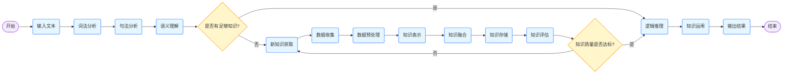

# 语言模型推理能力的终身学习轨迹研究

> 关键词：语言模型、推理能力、终身学习、学习轨迹、知识更新

> 摘要：本文聚焦于语言模型推理能力的终身学习轨迹研究。首先介绍了该研究的背景，包括目的、预期读者等内容。接着深入阐述语言模型推理能力及终身学习的核心概念与联系，给出原理和架构的示意图与流程图。详细讲解了相关核心算法原理并通过 Python 代码说明，同时介绍了对应的数学模型和公式。通过项目实战展示了代码的实际案例及详细解释。探讨了语言模型推理能力终身学习的实际应用场景，推荐了相关的学习资源、开发工具框架和论文著作。最后总结了未来发展趋势与挑战，给出常见问题解答及扩展阅读参考资料，旨在全面深入地研究语言模型推理能力的终身学习轨迹，为该领域的进一步发展提供理论和实践支持。

## 1. 背景介绍 
### 1.1 目的和范围
语言模型在自然语言处理领域发挥着越来越重要的作用，其推理能力是衡量其性能的关键指标之一。然而，随着时间的推移和知识的不断更新，语言模型需要具备终身学习的能力，以持续提升其推理能力。本研究的目的在于深入探究语言模型推理能力的终身学习轨迹，分析其在不同阶段的学习特点和影响因素，为开发更高效、更智能的语言模型提供理论依据和实践指导。

本研究的范围涵盖了语言模型推理能力的各个方面，包括推理算法、知识表示、学习策略等。同时，也考虑了终身学习过程中的知识遗忘、干扰等问题，以及如何通过有效的方法来优化学习轨迹，提高语言模型的长期性能。

### 1.2 预期读者
本文的预期读者包括自然语言处理领域的研究人员、工程师、研究生等。对于希望深入了解语言模型推理能力和终身学习机制的专业人士，本文将提供有价值的参考和启示。同时，对于对人工智能技术感兴趣的爱好者，也可以通过本文初步了解语言模型推理能力终身学习的相关知识。

### 1.3 文档结构概述
本文将按照以下结构进行组织：
1. **背景介绍**：阐述研究的目的、范围、预期读者和文档结构概述，同时介绍相关术语。
2. **核心概念与联系**：介绍语言模型推理能力和终身学习的核心概念，给出原理和架构的示意图与流程图，分析它们之间的联系。
3. **核心算法原理 & 具体操作步骤**：详细讲解语言模型推理能力终身学习的核心算法原理，并通过 Python 代码示例说明具体操作步骤。
4. **数学模型和公式 & 详细讲解 & 举例说明**：介绍相关的数学模型和公式，对其进行详细讲解，并通过具体例子说明其应用。
5. **项目实战：代码实际案例和详细解释说明**：通过一个实际的项目案例，展示语言模型推理能力终身学习的代码实现过程，并对代码进行详细解读。
6. **实际应用场景**：探讨语言模型推理能力终身学习在不同领域的实际应用场景。
7. **工具和资源推荐**：推荐相关的学习资源、开发工具框架和论文著作，帮助读者进一步深入学习和研究。
8. **总结：未来发展趋势与挑战**：总结语言模型推理能力终身学习的研究现状，分析未来发展趋势和面临的挑战。
9. **附录：常见问题与解答**：解答读者在阅读过程中可能遇到的常见问题。
10. **扩展阅读 & 参考资料**：提供相关的扩展阅读材料和参考资料，方便读者进一步探索相关领域的知识。

### 1.4 术语表
#### 1.4.1 核心术语定义
- **语言模型**：是一种用于处理自然语言的概率模型，它可以预测给定文本序列的下一个词或字符的概率分布。
- **推理能力**：指语言模型根据给定的输入信息，通过逻辑推理和知识运用，得出合理结论或答案的能力。
- **终身学习**：指语言模型在其生命周期内，不断学习新的知识和技能，同时保持和更新已有的知识，以适应不断变化的环境和任务需求。
- **学习轨迹**：指语言模型在终身学习过程中，推理能力随时间变化的路径和模式。

#### 1.4.2 相关概念解释
- **知识表示**：是指将知识以计算机能够理解和处理的形式进行表示，常见的知识表示方法包括符号表示、向量表示等。
- **知识更新**：指在终身学习过程中，对语言模型已有的知识进行修改、补充和扩展，以反映新的信息和知识。
- **知识遗忘**：指在终身学习过程中，由于学习新的知识或长时间未使用，导致语言模型对某些旧知识的记忆和理解能力下降的现象。

#### 1.4.3 缩略词列表
- **NLP**：Natural Language Processing，自然语言处理
- **LM**：Language Model，语言模型
- **RL**：Reinforcement Learning，强化学习
- **ML**：Machine Learning，机器学习

## 2. 核心概念与联系 

### 语言模型推理能力的原理
语言模型的推理能力基于其对语言的理解和知识的运用。它通过对输入文本的分析和处理，结合自身的知识储备，进行逻辑推理和判断，从而得出合理的结论或答案。

语言模型通常采用深度学习架构，如循环神经网络（RNN）、长短期记忆网络（LSTM）、门控循环单元（GRU）等，以及基于注意力机制的Transformer架构。这些架构可以学习到语言的序列模式和语义信息，从而提高语言模型的理解和推理能力。

### 终身学习的原理
终身学习的核心思想是让语言模型在其生命周期内不断学习新的知识和技能，同时保持和更新已有的知识。为了实现这一目标，需要解决以下几个关键问题：
1. **知识表示和存储**：需要设计合适的知识表示方法，将新知识和旧知识以统一的形式进行表示和存储，以便于管理和更新。
2. **知识迁移和泛化**：需要让语言模型能够将在一个任务中学习到的知识迁移到其他任务中，提高知识的泛化能力。
3. **知识遗忘和干扰**：需要采取有效的措施来防止知识遗忘和干扰，确保语言模型在学习新知识的同时，不会忘记旧知识。

### 语言模型推理能力与终身学习的联系
语言模型的推理能力是终身学习的基础，只有具备良好的推理能力，语言模型才能更好地理解和运用新知识。而终身学习则是提高语言模型推理能力的重要手段，通过不断学习新的知识和技能，语言模型可以不断扩展其知识储备，提高其推理能力。

### 核心概念原理和架构的文本示意图
```plaintext
语言模型推理能力
|
|-- 输入文本
|   |-- 词法分析
|   |-- 句法分析
|   |-- 语义理解
|
|-- 知识储备
|   |-- 常识知识
|   |-- 领域知识
|   |-- 语言知识
|
|-- 推理过程
|   |-- 逻辑推理
|   |-- 知识运用
|
|-- 输出结果

终身学习
|
|-- 新知识获取
|   |-- 数据收集
|   |-- 数据预处理
|
|-- 知识更新
|   |-- 知识表示
|   |-- 知识融合
|   |-- 知识存储
|
|-- 知识评估
|   |-- 性能评估
|   |-- 知识质量评估
```

### Mermaid 流程图


## 3. 核心算法原理 & 具体操作步骤 

### 核心算法原理
在语言模型推理能力的终身学习中，一种常用的算法是基于强化学习的方法。强化学习是一种通过智能体与环境进行交互，不断尝试和学习，以获得最大累积奖励的学习方法。

在语言模型的终身学习场景中，智能体可以是语言模型本身，环境可以是外部的任务和数据。语言模型通过与环境进行交互，不断尝试不同的推理策略，根据环境反馈的奖励信号来调整自己的行为，从而提高推理能力。

### 具体操作步骤
以下是基于强化学习的语言模型推理能力终身学习的具体操作步骤：

1. **定义环境和状态空间**：首先需要定义语言模型所处的环境和状态空间。环境可以包括任务描述、输入文本等信息，状态空间可以包括语言模型的内部状态、知识储备等信息。
2. **定义动作空间**：动作空间是指语言模型在每个状态下可以采取的行动集合。例如，语言模型可以选择不同的推理策略、查询不同的知识源等。
3. **定义奖励函数**：奖励函数是用来评估语言模型在每个状态下采取的行动的好坏程度。奖励函数可以根据任务的目标和要求进行设计，例如，推理结果的准确性、推理效率等。
4. **初始化语言模型和智能体**：初始化语言模型的参数和智能体的策略网络。
5. **训练过程**：
    - 智能体根据当前状态选择一个动作。
    - 语言模型执行该动作，并与环境进行交互，得到新的状态和奖励。
    - 智能体根据新的状态和奖励更新自己的策略网络。
    - 重复上述步骤，直到达到训练终止条件。

### Python 源代码示例
```python
import numpy as np
import torch
import torch.nn as nn
import torch.optim as optim

# 定义语言模型
class LanguageModel(nn.Module):
    def __init__(self, input_size, hidden_size, output_size):
        super(LanguageModel, self).__init__()
        self.fc1 = nn.Linear(input_size, hidden_size)
        self.relu = nn.ReLU()
        self.fc2 = nn.Linear(hidden_size, output_size)

    def forward(self, x):
        out = self.fc1(x)
        out = self.relu(out)
        out = self.fc2(out)
        return out

# 定义智能体
class Agent:
    def __init__(self, state_size, action_size, learning_rate):
        self.policy_network = nn.Sequential(
            nn.Linear(state_size, 128),
            nn.ReLU(),
            nn.Linear(128, action_size),
            nn.Softmax(dim=1)
        )
        self.optimizer = optim.Adam(self.policy_network.parameters(), lr=learning_rate)

    def choose_action(self, state):
        state = torch.FloatTensor(state).unsqueeze(0)
        probs = self.policy_network(state)
        action = torch.multinomial(probs, 1).item()
        return action

    def update_policy(self, states, actions, rewards):
        states = torch.FloatTensor(states)
        actions = torch.LongTensor(actions)
        rewards = torch.FloatTensor(rewards)

        probs = self.policy_network(states)
        log_probs = torch.log(probs.gather(1, actions.unsqueeze(1)))
        loss = -(log_probs * rewards).mean()

        self.optimizer.zero_grad()
        loss.backward()
        self.optimizer.step()

# 定义环境
class Environment:
    def __init__(self):
        self.state_size = 10
        self.action_size = 5

    def reset(self):
        state = np.random.randn(self.state_size)
        return state

    def step(self, action):
        reward = np.random.randn()
        next_state = np.random.randn(self.state_size)
        done = np.random.choice([True, False], p=[0.1, 0.9])
        return next_state, reward, done

# 训练过程
def train():
    env = Environment()
    state_size = env.state_size
    action_size = env.action_size
    learning_rate = 0.001
    agent = Agent(state_size, action_size, learning_rate)
    num_episodes = 1000

    for episode in range(num_episodes):
        state = env.reset()
        states = []
        actions = []
        rewards = []
        done = False

        while not done:
            action = agent.choose_action(state)
            next_state, reward, done = env.step(action)
            states.append(state)
            actions.append(action)
            rewards.append(reward)
            state = next_state

        agent.update_policy(states, actions, rewards)
        if episode % 100 == 0:
            print(f"Episode {episode}: Total reward = {sum(rewards)}")

if __name__ == "__main__":
    train()
```

## 4. 数学模型和公式 & 详细讲解 & 举例说明 

### 强化学习的数学模型
强化学习的数学模型可以用马尔可夫决策过程（MDP）来描述。一个 MDP 可以用一个五元组 $\langle S, A, P, R, \gamma \rangle$ 来表示，其中：
- $S$ 是状态空间，表示智能体可能处于的所有状态的集合。
- $A$ 是动作空间，表示智能体在每个状态下可以采取的所有动作的集合。
- $P: S \times A \times S \to [0, 1]$ 是状态转移概率函数，表示在状态 $s \in S$ 下采取动作 $a \in A$ 后，转移到状态 $s' \in S$ 的概率。
- $R: S \times A \to \mathbb{R}$ 是奖励函数，表示在状态 $s \in S$ 下采取动作 $a \in A$ 后，获得的即时奖励。
- $\gamma \in [0, 1]$ 是折扣因子，表示未来奖励的重要程度。

### 策略和价值函数
在强化学习中，策略 $\pi: S \to A$ 是一个从状态到动作的映射，表示智能体在每个状态下应该采取的动作。价值函数是用来评估状态或状态 - 动作对的好坏程度的函数。

- **状态价值函数**：$V^{\pi}(s) = \mathbb{E}_{\pi} \left[ \sum_{t=0}^{\infty} \gamma^t R_{t+1} \mid S_0 = s \right]$，表示在策略 $\pi$ 下，从状态 $s$ 开始的期望累积奖励。
- **动作价值函数**：$Q^{\pi}(s, a) = \mathbb{E}_{\pi} \left[ \sum_{t=0}^{\infty} \gamma^t R_{t+1} \mid S_0 = s, A_0 = a \right]$，表示在策略 $\pi$ 下，从状态 $s$ 开始采取动作 $a$ 后的期望累积奖励。

### 最优策略和最优价值函数
最优策略 $\pi^*$ 是使得状态价值函数或动作价值函数最大的策略。最优状态价值函数 $V^*(s) = \max_{\pi} V^{\pi}(s)$，最优动作价值函数 $Q^*(s, a) = \max_{\pi} Q^{\pi}(s, a)$。

### Bellman 方程
Bellman 方程是强化学习中的一个重要方程，它描述了价值函数的递归关系。

- **状态价值函数的 Bellman 方程**：$V^{\pi}(s) = \sum_{a \in A} \pi(a \mid s) \left[ R(s, a) + \gamma \sum_{s' \in S} P(s' \mid s, a) V^{\pi}(s') \right]$
- **动作价值函数的 Bellman 方程**：$Q^{\pi}(s, a) = R(s, a) + \gamma \sum_{s' \in S} P(s' \mid s, a) \sum_{a' \in A} \pi(a' \mid s') Q^{\pi}(s', a')$

### 举例说明
假设一个简单的环境，状态空间 $S = \{s_1, s_2\}$，动作空间 $A = \{a_1, a_2\}$，状态转移概率函数 $P$ 和奖励函数 $R$ 如下：

$P(s_1 \mid s_1, a_1) = 0.8, P(s_2 \mid s_1, a_1) = 0.2$

$P(s_1 \mid s_1, a_2) = 0.3, P(s_2 \mid s_1, a_2) = 0.7$

$P(s_1 \mid s_2, a_1) = 0.4, P(s_2 \mid s_2, a_1) = 0.6$

$P(s_1 \mid s_2, a_2) = 0.1, P(s_2 \mid s_2, a_2) = 0.9$

$R(s_1, a_1) = 1, R(s_1, a_2) = -1$

$R(s_2, a_1) = -2, R(s_2, a_2) = 3$

折扣因子 $\gamma = 0.9$。

假设策略 $\pi$ 为：$\pi(a_1 \mid s_1) = 0.6, \pi(a_2 \mid s_1) = 0.4$，$\pi(a_1 \mid s_2) = 0.3, \pi(a_2 \mid s_2) = 0.7$。

根据状态价值函数的 Bellman 方程，可以计算出 $V^{\pi}(s_1)$ 和 $V^{\pi}(s_2)$：

$V^{\pi}(s_1) = \pi(a_1 \mid s_1) \left[ R(s_1, a_1) + \gamma \left( P(s_1 \mid s_1, a_1) V^{\pi}(s_1) + P(s_2 \mid s_1, a_1) V^{\pi}(s_2) \right) \right] + \pi(a_2 \mid s_1) \left[ R(s_1, a_2) + \gamma \left( P(s_1 \mid s_1, a_2) V^{\pi}(s_1) + P(s_2 \mid s_1, a_2) V^{\pi}(s_2) \right) \right]$

$V^{\pi}(s_2) = \pi(a_1 \mid s_2) \left[ R(s_2, a_1) + \gamma \left( P(s_1 \mid s_2, a_1) V^{\pi}(s_1) + P(s_2 \mid s_2, a_1) V^{\pi}(s_2) \right) \right] + \pi(a_2 \mid s_2) \left[ R(s_2, a_2) + \gamma \left( P(s_1 \mid s_2, a_2) V^{\pi}(s_1) + P(s_2 \mid s_2, a_2) V^{\pi}(s_2) \right) \right]$

将具体数值代入上述方程，通过迭代求解可以得到 $V^{\pi}(s_1)$ 和 $V^{\pi}(s_2)$ 的值。

## 5. 项目实战：代码实际案例和详细解释说明 

### 5.1  开发环境搭建
为了实现语言模型推理能力的终身学习项目，我们需要搭建相应的开发环境。以下是具体的步骤：

1. **安装 Python**：建议使用 Python 3.7 及以上版本。可以从 Python 官方网站（https://www.python.org/downloads/）下载并安装。
2. **安装深度学习框架**：我们使用 PyTorch 作为深度学习框架。可以通过以下命令安装：
```sh
pip install torch torchvision
```
3. **安装其他依赖库**：根据项目需求，可能还需要安装其他依赖库，如 NumPy、Matplotlib 等。可以使用以下命令安装：
```sh
pip install numpy matplotlib
```

### 5.2  源代码详细实现和代码解读
以下是一个基于 PyTorch 的语言模型推理能力终身学习的完整代码示例：

```python
import numpy as np
import torch
import torch.nn as nn
import torch.optim as optim
import matplotlib.pyplot as plt

# 定义语言模型
class LanguageModel(nn.Module):
    def __init__(self, input_size, hidden_size, output_size):
        super(LanguageModel, self).__init__()
        self.fc1 = nn.Linear(input_size, hidden_size)
        self.relu = nn.ReLU()
        self.fc2 = nn.Linear(hidden_size, output_size)

    def forward(self, x):
        out = self.fc1(x)
        out = self.relu(out)
        out = self.fc2(out)
        return out

# 定义智能体
class Agent:
    def __init__(self, state_size, action_size, learning_rate):
        self.policy_network = nn.Sequential(
            nn.Linear(state_size, 128),
            nn.ReLU(),
            nn.Linear(128, action_size),
            nn.Softmax(dim=1)
        )
        self.optimizer = optim.Adam(self.policy_network.parameters(), lr=learning_rate)

    def choose_action(self, state):
        state = torch.FloatTensor(state).unsqueeze(0)
        probs = self.policy_network(state)
        action = torch.multinomial(probs, 1).item()
        return action

    def update_policy(self, states, actions, rewards):
        states = torch.FloatTensor(states)
        actions = torch.LongTensor(actions)
        rewards = torch.FloatTensor(rewards)

        probs = self.policy_network(states)
        log_probs = torch.log(probs.gather(1, actions.unsqueeze(1)))
        loss = -(log_probs * rewards).mean()

        self.optimizer.zero_grad()
        loss.backward()
        self.optimizer.step()

# 定义环境
class Environment:
    def __init__(self):
        self.state_size = 10
        self.action_size = 5
        self.max_steps = 100

    def reset(self):
        state = np.random.randn(self.state_size)
        self.step_count = 0
        return state

    def step(self, action):
        reward = np.random.randn()
        next_state = np.random.randn(self.state_size)
        self.step_count += 1
        done = self.step_count >= self.max_steps
        return next_state, reward, done

# 训练过程
def train():
    env = Environment()
    state_size = env.state_size
    action_size = env.action_size
    learning_rate = 0.001
    agent = Agent(state_size, action_size, learning_rate)
    num_episodes = 1000
    total_rewards = []

    for episode in range(num_episodes):
        state = env.reset()
        states = []
        actions = []
        rewards = []
        done = False

        while not done:
            action = agent.choose_action(state)
            next_state, reward, done = env.step(action)
            states.append(state)
            actions.append(action)
            rewards.append(reward)
            state = next_state

        agent.update_policy(states, actions, rewards)
        total_reward = sum(rewards)
        total_rewards.append(total_reward)
        if episode % 100 == 0:
            print(f"Episode {episode}: Total reward = {total_reward}")

    # 绘制奖励曲线
    plt.plot(total_rewards)
    plt.xlabel('Episode')
    plt.ylabel('Total Reward')
    plt.title('Training Curve')
    plt.show()

if __name__ == "__main__":
    train()
```

### 5.3  代码解读与分析
1. **语言模型类 `LanguageModel`**：定义了一个简单的全连接神经网络，用于表示语言模型。它接受输入特征，通过两层全连接层和一个 ReLU 激活函数，输出预测结果。
2. **智能体类 `Agent`**：
    - `policy_network`：定义了一个策略网络，用于根据当前状态选择动作。
    - `choose_action` 方法：根据当前状态计算动作概率分布，并通过采样选择一个动作。
    - `update_policy` 方法：根据智能体在一个回合中采取的状态、动作和奖励，更新策略网络的参数。
3. **环境类 `Environment`**：
    - `reset` 方法：重置环境，返回初始状态。
    - `step` 方法：根据智能体采取的动作，返回下一个状态、奖励和是否结束的标志。
4. **训练函数 `train`**：
    - 初始化环境、智能体等参数。
    - 进行多个回合的训练，每个回合中智能体与环境进行交互，记录状态、动作和奖励。
    - 每个回合结束后，更新智能体的策略网络。
    - 绘制训练过程中的总奖励曲线，用于观察训练效果。

通过这个项目实战，我们可以看到如何使用强化学习的方法来实现语言模型推理能力的终身学习。在实际应用中，可以根据具体需求对代码进行修改和扩展，例如改变环境的定义、调整智能体的策略网络结构等。

## 6. 实际应用场景 
语言模型推理能力的终身学习在许多领域都有广泛的应用，以下是一些具体的应用场景：

### 智能客服系统
在智能客服系统中，语言模型需要不断学习新的问题和答案，以提高其回答用户问题的准确性和效率。通过终身学习，语言模型可以实时更新自己的知识储备，适应不同用户的需求和业务场景的变化。例如，当有新的产品或服务推出时，智能客服系统可以通过学习相关的知识，为用户提供准确的咨询服务。

### 智能写作助手
智能写作助手可以帮助用户生成高质量的文本，如文章、报告、文案等。通过终身学习，语言模型可以不断学习新的写作风格、语法规则和词汇，提高其生成文本的质量和多样性。例如，当出现新的文学体裁或写作趋势时，智能写作助手可以通过学习相关的知识，为用户提供更符合时代需求的写作建议。

### 智能翻译系统
智能翻译系统需要处理各种领域的文本，并且随着语言的发展和变化，需要不断更新自己的翻译知识。通过终身学习，语言模型可以学习新的词汇、语法和表达方式，提高其翻译的准确性和流畅性。例如，当出现新的专业术语或流行语时，智能翻译系统可以通过学习相关的知识，及时更新自己的翻译词典，为用户提供更准确的翻译服务。

### 智能教育系统
在智能教育系统中，语言模型可以作为智能辅导老师，为学生提供个性化的学习支持。通过终身学习，语言模型可以不断学习新的教学内容和方法，了解学生的学习情况和需求，为学生提供更有针对性的学习建议和辅导。例如，当有新的课程或教学资源出现时，智能教育系统可以通过学习相关的知识，为学生提供更丰富的学习材料和更有效的学习指导。

### 信息检索系统
信息检索系统需要根据用户的查询需求，从大量的文本数据中检索出相关的信息。通过终身学习，语言模型可以不断学习新的主题和知识，提高其对文本的理解和检索能力。例如，当出现新的研究领域或热点话题时，信息检索系统可以通过学习相关的知识，为用户提供更准确、更全面的检索结果。

## 7. 工具和资源推荐
### 7.1 学习资源推荐
#### 7.1.1 书籍推荐
- 《深度学习》（Deep Learning）：由 Ian Goodfellow、Yoshua Bengio 和 Aaron Courville 合著，是深度学习领域的经典教材，涵盖了深度学习的基本概念、算法和应用。
- 《自然语言处理入门》（Natural Language Processing with Python）：由 Steven Bird、Ewan Klein 和 Edward Loper 合著，介绍了使用 Python 进行自然语言处理的基本方法和技术。
- 《强化学习：原理与Python实现》（Reinforcement Learning: An Introduction）：由 Richard S. Sutton 和 Andrew G. Barto 合著，是强化学习领域的经典教材，系统地介绍了强化学习的基本概念、算法和应用。

#### 7.1.2 在线课程
- Coursera 上的“深度学习专项课程”（Deep Learning Specialization）：由 Andrew Ng 教授授课，包括深度学习的基础知识、卷积神经网络、循环神经网络等内容。
- edX 上的“自然语言处理”（Natural Language Processing）：由哥伦比亚大学的教授授课，介绍了自然语言处理的基本概念、算法和应用。
- Udemy 上的“强化学习实战”（Reinforcement Learning in Action）：通过实际项目介绍了强化学习的基本概念和算法，帮助学习者快速掌握强化学习的应用。

#### 7.1.3 技术博客和网站
- arXiv（https://arxiv.org/）：一个开放获取的预印本平台，提供了大量的计算机科学、人工智能等领域的研究论文。
- Medium（https://medium.com/）：一个技术博客平台，有许多关于自然语言处理、深度学习、强化学习等领域的优秀文章。
- Towards Data Science（https://towardsdatascience.com/）：一个专注于数据科学和人工智能的技术博客，提供了许多实用的技术教程和案例分析。

### 7.2 开发工具框架推荐
#### 7.2.1 IDE和编辑器
- PyCharm：一个专业的 Python 集成开发环境，提供了代码编辑、调试、版本控制等功能，适合开发 Python 项目。
- Visual Studio Code：一个轻量级的代码编辑器，支持多种编程语言，有丰富的插件扩展功能，适合快速开发和调试。
- Jupyter Notebook：一个交互式的开发环境，适合进行数据分析、模型训练和实验验证，支持 Python、R 等多种编程语言。

#### 7.2.2 调试和性能分析工具
- PyTorch Profiler：PyTorch 提供的性能分析工具，可以帮助开发者分析模型的性能瓶颈，优化代码性能。
- TensorBoard：TensorFlow 提供的可视化工具，也可以与 PyTorch 结合使用，用于可视化模型的训练过程、性能指标等。
- cProfile：Python 内置的性能分析工具，可以帮助开发者分析代码的执行时间和函数调用情况。

#### 7.2.3 相关框架和库
- PyTorch：一个开源的深度学习框架，提供了丰富的神经网络层和优化算法，适合开发深度学习模型。
- Hugging Face Transformers：一个基于 PyTorch 和 TensorFlow 的自然语言处理库，提供了许多预训练的语言模型和工具，方便开发者进行自然语言处理任务。
- Stable Baselines3：一个基于 PyTorch 的强化学习库，提供了许多常见的强化学习算法的实现，方便开发者进行强化学习实验。

### 7.3 相关论文著作推荐
#### 7.3.1 经典论文
- “Attention Is All You Need”：介绍了 Transformer 架构，是自然语言处理领域的经典论文，为后续的语言模型发展奠定了基础。
- “Playing Atari with Deep Reinforcement Learning”：首次提出了使用深度强化学习来玩 Atari 游戏的方法，开创了深度强化学习的先河。
- “Learning to Learn by Gradient Descent by Gradient Descent”：提出了元学习的概念，为终身学习提供了新的思路和方法。

#### 7.3.2 最新研究成果
- 关注 arXiv 上的最新论文，了解语言模型推理能力终身学习领域的最新研究进展。
- 参加相关的学术会议，如 ACL（Association for Computational Linguistics）、NeurIPS（Neural Information Processing Systems）等，了解最新的研究成果和技术趋势。

#### 7.3.3 应用案例分析
- 关注相关的技术博客和网站，了解语言模型推理能力终身学习在实际应用中的案例分析，学习他人的经验和方法。
- 参考开源项目的文档和代码，了解如何将语言模型推理能力终身学习的技术应用到实际项目中。

## 8. 总结：未来发展趋势与挑战
### 未来发展趋势
1. **多模态融合**：未来的语言模型将不仅仅局限于文本处理，还将融合图像、音频、视频等多种模态的信息，实现更全面、更深入的理解和推理。例如，在智能客服系统中，可以结合用户的语音和图像信息，更好地理解用户的需求。
2. **跨领域学习**：语言模型将具备更强的跨领域学习能力，能够在不同的领域之间进行知识迁移和共享。例如，在医疗、金融等领域，语言模型可以通过学习其他领域的知识，提高其在本领域的推理能力。
3. **个性化学习**：随着用户需求的个性化和多样化，语言模型将实现个性化学习，根据用户的兴趣、偏好和历史行为，为用户提供个性化的服务和建议。例如，在智能教育系统中，为不同的学生提供个性化的学习方案。
4. **自主学习和进化**：未来的语言模型将具备更强的自主学习和进化能力，能够自动发现新的知识和规律，不断优化自己的推理能力。例如，通过与环境的交互，自动学习新的任务和技能。

### 挑战
1. **知识表示和管理**：随着知识的不断增长和更新，如何有效地表示和管理知识是一个挑战。需要设计更加高效、灵活的知识表示方法，以及智能的知识管理系统，确保语言模型能够快速、准确地获取和使用知识。
2. **知识遗忘和干扰**：在终身学习过程中，知识遗忘和干扰是不可避免的问题。需要研究有效的方法来防止知识遗忘和干扰，确保语言模型在学习新知识的同时，不会忘记旧知识。
3. **计算资源和效率**：语言模型的训练和推理需要大量的计算资源，特别是在终身学习的场景下，需要不断地更新模型和处理新的数据。如何提高计算效率，降低计算成本，是一个亟待解决的问题。
4. **伦理和安全问题**：随着语言模型的广泛应用，伦理和安全问题也日益凸显。例如，语言模型可能会生成虚假信息、偏见性内容等，需要研究相应的伦理准则和安全机制，确保语言模型的安全和可靠。

## 9. 附录：常见问题与解答
### 1. 什么是语言模型的推理能力？
语言模型的推理能力是指它根据给定的输入信息，通过逻辑推理和知识运用，得出合理结论或答案的能力。例如，在问答系统中，语言模型需要根据用户的问题，结合自己的知识储备，推理出正确的答案。

### 2. 为什么语言模型需要终身学习？
随着时间的推移和知识的不断更新，语言模型需要不断学习新的知识和技能，以适应不断变化的环境和任务需求。终身学习可以让语言模型保持和更新自己的知识，提高其推理能力和性能。

### 3. 终身学习过程中如何防止知识遗忘？
可以采用一些方法来防止知识遗忘，例如，定期复习旧知识、采用增量学习的方法、引入记忆机制等。另外，合理的知识表示和管理也可以帮助减少知识遗忘的问题。

### 4. 强化学习在语言模型推理能力终身学习中有什么作用？
强化学习可以让语言模型通过与环境进行交互，不断尝试和学习，以获得最大累积奖励。在语言模型推理能力终身学习中，强化学习可以帮助语言模型优化自己的推理策略，提高推理能力。

### 5. 语言模型推理能力终身学习的计算成本高吗？
语言模型推理能力终身学习的计算成本相对较高，因为需要不断地更新模型和处理新的数据。可以通过优化算法、采用分布式计算等方法来降低计算成本。

## 10. 扩展阅读 & 参考资料
### 扩展阅读
- “The Future of Natural Language Processing”：探讨了自然语言处理领域的未来发展趋势和挑战。
- “Reinforcement Learning in Natural Language Processing”：介绍了强化学习在自然语言处理中的应用和研究进展。
- “Lifelong Machine Learning”：深入探讨了终身机器学习的理论和方法。

### 参考资料
- Goodfellow, I., Bengio, Y., & Courville, A. (2016). Deep Learning. MIT Press.
- Bird, S., Klein, E., & Loper, E. (2009). Natural Language Processing with Python. O'Reilly Media.
- Sutton, R. S., & Barto, A. G. (2018). Reinforcement Learning: An Introduction. MIT Press.
- Vaswani, A., Shazeer, N., Parmar, N., Uszkoreit, J., Jones, L., Gomez, A. N., ... & Polosukhin, I. (2017). Attention is all you need. Advances in neural information processing systems, 5998-6008.
- Mnih, V., Kavukcuoglu, K., Silver, D., Rusu, A. A., Veness, J., Bellemare, M. G., ... & Petersen, S. (2015). Human-level control through deep reinforcement learning. Nature, 518(7540), 529-533.
- Andrychowicz, M., Denil, M., Gomez, S., Hoffman, M. W., Pfau, D., Schaul, T., ... & de Freitas, N. (2016). Learning to learn by gradient descent by gradient descent. Advances in neural information processing systems, 3981-3989.