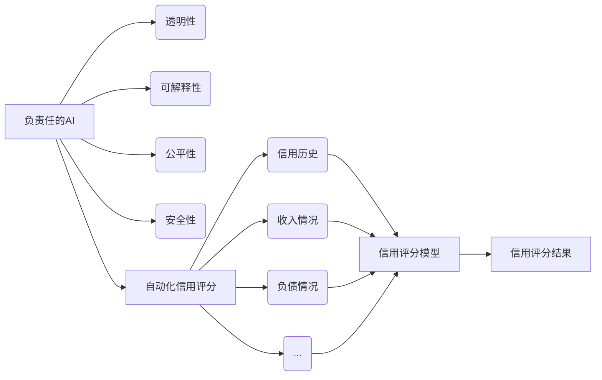

# 负责任的AI在自动化信用评分中的公平性实践

> 关键词：负责任的AI、自动化信用评分、公平性实践、机器学习、信用评估

> 摘要：本文聚焦于负责任的AI在自动化信用评分中的公平性实践。首先介绍了研究的背景、目的、预期读者和文档结构等内容。接着阐述了核心概念，包括负责任的AI和自动化信用评分的原理及联系，并给出了相应的示意图和流程图。详细讲解了核心算法原理，通过Python代码进行说明，同时介绍了相关的数学模型和公式。在项目实战部分，给出了开发环境搭建、源代码实现和解读。探讨了实际应用场景，推荐了相关的学习资源、开发工具框架和论文著作。最后总结了未来发展趋势与挑战，提供了常见问题解答和扩展阅读参考资料，旨在推动负责任的AI在自动化信用评分中实现公平、公正的评估。

## 1. 背景介绍 
### 1.1 目的和范围
自动化信用评分在金融领域有着广泛的应用，它能够快速、高效地评估借款人的信用风险。然而，传统的信用评分方法可能存在一定的局限性，尤其是在公平性方面。随着人工智能技术的发展，AI在自动化信用评分中的应用越来越普遍，但也带来了新的挑战，如算法偏见等问题。本文的目的在于探讨如何在自动化信用评分中实践负责任的AI，以确保信用评分的公平性。范围涵盖了从核心概念的介绍、算法原理的分析、数学模型的讲解到实际项目的案例分析，以及相关工具和资源的推荐等方面。

### 1.2 预期读者
本文的预期读者包括金融领域的从业者，如信贷分析师、风险评估专家等，他们希望了解如何利用负责任的AI提升信用评分的公平性；人工智能领域的研究人员和开发者，他们对将AI技术应用于信用评分并解决公平性问题感兴趣；以及相关专业的学生，他们希望深入学习自动化信用评分和负责任AI的相关知识。

### 1.3 文档结构概述
本文首先介绍背景信息，包括目的、预期读者和文档结构等。接着阐述核心概念，分析核心概念之间的联系，并给出示意图和流程图。然后详细讲解核心算法原理，通过Python代码进行说明，同时介绍相关的数学模型和公式。在项目实战部分，介绍开发环境搭建、源代码实现和解读。探讨实际应用场景，推荐相关的学习资源、开发工具框架和论文著作。最后总结未来发展趋势与挑战，提供常见问题解答和扩展阅读参考资料。

### 1.4 术语表
#### 1.4.1 核心术语定义
- **负责任的AI**：指在AI系统的开发、部署和使用过程中，遵循道德、法律和社会规范，确保AI系统的决策和行为是可解释、透明、公平和安全的。
- **自动化信用评分**：利用计算机算法和数据分析技术，对借款人的信用状况进行评估和打分的过程。
- **公平性**：在信用评分中，公平性意味着无论借款人的种族、性别、年龄等敏感特征如何，都能得到公正、无偏见的评估。

#### 1.4.2 相关概念解释
- **算法偏见**：指AI算法在处理数据时，由于数据本身的偏差或算法设计的不合理，导致对某些群体产生不公平的结果。
- **可解释性**：指AI系统的决策过程和结果能够被人类理解和解释，以便发现和纠正可能存在的问题。
- **数据隐私**：指在信用评分过程中，保护借款人个人信息不被泄露和滥用的原则。

#### 1.4.3 缩略词列表
- **AI**：Artificial Intelligence，人工智能
- **ML**：Machine Learning，机器学习
- **FICO**：Fair Isaac Corporation，费埃哲公司，一家提供信用评分服务的公司

## 2. 核心概念与联系 
### 核心概念原理
#### 负责任的AI原理
负责任的AI强调在AI系统的整个生命周期中，要考虑到道德、法律和社会影响。它要求AI系统的开发和使用遵循以下原则：
- **透明性**：AI系统的算法和决策过程应该是透明的，用户能够了解系统是如何做出决策的。
- **可解释性**：对于AI系统的决策结果，应该能够给出合理的解释，以便用户理解和信任。
- **公平性**：AI系统应该避免对任何群体产生不公平的歧视，确保决策结果的公正性。
- **安全性**：AI系统应该能够保护用户的数据和隐私，避免数据泄露和滥用。

#### 自动化信用评分原理
自动化信用评分是基于借款人的各种信息，如信用历史、收入情况、负债情况等，利用机器学习算法构建模型，对借款人的信用风险进行评估和打分。常见的自动化信用评分方法包括逻辑回归、决策树、随机森林等。这些方法通过对历史数据的学习，建立信用评分模型，然后根据新借款人的信息进行预测。

### 核心概念联系
负责任的AI和自动化信用评分之间存在着密切的联系。在自动化信用评分中应用负责任的AI，可以提高信用评分的公平性和可靠性。负责任的AI的透明性和可解释性原则可以帮助金融机构更好地理解信用评分模型的决策过程，发现和纠正可能存在的算法偏见。公平性原则则直接要求信用评分模型在评估借款人时，不应该受到种族、性别等敏感特征的影响。同时，安全性原则可以保护借款人的个人信息，防止数据泄露和滥用。

### 文本示意图
```plaintext
负责任的AI
    |
    |--透明性
    |--可解释性
    |--公平性
    |--安全性
    |
    v
自动化信用评分
    |
    |--信用历史
    |--收入情况
    |--负债情况
    |--...
    |
    v
信用评分模型
    |
    v
信用评分结果
```

### Mermaid流程图


## 3. 核心算法原理 & 具体操作步骤 
### 核心算法原理
在自动化信用评分中，常用的机器学习算法包括逻辑回归、决策树和随机森林等。下面以逻辑回归为例，详细介绍其原理。

逻辑回归是一种广义线性模型，用于解决二分类问题。在信用评分中，我们可以将借款人分为违约和不违约两类。逻辑回归的基本原理是通过对输入特征进行线性组合，然后通过逻辑函数将线性组合的结果映射到0到1之间的概率值。逻辑函数的表达式为：

$$\sigma(z)=\frac{1}{1 + e^{-z}}$$

其中，$z$ 是输入特征的线性组合：

$$z = \theta_0 + \theta_1x_1 + \theta_2x_2 + \cdots + \theta_nx_n$$

$\theta_0, \theta_1, \cdots, \theta_n$ 是模型的参数，$x_1, x_2, \cdots, x_n$ 是输入特征。

逻辑回归的目标是找到一组最优的参数 $\theta$，使得模型对训练数据的预测结果与实际结果之间的误差最小。通常使用对数损失函数作为损失函数：

$$J(\theta)=-\frac{1}{m}\sum_{i = 1}^{m}[y^{(i)}\log(\sigma(z^{(i)}))+(1 - y^{(i)})\log(1 - \sigma(z^{(i)}))]$$

其中，$m$ 是训练数据的数量，$y^{(i)}$ 是第 $i$ 个样本的真实标签，$\sigma(z^{(i)})$ 是第 $i$ 个样本的预测概率。

### 具体操作步骤
#### 数据准备
首先，需要收集和整理信用评分所需的数据，包括借款人的信用历史、收入情况、负债情况等。然后，对数据进行清洗和预处理，如处理缺失值、异常值，进行特征编码等。

#### 特征选择
从收集到的特征中选择对信用评分有重要影响的特征。可以使用相关性分析、特征重要性排序等方法进行特征选择。

#### 模型训练
使用训练数据对逻辑回归模型进行训练。可以使用梯度下降等优化算法来求解最优的模型参数。

#### 模型评估
使用测试数据对训练好的模型进行评估，常用的评估指标包括准确率、召回率、F1值等。

#### 模型部署
将训练好的模型部署到实际应用中，对新的借款人进行信用评分。

### Python源代码实现
```python
import numpy as np
from sklearn.linear_model import LogisticRegression
from sklearn.model_selection import train_test_split
from sklearn.metrics import accuracy_score

# 生成示例数据
np.random.seed(42)
X = np.random.randn(100, 5)
y = np.random.randint(0, 2, 100)

# 划分训练集和测试集
X_train, X_test, y_train, y_test = train_test_split(X, y, test_size=0.2, random_state=42)

# 创建逻辑回归模型
model = LogisticRegression()

# 训练模型
model.fit(X_train, y_train)

# 预测
y_pred = model.predict(X_test)

# 评估模型
accuracy = accuracy_score(y_test, y_pred)
print(f"模型准确率: {accuracy}")
```

## 4. 数学模型和公式 & 详细讲解 & 举例说明 
### 逻辑回归数学模型
逻辑回归的数学模型可以表示为：

$$P(y = 1|x)=\frac{1}{1 + e^{-(\theta_0 + \theta_1x_1 + \theta_2x_2 + \cdots + \theta_nx_n)}}$$

其中，$P(y = 1|x)$ 表示在输入特征 $x$ 的条件下，样本属于正类（违约）的概率。

### 对数损失函数
对数损失函数的表达式为：

$$J(\theta)=-\frac{1}{m}\sum_{i = 1}^{m}[y^{(i)}\log(\sigma(z^{(i)}))+(1 - y^{(i)})\log(1 - \sigma(z^{(i)}))]$$

详细讲解：
- 当 $y^{(i)} = 1$ 时，对数损失函数变为 $-\log(\sigma(z^{(i)}))$。如果 $\sigma(z^{(i)})$ 接近1，即模型预测样本属于正类的概率接近1，那么损失函数的值接近0；如果 $\sigma(z^{(i)})$ 接近0，即模型预测样本属于正类的概率接近0，那么损失函数的值接近无穷大。
- 当 $y^{(i)} = 0$ 时，对数损失函数变为 $-\log(1 - \sigma(z^{(i)}))$。如果 $\sigma(z^{(i)})$ 接近0，即模型预测样本属于负类的概率接近1，那么损失函数的值接近0；如果 $\sigma(z^{(i)})$ 接近1，即模型预测样本属于负类的概率接近0，那么损失函数的值接近无穷大。

### 梯度下降算法
梯度下降算法是一种常用的优化算法，用于求解逻辑回归模型的最优参数。梯度下降算法的基本思想是沿着损失函数的负梯度方向更新模型参数，直到损失函数达到最小值。

梯度下降算法的更新公式为：

$$\theta_j := \theta_j - \alpha\frac{\partial J(\theta)}{\partial \theta_j}$$

其中，$\theta_j$ 是第 $j$ 个模型参数，$\alpha$ 是学习率，$\frac{\partial J(\theta)}{\partial \theta_j}$ 是损失函数关于 $\theta_j$ 的偏导数。

### 举例说明
假设我们有一个简单的信用评分问题，输入特征只有一个 $x$，模型参数为 $\theta_0$ 和 $\theta_1$。训练数据有两个样本：$(x_1, y_1) = (1, 1)$ 和 $(x_2, y_2) = (2, 0)$。

首先，计算 $z$ 值：

$$z_1 = \theta_0 + \theta_1x_1 = \theta_0 + \theta_1$$

$$z_2 = \theta_0 + \theta_1x_2 = \theta_0 + 2\theta_1$$

然后，计算 $\sigma(z)$ 值：

$$\sigma(z_1)=\frac{1}{1 + e^{-(\theta_0 + \theta_1)}}$$

$$\sigma(z_2)=\frac{1}{1 + e^{-(\theta_0 + 2\theta_1)}}$$

接着，计算对数损失函数：

$$J(\theta)=-\frac{1}{2}[y_1\log(\sigma(z_1))+(1 - y_1)\log(1 - \sigma(z_1))+y_2\log(\sigma(z_2))+(1 - y_2)\log(1 - \sigma(z_2))]$$

最后，使用梯度下降算法更新模型参数：

$$\theta_0 := \theta_0 - \alpha\frac{\partial J(\theta)}{\partial \theta_0}$$

$$\theta_1 := \theta_1 - \alpha\frac{\partial J(\theta)}{\partial \theta_1}$$

通过不断迭代更新模型参数，直到损失函数达到最小值。

## 5. 项目实战：代码实际案例和详细解释说明 
### 5.1  开发环境搭建
#### 安装Python
首先，需要安装Python编程语言。可以从Python官方网站（https://www.python.org/downloads/）下载适合自己操作系统的Python版本，并进行安装。

#### 安装必要的库
在自动化信用评分项目中，需要安装一些必要的Python库，如NumPy、Pandas、Scikit-learn等。可以使用以下命令进行安装：

```sh
pip install numpy pandas scikit-learn
```

#### 选择开发工具
可以选择使用Jupyter Notebook或PyCharm等开发工具进行项目开发。Jupyter Notebook适合进行交互式开发和数据分析，PyCharm则是一个功能强大的Python集成开发环境。

### 5.2  源代码详细实现和代码解读
```python
import numpy as np
import pandas as pd
from sklearn.model_selection import train_test_split
from sklearn.linear_model import LogisticRegression
from sklearn.metrics import accuracy_score, confusion_matrix

# 加载数据
data = pd.read_csv('credit_data.csv')

# 数据预处理
# 处理缺失值
data = data.dropna()

# 划分特征和标签
X = data.drop('default', axis=1)
y = data['default']

# 划分训练集和测试集
X_train, X_test, y_train, y_test = train_test_split(X, y, test_size=0.2, random_state=42)

# 创建逻辑回归模型
model = LogisticRegression()

# 训练模型
model.fit(X_train, y_train)

# 预测
y_pred = model.predict(X_test)

# 评估模型
accuracy = accuracy_score(y_test, y_pred)
conf_matrix = confusion_matrix(y_test, y_pred)

print(f"模型准确率: {accuracy}")
print(f"混淆矩阵:\n{conf_matrix}")
```

### 代码解读与分析
#### 数据加载和预处理
```python
data = pd.read_csv('credit_data.csv')
data = data.dropna()
```
这部分代码使用Pandas库加载信用评分数据，并处理缺失值。如果数据中存在缺失值，会影响模型的训练效果，因此需要进行处理。

#### 特征和标签划分
```python
X = data.drop('default', axis=1)
y = data['default']
```
这部分代码将数据划分为特征矩阵 $X$ 和标签向量 $y$。其中，`default` 列表示借款人是否违约，是我们的目标标签。

#### 训练集和测试集划分
```python
X_train, X_test, y_train, y_test = train_test_split(X, y, test_size=0.2, random_state=42)
```
这部分代码使用Scikit-learn库的 `train_test_split` 函数将数据划分为训练集和测试集，其中测试集占总数据的20%。

#### 模型训练和预测
```python
model = LogisticRegression()
model.fit(X_train, y_train)
y_pred = model.predict(X_test)
```
这部分代码创建了一个逻辑回归模型，并使用训练集数据进行训练。然后，使用训练好的模型对测试集数据进行预测。

#### 模型评估
```python
accuracy = accuracy_score(y_test, y_pred)
conf_matrix = confusion_matrix(y_test, y_pred)
print(f"模型准确率: {accuracy}")
print(f"混淆矩阵:\n{conf_matrix}")
```
这部分代码使用Scikit-learn库的 `accuracy_score` 和 `confusion_matrix` 函数对模型进行评估。准确率表示模型预测正确的样本数占总样本数的比例，混淆矩阵可以更详细地展示模型的预测结果。

## 6. 实际应用场景 
### 金融机构贷款审批
在金融机构的贷款审批过程中，自动化信用评分可以帮助快速评估借款人的信用风险。通过应用负责任的AI，确保信用评分的公平性，可以避免对某些群体的歧视，提高贷款审批的公正性和效率。例如，银行可以根据信用评分结果，决定是否给予借款人贷款以及贷款的额度和利率。

### 信用卡申请评估
信用卡公司在处理信用卡申请时，也可以使用自动化信用评分。负责任的AI可以确保不同种族、性别、年龄的申请人都能得到公平的评估，减少因算法偏见导致的不公平拒卡现象。

### 保险风险评估
在保险行业，自动化信用评分可以用于评估投保人的风险水平。通过公平的信用评分，可以合理确定保险费率，避免对某些群体收取过高的保费。

## 7. 工具和资源推荐
### 7.1 学习资源推荐
#### 7.1.1 书籍推荐
- 《Python机器学习》：这本书详细介绍了Python在机器学习中的应用，包括各种机器学习算法的原理和实现。
- 《信用评分模型技术与应用》：专门介绍了信用评分模型的相关技术和应用，对自动化信用评分有深入的讲解。
- 《负责任的AI：从原理到实践》：探讨了负责任的AI的相关理论和实践方法，对于在自动化信用评分中应用负责任的AI有很大的帮助。

#### 7.1.2 在线课程
- Coursera上的“机器学习”课程：由Andrew Ng教授授课，是机器学习领域的经典课程，涵盖了各种机器学习算法的原理和应用。
- edX上的“数据科学与人工智能”课程：介绍了数据科学和人工智能的相关知识，包括数据预处理、模型训练和评估等内容。
- Udemy上的“信用评分模型实战”课程：专门针对信用评分模型的实战课程，通过实际案例讲解如何构建和评估信用评分模型。

#### 7.1.3 技术博客和网站
- Towards Data Science：这是一个专注于数据科学和机器学习的技术博客，上面有很多关于自动化信用评分和负责任的AI的文章。
- KDnuggets：提供了大量的数据科学和机器学习的资源，包括论文、案例分析、工具推荐等。
- AI Now Institute：关注人工智能的社会影响和负责任的AI的发展，上面有很多关于AI公平性的研究报告和文章。

### 7.2 开发工具框架推荐
#### 7.2.1 IDE和编辑器
- PyCharm：是一个功能强大的Python集成开发环境，提供了代码编辑、调试、版本控制等功能，适合大规模项目的开发。
- Jupyter Notebook：是一个交互式的开发环境，适合进行数据分析和模型实验。可以将代码、文本、图表等组合在一起，方便展示和分享。
- Visual Studio Code：是一个轻量级的代码编辑器，支持多种编程语言，有丰富的插件可以扩展功能。

#### 7.2.2 调试和性能分析工具
- PDB：Python自带的调试工具，可以帮助开发者逐步调试代码，查找问题。
- Scikit-learn的GridSearchCV：用于模型参数调优，可以通过网格搜索的方式找到最优的模型参数。
- TensorBoard：用于可视化深度学习模型的训练过程和性能指标，可以帮助开发者更好地理解模型的训练情况。

#### 7.2.3 相关框架和库
- Scikit-learn：是一个常用的机器学习库，提供了各种机器学习算法的实现，如逻辑回归、决策树、随机森林等。
- TensorFlow：是一个开源的深度学习框架，支持构建和训练各种深度学习模型，在自动化信用评分中可以用于处理复杂的数据和模型。
- PyTorch：也是一个流行的深度学习框架，具有简洁易用的特点，适合快速开发和实验。

### 7.3 相关论文著作推荐
#### 7.3.1 经典论文
- “Fairness in Machine Learning”：这篇论文探讨了机器学习中的公平性问题，提出了一些评估和解决算法偏见的方法。
- “Credit Scoring Using Machine Learning Techniques”：介绍了如何使用机器学习技术进行信用评分，对自动化信用评分的发展有重要的影响。
- “Responsible AI: A Framework for Accountable Design and Deployment”：提出了一个负责任的AI的框架，为在自动化信用评分中应用负责任的AI提供了理论基础。

#### 7.3.2 最新研究成果
- 近年来，有很多关于自动化信用评分和负责任的AI的研究成果发表在顶级学术期刊和会议上，如Journal of Machine Learning Research、ACM SIGKDD Conference on Knowledge Discovery and Data Mining等。可以关注这些期刊和会议，了解最新的研究动态。

#### 7.3.3 应用案例分析
- 一些金融机构和科技公司会发布关于自动化信用评分的应用案例分析，如Capital One、Ant Financial等。这些案例分析可以帮助我们了解实际应用中遇到的问题和解决方案。

## 8. 总结：未来发展趋势与挑战
### 未来发展趋势
- **多模态数据融合**：未来的自动化信用评分可能会融合更多的多模态数据，如社交媒体数据、行为数据等，以更全面地评估借款人的信用状况。
- **可解释AI的发展**：随着对AI公平性和可解释性的要求越来越高，可解释AI技术将在自动化信用评分中得到更广泛的应用，帮助金融机构更好地理解模型的决策过程。
- **联邦学习的应用**：联邦学习可以在不共享数据的情况下进行模型训练，保护借款人的隐私。未来，联邦学习可能会在自动化信用评分中得到应用，解决数据隐私和安全问题。

### 挑战
- **数据质量和偏差**：数据质量和偏差是影响自动化信用评分公平性的重要因素。如何获取高质量、无偏差的数据，并对数据进行有效的预处理，是一个挑战。
- **算法复杂性和可解释性**：一些复杂的机器学习算法可以提高信用评分的准确性，但同时也增加了模型的复杂性，降低了可解释性。如何在提高准确性的同时，保证模型的可解释性，是一个需要解决的问题。
- **法律法规和监管**：随着AI在金融领域的应用越来越广泛，相关的法律法规和监管也越来越严格。如何确保自动化信用评分系统符合法律法规和监管要求，是金融机构面临的一个挑战。

## 9. 附录：常见问题与解答
### 问题1：自动化信用评分中如何避免算法偏见？
解答：可以从以下几个方面避免算法偏见：
- **数据清洗和预处理**：确保数据没有偏差，处理缺失值、异常值等。
- **特征选择**：避免使用可能导致偏见的特征，如种族、性别等。
- **模型评估**：使用公平性评估指标，如平等机会、均等赔率等，对模型进行评估和优化。
- **可解释性**：使用可解释的模型，了解模型的决策过程，发现和纠正可能存在的偏见。

### 问题2：负责任的AI在自动化信用评分中的应用有哪些具体措施？
解答：具体措施包括：
- **透明性**：公开信用评分模型的算法和决策过程，让借款人了解自己的信用评分是如何计算的。
- **可解释性**：提供信用评分结果的解释，说明哪些因素对评分产生了影响。
- **公平性**：确保信用评分模型对所有借款人公平，不歧视任何群体。
- **安全性**：保护借款人的个人信息和数据安全，防止数据泄露和滥用。

### 问题3：如何评估自动化信用评分模型的公平性？
解答：可以使用以下公平性评估指标：
- **平等机会**：正类样本在不同群体中的预测准确率应该相等。
- **均等赔率**：正类和负类样本在不同群体中的预测准确率应该相等。
- **统计均等**：不同群体的预测结果的平均值应该相等。

### 问题4：自动化信用评分模型的可解释性有什么重要性？
解答：可解释性的重要性体现在以下几个方面：
- **信任建立**：借款人可以更好地理解信用评分结果，增强对金融机构的信任。
- **问题发现**：金融机构可以发现模型中可能存在的问题，如算法偏见等。
- **监管合规**：符合法律法规和监管要求，便于监管机构对信用评分系统进行监督。

## 10. 扩展阅读 & 参考资料
### 扩展阅读
- 《人工智能时代的金融风险管理》
- 《数据驱动的金融创新》
- 《AI伦理与治理》

### 参考资料
- 相关学术期刊和会议论文
- 金融机构和科技公司的研究报告和案例分析
- 相关的技术博客和网站文章