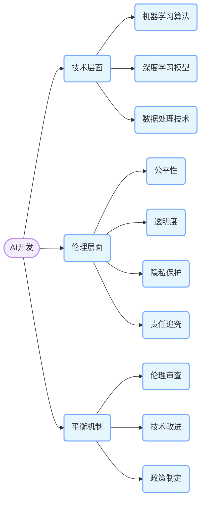

# 负责任的AI开发:伦理与技术的平衡

> 关键词：负责任的AI开发、伦理、技术平衡、AI伦理原则、技术实现

> 摘要：本文深入探讨了负责任的AI开发中伦理与技术平衡的重要性。首先介绍了相关背景，包括目的、预期读者等内容。接着阐述了核心概念，如AI伦理的内涵以及与技术的联系。详细讲解了核心算法原理及操作步骤，通过Python代码进行示例。从数学模型和公式的角度进一步剖析，辅以实际案例。进行了项目实战，包括开发环境搭建、代码实现与解读。列举了实际应用场景，推荐了相关工具和资源。最后总结了未来发展趋势与挑战，并提供了常见问题解答和参考资料，旨在为开发者在AI开发中实现伦理与技术的有效平衡提供全面的指导。

## 1. 背景介绍 
### 1.1 目的和范围
在当今数字化时代，人工智能（AI）技术正以前所未有的速度发展，并广泛应用于各个领域。然而，随着AI系统的日益复杂和强大，其带来的伦理问题也逐渐凸显。本文章的目的在于探讨如何在AI开发过程中实现伦理与技术的平衡，以确保AI系统的开发和应用既符合伦理原则，又能充分发挥技术的优势。

文章的范围涵盖了AI开发中常见的伦理问题，如公平性、透明度、隐私保护等，同时介绍了相应的技术手段和方法来解决这些问题。通过理论分析和实际案例，为AI开发者、研究人员以及相关决策者提供参考和指导。

### 1.2 预期读者
本文的预期读者主要包括以下几类人群：
- **AI开发者**：希望在开发过程中考虑伦理因素，避免开发出具有伦理争议的AI系统。
- **AI研究人员**：对AI伦理与技术的交叉领域感兴趣，希望深入了解相关理论和方法。
- **企业决策者**：负责制定AI发展战略和政策，需要了解如何在企业中推动负责任的AI开发。
- **政策制定者**：关注AI技术的社会影响，希望通过制定相关政策来引导AI的健康发展。

### 1.3 文档结构概述
本文将按照以下结构进行组织：
- **核心概念与联系**：介绍AI伦理的核心概念，以及伦理与技术之间的联系。
- **核心算法原理 & 具体操作步骤**：讲解实现负责任AI开发的核心算法原理，并给出具体的操作步骤。
- **数学模型和公式 & 详细讲解 & 举例说明**：通过数学模型和公式对相关算法进行深入分析，并结合实际案例进行说明。
- **项目实战：代码实际案例和详细解释说明**：通过一个具体的项目实战，展示如何在实际开发中实现伦理与技术的平衡。
- **实际应用场景**：介绍负责任的AI开发在不同领域的实际应用场景。
- **工具和资源推荐**：推荐一些学习、开发和研究负责任AI开发的工具和资源。
- **总结：未来发展趋势与挑战**：总结本文的主要内容，分析未来负责任AI开发的发展趋势和面临的挑战。
- **附录：常见问题与解答**：解答一些关于负责任AI开发的常见问题。
- **扩展阅读 & 参考资料**：提供一些扩展阅读的资料和参考文献。

### 1.4 术语表
#### 1.4.1 核心术语定义
- **负责任的AI开发**：指在AI开发过程中，充分考虑伦理、法律、社会等因素，确保AI系统的开发和应用符合人类的价值观和利益。
- **AI伦理**：研究AI技术在开发和应用过程中涉及的伦理问题，如公平性、透明度、隐私保护等。
- **技术平衡**：在AI开发中，平衡技术的发展和伦理的要求，使AI系统既具有高性能，又符合伦理原则。
- **公平性**：指AI系统在处理不同群体的数据时，不产生偏见或歧视。
- **透明度**：指AI系统的决策过程和算法原理能够被人类理解和解释。
- **隐私保护**：指保护用户的个人信息不被泄露和滥用。

#### 1.4.2 相关概念解释
- **可解释性AI**：指能够对其决策过程和结果进行解释的AI系统，有助于提高AI系统的透明度和可信度。
- **对抗训练**：一种机器学习技术，通过引入对抗机制来提高模型的鲁棒性和公平性。
- **差分隐私**：一种保护数据隐私的技术，通过在数据中添加噪声来防止数据泄露。

#### 1.4.3 缩略词列表
- **AI**：Artificial Intelligence，人工智能
- **ML**：Machine Learning，机器学习
- **DL**：Deep Learning，深度学习
- **DP**：Differential Privacy，差分隐私

## 2. 核心概念与联系 
### 核心概念原理
#### AI伦理的内涵
AI伦理是研究AI技术在开发和应用过程中涉及的伦理问题的学科。其核心内涵包括公平性、透明度、隐私保护、责任追究等方面。

公平性要求AI系统在处理不同群体的数据时，不产生偏见或歧视。例如，在招聘系统中，如果AI算法基于历史数据进行训练，而历史数据存在性别或种族偏见，那么招聘系统可能会对某些群体产生不利影响。

透明度要求AI系统的决策过程和算法原理能够被人类理解和解释。这有助于提高AI系统的可信度和可接受性。例如，在医疗诊断系统中，医生需要了解AI系统的诊断依据，以便做出正确的决策。

隐私保护要求保护用户的个人信息不被泄露和滥用。随着AI技术的发展，大量的个人数据被收集和分析，隐私保护变得尤为重要。例如，在智能语音助手系统中，用户的语音数据需要得到妥善的保护。

责任追究要求明确AI系统开发和应用过程中的责任主体，当AI系统造成损害时，能够追究相关责任。例如，在自动驾驶汽车发生事故时，需要明确是汽车制造商、AI算法开发者还是驾驶员的责任。

#### 技术与伦理的联系
技术和伦理在AI开发中是相互影响、相互制约的关系。一方面，技术的发展为解决伦理问题提供了手段和方法。例如，可解释性AI技术可以提高AI系统的透明度，差分隐私技术可以保护数据隐私。另一方面，伦理要求也对技术的发展提出了挑战和限制。例如，为了实现公平性，需要对AI算法进行改进和优化，避免算法产生偏见。

### 架构的文本示意图
以下是一个简单的文本示意图，展示了AI开发中伦理与技术的关系：

```plaintext
AI开发
|
|-- 技术层面
|   |-- 机器学习算法
|   |-- 深度学习模型
|   |-- 数据处理技术
|
|-- 伦理层面
|   |-- 公平性
|   |-- 透明度
|   |-- 隐私保护
|   |-- 责任追究
|
|-- 平衡机制
|   |-- 伦理审查
|   |-- 技术改进
|   |-- 政策制定
```

### Mermaid流程图


## 3. 核心算法原理 & 具体操作步骤 
### 核心算法原理
#### 可解释性AI算法
可解释性AI算法旨在让AI系统的决策过程和结果能够被人类理解和解释。其中一种常见的方法是使用决策树算法。决策树是一种基于树结构进行决策的算法，它通过对数据的特征进行划分，构建出一棵决策树。决策树的每个内部节点代表一个特征上的测试，每个分支代表一个测试输出，每个叶节点代表一个类别或值。

以下是一个简单的决策树算法的Python实现：

```python
from sklearn.datasets import load_iris
from sklearn.tree import DecisionTreeClassifier
from sklearn.tree import export_text

# 加载数据集
iris = load_iris()
X = iris.data
y = iris.target

# 创建决策树分类器
clf = DecisionTreeClassifier()

# 训练模型
clf.fit(X, y)

# 导出决策树规则
tree_rules = export_text(clf, feature_names=iris.feature_names)
print(tree_rules)
```

#### 对抗训练算法
对抗训练算法通过引入对抗机制来提高模型的鲁棒性和公平性。在对抗训练中，有两个模型：生成器和判别器。生成器试图生成虚假的数据，而判别器试图区分真实数据和虚假数据。通过不断的对抗训练，生成器和判别器的性能都会得到提高。

以下是一个简单的对抗训练算法的Python实现：

```python
import torch
import torch.nn as nn
import torch.optim as optim

# 定义生成器
class Generator(nn.Module):
    def __init__(self):
        super(Generator, self).__init__()
        self.fc = nn.Linear(10, 1)

    def forward(self, x):
        return self.fc(x)

# 定义判别器
class Discriminator(nn.Module):
    def __init__(self):
        super(Discriminator, self).__init__()
        self.fc = nn.Linear(1, 1)

    def forward(self, x):
        return self.fc(x)

# 初始化生成器和判别器
generator = Generator()
discriminator = Discriminator()

# 定义优化器和损失函数
g_optimizer = optim.Adam(generator.parameters(), lr=0.001)
d_optimizer = optim.Adam(discriminator.parameters(), lr=0.001)
criterion = nn.BCEWithLogitsLoss()

# 对抗训练
for epoch in range(100):
    # 训练判别器
    d_optimizer.zero_grad()
    real_data = torch.randn(10, 1)
    fake_data = generator(torch.randn(10, 10))
    real_labels = torch.ones(10, 1)
    fake_labels = torch.zeros(10, 1)

    real_output = discriminator(real_data)
    fake_output = discriminator(fake_data)

    d_loss_real = criterion(real_output, real_labels)
    d_loss_fake = criterion(fake_output, fake_labels)
    d_loss = d_loss_real + d_loss_fake
    d_loss.backward()
    d_optimizer.step()

    # 训练生成器
    g_optimizer.zero_grad()
    fake_data = generator(torch.randn(10, 10))
    fake_output = discriminator(fake_data)
    g_loss = criterion(fake_output, real_labels)
    g_loss.backward()
    g_optimizer.step()

    if epoch % 10 == 0:
        print(f'Epoch {epoch}: D_loss = {d_loss.item()}, G_loss = {g_loss.item()}')
```

### 具体操作步骤
#### 可解释性AI算法操作步骤
1. **数据准备**：收集和整理相关的数据，并进行数据预处理，如数据清洗、特征选择等。
2. **模型选择**：选择合适的可解释性AI算法，如决策树、线性回归等。
3. **模型训练**：使用准备好的数据对模型进行训练。
4. **模型解释**：使用相应的工具和方法对训练好的模型进行解释，如导出决策树规则、计算特征重要性等。

#### 对抗训练算法操作步骤
1. **定义生成器和判别器**：根据具体的任务和数据特点，定义生成器和判别器的网络结构。
2. **初始化模型和优化器**：初始化生成器和判别器的参数，并选择合适的优化器和损失函数。
3. **对抗训练**：在每个训练周期中，先训练判别器，再训练生成器，不断迭代直到模型收敛。
4. **模型评估**：使用测试数据对训练好的模型进行评估，检查模型的性能和公平性。

## 4. 数学模型和公式 & 详细讲解 & 举例说明 
### 可解释性AI算法的数学模型和公式
#### 决策树算法
决策树算法的核心是通过对数据的特征进行划分，构建出一棵决策树。在划分特征时，通常使用信息增益、基尼指数等指标来选择最优的划分特征。

信息增益的计算公式为：

$$IG(D, A) = H(D) - H(D|A)$$

其中，$IG(D, A)$ 表示特征 $A$ 对数据集 $D$ 的信息增益，$H(D)$ 表示数据集 $D$ 的信息熵，$H(D|A)$ 表示在特征 $A$ 给定的条件下，数据集 $D$ 的条件熵。

信息熵的计算公式为：

$$H(D) = -\sum_{k=1}^{K}p_k\log_2p_k$$

其中，$K$ 表示数据集 $D$ 中类别的数量，$p_k$ 表示第 $k$ 个类别的样本在数据集 $D$ 中所占的比例。

条件熵的计算公式为：

$$H(D|A) = \sum_{i=1}^{V}\frac{|D^i|}{|D|}H(D^i)$$

其中，$V$ 表示特征 $A$ 的取值个数，$D^i$ 表示特征 $A$ 取值为第 $i$ 个值的样本子集。

举例说明：假设有一个数据集 $D$，包含 10 个样本，分为两个类别：正类和负类，其中正类有 6 个样本，负类有 4 个样本。现在有一个特征 $A$，它有两个取值：$A_1$ 和 $A_2$，其中 $A_1$ 对应的样本有 4 个，包含 3 个正类样本和 1 个负类样本；$A_2$ 对应的样本有 6 个，包含 3 个正类样本和 3 个负类样本。

首先计算数据集 $D$ 的信息熵：

$$H(D) = -\frac{6}{10}\log_2\frac{6}{10} - \frac{4}{10}\log_2\frac{4}{10} \approx 0.971$$

然后计算特征 $A$ 取值为 $A_1$ 时的信息熵：

$$H(D^1) = -\frac{3}{4}\log_2\frac{3}{4} - \frac{1}{4}\log_2\frac{1}{4} \approx 0.811$$

特征 $A$ 取值为 $A_2$ 时的信息熵：

$$H(D^2) = -\frac{3}{6}\log_2\frac{3}{6} - \frac{3}{6}\log_2\frac{3}{6} = 1$$

接着计算条件熵：

$$H(D|A) = \frac{4}{10}H(D^1) + \frac{6}{10}H(D^2) = \frac{4}{10} \times 0.811 + \frac{6}{10} \times 1 \approx 0.924$$

最后计算信息增益：

$$IG(D, A) = H(D) - H(D|A) = 0.971 - 0.924 = 0.047$$

### 对抗训练算法的数学模型和公式
#### 生成对抗网络（GAN）
生成对抗网络（GAN）由生成器 $G$ 和判别器 $D$ 组成。生成器的目标是生成与真实数据分布相似的虚假数据，而判别器的目标是区分真实数据和虚假数据。

GAN的目标函数可以表示为：

$$\min_G \max_D V(D, G) = \mathbb{E}_{x\sim p_{data}(x)}[\log D(x)] + \mathbb{E}_{z\sim p_z(z)}[\log(1 - D(G(z)))]$$

其中，$p_{data}(x)$ 表示真实数据的分布，$p_z(z)$ 表示噪声数据的分布，$x$ 表示真实数据，$z$ 表示噪声数据，$G(z)$ 表示生成器生成的虚假数据，$D(x)$ 表示判别器对真实数据的判别结果，$D(G(z))$ 表示判别器对虚假数据的判别结果。

在训练过程中，判别器的目标是最大化 $V(D, G)$，而生成器的目标是最小化 $V(D, G)$。

举例说明：假设真实数据服从正态分布 $N(0, 1)$，噪声数据服从均匀分布 $U(-1, 1)$。生成器和判别器都是简单的线性神经网络。

在训练过程中，判别器会不断调整参数，使得对真实数据的判别结果趋近于 1，对虚假数据的判别结果趋近于 0。而生成器会不断调整参数，使得生成的虚假数据能够骗过判别器，即判别器对虚假数据的判别结果趋近于 1。

## 5. 项目实战：代码实际案例和详细解释说明 
### 5.1  开发环境搭建
#### 安装Python
首先，需要安装Python。可以从Python官方网站（https://www.python.org/downloads/）下载适合自己操作系统的Python版本，并按照安装向导进行安装。

#### 安装必要的库
在本项目中，需要使用一些常见的Python库，如`numpy`、`pandas`、`scikit-learn`、`torch`等。可以使用`pip`命令进行安装：

```sh
pip install numpy pandas scikit-learn torch
```

### 5.2  源代码详细实现和代码解读
#### 项目背景
本项目的目标是开发一个具有公平性的贷款审批系统。在传统的贷款审批系统中，可能会存在对某些群体的偏见，如性别、种族等。我们将使用对抗训练的方法来提高贷款审批系统的公平性。

#### 代码实现

```python
import numpy as np
import pandas as pd
import torch
import torch.nn as nn
import torch.optim as optim
from sklearn.model_selection import train_test_split
from sklearn.preprocessing import StandardScaler

# 加载数据集
data = pd.read_csv('loan_data.csv')

# 数据预处理
X = data.drop('approved', axis=1)
y = data['approved']

# 分离敏感特征（如性别）
sensitive_feature = X['gender']
X = X.drop('gender', axis=1)

# 数据标准化
scaler = StandardScaler()
X = scaler.fit_transform(X)

# 划分训练集和测试集
X_train, X_test, y_train, y_test, s_train, s_test = train_test_split(X, y, sensitive_feature, test_size=0.2, random_state=42)

# 转换为PyTorch张量
X_train = torch.FloatTensor(X_train)
y_train = torch.FloatTensor(y_train.values).view(-1, 1)
s_train = torch.FloatTensor(s_train.values).view(-1, 1)
X_test = torch.FloatTensor(X_test)
y_test = torch.FloatTensor(y_test.values).view(-1, 1)
s_test = torch.FloatTensor(s_test.values).view(-1, 1)

# 定义贷款审批模型
class LoanApprovalModel(nn.Module):
    def __init__(self):
        super(LoanApprovalModel, self).__init__()
        self.fc1 = nn.Linear(X_train.shape[1], 10)
        self.fc2 = nn.Linear(10, 1)

    def forward(self, x):
        x = torch.relu(self.fc1(x))
        x = torch.sigmoid(self.fc2(x))
        return x

# 定义公平性判别器
class FairnessDiscriminator(nn.Module):
    def __init__(self):
        super(FairnessDiscriminator, self).__init__()
        self.fc1 = nn.Linear(1, 10)
        self.fc2 = nn.Linear(10, 1)

    def forward(self, x):
        x = torch.relu(self.fc1(x))
        x = torch.sigmoid(self.fc2(x))
        return x

# 初始化模型
loan_model = LoanApprovalModel()
fairness_discriminator = FairnessDiscriminator()

# 定义优化器和损失函数
loan_optimizer = optim.Adam(loan_model.parameters(), lr=0.001)
fairness_optimizer = optim.Adam(fairness_discriminator.parameters(), lr=0.001)
criterion = nn.BCELoss()

# 对抗训练
for epoch in range(100):
    # 训练公平性判别器
    fairness_optimizer.zero_grad()
    loan_predictions = loan_model(X_train)
    fairness_predictions = fairness_discriminator(loan_predictions)
    fairness_loss = criterion(fairness_predictions, s_train)
    fairness_loss.backward()
    fairness_optimizer.step()

    # 训练贷款审批模型
    loan_optimizer.zero_grad()
    loan_predictions = loan_model(X_train)
    fairness_predictions = fairness_discriminator(loan_predictions)
    loan_loss = criterion(loan_predictions, y_train) - criterion(fairness_predictions, s_train)
    loan_loss.backward()
    loan_optimizer.step()

    if epoch % 10 == 0:
        print(f'Epoch {epoch}: Loan Loss = {loan_loss.item()}, Fairness Loss = {fairness_loss.item()}')

# 模型评估
with torch.no_grad():
    loan_predictions = loan_model(X_test)
    loan_predictions = (loan_predictions > 0.5).float()
    accuracy = (loan_predictions == y_test).float().mean()
    print(f'Test Accuracy: {accuracy.item()}')
```

### 5.3  代码解读与分析
#### 数据预处理
首先，加载贷款数据集，并将特征和标签分离。然后，分离出敏感特征（如性别），并对其他特征进行标准化处理。最后，将数据集划分为训练集和测试集，并转换为PyTorch张量。

#### 模型定义
定义了两个模型：贷款审批模型和公平性判别器。贷款审批模型是一个简单的两层神经网络，用于预测贷款是否批准。公平性判别器也是一个两层神经网络，用于判断贷款审批结果是否存在对敏感特征的偏见。

#### 对抗训练
在对抗训练过程中，先训练公平性判别器，使其能够准确地区分贷款审批结果是否存在对敏感特征的偏见。然后，训练贷款审批模型，使其在保证预测准确性的同时，尽量减少对敏感特征的依赖。

#### 模型评估
使用测试集对训练好的贷款审批模型进行评估，计算模型的准确率。

## 6. 实际应用场景 
### 金融领域
在金融领域，负责任的AI开发可以应用于贷款审批、风险评估、投资决策等方面。例如，在贷款审批中，通过使用可解释性AI算法和对抗训练算法，可以提高贷款审批系统的公平性和透明度，避免对某些群体的歧视。在风险评估中，通过对数据的隐私保护和伦理审查，可以确保风险评估结果的准确性和可靠性。

### 医疗领域
在医疗领域，负责任的AI开发可以应用于疾病诊断、药物研发、医疗影像分析等方面。例如，在疾病诊断中，通过使用可解释性AI算法，可以让医生更好地理解AI系统的诊断依据，提高诊断的准确性和可信度。在药物研发中，通过对数据的隐私保护和伦理审查，可以确保药物研发过程的合法性和安全性。

### 交通领域
在交通领域，负责任的AI开发可以应用于自动驾驶、智能交通管理等方面。例如，在自动驾驶中，通过对AI系统的伦理设计和测试，可以确保自动驾驶汽车的安全性和可靠性，避免发生交通事故。在智能交通管理中，通过对数据的隐私保护和伦理审查，可以确保交通管理系统的公平性和有效性。

### 教育领域
在教育领域，负责任的AI开发可以应用于个性化学习、智能辅导、教育评估等方面。例如，在个性化学习中，通过使用可解释性AI算法，可以让教师更好地了解学生的学习情况和需求，提供更有针对性的学习建议。在智能辅导中，通过对数据的隐私保护和伦理审查，可以确保学生的个人信息不被泄露和滥用。

## 7. 工具和资源推荐
### 7.1 学习资源推荐
#### 7.1.1 书籍推荐
- 《人工智能伦理》：本书系统地介绍了人工智能伦理的基本概念、理论和方法，以及人工智能在不同领域的伦理问题和解决方案。
- 《可解释性人工智能》：本书详细介绍了可解释性人工智能的技术和方法，包括决策树、线性回归、局部解释模型等。
- 《生成对抗网络实战》：本书通过大量的代码示例和实际案例，介绍了生成对抗网络的原理、实现和应用。

#### 7.1.2 在线课程
- Coursera上的“AI Ethics”课程：该课程由知名高校的教授授课，介绍了人工智能伦理的基本概念、理论和方法。
- edX上的“Interpretable Machine Learning”课程：该课程介绍了可解释性机器学习的技术和方法，包括决策树、线性回归、局部解释模型等。
- Udemy上的“Generative Adversarial Networks (GANs) in Python”课程：该课程通过大量的代码示例和实际案例，介绍了生成对抗网络的原理、实现和应用。

#### 7.1.3 技术博客和网站
- AI Ethics Lab：该网站提供了人工智能伦理的最新研究成果、案例分析和政策解读。
- Towards Data Science：该博客上有很多关于人工智能、机器学习和深度学习的技术文章，包括可解释性AI、对抗训练等方面的内容。
- OpenAI Blog：该博客上有很多关于人工智能的最新研究成果和技术应用，包括GPT系列模型的介绍和应用。

### 7.2 开发工具框架推荐
#### 7.2.1 IDE和编辑器
- PyCharm：一款专门为Python开发设计的集成开发环境，具有代码编辑、调试、版本控制等功能。
- Jupyter Notebook：一款交互式的笔记本，支持Python、R等多种编程语言，适合进行数据分析和模型训练。
- Visual Studio Code：一款轻量级的代码编辑器，支持多种编程语言，具有丰富的插件和扩展功能。

#### 7.2.2 调试和性能分析工具
- TensorBoard：一款用于可视化和分析深度学习模型训练过程的工具，可以查看模型的损失曲线、准确率曲线、梯度分布等信息。
- PyTorch Profiler：一款用于分析PyTorch模型性能的工具，可以查看模型的计算时间、内存使用情况等信息。
- Scikit-learn的模型评估工具：Scikit-learn提供了一系列的模型评估工具，如准确率、召回率、F1值等，可以用于评估模型的性能。

#### 7.2.3 相关框架和库
- PyTorch：一个开源的深度学习框架，具有动态图计算、自动求导等功能，适合进行深度学习模型的开发和训练。
- TensorFlow：一个开源的深度学习框架，具有分布式训练、模型部署等功能，适合进行大规模深度学习模型的开发和训练。
- Scikit-learn：一个开源的机器学习库，提供了各种机器学习算法和工具，如分类、回归、聚类等，适合进行机器学习模型的开发和训练。

### 7.3 相关论文著作推荐
#### 7.3.1 经典论文
- “Generative Adversarial Networks”：该论文首次提出了生成对抗网络的概念，开创了生成式模型的新纪元。
- “Explaining and Harnessing Adversarial Examples”：该论文首次提出了对抗样本的概念，并探讨了对抗样本的产生原因和应对方法。
- “Fairness in Machine Learning”：该论文系统地介绍了机器学习中的公平性问题，包括公平性的定义、评估方法和解决方案。

#### 7.3.2 最新研究成果
- “Transformers: State-of-the-Art Natural Language Processing”：该论文介绍了Transformer架构在自然语言处理领域的最新研究成果和应用。
- “Deep Learning for Healthcare: A Survey”：该论文介绍了深度学习在医疗领域的最新研究成果和应用，包括疾病诊断、药物研发、医疗影像分析等方面。
- “Ethical AI: A Framework for Accountable Design and Development”：该论文提出了一个负责任的AI开发框架，包括伦理审查、技术改进、政策制定等方面。

#### 7.3.3 应用案例分析
- “AI in Finance: Transforming the Financial Industry”：该案例分析了人工智能在金融领域的应用，包括贷款审批、风险评估、投资决策等方面。
- “AI in Healthcare: Improving Patient Outcomes”：该案例分析了人工智能在医疗领域的应用，包括疾病诊断、药物研发、医疗影像分析等方面。
- “AI in Transportation: Autonomous Vehicles and Smart Mobility”：该案例分析了人工智能在交通领域的应用，包括自动驾驶、智能交通管理等方面。

## 8. 总结：未来发展趋势与挑战
### 未来发展趋势
#### 伦理与技术的深度融合
未来，伦理将更加深入地融入到AI技术的开发和应用中。开发者将更加注重AI系统的公平性、透明度和隐私保护，通过技术手段来解决伦理问题。例如，可解释性AI技术将得到更广泛的应用，使得AI系统的决策过程和结果能够被人类理解和解释。

#### 跨学科研究的加强
负责任的AI开发需要跨学科的研究和合作，涉及计算机科学、伦理学、法学、社会学等多个领域。未来，不同学科之间的交流和合作将更加频繁，共同推动负责任的AI开发的发展。

#### 国际合作与标准制定
随着AI技术的全球化发展，国际合作和标准制定将变得越来越重要。各国将加强在AI伦理和技术方面的合作，共同制定相关的标准和规范，以确保AI技术的健康发展。

### 面临的挑战
#### 伦理标准的制定和统一
目前，关于AI伦理的标准和规范还没有完全统一，不同国家和组织之间存在一定的差异。如何制定统一的伦理标准和规范，是未来面临的一个重要挑战。

#### 技术的局限性
虽然目前已经有一些技术手段可以解决AI开发中的伦理问题，但这些技术还存在一定的局限性。例如，可解释性AI技术在处理复杂的深度学习模型时，仍然存在一定的困难。如何突破技术的局限性，是未来需要解决的一个重要问题。

#### 社会接受度的提高
负责任的AI开发不仅需要技术上的支持，还需要社会的广泛接受。目前，一些人对AI技术存在担忧和恐惧，担心AI技术会对人类的就业、隐私和安全造成威胁。如何提高社会对AI技术的接受度，是未来需要解决的一个重要问题。

## 9. 附录：常见问题与解答
### 问题1：什么是负责任的AI开发？
负责任的AI开发是指在AI开发过程中，充分考虑伦理、法律、社会等因素，确保AI系统的开发和应用符合人类的价值观和利益。它包括公平性、透明度、隐私保护、责任追究等方面。

### 问题2：为什么要在AI开发中考虑伦理问题？
随着AI技术的日益复杂和强大，其带来的伦理问题也逐渐凸显。例如，AI系统可能会产生偏见和歧视，侵犯用户的隐私，甚至对人类的安全造成威胁。因此，在AI开发中考虑伦理问题，有助于确保AI技术的健康发展，保护人类的利益。

### 问题3：如何实现AI开发中的伦理与技术平衡？
实现AI开发中的伦理与技术平衡需要从多个方面入手。一方面，需要采用先进的技术手段来解决伦理问题，如可解释性AI技术、对抗训练技术等。另一方面，需要建立健全的伦理审查机制和政策法规，对AI开发和应用进行规范和监督。

### 问题4：可解释性AI技术有哪些应用场景？
可解释性AI技术可以应用于多个领域，如金融、医疗、交通、教育等。在金融领域，可解释性AI技术可以用于贷款审批、风险评估等方面，提高系统的公平性和透明度。在医疗领域，可解释性AI技术可以用于疾病诊断、药物研发等方面，让医生更好地理解AI系统的诊断依据。

### 问题5：对抗训练技术如何提高AI系统的公平性？
对抗训练技术通过引入对抗机制来提高AI系统的公平性。在对抗训练中，有两个模型：生成器和判别器。生成器试图生成虚假的数据，而判别器试图区分真实数据和虚假数据。通过不断的对抗训练，生成器和判别器的性能都会得到提高，从而使AI系统能够更好地处理不同群体的数据，避免产生偏见和歧视。

## 10. 扩展阅读 & 参考资料
### 扩展阅读
- 《AI 3.0》：本书介绍了人工智能的发展历程、技术原理和应用场景，以及人工智能面临的挑战和未来发展趋势。
- 《人类简史：从动物到上帝》：本书从人类的进化历程出发，探讨了人类与技术的关系，以及人工智能对人类社会的影响。
- 《算法霸权：数学杀伤性武器的威胁与不公》：本书揭示了算法在社会各个领域的应用中可能带来的不公平和危害，以及如何应对这些问题。

### 参考资料
- IEEE Global Initiative on Ethics of Autonomous and Intelligent Systems. (2019). IEEE Ethically Aligned Design: A Vision for Prioritizing Human Well-Being with Autonomous and Intelligent Systems.
- European Commission. (2019). Ethics Guidelines for Trustworthy AI.
- Floridi, L., & Cowls, J. (2019). A Unified Framework of Five Principles for AI in Society. Philosophy & Technology, 32(4), 689-707.