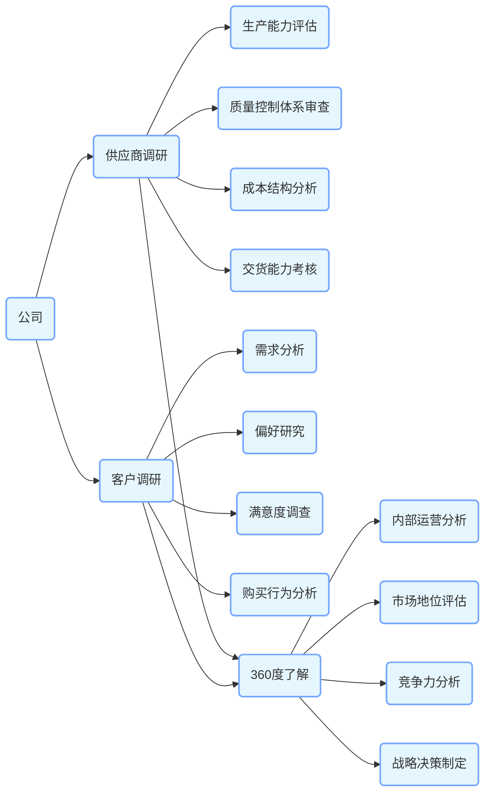

# 费雪的供应商客户调研：360度了解公司

> 关键词：费雪、供应商调研、客户调研、360度了解、公司分析、市场洞察、商业决策

> 摘要：本文聚焦于费雪的供应商客户调研方法，旨在探讨如何通过全面深入的供应商与客户调研实现对公司360度的了解。通过对相关核心概念、算法原理、数学模型等的详细阐述，结合项目实战案例与实际应用场景分析，为企业提供从调研到决策的全流程指导。同时，推荐了学习资源、开发工具和相关论文著作，帮助读者深入理解和应用该调研方法，最后对未来发展趋势与挑战进行总结，并提供常见问题解答和扩展阅读参考资料。

## 1. 背景介绍 
### 1.1 目的和范围
在竞争激烈的商业环境中，企业要想取得成功，必须全面了解自身的运营状况和市场地位。费雪的供应商客户调研方法就是为了满足这一需求而产生的。其目的在于通过对供应商和客户的全方位调研，深入了解公司在供应链和市场中的表现，发现潜在的问题和机会，为公司的战略决策、产品优化、客户关系管理等提供有力支持。

本调研方法的范围涵盖了与公司有业务往来的所有供应商和客户，包括原材料供应商、零部件供应商、经销商、终端客户等。通过对他们的调研，可以获取关于产品质量、价格、交货期、服务水平、市场需求、竞争态势等多方面的信息。

### 1.2 预期读者
本文的预期读者主要包括企业的高层管理人员、市场调研人员、供应链管理人员、市场营销人员等。对于希望深入了解企业运营状况、提升市场竞争力的人士，以及从事相关学术研究的人员也具有一定的参考价值。

### 1.3 文档结构概述
本文将按照以下结构展开：首先介绍相关的核心概念和它们之间的联系，通过文本示意图和Mermaid流程图进行清晰展示；接着阐述核心算法原理和具体操作步骤，并使用Python源代码进行详细说明；然后介绍数学模型和公式，并结合具体例子进行讲解；之后通过项目实战案例，详细解释开发环境搭建、源代码实现和代码解读；再分析实际应用场景；推荐相关的工具和资源；总结未来发展趋势与挑战；提供常见问题与解答；最后列出扩展阅读和参考资料。

### 1.4 术语表
#### 1.4.1 核心术语定义
- **供应商调研**：指对公司的供应商进行全面的调查和评估，包括供应商的生产能力、质量控制体系、成本结构、交货能力等方面的调研。
- **客户调研**：是对公司的客户进行的调查研究，旨在了解客户的需求、偏好、满意度、购买行为等信息。
- **360度了解**：意味着从多个角度、多个层面全面深入地了解公司的运营状况、市场地位、竞争力等，包括内部和外部的各种因素。

#### 1.4.2 相关概念解释
- **供应链管理**：是对供应链中的物流、信息流和资金流进行计划、组织、协调和控制的过程，以实现供应链的高效运作和价值最大化。
- **市场洞察**：通过对市场信息的收集、分析和解读，深入了解市场动态、客户需求和竞争态势，为企业的决策提供依据。

#### 1.4.3 缩略词列表
- **CRM**：Customer Relationship Management，客户关系管理
- **SCM**：Supply Chain Management，供应链管理

## 2. 核心概念与联系 

### 核心概念原理
费雪的供应商客户调研基于这样一个原理：公司的运营是一个复杂的生态系统，供应商和客户是这个生态系统中最重要的两个环节。供应商的表现直接影响公司的产品质量、成本和交货期，而客户的需求和满意度则决定了公司的市场份额和盈利能力。通过对供应商和客户的调研，可以获取大量的信息，这些信息可以帮助公司优化供应链管理、改进产品和服务、提高客户满意度，从而提升公司的整体竞争力。

### 架构的文本示意图
```plaintext
公司
|
|-- 供应商调研
|   |-- 生产能力评估
|   |-- 质量控制体系审查
|   |-- 成本结构分析
|   |-- 交货能力考核
|
|-- 客户调研
|   |-- 需求分析
|   |-- 偏好研究
|   |-- 满意度调查
|   |-- 购买行为分析
|
|-- 360度了解
|   |-- 内部运营分析
|   |-- 市场地位评估
|   |-- 竞争力分析
|   |-- 战略决策制定
```

### Mermaid流程图


## 3. 核心算法原理 & 具体操作步骤 

### 核心算法原理
在费雪的供应商客户调研中，我们可以使用聚类分析算法对供应商和客户进行分类，以便更好地了解他们的特征和需求。聚类分析是一种无监督学习算法，它的基本思想是将数据集中的样本根据它们的相似性划分为不同的类别，使得同一类别内的样本相似度较高，不同类别间的样本相似度较低。

### 具体操作步骤
1. **数据收集**：收集供应商和客户的相关数据，包括供应商的生产能力、质量控制指标、成本数据等，以及客户的需求信息、购买记录、满意度评分等。
2. **数据预处理**：对收集到的数据进行清洗、转换和归一化处理，以消除数据中的噪声和不一致性，提高数据的质量。
3. **特征选择**：从预处理后的数据中选择与调研目标相关的特征，作为聚类分析的输入。
4. **聚类分析**：使用聚类算法（如K-Means算法）对数据进行聚类，得到不同的供应商和客户类别。
5. **结果分析**：对聚类结果进行分析，了解不同类别供应商和客户的特征和需求，为公司的决策提供依据。

### Python源代码实现
```python
import numpy as np
from sklearn.cluster import KMeans
from sklearn.preprocessing import StandardScaler

# 模拟供应商和客户数据
# 假设每个样本有3个特征
data = np.array([[1, 2, 3], [4, 5, 6], [7, 8, 9], [10, 11, 12], [13, 14, 15]])

# 数据预处理：归一化
scaler = StandardScaler()
scaled_data = scaler.fit_transform(data)

# 聚类分析
kmeans = KMeans(n_clusters=2, random_state=42)
kmeans.fit(scaled_data)

# 聚类结果
labels = kmeans.labels_
centroids = kmeans.cluster_centers_

print("聚类标签:", labels)
print("聚类中心:", centroids)
```

## 4. 数学模型和公式 & 详细讲解 & 举例说明 

### 数学模型
在聚类分析中，K-Means算法的目标是最小化所有样本到其所属聚类中心的距离之和。设数据集 $X = \{x_1, x_2, \cdots, x_n\}$，其中 $x_i \in \mathbb{R}^d$ 表示第 $i$ 个样本，共有 $n$ 个样本，每个样本有 $d$ 个特征。我们要将这些样本划分为 $k$ 个聚类，每个聚类的中心为 $c_j \in \mathbb{R}^d$，$j = 1, 2, \cdots, k$。

### 公式
K-Means算法的目标函数可以表示为：
$$
J = \sum_{i=1}^{n} \min_{j=1,2,\cdots,k} \| x_i - c_j \|^2
$$
其中，$\| x_i - c_j \|^2$ 表示样本 $x_i$ 到聚类中心 $c_j$ 的欧几里得距离的平方。

### 详细讲解
K-Means算法的基本步骤如下：
1. **初始化**：随机选择 $k$ 个样本作为初始聚类中心。
2. **分配样本**：对于每个样本 $x_i$，计算它到所有聚类中心的距离，将其分配到距离最近的聚类中心所在的聚类中。
3. **更新聚类中心**：对于每个聚类，计算该聚类中所有样本的均值，将其作为新的聚类中心。
4. **重复步骤2和3**：直到聚类中心不再发生变化或达到最大迭代次数。

### 举例说明
假设我们有一个二维数据集 $X = \{(1, 2), (2, 3), (8, 9), (9, 10)\}$，我们要将其划分为 $k = 2$ 个聚类。

1. **初始化**：随机选择 $(1, 2)$ 和 $(8, 9)$ 作为初始聚类中心。
2. **分配样本**：
    - 对于样本 $(1, 2)$，它到 $(1, 2)$ 的距离为 $0$，到 $(8, 9)$ 的距离为 $\sqrt{(1 - 8)^2 + (2 - 9)^2} = \sqrt{49 + 49} = \sqrt{98}$，所以将其分配到以 $(1, 2)$ 为中心的聚类中。
    - 对于样本 $(2, 3)$，它到 $(1, 2)$ 的距离为 $\sqrt{(2 - 1)^2 + (3 - 2)^2} = \sqrt{2}$，到 $(8, 9)$ 的距离为 $\sqrt{(2 - 8)^2 + (3 - 9)^2} = \sqrt{36 + 36} = \sqrt{72}$，所以将其分配到以 $(1, 2)$ 为中心的聚类中。
    - 对于样本 $(8, 9)$，它到 $(1, 2)$ 的距离为 $\sqrt{(8 - 1)^2 + (9 - 2)^2} = \sqrt{49 + 49} = \sqrt{98}$，到 $(8, 9)$ 的距离为 $0$，所以将其分配到以 $(8, 9)$ 为中心的聚类中。
    - 对于样本 $(9, 10)$，它到 $(1, 2)$ 的距离为 $\sqrt{(9 - 1)^2 + (10 - 2)^2} = \sqrt{64 + 64} = \sqrt{128}$，到 $(8, 9)$ 的距离为 $\sqrt{(9 - 8)^2 + (10 - 9)^2} = \sqrt{2}$，所以将其分配到以 $(8, 9)$ 为中心的聚类中。
3. **更新聚类中心**：
    - 以 $(1, 2)$ 为中心的聚类中有样本 $(1, 2)$ 和 $(2, 3)$，新的聚类中心为 $(\frac{1 + 2}{2}, \frac{2 + 3}{2}) = (1.5, 2.5)$。
    - 以 $(8, 9)$ 为中心的聚类中有样本 $(8, 9)$ 和 $(9, 10)$，新的聚类中心为 $(\frac{8 + 9}{2}, \frac{9 + 10}{2}) = (8.5, 9.5)$。
4. **重复步骤2和3**：直到聚类中心不再发生变化。

## 5. 项目实战：代码实际案例和详细解释说明 

### 5.1  开发环境搭建
在进行费雪的供应商客户调研项目实战时，我们需要搭建以下开发环境：
1. **Python环境**：建议使用Python 3.7及以上版本。可以从Python官方网站（https://www.python.org/downloads/）下载并安装。
2. **开发工具**：可以使用PyCharm、Jupyter Notebook等开发工具。这里我们推荐使用Jupyter Notebook，它可以方便地进行代码编写、调试和结果展示。
3. **相关库**：需要安装NumPy、pandas、scikit-learn等库。可以使用以下命令进行安装：
```sh
pip install numpy pandas scikit-learn
```

### 5.2  源代码详细实现和代码解读
```python
import numpy as np
import pandas as pd
from sklearn.cluster import KMeans
from sklearn.preprocessing import StandardScaler
import matplotlib.pyplot as plt

# 读取供应商和客户数据
data = pd.read_csv('supplier_customer_data.csv')

# 数据预处理
# 提取特征列
features = data[['feature1', 'feature2', 'feature3']]

# 数据归一化
scaler = StandardScaler()
scaled_features = scaler.fit_transform(features)

# 聚类分析
# 使用手肘法确定最优的聚类数
wcss = []
for i in range(1, 11):
    kmeans = KMeans(n_clusters=i, init='k-means++', random_state=42)
    kmeans.fit(scaled_features)
    wcss.append(kmeans.inertia_)

# 绘制手肘图
plt.plot(range(1, 11), wcss)
plt.title('The Elbow Method')
plt.xlabel('Number of clusters')
plt.ylabel('WCSS')
plt.show()

# 根据手肘图选择最优的聚类数
optimal_clusters = 3

# 重新进行聚类分析
kmeans = KMeans(n_clusters=optimal_clusters, init='k-means++', random_state=42)
kmeans.fit(scaled_features)

# 聚类结果
labels = kmeans.labels_
centroids = kmeans.cluster_centers_

# 将聚类标签添加到原始数据中
data['cluster'] = labels

# 保存结果
data.to_csv('clustered_data.csv', index=False)
```

### 5.3  代码解读与分析
1. **数据读取**：使用 `pandas` 库的 `read_csv` 函数读取供应商和客户数据文件 `supplier_customer_data.csv`。
2. **数据预处理**：提取需要的特征列，并使用 `StandardScaler` 对数据进行归一化处理，以消除不同特征之间的量纲差异。
3. **手肘法确定最优聚类数**：通过遍历不同的聚类数，计算每个聚类数下的WCSS（Within-Cluster Sum of Squares），并绘制手肘图。WCSS表示所有样本到其所属聚类中心的距离平方和，随着聚类数的增加，WCSS会逐渐减小。手肘图中，WCSS下降速度突然变缓的点对应的聚类数即为最优聚类数。
4. **聚类分析**：根据手肘图选择最优的聚类数，重新进行聚类分析，并将聚类标签添加到原始数据中。
5. **结果保存**：将带有聚类标签的数据保存到文件 `clustered_data.csv` 中，以便后续分析和决策。

## 6. 实际应用场景 
### 供应商管理
通过对供应商的调研和聚类分析，企业可以将供应商分为不同的类别，如优质供应商、普通供应商、潜在风险供应商等。对于优质供应商，可以建立长期稳定的合作关系，给予更多的订单和优惠政策；对于普通供应商，可以加强管理和监督，促使其提高产品质量和服务水平；对于潜在风险供应商，要及时采取措施，降低合作风险。

### 客户关系管理
对客户的调研和聚类分析可以帮助企业了解不同客户群体的需求和偏好，从而制定个性化的营销策略和服务方案。例如，对于高价值客户，可以提供专属的产品和服务，提高客户满意度和忠诚度；对于潜在客户，可以通过精准的营销活动，吸引他们成为企业的正式客户。

### 产品优化
通过了解供应商的生产能力和客户的需求，企业可以对产品进行优化。例如，根据供应商提供的新材料和新技术，改进产品的性能和质量；根据客户的反馈和需求，调整产品的功能和设计，提高产品的市场竞争力。

### 战略决策制定
综合供应商和客户的信息，企业可以制定更加科学合理的战略决策。例如，根据市场需求和供应商的供应能力，决定是否扩大生产规模；根据客户的满意度和竞争对手的情况，决定是否推出新产品或进入新市场。

## 7. 工具和资源推荐
### 7.1 学习资源推荐
#### 7.1.1 书籍推荐
- 《Python数据分析实战》：介绍了使用Python进行数据分析的方法和技巧，包括数据处理、可视化、机器学习等方面的内容。
- 《机器学习实战》：通过实际案例介绍了机器学习的基本算法和应用，适合初学者入门。
- 《供应链管理：战略、规划与运营》：全面介绍了供应链管理的理论和实践，对于理解供应商调研和管理有很大帮助。

#### 7.1.2 在线课程
- Coursera上的“Data Science Specialization”：提供了数据科学的系统学习课程，包括数据处理、机器学习、数据分析等方面的内容。
- edX上的“Introduction to Machine Learning”：介绍了机器学习的基本概念和算法，适合初学者学习。
- Udemy上的“Supply Chain Management Fundamentals”：讲解了供应链管理的基础知识和实践经验。

#### 7.1.3 技术博客和网站
- 博客园：有很多关于数据分析、机器学习和供应链管理的技术文章和经验分享。
- 开源中国：提供了丰富的开源项目和技术资讯，对于学习和实践有很大帮助。
- Kaggle：是一个数据科学竞赛平台，上面有很多优秀的数据分析和机器学习案例，可以学习和借鉴。

### 7.2 开发工具框架推荐
#### 7.2.1 IDE和编辑器
- PyCharm：是一款功能强大的Python集成开发环境，提供了代码编辑、调试、版本控制等功能。
- Jupyter Notebook：是一个交互式的开发环境，适合进行数据探索、分析和可视化。
- Visual Studio Code：是一款轻量级的代码编辑器，支持多种编程语言和插件扩展。

#### 7.2.2 调试和性能分析工具
- PySnooper：可以在不修改代码的情况下，自动记录函数的执行过程和变量的值，方便调试。
- cProfile：是Python内置的性能分析工具，可以分析代码的执行时间和函数调用次数。
- Memory Profiler：可以分析Python代码的内存使用情况，帮助优化内存性能。

#### 7.2.3 相关框架和库
- NumPy：是Python中用于科学计算的基础库，提供了高效的数组操作和数学函数。
- pandas：是Python中用于数据处理和分析的库，提供了灵活的数据结构和数据操作方法。
- scikit-learn：是Python中用于机器学习的库，提供了丰富的机器学习算法和工具。

### 7.3 相关论文著作推荐
#### 7.3.1 经典论文
- “Cluster Analysis in Data Mining: A Tutorial”：介绍了数据挖掘中聚类分析的基本概念、算法和应用。
- “Supply Chain Risk Management: A Literature Review”：对供应链风险管理的相关研究进行了综述。
- “Customer Relationship Management: A Review of the Literature”：对客户关系管理的理论和实践进行了总结和分析。

#### 7.3.2 最新研究成果
- 关注顶级学术期刊，如《Management Science》、《Operations Research》、《Journal of Marketing》等，这些期刊上发表了很多关于供应链管理、市场营销和数据分析的最新研究成果。
- 参加相关的学术会议，如INFORMS Annual Meeting、ACM SIGKDD Conference等，了解行业的最新动态和研究进展。

#### 7.3.3 应用案例分析
- 一些商业咨询公司和行业协会会发布关于供应商管理、客户关系管理等方面的应用案例分析报告，可以从中学习到实际应用中的经验和方法。
- 企业自身也可以通过内部案例分析，总结在供应商客户调研和管理方面的成功经验和教训。

## 8. 总结：未来发展趋势与挑战
### 未来发展趋势
1. **数字化转型**：随着信息技术的不断发展，企业将越来越多地采用数字化手段进行供应商客户调研。例如，利用大数据、人工智能等技术，实现数据的自动收集、分析和决策支持。
2. **智能化决策**：通过机器学习和深度学习算法，对供应商和客户数据进行深入挖掘和分析，实现智能化的决策。例如，自动预测供应商的交货期和客户的需求，为企业的生产和销售提供准确的决策依据。
3. **生态化合作**：企业将更加注重与供应商和客户的生态化合作，形成互利共赢的合作模式。例如，通过共享数据、技术和资源，实现供应链的协同优化和客户价值的最大化。

### 挑战
1. **数据安全和隐私保护**：在数字化调研过程中，涉及大量的供应商和客户数据，数据安全和隐私保护成为一个重要的挑战。企业需要采取有效的措施，确保数据的安全性和保密性。
2. **数据质量和整合**：由于供应商和客户的数据来源广泛，数据质量和整合成为一个难题。企业需要建立完善的数据质量管理体系，对数据进行清洗、转换和整合，提高数据的质量和可用性。
3. **人才短缺**：数字化调研需要具备数据分析、机器学习、供应链管理等多方面知识和技能的人才，目前这类人才相对短缺。企业需要加强人才培养和引进，提高自身的数字化能力。

## 9. 附录：常见问题与解答
### 1. 如何确保供应商和客户数据的真实性和可靠性？
- 可以通过多渠道收集数据，进行交叉验证。例如，对于供应商的数据，可以从其官方网站、行业报告、合作伙伴等多个渠道获取，并进行对比分析。
- 建立数据审核机制，对收集到的数据进行审核和验证。例如，对于客户的满意度数据，可以通过回访等方式进行核实。

### 2. 聚类分析的结果不准确怎么办？
- 检查数据预处理是否正确，确保数据的质量和一致性。
- 尝试不同的聚类算法和参数，找到最适合的聚类方法。
- 增加数据量，提高聚类分析的准确性。

### 3. 如何将调研结果应用到实际决策中？
- 建立决策模型，将调研结果作为输入，通过量化分析和模拟实验，制定科学合理的决策方案。
- 与相关部门和人员进行沟通和交流，确保决策方案的可行性和可操作性。
- 对决策方案的实施效果进行跟踪和评估，及时调整和优化决策方案。

## 10. 扩展阅读 & 参考资料
### 扩展阅读
- 《大数据时代：生活、工作与思维的大变革》：介绍了大数据对社会和企业的影响，以及如何利用大数据进行决策和创新。
- 《人工智能时代：与机器人共舞的未来》：探讨了人工智能的发展趋势和应用前景，以及对企业和社会的挑战和机遇。

### 参考资料
- 相关的学术论文、行业报告和企业案例分析。
- 相关的书籍、在线课程和技术博客。
- 官方文档和技术手册，如NumPy、pandas、scikit-learn等库的官方文档。