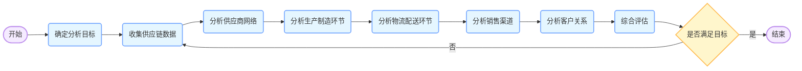

# 费雪的供应链分析：了解公司在产业链中的地位

> 关键词：费雪供应链分析、产业链地位、供应链管理、企业竞争力、价值链

> 摘要：本文聚焦于费雪的供应链分析方法，旨在深入探讨如何通过该分析了解公司在产业链中的地位。首先介绍了费雪供应链分析的背景知识，包括目的、预期读者等内容。接着阐述了核心概念与联系，构建了相关的原理和架构示意图与流程图。详细讲解了核心算法原理及具体操作步骤，结合数学模型和公式进行举例说明。通过项目实战展示代码案例并进行详细解释。探讨了该分析方法的实际应用场景，推荐了相关的学习资源、开发工具框架以及论文著作。最后总结了未来发展趋势与挑战，提供常见问题解答和扩展阅读参考资料，帮助读者全面掌握费雪的供应链分析方法，以更好地评估公司在产业链中的地位。

## 1. 背景介绍 
### 1.1 目的和范围
费雪的供应链分析方法是一种重要的工具，其目的在于全面、深入地了解公司在产业链中的地位。通过对供应链各个环节的分析，能够洞察公司与供应商、客户之间的关系，以及在整个产业链中的价值创造和竞争优势。范围涵盖了从原材料采购到产品最终交付给客户的全过程，包括供应商管理、生产制造、物流配送、销售渠道等多个方面。

### 1.2 预期读者
本文预期读者包括企业管理者、供应链管理人员、市场分析师、投资者以及对供应链管理和企业竞争策略感兴趣的研究人员。企业管理者可以通过本文了解如何运用费雪的供应链分析方法优化企业的供应链策略，提升企业在产业链中的地位；供应链管理人员能够从中获取更有效的管理思路和方法；市场分析师和投资者可以借助该分析方法评估企业的竞争力和发展潜力；研究人员则可以将其作为学术研究的参考依据。

### 1.3 文档结构概述
本文将按照以下结构进行阐述：首先介绍费雪的供应链分析的背景知识，包括目的、预期读者等内容；接着深入讲解核心概念与联系，构建相关的原理和架构示意图与流程图；详细说明核心算法原理及具体操作步骤，结合数学模型和公式进行举例说明；通过项目实战展示代码案例并进行详细解释；探讨该分析方法的实际应用场景；推荐相关的学习资源、开发工具框架以及论文著作；最后总结未来发展趋势与挑战，提供常见问题解答和扩展阅读参考资料。

### 1.4 术语表
#### 1.4.1 核心术语定义
- **供应链**：是指生产及流通过程中，涉及将产品或服务提供给最终用户活动的上游与下游企业所形成的网链结构。
- **产业链**：是产业经济学中的一个概念，是各个产业部门之间基于一定的技术经济关联，并依据特定的逻辑关系和时空布局关系客观形成的链条式关联关系形态。
- **费雪的供应链分析**：是一种基于供应链各个环节的数据分析和评估方法，旨在确定公司在产业链中的地位和竞争力。

#### 1.4.2 相关概念解释
- **供应商管理**：是指对供应商的开发、选择、评估、控制和激励等一系列活动，以确保供应商能够提供符合企业需求的产品和服务。
- **价值链**：是指企业为了满足客户需求，创造价值而进行的一系列活动的集合，包括基本活动和支持活动。
- **竞争优势**：是指企业在市场竞争中相对于竞争对手所具有的优势，包括成本优势、差异化优势等。

#### 1.4.3 缩略词列表
- **ERP**：Enterprise Resource Planning，企业资源计划
- **SCM**：Supply Chain Management，供应链管理
- **CRM**：Customer Relationship Management，客户关系管理

## 2. 核心概念与联系 
### 费雪的供应链分析原理
费雪的供应链分析基于对供应链各个环节的深入研究，通过分析供应链的效率、成本、质量等因素，来评估公司在产业链中的地位。其核心思想是将供应链视为一个整体，各个环节之间相互关联、相互影响。通过对供应链的优化和协调，可以提高企业的竞争力和市场份额。

### 架构示意图
以下是费雪的供应链分析的架构示意图：

```plaintext
               产业链
            /           \
      供应商网络       客户网络
        /    \          /    \
 原材料供应 零部件制造  销售渠道  最终客户
        |        |        |        |
  生产制造  物流配送  市场营销  售后服务
        |        |        |        |
  质量控制  成本管理  客户关系  品牌建设
```

### Mermaid 流程图


## 3. 核心算法原理 & 具体操作步骤 
### 核心算法原理
费雪的供应链分析主要基于多指标综合评估算法。该算法通过对供应链各个环节的多个指标进行量化分析，然后根据各个指标的权重进行加权求和，得到一个综合评估得分。具体来说，设供应链的第 $i$ 个环节有 $n_i$ 个指标，第 $j$ 个指标的取值为 $x_{ij}$，权重为 $w_{ij}$，则该环节的得分 $S_i$ 为：

$$S_i = \sum_{j=1}^{n_i} w_{ij} x_{ij}$$

整个供应链的综合评估得分 $S$ 为各个环节得分的加权和：

$$S = \sum_{i=1}^{m} \alpha_i S_i$$

其中，$\alpha_i$ 为第 $i$ 个环节的权重，$m$ 为供应链的环节数。

### 具体操作步骤
1. **确定分析目标**：明确要评估的公司以及评估的具体目标，例如了解公司在产业链中的竞争力、寻找供应链的优化点等。
2. **收集供应链数据**：收集与供应链各个环节相关的数据，包括供应商信息、生产数据、物流数据、销售数据等。
3. **指标选择与权重确定**：根据分析目标，选择合适的指标，并确定各个指标的权重。例如，对于供应商环节，可以选择供应商的交货准时率、产品质量合格率等指标；对于生产环节，可以选择生产效率、成本控制等指标。
4. **数据预处理**：对收集到的数据进行清洗、转换和标准化处理，以确保数据的准确性和可比性。
5. **计算环节得分**：根据上述公式，计算供应链各个环节的得分。
6. **计算综合评估得分**：根据各个环节的权重，计算整个供应链的综合评估得分。
7. **结果分析与决策**：根据综合评估得分，分析公司在产业链中的地位，找出供应链的优势和劣势，制定相应的优化策略。

### Python 源代码实现
```python
import numpy as np

# 定义供应链环节数
m = 5
# 定义每个环节的指标数
n = [3, 4, 3, 2, 2]
# 定义每个环节的权重
alpha = np.array([0.2, 0.3, 0.2, 0.15, 0.15])
# 定义每个指标的权重
w = [
    np.array([0.3, 0.4, 0.3]),
    np.array([0.2, 0.3, 0.3, 0.2]),
    np.array([0.3, 0.3, 0.4]),
    np.array([0.6, 0.4]),
    np.array([0.5, 0.5])
]
# 定义每个指标的取值
x = [
    np.array([0.8, 0.9, 0.7]),
    np.array([0.7, 0.8, 0.9, 0.6]),
    np.array([0.85, 0.8, 0.9]),
    np.array([0.9, 0.8]),
    np.array([0.8, 0.7])
]

# 计算每个环节的得分
S_i = []
for i in range(m):
    score = np.dot(w[i], x[i])
    S_i.append(score)

# 计算综合评估得分
S = np.dot(alpha, np.array(S_i))

print("各个环节的得分：", S_i)
print("综合评估得分：", S)
```

## 4. 数学模型和公式 & 详细讲解 & 举例说明 
### 数学模型和公式
如前所述，费雪的供应链分析的数学模型主要基于多指标综合评估算法。关键公式如下：

环节得分公式：

$$S_i = \sum_{j=1}^{n_i} w_{ij} x_{ij}$$

综合评估得分公式：

$$S = \sum_{i=1}^{m} \alpha_i S_i$$

### 详细讲解
- **环节得分公式**：该公式用于计算供应链每个环节的得分。其中，$x_{ij}$ 表示第 $i$ 个环节的第 $j$ 个指标的取值，$w_{ij}$ 表示该指标的权重。通过对每个指标的取值进行加权求和，得到该环节的得分。权重的确定反映了各个指标在该环节中的重要程度。
- **综合评估得分公式**：该公式用于计算整个供应链的综合评估得分。$\alpha_i$ 表示第 $i$ 个环节的权重，$S_i$ 表示第 $i$ 个环节的得分。通过对各个环节的得分进行加权求和，得到整个供应链的综合评估得分。环节权重的确定反映了各个环节在整个供应链中的重要程度。

### 举例说明
假设我们要评估一家电子产品制造企业的供应链。供应链包括供应商、生产、物流、销售和客户服务五个环节。各个环节的指标和权重如下：

- **供应商环节**：
  - 指标：交货准时率（权重 0.3）、产品质量合格率（权重 0.4）、价格竞争力（权重 0.3）。
  - 取值：交货准时率 0.8，产品质量合格率 0.9，价格竞争力 0.7。
- **生产环节**：
  - 指标：生产效率（权重 0.2）、成本控制（权重 0.3）、产品质量稳定性（权重 0.3）、设备利用率（权重 0.2）。
  - 取值：生产效率 0.7，成本控制 0.8，产品质量稳定性 0.9，设备利用率 0.6。
- **物流环节**：
  - 指标：运输准时率（权重 0.3）、货物损坏率（权重 0.3）、物流成本（权重 0.4）。
  - 取值：运输准时率 0.85，货物损坏率 0.8，物流成本 0.9。
- **销售环节**：
  - 指标：市场占有率（权重 0.6）、销售增长率（权重 0.4）。
  - 取值：市场占有率 0.9，销售增长率 0.8。
- **客户服务环节**：
  - 指标：客户满意度（权重 0.5）、客户投诉率（权重 0.5）。
  - 取值：客户满意度 0.8，客户投诉率 0.7。

各个环节的权重分别为：供应商环节 0.2，生产环节 0.3，物流环节 0.2，销售环节 0.15，客户服务环节 0.15。

首先，计算各个环节的得分：

- 供应商环节得分：

$$S_1 = 0.3 \times 0.8 + 0.4 \times 0.9 + 0.3 \times 0.7 = 0.81$$

- 生产环节得分：

$$S_2 = 0.2 \times 0.7 + 0.3 \times 0.8 + 0.3 \times 0.9 + 0.2 \times 0.6 = 0.77$$

- 物流环节得分：

$$S_3 = 0.3 \times 0.85 + 0.3 \times 0.8 + 0.4 \times 0.9 = 0.855$$

- 销售环节得分：

$$S_4 = 0.6 \times 0.9 + 0.4 \times 0.8 = 0.86$$

- 客户服务环节得分：

$$S_5 = 0.5 \times 0.8 + 0.5 \times 0.7 = 0.75$$

然后，计算综合评估得分：

$$S = 0.2 \times 0.81 + 0.3 \times 0.77 + 0.2 \times 0.855 + 0.15 \times 0.86 + 0.15 \times 0.75 = 0.801$$

通过这个例子，我们可以看到如何运用数学模型和公式进行费雪的供应链分析，得到企业供应链的综合评估得分，从而了解企业在产业链中的地位。

## 5. 项目实战：代码实际案例和详细解释说明 
### 5.1  开发环境搭建
在进行费雪的供应链分析项目实战之前，需要搭建相应的开发环境。以下是具体步骤：

1. **安装 Python**：Python 是一种广泛使用的编程语言，我们将使用 Python 来实现费雪的供应链分析算法。可以从 Python 官方网站（https://www.python.org/downloads/）下载并安装适合自己操作系统的 Python 版本。
2. **安装必要的库**：我们需要安装一些 Python 库来辅助开发，例如 `numpy` 用于数值计算。可以使用以下命令安装：

```bash
pip install numpy
```

3. **选择开发工具**：可以选择自己喜欢的开发工具，例如 PyCharm、Jupyter Notebook 等。

### 5.2  源代码详细实现和代码解读
以下是一个完整的费雪的供应链分析项目实战的 Python 代码：

```python
import numpy as np

# 定义供应链环节数
m = 5
# 定义每个环节的指标数
n = [3, 4, 3, 2, 2]
# 定义每个环节的权重
alpha = np.array([0.2, 0.3, 0.2, 0.15, 0.15])
# 定义每个指标的权重
w = [
    np.array([0.3, 0.4, 0.3]),
    np.array([0.2, 0.3, 0.3, 0.2]),
    np.array([0.3, 0.3, 0.4]),
    np.array([0.6, 0.4]),
    np.array([0.5, 0.5])
]
# 定义每个指标的取值
x = [
    np.array([0.8, 0.9, 0.7]),
    np.array([0.7, 0.8, 0.9, 0.6]),
    np.array([0.85, 0.8, 0.9]),
    np.array([0.9, 0.8]),
    np.array([0.8, 0.7])
]

# 计算每个环节的得分
S_i = []
for i in range(m):
    score = np.dot(w[i], x[i])
    S_i.append(score)

# 计算综合评估得分
S = np.dot(alpha, np.array(S_i))

# 输出结果
print("各个环节的得分：", S_i)
print("综合评估得分：", S)
```

### 5.3  代码解读与分析
1. **导入必要的库**：

```python
import numpy as np
```

这行代码导入了 `numpy` 库，用于进行数值计算。

2. **定义供应链参数**：

```python
# 定义供应链环节数
m = 5
# 定义每个环节的指标数
n = [3, 4, 3, 2, 2]
# 定义每个环节的权重
alpha = np.array([0.2, 0.3, 0.2, 0.15, 0.15])
# 定义每个指标的权重
w = [
    np.array([0.3, 0.4, 0.3]),
    np.array([0.2, 0.3, 0.3, 0.2]),
    np.array([0.3, 0.3, 0.4]),
    np.array([0.6, 0.4]),
    np.array([0.5, 0.5])
]
# 定义每个指标的取值
x = [
    np.array([0.8, 0.9, 0.7]),
    np.array([0.7, 0.8, 0.9, 0.6]),
    np.array([0.85, 0.8, 0.9]),
    np.array([0.9, 0.8]),
    np.array([0.8, 0.7])
]
```

这些代码定义了供应链的环节数、每个环节的指标数、每个环节的权重、每个指标的权重以及每个指标的取值。

3. **计算每个环节的得分**：

```python
# 计算每个环节的得分
S_i = []
for i in range(m):
    score = np.dot(w[i], x[i])
    S_i.append(score)
```

这部分代码使用 `np.dot` 函数计算每个环节的得分，并将结果存储在 `S_i` 列表中。

4. **计算综合评估得分**：

```python
# 计算综合评估得分
S = np.dot(alpha, np.array(S_i))
```

这行代码使用 `np.dot` 函数计算整个供应链的综合评估得分。

5. **输出结果**：

```python
# 输出结果
print("各个环节的得分：", S_i)
print("综合评估得分：", S)
```

这部分代码将各个环节的得分和综合评估得分输出到控制台。

通过这个项目实战，我们可以看到如何使用 Python 实现费雪的供应链分析算法，并得到相应的评估结果。

## 6. 实际应用场景 
### 企业战略规划
企业可以利用费雪的供应链分析方法了解自身在产业链中的地位，从而制定合理的战略规划。例如，如果分析结果显示企业在供应商环节具有优势，可以进一步加强与供应商的合作，巩固供应链的稳定性；如果在销售环节存在劣势，可以针对性地制定营销策略，提高市场占有率。

### 供应链优化
通过对供应链各个环节的详细分析，企业可以找出供应链中的瓶颈和问题，进行针对性的优化。例如，如果发现物流环节的运输准时率较低，可以与物流公司协商改进运输方案，提高运输效率；如果生产环节的成本控制不佳，可以优化生产流程，降低生产成本。

### 合作伙伴选择
在选择供应商、合作伙伴等时，企业可以运用费雪的供应链分析方法对潜在合作伙伴进行评估。通过比较不同合作伙伴的供应链综合评估得分，选择具有较强竞争力和稳定性的合作伙伴，降低合作风险。

### 投资决策
投资者可以利用费雪的供应链分析方法评估企业的竞争力和发展潜力，从而做出更明智的投资决策。例如，如果一家企业的供应链综合评估得分较高，说明其在产业链中具有较强的地位，可能具有更好的发展前景，投资者可以考虑增加对该企业的投资。

## 7. 工具和资源推荐
### 7.1 学习资源推荐
#### 7.1.1 书籍推荐
- 《供应链管理：战略、规划与运营》（苏尼尔·乔普拉、彼得·梅因德尔著）：这本书全面介绍了供应链管理的理论和实践，包括供应链战略、规划、运营等方面的内容，是学习供应链管理的经典教材。
- 《物流与供应链管理》（马丁·克里斯托弗著）：该书系统地阐述了物流与供应链管理的基本概念、原理和方法，结合了大量的实际案例，具有很强的实用性。
- 《采购与供应链管理：一个实践者的角度》（宫迅伟著）：从实践者的角度出发，介绍了采购与供应链管理的流程、方法和技巧，对实际工作具有很强的指导意义。

#### 7.1.2 在线课程
- Coursera 平台上的“供应链管理基础”课程：由知名高校的教授授课，内容涵盖供应链管理的各个方面，通过视频讲解、案例分析等方式帮助学习者掌握供应链管理的基本原理和方法。
- edX 平台上的“物流与供应链分析”课程：该课程重点介绍了物流与供应链分析的方法和工具，通过实际案例让学习者了解如何运用数据分析来优化供应链。
- 中国大学 MOOC 平台上的“供应链管理”课程：由国内高校的专家授课，结合中国的实际情况，介绍了供应链管理的理论和实践，适合国内学习者学习。

#### 7.1.3 技术博客和网站
- Supply Chain Dive（https://www.supplychaindive.com/）：提供最新的供应链行业新闻、分析和趋势报道，是了解供应链行业动态的重要渠道。
- Logistics Management（https://www.logisticsmgmt.com/）：专注于物流与供应链管理领域，提供行业研究报告、案例分析、专家观点等内容，对供应链管理的实践具有很强的指导作用。
- 物流沙龙（https://www.logclub.com/）：国内知名的物流与供应链行业交流平台，汇聚了众多行业专家和从业者，提供丰富的行业资讯和经验分享。

### 7.2 开发工具框架推荐
#### 7.2.1 IDE和编辑器
- PyCharm：一款专业的 Python 集成开发环境，具有代码编辑、调试、自动补全、代码分析等功能，适合开发 Python 程序。
- Jupyter Notebook：一个交互式的开发环境，支持多种编程语言，适合进行数据分析和算法实现。
- Visual Studio Code：一款轻量级的代码编辑器，支持多种编程语言和插件扩展，具有丰富的功能和良好的用户体验。

#### 7.2.2 调试和性能分析工具
- PySnooper：一个简单易用的 Python 调试工具，可以自动记录函数的调用过程和变量的值，帮助开发者快速定位问题。
- cProfile：Python 内置的性能分析工具，可以分析程序的运行时间和函数调用次数，帮助开发者优化程序性能。
- Memory Profiler：一个 Python 内存分析工具，可以分析程序的内存使用情况，帮助开发者找出内存泄漏等问题。

#### 7.2.3 相关框架和库
- Pandas：一个强大的数据分析库，提供了数据结构和数据处理工具，适合进行供应链数据的处理和分析。
- Matplotlib：一个 Python 绘图库，可以绘制各种类型的图表，帮助开发者可视化供应链数据和分析结果。
- Scikit-learn：一个机器学习库，提供了多种机器学习算法和工具，适合进行供应链预测和优化。

### 7.3 相关论文著作推荐
#### 7.3.1 经典论文
- Fisher, M. L. (1997). What is the right supply chain for your product?. Harvard business review, 75(2), 105-116.：这篇论文是费雪关于供应链分析的经典之作，提出了根据产品类型选择合适供应链的理论，对供应链管理领域产生了深远的影响。
- Christopher, M., & Towill, D. R. (2002). An integrated model for the design of agile supply chains. International Journal of Physical Distribution & Logistics Management, 32(7), 537-553.：该论文提出了敏捷供应链的设计模型，对供应链的灵活性和响应能力进行了深入研究。
- Chopra, S., & Meindl, P. (2001). Strategies for matching supply with demand. MIT Sloan Management Review, 42(3), 65-74.：这篇论文探讨了供应链中供需匹配的策略，对企业的供应链管理具有重要的指导意义。

#### 7.3.2 最新研究成果
- Ivanov, D., & Dolgui, A. (2020). Digital twin-driven supply chain: towards an innovative solution for the resilient supply chain design. International Journal of Production Research, 58(17), 5445-5461.：该论文研究了数字孪生技术在供应链中的应用，提出了数字孪生驱动的供应链设计方法，为供应链的智能化和韧性化发展提供了新的思路。
- Sarkis, J., & Dhavale, S. (2021). Sustainable supply chain management: a review of key concepts and research directions. Journal of Business Ethics, 170(2), 379-400.：这篇论文对可持续供应链管理的关键概念和研究方向进行了综述，强调了供应链管理中的环境和社会责任。
- Gunasekaran, A., Subramanian, N., & Rahman, S. (2022). Artificial intelligence for supply chain management: a systematic literature review and future research directions. International Journal of Production Economics, 247, 108427.：该论文对人工智能在供应链管理中的应用进行了系统的文献综述，并提出了未来的研究方向。

#### 7.3.3 应用案例分析
- Apple Inc. 的供应链管理案例：苹果公司以其高效、灵活的供应链管理而闻名，通过与供应商的紧密合作、先进的生产技术和物流管理，实现了产品的快速上市和全球供应。分析苹果公司的供应链管理案例，可以了解到如何在全球范围内优化供应链，提高企业的竞争力。
- ZARA 的供应链快速响应案例：ZARA 是一家快时尚品牌，其供应链以快速响应市场需求而著称。通过高效的供应链管理和快速的产品更新，ZARA 能够在短时间内将新款服装推向市场，满足消费者的需求。研究 ZARA 的供应链快速响应案例，可以学习到如何提高供应链的灵活性和响应能力。
- Amazon 的物流供应链创新案例：亚马逊通过不断创新物流供应链，提高了配送效率和客户满意度。例如，亚马逊的无人机配送、智能仓储等技术的应用，为物流供应链的发展带来了新的变革。分析亚马逊的物流供应链创新案例，可以了解到物流供应链的创新趋势和发展方向。

## 8. 总结：未来发展趋势与挑战
### 未来发展趋势
1. **数字化转型加速**：随着信息技术的不断发展，供应链的数字化转型将加速。企业将更多地采用物联网、大数据、人工智能等技术，实现供应链的可视化、智能化和自动化。例如，通过物联网技术可以实时监控供应链中的货物运输状态，通过大数据分析可以预测市场需求，通过人工智能技术可以优化供应链决策。
2. **绿色供应链兴起**：在环保意识日益增强的背景下，绿色供应链将成为未来的发展趋势。企业将更加注重供应链中的环境和社会责任，采用可持续的采购、生产和物流方式，减少对环境的影响。例如，选择环保型的原材料供应商，优化物流路线以减少碳排放等。
3. **供应链协同增强**：未来的供应链将更加注重协同合作。企业将与供应商、客户等合作伙伴建立更加紧密的合作关系，实现信息共享、资源共享和风险共担。例如，通过供应链协同平台，企业可以实时获取供应商的库存信息，与客户共同制定生产计划等。
4. **供应链韧性提升**：面对各种不确定性和风险，企业将更加重视供应链的韧性。通过建立多元化的供应商网络、增加库存缓冲、制定应急预案等方式，提高供应链的抗风险能力。例如，在疫情期间，一些企业通过寻找替代供应商、调整生产计划等方式，保障了供应链的稳定运行。

### 挑战
1. **技术应用难度大**：虽然数字化技术为供应链管理带来了诸多机遇，但也面临着技术应用难度大的问题。例如，物联网设备的安装和维护成本较高，大数据分析需要专业的技术人才和强大的计算资源，人工智能技术的应用也需要解决数据安全和隐私等问题。
2. **绿色供应链实施成本高**：实施绿色供应链需要企业在采购、生产、物流等环节进行一系列的改进和调整，这将增加企业的成本。例如，选择环保型的原材料可能会导致采购成本上升，优化物流路线可能需要投入更多的技术和设备。
3. **供应链协同面临障碍**：供应链协同需要企业之间建立信任和合作关系，但在实际操作中，由于企业之间的利益冲突、信息不对称等问题，供应链协同往往面临着障碍。例如，企业可能不愿意共享敏感信息，担心信息泄露会影响自身的竞争力。
4. **供应链风险难以预测和应对**：虽然企业可以采取一些措施来提高供应链的韧性，但供应链风险仍然难以完全预测和应对。例如，自然灾害、政治动荡、贸易摩擦等因素都可能对供应链造成影响，企业需要不断提升自身的风险识别和应对能力。

## 9. 附录：常见问题与解答
### 1. 费雪的供应链分析方法适用于所有行业吗？
费雪的供应链分析方法具有一定的通用性，但不同行业的供应链特点和关键指标可能会有所不同。在应用该方法时，需要根据行业的特点进行适当的调整和优化。例如，制造业的供应链可能更注重生产效率和成本控制，而服务业的供应链可能更注重客户满意度和服务质量。

### 2. 如何确定各个指标的权重？
确定各个指标的权重是费雪的供应链分析中的关键环节。可以采用多种方法来确定权重，例如专家打分法、层次分析法、熵权法等。专家打分法是通过邀请相关领域的专家对各个指标的重要程度进行打分，然后取平均值作为权重；层次分析法是一种将复杂问题分解为多个层次，通过比较各层次元素之间的相对重要性来确定权重的方法；熵权法是根据指标的变异程度来确定权重，变异程度越大的指标权重越高。

### 3. 费雪的供应链分析方法与其他供应链分析方法有什么区别？
费雪的供应链分析方法主要侧重于通过对供应链各个环节的多指标综合评估来了解公司在产业链中的地位。与其他供应链分析方法相比，它更加全面和系统，考虑了供应链的多个方面。例如，一些供应链分析方法可能只关注成本或效率，而费雪的方法则综合考虑了成本、效率、质量、客户满意度等多个因素。

### 4. 如何运用费雪的供应链分析结果进行决策？
可以根据费雪的供应链分析结果，找出供应链的优势和劣势，然后制定相应的决策。如果某个环节的得分较低，可以针对性地进行改进和优化；如果某个环节的得分较高，可以进一步加强和巩固。例如，如果供应商环节的得分较低，可以对供应商进行评估和筛选，寻找更合适的供应商；如果销售环节的得分较高，可以加大市场推广力度，提高市场占有率。

## 10. 扩展阅读 & 参考资料
### 扩展阅读
- 《供应链金融：理论、实务与案例》：深入介绍了供应链金融的相关理论和实践，探讨了供应链金融在供应链管理中的应用和发展。
- 《工业 4.0 时代的供应链变革》：分析了工业 4.0 时代供应链的变革趋势和挑战，介绍了相关的技术和管理方法。
- 《供应链风险管理》：系统阐述了供应链风险管理的理论和方法，帮助企业识别和应对供应链中的各种风险。

### 参考资料
- Fisher, M. L. (1997). What is the right supply chain for your product?. Harvard business review, 75(2), 105-116.
- Christopher, M., & Towill, D. R. (2002). An integrated model for the design of agile supply chains. International Journal of Physical Distribution & Logistics Management, 32(7), 537-553.
- Chopra, S., & Meindl, P. (2001). Strategies for matching supply with demand. MIT Sloan Management Review, 42(3), 65-74.
- 苏尼尔·乔普拉，彼得·梅因德尔. 供应链管理：战略、规划与运营[M]. 中国人民大学出版社, 2010.
- 马丁·克里斯托弗. 物流与供应链管理[M]. 电子工业出版社, 2014.
- 宫迅伟. 采购与供应链管理：一个实践者的角度[M]. 机械工业出版社, 2019.