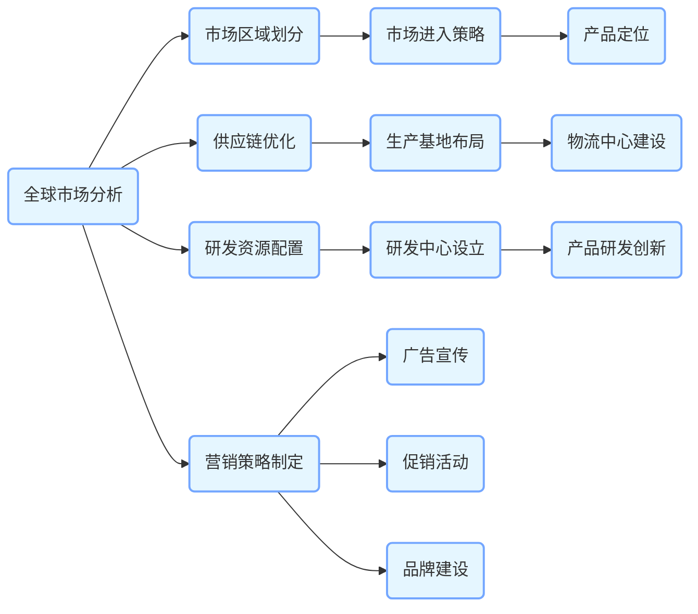

# 费雪的全球化战略评估：贸易摩擦背景下的新思考

> 关键词：费雪、全球化战略、贸易摩擦、战略评估、新思考

> 摘要：本文聚焦于费雪在贸易摩擦背景下的全球化战略评估。首先介绍了研究的背景、目的、预期读者、文档结构及相关术语。接着阐述了费雪全球化战略的核心概念与联系，分析其核心算法原理和具体操作步骤。通过数学模型和公式深入剖析战略的内在逻辑，并结合实际案例进行说明。然后介绍了在项目实战中的开发环境搭建、源代码实现与解读。探讨了费雪全球化战略在实际中的应用场景，推荐了相关的学习资源、开发工具框架以及论文著作。最后总结了未来的发展趋势与挑战，提供了常见问题解答和扩展阅读参考资料，旨在为企业在贸易摩擦背景下的全球化战略制定提供新的思考和借鉴。

## 1. 背景介绍 
### 1.1 目的和范围
在当今全球化的经济格局中，贸易摩擦频繁发生，这对企业的全球化战略产生了深远的影响。费雪作为一家具有广泛国际业务的企业，其全球化战略的评估具有重要的现实意义。本文的目的在于深入分析费雪在贸易摩擦背景下的全球化战略，评估其战略的有效性和适应性，并提出新的思考和建议。研究范围涵盖费雪全球化战略的各个方面，包括市场布局、供应链管理、营销策略等。

### 1.2 预期读者
本文的预期读者包括企业战略规划者、市场营销人员、供应链管理人员、学术研究人员以及对全球化战略和贸易摩擦感兴趣的人士。这些读者可以从本文中获取关于费雪全球化战略的详细信息和分析，为自身的工作和研究提供参考。

### 1.3 文档结构概述
本文将按照以下结构进行阐述：首先介绍核心概念与联系，明确费雪全球化战略的基本原理和架构；接着分析核心算法原理和具体操作步骤，通过Python代码进行详细说明；然后运用数学模型和公式对战略进行深入剖析，并举例说明；之后展示项目实战中的代码实现和详细解读；探讨实际应用场景；推荐相关的工具和资源；最后总结未来发展趋势与挑战，提供常见问题解答和扩展阅读参考资料。

### 1.4 术语表
#### 1.4.1 核心术语定义
- **全球化战略**：企业为了在全球范围内实现资源的优化配置和市场的拓展，制定的一系列长期发展规划和策略。
- **贸易摩擦**：各国之间由于贸易政策、关税、知识产权等问题产生的冲突和矛盾。
- **费雪全球化战略**：费雪公司为了在全球市场取得竞争优势，针对不同地区的市场特点和贸易环境，制定的包括市场进入、产品定位、供应链管理等方面的战略。

#### 1.4.2 相关概念解释
- **市场布局**：企业在全球不同地区选择目标市场，并确定在这些市场的业务规模和市场份额的规划。
- **供应链管理**：对企业的原材料采购、生产、物流等环节进行协调和优化，以确保产品能够高效、低成本地供应到市场。
- **营销策略**：企业为了促进产品销售，提高品牌知名度，针对不同市场和客户群体制定的促销、广告、定价等策略。

#### 1.4.3 缩略词列表
- **GDP**：国内生产总值（Gross Domestic Product）
- **FDI**：外国直接投资（Foreign Direct Investment）
- **WTO**：世界贸易组织（World Trade Organization）

## 2. 核心概念与联系 
### 核心概念原理
费雪的全球化战略基于对全球市场的深入分析和对自身核心竞争力的把握。其核心原理在于通过在全球范围内优化资源配置，降低成本，提高产品质量和服务水平，以满足不同地区客户的需求。具体来说，费雪通过在不同国家和地区设立生产基地、研发中心和销售网络，实现了生产、研发和销售的本地化，从而更好地适应当地市场的需求和竞争环境。

### 架构的文本示意图
费雪全球化战略架构可以用以下文本描述：
- **市场层面**：费雪根据不同国家和地区的经济发展水平、消费能力、市场规模等因素，将全球市场划分为不同的区域，并针对每个区域制定相应的市场进入策略和产品定位。
- **供应链层面**：费雪在全球范围内建立了多个生产基地和物流中心，通过优化供应链管理，实现了原材料的高效采购、生产的快速响应和产品的及时配送。
- **研发层面**：费雪在全球多个地区设立了研发中心，吸引了当地的优秀人才，开展针对当地市场需求的产品研发和创新。
- **营销层面**：费雪根据不同地区的文化、消费习惯和市场竞争情况，制定了多样化的营销策略，包括广告宣传、促销活动、品牌建设等。

### Mermaid 流程图


该流程图展示了费雪全球化战略的核心流程，从全球市场分析出发，分别在市场、供应链、研发和营销四个层面进行决策和实施，最终实现全球化战略的目标。

## 3. 核心算法原理 & 具体操作步骤 
### 核心算法原理
费雪的全球化战略评估可以采用多指标综合评价算法。该算法的核心思想是通过对多个指标进行量化评估，并根据各指标的重要性赋予不同的权重，最终得到一个综合的评估结果。具体来说，我们可以选择市场潜力、生产成本、贸易风险、政策环境等指标进行评估。

### Python 源代码实现
```python
import numpy as np

# 定义评估指标
indicators = ['市场潜力', '生产成本', '贸易风险', '政策环境']

# 定义各指标的权重
weights = np.array([0.3, 0.2, 0.25, 0.25])

# 定义不同地区的指标得分矩阵
scores = np.array([
    [80, 60, 70, 85],  # 地区1的得分
    [75, 70, 65, 80],  # 地区2的得分
    [90, 50, 75, 90]   # 地区3的得分
])

# 计算综合得分
composite_scores = np.dot(scores, weights)

# 输出各地区的综合得分
for i, score in enumerate(composite_scores):
    print(f"地区{i + 1}的综合得分: {score}")

# 找出综合得分最高的地区
best_region_index = np.argmax(composite_scores)
print(f"综合得分最高的地区是地区{best_region_index + 1}")
```

### 具体操作步骤
1. **确定评估指标**：根据费雪全球化战略的目标和重点，选择合适的评估指标，如市场潜力、生产成本、贸易风险、政策环境等。
2. **确定指标权重**：通过专家评估、层次分析法等方法，确定各指标的权重，反映各指标在战略评估中的重要性。
3. **收集指标数据**：收集不同地区在各评估指标上的得分数据，可以通过市场调研、统计分析等方式获取。
4. **计算综合得分**：将各地区的指标得分与相应的权重相乘，然后求和，得到各地区的综合得分。
5. **进行战略决策**：根据各地区的综合得分，选择得分最高的地区作为优先发展的市场，或者根据得分情况对不同地区的战略进行调整。

## 4. 数学模型和公式 & 详细讲解 & 举例说明 
### 数学模型和公式
设 $x_{ij}$ 表示第 $i$ 个地区在第 $j$ 个评估指标上的得分，$w_j$ 表示第 $j$ 个评估指标的权重，$S_i$ 表示第 $i$ 个地区的综合得分，则综合得分的计算公式为：

$$S_i = \sum_{j=1}^{n} w_j x_{ij}$$

其中，$n$ 为评估指标的个数。

### 详细讲解
该公式的含义是将每个地区在各个评估指标上的得分乘以相应的权重，然后将这些乘积相加，得到该地区的综合得分。权重 $w_j$ 反映了第 $j$ 个评估指标在整体评估中的重要性，权重越大，该指标对综合得分的影响就越大。

### 举例说明
以我们前面的 Python 代码为例，假设我们有三个地区需要评估，评估指标包括市场潜力、生产成本、贸易风险和政策环境。各指标的权重分别为 0.3、0.2、0.25 和 0.25。地区 1 在各指标上的得分分别为 80、60、70 和 85，地区 2 的得分分别为 75、70、65 和 80，地区 3 的得分分别为 90、50、75 和 90。

根据上述公式，地区 1 的综合得分 $S_1$ 为：

$$S_1 = 0.3 \times 80 + 0.2 \times 60 + 0.25 \times 70 + 0.25 \times 85$$
$$S_1 = 24 + 12 + 17.5 + 21.25$$
$$S_1 = 74.75$$

同理，可计算出地区 2 的综合得分 $S_2$ 为 75.25，地区 3 的综合得分 $S_3$ 为 78.75。因此，综合得分最高的地区是地区 3，费雪在制定全球化战略时可以优先考虑该地区。

## 5. 项目实战：代码实际案例和详细解释说明 
### 5.1  开发环境搭建
在进行费雪全球化战略评估的项目实战时，我们可以使用 Python 作为开发语言，以下是开发环境的搭建步骤：
1. **安装 Python**：从 Python 官方网站（https://www.python.org/downloads/）下载并安装 Python 3.x 版本。
2. **安装必要的库**：使用 pip 命令安装 numpy 库，用于数值计算。
```bash
pip install numpy
```
3. **选择开发工具**：可以选择 PyCharm、Jupyter Notebook 等开发工具，方便编写和运行 Python 代码。

### 5.2  源代码详细实现和代码解读
以下是一个完整的 Python 代码示例，用于实现费雪全球化战略评估：
```python
import numpy as np

# 定义评估指标
indicators = ['市场潜力', '生产成本', '贸易风险', '政策环境']

# 定义各指标的权重
weights = np.array([0.3, 0.2, 0.25, 0.25])

# 定义不同地区的指标得分矩阵
scores = np.array([
    [80, 60, 70, 85],  # 地区1的得分
    [75, 70, 65, 80],  # 地区2的得分
    [90, 50, 75, 90]   # 地区3的得分
])

# 计算综合得分
composite_scores = np.dot(scores, weights)

# 输出各地区的综合得分
for i, score in enumerate(composite_scores):
    print(f"地区{i + 1}的综合得分: {score}")

# 找出综合得分最高的地区
best_region_index = np.argmax(composite_scores)
print(f"综合得分最高的地区是地区{best_region_index + 1}")

# 对各地区进行排名
rank = np.argsort(-composite_scores) + 1
print("各地区的排名:")
for i, region_rank in enumerate(rank):
    print(f"地区{i + 1}的排名: {region_rank}")
```

### 代码解读与分析
1. **导入必要的库**：导入 numpy 库，用于数值计算。
2. **定义评估指标和权重**：定义了四个评估指标，并为每个指标分配了相应的权重。
3. **定义不同地区的指标得分矩阵**：使用二维数组表示不同地区在各评估指标上的得分。
4. **计算综合得分**：使用 numpy 的 dot 函数计算各地区的综合得分。
5. **输出各地区的综合得分**：使用循环遍历综合得分数组，输出每个地区的综合得分。
6. **找出综合得分最高的地区**：使用 numpy 的 argmax 函数找出综合得分最高的地区的索引，并输出该地区的编号。
7. **对各地区进行排名**：使用 numpy 的 argsort 函数对综合得分数组进行排序，得到各地区的排名，并输出排名结果。

通过以上代码，我们可以对费雪全球化战略中的不同地区进行综合评估和排名，为战略决策提供依据。

## 6. 实际应用场景 
### 市场进入决策
在贸易摩擦背景下，费雪在选择进入新的国际市场时，可以使用上述的评估方法，综合考虑市场潜力、生产成本、贸易风险和政策环境等因素，选择最具吸引力的市场。例如，如果某个地区的市场潜力大，但贸易风险较高，费雪可以通过与当地企业合作、利用当地的政策优惠等方式降低风险，然后进入该市场。

### 供应链优化
费雪可以根据不同地区的生产成本和政策环境等因素，优化其供应链布局。例如，将生产基地设在生产成本较低、政策环境较好的地区，以降低生产成本，提高产品的竞争力。同时，在贸易摩擦期间，还可以通过增加供应商的多样性，降低供应链中断的风险。

### 营销策略调整
针对不同地区的市场特点和贸易环境，费雪可以调整其营销策略。在贸易摩擦较为严重的地区，可以加大品牌宣传力度，提高品牌知名度和美誉度，以抵消贸易摩擦带来的负面影响。在市场潜力较大但消费能力相对较低的地区，可以推出价格更为亲民的产品，以扩大市场份额。

## 7. 工具和资源推荐
### 7.1 学习资源推荐
#### 7.1.1 书籍推荐
- 《全球化战略：跨国公司的国际竞争与战略管理》：本书系统地介绍了全球化战略的理论和实践，对跨国公司的国际竞争和战略管理进行了深入分析，是学习全球化战略的经典著作。
- 《贸易摩擦与企业应对策略》：该书详细探讨了贸易摩擦的成因、影响和企业的应对策略，对于企业在贸易摩擦背景下制定全球化战略具有重要的参考价值。
- 《供应链管理：战略、规划与运营》：本书全面介绍了供应链管理的理论和方法，包括供应链战略、采购管理、生产计划、物流配送等方面的内容，有助于企业优化供应链布局。

#### 7.1.2 在线课程
- Coursera 平台上的“Global Business Strategy”课程：该课程由知名教授授课，涵盖了全球化战略的各个方面，包括市场进入策略、供应链管理、国际营销等内容，通过视频讲解、案例分析和在线讨论等方式，帮助学员深入理解全球化战略。
- edX 平台上的“Trade Policy and International Business”课程：该课程主要介绍了贸易政策的制定和实施，以及贸易政策对国际商务的影响，对于企业在贸易摩擦背景下制定全球化战略具有重要的指导意义。

#### 7.1.3 技术博客和网站
- 世界经济论坛（https://www.weforum.org/）：该网站提供了关于全球经济、贸易和企业战略等方面的最新研究报告和观点，是了解全球经济形势和企业战略趋势的重要渠道。
- 麦肯锡全球研究院（https://www.mckinsey.com/global-themes/globalization）：该网站发布了大量关于全球化和企业战略的研究报告和案例分析，对于企业制定全球化战略具有重要的参考价值。

### 7.2 开发工具框架推荐
#### 7.2.1 IDE和编辑器
- PyCharm：是一款专业的 Python 集成开发环境，具有代码自动补全、调试、版本控制等功能，适合开发大型 Python 项目。
- Jupyter Notebook：是一个交互式的开发环境，支持多种编程语言，包括 Python、R 等。它以笔记本的形式展示代码和结果，方便进行数据分析和可视化。

#### 7.2.2 调试和性能分析工具
- PDB：是 Python 自带的调试工具，可以在代码中设置断点，逐步执行代码，查看变量的值和程序的执行流程。
- cProfile：是 Python 的性能分析工具，可以统计代码的执行时间和函数调用次数，帮助开发者找出代码中的性能瓶颈。

#### 7.2.3 相关框架和库
- NumPy：是 Python 的一个基础数值计算库，提供了高效的数组操作和数学函数，是进行数据分析和科学计算的必备工具。
- Pandas：是一个用于数据处理和分析的 Python 库，提供了数据结构和数据操作方法，方便进行数据清洗、转换和分析。

### 7.3 相关论文著作推荐
#### 7.3.1 经典论文
- “The Internationalization Process of the Firm - A Model of Knowledge Development and Increasing Foreign Market Commitments”：该论文提出了企业国际化过程的阶段模型，对企业的国际化战略具有重要的理论指导意义。
- “Location, Competition, and the ‘New’ Economic Geography: Reflections on Paul Krugman’s Development Economics”：该论文探讨了企业的区位选择和竞争策略，对于企业在全球化背景下的市场布局具有重要的参考价值。

#### 7.3.2 最新研究成果
- “The Impact of Trade Frictions on Global Value Chains: Evidence from the United States - China Trade War”：该研究分析了中美贸易摩擦对全球价值链的影响，为企业在贸易摩擦背景下调整供应链布局提供了实证依据。
- “Strategic Responses of Multinational Enterprises to Trade Policy Uncertainty”：该论文研究了跨国企业在贸易政策不确定性下的战略应对策略，对于企业在贸易摩擦背景下制定全球化战略具有重要的启示。

#### 7.3.3 应用案例分析
- “How Apple Managed Its Global Supply Chain During the US - China Trade War”：该案例分析了苹果公司在中美贸易摩擦期间如何调整其全球供应链布局，以降低贸易摩擦带来的影响，为其他企业提供了借鉴。
- “Nike's Global Marketing Strategy in the Face of Trade Tensions”：该案例介绍了耐克公司在贸易紧张局势下如何调整其全球营销策略，以保持市场竞争力。

## 8. 总结：未来发展趋势与挑战
### 未来发展趋势
- **区域化合作加强**：在贸易摩擦的背景下，各国可能会加强区域化合作，形成区域性的贸易协定和经济联盟。费雪可以积极参与区域化合作，利用区域内的政策优惠和市场资源，拓展业务。
- **数字化转型加速**：随着信息技术的快速发展，企业的数字化转型将成为未来的发展趋势。费雪可以通过数字化技术优化供应链管理、提升市场营销效率、创新产品和服务，以提高企业的竞争力。
- **可持续发展成为重点**：消费者对环境保护和社会责任的关注度不断提高，可持续发展将成为企业未来发展的重要方向。费雪可以加强在可持续发展方面的投入，推出环保、绿色的产品和服务，以满足消费者的需求。

### 挑战
- **贸易政策不确定性**：贸易政策的变化具有不确定性，可能会对费雪的全球化战略产生不利影响。企业需要密切关注贸易政策的变化，及时调整战略，以降低贸易风险。
- **全球经济增长放缓**：全球经济增长放缓可能会导致市场需求下降，影响费雪的销售业绩。企业需要加强市场调研，了解市场需求的变化，调整产品结构和营销策略。
- **人才竞争加剧**：在全球化竞争中，人才是企业的核心竞争力。随着企业数字化转型和可持续发展的需求增加，对高素质人才的需求也将不断提高。费雪需要加强人才培养和引进，提高企业的创新能力和管理水平。

## 9. 附录：常见问题与解答
### 问题 1：如何确定评估指标的权重？
解答：可以通过专家评估、层次分析法等方法确定评估指标的权重。专家评估是邀请相关领域的专家对各指标的重要性进行打分，然后取平均值作为权重。层次分析法是一种系统的决策方法，通过构建层次结构模型，比较各指标之间的相对重要性，从而确定权重。

### 问题 2：如果数据不准确，会对评估结果产生什么影响？
解答：数据不准确会导致评估结果的偏差。如果某个地区的市场潜力数据被高估，可能会导致该地区的综合得分过高，从而使企业做出错误的战略决策。因此，在收集数据时，需要确保数据的准确性和可靠性，可以通过多渠道收集数据、进行数据验证等方式提高数据质量。

### 问题 3：费雪的全球化战略是否适用于所有企业？
解答：费雪的全球化战略是基于其自身的业务特点和市场定位制定的，不一定适用于所有企业。不同企业的规模、行业、核心竞争力等因素不同，需要根据自身情况制定适合自己的全球化战略。但是，费雪的全球化战略评估方法和思路可以为其他企业提供参考和借鉴。

## 10. 扩展阅读 & 参考资料
### 扩展阅读
- 《国际商务：环境与运作》：本书全面介绍了国际商务的环境和运作模式，包括国际贸易、国际投资、国际营销等方面的内容，有助于读者深入了解国际商务的本质和规律。
- 《跨国公司财务管理》：该书主要探讨了跨国公司在财务管理方面的问题和策略，包括外汇风险管理、国际税收筹划、跨国资本预算等内容，对于企业在全球化背景下的财务管理具有重要的指导意义。

### 参考资料
- 费雪公司官方网站：获取费雪公司的最新业务信息和战略动态。
- 世界贸易组织（WTO）官方网站：获取全球贸易政策和贸易数据。
- 国际货币基金组织（IMF）官方网站：获取全球经济形势和宏观经济数据。