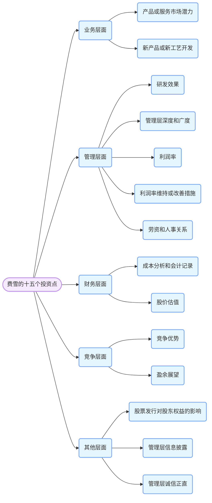

# 费雪的十五个投资点：选股的黄金法则

> 关键词：费雪、十五个投资点、选股、黄金法则、投资分析

> 摘要：本文围绕费雪的十五个投资点展开，深入探讨这一选股的黄金法则。首先介绍费雪及其投资理念的背景，详细阐释十五个投资点的核心概念与相互联系，通过Python代码对相关选股逻辑进行算法原理的阐述和操作步骤的说明，引入数学模型和公式帮助理解投资分析的本质。结合实际项目案例，展示如何运用这些投资点进行选股实战。同时，分析其在不同实际应用场景中的作用，推荐相关的学习资源、开发工具框架以及论文著作。最后总结未来投资领域基于该法则可能面临的发展趋势与挑战，并对常见问题进行解答，为投资者提供全面且深入的投资参考。

## 1. 背景介绍 

### 1.1 目的和范围
本文的目的在于深入剖析费雪的十五个投资点这一经典的选股法则，帮助投资者更好地理解和运用这一法则进行股票投资。通过对十五个投资点的详细解读、算法实现、实际案例分析等，使投资者能够掌握其核心要点，并在实际投资中做出更明智的决策。范围涵盖了费雪投资理念的理论基础、实际应用、相关工具和资源，以及未来发展趋势等方面。

### 1.2 预期读者
本文预期读者主要包括对股票投资感兴趣的个人投资者、金融从业者、投资机构研究人员以及相关专业的学生。无论你是投资新手还是有一定经验的投资者，都能从本文中获取到关于费雪十五个投资点的全面且深入的知识，为你的投资决策提供有益的参考。

### 1.3 文档结构概述
本文将按照以下结构进行阐述：首先介绍费雪投资理念的背景知识，包括目的、预期读者和文档结构等；接着详细讲解十五个投资点的核心概念与联系，通过示意图和流程图进行直观展示；然后运用Python代码阐述核心算法原理和具体操作步骤；引入数学模型和公式对投资分析进行深入讲解，并举例说明；通过实际项目案例展示如何运用这些投资点进行选股实战；分析其在不同实际应用场景中的作用；推荐相关的学习资源、开发工具框架以及论文著作；最后总结未来投资领域基于该法则可能面临的发展趋势与挑战，解答常见问题，并提供扩展阅读和参考资料。

### 1.4 术语表

#### 1.4.1 核心术语定义
- **费雪的十五个投资点**：由投资大师菲利普·费雪提出的一套用于评估股票投资价值的标准，涵盖了公司的业务、管理、财务等多个方面，帮助投资者筛选出具有长期投资价值的股票。
- **投资价值**：指股票在未来一段时间内能够为投资者带来收益的能力，包括股息收益和资本增值。
- **成长股**：指那些具有持续增长潜力的公司股票，通常表现为销售额、利润等指标的持续增长。

#### 1.4.2 相关概念解释
- **基本面分析**：通过对公司的财务报表、行业地位、管理层素质等基本面因素进行分析，评估公司的内在价值和投资潜力。费雪的十五个投资点就是一种基于基本面分析的选股方法。
- **长期投资**：指投资者买入股票后持有较长时间，通常为数年甚至数十年，以获取公司成长带来的长期收益。费雪的投资理念强调长期投资，注重公司的长期发展潜力。

#### 1.4.3 缩略词列表
- **EPS**：Earnings Per Share，每股收益，反映公司每股股票的盈利水平。
- **ROE**：Return on Equity，净资产收益率，衡量公司运用自有资本的效率。

## 2. 核心概念与联系 

费雪的十五个投资点可以分为以下几个方面，它们相互关联，共同构成了一个全面的选股体系。

### 业务层面
1. **公司的产品或服务有无充分市场潜力，至少几年内营业额能否大幅成长**：具有充分市场潜力的产品或服务是公司业绩增长的基础。如果公司的产品或服务能够满足不断增长的市场需求，那么公司的营业额有望在未来几年内实现大幅增长。
2. **为了进一步提高总体销售水平，发现新的产品增长点，管理层是不是决心继续开发新产品或新工艺**：持续的创新能力是公司保持竞争力的关键。管理层积极开发新产品或新工艺，能够为公司创造新的增长点，推动公司的持续发展。

### 管理层面
1. **和公司的规模相比，这家公司的研发努力，有多大的效果**：研发投入的效果直接影响公司的创新能力和市场竞争力。如果公司能够以较小的研发投入获得较大的产出，说明公司的研发效率较高。
2. **公司管理层的深度和广度是否足够**：一个优秀的管理团队应该具备丰富的专业知识和管理经验，能够应对各种复杂的市场情况。管理层的深度和广度决定了公司的决策能力和执行能力。
3. **这家公司的利润率高不高**：高利润率是公司盈利能力的重要体现。较高的利润率意味着公司在成本控制、产品定价等方面具有优势，能够为股东创造更多的价值。
4. **公司做了什么事，以维持或改善利润率**：公司可以通过优化生产流程、降低成本、提高产品附加值等方式来维持或改善利润率。管理层的决策和行动对公司的利润率有着重要的影响。
5. **公司的劳资和人事关系是否良好**：良好的劳资和人事关系能够提高员工的工作积极性和工作效率，减少员工流失率，为公司的稳定发展提供保障。

### 财务层面
1. **公司的成本分析和会计记录是否良好**：准确的成本分析和会计记录是公司财务管理的基础。通过对成本的有效控制和合理的财务规划，公司能够提高资金使用效率，增强盈利能力。
2. **是否有其他一些公司，因为短期的题材，就造成股价上涨，而这家公司的股价却偏低**：这涉及到股票的估值问题。如果一家公司的基本面良好，但股价却相对偏低，可能存在投资机会。投资者需要通过深入分析，判断股价偏低的原因是否合理。

### 竞争层面
1. **公司相对于竞争者，其优势何在**：公司的竞争优势可以体现在产品质量、成本控制、品牌影响力、技术创新等方面。具有竞争优势的公司能够在市场中占据更有利的地位，获得更高的市场份额和利润。
2. **公司是否有短期或长期的盈余展望**：盈余展望反映了公司未来的盈利预期。投资者可以通过分析公司的业务发展战略、市场需求变化等因素，对公司的盈余展望进行评估。

### 其他层面
1. **在可预见的将来，这家公司是否会大量发行股票，获取足够的资金，以利公司发展，现有持股人的利益是否因之受损**：大量发行股票可能会稀释现有股东的权益。投资者需要关注公司的融资计划，评估其对现有股东利益的影响。
2. **管理层是否只向投资人报喜不报忧，诸事顺畅时口沫横飞，有问题或叫人失望的事情发生时，则三缄其口**：管理层的诚信和透明度是投资者关注的重点。一个诚实、透明的管理团队能够让投资者更好地了解公司的真实情况，做出更明智的投资决策。
3. **这家公司管理层的诚信正直态度是否无庸置疑**：诚信正直是管理层的基本素质。具有良好诚信记录的管理层能够赢得投资者的信任，为公司的长期发展奠定坚实的基础。

下面是费雪十五个投资点的核心概念原理和架构的文本示意图：

```plaintext
费雪的十五个投资点
|--业务层面
|   |--产品或服务市场潜力
|   |--新产品或新工艺开发
|--管理层面
|   |--研发效果
|   |--管理层深度和广度
|   |--利润率
|   |--利润率维持或改善措施
|   |--劳资和人事关系
|--财务层面
|   |--成本分析和会计记录
|   |--股价估值
|--竞争层面
|   |--竞争优势
|   |--盈余展望
|--其他层面
|   |--股票发行对股东权益的影响
|   |--管理层信息披露
|   |--管理层诚信正直
```

下面是对应的Mermaid流程图：



## 3. 核心算法原理 & 具体操作步骤 

### 算法原理
我们可以使用Python代码来实现基于费雪十五个投资点的选股算法。基本思路是为每个投资点设定一个评分标准，对每个股票进行评分，然后根据总得分筛选出符合要求的股票。

```python
# 定义费雪十五个投资点的评分函数
def evaluate_investment_points(company_info):
    total_score = 0
    
    # 业务层面
    # 产品或服务市场潜力
    if company_info['market_potential'] > 0.8:
        total_score += 1
    # 新产品或新工艺开发
    if company_info['new_product_development']:
        total_score += 1
    
    # 管理层面
    # 研发效果
    if company_info['R&D_effectiveness'] > 0.7:
        total_score += 1
    # 管理层深度和广度
    if company_info['management_depth'] > 0.7:
        total_score += 1
    # 利润率
    if company_info['profit_margin'] > 0.2:
        total_score += 1
    # 利润率维持或改善措施
    if company_info['profit_margin_improvement']:
        total_score += 1
    # 劳资和人事关系
    if company_info['labor_relations'] > 0.8:
        total_score += 1
    
    # 财务层面
    # 成本分析和会计记录
    if company_info['cost_analysis']:
        total_score += 1
    # 股价估值
    if company_info['stock_valuation'] < 1:
        total_score += 1
    
    # 竞争层面
    # 竞争优势
    if company_info['competitive_advantage'] > 0.7:
        total_score += 1
    # 盈余展望
    if company_info['earnings_outlook'] > 0.7:
        total_score += 1
    
    # 其他层面
    # 股票发行对股东权益的影响
    if company_info['equity_dilution'] < 0.1:
        total_score += 1
    # 管理层信息披露
    if company_info['management_disclosure']:
        total_score += 1
    # 管理层诚信正直
    if company_info['management_integrity']:
        total_score += 1
    
    return total_score

# 示例公司信息
company_info = {
    'market_potential': 0.9,
    'new_product_development': True,
    'R&D_effectiveness': 0.8,
    'management_depth': 0.8,
    'profit_margin': 0.25,
    'profit_margin_improvement': True,
    'labor_relations': 0.9,
    'cost_analysis': True,
    'stock_valuation': 0.8,
    'competitive_advantage': 0.8,
    'earnings_outlook': 0.8,
    'equity_dilution': 0.05,
    'management_disclosure': True,
    'management_integrity': True
}

# 计算总得分
score = evaluate_investment_points(company_info)
print(f"该公司的总得分是: {score}")
```

### 具体操作步骤
1. **收集公司信息**：通过查阅公司的财务报表、年报、行业研究报告等资料，收集与费雪十五个投资点相关的信息，如市场潜力、研发效果、利润率等。
2. **设定评分标准**：根据每个投资点的重要性和实际情况，为每个投资点设定一个评分标准。例如，市场潜力大于0.8得1分，否则得0分。
3. **计算得分**：将收集到的公司信息代入评分函数，计算每个投资点的得分，并将所有得分相加得到总得分。
4. **筛选股票**：根据总得分筛选出符合要求的股票。例如，总得分大于10分的股票可以作为进一步研究的对象。

## 4. 数学模型和公式 & 详细讲解 & 举例说明 

### 数学模型
我们可以将费雪十五个投资点的选股过程看作一个线性加权模型。设每个投资点的得分分别为 $x_1, x_2, \cdots, x_{15}$，对应的权重分别为 $w_1, w_2, \cdots, w_{15}$，则总得分 $S$ 可以表示为：

$$S = \sum_{i=1}^{15} w_i x_i$$

在上述Python代码中，我们假设每个投资点的权重都为1，即 $w_1 = w_2 = \cdots = w_{15} = 1$。

### 详细讲解
- **得分 $x_i$**：每个投资点的得分根据设定的评分标准确定，取值为0或1。例如，对于“产品或服务市场潜力”这一投资点，如果市场潜力大于0.8，则 $x_1 = 1$，否则 $x_1 = 0$。
- **权重 $w_i$**：权重表示每个投资点的重要性。在实际应用中，不同的投资者可能会根据自己的投资偏好和风险承受能力，为每个投资点设定不同的权重。例如，对于注重公司创新能力的投资者，可以将“新产品或新工艺开发”这一投资点的权重设置得较高。

### 举例说明
假设我们有两家公司A和B，它们的投资点得分如下表所示：

| 投资点 | 公司A得分 $x_{A,i}$ | 公司B得分 $x_{B,i}$ | 权重 $w_i$ |
| ---- | ---- | ---- | ---- |
| 产品或服务市场潜力 | 1 | 0 | 1 |
| 新产品或新工艺开发 | 1 | 1 | 1 |
| 研发效果 | 1 | 0 | 1 |
| 管理层深度和广度 | 1 | 1 | 1 |
| 利润率 | 1 | 0 | 1 |
| 利润率维持或改善措施 | 1 | 1 | 1 |
| 劳资和人事关系 | 1 | 0 | 1 |
| 成本分析和会计记录 | 1 | 1 | 1 |
| 股价估值 | 1 | 0 | 1 |
| 竞争优势 | 1 | 1 | 1 |
| 盈余展望 | 1 | 0 | 1 |
| 股票发行对股东权益的影响 | 1 | 1 | 1 |
| 管理层信息披露 | 1 | 0 | 1 |
| 管理层诚信正直 | 1 | 1 | 1 |

根据线性加权模型，公司A的总得分 $S_A$ 和公司B的总得分 $S_B$ 分别为：

$$S_A = \sum_{i=1}^{15} w_i x_{A,i} = 1\times1 + 1\times1 + \cdots + 1\times1 = 13$$

$$S_B = \sum_{i=1}^{15} w_i x_{B,i} = 1\times0 + 1\times1 + \cdots + 1\times1 = 7$$

从总得分来看，公司A的得分高于公司B，说明公司A在费雪十五个投资点方面的综合表现更好，可能具有更高的投资价值。

## 5. 项目实战：代码实际案例和详细解释说明 

### 5.1  开发环境搭建
为了实现基于费雪十五个投资点的选股项目，我们需要搭建以下开发环境：
- **Python环境**：建议使用Python 3.7及以上版本。可以从Python官方网站（https://www.python.org/downloads/）下载并安装。
- **开发工具**：推荐使用PyCharm或Jupyter Notebook作为开发工具。PyCharm是一款功能强大的Python集成开发环境，Jupyter Notebook则适合进行交互式编程和数据分析。
- **第三方库**：需要安装`pandas`、`numpy`等库，用于数据处理和分析。可以使用以下命令进行安装：
```sh
pip install pandas numpy
```

### 5.2  源代码详细实现和代码解读
```python
import pandas as pd

# 定义费雪十五个投资点的评分函数
def evaluate_investment_points(company_info):
    total_score = 0
    
    # 业务层面
    # 产品或服务市场潜力
    if company_info['market_potential'] > 0.8:
        total_score += 1
    # 新产品或新工艺开发
    if company_info['new_product_development']:
        total_score += 1
    
    # 管理层面
    # 研发效果
    if company_info['R&D_effectiveness'] > 0.7:
        total_score += 1
    # 管理层深度和广度
    if company_info['management_depth'] > 0.7:
        total_score += 1
    # 利润率
    if company_info['profit_margin'] > 0.2:
        total_score += 1
    # 利润率维持或改善措施
    if company_info['profit_margin_improvement']:
        total_score += 1
    # 劳资和人事关系
    if company_info['labor_relations'] > 0.8:
        total_score += 1
    
    # 财务层面
    # 成本分析和会计记录
    if company_info['cost_analysis']:
        total_score += 1
    # 股价估值
    if company_info['stock_valuation'] < 1:
        total_score += 1
    
    # 竞争层面
    # 竞争优势
    if company_info['competitive_advantage'] > 0.7:
        total_score += 1
    # 盈余展望
    if company_info['earnings_outlook'] > 0.7:
        total_score += 1
    
    # 其他层面
    # 股票发行对股东权益的影响
    if company_info['equity_dilution'] < 0.1:
        total_score += 1
    # 管理层信息披露
    if company_info['management_disclosure']:
        total_score += 1
    # 管理层诚信正直
    if company_info['management_integrity']:
        total_score += 1
    
    return total_score

# 读取公司信息数据
data = pd.read_csv('company_info.csv')

# 计算每个公司的总得分
scores = []
for index, row in data.iterrows():
    company_info = row.to_dict()
    score = evaluate_investment_points(company_info)
    scores.append(score)

# 将总得分添加到数据中
data['total_score'] = scores

# 筛选出总得分大于10分的公司
selected_companies = data[data['total_score'] > 10]

# 输出筛选结果
print(selected_companies)
```

### 代码解读与分析
1. **导入必要的库**：导入`pandas`库用于数据处理和分析。
2. **定义评分函数**：`evaluate_investment_points`函数根据费雪十五个投资点的评分标准，计算每个公司的总得分。
3. **读取公司信息数据**：使用`pandas`的`read_csv`函数读取存储公司信息的CSV文件。
4. **计算总得分**：遍历数据中的每一行，将每行数据转换为字典，调用评分函数计算总得分，并将总得分存储在`scores`列表中。
5. **筛选公司**：将总得分添加到数据中，使用布尔索引筛选出总得分大于10分的公司。
6. **输出结果**：打印筛选结果。

## 6. 实际应用场景 
### 个人投资者
对于个人投资者来说，费雪的十五个投资点可以帮助他们筛选出具有长期投资价值的股票。个人投资者可以通过研究公司的基本面，根据十五个投资点的标准对股票进行评估，选择符合要求的股票进行投资。这种方法可以帮助个人投资者避免盲目跟风投资，提高投资的成功率。

### 投资机构
投资机构通常需要管理大量的资金，需要对众多的股票进行筛选和分析。费雪的十五个投资点可以作为投资机构选股的重要参考标准之一。投资机构可以利用专业的研究团队和数据分析工具，对公司的各个方面进行深入研究，根据十五个投资点的评分结果，构建投资组合，实现资产的优化配置。

### 公司管理层
公司管理层可以借鉴费雪的十五个投资点，对公司的经营状况进行自我评估。通过分析公司在各个投资点上的表现，管理层可以发现公司的优势和不足，制定相应的发展战略，提高公司的竞争力和盈利能力。例如，如果公司在“新产品或新工艺开发”方面得分较低，管理层可以加大研发投入，加强创新能力。

## 7. 工具和资源推荐

### 7.1 学习资源推荐

#### 7.1.1 书籍推荐
- 《怎样选择成长股》：菲利普·费雪的经典著作，详细阐述了他的投资理念和选股方法，包括十五个投资点的具体内容和应用。
- 《聪明的投资者》：本杰明·格雷厄姆的著作，被誉为投资界的圣经。书中介绍了价值投资的基本原理和方法，对费雪的投资理念也有一定的启示。
- 《证券分析》：同样是本杰明·格雷厄姆的著作，是价值投资领域的权威书籍。该书深入分析了公司的财务报表和基本面，为投资者提供了全面的投资分析方法。

#### 7.1.2 在线课程
- Coursera上的“投资学原理”课程：该课程由知名高校的教授授课，系统介绍了投资学的基本原理和方法，包括股票投资、债券投资等内容。
- Udemy上的“股票投资实战技巧”课程：课程结合实际案例，讲解了股票投资的实战技巧和选股方法，对理解费雪的十五个投资点有一定的帮助。

#### 7.1.3 技术博客和网站
- 雪球网：国内知名的投资社区，汇聚了众多投资者和投资专家。在雪球网上可以找到关于费雪投资理念的讨论和分析，还可以获取大量的股票分析报告和投资建议。
- 东方财富网：提供丰富的金融信息和数据，包括公司的财务报表、行情数据等。投资者可以通过东方财富网获取相关数据，进行费雪十五个投资点的分析。

### 7.2 开发工具框架推荐

#### 7.2.1 IDE和编辑器
- PyCharm：功能强大的Python集成开发环境，提供代码编辑、调试、版本控制等功能，适合开发基于Python的选股程序。
- Jupyter Notebook：交互式编程环境，适合进行数据分析和可视化。在Jupyter Notebook中可以方便地编写和运行Python代码，查看代码的执行结果。

#### 7.2.2 调试和性能分析工具
- PyCharm的调试功能：可以设置断点、单步执行代码，帮助开发者快速定位和解决代码中的问题。
- `cProfile`模块：Python自带的性能分析工具，可以分析代码的运行时间和函数调用情况，帮助开发者优化代码性能。

#### 7.2.3 相关框架和库
- `pandas`：强大的数据处理和分析库，提供了丰富的数据结构和数据操作方法，适合处理和分析公司的财务数据。
- `numpy`：Python的数值计算库，提供了高效的数组操作和数学函数，可用于实现费雪十五个投资点的评分算法。

### 7.3 相关论文著作推荐

#### 7.3.1 经典论文
- 《The Superinvestors of Graham-and-Doddsville》：沃伦·巴菲特的文章，介绍了价值投资的成功案例，对费雪的投资理念有一定的支持和补充。
- 《Common Stocks and Uncommon Profits》：菲利普·费雪的论文，进一步阐述了他的投资思想和选股方法。

#### 7.3.2 最新研究成果
- 一些学术期刊如《Journal of Financial Economics》《Review of Financial Studies》等会发表关于投资分析和选股方法的最新研究成果，投资者可以关注这些期刊，了解费雪投资理念的最新应用和发展。

#### 7.3.3 应用案例分析
- 一些金融研究机构和投资咨询公司会发布关于费雪十五个投资点的应用案例分析报告，投资者可以通过阅读这些报告，学习如何在实际投资中运用这一法则。

## 8. 总结：未来发展趋势与挑战
### 未来发展趋势
- **数字化和智能化**：随着信息技术的不断发展，投资分析将越来越多地借助数字化和智能化工具。例如，利用大数据分析和人工智能算法，可以更快速、准确地评估公司在费雪十五个投资点方面的表现，提高选股的效率和准确性。
- **跨领域融合**：投资分析将不再局限于传统的金融领域，而是与科技、医疗、环保等多个领域进行融合。费雪的十五个投资点也需要不断适应这种跨领域融合的趋势，考虑更多新兴因素对公司投资价值的影响。
- **社会责任投资**：越来越多的投资者开始关注公司的社会责任表现，如环境保护、员工福利、社会公益等。未来，费雪的十五个投资点可能会将社会责任因素纳入其中，形成更加全面的选股标准。

### 挑战
- **数据获取和质量**：要准确评估公司在费雪十五个投资点方面的表现，需要获取大量的相关数据。然而，数据的获取可能存在困难，而且数据的质量也可能参差不齐。如何确保数据的准确性和完整性是一个挑战。
- **市场变化的不确定性**：市场环境是不断变化的，公司的经营状况也会受到各种因素的影响。费雪的十五个投资点是基于过去的经验和数据总结出来的，如何在市场变化的情况下，灵活运用这一法则，是投资者需要面对的挑战。
- **投资者情绪和行为**：投资者的情绪和行为往往会对市场产生影响，导致股票价格偏离其内在价值。在运用费雪的十五个投资点进行选股时，如何克服投资者情绪和行为的干扰，做出理性的投资决策，是一个重要的挑战。

## 9. 附录：常见问题与解答
### 问题1：费雪的十五个投资点是否适用于所有类型的股票？
解答：费雪的十五个投资点主要适用于具有成长潜力的股票。对于一些成熟行业的蓝筹股和周期性股票，可能需要根据具体情况对投资点的权重和评分标准进行调整。

### 问题2：如何确定每个投资点的权重？
解答：每个投资点的权重可以根据投资者的投资偏好和风险承受能力来确定。例如，对于注重公司创新能力的投资者，可以将“新产品或新工艺开发”这一投资点的权重设置得较高；对于注重公司财务状况的投资者，可以将“利润率”“成本分析和会计记录”等投资点的权重设置得较高。

### 问题3：费雪的十五个投资点与其他选股方法有什么区别？
解答：费雪的十五个投资点更注重公司的基本面分析和长期发展潜力，强调从公司的业务、管理、财务等多个方面进行综合评估。而其他选股方法可能更侧重于技术分析、宏观经济分析等。不同的选股方法各有优缺点，投资者可以根据自己的需求和情况选择合适的方法。

## 10. 扩展阅读 & 参考资料
- 菲利普·费雪. 《怎样选择成长股》. 机械工业出版社
- 本杰明·格雷厄姆. 《聪明的投资者》. 人民邮电出版社
- 本杰明·格雷厄姆. 《证券分析》. 海南出版社
- Coursera平台相关课程资料
- Udemy平台相关课程资料
- 雪球网相关文章和讨论
- 东方财富网相关金融信息和数据
- 《Journal of Financial Economics》《Review of Financial Studies》等学术期刊文章