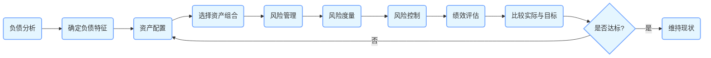

# 资产负债匹配：机构投资者的长期投资策略

> 关键词：资产负债匹配、机构投资者、长期投资策略、风险管理、投资组合

> 摘要：本文围绕资产负债匹配这一机构投资者的长期投资策略展开深入探讨。首先介绍了资产负债匹配的背景，包括其目的、预期读者、文档结构和相关术语。接着阐述了资产负债匹配的核心概念、原理与架构，通过文本示意图和 Mermaid 流程图进行清晰展示。详细讲解了核心算法原理，结合 Python 源代码说明具体操作步骤，同时给出数学模型和公式并举例说明。通过项目实战，展示了开发环境搭建、源代码实现与解读。分析了资产负债匹配的实际应用场景，推荐了相关学习资源、开发工具框架和论文著作。最后总结了其未来发展趋势与挑战，提供了常见问题解答和扩展阅读参考资料，旨在为机构投资者更好地实施资产负债匹配策略提供全面且深入的指导。

## 1. 背景介绍 
### 1.1 目的和范围
资产负债匹配对于机构投资者而言至关重要，其目的在于确保机构在长期投资过程中，资产的收益和风险特性能够与负债的要求相匹配，从而降低因资产与负债不匹配而带来的风险，保障机构的财务稳定性和长期可持续发展。

本文章的范围涵盖了资产负债匹配的基本概念、核心算法原理、数学模型、实际应用案例以及相关工具和资源推荐等方面。旨在为机构投资者提供一个全面且深入的关于资产负债匹配长期投资策略的知识体系，帮助他们更好地理解和应用这一策略。

### 1.2 预期读者
本文的预期读者主要包括各类机构投资者，如保险公司、养老基金、银行等金融机构的投资决策人员、投资经理和风险管理人员。同时，对于从事金融投资研究的学者、学生以及对资产负债管理感兴趣的专业人士也具有一定的参考价值。

### 1.3 文档结构概述
本文将按照以下结构进行阐述：首先介绍资产负债匹配的背景知识，包括目的、读者和文档结构等；接着深入探讨其核心概念、原理与架构，通过示意图和流程图进行清晰展示；然后详细讲解核心算法原理和具体操作步骤，结合 Python 代码进行说明；随后给出数学模型和公式并举例；通过项目实战展示实际应用；分析其在不同场景下的应用；推荐相关学习资源、开发工具框架和论文著作；最后总结未来发展趋势与挑战，提供常见问题解答和扩展阅读参考资料。

### 1.4 术语表
#### 1.4.1 核心术语定义
- **资产负债匹配**：指机构投资者通过合理安排资产的配置，使资产的现金流、风险和收益特征与负债的相应特征相匹配，以降低资产负债错配风险的一种投资策略。
- **机构投资者**：指用自有资金或者从分散的公众手中筹集的资金专门进行有价证券投资活动的法人机构，如保险公司、养老基金、银行等。
- **负债**：机构投资者在未来特定时间需要履行的支付义务，如保险赔付、养老金支付等。
- **资产**：机构投资者拥有的各种经济资源，如股票、债券、房地产等。

#### 1.4.2 相关概念解释
- **久期匹配**：是资产负债匹配的一种重要方法，通过使资产的久期与负债的久期相等，来降低利率变动对资产和负债价值的影响。久期是衡量债券或其他固定收益证券价格对利率变动敏感性的指标。
- **现金流匹配**：确保资产产生的现金流在时间和金额上与负债的现金流相匹配，从而满足机构在不同时间点的支付需求。

#### 1.4.3 缩略词列表
- **ALM**：Asset - Liability Management，资产负债管理。
- **DV01**：Dollar Value of an 01，利率变动一个基点时债券价格的变动值。

## 2. 核心概念与联系 

### 核心概念原理
资产负债匹配的核心原理在于平衡资产和负债的特性，以实现机构投资者的长期财务目标。机构的负债通常具有一定的期限、金额和风险特征，例如保险公司的赔付责任在时间和金额上具有不确定性，养老基金的养老金支付有明确的时间和金额要求。资产负债匹配就是要选择合适的资产组合，使资产的收益、风险和现金流与负债的这些特征相契合。

从风险角度来看，资产负债不匹配可能导致利率风险、市场风险、流动性风险等。例如，如果资产的久期大于负债的久期，当利率上升时，资产价值的下降幅度可能会超过负债价值的下降幅度，从而导致机构的净值减少。通过资产负债匹配，可以有效降低这些风险，提高机构的财务稳定性。

### 架构的文本示意图
资产负债匹配的架构可以分为以下几个层次：

1. **负债分析层**：对机构的负债进行全面分析，包括负债的规模、期限结构、现金流特征、风险属性等。这是资产负债匹配的基础，只有准确了解负债的情况，才能进行合理的资产配置。
2. **资产配置层**：根据负债分析的结果，选择合适的资产进行配置。资产可以包括不同类型的金融资产，如股票、债券、基金等，以及实物资产，如房地产等。在配置过程中，需要考虑资产的收益、风险、流动性等因素，以实现资产与负债的匹配。
3. **风险管理层**：对资产负债匹配过程中的风险进行监控和管理。通过风险度量模型，如 VaR（Value at Risk）、久期分析等，评估资产负债组合的风险水平，并采取相应的措施进行风险控制，如调整资产配置、进行套期保值等。
4. **绩效评估层**：定期对资产负债匹配的绩效进行评估，比较实际的资产负债组合与预期目标的差异，分析原因并进行调整。绩效评估指标可以包括收益率、风险调整后的收益率、资产负债匹配度等。

### Mermaid 流程图


该流程图展示了资产负债匹配的基本流程。首先进行负债分析，确定负债的特征，然后根据负债特征进行资产配置，选择合适的资产组合。在资产配置过程中，需要进行风险管理，包括风险度量和风险控制。最后进行绩效评估，比较实际情况与预期目标，如果未达标则重新进行资产配置。

## 3. 核心算法原理 & 具体操作步骤 

### 核心算法原理
资产负债匹配的核心算法之一是久期匹配算法。久期是衡量债券或其他固定收益证券价格对利率变动敏感性的指标。通过使资产的久期与负债的久期相等，可以降低利率变动对资产和负债价值的影响。

久期的计算公式为：

$$D = \frac{\sum_{t=1}^{n} \frac{t \times C_t}{(1 + y)^t} + \frac{n \times M}{(1 + y)^n}}{P}$$

其中，$D$ 表示久期，$t$ 表示现金流发生的时间，$C_t$ 表示第 $t$ 期的现金流，$y$ 表示债券的到期收益率，$M$ 表示债券的面值，$P$ 表示债券的当前价格。

### 具体操作步骤
以下是使用 Python 实现久期匹配算法的具体操作步骤和代码示例：

```python
import numpy as np

def calculate_duration(cash_flows, yields, prices):
    """
    计算久期
    :param cash_flows: 现金流列表，每个元素表示不同时间点的现金流
    :param yields: 到期收益率列表
    :param prices: 债券当前价格列表
    :return: 久期列表
    """
    durations = []
    for i in range(len(cash_flows)):
        cash_flow = cash_flows[i]
        yield_rate = yields[i]
        price = prices[i]
        n = len(cash_flow)
        numerator = 0
        for t in range(1, n + 1):
            numerator += t * cash_flow[t - 1] / (1 + yield_rate) ** t
        numerator += n * cash_flow[-1] / (1 + yield_rate) ** n
        duration = numerator / price
        durations.append(duration)
    return durations

# 示例数据
cash_flows = [
    [100, 100, 1100],  # 债券 1 的现金流
    [50, 50, 50, 1050]  # 债券 2 的现金流
]
yields = [0.05, 0.06]  # 到期收益率
prices = [1050, 980]  # 债券当前价格

# 计算久期
durations = calculate_duration(cash_flows, yields, prices)
print("债券的久期分别为:", durations)
```

在上述代码中，首先定义了一个 `calculate_duration` 函数，用于计算债券的久期。该函数接受现金流列表、到期收益率列表和债券当前价格列表作为输入，通过循环计算每个债券的久期，并将结果存储在一个列表中返回。最后，使用示例数据调用该函数并打印出债券的久期。

## 4. 数学模型和公式 & 详细讲解 & 举例说明 

### 久期匹配的数学模型
如前所述，久期的计算公式为：

$$D = \frac{\sum_{t=1}^{n} \frac{t \times C_t}{(1 + y)^t} + \frac{n \times M}{(1 + y)^n}}{P}$$

其中，$D$ 表示久期，$t$ 表示现金流发生的时间，$C_t$ 表示第 $t$ 期的现金流，$y$ 表示债券的到期收益率，$M$ 表示债券的面值，$P$ 表示债券的当前价格。

### 详细讲解
- **分子部分**：$\sum_{t=1}^{n} \frac{t \times C_t}{(1 + y)^t} + \frac{n \times M}{(1 + y)^n}$ 表示将每个时间点的现金流乘以该时间点，再进行折现后求和，最后加上到期时的面值折现。这个部分反映了现金流的时间加权现值。
- **分母部分**：$P$ 表示债券的当前价格，即现金流的现值。

通过将分子除以分母，得到的久期表示债券现金流的加权平均到期时间，反映了债券价格对利率变动的敏感性。

### 举例说明
假设有一个债券，面值为 1000 元，票面利率为 5%，期限为 3 年，每年付息一次，到期收益率为 6%。

1. 首先计算现金流：
    - 第 1 年和第 2 年的现金流 $C_1 = C_2 = 1000 \times 5\% = 50$ 元。
    - 第 3 年的现金流 $C_3 = 1000 + 50 = 1050$ 元。
2. 然后计算债券的当前价格 $P$：
    $$P = \frac{50}{(1 + 0.06)^1} + \frac{50}{(1 + 0.06)^2} + \frac{1050}{(1 + 0.06)^3} \approx 973.27$$ 元。
3. 最后计算久期 $D$：
    $$
    \begin{align*}
    D &= \frac{\frac{1 \times 50}{(1 + 0.06)^1} + \frac{2 \times 50}{(1 + 0.06)^2} + \frac{3 \times 1050}{(1 + 0.06)^3}}{973.27}\\
    &\approx \frac{47.17 + 88.99 + 2673.34}{973.27}\\
    &\approx \frac{2809.5}{973.27}\\
    &\approx 2.89
    \end{align*}
    $$

这意味着该债券的现金流的加权平均到期时间约为 2.89 年，其价格对利率变动的敏感性可以用久期 2.89 来衡量。

## 5. 项目实战：代码实际案例和详细解释说明 

### 5.1  开发环境搭建
在进行资产负债匹配的项目实战之前，需要搭建相应的开发环境。以下是具体步骤：

1. **安装 Python**：可以从 Python 官方网站（https://www.python.org/downloads/）下载并安装适合自己操作系统的 Python 版本。建议安装 Python 3.7 及以上版本。
2. **安装必要的库**：使用 `pip` 命令安装所需的库，如 `numpy`、`pandas` 等。可以在命令行中执行以下命令：
    ```sh
    pip install numpy pandas
    ```

### 5.2  源代码详细实现和代码解读
以下是一个完整的资产负债匹配项目的源代码示例，该示例通过久期匹配的方法进行资产配置：

```python
import numpy as np
import pandas as pd

# 定义负债信息
liabilities = pd.DataFrame({
    'Time': [1, 2, 3, 4, 5],
    'CashFlow': [100, 150, 200, 250, 300]
})

# 定义资产信息
assets = pd.DataFrame({
    'Name': ['Bond1', 'Bond2', 'Bond3'],
    'Price': [1000, 950, 1050],
    'CouponRate': [0.05, 0.06, 0.04],
    'Maturity': [3, 4, 5],
    'Yield': [0.06, 0.07, 0.05]
})

def calculate_cash_flows(asset):
    """
    计算资产的现金流
    :param asset: 资产信息的 Series
    :return: 现金流列表
    """
    cash_flows = []
    coupon_payment = asset['Price'] * asset['CouponRate']
    for t in range(1, asset['Maturity']):
        cash_flows.append(coupon_payment)
    cash_flows.append(coupon_payment + asset['Price'])
    return cash_flows

def calculate_duration(cash_flows, yield_rate, price):
    """
    计算久期
    :param cash_flows: 现金流列表
    :param yield_rate: 到期收益率
    :param price: 债券当前价格
    :return: 久期
    """
    n = len(cash_flows)
    numerator = 0
    for t in range(1, n + 1):
        numerator += t * cash_flows[t - 1] / (1 + yield_rate) ** t
    numerator += n * cash_flows[-1] / (1 + yield_rate) ** n
    duration = numerator / price
    return duration

# 计算负债的久期
liability_cash_flows = liabilities['CashFlow'].tolist()
liability_yield = 0.06  # 假设负债的收益率
liability_price = np.sum([cf / (1 + liability_yield) ** t for t, cf in enumerate(liability_cash_flows, start=1)])
liability_duration = calculate_duration(liability_cash_flows, liability_yield, liability_price)

# 计算资产的久期
assets['CashFlows'] = assets.apply(calculate_cash_flows, axis=1)
assets['Duration'] = assets.apply(lambda row: calculate_duration(row['CashFlows'], row['Yield'], row['Price']), axis=1)

# 进行久期匹配的资产配置
target_duration = liability_duration
weights = np.random.rand(len(assets))
weights = weights / np.sum(weights)  # 初始随机权重

def portfolio_duration(weights, assets):
    """
    计算投资组合的久期
    :param weights: 资产权重列表
    :param assets: 资产信息 DataFrame
    :return: 投资组合的久期
    """
    durations = assets['Duration'].tolist()
    return np.dot(weights, durations)

# 迭代优化权重，使投资组合的久期接近负债的久期
tolerance = 0.01
max_iterations = 1000
for i in range(max_iterations):
    current_duration = portfolio_duration(weights, assets)
    if abs(current_duration - target_duration) < tolerance:
        break
    # 简单的权重调整方法
    if current_duration > target_duration:
        # 减少久期大的资产权重
        max_duration_index = np.argmax(assets['Duration'])
        weights[max_duration_index] -= 0.01
        weights = weights / np.sum(weights)
    else:
        # 增加久期大的资产权重
        max_duration_index = np.argmax(assets['Duration'])
        weights[max_duration_index] += 0.01
        weights = weights / np.sum(weights)

# 输出结果
print("负债的久期:", liability_duration)
print("资产的久期:", assets[['Name', 'Duration']])
print("最优资产权重:", weights)
print("投资组合的久期:", portfolio_duration(weights, assets))
```

### 5.3  代码解读与分析
1. **数据定义**：首先定义了负债信息和资产信息，分别存储在 `liabilities` 和 `assets` 两个 DataFrame 中。负债信息包括时间和现金流，资产信息包括名称、价格、票面利率、到期期限和到期收益率。
2. **现金流计算**：`calculate_cash_flows` 函数用于计算资产的现金流，根据资产的票面利率和到期期限，计算每年的利息支付和到期时的本金偿还。
3. **久期计算**：`calculate_duration` 函数用于计算久期，根据现金流、到期收益率和债券当前价格，按照久期的计算公式进行计算。
4. **负债久期计算**：计算负债的久期，假设负债的收益率为 0.06，根据负债的现金流计算负债的价格和久期。
5. **资产久期计算**：对每个资产计算其现金流和久期，并将结果存储在 `assets` DataFrame 中。
6. **久期匹配的资产配置**：初始随机生成资产的权重，然后通过迭代优化权重，使投资组合的久期接近负债的久期。在每次迭代中，根据当前投资组合的久期与目标久期的差异，调整久期大的资产的权重。
7. **结果输出**：输出负债的久期、资产的久期、最优资产权重和投资组合的久期。

通过这个项目实战，可以看到如何使用久期匹配的方法进行资产负债匹配，以及如何通过代码实现这一过程。

## 6. 实际应用场景 
### 保险公司
保险公司的主要负债是未来的保险赔付责任，这些责任在时间和金额上具有不确定性。资产负债匹配对于保险公司至关重要，通过合理的资产配置，可以确保在保险赔付时，有足够的资金来履行赔付义务。

例如，人寿保险公司的保单通常具有较长的期限，其负债的久期较长。为了匹配这些负债，保险公司可以投资于长期债券、基础设施项目等久期较长的资产。同时，保险公司还需要考虑资产的流动性，以应对突发的赔付需求。

### 养老基金
养老基金的主要负债是向退休人员支付养老金，这些支付具有明确的时间和金额要求。养老基金需要通过资产负债匹配来确保其资产能够满足未来的养老金支付需求。

养老基金可以采用现金流匹配的方法，选择资产的现金流在时间和金额上与养老金支付相匹配。例如，购买一系列不同到期期限的债券，使其利息和本金的现金流与养老金支付的时间和金额相吻合。

### 银行
银行的负债主要是客户的存款，资产主要是贷款和投资。银行需要进行资产负债匹配，以降低利率风险和流动性风险。

例如，当市场利率上升时，如果银行的资产久期大于负债久期，银行的净值可能会下降。因此，银行需要调整资产和负债的久期，使两者相匹配。同时，银行还需要确保资产的流动性，以满足客户的提款需求。

## 7. 工具和资源推荐
### 7.1 学习资源推荐
#### 7.1.1 书籍推荐
- 《资产负债管理：金融机构的风险管理与策略》：这本书全面介绍了资产负债管理的理论和实践，包括资产负债匹配的方法、模型和案例分析，是学习资产负债管理的经典教材。
- 《固定收益证券分析》：详细讲解了固定收益证券的定价、久期、凸性等概念和计算方法，对于理解资产负债匹配中的久期匹配方法非常有帮助。

#### 7.1.2 在线课程
- Coursera 上的“金融风险管理”课程：该课程由知名大学的教授授课，涵盖了资产负债管理、风险管理等方面的内容，通过视频讲解、案例分析和作业练习，帮助学习者深入理解相关知识。
- edX 上的“投资组合管理”课程：介绍了投资组合的构建、优化和风险管理等知识，对于学习资产负债匹配中的资产配置方法有很大的帮助。

#### 7.1.3 技术博客和网站
- 金融界网站：提供了丰富的金融资讯和研究报告，包括资产负债管理、投资策略等方面的内容，可以帮助读者了解行业动态和最新研究成果。
- 量化投资与机器学习论坛：论坛上有很多关于资产负债管理、量化投资等方面的讨论和经验分享，读者可以在这里与其他专业人士交流和学习。

### 7.2 开发工具框架推荐
#### 7.2.1 IDE和编辑器
- PyCharm：是一款专业的 Python 集成开发环境，具有代码编辑、调试、版本控制等功能，非常适合开发资产负债匹配相关的 Python 代码。
- Jupyter Notebook：是一个交互式的开发环境，可以方便地进行代码编写、运行和可视化展示，适合进行数据分析和模型验证。

#### 7.2.2 调试和性能分析工具
- pdb：Python 内置的调试器，可以帮助开发者定位代码中的错误和问题。
- cProfile：Python 的性能分析工具，可以分析代码的运行时间和函数调用次数，帮助开发者优化代码性能。

#### 7.2.3 相关框架和库
- NumPy：是 Python 中用于科学计算的基础库，提供了高效的数组操作和数学函数，在资产负债匹配的计算中经常使用。
- Pandas：是 Python 中用于数据处理和分析的库，提供了 DataFrame 和 Series 等数据结构，方便对负债和资产信息进行管理和分析。

### 7.3 相关论文著作推荐
#### 7.3.1 经典论文
- “Duration-Based Strategies for Managing Interest Rate Risk”：该论文详细介绍了久期匹配的理论和方法，是久期匹配领域的经典论文。
- “Asset - Liability Management in Insurance Companies”：探讨了保险公司资产负债管理的方法和策略，对于理解保险公司的资产负债匹配具有重要的参考价值。

#### 7.3.2 最新研究成果
- 关注《Journal of Financial Economics》、《The Journal of Finance》等金融领域的顶级学术期刊，这些期刊上经常发表关于资产负债管理、风险管理等方面的最新研究成果。
- 参加金融领域的国际学术会议，如 American Finance Association Annual Meeting 等，了解最新的研究动态和前沿技术。

#### 7.3.3 应用案例分析
- 各大金融机构的年报和研究报告中通常会包含资产负债管理的应用案例和分析，可以从中学习到实际应用中的经验和方法。
- 咨询公司和研究机构发布的关于资产负债管理的专题报告，也提供了丰富的应用案例和行业分析。

## 8. 总结：未来发展趋势与挑战
### 未来发展趋势
1. **数字化转型**：随着科技的不断发展，金融机构将越来越多地采用数字化技术进行资产负债管理。例如，利用大数据分析、人工智能和机器学习等技术，更准确地预测负债的现金流和风险，优化资产配置策略。
2. **多元化资产配置**：为了更好地实现资产负债匹配，机构投资者将越来越多地采用多元化的资产配置策略。除了传统的股票、债券等金融资产，还将增加对另类资产，如房地产、私募股权、基础设施等的投资，以降低投资组合的风险。
3. **风险管理的精细化**：未来，资产负债管理将更加注重风险管理的精细化。金融机构将采用更加先进的风险度量模型和方法，如条件风险价值（CVaR）、压力测试等，对资产负债组合的风险进行全面、深入的评估和管理。

### 挑战
1. **市场不确定性增加**：全球经济环境的不确定性增加，如贸易摩擦、地缘政治风险、宏观经济政策的变化等，给资产负债管理带来了更大的挑战。金融机构需要更加灵活地调整资产配置策略，以应对市场的变化。
2. **数据质量和安全问题**：数字化转型需要大量的数据支持，数据的质量和安全问题成为资产负债管理的关键挑战。金融机构需要加强数据管理，确保数据的准确性、完整性和安全性。
3. **人才短缺**：资产负债管理需要具备金融、数学、计算机等多学科知识的复合型人才，目前这类人才相对短缺。金融机构需要加强人才培养和引进，提高资产负债管理团队的专业水平。

## 9. 附录：常见问题与解答
### 问题 1：资产负债匹配一定能完全消除风险吗？
答：资产负债匹配可以降低资产负债错配带来的风险，但不能完全消除风险。因为市场环境是复杂多变的，存在许多不确定性因素，如利率波动、市场突发事件等，这些因素可能导致资产和负债的价值发生变化，即使进行了资产负债匹配，也无法完全避免风险。

### 问题 2：久期匹配和现金流匹配有什么区别？
答：久期匹配主要关注资产和负债的久期相等，以降低利率变动对资产和负债价值的影响。它是一种基于利率敏感性的匹配方法，侧重于资产和负债的整体风险特征。现金流匹配则更注重资产产生的现金流在时间和金额上与负债的现金流相匹配，以确保在每个时间点都有足够的资金来履行负债义务。现金流匹配是一种更精确的匹配方法，但实现起来相对复杂。

### 问题 3：如何选择适合的资产进行资产负债匹配？
答：选择适合的资产进行资产负债匹配需要考虑多个因素，包括负债的特征（如期限、金额、风险等）、资产的收益、风险、流动性等。一般来说，需要根据负债的久期选择久期相近的资产，同时要考虑资产的信用风险、市场风险等因素。此外，还可以采用多元化的资产配置策略，降低投资组合的风险。

## 10. 扩展阅读 & 参考资料
1. 《金融风险管理原理》，作者：菲利普·乔瑞（Philippe Jorion），机械工业出版社。
2. 《投资学》，作者：滋维·博迪（Zvi Bodie），中国人民大学出版社。
3. “Asset - Liability Management: A Review of the Literature”，作者：K. C. Ma，Journal of Financial Services Research。
4. 各大金融机构的官方网站和年报，如保险公司、养老基金、银行等。
5. 金融行业的专业研究报告和咨询机构发布的研究成果。