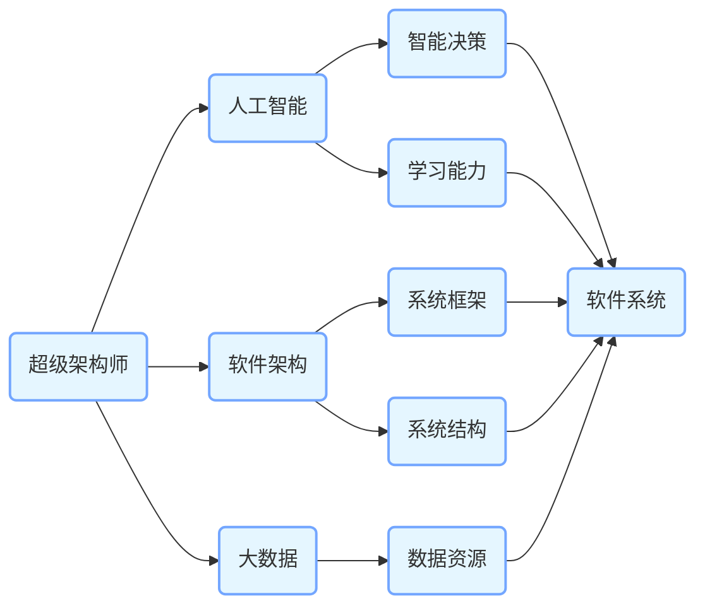

# 超级架构师:AI时代的新兴职业

> 关键词：超级架构师、AI时代、新兴职业、人工智能、软件架构、技术融合、职业发展

> 摘要：本文聚焦于AI时代的新兴职业——超级架构师。在人工智能迅猛发展的当下，超级架构师这一角色应运而生。文章首先介绍了该职业出现的背景，包括目的和范围、预期读者等内容。接着阐述了超级架构师涉及的核心概念与联系，通过文本示意图和Mermaid流程图进行展示。详细讲解了相关核心算法原理及具体操作步骤，辅以Python源代码。呈现了数学模型和公式，并举例说明。通过项目实战，深入剖析了代码实际案例。探讨了超级架构师的实际应用场景，推荐了学习、开发等相关工具和资源。最后对超级架构师的未来发展趋势与挑战进行总结，同时给出常见问题解答和扩展阅读参考资料，旨在全面深入地为读者介绍这一新兴职业。

## 1. 背景介绍 
### 1.1 目的和范围
在当今科技飞速发展的时代，人工智能已经渗透到各个领域，改变了人们的生活和工作方式。随着AI技术的不断进步，软件系统变得越来越复杂，对架构设计的要求也日益提高。超级架构师这一新兴职业正是为了应对这种复杂多变的技术环境而产生的。

本文的目的在于全面介绍超级架构师这一职业，包括其核心概念、技能要求、工作内容、发展前景等方面。范围涵盖了与超级架构师相关的技术领域，如人工智能、软件架构、大数据等，以及该职业在不同行业的应用场景。

### 1.2 预期读者
本文的预期读者包括对人工智能和软件架构感兴趣的技术人员，如程序员、软件工程师、架构师等；正在考虑职业转型或拓展技能的IT从业者；对新兴职业发展趋势关注的人力资源专家和行业分析师；以及希望了解AI时代技术发展动态的企业管理者和决策者。

### 1.3 文档结构概述
本文将按照以下结构进行阐述：首先介绍超级架构师出现的背景信息，包括目的、预期读者等；接着深入探讨其核心概念与联系，通过图表直观展示；然后详细讲解核心算法原理和具体操作步骤，结合Python代码；再介绍相关数学模型和公式，并举例说明；通过项目实战，展示代码实现和解读；探讨实际应用场景；推荐相关的工具和资源；最后总结超级架构师的未来发展趋势与挑战，给出常见问题解答和扩展阅读参考资料。

### 1.4 术语表
#### 1.4.1 核心术语定义
- **超级架构师**：在AI时代，具备多领域专业知识和技能，能够设计和构建复杂软件系统架构，融合人工智能、大数据等先进技术，解决跨领域问题的高级技术人才。
- **人工智能（AI）**：使计算机系统能够执行通常需要人类智能才能完成的任务的技术，如学习、推理、决策等。
- **软件架构**：对软件系统的结构、组件、接口以及它们之间交互关系的抽象描述，是软件系统设计的基础。
- **大数据**：指无法在一定时间范围内用常规软件工具进行捕捉、管理和处理的数据集合，具有海量性、多样性、高速性和价值密度低等特点。

#### 1.4.2 相关概念解释
- **机器学习**：人工智能的一个分支，通过让计算机从数据中自动学习模式和规律，从而实现预测和决策。
- **深度学习**：一种基于人工神经网络的机器学习方法，通过构建多层神经网络模型，自动提取数据的特征和模式。
- **云计算**：通过互联网提供计算资源（如服务器、存储、软件等）的服务模式，具有灵活性、可扩展性和成本效益等优势。

#### 1.4.3 缩略词列表
- **AI**：Artificial Intelligence（人工智能）
- **ML**：Machine Learning（机器学习）
- **DL**：Deep Learning（深度学习）
- **HPC**：High Performance Computing（高性能计算）

## 2. 核心概念与联系 
超级架构师需要融合多个领域的知识和技能，其核心概念主要包括人工智能、软件架构、大数据等，这些概念之间相互关联、相互影响。

### 文本示意图
超级架构师处于整个技术体系的核心位置，连接着人工智能、软件架构和大数据等领域。人工智能为软件系统提供智能决策和学习能力，软件架构为系统的构建和运行提供框架和结构，大数据则为人工智能和软件系统提供丰富的数据资源。通过超级架构师的设计和协调，这些领域能够有机结合，形成高效、智能的软件系统。

### Mermaid流程图


从流程图可以看出，超级架构师作为核心，将人工智能、软件架构和大数据的相关功能和资源整合到软件系统中，实现系统的智能化和高效化。

## 3. 核心算法原理 & 具体操作步骤 
### 核心算法原理
在超级架构师的工作中，涉及到多种核心算法，如机器学习算法、深度学习算法等。下面以简单的线性回归算法为例进行讲解。

线性回归是一种用于预测连续数值的机器学习算法，其基本原理是通过找到一条最佳拟合直线，使得数据点到该直线的误差平方和最小。假设我们有一组数据点 $(x_1, y_1), (x_2, y_2), \cdots, (x_n, y_n)$，线性回归模型的目标是找到参数 $w$ 和 $b$，使得预测值 $\hat{y}_i = wx_i + b$ 与真实值 $y_i$ 的误差最小。

误差通常用均方误差（Mean Squared Error，MSE）来衡量，其公式为：

$$MSE = \frac{1}{n} \sum_{i=1}^{n} (y_i - \hat{y}_i)^2 = \frac{1}{n} \sum_{i=1}^{n} (y_i - (wx_i + b))^2$$

为了找到使 MSE 最小的 $w$ 和 $b$，我们可以使用梯度下降算法。梯度下降算法是一种迭代优化算法，通过不断更新参数 $w$ 和 $b$，使得 MSE 逐渐减小。

### 具体操作步骤
以下是使用Python实现线性回归算法的具体步骤和代码：

```python
import numpy as np

# 步骤1: 生成数据
np.random.seed(0)
x = np.random.rand(100, 1)
y = 2 * x + 1 + 0.5 * np.random.randn(100, 1)

# 步骤2: 初始化参数
w = np.random.randn(1)
b = np.random.randn(1)

# 步骤3: 定义超参数
learning_rate = 0.1
num_iterations = 1000

# 步骤4: 梯度下降迭代
for iteration in range(num_iterations):
    # 计算预测值
    y_pred = w * x + b
    
    # 计算误差
    error = y_pred - y
    
    # 计算梯度
    dw = (2 / len(x)) * np.sum(error * x)
    db = (2 / len(x)) * np.sum(error)
    
    # 更新参数
    w = w - learning_rate * dw
    b = b - learning_rate * db
    
    # 打印损失值（可选）
    if iteration % 100 == 0:
        mse = np.mean((y - y_pred) ** 2)
        print(f'Iteration {iteration}: MSE = {mse}')

# 步骤5: 输出最终结果
print(f'Final w: {w}, Final b: {b}')
```

### 代码解释
1. **生成数据**：使用 `np.random.rand` 生成随机输入数据 $x$，并根据线性关系 $y = 2x + 1$ 加上一些随机噪声生成输出数据 $y$。
2. **初始化参数**：随机初始化参数 $w$ 和 $b$。
3. **定义超参数**：设置学习率 `learning_rate` 和迭代次数 `num_iterations`。
4. **梯度下降迭代**：在每次迭代中，计算预测值 $y_{pred}$，误差 $error$，以及参数的梯度 $dw$ 和 $db$，然后使用梯度下降公式更新参数 $w$ 和 $b$。
5. **输出最终结果**：打印最终的参数 $w$ 和 $b$。

## 4. 数学模型和公式 & 详细讲解 & 举例说明 
### 线性回归的数学模型和公式
线性回归的数学模型可以表示为：

$$y = wx + b + \epsilon$$

其中，$y$ 是因变量，$x$ 是自变量，$w$ 是斜率，$b$ 是截距，$\epsilon$ 是误差项，通常假设 $\epsilon$ 服从均值为 0，方差为 $\sigma^2$ 的正态分布。

如前所述，线性回归的目标是找到参数 $w$ 和 $b$，使得均方误差（MSE）最小。MSE 的公式为：

$$MSE = \frac{1}{n} \sum_{i=1}^{n} (y_i - (wx_i + b))^2$$

为了使用梯度下降算法求解 $w$ 和 $b$，我们需要计算 MSE 关于 $w$ 和 $b$ 的偏导数：

$$\frac{\partial MSE}{\partial w} = \frac{2}{n} \sum_{i=1}^{n} (y_i - (wx_i + b))(-x_i)$$

$$\frac{\partial MSE}{\partial b} = \frac{2}{n} \sum_{i=1}^{n} (y_i - (wx_i + b))(-1)$$

### 详细讲解
梯度下降算法的基本思想是沿着负梯度方向更新参数，使得损失函数（这里是 MSE）逐渐减小。具体来说，在每次迭代中，参数 $w$ 和 $b$ 的更新公式为：

$$w = w - \alpha \frac{\partial MSE}{\partial w}$$

$$b = b - \alpha \frac{\partial MSE}{\partial b}$$

其中，$\alpha$ 是学习率，控制每次更新的步长。

### 举例说明
假设我们有以下数据点：

| $x$ | $y$ |
| --- | --- |
| 1 | 3 |
| 2 | 5 |
| 3 | 7 |

我们可以使用线性回归来拟合这些数据。首先，初始化参数 $w = 0$，$b = 0$，学习率 $\alpha = 0.1$，迭代次数为 100 次。

在第一次迭代中：

- 计算预测值：$\hat{y}_1 = 0 \times 1 + 0 = 0$，$\hat{y}_2 = 0 \times 2 + 0 = 0$，$\hat{y}_3 = 0 \times 3 + 0 = 0$。
- 计算误差：$error_1 = 3 - 0 = 3$，$error_2 = 5 - 0 = 5$，$error_3 = 7 - 0 = 7$。
- 计算梯度：

  $$\frac{\partial MSE}{\partial w} = \frac{2}{3} \times (3 \times (-1) + 5 \times (-2) + 7 \times (-3)) = \frac{2}{3} \times (-3 - 10 - 21) = -\frac{68}{3}$$

  $$\frac{\partial MSE}{\partial b} = \frac{2}{3} \times (3 \times (-1) + 5 \times (-1) + 7 \times (-1)) = \frac{2}{3} \times (-3 - 5 - 7) = -10$$

- 更新参数：

  $$w = 0 - 0.1 \times (-\frac{68}{3}) \approx 2.27$$

  $$b = 0 - 0.1 \times (-10) = 1$$

经过多次迭代，$w$ 和 $b$ 会逐渐收敛到最优值，使得 MSE 最小。

## 5. 项目实战：代码实际案例和详细解释说明 
### 5.1  开发环境搭建
在进行项目实战之前，我们需要搭建开发环境。以下是具体步骤：

1. **安装 Python**：从 Python 官方网站（https://www.python.org/downloads/）下载并安装 Python 3.x 版本。
2. **安装必要的库**：使用 `pip` 安装以下库：
   - `numpy`：用于数值计算。
   - `pandas`：用于数据处理和分析。
   - `matplotlib`：用于数据可视化。
   - `scikit-learn`：用于机器学习算法实现。

可以使用以下命令进行安装：

```sh
pip install numpy pandas matplotlib scikit-learn
```

3. **选择开发工具**：可以选择使用 Jupyter Notebook、PyCharm 等开发工具。

### 5.2  源代码详细实现和代码解读
我们以一个简单的房价预测项目为例，使用线性回归算法进行房价预测。

```python
import numpy as np
import pandas as pd
import matplotlib.pyplot as plt
from sklearn.model_selection import train_test_split
from sklearn.linear_model import LinearRegression
from sklearn.metrics import mean_squared_error

# 步骤1: 加载数据
data = pd.read_csv('housing.csv')

# 步骤2: 数据预处理
X = data.drop('MEDV', axis=1)  # 特征数据
y = data['MEDV']  # 目标数据

# 步骤3: 划分训练集和测试集
X_train, X_test, y_train, y_test = train_test_split(X, y, test_size=0.2, random_state=42)

# 步骤4: 训练模型
model = LinearRegression()
model.fit(X_train, y_train)

# 步骤5: 预测
y_pred = model.predict(X_test)

# 步骤6: 评估模型
mse = mean_squared_error(y_test, y_pred)
rmse = np.sqrt(mse)
print(f'Root Mean Squared Error (RMSE): {rmse}')

# 步骤7: 可视化结果
plt.scatter(y_test, y_pred)
plt.xlabel('Actual Prices')
plt.ylabel('Predicted Prices')
plt.title('Actual vs Predicted Prices')
plt.show()
```

### 代码解读与分析
1. **加载数据**：使用 `pandas` 的 `read_csv` 函数加载房价数据集。
2. **数据预处理**：将特征数据和目标数据分离。
3. **划分训练集和测试集**：使用 `train_test_split` 函数将数据集划分为训练集和测试集，测试集占比为 20%。
4. **训练模型**：使用 `LinearRegression` 类创建线性回归模型，并使用训练集数据进行训练。
5. **预测**：使用训练好的模型对测试集数据进行预测。
6. **评估模型**：使用均方根误差（RMSE）评估模型的性能。
7. **可视化结果**：使用 `matplotlib` 绘制实际房价和预测房价的散点图，直观展示模型的预测效果。

## 6. 实际应用场景 
超级架构师在多个领域都有广泛的应用，以下是一些常见的应用场景：

### 金融领域
在金融领域，超级架构师可以设计和构建智能金融系统，如风险评估系统、投资决策系统等。通过融合人工智能和大数据技术，这些系统可以对海量的金融数据进行分析和挖掘，实现风险的精准评估和投资策略的智能决策，提高金融机构的运营效率和风险管理能力。

### 医疗领域
在医疗领域，超级架构师可以参与医疗信息系统的架构设计，实现电子病历、医学影像、临床决策支持等系统的集成和优化。利用人工智能技术，还可以开发疾病诊断辅助系统、药物研发平台等，提高医疗服务的质量和效率，推动医疗行业的数字化转型。

### 交通领域
在交通领域，超级架构师可以设计智能交通系统，如自动驾驶系统、交通流量预测系统等。通过整合传感器数据、地理信息数据和人工智能算法，这些系统可以实现交通的智能化管理和优化，减少交通拥堵，提高交通安全水平。

### 工业领域
在工业领域，超级架构师可以构建工业互联网平台，实现设备的联网、数据的采集和分析，以及生产过程的智能化控制。通过人工智能技术，可以实现故障预测、质量控制、生产调度等功能，提高工业生产的效率和质量，推动工业的智能化升级。

## 7. 工具和资源推荐
### 7.1 学习资源推荐
#### 7.1.1 书籍推荐
- 《Python机器学习》：全面介绍了Python在机器学习领域的应用，包括各种机器学习算法的原理和实现。
- 《深度学习》：由深度学习领域的三位先驱 Ian Goodfellow、Yoshua Bengio 和 Aaron Courville 撰写，是深度学习领域的经典教材。
- 《软件架构设计：大型网站技术架构与业务架构融合之道》：深入讲解了软件架构设计的原理和方法，结合实际案例进行分析。

#### 7.1.2 在线课程
- Coursera 上的《机器学习》课程：由 Andrew Ng 教授授课，是机器学习领域的经典在线课程。
- edX 上的《深度学习基础》课程：提供了深度学习的基础知识和实践项目。
- 中国大学MOOC上的《软件体系结构》课程：系统介绍了软件体系结构的相关知识和技术。

#### 7.1.3 技术博客和网站
- Medium：有许多关于人工智能、软件架构等领域的优秀技术文章。
- 开源中国：提供了丰富的技术资讯和开源项目资源。
- 博客园：众多技术开发者分享自己的技术经验和心得。

### 7.2 开发工具框架推荐
#### 7.2.1 IDE和编辑器
- PyCharm：功能强大的Python集成开发环境，提供代码编辑、调试、版本控制等功能。
- Jupyter Notebook：交互式的开发环境，适合进行数据分析和机器学习实验。
- Visual Studio Code：轻量级的代码编辑器，支持多种编程语言和插件扩展。

#### 7.2.2 调试和性能分析工具
- Py-Spy：用于Python代码的性能分析和调试。
- TensorBoard：TensorFlow的可视化工具，用于查看模型训练过程和性能指标。
- cProfile：Python内置的性能分析模块，用于分析代码的运行时间和调用次数。

#### 7.2.3 相关框架和库
- TensorFlow：开源的深度学习框架，广泛应用于图像识别、自然语言处理等领域。
- PyTorch：另一个流行的深度学习框架，具有动态图和易于使用的特点。
- Scikit-learn：简单易用的机器学习库，提供了各种机器学习算法和工具。

### 7.3 相关论文著作推荐
#### 7.3.1 经典论文
- 《Gradient-Based Learning Applied to Document Recognition》：介绍了卷积神经网络（CNN）在文档识别中的应用，是CNN领域的经典论文。
- 《Attention Is All You Need》：提出了Transformer架构，在自然语言处理领域引起了广泛关注。
- 《A Neural Algorithm of Artistic Style》：介绍了一种基于神经网络的艺术风格迁移算法。

#### 7.3.2 最新研究成果
- 关注顶级学术会议，如NeurIPS（神经信息处理系统大会）、ICML（国际机器学习会议）、CVPR（计算机视觉与模式识别会议）等，了解人工智能领域的最新研究成果。
- 查阅相关学术期刊，如Journal of Artificial Intelligence Research（JAIR）、Artificial Intelligence等。

#### 7.3.3 应用案例分析
- 分析各大科技公司的技术博客和开源项目，了解他们在实际应用中如何使用人工智能和软件架构技术。
- 研究行业报告和案例分析，了解不同行业在数字化转型过程中的技术应用和实践经验。

## 8. 总结：未来发展趋势与挑战
### 未来发展趋势
- **技术融合加速**：超级架构师需要不断融合人工智能、大数据、云计算、物联网等多种技术，构建更加复杂和智能的软件系统。
- **跨领域应用拓展**：随着AI技术的普及，超级架构师的应用场景将不断拓展到更多领域，如教育、能源、环保等。
- **智能化与自动化**：软件系统将越来越智能化和自动化，超级架构师需要设计能够自动学习、自动优化的系统架构。
- **绿色计算与可持续发展**：在追求性能和效率的同时，超级架构师需要考虑系统的能耗和环境影响，推动绿色计算和可持续发展。

### 挑战
- **技术更新换代快**：人工智能和相关技术发展迅速，超级架构师需要不断学习和更新知识，跟上技术发展的步伐。
- **数据隐私和安全**：随着数据的大量产生和使用，数据隐私和安全问题日益突出，超级架构师需要设计安全可靠的系统架构，保护用户数据的安全。
- **跨领域协作困难**：超级架构师需要与不同领域的专业人员合作，沟通和协作成本较高，需要具备良好的团队协作和沟通能力。
- **伦理和法律问题**：人工智能技术的应用带来了一系列伦理和法律问题，如算法偏见、隐私侵犯等，超级架构师需要在设计系统时考虑这些问题，确保技术的合理应用。

## 9. 附录：常见问题与解答
### 问题1：超级架构师与传统架构师有什么区别？
解答：超级架构师与传统架构师相比，需要具备更广泛的知识和技能。传统架构师主要关注软件系统的结构和设计，而超级架构师需要融合人工智能、大数据等多种技术，解决跨领域的复杂问题。超级架构师需要具备更强的创新能力和技术前瞻性，能够应对快速变化的技术环境。

### 问题2：成为超级架构师需要具备哪些技能？
解答：成为超级架构师需要具备多方面的技能，包括但不限于：扎实的计算机科学基础知识，如数据结构、算法、操作系统等；深入了解人工智能、机器学习、深度学习等技术；掌握软件架构设计的原则和方法；具备良好的编程能力，熟悉多种编程语言和开发工具；具备团队协作和沟通能力，能够与不同领域的专业人员合作。

### 问题3：超级架构师的职业发展前景如何？
解答：随着人工智能技术的广泛应用，超级架构师的需求将不断增加。超级架构师可以在科技公司、金融机构、医疗企业等多个领域找到工作机会。职业发展路径包括技术专家、技术经理、CTO等高级管理职位。同时，超级架构师也可以选择创业，开发创新的软件产品和服务。

### 问题4：如何学习成为超级架构师？
解答：学习成为超级架构师需要系统地学习相关知识和技能。可以从学习计算机科学基础知识入手，逐步深入学习人工智能、机器学习、深度学习等技术。通过阅读专业书籍、参加在线课程、实践项目等方式不断提升自己的能力。同时，要关注行业动态和最新研究成果，与同行交流和分享经验。

## 10. 扩展阅读 & 参考资料
### 扩展阅读
- 《AI 3.0》：探讨了人工智能的发展历程、现状和未来趋势，对理解人工智能时代的技术变革有很大帮助。
- 《软件架构实战：大型网站技术架构演进与性能优化》：通过实际案例介绍了软件架构的设计和优化方法。
- 《智能时代》：阐述了人工智能对社会和经济的影响，以及如何在智能时代中发展和创新。

### 参考资料
- 相关学术论文和研究报告，如IEEE、ACM等学术组织发表的论文。
- 各大科技公司的技术博客和开源项目文档，如Google、Facebook、Microsoft等公司的技术分享。
- 行业标准和规范，如ISO、IEEE等组织制定的相关标准。