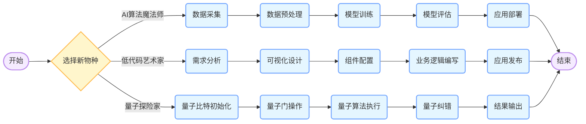

# 超级程序员的诞生：AI时代的三大程序员新物种

> 关键词：AI时代、超级程序员、新物种、编程范式、技术融合

> 摘要：在人工智能时代，编程领域正经历着前所未有的变革，催生出了三大超级程序员新物种。本文深入探讨这三大新物种的核心概念、算法原理、数学模型，并通过项目实战展示其具体应用。分析了它们在不同实际场景中的作用，同时推荐了相关的学习资源、开发工具和研究论文。最后总结了未来发展趋势与挑战，旨在为广大程序员和技术爱好者提供全面的参考，助力他们在AI时代更好地适应和发展。

## 1. 背景介绍 
### 1.1 目的和范围
随着人工智能技术的飞速发展，传统的编程模式和程序员角色正在发生深刻的变化。本文的目的是深入剖析AI时代诞生的三大程序员新物种，揭示它们的特点、技术原理和应用场景。范围涵盖了从核心概念的阐述到实际项目的案例分析，以及相关学习资源和工具的推荐，为读者全面了解和掌握这些新物种提供指引。

### 1.2 预期读者
本文预期读者包括广大程序员、软件开发者、技术爱好者、计算机专业学生以及对人工智能和编程领域发展感兴趣的人士。无论是初学者希望了解行业新趋势，还是有经验的开发者寻求技术突破，都能从本文中获得有价值的信息。

### 1.3 文档结构概述
本文将按照以下结构进行阐述：首先介绍核心概念与联系，明确三大程序员新物种的定义和相互关系；接着详细讲解核心算法原理和具体操作步骤，并给出Python源代码示例；然后阐述相关的数学模型和公式，通过举例加深理解；之后进行项目实战，包括开发环境搭建、源代码实现和代码解读；再探讨实际应用场景；推荐学习资源、开发工具和相关论文；最后总结未来发展趋势与挑战，并提供常见问题解答和扩展阅读参考资料。

### 1.4 术语表
#### 1.4.1 核心术语定义
- **超级程序员新物种**：在AI时代，具备独特编程能力和思维方式，能够融合多种技术解决复杂问题的新型程序员群体。
- **AI编程范式**：基于人工智能技术的编程模式，强调数据驱动、模型训练和智能决策。
- **低代码开发**：通过可视化界面和少量代码实现应用程序开发的方法。
- **量子编程**：利用量子计算机的特性进行编程，以实现更高效的计算和数据处理。

#### 1.4.2 相关概念解释
- **机器学习**：让计算机通过数据学习模式和规律，从而实现预测和决策的技术。
- **深度学习**：机器学习的一个分支，使用多层神经网络进行复杂数据的学习和处理。
- **区块链**：一种分布式账本技术，具有去中心化、不可篡改等特点。

#### 1.4.3 缩略词列表
- **AI**：Artificial Intelligence，人工智能
- **ML**：Machine Learning，机器学习
- **DL**：Deep Learning，深度学习
- **QC**：Quantum Computing，量子计算
- **LCD**：Low-Code Development，低代码开发

## 2. 核心概念与联系 
### 2.1 三大程序员新物种的定义
在AI时代，诞生了以下三大超级程序员新物种：
- **AI算法魔法师**：专注于人工智能算法的研究和开发，擅长运用机器学习、深度学习等技术解决各种复杂的问题。他们能够设计和训练高效的模型，从大量数据中提取有价值的信息，并应用于图像识别、自然语言处理、预测分析等领域。
- **低代码艺术家**：精通低代码开发平台，通过可视化界面和少量代码快速搭建应用程序。他们能够将业务需求转化为可运行的软件，大大缩短了开发周期，提高了开发效率。低代码艺术家注重用户体验和业务流程的优化，使非技术人员也能参与到开发过程中。
- **量子探险家**：探索量子计算领域，利用量子计算机的独特特性进行编程。量子计算机具有强大的并行计算能力，能够解决传统计算机难以处理的复杂问题。量子探险家需要掌握量子力学原理和量子编程算法，为未来的科技发展开辟新的道路。

### 2.2 核心概念原理和架构的文本示意图
| 新物种名称 | 核心原理 | 架构组成 |
| --- | --- | --- |
| AI算法魔法师 | 基于机器学习和深度学习模型，通过数据训练和优化，实现智能决策和预测。 | 数据采集层、数据预处理层、模型训练层、模型评估层、应用层 |
| 低代码艺术家 | 利用低代码开发平台提供的可视化组件和模板，通过拖拽和配置实现应用开发。 | 可视化设计器、组件库、业务逻辑引擎、数据存储层、部署层 |
| 量子探险家 | 运用量子比特和量子门操作，实现量子算法的编程和执行。 | 量子比特层、量子门操作层、量子算法层、量子纠错层、量子硬件接口层 |

### 2.3 Mermaid流程图


## 3. 核心算法原理 & 具体操作步骤 

### 3.1 AI算法魔法师
#### 3.1.1 核心算法原理
AI算法魔法师主要运用机器学习和深度学习算法，如决策树、支持向量机、神经网络等。以神经网络为例，其基本原理是通过多层神经元之间的连接和权重调整，实现对输入数据的特征提取和分类。神经网络的训练过程是通过反向传播算法不断调整权重，使得模型的输出与真实标签之间的误差最小化。

#### 3.1.2 具体操作步骤
以下是使用Python和TensorFlow库实现一个简单的神经网络分类器的示例代码：
```python
import tensorflow as tf
from tensorflow.keras.datasets import mnist
from tensorflow.keras.models import Sequential
from tensorflow.keras.layers import Dense, Flatten

# 加载MNIST数据集
(x_train, y_train), (x_test, y_test) = mnist.load_data()

# 数据预处理
x_train = x_train / 255.0
x_test = x_test / 255.0

# 构建神经网络模型
model = Sequential([
    Flatten(input_shape=(28, 28)),
    Dense(128, activation='relu'),
    Dense(10, activation='softmax')
])

# 编译模型
model.compile(optimizer='adam',
              loss='sparse_categorical_crossentropy',
              metrics=['accuracy'])

# 训练模型
model.fit(x_train, y_train, epochs=5)

# 评估模型
test_loss, test_acc = model.evaluate(x_test, y_test)
print(f"Test accuracy: {test_acc}")
```
#### 3.1.3 代码解释
1. **数据加载**：使用`mnist.load_data()`函数加载MNIST手写数字数据集。
2. **数据预处理**：将像素值归一化到0-1之间，以提高模型的训练效果。
3. **模型构建**：使用`Sequential`模型构建一个简单的神经网络，包括一个扁平化层、一个全连接层和一个输出层。
4. **模型编译**：指定优化器、损失函数和评估指标。
5. **模型训练**：使用`fit`方法对模型进行训练。
6. **模型评估**：使用`evaluate`方法评估模型在测试集上的性能。

### 3.2 低代码艺术家
#### 3.2.1 核心算法原理
低代码开发平台的核心算法原理是基于元数据驱动和组件化开发。平台通过定义一组元数据来描述应用程序的结构和行为，开发人员可以通过可视化界面选择和配置这些元数据，生成相应的代码。组件化开发则是将常用的功能封装成组件，开发人员可以直接使用这些组件来构建应用程序，提高开发效率。

#### 3.2.2 具体操作步骤
以下是一个使用OutSystems低代码开发平台创建一个简单的员工管理应用的示例：
1. **创建应用**：在OutSystems平台上创建一个新的应用项目。
2. **设计数据模型**：使用可视化界面设计员工信息的数据模型，包括员工姓名、部门、职位等字段。
3. **创建用户界面**：通过拖拽和配置组件，创建员工列表、员工详情和员工添加等页面。
4. **编写业务逻辑**：使用低代码平台提供的逻辑编辑器，编写员工信息的增删改查等业务逻辑。
5. **部署应用**：将应用部署到测试环境或生产环境中。

### 3.3 量子探险家
#### 3.3.1 核心算法原理
量子编程的核心算法原理是基于量子比特和量子门操作。量子比特是量子计算的基本信息单位，它可以同时处于0和1的叠加态。量子门是对量子比特进行操作的基本单元，通过组合不同的量子门可以实现各种量子算法。

#### 3.3.2 具体操作步骤
以下是使用Qiskit库实现一个简单的量子比特翻转操作的示例代码：
```python
from qiskit import QuantumCircuit, Aer, execute
import numpy as np

# 创建一个量子电路，包含1个量子比特和1个经典比特
qc = QuantumCircuit(1, 1)

# 应用X门，翻转量子比特的状态
qc.x(0)

# 测量量子比特，并将结果存储到经典比特中
qc.measure(0, 0)

# 使用模拟器运行量子电路
backend = Aer.get_backend('qasm_simulator')
job = execute(qc, backend, shots=1024)
result = job.result()

# 统计测量结果
counts = result.get_counts(qc)
print(counts)
```
#### 3.3.3 代码解释
1. **创建量子电路**：使用`QuantumCircuit`类创建一个包含1个量子比特和1个经典比特的量子电路。
2. **应用量子门**：使用`x`门翻转量子比特的状态。
3. **测量量子比特**：使用`measure`方法测量量子比特，并将结果存储到经典比特中。
4. **运行量子电路**：使用`Aer`模拟器运行量子电路，并指定运行次数。
5. **统计测量结果**：使用`get_counts`方法统计测量结果。

## 4. 数学模型和公式 & 详细讲解 & 举例说明 

### 4.1 AI算法魔法师
#### 4.1.1 数学模型和公式
在神经网络中，最常用的激活函数是ReLU（Rectified Linear Unit），其数学公式为：
$$
f(x) = \max(0, x)
$$
在训练神经网络时，常用的损失函数是交叉熵损失函数，对于多分类问题，其数学公式为：
$$
L(y, \hat{y}) = -\sum_{i=1}^{n} y_i \log(\hat{y}_i)
$$
其中，$y$ 是真实标签，$\hat{y}$ 是模型的预测输出，$n$ 是类别数。

#### 4.1.2 详细讲解
ReLU激活函数的作用是引入非线性因素，使得神经网络能够学习到更复杂的模式。交叉熵损失函数衡量了模型预测输出与真实标签之间的差异，通过最小化损失函数可以提高模型的性能。

#### 4.1.3 举例说明
假设我们有一个三分类问题，真实标签为 $y = [0, 1, 0]$，模型的预测输出为 $\hat{y} = [0.1, 0.8, 0.1]$，则交叉熵损失为：
$$
L(y, \hat{y}) = -(0 \log(0.1) + 1 \log(0.8) + 0 \log(0.1)) \approx 0.223
$$

### 4.2 低代码艺术家
#### 4.2.1 数学模型和公式
低代码开发主要基于图论和状态机理论。图论用于描述应用程序的结构和组件之间的关系，状态机用于描述应用程序的业务流程和状态转换。

#### 4.2.2 详细讲解
在图论中，应用程序可以表示为一个有向图，其中节点表示组件，边表示组件之间的连接关系。状态机则通过定义一组状态和状态之间的转换规则，来描述应用程序的业务逻辑。

#### 4.2.3 举例说明
假设我们有一个简单的员工请假流程，包括申请、审批和批准三个状态。状态机可以表示为：
- 初始状态：申请
- 状态转换规则：
  - 申请 -> 审批：员工提交请假申请
  - 审批 -> 批准：审批人通过审批
  - 审批 -> 申请：审批人拒绝审批

### 4.3 量子探险家
#### 4.3.1 数学模型和公式
在量子计算中，量子比特的状态可以用向量表示。例如，一个单量子比特的状态可以表示为：
$$
|\psi\rangle = \alpha |0\rangle + \beta |1\rangle
$$
其中，$\alpha$ 和 $\beta$ 是复数，满足 $|\alpha|^2 + |\beta|^2 = 1$。量子门可以用矩阵表示，例如，X门的矩阵表示为：
$$
X = \begin{bmatrix}
0 & 1 \\
1 & 0
\end{bmatrix}
$$

#### 4.3.2 详细讲解
量子比特的状态向量表示了量子比特处于 $|0\rangle$ 和 $|1\rangle$ 状态的概率幅。量子门的矩阵表示了对量子比特状态的操作，通过矩阵乘法可以实现量子门的作用。

#### 4.3.3 举例说明
假设一个单量子比特的初始状态为 $|\psi\rangle = |0\rangle$，应用X门后，其状态变为：
$$
X |0\rangle = \begin{bmatrix}
0 & 1 \\
1 & 0
\end{bmatrix}
\begin{bmatrix}
1 \\
0
\end{bmatrix}
= \begin{bmatrix}
0 \\
1
\end{bmatrix}
= |1\rangle
$$

## 5. 项目实战：代码实际案例和详细解释说明 

### 5.1  开发环境搭建
#### 5.1.1 AI算法魔法师
- **Python环境**：安装Python 3.7及以上版本。
- **深度学习库**：安装TensorFlow、PyTorch等深度学习库。
- **开发工具**：推荐使用Jupyter Notebook或PyCharm等开发工具。

#### 5.1.2 低代码艺术家
- **低代码开发平台**：选择合适的低代码开发平台，如OutSystems、Mendix等。
- **浏览器**：使用Chrome、Firefox等现代浏览器进行开发和测试。

#### 5.1.3 量子探险家
- **量子编程库**：安装Qiskit、Cirq等量子编程库。
- **量子模拟器**：使用本地量子模拟器或云量子计算平台进行开发和测试。

### 5.2  源代码详细实现和代码解读
#### 5.2.1 AI算法魔法师
以下是一个使用TensorFlow实现图像分类的完整项目示例：
```python
import tensorflow as tf
from tensorflow.keras.datasets import cifar10
from tensorflow.keras.models import Sequential
from tensorflow.keras.layers import Conv2D, MaxPooling2D, Flatten, Dense
from tensorflow.keras.utils import to_categorical

# 加载CIFAR-10数据集
(x_train, y_train), (x_test, y_test) = cifar10.load_data()

# 数据预处理
x_train = x_train / 255.0
x_test = x_test / 255.0
y_train = to_categorical(y_train)
y_test = to_categorical(y_test)

# 构建卷积神经网络模型
model = Sequential([
    Conv2D(32, (3, 3), activation='relu', input_shape=(32, 32, 3)),
    MaxPooling2D((2, 2)),
    Conv2D(64, (3, 3), activation='relu'),
    MaxPooling2D((2, 2)),
    Flatten(),
    Dense(64, activation='relu'),
    Dense(10, activation='softmax')
])

# 编译模型
model.compile(optimizer='adam',
              loss='categorical_crossentropy',
              metrics=['accuracy'])

# 训练模型
model.fit(x_train, y_train, epochs=10, batch_size=32)

# 评估模型
test_loss, test_acc = model.evaluate(x_test, y_test)
print(f"Test accuracy: {test_acc}")
```
#### 代码解读
1. **数据加载**：使用`cifar10.load_data()`函数加载CIFAR-10图像数据集。
2. **数据预处理**：将像素值归一化到0-1之间，并将标签进行one-hot编码。
3. **模型构建**：使用`Sequential`模型构建一个卷积神经网络，包括卷积层、池化层、扁平化层和全连接层。
4. **模型编译**：指定优化器、损失函数和评估指标。
5. **模型训练**：使用`fit`方法对模型进行训练。
6. **模型评估**：使用`evaluate`方法评估模型在测试集上的性能。

#### 5.2.2 低代码艺术家
以下是一个使用OutSystems创建简单员工管理应用的详细步骤：
1. **创建应用**：登录OutSystems平台，创建一个新的应用项目。
2. **设计数据模型**：在数据建模工具中，创建员工实体，包括姓名、部门、职位等字段。
3. **创建用户界面**：使用可视化界面设计器，拖拽和配置组件，创建员工列表、员工详情和员工添加等页面。
4. **编写业务逻辑**：在逻辑编辑器中，编写员工信息的增删改查等业务逻辑。例如，在员工添加页面，当用户点击保存按钮时，将用户输入的信息保存到数据库中。
5. **部署应用**：将应用部署到测试环境或生产环境中，进行测试和发布。

#### 5.2.3 量子探险家
以下是一个使用Qiskit实现量子纠缠态制备的示例代码：
```python
from qiskit import QuantumCircuit, Aer, execute
import numpy as np

# 创建一个量子电路，包含2个量子比特和2个经典比特
qc = QuantumCircuit(2, 2)

# 应用H门，将第一个量子比特置于叠加态
qc.h(0)

# 应用CNOT门，实现量子纠缠
qc.cx(0, 1)

# 测量量子比特，并将结果存储到经典比特中
qc.measure([0, 1], [0, 1])

# 使用模拟器运行量子电路
backend = Aer.get_backend('qasm_simulator')
job = execute(qc, backend, shots=1024)
result = job.result()

# 统计测量结果
counts = result.get_counts(qc)
print(counts)
```
#### 代码解读
1. **创建量子电路**：使用`QuantumCircuit`类创建一个包含2个量子比特和2个经典比特的量子电路。
2. **应用量子门**：使用`h`门将第一个量子比特置于叠加态，使用`cx`门实现量子纠缠。
3. **测量量子比特**：使用`measure`方法测量量子比特，并将结果存储到经典比特中。
4. **运行量子电路**：使用`Aer`模拟器运行量子电路，并指定运行次数。
5. **统计测量结果**：使用`get_counts`方法统计测量结果。

### 5.3  代码解读与分析
#### 5.3.1 AI算法魔法师
在图像分类项目中，卷积神经网络通过卷积层提取图像的特征，池化层进行特征降维，全连接层进行分类决策。通过训练模型，不断调整权重，使得模型能够准确地对图像进行分类。

#### 5.3.2 低代码艺术家
低代码开发通过可视化界面和少量代码实现应用开发，大大提高了开发效率。开发人员可以专注于业务逻辑的实现，而不需要编写大量的底层代码。

#### 5.3.3 量子探险家
量子纠缠态是量子计算中的重要概念，通过制备量子纠缠态可以实现量子通信和量子计算的优势。在代码中，通过应用H门和CNOT门实现了量子纠缠态的制备。

## 6. 实际应用场景 
### 6.1 AI算法魔法师
- **图像识别**：在安防监控、自动驾驶、医疗影像诊断等领域，AI算法魔法师可以开发高精度的图像识别模型，实现目标检测、人脸识别、疾病诊断等功能。
- **自然语言处理**：在智能客服、机器翻译、文本生成等领域，AI算法魔法师可以设计和训练自然语言处理模型，实现人机对话、语言翻译、文章生成等功能。
- **预测分析**：在金融、医疗、营销等领域，AI算法魔法师可以利用机器学习算法进行数据预测和分析，帮助企业做出更明智的决策。

### 6.2 低代码艺术家
- **企业内部应用开发**：低代码艺术家可以快速搭建企业内部的管理系统、办公系统、业务流程系统等，满足企业的个性化需求，提高企业的运营效率。
- **快速原型开发**：在产品开发的早期阶段，低代码艺术家可以利用低代码开发平台快速创建产品原型，进行用户验证和反馈，加速产品的迭代和优化。
- **非技术人员参与开发**：低代码开发平台的可视化界面和简单的操作方式，使得非技术人员也能参与到应用开发中，促进业务部门和技术部门的协作。

### 6.3 量子探险家
- **密码学**：量子计算机的强大计算能力可以破解传统的加密算法，量子探险家可以研究和开发基于量子力学的加密算法，保障信息安全。
- **优化问题**：在物流、金融、交通等领域，存在大量的优化问题，量子计算机可以通过量子算法快速找到最优解，提高资源利用效率。
- **量子模拟**：量子探险家可以利用量子计算机模拟量子系统的行为，研究量子物理现象，为材料科学、化学等领域的研究提供支持。

## 7. 工具和资源推荐
### 7.1 学习资源推荐
#### 7.1.1 书籍推荐
- 《深度学习》（Deep Learning）：由Ian Goodfellow、Yoshua Bengio和Aaron Courville合著，是深度学习领域的经典教材。
- 《Python机器学习》（Python Machine Learning）：由Sebastian Raschka和Vahid Mirjalili合著，介绍了使用Python进行机器学习的方法和技巧。
- 《量子计算与量子信息》（Quantum Computation and Quantum Information）：由Michael A. Nielsen和Isaac L. Chuang合著，是量子计算领域的权威著作。

#### 7.1.2 在线课程
- Coursera上的“深度学习专项课程”（Deep Learning Specialization）：由Andrew Ng教授授课，系统地介绍了深度学习的理论和实践。
- edX上的“量子计算基础”（Foundations of Quantum Computing）：由MIT的教授授课，讲解了量子计算的基本原理和算法。
- OutSystems官方文档和教程：提供了低代码开发的详细介绍和实践案例。

#### 7.1.3 技术博客和网站
- Medium上的Towards Data Science：分享了大量关于数据科学、机器学习和深度学习的技术文章和案例。
- Qiskit官方博客：发布了量子计算领域的最新研究成果和应用案例。
- 开源中国：提供了丰富的技术文章和开源项目，涵盖了编程、人工智能、低代码开发等多个领域。

### 7.2 开发工具框架推荐
#### 7.2.1 IDE和编辑器
- PyCharm：是一款专业的Python集成开发环境，提供了丰富的代码编辑、调试和测试功能。
- Jupyter Notebook：是一个交互式的开发环境，适合进行数据探索、模型训练和可视化展示。
- Visual Studio Code：是一款轻量级的代码编辑器，支持多种编程语言和插件扩展。

#### 7.2.2 调试和性能分析工具
- TensorBoard：是TensorFlow提供的可视化工具，用于监控模型的训练过程和性能指标。
- PyTorch Profiler：是PyTorch提供的性能分析工具，用于分析模型的运行时间和内存使用情况。
- OutSystems调试器：用于调试低代码应用程序，定位和解决问题。

#### 7.2.3 相关框架和库
- TensorFlow：是一个开源的深度学习框架，提供了丰富的模型和工具，支持分布式训练和部署。
- PyTorch：是一个动态图深度学习框架，具有简洁易用的特点，适合快速开发和实验。
- Qiskit：是IBM开发的量子编程框架，提供了量子算法开发、量子电路模拟和量子硬件接口等功能。

### 7.3 相关论文著作推荐
#### 7.3.1 经典论文
- “ImageNet Classification with Deep Convolutional Neural Networks”：由Alex Krizhevsky、Ilya Sutskever和Geoffrey E. Hinton发表，介绍了AlexNet卷积神经网络在ImageNet图像分类任务中的应用。
- “Attention Is All You Need”：由Ashish Vaswani等人发表，提出了Transformer模型，在自然语言处理领域取得了巨大成功。
- “Quantum Computation and Shor's Factoring Algorithm”：由Peter W. Shor发表，介绍了Shor算法，展示了量子计算机在因式分解问题上的优势。

#### 7.3.2 最新研究成果
- 关注arXiv.org上的量子计算、机器学习和低代码开发等领域的最新预印本论文，了解前沿研究动态。
- 参加学术会议和研讨会，如NeurIPS、ICML、QIP等，获取最新的研究成果和技术趋势。

#### 7.3.3 应用案例分析
- 研究各大科技公司的技术博客和开源项目，了解他们在AI、低代码和量子计算等领域的应用案例和实践经验。
- 分析行业报告和案例研究，了解不同行业如何应用这些新技术解决实际问题。

## 8. 总结：未来发展趋势与挑战
### 8.1 未来发展趋势
- **技术融合**：AI算法魔法师、低代码艺术家和量子探险家这三大新物种之间的技术融合将越来越紧密。例如，将量子计算技术应用于AI算法的加速，使用低代码开发平台快速构建量子应用的用户界面。
- **自动化和智能化**：编程过程将越来越自动化和智能化。AI辅助编程工具将能够自动生成代码、调试代码和优化代码，低代码开发平台将进一步降低开发门槛，使得更多的人能够参与到编程中来。
- **跨学科应用**：编程技术将与其他学科如生物学、物理学、医学等深度融合，解决更加复杂的科学和工程问题。例如，利用AI算法分析生物数据，使用量子计算模拟物理系统。

### 8.2 挑战
- **技术门槛**：量子计算和深度学习等技术具有较高的门槛，需要掌握复杂的理论知识和数学基础。培养具备这些技能的程序员需要较长的时间和大量的资源。
- **数据安全和隐私**：随着AI和量子计算的发展，数据安全和隐私问题将变得更加突出。如何保护用户的敏感数据，防止数据泄露和滥用，是一个亟待解决的问题。
- **伦理和法律问题**：AI技术的广泛应用可能会带来一些伦理和法律问题，如算法歧视、自动化决策的责任归属等。需要建立相应的伦理和法律框架来规范技术的发展和应用。

## 9. 附录：常见问题与解答
### 9.1 AI算法魔法师相关问题
- **问**：如何选择合适的机器学习算法？
**答**：选择合适的机器学习算法需要考虑多个因素，如数据类型、数据规模、问题类型等。一般来说，可以先尝试一些简单的算法，如线性回归、逻辑回归等，然后根据模型的性能逐步尝试更复杂的算法，如决策树、随机森林、神经网络等。

- **问**：如何解决模型过拟合的问题？
**答**：解决模型过拟合的方法有很多，如增加训练数据、正则化、早停法等。增加训练数据可以使模型学习到更广泛的模式，正则化可以限制模型的复杂度，早停法可以在模型性能不再提升时停止训练。

### 9.2 低代码艺术家相关问题
- **问**：低代码开发平台是否能够满足复杂业务需求？
**答**：大多数低代码开发平台都提供了丰富的组件和功能，可以满足大部分常见的业务需求。对于一些复杂的业务需求，可以通过自定义代码、插件扩展等方式来实现。

- **问**：低代码开发的应用是否具有良好的可维护性？
**答**：低代码开发的应用通常具有较好的可维护性。由于低代码开发平台采用了可视化设计和组件化开发的方式，使得代码结构更加清晰，易于理解和修改。同时，平台也提供了一些工具和功能，帮助开发人员进行代码管理和版本控制。

### 9.3 量子探险家相关问题
- **问**：量子计算机何时能够大规模商用？
**答**：目前量子计算机仍处于发展阶段，要实现大规模商用还需要解决许多技术难题，如量子比特的稳定性、量子纠错等。预计在未来5-10年内，量子计算机可能会在某些特定领域实现商用。

- **问**：学习量子编程需要具备哪些基础知识？
**答**：学习量子编程需要具备一定的量子力学、线性代数和编程基础。了解量子比特、量子门、量子算法等基本概念，掌握Python等编程语言的使用。

## 10. 扩展阅读 & 参考资料
### 10.1 扩展阅读
- 《AI未来进行式》：李开复和王咏刚著，探讨了人工智能的未来发展趋势和应用场景。
- 《代码大全》：Steve McConnell著，是一本软件开发的经典著作，涵盖了软件开发的各个方面。
- 《量子物理学的奇妙之旅》：介绍了量子物理学的基本概念和奇妙现象，帮助读者更好地理解量子计算的原理。

### 10.2 参考资料
- TensorFlow官方文档：https://www.tensorflow.org/
- PyTorch官方文档：https://pytorch.org/
- Qiskit官方文档：https://qiskit.org/
- OutSystems官方文档：https://success.outsystems.com/
- arXiv.org：https://arxiv.org/