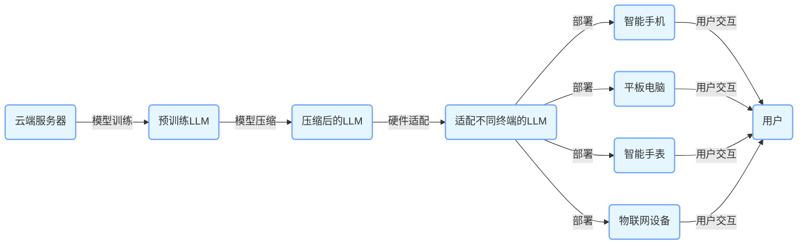

# 跨平台AI Agent：LLM在多种终端设备上的部署

> 关键词：跨平台、AI Agent、大语言模型（LLM）、终端设备部署、模型优化

> 摘要：本文围绕跨平台AI Agent中LLM在多种终端设备上的部署展开深入探讨。首先介绍了该研究的背景，包括目的、预期读者、文档结构和相关术语。接着阐述了核心概念，分析了LLM在不同终端设备上部署的原理和架构，并给出了相应的示意图和流程图。详细讲解了核心算法原理及具体操作步骤，通过Python代码进行了示例说明。同时，给出了相关的数学模型和公式，并举例解释。通过项目实战展示了代码的实际应用和详细解读。探讨了LLM在多种终端设备部署后的实际应用场景，推荐了学习、开发工具和相关论文著作。最后总结了未来发展趋势与挑战，解答了常见问题，并提供了扩展阅读和参考资料。

## 1. 背景介绍 
### 1.1 目的和范围
随着人工智能技术的飞速发展，大语言模型（LLM）如GPT、BERT等展现出了强大的语言理解和生成能力。然而，这些模型通常在云端服务器上运行，限制了其在一些对实时性要求高、网络连接不稳定或有隐私保护需求的场景中的应用。将LLM部署到多种终端设备上，如智能手机、平板电脑、智能手表、物联网设备等，实现跨平台的AI Agent，可以拓展其应用范围，提高用户体验。

本文的范围涵盖了LLM在不同终端设备上部署的核心概念、算法原理、数学模型、实际案例以及相关的工具和资源推荐。旨在为开发者和研究人员提供全面的指导，帮助他们了解如何将LLM成功部署到多种终端设备上。

### 1.2 预期读者
本文的预期读者包括人工智能开发者、软件工程师、研究人员、对跨平台AI Agent感兴趣的技术爱好者等。这些读者需要具备一定的编程基础和人工智能相关知识，以便更好地理解文中的内容。

### 1.3 文档结构概述
本文将按照以下结构进行组织：
1. **核心概念与联系**：介绍LLM在多种终端设备上部署的核心概念、原理和架构，并给出相应的示意图和流程图。
2. **核心算法原理 & 具体操作步骤**：详细讲解核心算法原理，通过Python代码展示具体的操作步骤。
3. **数学模型和公式 & 详细讲解 & 举例说明**：给出相关的数学模型和公式，并进行详细讲解和举例说明。
4. **项目实战：代码实际案例和详细解释说明**：通过实际项目案例，展示代码的实现和详细解读。
5. **实际应用场景**：探讨LLM在多种终端设备上部署后的实际应用场景。
6. **工具和资源推荐**：推荐学习、开发工具和相关论文著作。
7. **总结：未来发展趋势与挑战**：总结LLM在多种终端设备上部署的未来发展趋势和面临的挑战。
8. **附录：常见问题与解答**：解答读者在阅读过程中可能遇到的常见问题。
9. **扩展阅读 & 参考资料**：提供相关的扩展阅读材料和参考资料。

### 1.4 术语表
#### 1.4.1 核心术语定义
- **大语言模型（LLM）**：是一种基于深度学习的语言模型，通过在大规模文本数据上进行训练，学习语言的模式和规律，能够生成自然语言文本、回答问题、进行对话等。
- **AI Agent**：人工智能代理，是一种能够感知环境、做出决策并采取行动的智能实体。在本文中，AI Agent基于LLM实现，能够在多种终端设备上运行。
- **跨平台**：指软件或系统能够在不同的操作系统、硬件平台上正常运行。
- **终端设备**：指直接与用户交互的设备，如智能手机、平板电脑、智能手表、物联网设备等。

#### 1.4.2 相关概念解释
- **模型量化**：是一种将模型参数从高精度（如32位浮点数）转换为低精度（如8位整数）的技术，能够减少模型的存储空间和计算量，提高模型的运行效率。
- **模型剪枝**：是一种通过去除模型中不重要的连接或神经元，减少模型的参数数量，从而降低模型的复杂度和计算量的技术。
- **边缘计算**：是一种将计算和数据存储靠近数据源的计算模式，能够减少数据传输延迟，提高系统的实时性和可靠性。

#### 1.4.3 缩略词列表
- **LLM**：Large Language Model（大语言模型）
- **AI**：Artificial Intelligence（人工智能）
- **CPU**：Central Processing Unit（中央处理器）
- **GPU**：Graphics Processing Unit（图形处理器）
- **NPU**：Neural Processing Unit（神经网络处理器）

## 2. 核心概念与联系 
### 核心概念原理
将LLM部署到多种终端设备上的核心原理是对模型进行优化和适配，使其能够在终端设备有限的计算资源和存储容量下运行。主要包括以下几个方面：
1. **模型压缩**：通过模型量化、模型剪枝等技术，减少模型的参数数量和存储空间，降低模型的计算复杂度。
2. **硬件适配**：根据不同终端设备的硬件特性，如CPU、GPU、NPU等，选择合适的计算后端和优化策略，提高模型的运行效率。
3. **边缘计算**：将部分计算任务从云端转移到终端设备上，减少数据传输延迟，提高系统的实时性和可靠性。

### 架构示意图
以下是LLM在多种终端设备上部署的架构示意图：


### 架构解释
1. **云端服务器**：负责模型的训练和初始优化。使用大规模的计算资源和数据对LLM进行预训练，得到初始的预训练模型。
2. **模型压缩**：对预训练的LLM进行压缩，通过模型量化、模型剪枝等技术减少模型的参数数量和存储空间，得到压缩后的模型。
3. **硬件适配**：根据不同终端设备的硬件特性，对压缩后的模型进行进一步的优化和适配，选择合适的计算后端和优化策略，得到适配不同终端的模型。
4. **终端设备**：将适配后的模型部署到智能手机、平板电脑、智能手表、物联网设备等终端设备上，用户可以通过这些设备与AI Agent进行交互。

## 3. 核心算法原理 & 具体操作步骤 
### 核心算法原理
#### 模型量化
模型量化是将模型参数从高精度（如32位浮点数）转换为低精度（如8位整数）的过程。其核心思想是通过减少模型参数的表示精度，降低模型的存储空间和计算量。常见的量化方法包括线性量化和非线性量化。

线性量化的公式如下：
$$
x_q = \text{round}\left(\frac{x}{S}\right) + Z
$$
其中，$x$ 是原始的浮点数值，$x_q$ 是量化后的整数值，$S$ 是缩放因子，$Z$ 是零点偏移。

#### 模型剪枝
模型剪枝是通过去除模型中不重要的连接或神经元，减少模型的参数数量。常见的剪枝方法包括基于幅度的剪枝和基于梯度的剪枝。

基于幅度的剪枝的基本步骤如下：
1. 计算模型中每个参数的绝对值。
2. 根据绝对值的大小对参数进行排序。
3. 选择绝对值较小的参数进行剪枝。

### 具体操作步骤
以下是使用Python和PyTorch实现模型量化和剪枝的示例代码：

```python
import torch
import torch.nn as nn
import torch.quantization

# 定义一个简单的神经网络模型
class SimpleNet(nn.Module):
    def __init__(self):
        super(SimpleNet, self).__init__()
        self.fc1 = nn.Linear(10, 20)
        self.fc2 = nn.Linear(20, 1)

    def forward(self, x):
        x = torch.relu(self.fc1(x))
        x = self.fc2(x)
        return x

# 创建模型实例
model = SimpleNet()

# 模型量化
# 定义量化配置
quant_config = torch.quantization.get_default_qconfig('fbgemm')
# 准备量化模型
model.qconfig = quant_config
torch.quantization.prepare(model, inplace=True)
# 进行量化
torch.quantization.convert(model, inplace=True)

# 模型剪枝
from torch.nn.utils import prune

# 对fc1层进行剪枝，剪枝比例为0.2
prune.l1_unstructured(model.fc1, name='weight', amount=0.2)
prune.l1_unstructured(model.fc1, name='bias', amount=0.2)

# 打印剪枝后的模型参数
print(model.fc1.weight)
```

### 代码解释
1. **模型定义**：定义了一个简单的神经网络模型 `SimpleNet`，包含两个全连接层。
2. **模型量化**：使用 `torch.quantization` 模块对模型进行量化。首先定义量化配置，然后准备量化模型，最后进行量化转换。
3. **模型剪枝**：使用 `torch.nn.utils.prune` 模块对模型的 `fc1` 层进行剪枝。使用 `l1_unstructured` 方法，根据参数的L1范数进行剪枝，剪枝比例为0.2。

## 4. 数学模型和公式 & 详细讲解 & 举例说明 
### 模型量化的数学模型和公式
#### 线性量化公式
线性量化的公式如下：
$$
x_q = \text{round}\left(\frac{x}{S}\right) + Z
$$
其中，$x$ 是原始的浮点数值，$x_q$ 是量化后的整数值，$S$ 是缩放因子，$Z$ 是零点偏移。

反向量化的公式如下：
$$
x = (x_q - Z) \times S
$$

#### 缩放因子和零点偏移的计算
缩放因子 $S$ 和零点偏移 $Z$ 可以通过以下公式计算：
$$
S = \frac{x_{\text{max}} - x_{\text{min}}}{2^b - 1}
$$
$$
Z = \text{round}\left(\frac{x_{\text{min}}}{S}\right)
$$
其中，$x_{\text{max}}$ 和 $x_{\text{min}}$ 分别是原始浮点数值的最大值和最小值，$b$ 是量化位数。

### 详细讲解
线性量化的核心思想是将原始的浮点数值映射到一个有限的整数范围内。缩放因子 $S$ 控制了浮点数值和整数值之间的比例关系，零点偏移 $Z$ 用于处理负数的情况。

### 举例说明
假设我们有一个浮点数值范围为 $[-1, 1]$ 的参数，量化位数为8位（$b = 8$）。则：
$$
x_{\text{max}} = 1, x_{\text{min}} = -1
$$
$$
S = \frac{1 - (-1)}{2^8 - 1} = \frac{2}{255} \approx 0.00784
$$
$$
Z = \text{round}\left(\frac{-1}{0.00784}\right) = -128
$$

如果原始浮点数值 $x = 0.5$，则量化后的整数值为：
$$
x_q = \text{round}\left(\frac{0.5}{0.00784}\right) - 128 = \text{round}(63.8) - 128 = 64 - 128 = -64
$$

反向量化后的浮点数值为：
$$
x = (-64 + 128) \times 0.00784 = 64 \times 0.00784 = 0.5
$$

### 模型剪枝的数学模型和公式
#### 基于幅度的剪枝
基于幅度的剪枝是根据参数的绝对值大小进行剪枝。假设我们有一个参数矩阵 $W$，其元素为 $w_{ij}$。剪枝的步骤如下：
1. 计算每个元素的绝对值 $|w_{ij}|$。
2. 对所有元素的绝对值进行排序。
3. 选择绝对值较小的 $k$ 个元素进行剪枝，其中 $k$ 是剪枝比例。

### 详细讲解
基于幅度的剪枝的基本思想是认为绝对值较小的参数对模型的贡献较小，可以被安全地去除。通过剪枝，可以减少模型的参数数量，降低模型的复杂度和计算量。

### 举例说明
假设我们有一个参数矩阵 $W$：
$$
W = \begin{bmatrix}
0.1 & 0.2 & -0.05 \\
-0.3 & 0.02 & 0.15
\end{bmatrix}
$$

计算每个元素的绝对值：
$$
|W| = \begin{bmatrix}
0.1 & 0.2 & 0.05 \\
0.3 & 0.02 & 0.15
\end{bmatrix}
$$

对所有元素的绝对值进行排序：
$$
[0.02, 0.05, 0.1, 0.15, 0.2, 0.3]
$$

如果剪枝比例为0.2，则选择绝对值最小的 $0.2 \times 6 = 1.2 \approx 1$ 个元素进行剪枝，即 $0.02$。将该元素对应的参数置为0，得到剪枝后的参数矩阵：
$$
W_{\text{pruned}} = \begin{bmatrix}
0.1 & 0.2 & -0.05 \\
-0.3 & 0 & 0.15
\end{bmatrix}
$$

## 5. 项目实战：代码实际案例和详细解释说明 
### 5.1  开发环境搭建
#### 安装Python和PyTorch
首先，确保你已经安装了Python 3.6或更高版本。可以从Python官方网站（https://www.python.org/downloads/）下载并安装。

然后，安装PyTorch。根据你的操作系统和CUDA版本，选择合适的安装命令。例如，在Linux系统上，使用以下命令安装CPU版本的PyTorch：
```sh
pip install torch torchvision
```

#### 安装其他依赖库
还需要安装一些其他的依赖库，如 `numpy`、`matplotlib` 等。可以使用以下命令安装：
```sh
pip install numpy matplotlib
```

### 5.2  源代码详细实现和代码解读
以下是一个将LLM部署到终端设备上的实际项目案例，使用Hugging Face的Transformers库加载一个预训练的语言模型，并进行推理。

```python
import torch
from transformers import AutoTokenizer, AutoModelForCausalLM

# 加载预训练的模型和分词器
model_name = "gpt2"
tokenizer = AutoTokenizer.from_pretrained(model_name)
model = AutoModelForCausalLM.from_pretrained(model_name)

# 输入文本
input_text = "Once upon a time"

# 对输入文本进行分词
input_ids = tokenizer.encode(input_text, return_tensors='pt')

# 进行推理
output = model.generate(input_ids, max_length=50, num_beams=5, no_repeat_ngram_size=2, early_stopping=True)

# 解码输出结果
output_text = tokenizer.decode(output[0], skip_special_tokens=True)

# 打印输出结果
print(output_text)
```

### 代码解读
1. **加载预训练的模型和分词器**：使用 `AutoTokenizer` 和 `AutoModelForCausalLM` 从Hugging Face的模型库中加载预训练的GPT-2模型和对应的分词器。
2. **输入文本处理**：将输入文本进行分词，转换为模型可以接受的输入格式。
3. **推理过程**：使用 `model.generate` 方法进行文本生成，设置生成的最大长度、束搜索的束数、避免重复的n-gram大小等参数。
4. **输出结果解码**：将模型生成的输出结果进行解码，转换为可读的文本。
5. **打印输出结果**：将解码后的文本打印输出。

### 5.3  代码解读与分析
#### 模型选择
在这个案例中，我们选择了GPT-2模型。GPT-2是一个基于Transformer架构的大型语言模型，具有强大的语言生成能力。Hugging Face的Transformers库提供了丰富的预训练模型供我们选择，可以根据具体的需求选择合适的模型。

#### 推理参数设置
在 `model.generate` 方法中，我们设置了一些推理参数，如 `max_length`、`num_beams`、`no_repeat_ngram_size` 和 `early_stopping`。这些参数的设置会影响模型的生成结果。例如，`max_length` 控制了生成文本的最大长度，`num_beams` 控制了束搜索的束数，`no_repeat_ngram_size` 避免了生成文本中出现重复的n-gram。

#### 性能优化
为了在终端设备上提高模型的推理性能，可以考虑使用模型量化和剪枝技术，减少模型的参数数量和计算量。同时，根据终端设备的硬件特性，选择合适的计算后端，如CPU、GPU或NPU。

## 6. 实际应用场景 
### 智能助手
将LLM部署到智能手机、智能手表等终端设备上，可以实现智能助手功能。用户可以通过语音或文字与智能助手进行交互，查询信息、获取建议、控制设备等。由于模型在本地运行，不需要将用户的输入数据上传到云端，提高了数据的安全性和隐私性，同时也减少了网络延迟，提高了交互的实时性。

### 智能写作
在平板电脑等设备上部署LLM，可以为用户提供智能写作辅助功能。用户在写作过程中，模型可以根据上下文提供词汇建议、语法检查、文章生成等功能，帮助用户提高写作效率和质量。

### 物联网设备控制
将LLM部署到物联网设备上，如智能家居设备、工业控制设备等，可以实现智能控制和自动化决策。例如，智能家居设备可以根据用户的语音指令自动调节温度、开关灯光等；工业控制设备可以根据实时数据进行故障诊断和预测维护。

### 教育领域
在教育领域，将LLM部署到电子学习设备上，可以为学生提供个性化的学习辅导。模型可以根据学生的学习情况和问题，提供针对性的解答和学习建议，帮助学生提高学习效果。

## 7. 工具和资源推荐
### 7.1 学习资源推荐
#### 7.1.1 书籍推荐
- 《深度学习》（Deep Learning）：由Ian Goodfellow、Yoshua Bengio和Aaron Courville所著，是深度学习领域的经典教材，全面介绍了深度学习的基本概念、算法和应用。
- 《Python深度学习》（Deep Learning with Python）：由Francois Chollet所著，结合Python和Keras框架，详细介绍了深度学习的实践方法。
- 《自然语言处理入门》（Natural Language Processing with Python）：由Steven Bird、Ewan Klein和Edward Loper所著，介绍了自然语言处理的基本概念、算法和工具。

#### 7.1.2 在线课程
- Coursera上的“深度学习专项课程”（Deep Learning Specialization）：由Andrew Ng教授主讲，包括五门课程，全面介绍了深度学习的理论和实践。
- edX上的“人工智能基础”（Foundations of Artificial Intelligence）：由UC Berkeley的教授主讲，介绍了人工智能的基本概念、算法和应用。
- 网易云课堂上的“自然语言处理实战”（Natural Language Processing Practical）：介绍了自然语言处理的实际应用和开发技巧。

#### 7.1.3 技术博客和网站
- Hugging Face官方博客（https://huggingface.co/blog）：提供了关于自然语言处理、大语言模型等方面的最新技术和研究成果。
- Towards Data Science（https://towardsdatascience.com）：是一个数据科学和人工智能领域的技术博客，有很多关于深度学习、自然语言处理的优质文章。
- arXiv（https://arxiv.org）：是一个预印本数据库，提供了大量的学术论文，包括人工智能、机器学习等领域的最新研究成果。

### 7.2 开发工具框架推荐
#### 7.2.1 IDE和编辑器
- PyCharm：是一款专门为Python开发设计的集成开发环境（IDE），提供了丰富的代码编辑、调试、版本控制等功能。
- Visual Studio Code：是一款轻量级的代码编辑器，支持多种编程语言，通过安装相应的插件可以实现Python开发的各种功能。
- Jupyter Notebook：是一个交互式的开发环境，适合进行数据探索、模型训练和可视化等工作。

#### 7.2.2 调试和性能分析工具
- TensorBoard：是TensorFlow提供的一个可视化工具，可以用于查看模型的训练过程、损失曲线、准确率等指标，帮助开发者进行模型调试和性能分析。
- PyTorch Profiler：是PyTorch提供的一个性能分析工具，可以帮助开发者分析模型的运行时间、内存使用情况等，找出性能瓶颈。
- NVIDIA Nsight Systems：是NVIDIA提供的一个性能分析工具，专门用于分析GPU应用程序的性能，可以帮助开发者优化GPU代码。

#### 7.2.3 相关框架和库
- PyTorch：是一个开源的深度学习框架，具有动态图、易于使用等特点，广泛应用于自然语言处理、计算机视觉等领域。
- TensorFlow：是一个开源的深度学习框架，具有强大的分布式训练能力和丰富的工具库，被广泛应用于工业界和学术界。
- Hugging Face Transformers：是一个开源的自然语言处理库，提供了丰富的预训练模型和工具，方便开发者进行自然语言处理任务的开发。

### 7.3 相关论文著作推荐
#### 7.3.1 经典论文
- 《Attention Is All You Need》：提出了Transformer架构，是自然语言处理领域的重要突破。
- 《BERT: Pre-training of Deep Bidirectional Transformers for Language Understanding》：介绍了BERT模型，是预训练语言模型的经典之作。
- 《GPT: Generative Pretrained Transformer》：介绍了GPT模型，开创了基于生成式预训练的自然语言处理方法。

#### 7.3.2 最新研究成果
- 《Improving Language Understanding by Generative Pre-Training》：提出了GPT-2模型，进一步提高了语言模型的性能。
- 《Language Models are Few-Shot Learners》：介绍了GPT-3模型，展示了大语言模型在少样本学习方面的强大能力。
- 《Efficient Transformers: A Survey》：对高效Transformer架构进行了综述，介绍了各种提高Transformer效率的方法。

#### 7.3.3 应用案例分析
- 《Using Large Language Models for Question Answering in Healthcare》：介绍了大语言模型在医疗领域的问答应用案例。
- 《Applying Large Language Models to Financial Text Analysis》：展示了大语言模型在金融文本分析方面的应用案例。
- 《Large Language Models in Education: Opportunities and Challenges》：探讨了大语言模型在教育领域的应用机会和挑战。

## 8. 总结：未来发展趋势与挑战
### 未来发展趋势
1. **模型轻量化**：随着终端设备的计算资源和存储容量的不断提升，模型轻量化技术将不断发展，使得更大规模的LLM能够在终端设备上运行。
2. **多模态融合**：未来的AI Agent将不仅仅局限于语言处理，还将融合图像、语音、视频等多种模态的信息，实现更加智能的交互和应用。
3. **边缘智能**：边缘计算与人工智能的结合将越来越紧密，将更多的计算任务从云端转移到终端设备上，提高系统的实时性和可靠性。
4. **个性化服务**：根据用户的个人偏好和使用习惯，为用户提供个性化的AI服务，提高用户体验。

### 挑战
1. **计算资源限制**：终端设备的计算资源和存储容量相对有限，如何在有限的资源下实现高效的模型推理是一个挑战。
2. **数据隐私和安全**：将LLM部署到终端设备上，需要处理大量的用户数据，如何保障数据的隐私和安全是一个重要的问题。
3. **模型适配和优化**：不同终端设备的硬件特性差异较大，如何对模型进行适配和优化，使其在各种设备上都能达到最佳性能是一个挑战。
4. **伦理和法律问题**：随着AI Agent的广泛应用，可能会引发一些伦理和法律问题，如虚假信息传播、算法偏见等，需要制定相应的法律法规和道德准则来规范其发展。

## 9. 附录：常见问题与解答
### 问题1：LLM在终端设备上部署后，性能会受到哪些因素的影响？
答：LLM在终端设备上部署后的性能会受到以下因素的影响：
1. **硬件性能**：终端设备的CPU、GPU、NPU等硬件性能会直接影响模型的推理速度。
2. **模型大小**：模型的参数数量和存储空间越大，推理所需的计算量和内存开销就越大，性能也就越低。
3. **量化和剪枝策略**：不同的量化和剪枝策略会对模型的性能产生不同的影响，需要根据具体情况进行选择和优化。
4. **数据传输延迟**：如果需要与云端进行数据交互，数据传输延迟会影响系统的实时性。

### 问题2：如何选择合适的模型进行终端设备部署？
答：选择合适的模型进行终端设备部署需要考虑以下几个因素：
1. **任务需求**：根据具体的应用场景和任务需求，选择适合的模型架构和预训练模型。
2. **模型大小**：选择参数数量和存储空间较小的模型，以适应终端设备的计算资源和存储容量。
3. **性能指标**：考虑模型的准确率、召回率、F1值等性能指标，选择性能较好的模型。
4. **可扩展性**：选择具有良好可扩展性的模型，以便在未来进行模型更新和优化。

### 问题3：如何保障LLM在终端设备上部署后的数据隐私和安全？
答：保障LLM在终端设备上部署后的数据隐私和安全可以采取以下措施：
1. **本地推理**：尽量将模型部署到终端设备上，减少数据上传到云端的需求，避免数据在传输过程中被泄露。
2. **数据加密**：对用户数据进行加密处理，确保数据在存储和传输过程中的安全性。
3. **访问控制**：设置严格的访问控制策略，限制对用户数据的访问权限，只有授权的人员才能访问和处理数据。
4. **安全审计**：定期对系统进行安全审计，检查是否存在安全漏洞和异常行为，及时采取措施进行修复和防范。

## 10. 扩展阅读 & 参考资料
### 扩展阅读
- 《人工智能：现代方法》（Artificial Intelligence: A Modern Approach）：全面介绍了人工智能的基本概念、算法和应用，是人工智能领域的经典教材。
- 《动手学深度学习》（Dive into Deep Learning）：结合Python和MXNet框架，通过大量的代码示例和实践项目，介绍了深度学习的理论和实践。
- 《自然语言处理：从理论到实践》（Natural Language Processing: From Theory to Practice）：系统介绍了自然语言处理的基本概念、算法和应用，适合初学者和有一定基础的读者。

### 参考资料
- Hugging Face官方文档（https://huggingface.co/docs）：提供了关于Transformers库的详细文档和使用指南。
- PyTorch官方文档（https://pytorch.org/docs/stable/index.html）：提供了PyTorch框架的详细文档和使用指南。
- TensorFlow官方文档（https://www.tensorflow.org/api_docs）：提供了TensorFlow框架的详细文档和使用指南。