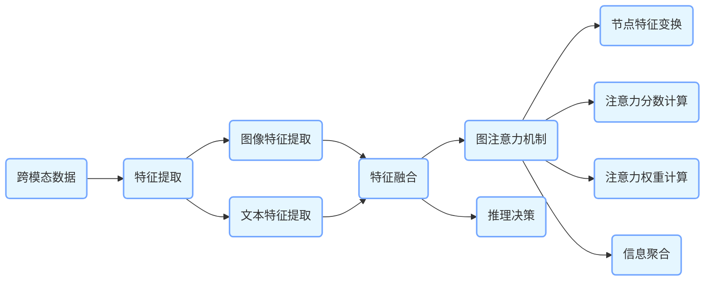

# 跨模态推理中图注意力机制的效率提升

> 关键词：跨模态推理、图注意力机制、效率提升、深度学习、多模态融合

> 摘要：本文聚焦于跨模态推理中图注意力机制的效率提升问题。首先介绍了跨模态推理和图注意力机制的背景知识，明确了文章的目的、范围和预期读者。接着详细阐述了核心概念及其联系，给出了相关原理和架构的文本示意图与 Mermaid 流程图。深入讲解了核心算法原理，并用 Python 源代码进行了详细说明，同时介绍了相关的数学模型和公式。通过项目实战，展示了代码的实际案例并进行详细解读。探讨了跨模态推理中图注意力机制的实际应用场景，推荐了学习资源、开发工具框架以及相关论文著作。最后总结了未来发展趋势与挑战，还提供了常见问题解答和扩展阅读参考资料，旨在为研究和应用跨模态推理中图注意力机制的人员提供全面且深入的技术指导。

## 1. 背景介绍 
### 1.1 目的和范围
跨模态推理是人工智能领域中一个极具挑战性和应用前景的研究方向，它旨在融合不同模态的数据（如图像、文本、音频等）进行推理和决策。图注意力机制作为一种强大的工具，能够在图结构数据上自适应地分配注意力权重，从而更好地捕捉节点之间的关系。然而，在实际应用中，图注意力机制的计算效率往往成为瓶颈，限制了其在大规模跨模态数据上的应用。本文的目的在于探讨如何提升跨模态推理中图注意力机制的效率，涵盖了从理论原理到实际应用的多个方面，包括核心算法的优化、数学模型的分析、项目实战以及应用场景的探讨等。

### 1.2 预期读者
本文主要面向对跨模态推理、图注意力机制以及深度学习感兴趣的研究人员、工程师和学生。对于希望深入了解如何提升图注意力机制在跨模态推理中效率的专业人士，本文将提供详细的技术分析和实践指导；对于初学者，也可以通过本文初步了解跨模态推理和图注意力机制的基本概念和相关技术。

### 1.3 文档结构概述
本文共分为十个部分。第一部分为背景介绍，阐述了文章的目的、范围、预期读者和文档结构概述，并给出了术语表。第二部分介绍核心概念与联系，包括跨模态推理和图注意力机制的原理和架构，以及它们之间的联系，并给出相应的文本示意图和 Mermaid 流程图。第三部分详细讲解核心算法原理，用 Python 源代码进行说明，并给出具体操作步骤。第四部分介绍相关的数学模型和公式，并进行详细讲解和举例说明。第五部分通过项目实战，展示代码的实际案例，包括开发环境搭建、源代码详细实现和代码解读。第六部分探讨跨模态推理中图注意力机制的实际应用场景。第七部分推荐学习资源、开发工具框架和相关论文著作。第八部分总结未来发展趋势与挑战。第九部分提供常见问题与解答。第十部分给出扩展阅读和参考资料。

### 1.4 术语表
#### 1.4.1 核心术语定义
- **跨模态推理**：指在不同模态的数据之间进行信息融合和推理的过程，例如将图像信息和文本信息结合起来进行语义理解和决策。
- **图注意力机制**：一种基于图结构数据的注意力机制，通过计算节点之间的注意力权重，自适应地分配对不同节点的关注度，从而更好地捕捉图中节点之间的关系。
- **效率提升**：在保证跨模态推理中图注意力机制性能的前提下，减少计算时间和资源消耗，提高算法的运行效率。

#### 1.4.2 相关概念解释
- **多模态数据**：包含多种不同类型的数据，如图像、文本、音频、视频等。不同模态的数据具有不同的特征和表示方式，需要进行有效的融合才能进行跨模态推理。
- **图结构数据**：由节点和边组成的数据结构，节点表示实体，边表示实体之间的关系。在跨模态推理中，图结构可以用于表示不同模态数据之间的关联。
- **注意力机制**：一种模仿人类注意力的机制，通过计算输入元素的重要性权重，选择性地关注输入中的部分信息，从而提高模型的性能。

#### 1.4.3 缩略词列表
- **GAT**：Graph Attention Network，图注意力网络。
- **CNN**：Convolutional Neural Network，卷积神经网络。
- **RNN**：Recurrent Neural Network，循环神经网络。

## 2. 核心概念与联系 

### 2.1 跨模态推理的原理
跨模态推理的核心在于如何有效地融合不同模态的数据，并从中提取有用的信息进行推理。不同模态的数据具有不同的特征和表示方式，例如图像数据通常用像素值表示，文本数据用词向量表示。因此，需要对不同模态的数据进行特征提取和转换，将它们映射到一个共同的特征空间中，以便进行后续的融合和推理。

一般来说，跨模态推理可以分为以下几个步骤：
1. **特征提取**：使用不同的模型（如 CNN 用于图像特征提取，RNN 或 Transformer 用于文本特征提取）从不同模态的数据中提取特征。
2. **特征融合**：将提取的不同模态的特征进行融合，可以采用简单的拼接、加权求和等方法，也可以使用更复杂的融合模型。
3. **推理决策**：在融合后的特征上进行推理和决策，例如分类、问答等任务。

### 2.2 图注意力机制的原理
图注意力机制是在图结构数据上的一种注意力机制。在图中，每个节点都有自己的特征，节点之间通过边相互连接。图注意力机制的目标是计算每个节点对其邻居节点的注意力权重，从而自适应地聚合邻居节点的信息。

具体来说，对于图中的一个节点 $i$，其邻居节点集合为 $\mathcal{N}_i$。图注意力机制通过以下步骤计算注意力权重：
1. **特征变换**：将节点 $i$ 和其邻居节点 $j$ 的特征 $h_i$ 和 $h_j$ 进行线性变换，得到 $W h_i$ 和 $W h_j$，其中 $W$ 是可学习的权重矩阵。
2. **注意力分数计算**：计算节点 $i$ 对邻居节点 $j$ 的注意力分数 $e_{ij}$，通常使用一个注意力函数，例如点积注意力函数：
   $$e_{ij} = \text{LeakyReLU}(\vec{a}^T [W h_i || W h_j])$$
   其中 $\vec{a}$ 是可学习的注意力向量，$||$ 表示拼接操作。
3. **注意力权重计算**：对注意力分数进行归一化处理，得到注意力权重 $\alpha_{ij}$：
   $$\alpha_{ij} = \frac{\exp(e_{ij})}{\sum_{k \in \mathcal{N}_i} \exp(e_{ik})}$$
4. **信息聚合**：根据注意力权重，对邻居节点的特征进行加权求和，得到节点 $i$ 的新特征 $h_i'$：
   $$h_i' = \sigma\left(\sum_{j \in \mathcal{N}_i} \alpha_{ij} W h_j\right)$$
   其中 $\sigma$ 是激活函数，如 ReLU。

### 2.3 跨模态推理与图注意力机制的联系
在跨模态推理中，图注意力机制可以用于建模不同模态数据之间的关系。可以将不同模态的数据看作图中的节点，模态之间的关联看作边。通过图注意力机制，可以自适应地分配对不同模态数据的关注度，从而更好地融合不同模态的信息。

例如，在图像 - 文本跨模态推理中，可以将图像区域和文本单词看作图中的节点，它们之间的语义关联看作边。图注意力机制可以计算图像区域对文本单词的注意力权重，以及文本单词对图像区域的注意力权重，从而实现图像和文本信息的有效融合。

### 2.4 文本示意图
```plaintext
跨模态推理
|-- 特征提取
|   |-- 图像特征提取 (CNN)
|   |-- 文本特征提取 (RNN/Transformer)
|-- 特征融合
|   |-- 图注意力机制
|       |-- 节点特征变换
|       |-- 注意力分数计算
|       |-- 注意力权重计算
|       |-- 信息聚合
|-- 推理决策
```

### 2.5 Mermaid 流程图


## 3. 核心算法原理 & 具体操作步骤 

### 3.1 核心算法原理
图注意力机制的核心在于计算节点之间的注意力权重，并根据这些权重聚合邻居节点的信息。在跨模态推理中，我们可以将不同模态的数据节点看作图中的节点，通过图注意力机制实现跨模态信息的融合。

下面我们将详细介绍图注意力层的实现原理。给定一个图 $G = (V, E)$，其中 $V$ 是节点集合，$E$ 是边集合。每个节点 $i \in V$ 有一个特征向量 $h_i$。图注意力层的目标是计算每个节点的新特征向量 $h_i'$。

具体步骤如下：
1. **特征变换**：将每个节点的特征向量 $h_i$ 乘以一个可学习的权重矩阵 $W$，得到变换后的特征向量 $Wh_i$。
2. **注意力分数计算**：对于每个节点 $i$ 和其邻居节点 $j$，计算注意力分数 $e_{ij}$。注意力分数表示节点 $i$ 对邻居节点 $j$ 的关注程度。通常使用一个注意力函数来计算注意力分数，例如点积注意力函数。
3. **注意力权重计算**：对注意力分数进行归一化处理，得到注意力权重 $\alpha_{ij}$。归一化的目的是使得每个节点对其邻居节点的注意力权重之和为 1。
4. **信息聚合**：根据注意力权重，对邻居节点的变换后的特征向量进行加权求和，得到节点 $i$ 的新特征向量 $h_i'$。

### 3.2 Python 源代码实现
```python
import torch
import torch.nn as nn
import torch.nn.functional as F

class GraphAttentionLayer(nn.Module):
    def __init__(self, in_features, out_features, dropout, alpha, concat=True):
        super(GraphAttentionLayer, self).__init__()
        self.dropout = dropout
        self.in_features = in_features
        self.out_features = out_features
        self.alpha = alpha
        self.concat = concat

        self.W = nn.Parameter(torch.zeros(size=(in_features, out_features)))
        nn.init.xavier_uniform_(self.W.data, gain=1.414)
        self.a = nn.Parameter(torch.zeros(size=(2*out_features, 1)))
        nn.init.xavier_uniform_(self.a.data, gain=1.414)

        self.leakyrelu = nn.LeakyReLU(self.alpha)

    def forward(self, input, adj):
        h = torch.mm(input, self.W)
        N = h.size()[0]

        a_input = torch.cat([h.repeat(1, N).view(N * N, -1), h.repeat(N, 1)], dim=1).view(N, -1, 2 * self.out_features)
        e = self.leakyrelu(torch.matmul(a_input, self.a).squeeze(2))

        zero_vec = -9e15*torch.ones_like(e)
        attention = torch.where(adj > 0, e, zero_vec)
        attention = F.softmax(attention, dim=1)
        attention = F.dropout(attention, self.dropout, training=self.training)
        h_prime = torch.matmul(attention, h)

        if self.concat:
            return F.elu(h_prime)
        else:
            return h_prime

    def __repr__(self):
        return self.__class__.__name__ + ' (' + str(self.in_features) + ' -> ' + str(self.out_features) + ')'


```

### 3.3 具体操作步骤
1. **初始化图注意力层**：在代码中，我们定义了一个 `GraphAttentionLayer` 类，它继承自 `nn.Module`。在类的初始化函数中，我们初始化了权重矩阵 $W$ 和注意力向量 $\vec{a}$，并设置了一些超参数，如 dropout 率和 LeakyReLU 的负斜率 $\alpha$。
2. **前向传播**：在 `forward` 方法中，我们实现了图注意力层的前向传播过程。具体步骤如下：
    - **特征变换**：将输入特征矩阵 `input` 乘以权重矩阵 $W$，得到变换后的特征矩阵 $h$。
    - **注意力分数计算**：通过拼接和线性变换计算注意力分数 $e$。
    - **注意力权重计算**：使用 `torch.where` 函数将邻接矩阵 `adj` 中为 0 的位置对应的注意力分数设置为一个非常小的负数，然后使用 `F.softmax` 函数进行归一化处理，得到注意力权重矩阵 `attention`。
    - **信息聚合**：将注意力权重矩阵 `attention` 与变换后的特征矩阵 $h$ 相乘，得到新的特征矩阵 $h_prime$。
    - **激活函数**：如果 `concat` 为 `True`，则使用 `F.elu` 激活函数对新的特征矩阵进行激活；否则，直接返回新的特征矩阵。

3. **使用图注意力层**：在实际应用中，我们可以将多个图注意力层堆叠起来，构建一个图注意力网络（GAT）。例如：
```python
class GAT(nn.Module):
    def __init__(self, nfeat, nhid, nclass, dropout, alpha, nheads):
        super(GAT, self).__init__()
        self.dropout = dropout

        self.attentions = [GraphAttentionLayer(nfeat, nhid, dropout=dropout, alpha=alpha, concat=True) for _ in range(nheads)]
        for i, attention in enumerate(self.attentions):
            self.add_module('attention_{}'.format(i), attention)

        self.out_att = GraphAttentionLayer(nhid * nheads, nclass, dropout=dropout, alpha=alpha, concat=False)

    def forward(self, x, adj):
        x = F.dropout(x, self.dropout, training=self.training)
        x = torch.cat([att(x, adj) for att in self.attentions], dim=1)
        x = F.dropout(x, self.dropout, training=self.training)
        x = F.elu(self.out_att(x, adj))
        return F.log_softmax(x, dim=1)


```

## 4. 数学模型和公式 & 详细讲解 & 举例说明 

### 4.1 图注意力机制的数学模型
在图注意力机制中，核心的数学模型包括特征变换、注意力分数计算、注意力权重计算和信息聚合。下面我们将详细介绍这些步骤的数学公式。

#### 4.1.1 特征变换
给定一个图 $G = (V, E)$，其中 $V$ 是节点集合，$E$ 是边集合。每个节点 $i \in V$ 有一个特征向量 $h_i \in \mathbb{R}^{F}$，其中 $F$ 是特征维度。我们首先将每个节点的特征向量乘以一个可学习的权重矩阵 $W \in \mathbb{R}^{F \times F'}$，得到变换后的特征向量 $Wh_i \in \mathbb{R}^{F'}$，其中 $F'$ 是变换后的特征维度。

数学公式为：
$$h_i' = W h_i$$

#### 4.1.2 注意力分数计算
对于每个节点 $i$ 和其邻居节点 $j$，我们计算注意力分数 $e_{ij}$。注意力分数表示节点 $i$ 对邻居节点 $j$ 的关注程度。通常使用一个注意力函数来计算注意力分数，例如点积注意力函数：
$$e_{ij} = \text{LeakyReLU}(\vec{a}^T [W h_i || W h_j])$$
其中 $\vec{a} \in \mathbb{R}^{2F'}$ 是可学习的注意力向量，$||$ 表示拼接操作。

#### 4.1.3 注意力权重计算
为了使得每个节点对其邻居节点的注意力权重之和为 1，我们对注意力分数进行归一化处理，得到注意力权重 $\alpha_{ij}$：
$$\alpha_{ij} = \frac{\exp(e_{ij})}{\sum_{k \in \mathcal{N}_i} \exp(e_{ik})}$$
其中 $\mathcal{N}_i$ 是节点 $i$ 的邻居节点集合。

#### 4.1.4 信息聚合
根据注意力权重，对邻居节点的变换后的特征向量进行加权求和，得到节点 $i$ 的新特征向量 $h_i'$：
$$h_i' = \sigma\left(\sum_{j \in \mathcal{N}_i} \alpha_{ij} W h_j\right)$$
其中 $\sigma$ 是激活函数，如 ReLU 或 ELU。

### 4.2 详细讲解
- **特征变换**：特征变换的目的是将输入的特征向量映射到一个新的特征空间中，以便更好地捕捉节点之间的关系。权重矩阵 $W$ 是可学习的，通过训练可以学习到不同特征之间的重要性。
- **注意力分数计算**：注意力分数 $e_{ij}$ 表示节点 $i$ 对邻居节点 $j$ 的关注程度。注意力向量 $\vec{a}$ 也是可学习的，通过训练可以学习到不同节点对之间的重要性。LeakyReLU 激活函数用于引入非线性，增加模型的表达能力。
- **注意力权重计算**：归一化处理使得每个节点对其邻居节点的注意力权重之和为 1，保证了信息聚合的合理性。
- **信息聚合**：根据注意力权重对邻居节点的特征进行加权求和，得到节点 $i$ 的新特征向量。激活函数 $\sigma$ 用于引入非线性，增加模型的表达能力。

### 4.3 举例说明
假设我们有一个简单的图，包含 3 个节点，每个节点的特征向量维度为 2。输入特征矩阵 $X$ 为：
$$X = \begin{bmatrix}
1 & 2 \\
3 & 4 \\
5 & 6
\end{bmatrix}$$
权重矩阵 $W$ 为：
$$W = \begin{bmatrix}
0.1 & 0.2 \\
0.3 & 0.4
\end{bmatrix}$$
注意力向量 $\vec{a}$ 为：
$$\vec{a} = \begin{bmatrix}
0.5 \\
0.6 \\
0.7 \\
0.8
\end{bmatrix}$$
邻接矩阵 $A$ 为：
$$A = \begin{bmatrix}
0 & 1 & 1 \\
1 & 0 & 1 \\
1 & 1 & 0
\end{bmatrix}$$

#### 4.3.1 特征变换
将输入特征矩阵 $X$ 乘以权重矩阵 $W$，得到变换后的特征矩阵 $h$：
$$h = XW = \begin{bmatrix}
1 & 2 \\
3 & 4 \\
5 & 6
\end{bmatrix} \begin{bmatrix}
0.1 & 0.2 \\
0.3 & 0.4
\end{bmatrix} = \begin{bmatrix}
0.7 & 1.0 \\
1.5 & 2.2 \\
2.3 & 3.4
\end{bmatrix}$$

#### 4.3.2 注意力分数计算
对于节点 1 和节点 2，计算注意力分数 $e_{12}$：
$$[W h_1 || W h_2] = \begin{bmatrix}
0.7 \\
1.0 \\
1.5 \\
2.2
\end{bmatrix}$$
$$e_{12} = \text{LeakyReLU}(\vec{a}^T [W h_1 || W h_2]) = \text{LeakyReLU}(0.5 \times 0.7 + 0.6 \times 1.0 + 0.7 \times 1.5 + 0.8 \times 2.2) = \text{LeakyReLU}(3.76) = 3.76$$

#### 4.3.3 注意力权重计算
对于节点 1，其邻居节点为节点 2 和节点 3。计算注意力权重 $\alpha_{12}$ 和 $\alpha_{13}$：
$$e_{12} = 3.76, e_{13} = \text{LeakyReLU}(\vec{a}^T [W h_1 || W h_3])$$
$$\alpha_{12} = \frac{\exp(e_{12})}{\exp(e_{12}) + \exp(e_{13})}, \alpha_{13} = \frac{\exp(e_{13})}{\exp(e_{12}) + \exp(e_{13})}$$

#### 4.3.4 信息聚合
根据注意力权重，对邻居节点的变换后的特征向量进行加权求和，得到节点 1 的新特征向量 $h_1'$：
$$h_1' = \sigma(\alpha_{12} W h_2 + \alpha_{13} W h_3)$$

## 5. 项目实战：代码实际案例和详细解释说明 

### 5.1  开发环境搭建
#### 5.1.1 安装 Python
首先，确保你已经安装了 Python 3.6 或更高版本。可以从 Python 官方网站（https://www.python.org/downloads/）下载并安装。

#### 5.1.2 安装 PyTorch
PyTorch 是一个流行的深度学习框架，我们将使用它来实现图注意力机制。可以根据自己的 CUDA 版本和操作系统，从 PyTorch 官方网站（https://pytorch.org/get-started/locally/）选择合适的安装命令进行安装。例如，如果你使用的是 CPU 版本的 PyTorch，可以使用以下命令：
```bash
pip install torch torchvision
```

#### 5.1.3 安装其他依赖库
还需要安装一些其他的依赖库，如 `numpy`、`scipy` 等。可以使用以下命令进行安装：
```bash
pip install numpy scipy
```

### 5.2  源代码详细实现和代码解读
#### 5.2.1 定义图注意力层
```python
import torch
import torch.nn as nn
import torch.nn.functional as F

class GraphAttentionLayer(nn.Module):
    def __init__(self, in_features, out_features, dropout, alpha, concat=True):
        super(GraphAttentionLayer, self).__init__()
        self.dropout = dropout
        self.in_features = in_features
        self.out_features = out_features
        self.alpha = alpha
        self.concat = concat

        self.W = nn.Parameter(torch.zeros(size=(in_features, out_features)))
        nn.init.xavier_uniform_(self.W.data, gain=1.414)
        self.a = nn.Parameter(torch.zeros(size=(2*out_features, 1)))
        nn.init.xavier_uniform_(self.a.data, gain=1.414)

        self.leakyrelu = nn.LeakyReLU(self.alpha)

    def forward(self, input, adj):
        h = torch.mm(input, self.W)
        N = h.size()[0]

        a_input = torch.cat([h.repeat(1, N).view(N * N, -1), h.repeat(N, 1)], dim=1).view(N, -1, 2 * self.out_features)
        e = self.leakyrelu(torch.matmul(a_input, self.a).squeeze(2))

        zero_vec = -9e15*torch.ones_like(e)
        attention = torch.where(adj > 0, e, zero_vec)
        attention = F.softmax(attention, dim=1)
        attention = F.dropout(attention, self.dropout, training=self.training)
        h_prime = torch.matmul(attention, h)

        if self.concat:
            return F.elu(h_prime)
        else:
            return h_prime

    def __repr__(self):
        return self.__class__.__name__ + ' (' + str(self.in_features) + ' -> ' + str(self.out_features) + ')'


```
**代码解读**：
- `__init__` 方法：初始化图注意力层的参数，包括权重矩阵 $W$、注意力向量 $\vec{a}$、dropout 率、负斜率 $\alpha$ 等。使用 `nn.init.xavier_uniform_` 函数对权重矩阵和注意力向量进行初始化。
- `forward` 方法：实现图注意力层的前向传播过程。首先进行特征变换，然后计算注意力分数，接着根据邻接矩阵对注意力分数进行处理，计算注意力权重，最后进行信息聚合。
- `__repr__` 方法：返回图注意力层的字符串表示。

#### 5.2.2 定义图注意力网络
```python
class GAT(nn.Module):
    def __init__(self, nfeat, nhid, nclass, dropout, alpha, nheads):
        super(GAT, self).__init__()
        self.dropout = dropout

        self.attentions = [GraphAttentionLayer(nfeat, nhid, dropout=dropout, alpha=alpha, concat=True) for _ in range(nheads)]
        for i, attention in enumerate(self.attentions):
            self.add_module('attention_{}'.format(i), attention)

        self.out_att = GraphAttentionLayer(nhid * nheads, nclass, dropout=dropout, alpha=alpha, concat=False)

    def forward(self, x, adj):
        x = F.dropout(x, self.dropout, training=self.training)
        x = torch.cat([att(x, adj) for att in self.attentions], dim=1)
        x = F.dropout(x, self.dropout, training=self.training)
        x = F.elu(self.out_att(x, adj))
        return F.log_softmax(x, dim=1)


```
**代码解读**：
- `__init__` 方法：初始化图注意力网络的参数，包括输入特征维度 `nfeat`、隐藏层维度 `nhid`、输出类别数 `nclass`、dropout 率、负斜率 $\alpha$ 和注意力头数 `nheads`。创建多个图注意力层作为多头注意力机制，并添加到模型中。最后创建一个输出图注意力层。
- `forward` 方法：实现图注意力网络的前向传播过程。首先对输入进行 dropout 处理，然后通过多个图注意力层进行特征提取，将输出进行拼接，再次进行 dropout 处理，最后通过输出图注意力层和激活函数得到最终输出。

#### 5.2.3 训练模型
```python
import torch.optim as optim

# 定义超参数
nfeat = 1433
nhid = 8
nclass = 7
dropout = 0.6
alpha = 0.2
nheads = 8
lr = 0.005
weight_decay = 5e-4
epochs = 100

# 创建模型
model = GAT(nfeat, nhid, nclass, dropout, alpha, nheads)

# 定义损失函数和优化器
criterion = nn.NLLLoss()
optimizer = optim.Adam(model.parameters(), lr=lr, weight_decay=weight_decay)

# 模拟输入数据
input_features = torch.randn(2708, nfeat)
adj_matrix = torch.randn(2708, 2708)
labels = torch.randint(0, nclass, (2708,))

# 训练模型
for epoch in range(epochs):
    model.train()
    optimizer.zero_grad()
    output = model(input_features, adj_matrix)
    loss = criterion(output, labels)
    loss.backward()
    optimizer.step()
    print(f'Epoch {epoch + 1}/{epochs}, Loss: {loss.item()}')


```
**代码解读**：
- 定义超参数：包括输入特征维度、隐藏层维度、输出类别数、dropout 率、负斜率、注意力头数、学习率、权重衰减和训练轮数。
- 创建模型：实例化图注意力网络模型。
- 定义损失函数和优化器：使用负对数似然损失函数 `nn.NLLLoss` 和 Adam 优化器。
- 模拟输入数据：生成随机的输入特征矩阵、邻接矩阵和标签。
- 训练模型：在每个训练轮次中，将模型设置为训练模式，清空梯度，前向传播计算输出，计算损失，反向传播更新参数，并打印当前轮次的损失值。

### 5.3  代码解读与分析
#### 5.3.1 图注意力层的效率分析
图注意力层的主要计算开销在于注意力分数的计算和信息聚合。注意力分数的计算需要对每个节点对进行拼接和线性变换，时间复杂度为 $O(N^2 F')$，其中 $N$ 是节点数，$F'$ 是变换后的特征维度。信息聚合需要对每个节点的邻居节点进行加权求和，时间复杂度为 $O(N d F')$，其中 $d$ 是节点的平均度。

为了提高效率，可以采用以下方法：
- **稀疏矩阵运算**：在实际应用中，邻接矩阵通常是稀疏的。可以使用稀疏矩阵运算来减少计算量。
- **并行计算**：利用 GPU 的并行计算能力，加速注意力分数的计算和信息聚合过程。

#### 5.3.2 图注意力网络的效率分析
图注意力网络由多个图注意力层组成。在多头注意力机制中，每个注意力头的计算是独立的，可以并行计算。因此，多头注意力机制可以在一定程度上提高计算效率。

同时，图注意力网络的训练过程需要进行多次前向传播和反向传播，计算开销较大。可以采用批量归一化、梯度累积等技术来提高训练效率。

## 6. 实际应用场景 
### 6.1 图像 - 文本跨模态检索
在图像 - 文本跨模态检索中，用户可以输入一个文本查询，系统需要从图像数据库中检索出与该文本相关的图像；或者输入一个图像，系统需要检索出与该图像相关的文本。图注意力机制可以用于建模图像区域和文本单词之间的关系，通过自适应地分配注意力权重，实现图像和文本信息的有效融合，从而提高检索的准确性。

例如，在一个图像 - 文本跨模态检索系统中，将图像区域和文本单词看作图中的节点，它们之间的语义关联看作边。图注意力机制可以计算图像区域对文本单词的注意力权重，以及文本单词对图像区域的注意力权重，从而更好地理解图像和文本的语义信息，实现更精准的检索。

### 6.2 视觉问答
视觉问答是指给定一张图像和一个自然语言问题，系统需要回答该问题。图注意力机制可以用于融合图像特征和文本特征，帮助模型更好地理解问题和图像内容。

在视觉问答任务中，将图像区域和问题中的单词看作图中的节点，它们之间的关系看作边。图注意力机制可以计算图像区域对问题单词的注意力权重，以及问题单词对图像区域的注意力权重，从而聚焦于与问题相关的图像区域和文本信息，提高回答的准确性。

### 6.3 多模态情感分析
多模态情感分析是指结合多种模态的数据（如图像、文本、音频等）来分析情感倾向。图注意力机制可以用于建模不同模态数据之间的关系，自适应地融合不同模态的信息，从而更准确地分析情感。

例如，在一个多模态情感分析系统中，将图像、文本和音频数据看作图中的节点，它们之间的关联看作边。图注意力机制可以计算不同模态数据之间的注意力权重，根据这些权重融合不同模态的特征，从而提高情感分析的准确性。

### 6.4 自动驾驶
在自动驾驶中，需要融合多种传感器的数据（如摄像头图像、激光雷达点云、毫米波雷达数据等）进行决策。图注意力机制可以用于建模不同传感器数据之间的关系，提高数据融合的效率和准确性。

例如，将不同传感器的数据看作图中的节点，它们之间的时空关联看作边。图注意力机制可以计算不同传感器数据之间的注意力权重，根据这些权重融合不同传感器的特征，从而更好地感知周围环境，做出更准确的决策。

## 7. 工具和资源推荐
### 7.1 学习资源推荐
#### 7.1.1 书籍推荐
- 《深度学习》（Deep Learning）：由 Ian Goodfellow、Yoshua Bengio 和 Aaron Courville 撰写，是深度学习领域的经典教材，涵盖了深度学习的基本概念、算法和应用。
- 《动手学深度学习》（Dive into Deep Learning）：由 Aston Zhang、Zachary C. Lipton、Mu Li 和 Alexander J. Smola 撰写，提供了丰富的代码示例和实践项目，适合初学者快速上手深度学习。
- 《图神经网络：基础、前沿与应用》：系统介绍了图神经网络的基本原理、算法和应用，对于深入理解图注意力机制有很大帮助。

#### 7.1.2 在线课程
- Coursera 上的“深度学习专项课程”（Deep Learning Specialization）：由 Andrew Ng 教授授课，包括神经网络和深度学习、改善深层神经网络、结构化机器学习项目、卷积神经网络和序列模型等课程，是学习深度学习的优质资源。
- edX 上的“强化学习基础”（Foundations of Reinforcement Learning）：介绍了强化学习的基本概念和算法，对于理解跨模态推理中的决策过程有一定帮助。
- B 站上的“图神经网络入门教程”：由一些开源社区和博主分享，提供了图神经网络的基础知识和实践案例，适合初学者快速入门。

#### 7.1.3 技术博客和网站
- Medium 上的 Towards Data Science：是一个专注于数据科学和机器学习的技术博客平台，有很多关于跨模态推理和图注意力机制的文章和教程。
- arXiv：是一个预印本服务器，提供了大量的学术论文，包括跨模态推理和图注意力机制的最新研究成果。
- GitHub：是一个开源代码托管平台，有很多关于跨模态推理和图注意力机制的开源项目，可以学习和参考。

### 7.2 开发工具框架推荐
#### 7.2.1 IDE和编辑器
- PyCharm：是一个专门为 Python 开发设计的集成开发环境（IDE），提供了丰富的代码编辑、调试和项目管理功能，适合开发深度学习项目。
- Jupyter Notebook：是一个交互式的开发环境，支持 Python、R 等多种编程语言，适合进行数据探索和模型实验。
- Visual Studio Code：是一个轻量级的代码编辑器，支持多种编程语言和插件，具有丰富的代码编辑和调试功能，也可以用于开发深度学习项目。

#### 7.2.2 调试和性能分析工具
- PyTorch Profiler：是 PyTorch 自带的性能分析工具，可以帮助开发者分析模型的计算时间和内存使用情况，找出性能瓶颈。
- TensorBoard：是 TensorFlow 提供的可视化工具，也可以与 PyTorch 结合使用，用于可视化模型的训练过程、损失曲线、准确率等指标。
- NVIDIA Nsight Systems：是 NVIDIA 提供的性能分析工具，可以帮助开发者分析 GPU 上的计算性能，找出 GPU 计算的瓶颈。

#### 7.2.3 相关框架和库
- PyTorch Geometric：是一个基于 PyTorch 的图神经网络框架，提供了丰富的图神经网络层和数据集，方便开发者快速实现图注意力机制和其他图神经网络模型。
- DGL（Deep Graph Library）：是一个开源的图神经网络框架，支持多种深度学习框架（如 PyTorch、TensorFlow 等），提供了高效的图数据处理和图神经网络训练功能。
- Transformers：是一个基于 PyTorch 和 TensorFlow 的自然语言处理库，提供了多种预训练的 Transformer 模型，如 BERT、GPT 等，可以用于文本特征提取和跨模态推理。

### 7.3 相关论文著作推荐
#### 7.3.1 经典论文
- “Graph Attention Networks”：介绍了图注意力网络（GAT）的基本原理和实现方法，是图注意力机制的经典论文。
- “Attention Is All You Need”：提出了 Transformer 模型，引入了注意力机制，对深度学习领域产生了深远影响。
- “Multimodal Deep Learning”：探讨了多模态深度学习的基本概念和方法，对于理解跨模态推理有重要意义。

#### 7.3.2 最新研究成果
- 关注 arXiv 上的最新论文，特别是关于跨模态推理、图注意力机制和多模态融合的研究成果。
- 参加相关的学术会议，如 NeurIPS、ICML、CVPR 等，了解最新的研究动态和技术趋势。

#### 7.3.3 应用案例分析
- 一些工业界的应用案例可以在相关的技术博客和会议报告中找到，例如 Google、Facebook 等公司在跨模态推理和图注意力机制方面的应用实践。
- 开源项目的文档和论文也可以提供一些应用案例和实践经验，例如 PyTorch Geometric 和 DGL 的官方文档和示例代码。

## 8. 总结：未来发展趋势与挑战
### 8.1 未来发展趋势
#### 8.1.1 更高效的图注意力机制
随着数据规模的不断增大，对图注意力机制的效率要求也越来越高。未来的研究将致力于开发更高效的图注意力算法，如基于稀疏矩阵运算、并行计算和近似算法的图注意力机制，以减少计算时间和资源消耗。

#### 8.1.2 多模态融合的深度和广度拓展
目前的跨模态推理主要集中在图像 - 文本、图像 - 音频等简单的多模态组合上。未来的研究将拓展多模态融合的深度和广度，探索更多模态（如视频、触觉等）之间的融合，实现更复杂的跨模态推理任务。

#### 8.1.3 与其他技术的结合
图注意力机制将与其他技术（如强化学习、迁移学习、元学习等）相结合，以提高跨模态推理的性能和泛化能力。例如，将图注意力机制应用于强化学习中的环境建模和决策过程，提高智能体的学习效率和决策能力。

#### 8.1.4 应用领域的拓展
跨模态推理中图注意力机制的应用领域将不断拓展，除了目前的图像 - 文本检索、视觉问答、多模态情感分析等领域，还将应用于医疗、金融、交通等更多领域，为这些领域的发展提供技术支持。

### 8.2 挑战
#### 8.2.1 数据处理和融合难题
不同模态的数据具有不同的特征和表示方式，如何有效地处理和融合这些数据是一个挑战。例如，图像数据是连续的像素值，而文本数据是离散的单词序列，如何将它们映射到一个共同的特征空间中进行融合是一个关键问题。

#### 8.2.2 计算资源和效率问题
图注意力机制的计算复杂度较高，特别是在处理大规模图数据时，需要大量的计算资源和时间。如何在有限的计算资源下提高图注意力机制的效率是一个亟待解决的问题。

#### 8.2.3 模型可解释性问题
深度学习模型通常是黑盒模型，缺乏可解释性。在跨模态推理中，图注意力机制的决策过程往往难以理解，这对于一些对解释性要求较高的应用场景（如医疗诊断、金融风险评估等）是一个挑战。

#### 8.2.4 数据标注和质量问题
跨模态推理需要大量的标注数据来训练模型，而标注多模态数据的成本较高，且数据质量难以保证。如何获取高质量的标注数据，以及如何在数据标注不足的情况下提高模型的性能是一个需要解决的问题。

## 9. 附录：常见问题与解答
### 9.1 图注意力机制和传统注意力机制有什么区别？
传统注意力机制通常应用于序列数据（如文本、语音等），通过计算序列中不同位置的注意力权重，选择性地关注序列中的部分信息。而图注意力机制应用于图结构数据，通过计算图中节点之间的注意力权重，自适应地聚合邻居节点的信息。图注意力机制考虑了节点之间的拓扑结构，能够更好地捕捉图中节点之间的关系。

### 9.2 如何选择图注意力机制的超参数？
图注意力机制的超参数包括隐藏层维度、注意力头数、dropout 率、学习率等。可以通过网格搜索、随机搜索等方法进行超参数调优。一般来说，可以先在一个小的验证集上进行实验，选择表现较好的超参数组合，然后在整个数据集上进行训练。

### 9.3 图注意力机制在处理大规模图数据时如何提高效率？
可以采用以下方法提高图注意力机制在处理大规模图数据时的效率：
- **稀疏矩阵运算**：利用图的稀疏性，使用稀疏矩阵运算来减少计算量。
- **并行计算**：利用 GPU 的并行计算能力，加速注意力分数的计算和信息聚合过程。
- **采样方法**：采用节点采样、边采样等方法，减少图的规模，降低计算复杂度。

### 9.4 跨模态推理中图注意力机制的输入数据有哪些要求？
跨模态推理中图注意力机制的输入数据通常包括不同模态的数据特征和图的邻接矩阵。不同模态的数据特征需要进行特征提取和转换，将它们映射到一个共同的特征空间中。邻接矩阵表示图中节点之间的连接关系，通常是一个稀疏矩阵。

### 9.5 图注意力机制可以应用于哪些其他领域？
图注意力机制除了在跨模态推理中应用外，还可以应用于社交网络分析、知识图谱推理、推荐系统、生物信息学等领域。在这些领域中，图结构数据广泛存在，图注意力机制可以用于捕捉节点之间的关系，提高模型的性能。

## 10. 扩展阅读 & 参考资料
### 10.1 扩展阅读
- “Representation Learning on Graphs: Methods and Applications”：全面介绍了图表示学习的方法和应用，对于深入理解图注意力机制的背景和应用有很大帮助。
- “Deep Learning for Vision Systems”：介绍了深度学习在计算机视觉领域的应用，包括图像分类、目标检测、语义分割等任务，对于理解跨模态推理中的图像模态有一定帮助。
- “Natural Language Processing with Python”：介绍了自然语言处理的基本概念和方法，包括文本预处理、词法分析、句法分析、语义理解等任务，对于理解跨模态推理中的文本模态有一定帮助。

### 10.2 参考资料
- Vaswani, A., Shazeer, N., Parmar, N., et al. “Attention Is All You Need.” Advances in Neural Information Processing Systems, 2017.
- Velickovic, P., Cucurull, G., Casanova, A., et al. “Graph Attention Networks.” International Conference on Learning Representations, 2018.
- Baltrušaitis, T., Ahuja, C., & Morency, L.-P. “Multimodal Machine Learning: A Survey and Taxonomy.” IEEE Transactions on Pattern Analysis and Machine Intelligence, 2018.
- PyTorch 官方文档：https://pytorch.org/docs/stable/index.html
- PyTorch Geometric 官方文档：https://pytorch-geometric.readthedocs.io/en/latest/
- DGL 官方文档：https://docs.dgl.ai/