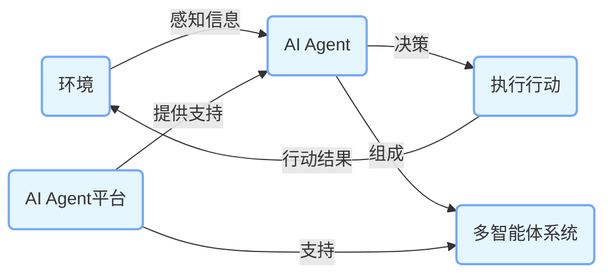

# 选择适合企业的AI Agent平台

> 关键词：AI Agent平台、企业选择、人工智能、智能代理、平台评估、业务需求、技术能力

> 摘要：随着人工智能技术的飞速发展，AI Agent平台在企业的数字化转型和智能化升级中发挥着越来越重要的作用。选择适合企业的AI Agent平台，能够帮助企业提高运营效率、降低成本、提升客户体验。本文将深入探讨AI Agent平台的相关概念，分析选择适合企业的AI Agent平台的关键因素，详细介绍核心算法原理和操作步骤，结合数学模型和公式进行理论阐释，通过项目实战案例展示具体应用，阐述实际应用场景，推荐相关工具和资源，最后总结未来发展趋势与挑战，并提供常见问题解答和扩展阅读参考资料，旨在为企业在选择AI Agent平台时提供全面、深入的指导。

## 1. 背景介绍 
### 1.1 目的和范围
本文章的目的在于为企业提供全面、系统的指导，帮助企业在众多的AI Agent平台中选择出最适合自身业务需求和发展战略的平台。文章将涵盖AI Agent平台的基本概念、核心技术原理、评估选择的关键因素、实际应用场景以及相关工具资源推荐等内容，旨在让企业对AI Agent平台有深入的了解，从而做出明智的选择。

### 1.2 预期读者
本文预期读者主要包括企业的管理者、技术决策者、IT部门负责人、业务部门主管等，以及对AI Agent平台感兴趣的技术爱好者和研究人员。这些读者希望通过本文了解如何选择适合企业的AI Agent平台，以推动企业的智能化发展。

### 1.3 文档结构概述
本文将按照以下结构进行阐述：首先介绍AI Agent平台的背景和相关概念，包括核心术语和联系；接着详细讲解核心算法原理和具体操作步骤；然后通过数学模型和公式对相关理论进行深入分析；再通过项目实战案例展示如何在实际中应用AI Agent平台；之后介绍AI Agent平台的实际应用场景；推荐相关的工具和资源；最后总结未来发展趋势与挑战，提供常见问题解答和扩展阅读参考资料。

### 1.4 术语表
#### 1.4.1 核心术语定义
- **AI Agent（人工智能智能体）**：是一种能够感知环境、根据感知信息进行决策并采取行动以实现特定目标的智能实体。它可以是软件程序、机器人或其他具有智能行为的系统。
- **AI Agent平台**：是为开发、部署和管理AI Agent提供支持的软件平台。它通常包含一系列的工具、框架和服务，帮助开发者快速构建和运行AI Agent。
- **多智能体系统（Multi - Agent System，MAS）**：由多个AI Agent组成的系统，这些智能体之间可以相互协作、通信和交互，以实现共同的或各自的目标。

#### 1.4.2 相关概念解释
- **智能感知**：AI Agent通过各种传感器（如摄像头、麦克风、传感器网络等）获取环境信息的能力。感知到的信息可以是图像、声音、文本、数据等多种形式。
- **决策推理**：AI Agent根据感知到的信息，运用各种算法和模型进行分析和推理，从而做出决策的过程。决策推理可以基于规则、机器学习、深度学习等方法。
- **行动执行**：AI Agent根据决策结果采取相应行动的过程。行动可以是物理动作（如机器人的运动）、软件操作（如发送消息、调用服务等）。

#### 1.4.3 缩略词列表
- **MAS**：Multi - Agent System，多智能体系统
- **ML**：Machine Learning，机器学习
- **DL**：Deep Learning，深度学习

## 2. 核心概念与联系 
### 2.1 AI Agent的基本原理
AI Agent的基本原理是基于感知 - 决策 - 行动的循环。AI Agent通过传感器感知环境信息，将感知到的信息输入到决策模块，决策模块根据预设的规则、模型或算法进行分析和推理，做出决策，然后将决策结果发送到执行模块，执行模块根据决策结果采取相应的行动。行动的结果会影响环境，环境的变化又会被AI Agent感知到，从而形成一个闭环反馈系统。

### 2.2 AI Agent平台的架构
AI Agent平台通常由以下几个主要部分组成：
- **开发工具**：提供AI Agent开发所需的编程语言、开发框架、调试工具等，帮助开发者快速构建AI Agent。
- **运行环境**：为AI Agent提供运行的环境，包括硬件资源（如服务器、云计算平台等）和软件资源（如操作系统、中间件等）。
- **管理系统**：负责AI Agent的部署、监控、管理和维护，确保AI Agent的正常运行。
- **数据服务**：提供数据存储、管理和分析服务，为AI Agent的训练和决策提供数据支持。
- **通信接口**：定义AI Agent与其他系统、智能体之间的通信协议和接口，实现信息的交互和共享。

### 2.3 核心概念联系的文本示意图
AI Agent平台与AI Agent、多智能体系统之间的关系可以用以下文本示意图表示：

AI Agent平台是构建和运行AI Agent的基础平台，它提供了开发、部署和管理AI Agent所需的各种资源和工具。多个AI Agent可以组成多智能体系统，在AI Agent平台的支持下，这些智能体可以相互协作、通信和交互，实现更复杂的任务和目标。

### 2.4 Mermaid流程图


## 3. 核心算法原理 & 具体操作步骤 
### 3.1 核心算法原理
#### 3.1.1 基于规则的算法
基于规则的算法是一种简单而直观的AI Agent决策算法。它通过定义一系列的规则，根据感知到的信息匹配相应的规则，从而做出决策。以下是一个简单的基于规则的Python示例：

```python
# 定义规则
rules = [
    {
        "condition": lambda x: x < 10,
        "action": lambda: print("值小于10，执行动作A")
    },
    {
        "condition": lambda x: x >= 10 and x < 20,
        "action": lambda: print("值在10到20之间，执行动作B")
    },
    {
        "condition": lambda x: x >= 20,
        "action": lambda: print("值大于等于20，执行动作C")
    }
]

# 定义AI Agent
def rule_based_agent(value):
    for rule in rules:
        if rule["condition"](value):
            rule["action"]()
            break

# 测试
rule_based_agent(5)
rule_based_agent(15)
rule_based_agent(25)
```

#### 3.1.2 基于机器学习的算法
基于机器学习的算法通过训练模型来学习环境和任务的模式，从而做出决策。以简单的线性回归模型为例，以下是一个Python示例：

```python
import numpy as np
from sklearn.linear_model import LinearRegression

# 生成训练数据
X = np.array([[1], [2], [3], [4], [5]])
y = np.array([2, 4, 6, 8, 10])

# 训练模型
model = LinearRegression()
model.fit(X, y)

# 定义AI Agent
def ml_agent(value):
    prediction = model.predict([[value]])
    print(f"预测值: {prediction[0]}")

# 测试
ml_agent(6)
```

#### 3.1.3 基于深度学习的算法
基于深度学习的算法通常使用神经网络模型来处理复杂的任务，如图像识别、自然语言处理等。以简单的全连接神经网络为例，以下是一个使用PyTorch的Python示例：

```python
import torch
import torch.nn as nn
import torch.optim as optim

# 定义神经网络模型
class SimpleNet(nn.Module):
    def __init__(self):
        super(SimpleNet, self).__init__()
        self.fc1 = nn.Linear(1, 10)
        self.fc2 = nn.Linear(10, 1)

    def forward(self, x):
        x = torch.relu(self.fc1(x))
        x = self.fc2(x)
        return x

# 生成训练数据
X = torch.tensor([[1.0], [2.0], [3.0], [4.0], [5.0]], dtype=torch.float32)
y = torch.tensor([[2.0], [4.0], [6.0], [8.0], [10.0]], dtype=torch.float32)

# 初始化模型、损失函数和优化器
model = SimpleNet()
criterion = nn.MSELoss()
optimizer = optim.SGD(model.parameters(), lr=0.01)

# 训练模型
for epoch in range(1000):
    optimizer.zero_grad()
    outputs = model(X)
    loss = criterion(outputs, y)
    loss.backward()
    optimizer.step()

# 定义AI Agent
def dl_agent(value):
    value = torch.tensor([[value]], dtype=torch.float32)
    prediction = model(value)
    print(f"预测值: {prediction.item()}")

# 测试
dl_agent(6)
```

### 3.2 具体操作步骤
#### 3.2.1 需求分析
首先，企业需要明确自己的业务需求和目标，确定AI Agent平台要解决的问题和实现的功能。例如，是用于客户服务、生产自动化、数据分析还是其他领域。

#### 3.2.2 平台调研
根据需求分析的结果，企业可以调研市场上的各种AI Agent平台，了解它们的特点、功能、性能、价格等信息。可以通过查阅资料、咨询专家、参加行业展会等方式进行调研。

#### 3.2.3 评估选择
对调研得到的AI Agent平台进行评估，根据企业的需求和标准进行筛选和比较。评估的因素包括平台的功能、性能、易用性、可扩展性、安全性、成本等。可以通过试用、测试、参考案例等方式进行评估。

#### 3.2.4 部署实施
选择好合适的AI Agent平台后，企业需要进行平台的部署和实施。这包括安装配置平台、开发和集成AI Agent、进行测试和优化等工作。

#### 3.2.5 监控维护
在平台部署实施后，企业需要对AI Agent平台进行监控和维护，确保平台的正常运行和性能优化。同时，根据业务需求的变化和技术的发展，对平台进行持续的升级和改进。

## 4. 数学模型和公式 & 详细讲解 & 举例说明 
### 4.1 基于规则的数学模型
基于规则的AI Agent决策可以用逻辑表达式来表示。假设存在一组规则 $R = \{r_1, r_2, \cdots, r_n\}$，每个规则 $r_i$ 由条件 $C_i$ 和动作 $A_i$ 组成。对于感知到的信息 $I$，如果满足条件 $C_j$，则执行动作 $A_j$。可以用逻辑公式表示为：

$$
\text{if } C_j(I) \text{ then } A_j
$$

例如，在前面的基于规则的Python示例中，规则可以表示为：

- $r_1$: if $x < 10$ then 执行动作A
- $r_2$: if $10 \leq x < 20$ then 执行动作B
- $r_3$: if $x \geq 20$ then 执行动作C

### 4.2 基于机器学习的数学模型
以线性回归模型为例，线性回归的数学模型可以表示为：

$$
y = \theta_0 + \theta_1x_1 + \theta_2x_2 + \cdots + \theta_nx_n + \epsilon
$$

其中，$y$ 是目标变量，$x_1, x_2, \cdots, x_n$ 是特征变量，$\theta_0, \theta_1, \cdots, \theta_n$ 是模型的参数，$\epsilon$ 是误差项。

在训练过程中，我们的目标是找到一组最优的参数 $\theta$，使得预测值与真实值之间的误差最小。通常使用最小二乘法来求解，即最小化以下损失函数：

$$
J(\theta) = \frac{1}{2m}\sum_{i = 1}^{m}(h_{\theta}(x^{(i)}) - y^{(i)})^2
$$

其中，$m$ 是样本数量，$h_{\theta}(x^{(i)})$ 是第 $i$ 个样本的预测值，$y^{(i)}$ 是第 $i$ 个样本的真实值。

例如，在前面的线性回归Python示例中，我们通过训练模型得到了参数 $\theta$，从而可以对新的输入进行预测。

### 4.3 基于深度学习的数学模型
以全连接神经网络为例，全连接神经网络的数学模型可以表示为一系列的线性变换和非线性激活函数的组合。假设第 $l$ 层的输入为 $a^{(l - 1)}$，权重矩阵为 $W^{(l)}$，偏置向量为 $b^{(l)}$，激活函数为 $f$，则第 $l$ 层的输出为：

$$
z^{(l)} = W^{(l)}a^{(l - 1)} + b^{(l)}
$$

$$
a^{(l)} = f(z^{(l)})
$$

在训练过程中，我们使用反向传播算法来计算梯度，然后使用优化算法（如随机梯度下降）来更新模型的参数。损失函数通常使用交叉熵损失或均方误差损失。

例如，在前面的全连接神经网络Python示例中，我们使用均方误差损失函数和随机梯度下降优化算法来训练模型。

## 5. 项目实战：代码实际案例和详细解释说明 
### 5.1  开发环境搭建
#### 5.1.1 安装Python
首先，需要安装Python环境。可以从Python官方网站（https://www.python.org/downloads/） 下载适合自己操作系统的Python安装包，并按照安装向导进行安装。

#### 5.1.2 安装相关库
根据前面的算法示例，需要安装一些相关的Python库，如 `numpy`、`sklearn`、`torch` 等。可以使用 `pip` 命令进行安装：

```sh
pip install numpy sklearn torch
```

### 5.2  源代码详细实现和代码解读
#### 5.2.1 基于规则的AI Agent实现
```python
# 定义规则
rules = [
    {
        "condition": lambda x: x < 10,
        "action": lambda: print("值小于10，执行动作A")
    },
    {
        "condition": lambda x: x >= 10 and x < 20,
        "action": lambda: print("值在10到20之间，执行动作B")
    },
    {
        "condition": lambda x: x >= 20,
        "action": lambda: print("值大于等于20，执行动作C")
    }
]

# 定义AI Agent
def rule_based_agent(value):
    for rule in rules:
        if rule["condition"](value):
            rule["action"]()
            break

# 测试
rule_based_agent(5)
rule_based_agent(15)
rule_based_agent(25)
```

代码解读：
- 首先，定义了一个规则列表 `rules`，每个规则是一个字典，包含条件 `condition` 和动作 `action`。
- 然后，定义了一个 `rule_based_agent` 函数，该函数接受一个值作为输入，遍历规则列表，找到满足条件的规则并执行相应的动作。
- 最后，进行测试，分别传入不同的值，观察输出结果。

#### 5.2.2 基于机器学习的AI Agent实现
```python
import numpy as np
from sklearn.linear_model import LinearRegression

# 生成训练数据
X = np.array([[1], [2], [3], [4], [5]])
y = np.array([2, 4, 6, 8, 10])

# 训练模型
model = LinearRegression()
model.fit(X, y)

# 定义AI Agent
def ml_agent(value):
    prediction = model.predict([[value]])
    print(f"预测值: {prediction[0]}")

# 测试
ml_agent(6)
```

代码解读：
- 首先，导入 `numpy` 和 `sklearn` 库。
- 然后，生成训练数据 `X` 和 `y`。
- 接着，创建一个线性回归模型 `model`，并使用训练数据进行训练。
- 再定义一个 `ml_agent` 函数，该函数接受一个值作为输入，使用训练好的模型进行预测，并输出预测结果。
- 最后，进行测试，传入一个新的值，观察预测结果。

#### 5.2.3 基于深度学习的AI Agent实现
```python
import torch
import torch.nn as nn
import torch.optim as optim

# 定义神经网络模型
class SimpleNet(nn.Module):
    def __init__(self):
        super(SimpleNet, self).__init__()
        self.fc1 = nn.Linear(1, 10)
        self.fc2 = nn.Linear(10, 1)

    def forward(self, x):
        x = torch.relu(self.fc1(x))
        x = self.fc2(x)
        return x

# 生成训练数据
X = torch.tensor([[1.0], [2.0], [3.0], [4.0], [5.0]], dtype=torch.float32)
y = torch.tensor([[2.0], [4.0], [6.0], [8.0], [10.0]], dtype=torch.float32)

# 初始化模型、损失函数和优化器
model = SimpleNet()
criterion = nn.MSELoss()
optimizer = optim.SGD(model.parameters(), lr=0.01)

# 训练模型
for epoch in range(1000):
    optimizer.zero_grad()
    outputs = model(X)
    loss = criterion(outputs, y)
    loss.backward()
    optimizer.step()

# 定义AI Agent
def dl_agent(value):
    value = torch.tensor([[value]], dtype=torch.float32)
    prediction = model(value)
    print(f"预测值: {prediction.item()}")

# 测试
dl_agent(6)
```

代码解读：
- 首先，导入 `torch` 库。
- 然后，定义一个简单的全连接神经网络模型 `SimpleNet`，包含两个线性层和一个ReLU激活函数。
- 接着，生成训练数据 `X` 和 `y`。
- 再初始化模型、损失函数（均方误差损失）和优化器（随机梯度下降）。
- 进行模型训练，通过多次迭代更新模型的参数。
- 定义一个 `dl_agent` 函数，该函数接受一个值作为输入，使用训练好的模型进行预测，并输出预测结果。
- 最后，进行测试，传入一个新的值，观察预测结果。

### 5.3  代码解读与分析
#### 5.3.1 基于规则的AI Agent分析
基于规则的AI Agent实现简单，易于理解和维护。但是，它的灵活性较差，对于复杂的问题和动态的环境，规则的定义和维护会变得非常困难。

#### 5.3.2 基于机器学习的AI Agent分析
基于机器学习的AI Agent可以通过学习数据中的模式来进行决策，具有一定的灵活性和适应性。但是，它需要大量的训练数据，并且模型的性能依赖于数据的质量和特征的选择。

#### 5.3.3 基于深度学习的AI Agent分析
基于深度学习的AI Agent可以处理复杂的任务，如图像识别、自然语言处理等。它具有很强的学习能力和表达能力，但是模型的训练和调优比较复杂，需要大量的计算资源和时间。

## 6. 实际应用场景 
### 6.1 客户服务
AI Agent可以用于客户服务，通过智能客服系统自动回答客户的问题、解决客户的问题。例如，电商平台的智能客服可以根据客户的咨询内容，快速提供相关的商品信息、订单状态等。

### 6.2 生产自动化
在制造业中，AI Agent可以用于生产自动化。例如，机器人可以作为AI Agent，根据生产线上的传感器信息，自动进行物料搬运、加工等操作，提高生产效率和质量。

### 6.3 金融服务
在金融领域，AI Agent可以用于风险评估、投资决策等。例如，通过分析客户的信用数据、市场数据等，AI Agent可以帮助金融机构评估客户的信用风险，提供投资建议。

### 6.4 医疗保健
在医疗保健领域，AI Agent可以用于疾病诊断、治疗方案推荐等。例如，通过分析患者的病历、检查结果等数据，AI Agent可以辅助医生进行疾病诊断，提供个性化的治疗方案。

### 6.5 智能交通
在智能交通领域，AI Agent可以用于交通流量控制、自动驾驶等。例如，通过分析交通传感器数据，AI Agent可以实时调整交通信号灯的时间，优化交通流量；自动驾驶汽车可以作为AI Agent，根据周围环境信息自动行驶。

## 7. 工具和资源推荐
### 7.1 学习资源推荐
#### 7.1.1 书籍推荐
- 《人工智能：一种现代的方法》：这本书是人工智能领域的经典教材，全面介绍了人工智能的基本概念、算法和应用。
- 《Python机器学习》：详细介绍了使用Python进行机器学习的方法和技巧，适合初学者入门。
- 《深度学习》：由深度学习领域的三位巨头所著，是深度学习领域的权威著作。

#### 7.1.2 在线课程
- Coursera上的“机器学习”课程：由斯坦福大学的Andrew Ng教授授课，是机器学习领域的经典课程。
- edX上的“深度学习微硕士项目”：提供了系统的深度学习课程，包括理论和实践。
- 中国大学MOOC上的“人工智能基础”课程：适合国内学习者了解人工智能的基础知识。

#### 7.1.3 技术博客和网站
- Medium：上面有很多关于人工智能和AI Agent的技术文章和经验分享。
- Towards Data Science：专注于数据科学和机器学习领域的技术博客，有很多高质量的文章。
- 机器之心：国内专注于人工智能领域的媒体平台，提供最新的技术资讯和深度解读。

### 7.2 开发工具框架推荐
#### 7.2.1 IDE和编辑器
- PyCharm：是一款专门为Python开发设计的集成开发环境，功能强大，适合开发AI Agent项目。
- Jupyter Notebook：是一个交互式的开发环境，适合进行数据探索、模型训练和调试。
- Visual Studio Code：是一款轻量级的代码编辑器，支持多种编程语言，有丰富的插件扩展。

#### 7.2.2 调试和性能分析工具
- TensorBoard：是TensorFlow的可视化工具，可以用于可视化模型的训练过程、性能指标等。
- Py-Spy：是一个Python性能分析工具，可以帮助开发者找出代码中的性能瓶颈。
- PDB：是Python的内置调试器，可以用于调试Python代码。

#### 7.2.3 相关框架和库
- TensorFlow：是一个开源的深度学习框架，提供了丰富的工具和接口，适合开发复杂的AI Agent模型。
- PyTorch：是另一个流行的深度学习框架，具有动态图的优势，易于使用和调试。
- Scikit-learn：是一个简单易用的机器学习库，提供了各种机器学习算法和工具，适合快速开发和实验。

### 7.3 相关论文著作推荐
#### 7.3.1 经典论文
- “Artificial Intelligence: A Modern Approach”：这篇论文是人工智能领域的经典之作，提出了很多重要的概念和方法。
- “Deep Learning”：由Yoshua Bengio、Geoffrey Hinton和Yann LeCun三位深度学习领域的先驱所著，系统地介绍了深度学习的理论和应用。
- “Reinforcement Learning: An Introduction”：是强化学习领域的经典教材，详细介绍了强化学习的基本概念、算法和应用。

#### 7.3.2 最新研究成果
- 可以关注顶级学术会议如NeurIPS、ICML、CVPR等的最新论文，了解AI Agent领域的最新研究进展。
- 一些知名的学术期刊如Journal of Artificial Intelligence Research、Artificial Intelligence等也会发表AI Agent相关的研究成果。

#### 7.3.3 应用案例分析
- 可以参考一些实际应用案例的研究报告，如某些企业使用AI Agent平台提高生产效率、改善客户服务的案例分析，从中学习经验和教训。

## 8. 总结：未来发展趋势与挑战
### 8.1 未来发展趋势
#### 8.1.1 多智能体协作
未来，AI Agent将更多地以多智能体系统的形式存在，多个智能体之间通过协作和交互，实现更复杂的任务和目标。例如，在智能交通系统中，多个自动驾驶汽车可以作为智能体，通过协作实现高效的交通流量控制。

#### 8.1.2 与物联网的融合
AI Agent将与物联网技术深度融合，通过感知物联网设备收集的大量数据，实现更智能的决策和行动。例如，在智能家居系统中，AI Agent可以根据传感器收集的环境信息，自动调节家电设备的运行状态。

#### 8.1.3 个性化和自适应
AI Agent将更加注重个性化和自适应，根据用户的偏好和行为习惯，提供个性化的服务和决策。例如，智能客服系统可以根据客户的历史咨询记录，提供个性化的解决方案。

#### 8.1.4 伦理和法律问题的关注
随着AI Agent的广泛应用，伦理和法律问题将越来越受到关注。例如，AI Agent的决策责任、隐私保护、算法偏见等问题需要得到妥善解决。

### 8.2 挑战
#### 8.2.1 数据安全和隐私
AI Agent的训练和决策需要大量的数据，这些数据的安全和隐私保护是一个重要的挑战。企业需要采取有效的措施，确保数据不被泄露和滥用。

#### 8.2.2 模型可解释性
深度学习模型等复杂的AI Agent模型往往具有很强的黑盒性，其决策过程难以解释。在一些关键领域，如医疗、金融等，模型的可解释性是一个重要的问题。

#### 8.2.3 技术人才短缺
AI Agent领域的发展需要大量的技术人才，包括人工智能专家、算法工程师、数据科学家等。目前，相关技术人才的短缺是一个普遍的问题。

#### 8.2.4 标准和规范缺失
目前，AI Agent领域还缺乏统一的标准和规范，这给企业的选择和应用带来了一定的困难。需要加快标准和规范的制定，促进AI Agent领域的健康发展。

## 9. 附录：常见问题与解答
### 9.1 如何评估AI Agent平台的性能？
可以从以下几个方面评估AI Agent平台的性能：
- **响应时间**：AI Agent对用户请求的响应时间，越短越好。
- **准确率**：AI Agent决策和执行的准确率，越高越好。
- **吞吐量**：AI Agent平台在单位时间内可以处理的请求数量，越大越好。
- **稳定性**：AI Agent平台在长时间运行过程中的稳定性，是否会出现故障和崩溃。

### 9.2 AI Agent平台的成本主要包括哪些方面？
AI Agent平台的成本主要包括以下几个方面：
- **软件授权费用**：购买AI Agent平台软件的授权费用。
- **硬件成本**：部署AI Agent平台所需的服务器、存储设备等硬件成本。
- **开发成本**：开发和集成AI Agent所需的人力、时间成本。
- **运维成本**：维护和管理AI Agent平台的成本，包括人员、电力、网络等费用。

### 9.3 如何确保AI Agent的安全性？
可以从以下几个方面确保AI Agent的安全性：
- **数据加密**：对AI Agent处理的敏感数据进行加密，防止数据泄露。
- **访问控制**：对AI Agent平台的访问进行严格的权限管理，只有授权的人员才能访问。
- **安全审计**：对AI Agent的操作和行为进行审计，及时发现和处理安全问题。
- **漏洞修复**：及时修复AI Agent平台和相关软件的安全漏洞，防止被攻击。

### 9.4 AI Agent平台是否适合所有企业？
不是所有企业都适合使用AI Agent平台。AI Agent平台适用于那些有一定技术实力、对智能化有较高需求、有足够数据支持的企业。对于一些小型企业或对智能化需求不高的企业，可能不需要使用AI Agent平台，或者可以选择一些简单的智能化工具。

## 10. 扩展阅读 & 参考资料
### 10.1 扩展阅读
- 《智能时代》：作者吴军，介绍了人工智能对社会和经济的影响，以及未来的发展趋势。
- 《奇点临近》：作者雷·库兹韦尔，探讨了人工智能和人类未来的关系，提出了奇点的概念。
- 《人类简史：从动物到上帝》：作者尤瓦尔·赫拉利，从人类历史的角度探讨了技术进步对人类社会的影响，包括人工智能的发展。

### 10.2 参考资料
- 各AI Agent平台的官方文档和技术白皮书。
- 相关学术论文和研究报告，如IEEE、ACM等学术组织发表的论文。
- 行业媒体和资讯平台发布的关于AI Agent的报道和分析文章。