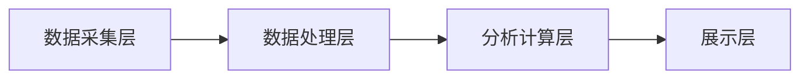

# 金融市场交易成本分析系统

> 关键词：金融市场、交易成本分析、系统架构、算法原理、实际应用

> 摘要：本文围绕金融市场交易成本分析系统展开，全面深入地探讨了该系统的各个方面。首先介绍了系统开发的背景、目的、预期读者等内容。接着阐述了核心概念及联系，包括交易成本的构成和系统的架构。详细讲解了核心算法原理，通过 Python 代码进行具体说明，并给出了相关的数学模型和公式。在项目实战部分，介绍了开发环境搭建、源代码实现及解读。还分析了系统的实际应用场景，推荐了学习资源、开发工具框架和相关论文著作。最后总结了系统未来的发展趋势与挑战，解答了常见问题，并提供了扩展阅读和参考资料。

## 1. 背景介绍 
### 1.1 目的和范围
金融市场的交易活动错综复杂，交易成本是其中一个关键因素，它直接影响着投资者的收益和市场的效率。本金融市场交易成本分析系统的主要目的是为金融机构、投资者和研究人员提供一个全面、准确且高效的工具，用于深入分析金融市场中的交易成本。

系统的范围涵盖了多种金融市场，包括股票市场、债券市场、期货市场等。分析的交易成本类型包括显性成本，如佣金、印花税等，以及隐性成本，如市场冲击成本、延迟成本等。通过对这些成本的分析，用户可以更好地理解交易过程中的成本结构，优化交易策略，提高投资回报率。

### 1.2 预期读者
- **金融机构从业者**：如银行交易员、基金经理等，他们可以利用该系统分析交易成本，评估交易策略的有效性，为投资决策提供支持。
- **投资者**：无论是个人投资者还是机构投资者，都可以借助系统了解自己的交易成本情况，从而调整投资组合和交易方式。
- **金融研究人员**：研究人员可以使用系统进行学术研究，探索交易成本的影响因素和变化规律，为金融市场的理论和实践发展提供参考。

### 1.3 文档结构概述
本文将按照以下结构详细介绍金融市场交易成本分析系统：
- 核心概念与联系：介绍交易成本的核心概念、构成以及系统的架构。
- 核心算法原理 & 具体操作步骤：讲解用于分析交易成本的核心算法，并给出 Python 代码示例。
- 数学模型和公式 & 详细讲解 & 举例说明：阐述分析交易成本所涉及的数学模型和公式，并通过具体例子进行说明。
- 项目实战：代码实际案例和详细解释说明，包括开发环境搭建、源代码实现和代码解读。
- 实际应用场景：分析系统在金融市场中的实际应用场景。
- 工具和资源推荐：推荐学习资源、开发工具框架和相关论文著作。
- 总结：未来发展趋势与挑战：总结系统的发展趋势和面临的挑战。
- 附录：常见问题与解答：解答关于系统的常见问题。
- 扩展阅读 & 参考资料：提供相关的扩展阅读和参考资料。

### 1.4 术语表
#### 1.4.1 核心术语定义
- **交易成本**：指在金融市场中进行交易时所产生的各种费用和成本，包括显性成本和隐性成本。
- **显性成本**：指可以直接观察和计算的成本，如佣金、印花税等。
- **隐性成本**：指难以直接观察和计算的成本，如市场冲击成本、延迟成本等。
- **市场冲击成本**：指由于交易活动导致市场价格变动而产生的成本。
- **延迟成本**：指由于交易执行延迟而产生的成本。

#### 1.4.2 相关概念解释
- **交易策略**：指投资者为了实现投资目标而采取的一系列交易决策和操作方法。
- **投资组合**：指投资者将资金分散投资于多种金融资产的组合。
- **流动性**：指金融资产在市场上能够快速、低成本地买卖的能力。

#### 1.4.3 缩略词列表
- **TCA**：Transaction Cost Analysis，交易成本分析
- **VWAP**：Volume - Weighted Average Price，成交量加权平均价格
- **TWAP**：Time - Weighted Average Price，时间加权平均价格

## 2. 核心概念与联系 
### 交易成本的构成
交易成本主要由显性成本和隐性成本两部分构成。

显性成本包括：
- **佣金**：投资者向经纪商支付的交易服务费用，通常按照交易金额的一定比例收取。
- **印花税**：政府对证券交易征收的一种税费，一般按照交易金额的一定比例收取。

隐性成本包括：
- **市场冲击成本**：当投资者进行大规模交易时，会对市场价格产生影响。如果买入大量股票，会推动股价上涨；卖出大量股票，会导致股价下跌。这种由于交易行为引起的价格变动所带来的成本就是市场冲击成本。
- **延迟成本**：在金融市场中，交易指令的执行可能会存在延迟。如果市场价格在延迟期间发生了不利变化，投资者就会遭受延迟成本。

### 系统架构
金融市场交易成本分析系统的架构主要包括数据采集层、数据处理层、分析计算层和展示层。

- **数据采集层**：负责从金融市场数据源（如证券交易所、金融数据提供商等）采集交易数据，包括交易价格、成交量、交易时间等。
- **数据处理层**：对采集到的数据进行清洗、整理和预处理，去除噪声数据，统一数据格式。
- **分析计算层**：根据预处理后的数据，运用各种算法和模型计算交易成本，包括显性成本和隐性成本。
- **展示层**：将计算得到的交易成本结果以直观的图表和报表形式展示给用户。

以下是系统架构的 Mermaid 流程图：


## 3. 核心算法原理 & 具体操作步骤 
### 市场冲击成本计算算法
市场冲击成本的计算通常基于市场微观结构理论。一种常见的算法是使用成交量加权平均价格（VWAP）来衡量市场冲击成本。

VWAP 的计算公式为：
$$VWAP=\frac{\sum_{i = 1}^{n}P_{i}V_{i}}{\sum_{i = 1}^{n}V_{i}}$$
其中，$P_{i}$ 是第 $i$ 笔交易的价格，$V_{i}$ 是第 $i$ 笔交易的成交量，$n$ 是交易笔数。

市场冲击成本可以通过比较实际交易价格和 VWAP 来计算。假设投资者的实际交易价格为 $P_{actual}$，VWAP 为 $P_{VWAP}$，则市场冲击成本 $C_{impact}$ 可以表示为：
$$C_{impact}=(P_{actual}-P_{VWAP})\times V$$
其中，$V$ 是交易的总成交量。

以下是使用 Python 实现 VWAP 计算和市场冲击成本计算的代码示例：
```python
import numpy as np

def calculate_vwap(prices, volumes):
    """
    计算成交量加权平均价格（VWAP）
    :param prices: 交易价格列表
    :param volumes: 交易成交量列表
    :return: VWAP
    """
    numerator = np.sum(np.multiply(prices, volumes))
    denominator = np.sum(volumes)
    return numerator / denominator

def calculate_impact_cost(actual_price, vwap, volume):
    """
    计算市场冲击成本
    :param actual_price: 实际交易价格
    :param vwap: 成交量加权平均价格
    :param volume: 交易总成交量
    :return: 市场冲击成本
    """
    return (actual_price - vwap) * volume

# 示例数据
prices = [100, 101, 102, 103]
volumes = [1000, 2000, 3000, 4000]
actual_price = 102.5

# 计算 VWAP
vwap = calculate_vwap(prices, volumes)
print(f"VWAP: {vwap}")

# 计算市场冲击成本
impact_cost = calculate_impact_cost(actual_price, vwap, np.sum(volumes))
print(f"市场冲击成本: {impact_cost}")
```

### 具体操作步骤
1. **数据准备**：从金融市场数据源获取交易价格和成交量数据。
2. **数据处理**：对数据进行清洗和整理，确保数据的准确性和一致性。
3. **计算 VWAP**：使用上述代码中的 `calculate_vwap` 函数计算 VWAP。
4. **计算市场冲击成本**：根据实际交易价格、VWAP 和交易总成交量，使用 `calculate_impact_cost` 函数计算市场冲击成本。

## 4. 数学模型和公式 & 详细讲解 & 举例说明 
### 显性成本计算模型
显性成本主要包括佣金和印花税。假设佣金率为 $r_{commission}$，印花税率为 $r_{stamp}$，交易金额为 $A$，则佣金 $C_{commission}$ 和印花税 $C_{stamp}$ 的计算公式分别为：
$$C_{commission}=r_{commission}\times A$$
$$C_{stamp}=r_{stamp}\times A$$

总显性成本 $C_{explicit}$ 为：
$$C_{explicit}=C_{commission}+C_{stamp}$$

例如，假设佣金率为 0.001，印花税率为 0.001，交易金额为 100000 元，则：
$$C_{commission}=0.001\times100000 = 100$$
$$C_{stamp}=0.001\times100000 = 100$$
$$C_{explicit}=100 + 100 = 200$$

### 隐性成本计算模型
#### 市场冲击成本模型
除了使用 VWAP 计算市场冲击成本外，还可以使用 Almgren - Chriss 模型。该模型假设市场冲击成本由临时性冲击成本和永久性冲击成本两部分组成。

临时性冲击成本 $C_{temp}$ 的计算公式为：
$$C_{temp}=\lambda\times\frac{V}{V_{total}}\times\sigma$$
其中，$\lambda$ 是临时性冲击系数，$V$ 是交易的成交量，$V_{total}$ 是市场总成交量，$\sigma$ 是市场波动率。

永久性冲击成本 $C_{perm}$ 的计算公式为：
$$C_{perm}=\eta\times\frac{V}{V_{total}}\times P$$
其中，$\eta$ 是永久性冲击系数，$P$ 是交易价格。

总市场冲击成本 $C_{impact}$ 为：
$$C_{impact}=C_{temp}+C_{perm}$$

#### 延迟成本模型
延迟成本可以通过比较交易指令下达时的价格 $P_{0}$ 和交易执行时的价格 $P_{1}$ 来计算。假设交易成交量为 $V$，则延迟成本 $C_{delay}$ 的计算公式为：
$$C_{delay}=(P_{1}-P_{0})\times V$$

例如，假设交易指令下达时的价格为 100 元，交易执行时的价格为 101 元，交易成交量为 1000 股，则：
$$C_{delay}=(101 - 100)\times1000 = 1000$$

### 总交易成本模型
总交易成本 $C_{total}$ 等于显性成本和隐性成本之和，即：
$$C_{total}=C_{explicit}+C_{impact}+C_{delay}$$

## 5. 项目实战：代码实际案例和详细解释说明 
### 5.1  开发环境搭建
- **操作系统**：可以选择 Windows、Linux 或 macOS。
- **Python 版本**：建议使用 Python 3.7 及以上版本。
- **开发工具**：可以使用 PyCharm、Jupyter Notebook 等。
- **依赖库**：需要安装 `numpy`、`pandas`、`matplotlib` 等库。可以使用以下命令进行安装：
```sh
pip install numpy pandas matplotlib
```

### 5.2  源代码详细实现和代码解读
以下是一个完整的金融市场交易成本分析系统的 Python 代码示例：
```python
import numpy as np
import pandas as pd
import matplotlib.pyplot as plt

def calculate_vwap(prices, volumes):
    """
    计算成交量加权平均价格（VWAP）
    :param prices: 交易价格列表
    :param volumes: 交易成交量列表
    :return: VWAP
    """
    numerator = np.sum(np.multiply(prices, volumes))
    denominator = np.sum(volumes)
    return numerator / denominator

def calculate_impact_cost(actual_price, vwap, volume):
    """
    计算市场冲击成本
    :param actual_price: 实际交易价格
    :param vwap: 成交量加权平均价格
    :param volume: 交易总成交量
    :return: 市场冲击成本
    """
    return (actual_price - vwap) * volume

def calculate_explicit_cost(commission_rate, stamp_rate, transaction_amount):
    """
    计算显性成本
    :param commission_rate: 佣金率
    :param stamp_rate: 印花税率
    :param transaction_amount: 交易金额
    :return: 显性成本
    """
    commission = commission_rate * transaction_amount
    stamp = stamp_rate * transaction_amount
    return commission + stamp

def calculate_total_cost(actual_price, prices, volumes, commission_rate, stamp_rate):
    """
    计算总交易成本
    :param actual_price: 实际交易价格
    :param prices: 交易价格列表
    :param volumes: 交易成交量列表
    :param commission_rate: 佣金率
    :param stamp_rate: 印花税率
    :return: 总交易成本
    """
    # 计算 VWAP
    vwap = calculate_vwap(prices, volumes)
    # 计算交易总成交量
    total_volume = np.sum(volumes)
    # 计算交易金额
    transaction_amount = actual_price * total_volume
    # 计算市场冲击成本
    impact_cost = calculate_impact_cost(actual_price, vwap, total_volume)
    # 计算显性成本
    explicit_cost = calculate_explicit_cost(commission_rate, stamp_rate, transaction_amount)
    # 计算总交易成本
    total_cost = explicit_cost + impact_cost
    return total_cost

# 示例数据
prices = [100, 101, 102, 103]
volumes = [1000, 2000, 3000, 4000]
actual_price = 102.5
commission_rate = 0.001
stamp_rate = 0.001

# 计算总交易成本
total_cost = calculate_total_cost(actual_price, prices, volumes, commission_rate, stamp_rate)
print(f"总交易成本: {total_cost}")

# 可视化交易价格和成交量
data = pd.DataFrame({'价格': prices, '成交量': volumes})
data.plot(x='价格', y='成交量', kind='scatter')
plt.title('交易价格和成交量关系')
plt.xlabel('价格')
plt.ylabel('成交量')
plt.show()
```

### 5.3  代码解读与分析
- **`calculate_vwap` 函数**：用于计算成交量加权平均价格（VWAP）。通过将交易价格和成交量相乘并求和，再除以成交量总和得到 VWAP。
- **`calculate_impact_cost` 函数**：根据实际交易价格、VWAP 和交易总成交量计算市场冲击成本。
- **`calculate_explicit_cost` 函数**：根据佣金率、印花税率和交易金额计算显性成本。
- **`calculate_total_cost` 函数**：综合计算总交易成本，包括显性成本和市场冲击成本。
- **可视化部分**：使用 `pandas` 和 `matplotlib` 库将交易价格和成交量的关系以散点图的形式展示出来，方便用户直观地观察数据。

## 6. 实际应用场景 
### 投资组合优化
投资者可以使用金融市场交易成本分析系统来评估不同投资组合的交易成本。通过分析不同资产的交易成本，投资者可以选择交易成本较低的资产组合，从而提高投资回报率。例如，在构建股票投资组合时，系统可以帮助投资者比较不同股票的交易成本，避免选择交易成本过高的股票。

### 交易策略评估
交易员可以使用系统来评估不同交易策略的交易成本。通过模拟不同的交易策略，系统可以计算出每种策略的交易成本，并比较它们的优劣。例如，在使用日内交易策略时，系统可以分析该策略的市场冲击成本和延迟成本，帮助交易员判断该策略是否可行。

### 风险管理
金融机构可以使用系统来进行风险管理。通过对交易成本的监控和分析，机构可以及时发现潜在的风险，并采取相应的措施进行防范。例如，如果发现某笔交易的市场冲击成本过高，机构可以调整交易策略，减少交易规模，以降低风险。

### 市场研究
研究人员可以使用系统进行市场研究。通过分析大量的交易数据和交易成本，研究人员可以探索交易成本的影响因素和变化规律，为金融市场的理论和实践发展提供参考。例如，研究人员可以研究市场流动性对交易成本的影响，以及不同市场环境下交易成本的变化情况。

## 7. 工具和资源推荐
### 7.1 学习资源推荐
#### 7.1.1 书籍推荐
- 《金融市场微观结构理论》：该书系统地介绍了金融市场微观结构的理论和方法，包括交易成本的分析和计算。
- 《量化交易：如何建立自己的算法交易系统》：介绍了量化交易的基本概念和方法，以及如何使用 Python 进行量化交易系统的开发，其中涉及到交易成本的分析和优化。
- 《投资学》：经典的投资学教材，涵盖了投资组合理论、风险管理等内容，对理解交易成本在投资中的作用有很大帮助。

#### 7.1.2 在线课程
- Coursera 上的“Financial Markets”：由耶鲁大学教授 Robert Shiller 主讲，介绍了金融市场的基本概念和理论，包括交易成本的相关内容。
- edX 上的“Algorithmic Trading and Quantitative Strategies”：该课程介绍了算法交易的基本原理和方法，以及如何进行交易成本的分析和优化。
- 中国大学 MOOC 上的“金融计量学”：课程介绍了金融计量学的基本方法和应用，包括交易成本的建模和分析。

#### 7.1.3 技术博客和网站
- 优矿（uqer.io）：提供了丰富的金融数据和量化交易工具，同时也有很多关于交易成本分析的技术文章和案例。
- 聚宽（joinquant.com）：国内知名的量化交易平台，有大量的量化交易策略和交易成本分析的相关内容。
- 金融界（jrj.com.cn）：提供金融市场的新闻、数据和分析，也有一些关于交易成本的研究报告和文章。

### 7.2 开发工具框架推荐
#### 7.2.1 IDE和编辑器
- PyCharm：功能强大的 Python 集成开发环境，支持代码调试、代码分析等功能，适合开发大型的金融市场交易成本分析系统。
- Jupyter Notebook：交互式的开发环境，适合进行数据探索和算法验证，方便用户将代码、文档和可视化结果集成在一起。
- Visual Studio Code：轻量级的代码编辑器，支持多种编程语言和插件，具有良好的扩展性，适合快速开发和调试代码。

#### 7.2.2 调试和性能分析工具
- pdb：Python 内置的调试工具，可以帮助用户定位代码中的问题。
- cProfile：Python 标准库中的性能分析工具，可以分析代码的运行时间和函数调用情况，帮助用户优化代码性能。
- Py-Spy：一个跨平台的 Python 性能分析工具，可以实时监控 Python 程序的运行状态，找出性能瓶颈。

#### 7.2.3 相关框架和库
- Pandas：强大的数据处理和分析库，提供了丰富的数据结构和数据操作方法，适合处理金融市场的交易数据。
- Numpy：用于科学计算的基础库，提供了高效的数组操作和数学函数，在交易成本计算中经常使用。
- Matplotlib：用于数据可视化的库，可以绘制各种类型的图表，如折线图、散点图、柱状图等，方便用户直观地展示交易成本分析结果。

### 7.3 相关论文著作推荐
#### 7.3.1 经典论文
- “Optimal Execution of Portfolio Transactions” by Robert Almgren and Neil Chriss：提出了 Almgren - Chriss 模型，用于计算市场冲击成本，是交易成本分析领域的经典论文。
- “The Microstructure of Financial Markets” by Maureen O'Hara：系统地介绍了金融市场微观结构的理论和方法，对交易成本的分析有重要的参考价值。
- “Liquidity and Execution Costs in Equity Markets” by Joel Hasbrouck：研究了股票市场的流动性和交易成本之间的关系，为交易成本的研究提供了新的视角。

#### 7.3.2 最新研究成果
- 近年来，随着人工智能和机器学习技术的发展，一些研究开始将这些技术应用于交易成本分析。例如，使用深度学习模型预测市场冲击成本，提高交易成本分析的准确性。
- 还有一些研究关注高频交易环境下的交易成本分析，探讨高频交易对市场流动性和交易成本的影响。

#### 7.3.3 应用案例分析
- 一些金融机构会发布关于交易成本分析的应用案例，介绍如何使用交易成本分析系统优化投资组合和交易策略。这些案例可以帮助读者更好地理解交易成本分析系统的实际应用。

## 8. 总结：未来发展趋势与挑战
### 未来发展趋势
- **智能化**：随着人工智能和机器学习技术的不断发展，金融市场交易成本分析系统将越来越智能化。系统可以通过学习大量的交易数据，自动识别交易成本的影响因素，并提供更准确的交易成本预测和优化建议。
- **实时化**：在金融市场中，交易机会转瞬即逝。因此，未来的交易成本分析系统需要具备实时分析的能力，能够及时反馈交易成本的变化情况，帮助投资者和交易员做出及时的决策。
- **多市场融合**：随着金融市场的全球化和多元化，投资者和金融机构的交易活动涉及到多个市场。未来的交易成本分析系统需要能够融合多个市场的数据，提供全面的交易成本分析服务。

### 挑战
- **数据质量和获取**：交易成本分析需要大量的高质量交易数据。然而，金融市场的数据往往存在噪声、缺失值等问题，同时数据的获取也受到各种限制。如何保证数据的质量和获取的及时性是一个挑战。
- **模型复杂性和解释性**：为了提高交易成本分析的准确性，模型往往会变得越来越复杂。然而，复杂的模型可能会导致解释性变差，难以理解模型的决策过程。如何在提高模型准确性的同时保持模型的解释性是一个需要解决的问题。
- **监管合规**：金融市场受到严格的监管。交易成本分析系统需要满足各种监管要求，如数据安全、隐私保护等。如何在系统开发和应用过程中确保合规是一个重要的挑战。

## 9. 附录：常见问题与解答
### 问题 1：如何选择合适的交易成本分析算法？
解答：选择合适的交易成本分析算法需要考虑多个因素，如数据的可用性、交易市场的特点、分析的目的等。如果数据丰富且交易市场较为复杂，可以选择较为复杂的算法，如 Almgren - Chriss 模型；如果数据有限且分析目的较为简单，可以选择较为简单的算法，如 VWAP 算法。

### 问题 2：交易成本分析系统能否完全准确地预测交易成本？
解答：由于金融市场的不确定性和复杂性，交易成本分析系统很难完全准确地预测交易成本。系统只能根据历史数据和模型进行预测，而市场情况是不断变化的。因此，交易成本分析系统的预测结果只能作为参考，不能作为绝对的依据。

### 问题 3：如何保证交易成本分析系统的安全性？
解答：为了保证交易成本分析系统的安全性，需要采取以下措施：
- **数据加密**：对敏感数据进行加密处理，防止数据泄露。
- **访问控制**：设置严格的访问权限，只有授权人员才能访问系统和数据。
- **安全审计**：定期对系统进行安全审计，及时发现和处理安全漏洞。

## 10. 扩展阅读 & 参考资料
### 扩展阅读
- 《金融科技前沿：技术驱动的金融创新》：介绍了金融科技的最新发展趋势和应用，包括人工智能、区块链等技术在金融市场中的应用，对理解交易成本分析系统的未来发展有一定的帮助。
- 《高频交易：新金融炼金术》：详细介绍了高频交易的原理、策略和风险，对于深入了解高频交易环境下的交易成本分析有重要的参考价值。

### 参考资料
- 证券交易所官方网站：如上海证券交易所、深圳证券交易所等，提供了大量的金融市场交易数据和规则。
- 金融数据提供商：如 Wind、Bloomberg 等，提供了丰富的金融市场数据和分析工具。
- 相关学术期刊：如《金融研究》、《管理科学学报》等，发表了很多关于金融市场和交易成本分析的学术论文。