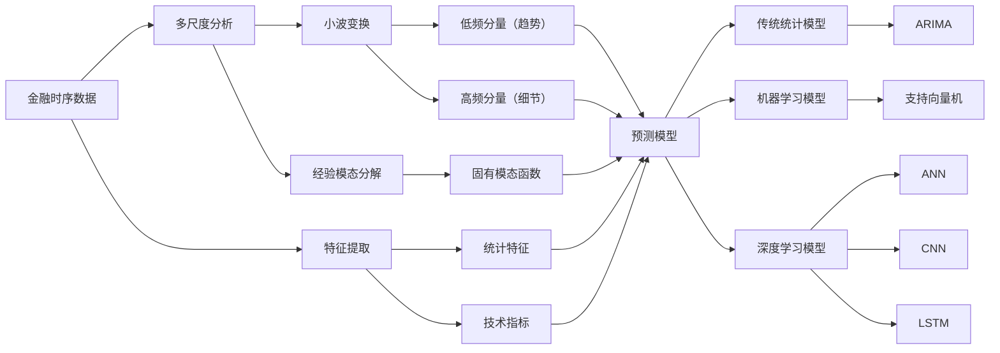

# 金融时序数据的多尺度分析与预测研究

> 关键词：金融时序数据、多尺度分析、预测研究、小波变换、深度学习

> 摘要：本文聚焦于金融时序数据的多尺度分析与预测研究。首先介绍了金融时序数据多尺度分析与预测的背景、目的、预期读者等内容。接着阐述了核心概念，包括多尺度分析和金融时序数据预测的原理及联系，并给出相应的示意图和流程图。详细讲解了核心算法原理，如小波变换和深度学习算法，并使用Python代码进行了具体实现。对涉及的数学模型和公式进行了详细推导和举例说明。通过项目实战展示了如何搭建开发环境、实现源代码并进行解读分析。探讨了该研究在金融市场的实际应用场景，推荐了相关的学习资源、开发工具框架和论文著作。最后总结了未来发展趋势与挑战，并给出常见问题解答和扩展阅读参考资料，旨在为金融领域的时序数据处理和预测提供全面且深入的研究。

## 1. 背景介绍 
### 1.1 目的和范围
金融市场充满了不确定性和复杂性，金融时序数据如股票价格、汇率、利率等随时间不断变化。对这些数据进行准确的分析和预测，有助于投资者制定合理的投资策略、降低风险，同时也能为金融机构的风险管理和决策提供支持。本研究的目的在于探索有效的多尺度分析方法，挖掘金融时序数据在不同时间尺度下的特征和规律，并利用这些特征进行精准的预测。研究范围涵盖了常见的金融时序数据类型，以及多种多尺度分析技术和预测模型。

### 1.2 预期读者
本文预期读者包括金融领域的从业者，如投资经理、风险分析师等，他们可以借助文中的方法和技术更好地理解金融市场动态，优化投资决策。同时，计算机科学和统计学领域的研究人员也能从本文中获取关于金融时序数据处理和分析的新思路，为相关领域的研究提供参考。此外，对金融数据分析和预测感兴趣的学生和爱好者也能通过阅读本文，深入了解该领域的基本原理和方法。

### 1.3 文档结构概述
本文首先介绍了研究的背景信息，包括目的、预期读者和文档结构。接着详细阐述了核心概念，包括多尺度分析和金融时序数据预测的原理及联系。然后讲解了核心算法原理，如小波变换和深度学习算法，并给出Python代码实现。之后对涉及的数学模型和公式进行了详细推导和举例说明。通过项目实战展示了开发环境搭建、源代码实现和解读分析。探讨了实际应用场景，推荐了相关的学习资源、开发工具框架和论文著作。最后总结了未来发展趋势与挑战，给出常见问题解答和扩展阅读参考资料。

### 1.4 术语表
#### 1.4.1 核心术语定义
- **金融时序数据**：是指按照时间顺序排列的金融相关数据，如股票价格、成交量、汇率等，反映了金融市场在不同时间点的状态和变化。
- **多尺度分析**：是一种将信号在不同尺度下进行分解和分析的方法，能够揭示信号在不同时间尺度下的特征和规律。
- **小波变换**：是一种常用的多尺度分析方法，通过小波函数将信号分解为不同尺度和频率的分量。
- **深度学习**：是一类基于人工神经网络的机器学习方法，能够自动从大量数据中学习复杂的模式和特征。

#### 1.4.2 相关概念解释
- **时间尺度**：表示数据变化的时间范围，不同的时间尺度反映了数据在不同时间段内的变化特征。例如，短期时间尺度可以反映日内交易的波动，而长期时间尺度可以反映市场的宏观趋势。
- **特征提取**：是指从原始数据中提取出能够代表数据特征和规律的信息，以便后续的分析和预测。在金融时序数据中，特征提取可以包括计算各种技术指标、统计量等。
- **预测模型**：是用于对未来数据进行预测的数学模型，常见的预测模型包括线性回归模型、神经网络模型等。

#### 1.4.3 缩略词列表
- **ANN**：Artificial Neural Network，人工神经网络
- **CNN**：Convolutional Neural Network，卷积神经网络
- **LSTM**：Long Short-Term Memory，长短期记忆网络
- **WT**：Wavelet Transform，小波变换

## 2. 核心概念与联系 
### 核心概念原理
#### 金融时序数据
金融时序数据是金融市场中各种变量随时间变化的记录。这些数据具有时间序列的特性，即数据点之间存在时间上的先后顺序和相关性。例如，股票价格的变化不仅受到当前市场信息的影响，还与过去的价格走势密切相关。金融时序数据通常具有非平稳性、波动性和噪声等特点，这给数据的分析和预测带来了挑战。

#### 多尺度分析
多尺度分析的核心思想是将信号在不同的尺度下进行分解，从而揭示信号在不同时间尺度下的特征和规律。在金融时序数据中，不同的时间尺度反映了不同的市场行为。例如，短期尺度下的数据可能反映了日内交易的波动和噪声，而长期尺度下的数据则可能反映了宏观经济因素和市场趋势。常见的多尺度分析方法包括小波变换、经验模态分解等。

#### 预测研究
金融时序数据的预测研究旨在根据历史数据预测未来的市场走势。预测的准确性对于投资者和金融机构至关重要。预测方法可以分为传统的统计方法和基于机器学习、深度学习的方法。传统方法如自回归积分滑动平均模型（ARIMA）等，基于一定的假设和模型结构进行预测。而机器学习和深度学习方法则能够自动从数据中学习复杂的模式和特征，具有更强的适应性和预测能力。

### 架构的文本示意图
```plaintext
金融时序数据
|
|-- 多尺度分析
|   |-- 小波变换
|   |   |-- 低频分量（趋势）
|   |   |-- 高频分量（细节）
|   |-- 经验模态分解
|       |-- 固有模态函数
|
|-- 特征提取
|   |-- 统计特征
|   |-- 技术指标
|
|-- 预测模型
|   |-- 传统统计模型
|   |   |-- ARIMA
|   |-- 机器学习模型
|   |   |-- 支持向量机
|   |-- 深度学习模型
|       |-- ANN
|       |-- CNN
|       |-- LSTM
```

### Mermaid 流程图


## 3. 核心算法原理 & 具体操作步骤 
### 小波变换原理
小波变换是一种时频分析方法，它通过小波函数将信号分解为不同尺度和频率的分量。小波函数具有局部化特性，能够在时间和频率上同时提供良好的分辨率。连续小波变换（CWT）的定义为：
$$W_f(a,b)=\frac{1}{\sqrt{a}}\int_{-\infty}^{\infty}f(t)\psi^*(\frac{t - b}{a})dt$$
其中，$f(t)$ 是原始信号，$\psi(t)$ 是小波函数，$a$ 是尺度参数，$b$ 是平移参数。离散小波变换（DWT）是连续小波变换的离散化形式，在实际应用中更为常见。

### 小波变换的Python实现
```python
import pywt
import numpy as np
import matplotlib.pyplot as plt

# 生成示例数据
t = np.linspace(0, 1, 1000)
f = np.sin(2 * np.pi * 5 * t) + np.sin(2 * np.pi * 20 * t)

# 选择小波基和分解层数
wavelet = 'db4'
level = 3

# 进行小波分解
coeffs = pywt.wavedec(f, wavelet, level=level)

# 绘制原始信号
plt.figure(figsize=(12, 8))
plt.subplot(level + 2, 1, 1)
plt.plot(t, f)
plt.title('Original Signal')

# 绘制各层分解系数
for i in range(level + 1):
    plt.subplot(level + 2, 1, i + 2)
    plt.plot(coeffs[i])
    if i == 0:
        plt.title('Approximation Coefficients (A{})'.format(level))
    else:
        plt.title('Detail Coefficients (D{})'.format(level - i + 1))

plt.tight_layout()
plt.show()
```
### 代码解释
1. **数据生成**：使用 `np.linspace` 生成时间序列 `t`，并生成包含两个不同频率正弦波的信号 `f`。
2. **小波基和分解层数选择**：选择 `db4` 小波基，并将分解层数设置为 3。
3. **小波分解**：使用 `pywt.wavedec` 函数对信号进行小波分解，得到各层的近似系数和细节系数。
4. **绘图**：使用 `matplotlib` 绘制原始信号和各层分解系数。

### 深度学习算法原理
以长短期记忆网络（LSTM）为例，LSTM 是一种特殊的循环神经网络（RNN），能够有效解决传统 RNN 的梯度消失问题，适合处理序列数据。LSTM 单元包含输入门、遗忘门和输出门，通过这些门控机制来控制信息的流动和记忆。

### LSTM的Python实现
```python
import numpy as np
import pandas as pd
from sklearn.preprocessing import MinMaxScaler
from tensorflow.keras.models import Sequential
from tensorflow.keras.layers import LSTM, Dense

# 生成示例数据
data = pd.DataFrame({'price': np.random.randn(1000).cumsum()})

# 数据归一化
scaler = MinMaxScaler()
data['price'] = scaler.fit_transform(data[['price']])

# 准备训练数据
def create_sequences(data, seq_length):
    xs = []
    ys = []
    for i in range(len(data) - seq_length):
        x = data[i:i + seq_length]
        y = data[i + seq_length]
        xs.append(x)
        ys.append(y)
    return np.array(xs), np.array(ys)

seq_length = 10
X, y = create_sequences(data['price'].values, seq_length)

# 划分训练集和测试集
train_size = int(len(X) * 0.8)
X_train, X_test = X[:train_size], X[train_size:]
y_train, y_test = y[:train_size], y[train_size:]

# 构建LSTM模型
model = Sequential()
model.add(LSTM(50, return_sequences=True, input_shape=(seq_length, 1)))
model.add(LSTM(50, return_sequences=False))
model.add(Dense(25))
model.add(Dense(1))

# 编译模型
model.compile(optimizer='adam', loss='mean_squared_error')

# 训练模型
model.fit(X_train, y_train, batch_size=32, epochs=50)

# 预测
predictions = model.predict(X_test)
predictions = scaler.inverse_transform(predictions)
y_test = scaler.inverse_transform(y_test.reshape(-1, 1))

# 绘制预测结果
plt.figure(figsize=(12, 6))
plt.plot(y_test, label='Actual')
plt.plot(predictions, label='Predicted')
plt.title('LSTM Prediction')
plt.xlabel('Time')
plt.ylabel('Price')
plt.legend()
plt.show()
```
### 代码解释
1. **数据生成和归一化**：生成随机的价格数据，并使用 `MinMaxScaler` 进行归一化处理。
2. **准备训练数据**：定义 `create_sequences` 函数，将数据转换为适合 LSTM 输入的序列形式。
3. **划分训练集和测试集**：将数据按 80:20 的比例划分为训练集和测试集。
4. **构建 LSTM 模型**：使用 `Sequential` 模型构建 LSTM 网络，包含两个 LSTM 层和两个全连接层。
5. **编译和训练模型**：使用 `adam` 优化器和均方误差损失函数编译模型，并进行训练。
6. **预测和绘图**：使用训练好的模型进行预测，并将预测结果和真实值进行反归一化处理，最后绘制预测结果。

## 4. 数学模型和公式 & 详细讲解 & 举例说明 
### 小波变换的数学模型和公式
#### 连续小波变换（CWT）
连续小波变换的公式为：
$$W_f(a,b)=\frac{1}{\sqrt{a}}\int_{-\infty}^{\infty}f(t)\psi^*(\frac{t - b}{a})dt$$
其中，$f(t)$ 是原始信号，$\psi(t)$ 是小波函数，$a$ 是尺度参数，$b$ 是平移参数。$a$ 控制小波的伸缩，$b$ 控制小波的平移。当 $a$ 较小时，小波函数较窄，能够捕捉信号的高频细节；当 $a$ 较大时，小波函数较宽，能够捕捉信号的低频趋势。

#### 离散小波变换（DWT）
离散小波变换是连续小波变换的离散化形式，通常采用二进制尺度和位移。离散小波变换的公式为：
$$W_f(j,k)=2^{-\frac{j}{2}}\sum_{n = 0}^{N - 1}f[n]\psi^*(2^{-j}n - k)$$
其中，$j$ 是尺度索引，$k$ 是位移索引。离散小波变换将信号分解为近似系数和细节系数，近似系数表示信号的低频部分，细节系数表示信号的高频部分。

#### 举例说明
假设我们有一个简单的信号 $f(t)=\sin(2\pi t)+\sin(4\pi t)$，我们使用 Haar 小波进行离散小波变换。Haar 小波函数的定义为：
$$\psi(t)=\begin{cases}
1, & 0\leq t<\frac{1}{2}\\
-1, & \frac{1}{2}\leq t<1\\
0, & \text{otherwise}
\end{cases}$$
我们将信号 $f(t)$ 进行一级离散小波变换，得到近似系数 $A_1$ 和细节系数 $D_1$。近似系数 $A_1$ 表示信号的低频部分，细节系数 $D_1$ 表示信号的高频部分。通过不断进行多级离散小波变换，我们可以将信号分解为不同尺度下的近似系数和细节系数。

### 深度学习模型的数学模型和公式
#### 长短期记忆网络（LSTM）
LSTM 单元的数学模型包括输入门、遗忘门和输出门。输入门控制新信息的输入，遗忘门控制旧信息的遗忘，输出门控制信息的输出。LSTM 单元的公式如下：
- 遗忘门：
$$f_t=\sigma(W_f[h_{t - 1},x_t]+b_f)$$
- 输入门：
$$i_t=\sigma(W_i[h_{t - 1},x_t]+b_i)$$
- 候选记忆单元：
$$\tilde{C}_t=\tanh(W_C[h_{t - 1},x_t]+b_C)$$
- 记忆单元更新：
$$C_t=f_t\odot C_{t - 1}+i_t\odot\tilde{C}_t$$
- 输出门：
$$o_t=\sigma(W_o[h_{t - 1},x_t]+b_o)$$
- 隐藏状态更新：
$$h_t=o_t\odot\tanh(C_t)$$
其中，$x_t$ 是输入向量，$h_{t - 1}$ 是上一时刻的隐藏状态，$C_{t - 1}$ 是上一时刻的记忆单元，$W$ 是权重矩阵，$b$ 是偏置向量，$\sigma$ 是 sigmoid 函数，$\tanh$ 是双曲正切函数，$\odot$ 表示逐元素相乘。

#### 举例说明
假设我们有一个简单的时间序列数据，我们使用 LSTM 模型进行预测。我们将时间序列数据划分为输入序列和目标序列，输入序列作为 LSTM 模型的输入，目标序列作为模型的输出。LSTM 模型通过不断学习输入序列和目标序列之间的关系，来预测未来的时间序列值。例如，我们可以使用 LSTM 模型预测股票价格的走势，通过输入历史股票价格数据，模型可以学习到价格的变化规律，并预测未来的股票价格。

## 5. 项目实战：代码实际案例和详细解释说明 
### 5.1  开发环境搭建
#### 安装Python
首先，需要安装 Python 环境。建议使用 Python 3.7 及以上版本。可以从 Python 官方网站（https://www.python.org/downloads/）下载并安装适合自己操作系统的 Python 版本。

#### 安装必要的库
使用 `pip` 包管理器安装必要的库，包括 `numpy`、`pandas`、`matplotlib`、`pywt`、`tensorflow` 等。可以使用以下命令进行安装：
```sh
pip install numpy pandas matplotlib pywt tensorflow
```

### 5.2  源代码详细实现和代码解读
#### 数据准备
```python
import pandas as pd
import numpy as np

# 读取金融时序数据
data = pd.read_csv('financial_data.csv')

# 提取需要的特征
features = data[['open', 'high', 'low', 'close', 'volume']]

# 数据归一化
from sklearn.preprocessing import MinMaxScaler
scaler = MinMaxScaler()
scaled_features = scaler.fit_transform(features)
```
**代码解读**：首先使用 `pandas` 库读取金融时序数据文件。然后提取需要的特征，如开盘价、最高价、最低价、收盘价和成交量。最后使用 `MinMaxScaler` 对特征数据进行归一化处理，将数据缩放到 0 到 1 的范围内。

#### 小波变换
```python
import pywt

# 选择小波基和分解层数
wavelet = 'db4'
level = 3

# 对每个特征进行小波分解
coeffs_list = []
for i in range(scaled_features.shape[1]):
    coeffs = pywt.wavedec(scaled_features[:, i], wavelet, level=level)
    coeffs_list.append(coeffs)
```
**代码解读**：选择 `db4` 小波基和分解层数为 3。对归一化后的每个特征进行小波分解，得到各层的近似系数和细节系数，并将其存储在 `coeffs_list` 中。

#### 特征重构
```python
# 重构特征
reconstructed_features = []
for coeffs in coeffs_list:
    reconstructed = pywt.waverec(coeffs, wavelet)
    reconstructed_features.append(reconstructed)

reconstructed_features = np.array(reconstructed_features).T
```
**代码解读**：使用 `pywt.waverec` 函数对小波分解后的系数进行重构，得到重构后的特征。最后将重构后的特征转换为二维数组。

#### 构建 LSTM 模型
```python
from tensorflow.keras.models import Sequential
from tensorflow.keras.layers import LSTM, Dense

# 准备训练数据
def create_sequences(data, seq_length):
    xs = []
    ys = []
    for i in range(len(data) - seq_length):
        x = data[i:i + seq_length]
        y = data[i + seq_length, 3]  # 预测收盘价
        xs.append(x)
        ys.append(y)
    return np.array(xs), np.array(ys)

seq_length = 10
X, y = create_sequences(reconstructed_features, seq_length)

# 划分训练集和测试集
train_size = int(len(X) * 0.8)
X_train, X_test = X[:train_size], X[train_size:]
y_train, y_test = y[:train_size], y[train_size:]

# 构建 LSTM 模型
model = Sequential()
model.add(LSTM(50, return_sequences=True, input_shape=(seq_length, X_train.shape[2])))
model.add(LSTM(50, return_sequences=False))
model.add(Dense(25))
model.add(Dense(1))

# 编译模型
model.compile(optimizer='adam', loss='mean_squared_error')

# 训练模型
model.fit(X_train, y_train, batch_size=32, epochs=50)
```
**代码解读**：定义 `create_sequences` 函数将重构后的特征数据转换为适合 LSTM 输入的序列形式。将数据按 80:20 的比例划分为训练集和测试集。使用 `Sequential` 模型构建 LSTM 网络，包含两个 LSTM 层和两个全连接层。使用 `adam` 优化器和均方误差损失函数编译模型，并进行训练。

#### 模型预测
```python
# 预测
predictions = model.predict(X_test)

# 反归一化
predictions = scaler.inverse_transform(np.hstack((np.zeros((predictions.shape[0], 3)), predictions, np.zeros((predictions.shape[0], 1)))))[:, 3]
y_test = scaler.inverse_transform(np.hstack((np.zeros((y_test.shape[0], 3)), y_test.reshape(-1, 1), np.zeros((y_test.shape[0], 1)))))[:, 3]

# 绘制预测结果
import matplotlib.pyplot as plt
plt.figure(figsize=(12, 6))
plt.plot(y_test, label='Actual')
plt.plot(predictions, label='Predicted')
plt.title('LSTM Prediction')
plt.xlabel('Time')
plt.ylabel('Price')
plt.legend()
plt.show()
```
**代码解读**：使用训练好的模型对测试集进行预测。由于之前对数据进行了归一化处理，需要将预测结果和真实值进行反归一化处理。最后使用 `matplotlib` 绘制预测结果和真实值的对比图。

### 5.3  代码解读与分析
#### 数据处理部分
数据处理部分主要包括数据读取、特征提取和归一化。数据读取使用 `pandas` 库，方便处理结构化数据。特征提取选择了开盘价、最高价、最低价、收盘价和成交量等常见的金融特征。归一化处理使用 `MinMaxScaler`，将数据缩放到 0 到 1 的范围内，有助于提高模型的训练效果。

#### 小波变换部分
小波变换部分使用 `pywt` 库对特征数据进行分解和重构。选择 `db4` 小波基和分解层数为 3，可以有效地提取数据在不同尺度下的特征。小波变换能够去除数据中的噪声，突出数据的趋势和细节信息。

#### 模型构建和训练部分
模型构建使用 `tensorflow.keras` 库构建 LSTM 网络。LSTM 网络适合处理序列数据，能够捕捉数据中的长期依赖关系。模型训练使用 `adam` 优化器和均方误差损失函数，通过不断调整模型的参数，使模型的预测结果尽可能接近真实值。

#### 模型预测和评估部分
模型预测使用训练好的模型对测试集进行预测，并将预测结果和真实值进行反归一化处理。最后使用 `matplotlib` 绘制预测结果和真实值的对比图，直观地展示模型的预测效果。可以通过计算均方误差、平均绝对误差等指标来进一步评估模型的性能。

## 6. 实际应用场景 
### 投资决策
金融时序数据的多尺度分析与预测可以为投资者提供重要的决策依据。通过对股票价格、汇率等数据的分析和预测，投资者可以了解市场的走势和趋势，制定合理的投资策略。例如，在股票投资中，投资者可以根据预测结果选择合适的买入和卖出时机，降低投资风险，提高投资收益。

### 风险管理
金融机构可以利用多尺度分析和预测技术对金融风险进行评估和管理。通过对市场数据的实时监测和分析，金融机构可以及时发现潜在的风险因素，并采取相应的措施进行风险控制。例如，银行可以根据预测结果调整信贷政策，降低不良贷款的风险。

### 资产定价
多尺度分析和预测技术可以帮助金融机构更准确地对资产进行定价。通过对金融时序数据的分析，金融机构可以了解资产的内在价值和市场供求关系，从而制定合理的资产价格。例如，保险公司可以根据风险预测结果对保险产品进行定价，确保保险业务的盈利能力。

### 市场监管
监管机构可以利用多尺度分析和预测技术对金融市场进行监管。通过对市场数据的实时监测和分析，监管机构可以及时发现市场异常波动和违规行为，采取相应的措施维护市场秩序。例如，证券监管机构可以根据预测结果对上市公司进行监管，防范内幕交易和操纵市场等违法行为。

## 7. 工具和资源推荐
### 7.1 学习资源推荐
#### 7.1.1 书籍推荐
- 《金融时间序列分析》（Analysis of Financial Time Series）：这本书详细介绍了金融时间序列的分析方法和模型，包括 ARIMA 模型、GARCH 模型等，是金融时间序列分析领域的经典教材。
- 《深度学习》（Deep Learning）：由 Ian Goodfellow、Yoshua Bengio 和 Aaron Courville 合著，是深度学习领域的权威书籍，涵盖了深度学习的基本原理、算法和应用。
- 《小波分析导论》（A Wavelet Tour of Signal Processing）：这本书系统地介绍了小波分析的基本原理和应用，包括小波变换、多分辨率分析等内容。

#### 7.1.2 在线课程
- Coursera 上的“金融市场与投资策略”（Financial Markets and Investment Strategy）：该课程由耶鲁大学教授 Robert Shiller 讲授，介绍了金融市场的基本原理和投资策略。
- edX 上的“深度学习基础”（Deep Learning Fundamentals）：由 NVIDIA 公司提供，介绍了深度学习的基本概念、算法和应用。
- 中国大学 MOOC 上的“时间序列分析”：该课程由国内高校教授讲授，详细介绍了时间序列分析的基本方法和模型。

#### 7.1.3 技术博客和网站
- Medium：是一个技术博客平台，上面有很多关于金融数据分析、深度学习等领域的优秀文章。
- Towards Data Science：是一个专注于数据科学和机器学习的网站，提供了大量的技术文章和案例分析。
- Kaggle：是一个数据科学竞赛平台，上面有很多金融时序数据的竞赛和数据集，可以通过参与竞赛来提高自己的数据分析和预测能力。

### 7.2 开发工具框架推荐
#### 7.2.1 IDE和编辑器
- PyCharm：是一款专业的 Python 集成开发环境，具有代码编辑、调试、版本控制等功能，适合开发大型的 Python 项目。
- Jupyter Notebook：是一个交互式的笔记本环境，支持代码编写、运行和可视化展示，适合进行数据探索和模型实验。
- Visual Studio Code：是一款轻量级的代码编辑器，支持多种编程语言，具有丰富的插件生态系统，适合快速开发和调试代码。

#### 7.2.2 调试和性能分析工具
- TensorBoard：是 TensorFlow 提供的可视化工具，可以用于可视化模型的训练过程、损失函数变化等信息，帮助开发者调试和优化模型。
- Py-Spy：是一个用于分析 Python 代码性能的工具，可以实时监测代码的运行时间和内存使用情况，帮助开发者找出性能瓶颈。
- cProfile：是 Python 内置的性能分析工具，可以对 Python 代码进行性能分析，输出函数调用的时间和次数等信息。

#### 7.2.3 相关框架和库
- TensorFlow：是一个开源的深度学习框架，提供了丰富的深度学习模型和工具，支持 GPU 加速，适合大规模的深度学习开发。
- PyTorch：是另一个流行的深度学习框架，具有动态图机制，易于使用和调试，适合研究和实验。
- Scikit-learn：是一个开源的机器学习库，提供了丰富的机器学习算法和工具，适合进行传统的机器学习任务。

### 7.3 相关论文著作推荐
#### 7.3.1 经典论文
- “A New Approach to the Economic Analysis of Nonstationary Time Series and the Business Cycle” by Robert F. Engle：该论文提出了自回归条件异方差（ARCH）模型，开创了金融时间序列波动性建模的先河。
- “Long Short-Term Memory” by Sepp Hochreiter and Jürgen Schmidhuber：该论文提出了长短期记忆网络（LSTM），解决了传统循环神经网络的梯度消失问题，在序列数据处理领域具有重要的影响。
- “Wavelet Transforms and Time-Frequency Analysis” by Ingrid Daubechies：该论文系统地介绍了小波变换的基本原理和应用，是小波分析领域的经典论文。

#### 7.3.2 最新研究成果
- 在 IEEE Transactions on Neural Networks and Learning Systems、Journal of Financial Economics 等学术期刊上可以找到关于金融时序数据多尺度分析和预测的最新研究成果。
- 每年的国际机器学习会议（ICML）、神经信息处理系统大会（NeurIPS）等学术会议上也会有相关的研究报告和论文。

#### 7.3.3 应用案例分析
- 在 Kaggle 等数据科学竞赛平台上可以找到很多金融时序数据的应用案例，这些案例展示了不同的分析方法和模型在实际问题中的应用。
- 一些金融机构的研究报告和白皮书也会介绍他们在金融时序数据分析和预测方面的应用案例和实践经验。

## 8. 总结：未来发展趋势与挑战
### 未来发展趋势
#### 多模态数据融合
未来的金融时序数据分析将不仅仅局限于单一类型的数据，而是会融合多种模态的数据，如文本数据、图像数据等。例如，结合新闻文本信息和股票价格数据进行分析，可以更全面地了解市场动态和影响因素。

#### 深度学习与传统方法结合
深度学习模型虽然在金融时序数据预测中取得了较好的效果，但传统的统计方法仍然具有一定的优势。未来的研究将更多地探索深度学习与传统方法的结合，充分发挥两者的优势，提高预测的准确性和可靠性。

#### 实时分析和预测
随着金融市场的快速变化，实时分析和预测变得越来越重要。未来的技术将更加注重实时数据的处理和分析，能够及时响应市场变化，为投资者和金融机构提供更及时的决策支持。

#### 可解释性模型
深度学习模型通常是黑箱模型，难以解释其决策过程和结果。未来的研究将更加关注模型的可解释性，开发出能够解释模型决策过程的方法和技术，提高模型的可信度和实用性。

### 挑战
#### 数据质量和缺失值处理
金融时序数据往往存在噪声、缺失值等问题，这些问题会影响模型的训练和预测效果。如何有效地处理数据质量问题和缺失值，是未来研究的一个重要挑战。

#### 模型复杂度和计算资源
深度学习模型通常具有较高的复杂度，需要大量的计算资源和时间进行训练。如何在有限的计算资源下提高模型的训练效率和性能，是一个亟待解决的问题。

#### 市场不确定性和风险
金融市场具有高度的不确定性和风险，模型的预测结果往往存在一定的误差。如何准确地评估和管理市场风险，提高模型的鲁棒性和适应性，是未来研究的一个重要方向。

#### 法律法规和隐私保护
随着金融科技的发展，法律法规和隐私保护问题变得越来越重要。在进行金融时序数据分析和预测时，需要遵守相关的法律法规，保护用户的隐私和数据安全。

## 9. 附录：常见问题与解答
### 小波变换的尺度和分解层数如何选择？
小波变换的尺度和分解层数的选择需要根据具体的应用场景和数据特点来确定。一般来说，尺度越大，小波函数越宽，能够捕捉信号的低频趋势；尺度越小，小波函数越窄，能够捕捉信号的高频细节。分解层数的选择通常需要进行实验和调试，以达到最佳的分解效果。

### 深度学习模型在金融时序数据预测中的优势和局限性是什么？
深度学习模型在金融时序数据预测中的优势在于能够自动从大量数据中学习复杂的模式和特征，具有较强的适应性和预测能力。局限性在于模型通常是黑箱模型，难以解释其决策过程和结果，同时需要大量的训练数据和计算资源。

### 如何评估金融时序数据预测模型的性能？
可以使用多种指标来评估金融时序数据预测模型的性能，如均方误差（MSE）、平均绝对误差（MAE）、均方根误差（RMSE）等。此外，还可以使用准确率、召回率、F1 值等指标来评估分类模型的性能。

### 多尺度分析和预测技术在实际应用中面临哪些挑战？
多尺度分析和预测技术在实际应用中面临的数据质量和缺失值处理、模型复杂度和计算资源、市场不确定性和风险、法律法规和隐私保护等挑战。需要针对这些挑战采取相应的措施，提高技术的实用性和可靠性。

## 10. 扩展阅读 & 参考资料
### 扩展阅读
- 《金融科技前沿：技术驱动的金融创新》：这本书介绍了金融科技的最新发展和应用，包括人工智能、区块链等技术在金融领域的应用。
- 《量化投资：策略与技术》：该书详细介绍了量化投资的基本原理、策略和技术，适合对量化投资感兴趣的读者。
- 《金融数学》：这本书介绍了金融数学的基本概念和方法，包括期权定价、风险管理等内容。

### 参考资料
- 《金融时间序列分析》（Analysis of Financial Time Series），作者：Robert F. Engle
- 《深度学习》（Deep Learning），作者：Ian Goodfellow、Yoshua Bengio 和 Aaron Courville
- 《小波分析导论》（A Wavelet Tour of Signal Processing），作者：Ingrid Daubechies
- IEEE Transactions on Neural Networks and Learning Systems、Journal of Financial Economics 等学术期刊
- Kaggle 数据科学竞赛平台上的相关竞赛和数据集
- 金融机构的研究报告和白皮书