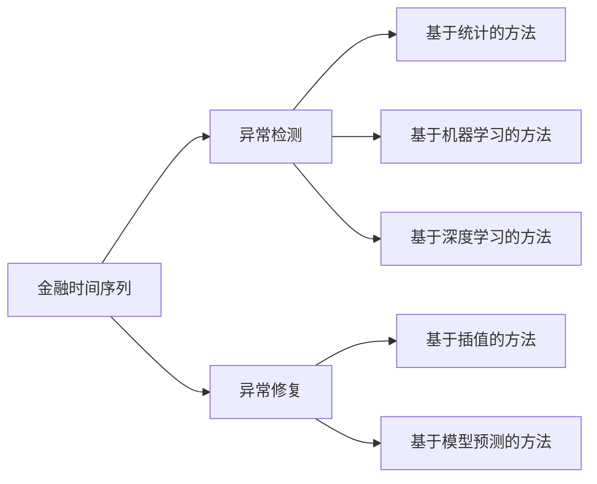

# 金融时间序列异常检测与修复系统

> 关键词：金融时间序列、异常检测、异常修复、数据挖掘、机器学习

> 摘要：金融时间序列数据包含着丰富的市场信息，对其进行异常检测与修复对于金融分析、风险评估等具有重要意义。本文详细介绍了金融时间序列异常检测与修复系统，从背景知识入手，阐述了核心概念、算法原理、数学模型，通过项目实战展示了系统的实现过程，探讨了实际应用场景，推荐了相关工具和资源，最后对未来发展趋势与挑战进行了总结，并提供了常见问题解答与参考资料，旨在为相关领域的研究和实践提供全面且深入的指导。

## 1. 背景介绍 
### 1.1 目的和范围
金融市场的复杂性和动态性使得金融时间序列数据呈现出高度的不确定性和波动性。异常数据可能由多种因素引起，如市场突发事件、数据录入错误等。本系统的目的在于准确地检测出金融时间序列中的异常数据，并对其进行合理修复，以提高数据质量，为后续的金融分析和决策提供可靠的数据支持。本系统的范围涵盖了常见的金融时间序列数据，如股票价格、汇率、利率等数据的异常检测与修复。

### 1.2 预期读者
本文预期读者包括金融分析师、数据科学家、机器学习工程师、相关专业的研究人员以及对金融时间序列分析感兴趣的技术爱好者。这些读者希望通过了解本系统，掌握金融时间序列异常检测与修复的方法和技术，应用于实际的金融数据分析和决策中。

### 1.3 文档结构概述
本文首先介绍了金融时间序列异常检测与修复系统的背景知识，包括目的、预期读者和文档结构。接着阐述了核心概念与联系，通过文本示意图和 Mermaid 流程图进行说明。然后详细讲解了核心算法原理和具体操作步骤，并给出了 Python 源代码。随后介绍了数学模型和公式，并举例说明。通过项目实战展示了系统的开发环境搭建、源代码实现和代码解读。探讨了实际应用场景，推荐了相关的工具和资源。最后总结了未来发展趋势与挑战，提供了常见问题解答和参考资料。

### 1.4 术语表
#### 1.4.1 核心术语定义
- **金融时间序列**：按时间顺序排列的金融数据序列，如股票价格、汇率等在不同时间点的取值。
- **异常检测**：识别数据中与正常模式明显不同的观测值的过程。
- **异常修复**：对检测出的异常数据进行修正，使其符合正常数据模式的过程。
- **时间窗口**：在时间序列分析中，用于截取数据的一段连续时间区间。

#### 1.4.2 相关概念解释
- **平稳性**：时间序列的统计特性不随时间变化的性质。平稳的时间序列更易于分析和建模。
- **自相关性**：时间序列中不同时间点的数据之间存在的相关性。自相关性可以帮助我们理解数据的动态变化规律。
- **离群点**：与数据集中其他数据点明显不同的数据点，通常被认为是异常数据。

#### 1.4.3 缩略词列表
- **ARIMA**：Autoregressive Integrated Moving Average，自回归积分滑动平均模型。
- **LSTM**：Long Short-Term Memory，长短期记忆网络。
- **KNN**：K-Nearest Neighbors，k 近邻算法。

## 2. 核心概念与联系 
### 核心概念原理
金融时间序列异常检测与修复系统主要涉及三个核心概念：金融时间序列、异常检测和异常修复。

金融时间序列是按照时间顺序排列的金融数据，它反映了金融市场的动态变化。异常检测的目的是识别出金融时间序列中与正常模式不符的数据点，这些数据点可能是由于市场突发事件、数据录入错误等原因导致的。异常修复则是在检测到异常数据后，对其进行修正，以提高数据的质量和可靠性。

异常检测的方法有很多种，常见的包括基于统计的方法、基于机器学习的方法和基于深度学习的方法。基于统计的方法通过分析数据的统计特性，如均值、方差等，来判断数据是否异常。基于机器学习的方法则利用机器学习算法，如 KNN、支持向量机等，对数据进行分类，以识别异常数据。基于深度学习的方法，如 LSTM 网络，能够自动学习时间序列的复杂模式，从而更准确地检测异常。

异常修复的方法也有多种，常见的包括基于插值的方法、基于模型预测的方法等。基于插值的方法通过利用异常数据周围的正常数据进行插值，来估计异常数据的合理取值。基于模型预测的方法则利用建立的时间序列模型，对异常数据进行预测，以得到修复后的值。

### 文本示意图
```plaintext
金融时间序列
|
|-- 异常检测
|   |-- 基于统计的方法
|   |-- 基于机器学习的方法
|   |-- 基于深度学习的方法
|
|-- 异常修复
|   |-- 基于插值的方法
|   |-- 基于模型预测的方法
```

### Mermaid 流程图


## 3. 核心算法原理 & 具体操作步骤 
### 基于统计的异常检测算法 - 3σ 原则
#### 算法原理
3σ 原则是一种基于正态分布的统计方法。在正态分布中，约 99.7% 的数据位于均值加减 3 倍标准差的范围内。因此，如果一个数据点超出了这个范围，就可以认为它是异常数据。

#### Python 源代码实现
```python
import numpy as np

def detect_anomalies_3sigma(data, threshold=3):
    mean = np.mean(data)
    std = np.std(data)
    lower_bound = mean - threshold * std
    upper_bound = mean + threshold * std
    anomalies = []
    for i, value in enumerate(data):
        if value < lower_bound or value > upper_bound:
            anomalies.append(i)
    return anomalies

# 示例数据
data = np.array([1, 2, 3, 4, 5, 100, 6, 7, 8, 9])
anomalies = detect_anomalies_3sigma(data)
print("异常数据的索引:", anomalies)
```
#### 具体操作步骤
1. 计算数据的均值和标准差。
2. 根据均值和标准差计算上下界。
3. 遍历数据，判断每个数据点是否超出上下界，如果超出则认为是异常数据。

### 基于机器学习的异常检测算法 - KNN
#### 算法原理
KNN 算法是一种基于邻居的分类算法。在异常检测中，我们可以计算每个数据点到其 k 个最近邻居的平均距离。如果一个数据点到其邻居的平均距离超过了某个阈值，就可以认为它是异常数据。

#### Python 源代码实现
```python
from sklearn.neighbors import NearestNeighbors
import numpy as np

def detect_anomalies_knn(data, n_neighbors=5, threshold=3):
    nbrs = NearestNeighbors(n_neighbors=n_neighbors).fit(data.reshape(-1, 1))
    distances, indices = nbrs.kneighbors(data.reshape(-1, 1))
    mean_distances = np.mean(distances, axis=1)
    threshold_value = np.mean(mean_distances) + threshold * np.std(mean_distances)
    anomalies = []
    for i, distance in enumerate(mean_distances):
        if distance > threshold_value:
            anomalies.append(i)
    return anomalies

# 示例数据
data = np.array([1, 2, 3, 4, 5, 100, 6, 7, 8, 9])
anomalies = detect_anomalies_knn(data)
print("异常数据的索引:", anomalies)
```
#### 具体操作步骤
1. 训练 KNN 模型，计算每个数据点到其 k 个最近邻居的距离。
2. 计算每个数据点到其邻居的平均距离。
3. 根据平均距离的均值和标准差计算阈值。
4. 遍历平均距离，判断每个数据点的平均距离是否超过阈值，如果超过则认为是异常数据。

### 基于深度学习的异常检测算法 - LSTM
#### 算法原理
LSTM 网络是一种特殊的循环神经网络，能够处理序列数据中的长期依赖关系。在异常检测中，我们可以使用 LSTM 网络对正常的时间序列数据进行建模，然后将测试数据输入到模型中，计算模型的预测值和实际值之间的误差。如果误差超过了某个阈值，就可以认为该数据点是异常数据。

#### Python 源代码实现
```python
import numpy as np
from tensorflow.keras.models import Sequential
from tensorflow.keras.layers import LSTM, Dense

# 数据预处理
def prepare_data(data, timesteps):
    X, y = [], []
    for i in range(len(data) - timesteps):
        X.append(data[i:i + timesteps])
        y.append(data[i + timesteps])
    X = np.array(X)
    y = np.array(y)
    X = np.reshape(X, (X.shape[0], X.shape[1], 1))
    return X, y

# 构建 LSTM 模型
def build_lstm_model(timesteps):
    model = Sequential()
    model.add(LSTM(50, input_shape=(timesteps, 1)))
    model.add(Dense(1))
    model.compile(optimizer='adam', loss='mse')
    return model

# 异常检测
def detect_anomalies_lstm(data, timesteps=10, threshold=0.1):
    X, y = prepare_data(data, timesteps)
    model = build_lstm_model(timesteps)
    model.fit(X, y, epochs=50, batch_size=32, verbose=0)
    predictions = model.predict(X)
    errors = np.abs(predictions - y)
    anomalies = []
    for i, error in enumerate(errors):
        if error > threshold:
            anomalies.append(i + timesteps)
    return anomalies

# 示例数据
data = np.array([1, 2, 3, 4, 5, 100, 6, 7, 8, 9])
anomalies = detect_anomalies_lstm(data)
print("异常数据的索引:", anomalies)
```
#### 具体操作步骤
1. 对数据进行预处理，将时间序列数据转换为适合 LSTM 网络输入的格式。
2. 构建 LSTM 模型并进行训练。
3. 使用训练好的模型对数据进行预测，计算预测值和实际值之间的误差。
4. 根据误差的阈值判断数据点是否异常。

### 基于插值的异常修复算法 - 线性插值
#### 算法原理
线性插值是一种简单的插值方法，它通过利用异常数据周围的两个正常数据点，构建一条直线，然后根据直线的方程来估计异常数据的合理取值。

#### Python 源代码实现
```python
import numpy as np

def repair_anomalies_linear(data, anomalies):
    repaired_data = data.copy()
    for index in anomalies:
        left_index = index - 1
        while left_index in anomalies and left_index > 0:
            left_index -= 1
        right_index = index + 1
        while right_index in anomalies and right_index < len(data):
            right_index += 1
        if left_index >= 0 and right_index < len(data):
            slope = (data[right_index] - data[left_index]) / (right_index - left_index)
            repaired_data[index] = data[left_index] + slope * (index - left_index)
    return repaired_data

# 示例数据
data = np.array([1, 2, 3, 4, 5, 100, 6, 7, 8, 9])
anomalies = detect_anomalies_3sigma(data)
repaired_data = repair_anomalies_linear(data, anomalies)
print("修复后的数据:", repaired_data)
```
#### 具体操作步骤
1. 遍历异常数据的索引。
2. 找到异常数据左右两侧的正常数据点。
3. 根据左右两侧的正常数据点计算斜率。
4. 使用斜率和左侧正常数据点的值来估计异常数据的合理取值。

## 4. 数学模型和公式 & 详细讲解 & 举例说明 
### 3σ 原则的数学模型和公式
在正态分布中，随机变量 $X$ 服从均值为 $\mu$，标准差为 $\sigma$ 的正态分布，记为 $X \sim N(\mu, \sigma^2)$。根据 3σ 原则，约 99.7% 的数据位于区间 $(\mu - 3\sigma, \mu + 3\sigma)$ 内。因此，判断一个数据点 $x$ 是否异常的公式为：
$$
\begin{cases}
\text{异常} & \text{if } x < \mu - 3\sigma \text{ or } x > \mu + 3\sigma \\
\text{正常} & \text{otherwise}
\end{cases}
$$
**举例说明**：假设有一组数据 $[1, 2, 3, 4, 5, 100, 6, 7, 8, 9]$，首先计算均值 $\mu$ 和标准差 $\sigma$：
```python
import numpy as np
data = np.array([1, 2, 3, 4, 5, 100, 6, 7, 8, 9])
mean = np.mean(data)
std = np.std(data)
print("均值:", mean)
print("标准差:", std)
```
计算得到均值约为 14.5，标准差约为 29.3。根据 3σ 原则，上下界分别为 $\mu - 3\sigma \approx 14.5 - 3 \times 29.3 = -73.4$ 和 $\mu + 3\sigma \approx 14.5 + 3 \times 29.3 = 102.4$。数据点 100 在这个区间内，按照 3σ 原则它是正常数据，但实际上由于数据的分布可能不是严格的正态分布，100 明显与其他数据差异较大，这也体现了 3σ 原则的局限性。

### KNN 算法的数学模型和公式
在 KNN 算法中，对于一个数据点 $x_i$，它到其 $k$ 个最近邻居的平均距离 $d_i$ 可以表示为：
$$
d_i = \frac{1}{k} \sum_{j=1}^{k} \text{dist}(x_i, x_{n_j})
$$
其中，$\text{dist}(x_i, x_{n_j})$ 表示数据点 $x_i$ 到其第 $j$ 个最近邻居 $x_{n_j}$ 的距离，通常使用欧几里得距离。判断一个数据点是否异常的阈值 $T$ 可以根据平均距离的均值 $\bar{d}$ 和标准差 $\sigma_d$ 来计算：
$$
T = \bar{d} + \alpha \sigma_d
$$
其中，$\alpha$ 是一个常数，通常取 3。

**举例说明**：假设有一组二维数据点 $[(1, 1), (2, 2), (3, 3), (4, 4), (5, 5), (10, 10)]$，我们要使用 KNN 算法检测异常数据。首先计算每个数据点到其 2 个最近邻居的平均距离：
```python
from sklearn.neighbors import NearestNeighbors
import numpy as np

data = np.array([[1, 1], [2, 2], [3, 3], [4, 4], [5, 5], [10, 10]])
nbrs = NearestNeighbors(n_neighbors=2).fit(data)
distances, indices = nbrs.kneighbors(data)
mean_distances = np.mean(distances, axis=1)
print("平均距离:", mean_distances)
```
计算得到平均距离后，根据均值和标准差计算阈值，然后判断每个数据点是否异常。

### LSTM 网络的数学模型和公式
LSTM 网络的核心是门控单元，包括输入门 $i_t$、遗忘门 $f_t$、输出门 $o_t$ 和细胞状态 $C_t$。它们的计算公式如下：
$$
\begin{align*}
i_t &= \sigma(W_{ii} x_t + W_{hi} h_{t-1} + b_i) \\
f_t &= \sigma(W_{if} x_t + W_{hf} h_{t-1} + b_f) \\
o_t &= \sigma(W_{io} x_t + W_{ho} h_{t-1} + b_o) \\
\tilde{C}_t &= \tanh(W_{ic} x_t + W_{hc} h_{t-1} + b_c) \\
C_t &= f_t \odot C_{t-1} + i_t \odot \tilde{C}_t \\
h_t &= o_t \odot \tanh(C_t)
\end{align*}
$$
其中，$x_t$ 是输入向量，$h_{t-1}$ 是上一时刻的隐藏状态，$W$ 是权重矩阵，$b$ 是偏置向量，$\sigma$ 是 sigmoid 函数，$\tanh$ 是双曲正切函数，$\odot$ 表示逐元素相乘。

在异常检测中，我们使用均方误差（MSE）来计算预测值 $\hat{y}_t$ 和实际值 $y_t$ 之间的误差：
$$
\text{MSE} = \frac{1}{n} \sum_{t=1}^{n} (y_t - \hat{y}_t)^2
$$
如果 MSE 超过了某个阈值，就认为该数据点是异常数据。

**举例说明**：假设有一个时间序列数据 $[1, 2, 3, 4, 5, 6, 7, 8, 9, 10]$，我们使用 LSTM 网络对其进行建模和异常检测。首先对数据进行预处理，然后构建 LSTM 模型并进行训练，最后计算预测值和实际值之间的误差：
```python
import numpy as np
from tensorflow.keras.models import Sequential
from tensorflow.keras.layers import LSTM, Dense

# 数据预处理
def prepare_data(data, timesteps):
    X, y = [], []
    for i in range(len(data) - timesteps):
        X.append(data[i:i + timesteps])
        y.append(data[i + timesteps])
    X = np.array(X)
    y = np.array(y)
    X = np.reshape(X, (X.shape[0], X.shape[1], 1))
    return X, y

# 构建 LSTM 模型
def build_lstm_model(timesteps):
    model = Sequential()
    model.add(LSTM(50, input_shape=(timesteps, 1)))
    model.add(Dense(1))
    model.compile(optimizer='adam', loss='mse')
    return model

data = np.array([1, 2, 3, 4, 5, 6, 7, 8, 9, 10])
timesteps = 3
X, y = prepare_data(data, timesteps)
model = build_lstm_model(timesteps)
model.fit(X, y, epochs=50, batch_size=32, verbose=0)
predictions = model.predict(X)
errors = np.square(y - predictions.flatten())
print("误差:", errors)
```

### 线性插值的数学模型和公式
对于一个异常数据点 $x_i$，假设其左右两侧的正常数据点分别为 $x_{l}$ 和 $x_{r}$，对应的时间索引分别为 $l$ 和 $r$，则线性插值的公式为：
$$
x_i = x_{l} + \frac{x_{r} - x_{l}}{r - l} (i - l)
$$

**举例说明**：假设有一组数据 $[1, 2, 3, 100, 5, 6]$，其中 100 是异常数据。其左右两侧的正常数据点分别为 3 和 5，对应的时间索引分别为 2 和 4。则使用线性插值修复 100 的值为：
```python
left_value = 3
right_value = 5
left_index = 2
right_index = 4
anomaly_index = 3
repaired_value = left_value + (right_value - left_value) / (right_index - left_index) * (anomaly_index - left_index)
print("修复后的值:", repaired_value)
```

## 5. 项目实战：代码实际案例和详细解释说明 
### 5.1  开发环境搭建
#### 安装 Python
首先需要安装 Python 环境，建议使用 Python 3.6 及以上版本。可以从 Python 官方网站（https://www.python.org/downloads/） 下载适合自己操作系统的安装包，然后按照安装向导进行安装。

#### 安装必要的库
在安装好 Python 后，需要安装一些必要的库，如 NumPy、Pandas、Scikit-learn、TensorFlow 等。可以使用以下命令进行安装：
```sh
pip install numpy pandas scikit-learn tensorflow
```

### 5.2  源代码详细实现和代码解读
#### 数据加载和预处理
```python
import numpy as np
import pandas as pd

# 加载数据
data = pd.read_csv('financial_data.csv')
# 提取时间序列数据
time_series = data['price'].values

# 数据标准化
from sklearn.preprocessing import StandardScaler
scaler = StandardScaler()
scaled_time_series = scaler.fit_transform(time_series.reshape(-1, 1)).flatten()
```
**代码解读**：首先使用 Pandas 库读取金融数据文件 `financial_data.csv`，并提取出价格列作为时间序列数据。然后使用 Scikit-learn 库中的 `StandardScaler` 对时间序列数据进行标准化处理，将数据的均值变为 0，标准差变为 1，以提高模型的训练效果。

#### 异常检测
```python
# 使用 3σ 原则进行异常检测
def detect_anomalies_3sigma(data, threshold=3):
    mean = np.mean(data)
    std = np.std(data)
    lower_bound = mean - threshold * std
    upper_bound = mean + threshold * std
    anomalies = []
    for i, value in enumerate(data):
        if value < lower_bound or value > upper_bound:
            anomalies.append(i)
    return anomalies

anomalies = detect_anomalies_3sigma(scaled_time_series)
print("异常数据的索引:", anomalies)
```
**代码解读**：定义了一个 `detect_anomalies_3sigma` 函数，用于使用 3σ 原则进行异常检测。该函数首先计算数据的均值和标准差，然后根据均值和标准差计算上下界。最后遍历数据，判断每个数据点是否超出上下界，如果超出则将其索引添加到异常列表中。

#### 异常修复
```python
# 使用线性插值进行异常修复
def repair_anomalies_linear(data, anomalies):
    repaired_data = data.copy()
    for index in anomalies:
        left_index = index - 1
        while left_index in anomalies and left_index > 0:
            left_index -= 1
        right_index = index + 1
        while right_index in anomalies and right_index < len(data):
            right_index += 1
        if left_index >= 0 and right_index < len(data):
            slope = (data[right_index] - data[left_index]) / (right_index - left_index)
            repaired_data[index] = data[left_index] + slope * (index - left_index)
    return repaired_data

repaired_time_series = repair_anomalies_linear(scaled_time_series, anomalies)
```
**代码解读**：定义了一个 `repair_anomalies_linear` 函数，用于使用线性插值进行异常修复。该函数首先复制一份原始数据，然后遍历异常数据的索引。对于每个异常数据，找到其左右两侧的正常数据点，根据这两个正常数据点计算斜率，然后使用斜率和左侧正常数据点的值来估计异常数据的合理取值。

#### 数据反标准化
```python
# 数据反标准化
repaired_time_series = scaler.inverse_transform(repaired_time_series.reshape(-1, 1)).flatten()
```
**代码解读**：使用之前的 `StandardScaler` 对象对修复后的数据进行反标准化处理，将数据还原到原始的尺度。

### 5.3  代码解读与分析
#### 数据预处理的重要性
数据预处理是异常检测和修复的重要步骤。通过数据标准化，可以消除数据的量纲影响，使不同特征具有相同的尺度，从而提高模型的训练效果。同时，数据预处理还可以处理缺失值、异常值等问题，提高数据的质量。

#### 异常检测算法的选择
不同的异常检测算法有不同的优缺点和适用场景。3σ 原则是一种简单的统计方法，适用于数据近似服从正态分布的情况。KNN 算法是一种基于邻居的方法，适用于数据分布较为复杂的情况。LSTM 网络是一种深度学习方法，适用于处理序列数据中的长期依赖关系。在实际应用中，需要根据数据的特点和问题的需求选择合适的异常检测算法。

#### 异常修复算法的选择
异常修复算法的选择也需要根据数据的特点和问题的需求来决定。线性插值是一种简单的插值方法，适用于数据变化较为平稳的情况。基于模型预测的方法，如使用 ARIMA 模型或 LSTM 模型进行预测，可以更准确地修复异常数据，但需要更多的计算资源和时间。

## 6. 实际应用场景 
### 金融风险管理
在金融风险管理中，异常检测与修复系统可以帮助识别金融市场中的异常波动，如股票价格的异常上涨或下跌、汇率的异常波动等。通过及时发现这些异常情况，金融机构可以采取相应的措施，如调整投资组合、增加风险准备金等，以降低风险。

### 交易策略优化
在交易策略优化中，异常检测与修复系统可以帮助筛选出异常的交易数据，避免这些异常数据对交易策略的影响。同时，通过修复异常数据，可以提高交易数据的质量，从而优化交易策略，提高交易效率和收益。

### 市场趋势分析
在市场趋势分析中，异常检测与修复系统可以帮助去除异常数据的干扰，使市场趋势更加清晰。通过对修复后的数据进行分析，可以更准确地预测市场趋势，为投资者提供更有价值的决策依据。

### 财务报表分析
在财务报表分析中，异常检测与修复系统可以帮助发现财务报表中的异常数据，如异常的收入、成本、利润等。通过对这些异常数据进行修复和分析，可以发现企业财务状况中的潜在问题，为企业的财务管理和决策提供支持。

## 7. 工具和资源推荐
### 7.1 学习资源推荐
#### 7.1.1 书籍推荐
- 《时间序列分析及其应用：R 语言实现》：本书详细介绍了时间序列分析的基本理论和方法，并通过 R 语言实现了各种时间序列分析模型，是学习时间序列分析的经典教材。
- 《Python 数据分析实战》：本书介绍了如何使用 Python 进行数据分析，包括数据处理、数据可视化、机器学习等方面的内容，对于学习金融时间序列分析和异常检测具有很大的帮助。
- 《深度学习》：本书是深度学习领域的经典著作，介绍了深度学习的基本原理和方法，包括神经网络、卷积神经网络、循环神经网络等，对于学习基于深度学习的异常检测算法具有重要的参考价值。

#### 7.1.2 在线课程
- Coursera 上的“时间序列预测”课程：该课程由知名教授授课，介绍了时间序列预测的基本方法和技术，包括 ARIMA 模型、指数平滑模型等。
- edX 上的“深度学习基础”课程：该课程介绍了深度学习的基本概念和方法，包括神经网络、反向传播算法、优化算法等，对于学习基于深度学习的异常检测算法具有重要的帮助。
- 网易云课堂上的“Python 数据分析实战”课程：该课程介绍了如何使用 Python 进行数据分析，包括数据处理、数据可视化、机器学习等方面的内容，对于学习金融时间序列分析和异常检测具有很大的帮助。

#### 7.1.3 技术博客和网站
- Medium：Medium 上有很多关于金融时间序列分析、异常检测和机器学习的技术博客文章，可以帮助我们了解最新的技术动态和研究成果。
- Towards Data Science：Towards Data Science 是一个专注于数据科学和机器学习的网站，上面有很多关于金融时间序列分析、异常检测和机器学习的技术文章和教程。
- Kaggle：Kaggle 是一个数据科学竞赛平台，上面有很多关于金融时间序列分析、异常检测和机器学习的竞赛项目和数据集，可以帮助我们实践和提高自己的技能。

### 7.2 开发工具框架推荐
#### 7.2.1 IDE和编辑器
- PyCharm：PyCharm 是一款专门为 Python 开发设计的集成开发环境，具有代码编辑、调试、代码分析等功能，是 Python 开发的首选工具。
- Jupyter Notebook：Jupyter Notebook 是一个交互式的开发环境，可以在浏览器中运行 Python 代码，同时可以插入文本、图片、公式等，非常适合进行数据分析和实验。
- Visual Studio Code：Visual Studio Code 是一款轻量级的代码编辑器，支持多种编程语言，具有丰富的插件和扩展功能，可以用于 Python 开发和数据分析。

#### 7.2.2 调试和性能分析工具
- Py-Spy：Py-Spy 是一个 Python 性能分析工具，可以实时监控 Python 程序的运行状态，找出性能瓶颈。
- cProfile：cProfile 是 Python 内置的性能分析工具，可以分析 Python 程序的运行时间和函数调用次数，帮助我们找出性能瓶颈。
- PDB：PDB 是 Python 内置的调试工具，可以在 Python 程序中设置断点，单步执行代码，查看变量的值，帮助我们调试程序。

#### 7.2.3 相关框架和库
- NumPy：NumPy 是 Python 中用于科学计算的基础库，提供了高效的多维数组对象和各种数学函数，是进行金融时间序列分析和异常检测的基础。
- Pandas：Pandas 是 Python 中用于数据处理和分析的库，提供了高效的数据结构和数据操作方法，如数据读取、数据清洗、数据转换等，是进行金融时间序列分析和异常检测的重要工具。
- Scikit-learn：Scikit-learn 是 Python 中用于机器学习的库，提供了各种机器学习算法和工具，如分类、回归、聚类、异常检测等，是进行金融时间序列异常检测的常用工具。
- TensorFlow：TensorFlow 是一个开源的深度学习框架，提供了各种深度学习模型和工具，如神经网络、卷积神经网络、循环神经网络等，是进行基于深度学习的异常检测算法的常用框架。

### 7.3 相关论文著作推荐
#### 7.3.1 经典论文
- “Isolation Forest”：该论文提出了一种基于孤立森林的异常检测算法，该算法具有高效、准确的特点，适用于高维数据的异常检测。
- “Long Short-Term Memory”：该论文提出了长短期记忆网络（LSTM），解决了传统循环神经网络中梯度消失和梯度爆炸的问题，使得循环神经网络能够处理序列数据中的长期依赖关系。
- “Autoencoder-based Anomaly Detection and Diagnosis in Complex Systems”：该论文提出了一种基于自编码器的异常检测方法，该方法通过学习数据的正常模式，将异常数据与正常模式进行比较，从而检测出异常数据。

#### 7.3.2 最新研究成果
- 近年来，随着深度学习技术的发展，越来越多的基于深度学习的异常检测算法被提出，如基于生成对抗网络（GAN）的异常检测算法、基于变分自编码器（VAE）的异常检测算法等。这些算法在金融时间序列异常检测中取得了较好的效果。
- 同时，一些融合多种算法的异常检测方法也被提出，如将统计方法和机器学习方法相结合、将深度学习方法和传统方法相结合等，以提高异常检测的准确性和效率。

#### 7.3.3 应用案例分析
- 一些金融机构和研究机构已经将异常检测与修复系统应用于实际的金融业务中，如银行的风险评估、证券的投资分析等。这些应用案例可以帮助我们了解异常检测与修复系统在实际应用中的效果和挑战，为我们的研究和实践提供参考。

## 8. 总结：未来发展趋势与挑战
### 未来发展趋势
#### 多模态数据融合
未来的金融时间序列异常检测与修复系统将不仅仅局限于单一的时间序列数据，还将融合多种模态的数据，如文本数据、图像数据等。通过多模态数据的融合，可以更全面地了解金融市场的情况，提高异常检测的准确性。

#### 深度学习技术的进一步应用
随着深度学习技术的不断发展，未来的金融时间序列异常检测与修复系统将更多地应用深度学习技术，如基于注意力机制的深度学习模型、基于强化学习的异常检测算法等。这些技术将能够更好地处理金融时间序列数据中的复杂模式和长期依赖关系，提高异常检测和修复的效果。

#### 实时异常检测与修复
在金融市场中，异常情况往往需要及时发现和处理。因此，未来的金融时间序列异常检测与修复系统将更加注重实时性，能够在异常情况发生的瞬间就进行检测和修复，以减少损失。

#### 可解释性异常检测
随着人工智能技术的广泛应用，人们对模型的可解释性越来越关注。未来的金融时间序列异常检测与修复系统将更加注重模型的可解释性，能够解释异常检测的结果和修复的依据，为金融决策提供更可靠的支持。

### 挑战
#### 数据质量问题
金融时间序列数据往往存在噪声、缺失值、异常值等问题，这些问题会影响异常检测和修复的效果。因此，如何提高数据质量，是金融时间序列异常检测与修复系统面临的一个重要挑战。

#### 模型复杂度与效率问题
随着深度学习技术的应用，模型的复杂度越来越高，计算资源的需求也越来越大。如何在保证模型准确性的前提下，提高模型的效率，是金融时间序列异常检测与修复系统面临的另一个重要挑战。

#### 异常模式的多样性
金融市场的异常模式具有多样性，不同的异常模式可能需要不同的检测和修复方法。如何识别和处理各种异常模式，是金融时间序列异常检测与修复系统面临的一个挑战。

#### 法律法规和伦理问题
在金融领域，异常检测与修复系统的应用需要遵守相关的法律法规和伦理规范。如何确保系统的应用符合法律法规和伦理要求，是金融时间序列异常检测与修复系统面临的一个重要挑战。

## 9. 附录：常见问题与解答
### 问题 1：如何选择合适的异常检测算法？
答：选择合适的异常检测算法需要考虑数据的特点、问题的需求和计算资源等因素。如果数据近似服从正态分布，可以选择 3σ 原则等基于统计的方法；如果数据分布较为复杂，可以选择 KNN 等基于机器学习的方法；如果数据具有长期依赖关系，可以选择 LSTM 等基于深度学习的方法。

### 问题 2：异常修复后的数据是否一定准确？
答：异常修复后的数据不一定完全准确。异常修复算法只是根据一定的假设和方法对异常数据进行估计和修正，可能存在一定的误差。因此，在使用修复后的数据进行分析和决策时，需要谨慎对待。

### 问题 3：如何评估异常检测和修复的效果？
答：可以使用一些评估指标来评估异常检测和修复的效果，如准确率、召回率、F1 值等。同时，还可以通过可视化的方法，观察修复后的数据与原始数据的差异，以及异常检测的结果是否合理。

### 问题 4：在实际应用中，如何处理大规模的金融时间序列数据？
答：在实际应用中，可以采用分布式计算、并行计算等技术来处理大规模的金融时间序列数据。同时，还可以采用数据抽样、降维等方法来减少数据的规模，提高处理效率。

## 10. 扩展阅读 & 参考资料
### 扩展阅读
- 《金融时间序列分析》：本书系统地介绍了金融时间序列分析的基本理论和方法，包括线性时间序列模型、ARCH 模型、GARCH 模型等，对于深入学习金融时间序列分析具有重要的参考价值。
- 《机器学习实战》：本书通过实际案例介绍了机器学习的基本算法和应用，包括分类、回归、聚类、异常检测等，对于学习机器学习在金融时间序列异常检测中的应用具有很大的帮助。
- 《深度学习实战》：本书介绍了深度学习的基本原理和方法，并通过实际案例介绍了深度学习在图像识别、自然语言处理、语音识别等领域的应用，对于学习基于深度学习的金融时间序列异常检测算法具有重要的参考价值。

### 参考资料
- [NumPy 官方文档](https://numpy.org/doc/)
- [Pandas 官方文档](https://pandas.pydata.org/docs/)
- [Scikit-learn 官方文档](https://scikit-learn.org/stable/documentation.html)
- [TensorFlow 官方文档](https://www.tensorflow.org/api_docs)
- [Wikipedia - Time series analysis](https://en.wikipedia.org/wiki/Time_series_analysis)
- [Wikipedia - Anomaly detection](https://en.wikipedia.org/wiki/Anomaly_detection)