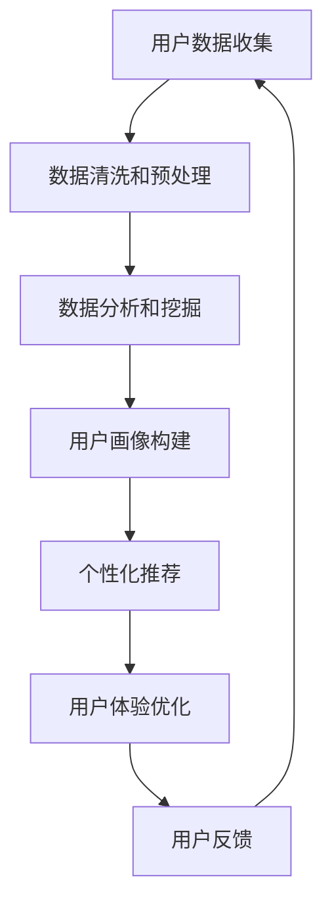

# 金融科技用户体验优化与个性化定制平台

> 关键词：金融科技、用户体验优化、个性化定制、平台架构、数据分析

> 摘要：本文围绕金融科技用户体验优化与个性化定制平台展开深入探讨。在金融科技迅速发展的当下，用户对金融服务的体验和个性化需求日益增长。文章首先介绍了该主题的背景，包括目的、预期读者等内容。接着阐述了核心概念与联系，通过文本示意图和 Mermaid 流程图展示其架构。详细讲解了核心算法原理及具体操作步骤，给出了 Python 源代码示例。分析了相关数学模型和公式，并举例说明。通过项目实战，展示了开发环境搭建、源代码实现及代码解读。探讨了实际应用场景，推荐了相关工具和资源，包括学习资源、开发工具框架、相关论文著作等。最后总结了未来发展趋势与挑战，还提供了常见问题与解答以及扩展阅读和参考资料，旨在为金融科技领域的从业者和研究者提供全面且深入的参考。

## 1. 背景介绍 
### 1.1 目的和范围
金融科技作为金融与科技深度融合的领域，正以迅猛的态势改变着传统金融服务的模式和形态。在这个竞争激烈的市场环境中，用户体验和个性化定制成为金融科技企业提升竞争力的关键因素。本文章的目的在于深入探讨如何构建一个金融科技用户体验优化与个性化定制平台，涵盖从理论基础到实际应用的各个方面。范围包括核心概念的解析、相关算法原理的阐述、数学模型的分析、项目实战案例的展示以及实际应用场景的探讨等，旨在为金融科技从业者和研究者提供全面且系统的指导。

### 1.2 预期读者
本文的预期读者主要包括金融科技领域的从业者，如金融机构的技术人员、产品经理、运营人员等，他们可以从本文中获取优化用户体验和实现个性化定制的具体方法和技术。同时，也适合计算机科学、金融工程等相关专业的学生和研究者，为他们的学术研究和实践探索提供参考。此外，对金融科技感兴趣的投资者和行业观察者也能通过本文了解该领域的发展趋势和技术要点。

### 1.3 文档结构概述
本文共分为十个部分。第一部分是背景介绍，阐述了文章的目的、预期读者和文档结构概述等内容。第二部分介绍核心概念与联系，通过文本示意图和 Mermaid 流程图展示平台的架构。第三部分详细讲解核心算法原理及具体操作步骤，给出 Python 源代码示例。第四部分分析数学模型和公式，并举例说明。第五部分通过项目实战，展示开发环境搭建、源代码实现及代码解读。第六部分探讨实际应用场景。第七部分推荐相关工具和资源，包括学习资源、开发工具框架、相关论文著作等。第八部分总结未来发展趋势与挑战。第九部分是附录，提供常见问题与解答。第十部分给出扩展阅读和参考资料。

### 1.4 术语表
#### 1.4.1 核心术语定义
- **金融科技（Fintech）**：是指金融与科技的融合，利用现代科技手段创新金融服务和产品，提高金融效率和竞争力。
- **用户体验（User Experience，UX）**：是指用户在使用产品或服务过程中的主观感受和体验，包括易用性、满意度、忠诚度等方面。
- **个性化定制（Personalization）**：根据用户的个人特征、偏好、行为等信息，为用户提供个性化的产品、服务或内容。
- **数据分析（Data Analysis）**：是指对大量数据进行收集、整理、清洗、分析和可视化等操作，以发现数据中的规律和价值。
- **人工智能（Artificial Intelligence，AI）**：是指让计算机模拟人类智能的技术，包括机器学习、深度学习、自然语言处理等。

#### 1.4.2 相关概念解释
- **用户画像（User Profile）**：是指根据用户的基本信息、行为数据、偏好等信息，构建的用户模型，用于描述用户的特征和需求。
- **推荐系统（Recommendation System）**：是指根据用户的历史行为、偏好等信息，为用户推荐个性化的产品、服务或内容的系统。
- **大数据（Big Data）**：是指海量、高增长率和多样化的信息资产，需要新处理模式才能具有更强的决策力、洞察发现力和流程优化能力。

#### 1.4.3 缩略词列表
- **AI**：Artificial Intelligence（人工智能）
- **UX**：User Experience（用户体验）
- **API**：Application Programming Interface（应用程序编程接口）
- **ML**：Machine Learning（机器学习）
- **DL**：Deep Learning（深度学习）

## 2. 核心概念与联系 

### 核心概念原理
金融科技用户体验优化与个性化定制平台的核心原理是基于用户数据的收集、分析和挖掘，了解用户的需求和偏好，然后通过个性化的推荐和服务，提高用户的满意度和忠诚度。具体来说，平台通过以下几个步骤实现用户体验优化和个性化定制：
1. **数据收集**：通过多种渠道收集用户的基本信息、行为数据、偏好等信息，包括用户注册信息、交易记录、浏览历史、评价反馈等。
2. **数据清洗和预处理**：对收集到的数据进行清洗和预处理，去除噪声和异常值，统一数据格式，提高数据质量。
3. **数据分析和挖掘**：运用数据分析和挖掘技术，对用户数据进行分析和挖掘，发现用户的需求和偏好，构建用户画像。
4. **个性化推荐**：根据用户画像和用户的实时行为，为用户推荐个性化的产品、服务或内容，提高用户的满意度和转化率。
5. **用户体验优化**：通过不断优化平台的界面设计、交互流程、服务质量等，提高用户的使用体验和满意度。

### 架构的文本示意图
```plaintext
金融科技用户体验优化与个性化定制平台
|-- 数据层
|   |-- 用户数据收集模块
|   |   |-- 注册信息收集
|   |   |-- 交易记录收集
|   |   |-- 浏览历史收集
|   |   |-- 评价反馈收集
|   |-- 数据存储模块
|       |-- 关系型数据库
|       |-- 非关系型数据库
|-- 处理层
|   |-- 数据清洗和预处理模块
|   |-- 数据分析和挖掘模块
|       |-- 用户画像构建
|       |-- 偏好分析
|       |-- 行为预测
|   |-- 个性化推荐模块
|       |-- 基于内容的推荐
|       |-- 基于协同过滤的推荐
|       |-- 混合推荐
|-- 应用层
|   |-- 前端应用
|       |-- 网页端应用
|       |-- 移动端应用
|   |-- 后端服务
|       |-- 用户服务
|       |-- 产品服务
|       |-- 推荐服务
|-- 展示层
|   |-- 个性化界面展示
|   |-- 实时反馈和交互
```

### Mermaid 流程图


## 3. 核心算法原理 & 具体操作步骤 

### 核心算法原理
在金融科技用户体验优化与个性化定制平台中，常用的核心算法包括用户画像构建算法、个性化推荐算法等。以下是对这些算法的详细介绍：

#### 用户画像构建算法
用户画像构建算法的核心是根据用户的基本信息、行为数据、偏好等信息，构建用户的特征模型。常用的用户画像构建算法包括聚类算法、分类算法等。以下是一个基于 K-Means 聚类算法的用户画像构建示例：

```python
import numpy as np
from sklearn.cluster import KMeans

# 模拟用户数据
user_data = np.array([[1, 2, 3], [4, 5, 6], [7, 8, 9], [10, 11, 12]])

# 构建 K-Means 聚类模型
kmeans = KMeans(n_clusters=2, random_state=0)

# 训练模型
kmeans.fit(user_data)

# 获取聚类标签
labels = kmeans.labels_

print("用户聚类标签:", labels)
```

#### 个性化推荐算法
个性化推荐算法的核心是根据用户的历史行为、偏好等信息，为用户推荐个性化的产品、服务或内容。常用的个性化推荐算法包括基于内容的推荐算法、基于协同过滤的推荐算法等。以下是一个基于用户协同过滤的个性化推荐示例：

```python
import numpy as np

# 模拟用户-物品评分矩阵
user_item_matrix = np.array([[5, 3, 0, 1], [4, 0, 0, 1], [1, 1, 0, 5], [1, 0, 0, 4]])

# 计算用户之间的相似度
def cosine_similarity(user1, user2):
    dot_product = np.dot(user1, user2)
    norm_user1 = np.linalg.norm(user1)
    norm_user2 = np.linalg.norm(user2)
    if norm_user1 == 0 or norm_user2 == 0:
        return 0
    else:
        return dot_product / (norm_user1 * norm_user2)

# 计算用户之间的相似度矩阵
num_users = user_item_matrix.shape[0]
similarity_matrix = np.zeros((num_users, num_users))
for i in range(num_users):
    for j in range(num_users):
        similarity_matrix[i][j] = cosine_similarity(user_item_matrix[i], user_item_matrix[j])

# 为用户 0 推荐物品
target_user = 0
num_recommendations = 2

# 找到与目标用户最相似的用户
similar_users = np.argsort(similarity_matrix[target_user])[::-1][1:]

# 推荐物品
recommended_items = []
for user in similar_users:
    for item in range(user_item_matrix.shape[1]):
        if user_item_matrix[target_user][item] == 0 and user_item_matrix[user][item] > 0:
            recommended_items.append(item)
    if len(recommended_items) >= num_recommendations:
        break

print("为用户 0 推荐的物品:", recommended_items[:num_recommendations])
```

### 具体操作步骤
1. **数据准备**：收集用户的基本信息、行为数据、偏好等信息，并进行清洗和预处理。
2. **模型训练**：使用训练数据对用户画像构建算法和个性化推荐算法进行训练。
3. **模型评估**：使用测试数据对训练好的模型进行评估，评估指标包括准确率、召回率、F1 值等。
4. **模型部署**：将训练好的模型部署到生产环境中，为用户提供个性化的推荐和服务。
5. **模型优化**：根据用户的反馈和业务需求，不断优化模型，提高模型的性能和效果。

## 4. 数学模型和公式 & 详细讲解 & 举例说明 

### 用户画像构建的数学模型和公式
在用户画像构建中，常用的数学模型是聚类模型。以 K-Means 聚类算法为例，其目标是将用户数据划分为 $K$ 个簇，使得每个簇内的数据点之间的距离尽可能小，而不同簇之间的数据点之间的距离尽可能大。

#### 目标函数
K-Means 聚类算法的目标函数可以表示为：
$$
J = \sum_{i=1}^{K} \sum_{x \in C_i} \| x - \mu_i \|^2
$$
其中，$K$ 是簇的数量，$C_i$ 是第 $i$ 个簇，$x$ 是数据点，$\mu_i$ 是第 $i$ 个簇的中心。

#### 算法步骤
1. 随机初始化 $K$ 个簇的中心 $\mu_1, \mu_2, \cdots, \mu_K$。
2. 对于每个数据点 $x$，计算其与每个簇中心的距离，将其分配到距离最近的簇中。
3. 重新计算每个簇的中心。
4. 重复步骤 2 和 3，直到簇的中心不再变化或达到最大迭代次数。

#### 举例说明
假设有以下用户数据：
$$
X = \begin{bmatrix}
1 & 2 \\
2 & 3 \\
8 & 9 \\
9 & 10
\end{bmatrix}
$$
我们希望将这些用户数据划分为 2 个簇。

1. 随机初始化 2 个簇的中心：
$$
\mu_1 = \begin{bmatrix}
1 \\
2
\end{bmatrix}, \mu_2 = \begin{bmatrix}
8 \\
9
\end{bmatrix}
$$
2. 计算每个数据点与每个簇中心的距离，将其分配到距离最近的簇中：
    - 对于数据点 $\begin{bmatrix}
1 \\
2
\end{bmatrix}$，其与 $\mu_1$ 的距离为 0，与 $\mu_2$ 的距离为 $\sqrt{(1 - 8)^2 + (2 - 9)^2} = \sqrt{49 + 49} = 7\sqrt{2}$，因此将其分配到簇 1 中。
    - 对于数据点 $\begin{bmatrix}
2 \\
3
\end{bmatrix}$，其与 $\mu_1$ 的距离为 $\sqrt{(2 - 1)^2 + (3 - 2)^2} = \sqrt{2}$，与 $\mu_2$ 的距离为 $\sqrt{(2 - 8)^2 + (3 - 9)^2} = \sqrt{36 + 36} = 6\sqrt{2}$，因此将其分配到簇 1 中。
    - 对于数据点 $\begin{bmatrix}
8 \\
9
\end{bmatrix}$，其与 $\mu_1$ 的距离为 $\sqrt{(8 - 1)^2 + (9 - 2)^2} = \sqrt{49 + 49} = 7\sqrt{2}$，与 $\mu_2$ 的距离为 0，因此将其分配到簇 2 中。
    - 对于数据点 $\begin{bmatrix}
9 \\
10
\end{bmatrix}$，其与 $\mu_1$ 的距离为 $\sqrt{(9 - 1)^2 + (10 - 2)^2} = \sqrt{64 + 64} = 8\sqrt{2}$，与 $\mu_2$ 的距离为 $\sqrt{(9 - 8)^2 + (10 - 9)^2} = \sqrt{2}$，因此将其分配到簇 2 中。
3. 重新计算每个簇的中心：
    - 簇 1 的中心为 $\frac{1}{2} \begin{bmatrix}
1 + 2 \\
2 + 3
\end{bmatrix} = \begin{bmatrix}
1.5 \\
2.5
\end{bmatrix}$。
    - 簇 2 的中心为 $\frac{1}{2} \begin{bmatrix}
8 + 9 \\
9 + 10
\end{bmatrix} = \begin{bmatrix}
8.5 \\
9.5
\end{bmatrix}$。
4. 重复步骤 2 和 3，直到簇的中心不再变化或达到最大迭代次数。

### 个性化推荐的数学模型和公式
在个性化推荐中，常用的数学模型是协同过滤模型。以用户协同过滤为例，其核心思想是找到与目标用户相似的其他用户，然后根据这些相似用户的行为为目标用户推荐物品。

#### 相似度计算
常用的相似度计算方法包括余弦相似度、皮尔逊相关系数等。以余弦相似度为例，其计算公式为：
$$
sim(u, v) = \frac{\sum_{i \in I_{u} \cap I_{v}} r_{u, i} r_{v, i}}{\sqrt{\sum_{i \in I_{u}} r_{u, i}^2} \sqrt{\sum_{i \in I_{v}} r_{v, i}^2}}
$$
其中，$u$ 和 $v$ 是用户，$I_{u}$ 和 $I_{v}$ 是用户 $u$ 和 $v$ 评价过的物品集合，$r_{u, i}$ 和 $r_{v, i}$ 是用户 $u$ 和 $v$ 对物品 $i$ 的评分。

#### 推荐分数计算
对于目标用户 $u$ 和物品 $i$，其推荐分数可以计算为：
$$
\hat{r}_{u, i} = \bar{r}_u + \frac{\sum_{v \in N(u)} sim(u, v) (r_{v, i} - \bar{r}_v)}{\sum_{v \in N(u)} |sim(u, v)|}
$$
其中，$\bar{r}_u$ 和 $\bar{r}_v$ 是用户 $u$ 和 $v$ 的平均评分，$N(u)$ 是与用户 $u$ 相似的用户集合。

#### 举例说明
假设有以下用户-物品评分矩阵：
$$
R = \begin{bmatrix}
5 & 3 & 0 & 1 \\
4 & 0 & 0 & 1 \\
1 & 1 & 0 & 5 \\
1 & 0 & 0 & 4
\end{bmatrix}
$$
我们希望为用户 0 推荐物品。

1. 计算用户之间的相似度：
    - 用户 0 和用户 1 的余弦相似度为：
$$
sim(0, 1) = \frac{5 \times 4 + 3 \times 0 + 0 \times 0 + 1 \times 1}{\sqrt{5^2 + 3^2 + 0^2 + 1^2} \sqrt{4^2 + 0^2 + 0^2 + 1^2}} = \frac{21}{\sqrt{35} \sqrt{17}} \approx 0.85
$$
    - 同理，可以计算出用户 0 与其他用户的相似度。
2. 找到与用户 0 最相似的用户：
假设与用户 0 最相似的用户是用户 1 和用户 2。
3. 计算推荐分数：
对于物品 2，用户 0 没有评分，我们可以根据用户 1 和用户 2 的评分来计算推荐分数：
$$
\hat{r}_{0, 2} = \bar{r}_0 + \frac{sim(0, 1) (r_{1, 2} - \bar{r}_1) + sim(0, 2) (r_{2, 2} - \bar{r}_2)}{sim(0, 1) + sim(0, 2)}
$$
其中，$\bar{r}_0$、$\bar{r}_1$ 和 $\bar{r}_2$ 分别是用户 0、用户 1 和用户 2 的平均评分，$r_{1, 2}$ 和 $r_{2, 2}$ 分别是用户 1 和用户 2 对物品 2 的评分。

4. 根据推荐分数为用户 0 推荐物品。

## 5. 项目实战：代码实际案例和详细解释说明 

### 5.1  开发环境搭建
#### 操作系统
可以选择 Linux（如 Ubuntu）、Windows 或 macOS 作为开发环境的操作系统。

#### 编程语言
选择 Python 作为开发语言，因为 Python 具有丰富的数据分析和机器学习库，非常适合用于金融科技用户体验优化与个性化定制平台的开发。

#### 数据库
可以选择关系型数据库（如 MySQL、PostgreSQL）或非关系型数据库（如 MongoDB、Redis）来存储用户数据和平台的业务数据。

#### 开发工具
推荐使用 PyCharm 作为 Python 开发的集成开发环境（IDE），它提供了丰富的功能和插件，方便代码的编写、调试和管理。

#### 相关库和框架
- **数据分析库**：Pandas、NumPy 用于数据处理和分析。
- **机器学习库**：Scikit-learn 用于机器学习模型的训练和评估。
- **深度学习库**：TensorFlow、PyTorch 用于深度学习模型的开发。
- **Web 框架**：Flask、Django 用于开发平台的 Web 服务。

### 5.2  源代码详细实现和代码解读
以下是一个简单的金融科技用户体验优化与个性化定制平台的示例代码，包括用户数据收集、用户画像构建和个性化推荐三个部分。

```python
import pandas as pd
from sklearn.cluster import KMeans
from sklearn.metrics.pairwise import cosine_similarity

# 用户数据收集
def collect_user_data():
    # 模拟用户数据
    user_data = {
        'user_id': [1, 2, 3, 4],
        'age': [25, 30, 35, 40],
        'income': [5000, 6000, 7000, 8000],
        'risk_preference': [1, 2, 3, 4]
    }
    df = pd.DataFrame(user_data)
    return df

# 用户画像构建
def build_user_profile(df):
    # 提取特征
    features = df[['age', 'income', 'risk_preference']].values

    # 构建 K-Means 聚类模型
    kmeans = KMeans(n_clusters=2, random_state=0)
    kmeans.fit(features)

    # 获取聚类标签
    df['cluster_label'] = kmeans.labels_
    return df

# 个性化推荐
def personalized_recommendation(df, target_user_id):
    # 提取用户特征
    user_features = df[['age', 'income', 'risk_preference']].values

    # 计算用户之间的相似度
    similarity_matrix = cosine_similarity(user_features)

    # 找到目标用户的索引
    target_user_index = df[df['user_id'] == target_user_id].index[0]

    # 找到与目标用户最相似的用户
    similar_users_indices = similarity_matrix[target_user_index].argsort()[::-1][1:]

    # 推荐物品（这里简单模拟为推荐与相似用户相同的风险偏好的产品）
    target_user_risk_preference = df.loc[target_user_index, 'risk_preference']
    recommended_products = []
    for index in similar_users_indices:
        if df.loc[index, 'risk_preference'] == target_user_risk_preference:
            recommended_products.append(f'Product {df.loc[index, "risk_preference"]}')
        if len(recommended_products) >= 2:
            break

    return recommended_products

# 主函数
def main():
    # 收集用户数据
    df = collect_user_data()

    # 构建用户画像
    df = build_user_profile(df)

    # 个性化推荐
    target_user_id = 1
    recommended_products = personalized_recommendation(df, target_user_id)

    print("用户画像：")
    print(df)
    print(f"为用户 {target_user_id} 推荐的产品：")
    print(recommended_products)

if __name__ == "__main__":
    main()
```

### 5.3  代码解读与分析
#### 用户数据收集
`collect_user_data` 函数模拟了用户数据的收集过程，返回一个包含用户基本信息（如年龄、收入、风险偏好）的 Pandas DataFrame。

#### 用户画像构建
`build_user_profile` 函数使用 K-Means 聚类算法对用户数据进行聚类，将用户划分为不同的簇，并将聚类标签添加到 DataFrame 中。

#### 个性化推荐
`personalized_recommendation` 函数计算用户之间的相似度，找到与目标用户最相似的用户，然后根据相似用户的风险偏好为目标用户推荐产品。

#### 主函数
`main` 函数调用上述三个函数，完成用户数据收集、用户画像构建和个性化推荐的整个流程，并打印出用户画像和推荐结果。

## 6. 实际应用场景 
### 金融产品推荐
金融科技用户体验优化与个性化定制平台可以根据用户的风险偏好、投资目标、资产状况等信息，为用户推荐个性化的金融产品，如基金、股票、保险等。通过个性化推荐，可以提高用户的投资收益和满意度，同时也可以增加金融机构的客户粘性和业务收入。

### 信贷风险评估
平台可以收集用户的信用记录、收入状况、负债情况等信息，构建用户画像，然后根据用户画像对用户的信贷风险进行评估。通过个性化的信贷风险评估，可以提高信贷审批的准确性和效率，降低金融机构的信贷风险。

### 客户服务优化
平台可以根据用户的历史行为和偏好，为用户提供个性化的客户服务，如智能客服、专属客户经理等。通过个性化的客户服务，可以提高用户的满意度和忠诚度，增强金融机构的品牌形象。

### 营销活动精准投放
平台可以根据用户的画像和行为数据，为用户精准投放营销活动，如优惠券、理财产品推荐等。通过精准投放，可以提高营销活动的效果和转化率，降低营销成本。

## 7. 工具和资源推荐
### 7.1 学习资源推荐
#### 7.1.1 书籍推荐
- 《Python 数据分析实战》：这本书详细介绍了使用 Python 进行数据分析的方法和技巧，包括数据处理、数据可视化、机器学习等方面的内容。
- 《机器学习》：周志华著，这本书是机器学习领域的经典教材，系统地介绍了机器学习的基本概念、算法和应用。
- 《深度学习》：Ian Goodfellow、Yoshua Bengio 和 Aaron Courville 著，这本书是深度学习领域的权威著作，全面介绍了深度学习的理论和实践。

#### 7.1.2 在线课程
- Coursera 上的“机器学习”课程：由 Andrew Ng 教授授课，是机器学习领域的经典在线课程，涵盖了机器学习的基本概念、算法和应用。
- edX 上的“深度学习”课程：由 MIT 教授授课，系统地介绍了深度学习的理论和实践，包括神经网络、卷积神经网络、循环神经网络等内容。
- 中国大学 MOOC 上的“Python 数据分析与应用”课程：由国内知名高校教授授课，详细介绍了使用 Python 进行数据分析的方法和技巧。

#### 7.1.3 技术博客和网站
- Medium：是一个技术博客平台，上面有很多关于金融科技、数据分析、机器学习等领域的优秀文章。
- Towards Data Science：是一个专注于数据科学和机器学习的技术博客，上面有很多高质量的技术文章和教程。
- Kaggle：是一个数据科学竞赛平台，上面有很多关于金融科技、数据分析、机器学习等领域的数据集和竞赛项目，可以通过参与竞赛来提高自己的技术水平。

### 7.2 开发工具框架推荐
#### 7.2.1 IDE和编辑器
- PyCharm：是一款专门为 Python 开发设计的集成开发环境（IDE），提供了丰富的功能和插件，方便代码的编写、调试和管理。
- Visual Studio Code：是一款轻量级的代码编辑器，支持多种编程语言，包括 Python，具有丰富的插件和扩展功能。

#### 7.2.2 调试和性能分析工具
- PDB：是 Python 自带的调试工具，可以帮助开发者调试代码，查找和解决问题。
- cProfile：是 Python 自带的性能分析工具，可以帮助开发者分析代码的性能瓶颈，优化代码性能。

#### 7.2.3 相关框架和库
- Pandas：是一个用于数据处理和分析的 Python 库，提供了丰富的数据结构和数据操作方法。
- NumPy：是一个用于科学计算的 Python 库，提供了高效的数组操作和数学函数。
- Scikit-learn：是一个用于机器学习的 Python 库，提供了丰富的机器学习算法和工具。
- TensorFlow：是一个用于深度学习的开源框架，由 Google 开发，提供了丰富的深度学习模型和工具。
- PyTorch：是一个用于深度学习的开源框架，由 Facebook 开发，提供了动态计算图和丰富的深度学习模型和工具。

### 7.3 相关论文著作推荐
#### 7.3.1 经典论文
- “Matrix Factorization Techniques for Recommender Systems”：这篇论文介绍了矩阵分解技术在推荐系统中的应用，是推荐系统领域的经典论文。
- “K-Means++: The Advantages of Careful Seeding”：这篇论文介绍了 K-Means++ 算法，是 K-Means 聚类算法的改进版本。
- “Deep Learning”：这篇论文是深度学习领域的综述性论文，全面介绍了深度学习的发展历程、理论和应用。

#### 7.3.2 最新研究成果
- 可以关注顶级学术会议（如 SIGKDD、NeurIPS、ICML 等）和学术期刊（如 Journal of Machine Learning Research、ACM Transactions on Intelligent Systems and Technology 等）上的最新研究成果。

#### 7.3.3 应用案例分析
- 可以参考一些金融科技公司（如蚂蚁金服、腾讯金融科技等）的官方博客和研究报告，了解他们在用户体验优化和个性化定制方面的应用案例和实践经验。

## 8. 总结：未来发展趋势与挑战
### 未来发展趋势
#### 人工智能与金融科技的深度融合
未来，人工智能技术将在金融科技领域得到更广泛的应用，如智能投顾、智能客服、风险评估等。通过人工智能技术，可以提高金融服务的效率和质量，降低成本和风险。

#### 区块链技术的应用
区块链技术具有去中心化、不可篡改、安全可靠等特点，将在金融科技领域得到越来越多的应用，如数字货币、跨境支付、供应链金融等。通过区块链技术，可以提高金融交易的透明度和安全性，降低交易成本。

#### 数据隐私和安全的重视
随着金融科技的发展，用户数据的隐私和安全问题越来越受到关注。未来，金融科技企业将更加重视数据隐私和安全，采用更加先进的技术和措施来保护用户数据的安全。

#### 跨行业融合
金融科技将与其他行业（如医疗、教育、交通等）进行更深入的融合，创造出更多的创新业务和服务模式。例如，金融科技与医疗行业的融合可以实现医疗费用的在线支付、医疗保险的智能理赔等。

### 挑战
#### 技术挑战
金融科技领域涉及到多种技术，如人工智能、区块链、大数据等，这些技术的不断发展和更新对金融科技企业的技术能力提出了更高的要求。同时，如何将这些技术有效地应用到金融服务中，也是一个需要解决的问题。

#### 监管挑战
金融科技的发展给金融监管带来了新的挑战。由于金融科技的创新性和复杂性，传统的金融监管模式可能无法适应金融科技的发展需求。因此，需要建立更加完善的金融监管体系，加强对金融科技的监管。

#### 数据挑战
金融科技的发展离不开大量的数据支持，但是数据的收集、存储、处理和分析等环节都存在一定的风险和挑战。例如，数据的质量和准确性、数据的隐私和安全等问题都需要得到解决。

#### 人才挑战
金融科技领域需要既懂金融又懂技术的复合型人才，但是目前这类人才相对匮乏。因此，需要加强对金融科技人才的培养和引进，提高金融科技企业的人才素质和创新能力。

## 9. 附录：常见问题与解答
### 1. 如何确保用户数据的安全和隐私？
为了确保用户数据的安全和隐私，可以采取以下措施：
- **数据加密**：对用户数据进行加密处理，确保数据在传输和存储过程中的安全性。
- **访问控制**：建立严格的访问控制机制，限制对用户数据的访问权限，只有授权人员才能访问用户数据。
- **数据匿名化**：在对用户数据进行分析和挖掘时，采用数据匿名化技术，保护用户的隐私。
- **安全审计**：定期对用户数据的安全和隐私进行审计，及时发现和解决安全隐患。

### 2. 如何选择合适的个性化推荐算法？
选择合适的个性化推荐算法需要考虑以下因素：
- **数据特点**：不同的个性化推荐算法适用于不同的数据特点，如用户-物品评分矩阵的稀疏性、数据的规模等。
- **业务需求**：根据业务需求选择合适的个性化推荐算法，如需要推荐相似的物品还是需要推荐用户可能感兴趣的物品。
- **算法性能**：考虑算法的性能，如计算复杂度、准确性、召回率等。

### 3. 如何评估个性化推荐系统的效果？
可以使用以下指标来评估个性化推荐系统的效果：
- **准确率（Precision）**：推荐的物品中用户感兴趣的物品所占的比例。
- **召回率（Recall）**：用户感兴趣的物品中被推荐出来的物品所占的比例。
- **F1 值**：准确率和召回率的调和平均数，综合考虑了准确率和召回率。
- **覆盖率（Coverage）**：推荐系统能够推荐的物品集合占所有物品集合的比例。

### 4. 如何处理用户数据中的缺失值和异常值？
处理用户数据中的缺失值和异常值可以采用以下方法：
- **缺失值处理**：可以采用删除缺失值、填充缺失值（如均值填充、中位数填充等）、使用机器学习算法预测缺失值等方法。
- **异常值处理**：可以采用删除异常值、替换异常值、使用机器学习算法检测和处理异常值等方法。

## 10. 扩展阅读 & 参考资料
### 扩展阅读
- 《金融科技前沿：技术驱动的金融创新》：这本书介绍了金融科技的前沿技术和应用，包括人工智能、区块链、大数据等，对金融科技的发展趋势和未来前景进行了深入探讨。
- 《数字金融时代：科技重塑金融未来》：这本书探讨了数字金融时代的发展趋势和挑战，分析了科技如何重塑金融未来，对金融科技的创新模式和应用案例进行了详细介绍。

### 参考资料
- 《Python 数据分析实战》：作者：Sebastian Raschka，出版社：机械工业出版社。
- 《机器学习》：作者：周志华，出版社：清华大学出版社。
- 《深度学习》：作者：Ian Goodfellow、Yoshua Bengio 和 Aaron Courville，出版社：人民邮电出版社。
- Coursera 在线课程：https://www.coursera.org/
- edX 在线课程：https://www.edx.org/
- 中国大学 MOOC 在线课程：https://www.icourse163.org/
- Medium 技术博客：https://medium.com/
- Towards Data Science 技术博客：https://towardsdatascience.com/
- Kaggle 数据科学竞赛平台：https://www.kaggle.com/
- SIGKDD 学术会议：https://www.kdd.org/
- NeurIPS 学术会议：https://neurips.cc/
- ICML 学术会议：https://icml.cc/
- Journal of Machine Learning Research 学术期刊：https://jmlr.org/
- ACM Transactions on Intelligent Systems and Technology 学术期刊：https://dl.acm.org/journal/tist
- 蚂蚁金服官方博客：https://tech.alipay.com/blog/
- 腾讯金融科技官方博客：https://fintech.tencent.com/